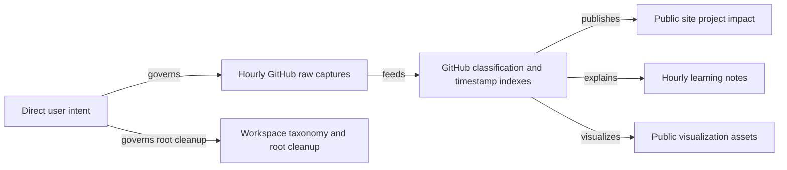

# Current Mermaid Object Graph

Truth source: `.mermaid/current/graph.json`

```mermaid
flowchart LR
  intent_direct_user_input["Direct user intent"]
  raw_github_hourly_captures["Hourly GitHub raw captures"]
  processed_github_classification["GitHub classification and timestamp indexes"]
  work_learning_notes["Hourly learning notes"]
  results_public_site["Public site project impact"]
  results_public_visualizations["Public visualization assets"]
  ops_workspace_taxonomy["Workspace taxonomy and root cleanup"]
  intent_direct_user_input -->|governs| raw_github_hourly_captures
  raw_github_hourly_captures -->|feeds| processed_github_classification
  processed_github_classification -->|publishes| results_public_site
  processed_github_classification -->|explains| work_learning_notes
  processed_github_classification -->|visualizes| results_public_visualizations
  intent_direct_user_input -->|governs root cleanup| ops_workspace_taxonomy
```
