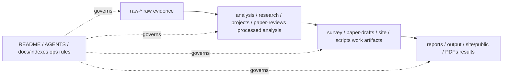

# Awesome Self-Evolving AI Agents / AI Agent Self-Evolution Index and Survey

**Author / Attribution:** aha team

[Chinese main README](README.md) | [English](README-EN.md) | [Chinese mirror](README-ZH.md)


## One Sentence

This repository is a Chinese-first Awesome index, survey entry point, project model-card library, paper pipeline, and SEO site source for AI Agent self-evolution / self-improvement.

## Three Sentences

1. README is the first entry point: the most valuable classifications, methods, benchmarks, projects, papers, community signals, and links must be placed directly here so readers do not need to browse the directory first.
2. `survey/` and `paper-drafts/` keep reviewer-grade expanded versions; README carries the main content, categories, methods, benchmarks, projects, and evidence links directly.
3. The whole repository is governed by the `raw -> processed -> work -> results` pipeline: raw is evidence, processed is interpretation, work is papers/sites/scripts, and results are publishable outputs.

## Five Sentences

1. The core question in this field is not "whether there is an agent", but "what exactly the agent improves, what proves the improvement, and whether the improvement transfers to real tasks".
2. The current evidence layer includes 550 GitHub raw captures, 550 classified repositories, 140 site projects, 84 strict self-evolution repositories, and 189 broad evolution-related repositories.
3. The method map compresses into six families: reward/RL/self-play, prompt/search, memory, architecture/code self-modification, multi-agent reflection/debate, and evaluation/safety/governance.
4. Benchmarking is one of the main contradictions of this project: SWE-Bench, HumanEval, OSWorld, BrowserGym, AgentBench, LongMemEval, STATE-Bench, and related benchmarks must be compared in one table rather than scattered across project pages.
5. The goal of this README is to give readers the cognitive structure directly; links serve as evidence and expanded material, not as prerequisites for understanding.

## Core History, Future, and Trend Tracker

One sentence: the history of AI Agent self-evolution moves from lightweight prompt/reflection self-correction, to engineered memory/skill/harness accumulation, and then toward auditable co-evolution of code, architecture, evaluators, and organizations.

Three sentences: the early focus was retrying, reflecting, changing prompts, or selecting better candidates under feedback; the middle phase turned agent runtimes, multi-agent workflows, benchmark harnesses, and executable code/algorithm search into the main substrate; the future problem is to turn improvement into verifiable, rollbackable, transferable, governable infrastructure. Do not read the field by project names alone; read it across time by asking what becomes mutable, where selection pressure comes from, and whether the evidence is independent. Every future README update should track trends here, judging which directions are truly rising and which are only short-term attention.

### Historical Arc

| Stage | Time signal | Core shift | Representative evidence | Guidance for readers |
|---|---|---|---|---|
| Lightweight self-improvement | 2022-2023 | One-shot answers become feedback/reflection/prompt-search loops. | OpenELM, DSPy, Reflexion, Self-Refine, OPRO, FunSearch | Learn the basic questions first: what changes, how is it evaluated, and how is experience retained. |
| Agent runtimes and multi-agent systems | 2023-2024 | AutoGPT, CAMEL, MetaGPT, AutoGen, and LangGraph turn tools, roles, workflows, and state machines into engineering substrates. | [release timeline](analysis/github-project-data-analysis.md#analyzed-project-release-timeline), [project taxonomy](#project-taxonomy-table) | A framework is not self-evolution by itself; it enters the core only when evaluator, memory, and update mechanisms are attached. |
| Architecture/code/algorithm self-modification | 2024-2025 | ADAS, DGM, AlphaEvolve, OpenEvolve, and SE-Agent put architecture, code, programs, and algorithm candidates into the search space. | [ADAS](research/papers/04-adas.md), [DGM](research/papers/02-darwin-godel-machine.md), [AlphaEvolve](research/papers/08-alphaevolve.md) | Code and algorithms are likely to land first because tests, sandboxes, regression, and archives provide strong evidence. |
| Memory / skill / harness infrastructure | 2025-2026 | Memory, skills, evaluation, and harnesses heat up together; current raw classification has memory 105, evaluation 96, evolution 82, and skill 70. | [GitHub analysis](analysis/github-project-data-analysis.md), [method taxonomy](survey/figures/method-taxonomy-mermaid.md) | The next value layer is installable skills, auditable memory, trustworthy harnesses, and reporting standards, not more demos. |

### Future Roadmap

| Priority | Future direction | Maturity signal | Current evidence |
|---:|---|---|---|
| 1 | Standardized verifier libraries | Code, web, business workflows, memory, safety, and cost all have rerunnable evaluators. | [survey ch8](survey/ch8-future-cn.md), [benchmark rules](#benchmark-judgment-rules) |
| 2 | Self-evolution reporting standard | Each improvement reports time slice, validation/test isolation, failed candidates, cost, rollback, and safety events. | [GitHub evidence](#git--github-evidence-layer), [required validation](#required-validation) |
| 3 | Auditable memory and skill assets | Experience is versioned, forgettable, transferable, and security-scannable, not only free text. | [Memory / lifelong learning](#method-taxonomy-table), [Skills / reusable know-how](#project-taxonomy-table) |
| 4 | Archive / lineage infrastructure | Every prompt, skill, workflow, and code diff has source, evaluation, inheritance, and rollback points. | [DGM](research/papers/02-darwin-godel-machine.md), [OpenEvolve](projects/algorithmicsuperintelligence__openevolve.md) |
| 5 | Heterogeneous multi-agent collaboration | Generators, validators, red teams, cost controllers, and auditors have independent tools and independent error distributions. | [Multi-agent reflection / debate](#method-taxonomy-table), [survey ch8](survey/ch8-future-cn.md) |
| 6 | Cross-domain transfer benchmarks | Gains cannot hold only on one leaderboard; they must transfer across new tasks, time slices, environments, and models. | [survey ch8](survey/ch8-future-cn.md) |

### Trend Tracker

| Tracking item | Current baseline | How to update | How to read the trend |
|---|---:|---|---|
| GitHub corpus funnel | 550 raw captures / 550 classified / 140 model-card projects / 84 strict / 189 broad | `node scripts/analyze_github_project_data.mjs` | Strict and broad rising together means the core and infrastructure both expand; only broad rising may mean the concept is getting looser. |
| Theme heat | memory 111, evaluation 104, evolution 84, skill 73, framework 58, education-list 35, research-agent 32, prompt-optimization 26, coding-agent 17, workflow-automation 7, safety 1 | `research/repo-classification.json` + GitHub analysis | Evaluation, memory, and skills rising together means the field is shifting from whether agents evolve to how we prove, accumulate, and reuse improvement. |
| Time slice | 2026-05 390, unknown 106, 2024-Q2 7, 2026-03 7, 2026-04 7, 2025-11 5, 2024-Q3 4, 2026-02 4, 2025-05 3, early 3, other 14 | Time signal: recent additions concentrate in skills, memory, harness, evaluation, and self-modifying code. |
| Benchmark coverage | 125 benchmark-eval function-tagged repos | README benchmark matrix + `analysis/github-project-data-analysis.md` | Benchmark growth matters only when hidden tests, failure traces, cost, and transfer are reported, not when leaderboards multiply. |
| Paper frontier | 108 detailed paper references, including 2026 frontier additions | `research/agent-self-evolution-papers-detailed.md` | New papers should enter README only after extracting mutable object, feedback, update, benchmark, and limitations. |
| Product usability | 140 site-data projects / 341 public project reports | `projects/INDEX.md` + `site/public/reports/projects/INDEX.md` | Trend judgment must include runnability, docs, real workflows, maintenance, and user value, not only stars. |

When updating this section, add raw evidence first, then update processed classification and README judgments, then refresh `docs/indexes/` and the site build. If the trend judgment changes, state which evidence changed instead of changing the conclusion alone.

## Start Here: Processed Full Classification Overview

This section is intentionally placed first and contains only processed information: classifications, judgments, value ranking, and reusable conclusions. Raw links and complete expanded lists appear later as evidence and copyable retrieval sections.

### 0. Reading Priority

| Priority | What to read first | Why it is valuable |
|---:|---|---|
| 1 | Core history, future, and trend tracker | Understand where the technical line came from, where it is going, and which trend signals each update must track. |
| 2 | Definition of self-evolution, method families, benchmark judgment rules | Know what counts as self-evolution, how to prove it, and how to prevent metric gaming. |
| 3 | GitHub corpus funnel, classification axes, strict/broad evolution subsets | Read the processed structure first instead of blindly searching 530 raw captures. |
| 4 | Public model-card project groups | 134 site projects and 335 public report projects have already been processed by role, mechanism, evidence, and report entry point for direct comparison. |
| 5 | Paper method map | 108 papers are grouped by framework/method/RL/reflection/memory/alignment/benchmark/safety instead of being a flat bibliography. |
| 6 | Full list retrieval section | Use the full project, repo, paper, and benchmark lists when you need to copy, filter, or reprocess the data. |

### 1. Corpus Funnel

| Layer | Current scale | Processed meaning |
|---|---:|---|
| Raw GitHub captures | 550 | Original discovery layer; keeps evidence, timestamps, and sources, not conclusions. |
| Classified repositories | 550 | Every repository is assigned category, theme, function tag, and time slice. |
| Public model-card projects | 140 | Enters the project page/report system and is suitable for teaching, comparison, and publication. |
| Public project report files | 341 | Publishable site result layer, including historical/compatibility reports and public site material. |
| Strict self-evolution repos | 84 | Core subset: directly contains self-improvement, evolution, search, reflection, mutation, or feedback loops. |
| Broad evolution-related repos | 189 | Supporting layer: memory, skill, evaluation, harness, coding-agent, and prompt optimization. |
| Detailed paper references | 108 | Paper evidence layer, organized into 14 research categories plus 2026 frontier additions. |
| Benchmark/evaluation related repos | 195 | Evaluation-related repository set for comparing what is measured, how it is measured, and whether it is trustworthy. |

### 2. Full GitHub Classification Axes

| Axis | Full distribution | How to read it |
|---|---|---|
| Collection category | framework 155, evaluation 109, tutorial 102, tool 101, application 49, paper-code 33, benchmark 1 | Repository shape: frameworks dominate, but skill/tool growth is now an important infrastructure signal. |
| Base theme | memory 111, evaluation 104, evolution 84, skill 73, framework 59, education-list 35, research-agent 32, prompt-optimization 26, coding-agent 17, workflow-automation 8, safety 1 | Theme center: memory, evaluation, evolution, and skill are the four densest supports. |
| Function tag | benchmark-eval 129, framework-runtime 127, resource-index 110, tool-module 96, application-demo 29, research-artifact 20, agent-evolution-infra 14, memory-substrate 12, skill-orchestration 6, memory-runtime 4, research-agent-pipeline 3 | Functional role: benchmark/eval, runtime, resource index and tool modules form the main public evidence surfaces. |
| Time slice | 2026-05 363, unknown 107, 2024-Q2 7, 2026-03 7, 2026-04 7, 2025-11 5, 2024-Q3 4, 2026-02 4, 2025-05 3, early 3, other 14 | Time signal: recent additions concentrate in skills, memory, harness, evaluation, and self-modifying code. |

### 3. Public Model-Card Project Groups

| Group | Projects | Representative repositories | Processed judgment |
|---|---:|---|---|
| Evolutionary code / AlphaEvolve-like | 3 | openevolve, science-codeevolve, SE-Agent | Closest to executable self-improvement: code variants, evaluators, selection, and iteration. |
| LLM as optimizer | 3 | OPRO, OpenELM, FunSearch | Uses the LLM as a search/optimization operator; useful for prompts, programs, and algorithm discovery. |
| Agent architecture auto-search | 1 | ADAS | Treats agent architecture itself as the search space, a core paper line for self-evolving system design. |
| Agent self-evolution systems | 4 | AgentEvolver, AIWaves agents, SCOPE, agentos | Focuses on how experience, context, evaluation, and agent workspaces keep updating. |
| Reflection / refinement classics | 2 | Reflexion, Self-Refine | The most reused lightweight self-improvement pattern, but easy to overfit to immediate feedback. |
| Safety, judgment, and data/model self-evolution | 2 | DARWIN, LLM-Self-Judge | Judges, data, and safety policies also evolve, so reward hacking must be controlled. |
| Declarative prompt optimization | 1 | DSPy | Compiles prompts/programs into optimizable objects; high engineering value. |
| Multi-agent collaboration frameworks | 5 | MetaGPT, CrewAI, AutoGen, CAMEL, AgentVerse | Not self-evolution by default; only enters the core when evaluation, memory, and improvement loops are added. |
| Graph-based agent orchestration | 1 | LangGraph | Good substrate for auditable workflow graphs and state machines. |
| AI software engineering | 5 | AutoGPT, SWE-Agent, OpenHands, Devika, OpenDevin | Easiest to connect with real repositories, tests, and regression validation. |
| AutoML / ML knowledge-driven | 2 | automl-agent, CoML | Strong connection with classic automated search and AutoML. |
| Reflective evolutionary search | 2 | ReEvo, LLaMEA | Combines reflection and evolutionary search, suitable for algorithm/optimization tasks. |
| Evolutionary prompt/context optimization | 1 | EvoPrompt | Low cost and rollback-friendly, but most prone to benchmark-specific overfitting. |
| Evolutionary multi-agent systems | 4 | EvoAgent, EvoAgentX, EverOS, A-Evolve | Cross-zone of multi-agent systems, memory, workspace, and benchmarks. |
| LLM-driven evolutionary computation | 5 | OpenTreeSearch, LLM4EC, LLM4Opt, LLM_EA, tutorial_gp_llm | Connects LLM agents with evolutionary computation, combinatorial optimization, and genetic programming. |
| Quality diversity optimization | 1 | pyribs | Provides archive/diversity ideas to avoid climbing only a single score hill. |
| Classic evolutionary algorithm frameworks | 3 | DEAP, pycma, Nevergrad | Non-LLM evolution/search baselines that should not be hidden by new agent terminology. |
| AutoML framework | 1 | auto-sklearn | Reference system for traditional automated improvement. |
| Self-evolving agent surveys | 2 | Self-Evolving-Agents, self-improvement-llm | Used to check whether the taxonomy misses research branches. |
| LLM agent optimization | 1 | LLM-Agent-Optimization | Resource-index material for supplementing terminology and links. |
| Code models and evaluation | 4 | Awesome-Code-LLM, AgentBench, RL4CO, Awesome-FM4CO | Places code, agent, and combinatorial-optimization benchmarks in one evidence layer. |
| Genetic programming | 1 | pureples | Older method / new model crossover sample for GP + LLM. |
| Harness / skill / memory evolution | 98 | OpenClaw/Hermes/Mem0/LangMem/Graphiti/Skills series | Largest engineering cluster; long-term value lies in installable skills, auditable memory, and runnable harnesses. |
| Personal-agent products and real evaluation | 33 | OpenClaw, PinchBench, Claw-Eval, OSWorld, BrowserGym, STATE-Bench | Best tests of whether users actually want the system and whether benchmarks match real tasks. |
| Harness evolution and method indexes | 12 | harness-evolver, OpenHarness, AutoResearchClaw, SkillRL, OpenSpace | Connects tool permissions, execution environments, evaluators, and skill learning into system engineering. |

### 4. High-Value Direction Ranking

| Rank | Direction | Why it ranks high | Main risk |
|---:|---|---|---|
| 1 | Evaluation / benchmark / harness control | Self-evolution needs selection pressure; without a trustworthy evaluator, there is no trustworthy improvement. | Goodharting, hidden-test leakage, LLM judge bias. |
| 2 | Code/self-modifying agents | Code has tests, regression checks, and sandboxes, making closed-loop evidence easiest to establish. | Candidate code side effects, evaluator modification, only fixing the benchmark. |
| 3 | Memory / state substrate | The real mutable objects of long-term agents are often memory, experience, and user/project state. | Memory pollution, stale information, privacy, and inherited wrong experience. |
| 4 | Skills / reusable know-how | Skills turn experience into installable, testable, transferable assets. | Merely stacking prompt files without validation or security controls. |
| 5 | Prompt / program optimization | Fastest to land with black-box models, low cost, and easy rollback. | Context rot, prompt overfit, accumulated reflection errors. |
| 6 | Multi-agent reflection / debate | Creates heterogeneous hypotheses and review gates; useful for research and software delivery. | Multi-agent consensus hallucination, communication cost, unclear responsibility. |
| 7 | Open-ended evolution / architecture search | High long-term ceiling, potentially discovering non-human-designed structures. | Large search space, expensive evaluation, hard reproducibility. |

## Highest-Value Content

| Problem you need to solve | Direct answer in this README | Evidence source |
|---|---|---|
| What does the full survey say? | A self-evolving agent is not one-shot QA ability; it is a system of model, tools, memory, environment, evaluator, and code that can change prompt, memory, skill, workflow, agent code, or model policy under feedback, then prove the change through independent evaluation. | [survey/latex/main.pdf](survey/latex/main.pdf), [survey/latex/main.tex](survey/latex/main.tex) |
| What methods exist? | Six main lines: reward/RL/self-play provides selection pressure; prompt/search changes context and candidate programs; memory preserves long-term experience; architecture/code self-modification changes agent structure; multi-agent reflection/debate uses heterogeneous roles to correct errors; evaluation/safety/governance keeps change inside verifiable boundaries. | [survey/ch3-methods-cn.md](survey/ch3-methods-cn.md), [method taxonomy](survey/figures/method-taxonomy-mermaid.md) |
| How should benchmarks be read? | Do not look only at final score. Check whether the validator is independent, tasks are isolated, hidden tests exist, transfer is measured, cost/failure/rollback rates are reported, and Goodharting is controlled. | [survey/ch5-evaluation-cn.md](survey/ch5-evaluation-cn.md), [code benchmark note](projects/code-generation-evolution/05-benchmarks.md) |
| What is the GitHub corpus? | Currently 550 raw GitHub captures, 550 classified repositories, 140 site projects, 84 strict self-evolution repositories, and 189 broad related repositories, all unified by category, theme, function, and time slice. | [analysis/github-project-data-analysis.md](analysis/github-project-data-analysis.md), [repo classification](research/repo-classification.md) |
| How should projects be compared? | Read each project by what it is, what evolves, what feedback is used, whether it can run, whether it has benchmarks, whether it is product-usable, and what its limits are, instead of only reading stars. | [projects/INDEX.md](projects/INDEX.md), [public project reports](site/public/reports/projects/INDEX.md) |
| How should papers be used? | Papers are method evidence, not a standalone list: extract evolvable object, feedback signal, update mechanism, benchmark, claim, limitation, and reproducibility from each paper. | [Chinese paper index](research/agent-self-evolution-papers-detailed-ZH.md), [English paper index](research/agent-self-evolution-papers-detailed.md) |
| What are community/X/blog signals for? | Community signals reveal real pain, engineering disputes, hype illusions, and adoption signals. They do not replace papers or code, but they show where benchmarks detach from business value. | [Chinese social index](output/social-media-curated-ZH.md), [English social index](output/social-media-curated.md) |
| How should author/source networks be read? | Authors, labs, blogs, and rankings help judge propagation paths, credibility, duplicated signals, and community influence; they are not technical maturity by themselves. | [author network](research/author-network.md), [blog/source profiles](research/blog-author-profiles-all.md) |
| What does the public site do? | The site serves SEO, blog, project pages, and graph browsing; README is the cognitive entry point, while the site is the browsing and publishing surface. | [GitHub Pages](https://shiyao-huang.github.io/awesome-agent-evolution/) |
| How is the repository maintained? | New content is first assigned to raw/processed/work/results/ops; long-term artifacts must enter indexes; changes affecting papers or the site must run matching validation. | [master index](docs/indexes/master-index.md), [project structure](docs/project-management/project-structure.md) |

## Survey Main Content

| Chapter | Conclusion embedded in README | Evidence document |
|---|---|---|
| Chapter 1 Introduction | Agent Evolution means the system has mutable state or structure, feedback signals, an update/selection mechanism, and auditable improvement. Plain ReAct, planner-executor, or manually written workflows are not self-evolution; a system enters scope only when it changes its own prompt, memory, tool policy, code, evaluator, or collaboration structure under feedback. | [ch1](survey/ch1-intro-cn.md) |
| Chapter 2 Theory | Four theoretical roots: evolutionary computation provides generate-mutate-select-retain; Godel machines provide self-reference and self-modification awareness; meta-learning/self-training provides learning how to learn from historical tasks; RL/online learning/program synthesis formalize goals, policies, environments, and update operators. | [ch2](survey/ch2-theory-cn.md) |
| Chapter 3 Method Taxonomy | Methods are layered by primary selection pressure and primary mutable object: reward, self-play, prompt, architecture/code, memory, and mixed loops. The key is not the term, but asking what changes, where feedback comes from, how it is retained, and how effectiveness is proven. | [ch3](survey/ch3-methods-cn.md) |
| Chapter 4 Systems Analysis | Representative systems should be read as product runtimes, research prototypes, benchmark harnesses, memory substrates, skill systems, agent-architecture search, and self-modifying coding agents. Valuable systems leave reusable assets, not only a one-off demo. | [ch4](survey/ch4-systems-cn.md) |
| Chapter 5 Evaluation | Evaluation is both paper evidence and selection pressure inside the evolution loop. SWE-Bench, HumanEval, OSWorld, BrowserGym, LongMemEval, and others cover different slices; mature evaluation must also measure iterative gain, transfer, diversity, safety, cost, and accumulated assets. | [ch5](survey/ch5-evaluation-cn.md) |
| Chapter 6 Industrial Practice | Industrial landing should not let agents freely mutate everything. Instead, constrain changes to low-risk layers: prompt, playbook, memory, skill, test harness, and tool config; every candidate change should pass sandbox, CI, audit, and rollback. | [ch6](survey/ch6-industry-cn.md) |
| Chapter 7 User Pain Points | Community pain points cluster around reliability, cost, observability, mismatch between benchmarks and real work, long-term memory pollution, tool permissions, and governance. Mom Test signals remind us that high benchmark scores and high stars do not equal user adoption. | [ch7](survey/ch7-painpoints-cn.md) |
| Chapter 8 Future Directions | Priorities: verifier libraries, reporting standards, auditable memory, archives/lineage, heterogeneous multi-agent collaboration, and cross-domain transfer benchmarks. Maturity is not claiming autonomy, but answering why the change happened, what the evidence is, how rollback works, and whether it transfers. | [ch8](survey/ch8-future-cn.md) |
| Figures/data | Current figures show reward/RL/self-play as a dense method family; production gap, evaluation gap, memory drift, governance, and cost as high-risk mismatches in cross-source validation; framework radar is navigation, not a performance ranking. | [figures](survey/figures/README.md), [coverage](survey/figures/data-coverage-dashboard.md), [validation](survey/figures/cross-source-validation-map.md) |

## Reading Principles

| Question | Judgment standard |
|---|---|
| Is it self-evolution? | It must have a mutable object, feedback signal, update/selection mechanism, and auditable result; otherwise it is ordinary agent engineering. |
| Is it useful? | Check whether it can run, has real tasks, has documentation, is reproducible, and solves user pain, not only stars or paper title. |
| Is it trustworthy? | Check whether validation/tests are isolated, whether transfer is measured, whether failed candidates are reported, whether costs are included, and whether evaluator tampering is prevented. |
| Is it publishable? | Raw, processed, work, and results layers are clear; README is readable; project pages teach; paper/site builds work. |

## Method Taxonomy Table

| Method family | What evolves | Selection pressure / feedback | Representative papers or systems | Evidence source |
|---|---|---|---|---|
| Reward / RL / self-play | policies, reasoning traces, preferences, training data | reward, win/loss, correctness, judge, executor | STaR, Self-Rewarding LM, Meta-Rewarding, RISE, RAGEN, Absolute Zero, SPIRAL | [method chapter 3.1-3.2](survey/ch3-methods-cn.md), [RAGEN](research/papers/10-ragen.md), [Absolute Zero](research/papers/07-absolute-zero.md) |
| Prompt / search optimization | prompts, context, principles, playbooks, candidate programs | self-feedback, textual gradients, LLM-as-optimizer, programmatic evaluator | Self-Refine, Reflexion, DSPy, OPRO, EvoPrompt, SCOPE, ACE | [Self-Refine](research/papers/06-self-refine.md), [Reflexion](research/papers/05-reflexion.md), [DSPy](site/public/reports/projects/10-dspy-declarative-llm-programming.md), [SCOPE](projects/jarvispei__scope.md) |
| Memory / lifelong learning | episodic memory, semantic memory, skill libraries, user/project state | retrieval success, long-horizon performance, conflict handling, experience reuse | Voyager, ExpeL, ReasoningBank, Memory-R1, AriadneMem, Mem0, LangMem, Graphiti | [method chapter 3.5](survey/ch3-methods-cn.md), [Mem0](projects/58-mem0-agent-memory.md), [LangMem](projects/70-langmem-agent-memory.md), [Graphiti](projects/71-graphiti-temporal-context-graphs.md) |
| Architecture / code self-modification | agent architecture, tool flow, codebase, multi-agent topology | benchmarks, unit tests, hidden tests, archive selection | ADAS, DGM, Godel Agent, SICA, AlphaEvolve, OpenEvolve, A-Evolve | [ADAS](research/papers/04-adas.md), [DGM](research/papers/02-darwin-godel-machine.md), [OpenEvolve](projects/algorithmicsuperintelligence__openevolve.md), [A-Evolve](projects/115-a-evolve-universal-agent-evolution.md) |
| Multi-agent reflection / debate | roles, communication edges, critics, review workflows, collaboration protocols | debate score, peer review, task success, review gate | EvoMAC, Agent Symbolic Learning, MetaGPT, AutoGen, CORAL, MOLT | [Agent Symbolic Learning](research/papers/01-agent-symbolic-learning.md), [MetaGPT](projects/07-metagpt-multi-agent-framework.md), [AutoGen](site/public/reports/projects/11-autogen-multi-agent-conversation.md), [CORAL](projects/89-coral-multi-agent-evolution.md) |
| Evaluation / safety / governance | evaluators, permissions, rollback, audit, red lines, cost models | regression tests, safety rules, human review, cross-domain transfer | REVEAL, RAGEN, Claw-Eval, AgentBench, SKILL-INJECT, HaluMem | [evaluation chapter](survey/ch5-evaluation-cn.md), [REVEAL](research/papers/12-reveal.md), [Claw-Eval](projects/55-claw-eval-agent-evaluation.md), [HaluMem](projects/177-halumem-agent-memory-hallucination-benchmark.md) |

## Method Family Details

| Method family | How it works | When to prioritize it | Main failure mode |
|---|---|---|---|
| Reward / RL / self-play | Creates measurable tasks, rewards, or adversaries; the system improves by repeatedly solving, scoring, and retaining behaviors. It is closest to classic learning loops. | When there is a clear environment, reward, simulator, verifier, or game-like interaction. | Reward hacking, simulator overfit, self-generated easy tasks, no evidence of transfer. |
| Prompt / search optimization | Treats prompts, principles, playbooks, and candidate programs as searchable objects, uses LLM or evolutionary operators to generate variants, then selects by score. | When the model is a black box, cost is limited, rollback is needed, or deployment only allows prompt/context changes. | Prompt overfitting, context rot, textual feedback that sounds plausible but is wrong, repeated retry inflation. |
| Memory / lifelong learning | Writes experience, user preference, project state, lessons, failures, and skills into persistent memory; retrieval and consolidation change later behavior. | Long-horizon personal agents, coding agents, research agents, customer/workflow agents. | Memory pollution, stale facts, privacy leakage, conflict between old and new user preference, retrieval masking real reasoning weakness. |
| Architecture / code self-modification | Lets the agent modify workflows, tools, code, or its own implementation, then accepts or rejects candidates through tests or benchmarks. | Coding agents, algorithm discovery, research automation, or systems with strong sandbox and CI. | Candidate code breaks invariants, evaluator is weak, generated patch optimizes only visible tests, recursive modification becomes uninspectable. |
| Multi-agent reflection / debate | Uses heterogeneous roles to create multiple hypotheses, review each other, or let generator and verifier co-evolve. Its value is independent error distributions from different models/tools/retrieval/evaluation criteria, not role names. | Complex research, software delivery, open-ended planning, workflows needing critic/reviewer/red-team gates. | Consensus hallucination, agents reinforcing the same mistake, exploding communication cost, unclear responsibility. |
| Evaluation / safety / governance | Treats evaluator, permissions, audit, cost, rollback, and safety rules as first-class parts of the self-evolving system. It does not directly make the agent smarter, but decides which changes can be inherited. | Any system that runs long-term, edits memory, prompts, tools, code, or user data. | Optimizing a single score, ignoring cost and safety, no failed samples, no human governance threshold, turning self-evolution into metric gaming. |

## Benchmarks / Evaluation Matrix

| Benchmark class | Representative benchmarks / projects | What it measures | Core question for self-evolution | Evidence source |
|---|---|---|---|---|
| Function-level code | HumanEval, MBPP, LeetcodeHardGym | function correctness, code generation, self-correction | Did the score improve from a real strategy, or from prompt/retry tuning? | [Reflexion](projects/noahshinn__reflexion.md), [survey ch5](survey/ch5-evaluation-cn.md) |
| Repository-level software engineering | SWE-Bench, SWE-Bench Verified, Polyglot, LiveCodeBench | real issues, patches, tests, cross-language tasks | Can the agent edit real repositories, and are hidden tests/regressions present? | [DGM](research/papers/02-darwin-godel-machine.md), [A-Evolve](projects/115-a-evolve-universal-agent-evolution.md), [OpenHands Benchmarks](projects/114-openhands-benchmarks.md) |
| General agent evaluation | AgentBench, GAIA, AppWorld, ALFWorld, WebShop | multi-step tasks, tool use, interactive environments | Does it measure agentic behavior rather than one-shot answers? | [AgentBench](site/public/reports/projects/38-agentbench.md), [survey ch5](survey/ch5-evaluation-cn.md) |
| Computer-use / Web | OSWorld, WindowsAgentArena, BrowserGym, WebArena, WebVoyager, Mind2Web-Live | GUI, browser, OS, web tasks | Can the agent transfer across sites/systems, and are failure traces reproducible? | [OSWorld](projects/73-osworld-computer-agent-benchmark.md), [WindowsAgentArena](projects/74-windows-agent-arena.md), [BrowserGym](projects/75-browsergym-web-agent-benchmark.md) |
| Memory / long-horizon | LongMemEval, LoCoMo, MSC, STATE-Bench, MemoryAgentBench, AMA-Bench | long-term memory, state update, conflicts, forgetting | Does memory truly help the task, or does it pollute context? | [STATE-Bench](projects/120-state-bench-agent-memory-evaluation.md), [MemoryAgentBench](projects/111-memoryagentbench-incremental-memory-eval.md), [AMA-Bench](projects/60-ama-bench-memory-evaluation.md) |
| Skill / capability reuse | SWE-Skills-Bench, SkillLearnBench, agent-skills-eval, SKILL-INJECT | skill learning, skill safety, impact of skills on performance | Is the skill reusable capability or just packaged prompt text? | [SWE-Skills-Bench](projects/69-swe-skills-bench.md), [SkillLearnBench](projects/118-skilllearnbench-agent-skill-generation.md), [agent-skills-eval](projects/154-agent-skills-eval-benchmark.md), [SKILL-INJECT](projects/84-skill-inject-agent-skill-security.md) |
| Harness / evaluation trust | Claw Bench, OpenClaw ClawBench, Claw-Eval, HAL Harness | real tasks, evaluation noise, trace audit, Pass^k | Is the evaluator trustworthy, tamper-resistant, and auditable? | [Claw Bench](projects/53-claw-bench-agent-benchmark.md), [OpenClaw ClawBench](projects/54-openclaw-clawbench.md), [Claw-Eval](projects/55-claw-eval-agent-evaluation.md), [HAL Harness](projects/109-hal-harness-agent-leaderboard.md) |
| Algorithm/scientific discovery | AlphaEvolve, FunSearch, CodeContests, EvoCodeBench | program search, algorithm discovery, executable fitness | Does the evaluator fully express the target, or is there Goodhart risk? | [AlphaEvolve](research/papers/08-alphaevolve.md), [FunSearch](projects/04-funsearch-mathematical-discoveries.md), [Code benchmark note](projects/code-generation-evolution/05-benchmarks.md) |

## Benchmark Judgment Rules

| Judgment item | Direct README conclusion |
|---|---|
| Is reporting only final score enough? | No. Self-evolution must report multi-round curves, failed candidate ratios, rollback, variance, cost, and cross-seed stability. |
| Is single-benchmark improvement credible? | Weakly credible. Credible improvement should transfer across tasks, time slices, environments, or models; otherwise it may simply adapt to the benchmark workflow. |
| Can LLM-as-a-judge be the evaluator? | It can be a proxy during search, but not the only final evidence; use calibration sets, multiple judges, consistency checks, human spot checks, or programmatic validation. |
| Why are code benchmarks important? | Unit tests, static analysis, sandbox, and regression tests provide strong feedback, so code self-evolution is likely to land first; but test coverage is not design quality, safety, or maintainability. |
| How should memory benchmarks be read? | Look beyond QA scores: inspect write/update/delete/conflict handling, expiration, privacy, and whether long-horizon tasks actually fail less often. |
| How should skill benchmarks be read? | Require skill/no-skill ablations, held-out tasks, token/cost comparison, and security-injection tests; otherwise a skill is just packaged prompt text. |
| How should harness benchmarks be read? | Focus on trace auditability, noise decomposition, Pass^k/multi-run stability, and evaluator tamper resistance. |
| How should business value be judged? | Benchmark gain is not user value; check real workflow time saved, failure-rate reduction, reduced human takeover, and acceptable cost. |

## Project Taxonomy Table

| Category | Current signal | Representative evidence | Direct comparison method in README |
|---|---:|---|---|
| Self-evolution loops | 84 strict / 189 broad repos | [OpenEvolve](projects/algorithmicsuperintelligence__openevolve.md), [AgentEvolver](projects/modelscope__agentevolver.md), [EvoAgentX](site/public/reports/projects/22-evoagentx-agent-evolution-framework.md), [A-Evolve](projects/115-a-evolve-universal-agent-evolution.md), [OpenSpace](projects/162-openspace-self-evolving-skills.md) | Read the evolvable object, evaluator, archive, rollback, cost, and cross-task transfer. |
| Harness engineering | 143 framework repos | [Agentic Harness Engineering](site/public/reports/projects/43-agentic-harness-engineering.md), [OpenClaw](site/public/reports/projects/48-openclaw.md), [Aden Hive](projects/68-aden-hive.md), [OpenHarness](projects/146-openharness-agent-harness-ohmo.md), [CORAL](projects/89-coral-multi-agent-evolution.md) | Read tools, permissions, state, sub-agents, evaluator, and audit chain. |
| Memory substrate | 103 memory-theme repos | [Mem0](projects/58-mem0-agent-memory.md), [LangMem](projects/70-langmem-agent-memory.md), [Graphiti](projects/71-graphiti-temporal-context-graphs.md), [Memoria](projects/110-memoria-git-for-agent-memory.md), [Hindsight](projects/174-hindsight-agent-memory-that-learns.md) | Inspect write/retrieval/merge/delete/conflict/versioning, not just vector databases. |
| Skills / reusable know-how | 63 skill-theme repos | [Anthropic Skills](projects/64-anthropic-skills.md), [OpenAI Skills](projects/121-openai-skills-codex-catalog.md), [AgentSkills](projects/157-agentskills-open-standard.md), [SkillRL](projects/148-skillrl-recursive-skill-rl.md), [Superpowers](site/public/reports/projects/49-superpowers.md) | Inspect format, install targets, validation, safety, transfer, and cross-agent compatibility. |
| Evaluation / benchmarks | 93 evaluation-theme repos | [AgentBench](site/public/reports/projects/38-agentbench.md), [OSWorld](projects/73-osworld-computer-agent-benchmark.md), [BrowserGym](projects/75-browsergym-web-agent-benchmark.md), [Claw-Eval](projects/55-claw-eval-agent-evaluation.md), [HaluMem](projects/177-halumem-agent-memory-hallucination-benchmark.md) | Check whether it measures real tasks, controls Goodharting, has hidden tests, and keeps traces. |
| Agent frameworks | 143 framework repos | [AutoGPT](projects/08-autogpt-autonomous-agent.md), [MetaGPT](projects/07-metagpt-multi-agent-framework.md), [AutoGen](site/public/reports/projects/11-autogen-multi-agent-conversation.md), [LangGraph](projects/16-langgraph-agent-workflow.md), [OpenHands](projects/19-openhands-dev-agent.md) | Check whether it is only a runtime or can form an evaluation-driven improvement loop. |
| Prompt / program optimization | 26 prompt-optimization repos | [DSPy](site/public/reports/projects/10-dspy-declarative-llm-programming.md), [OPRO](projects/01-opro-llm-as-optimizer.md), [EvoPrompt](site/public/reports/projects/20-evoprompt-prompt-optimization.md), [SCOPE](projects/jarvispei__scope.md), [GEPA-related](research/repo-classification.md) | Read search space, feedback source, interpretable updates, and overfit control. |
| Research agents | 31 research-agent repos | [AutoResearchClaw](projects/116-autoresearchclaw-self-evolving-research-agent.md), [ScienceClaw](projects/90-scienceclaw-research-agent.md), [AI Scientist note](research/papers/13-ai-scientist.md), [Thesis Skills](projects/184-thesis-skills-paper-workflow-skills.md) | Check for verifiable experiments, citations, code, negative results, and reproduction material. |
| Survey / resource indexes | 35 education-list repos | [Self-Evolving-Agents](site/public/reports/projects/32-self-evolving-agents.md), [LLM4EC](site/public/reports/projects/26-llm4ec-llm-evolutionary-computation.md), [LLM4Opt](site/public/reports/projects/27-llm4opt-llm-optimization.md), [Awesome-FM4CO](site/public/reports/projects/40-awesome-fm4co.md), [Awesome Harness Engineering](projects/57-awesome-harness-engineering.md) | Valuable when classification improves cognition; low value when it is only a link pile. |

## Project Judgment Rules

| Project shape | Judgment in README | Typical evidence |
|---|---|---|
| Usable product / runtime | Has installation path, documentation, examples, real user workflows, continuous maintenance, permissions/cost/observability. | OpenHands, OpenClaw, Aden Hive, OpenHarness, LangGraph, AutoGen |
| Research prototype / paper-code | Focuses on method claim, experiment setup, benchmark, and reproducibility; product polish is optional, but the improvement mechanism must be clear. | ADAS, DGM, RAGEN, SICA, AlphaEvolve, EvoAgentX |
| Benchmark / eval harness | Value lies in task quality, scoring reliability, hidden tests, trace audit, noise control, and relevance to real needs. | AgentBench, OSWorld, BrowserGym, Claw-Eval, STATE-Bench, HaluMem |
| Memory substrate | Value lies in long-term state write, retrieval, conflict, versioning, privacy, and expiration, not simply using a vector database. | Mem0, LangMem, Graphiti, Memoria, Hindsight, MemoryAgentBench |
| Skill system | Value lies in installability, validation, reuse, transfer, auditability, and clear safety boundaries. | Anthropic Skills, OpenAI Skills, AgentSkills, SkillRL, Superpowers |
| Survey / resource index | Value lies in classification, evidence, comparison, and teaching; if it is only a pile of links, it has lower value for this project. | Self-Evolving-Agents, LLM4EC, LLM4Opt, Awesome-FM4CO |

## Paper Method Map

| Paper category | Count | Representative idea | Evidence source |
|---|---:|---|---|
| Frameworks | 12 | Darwin Godel Machine, Godel Agent, RAGEN, ADAS, AgentEvolver, symbolic agent learning | [paper list ZH](research/agent-self-evolution-papers-detailed-ZH.md), [deep notes](research/papers/) |
| Methods | 22 | RISE, Agent-R, SICA, EvolveR, ACE, self-developing agents, test-time self-improvement | [survey ch3](survey/ch3-methods-cn.md) |
| Self-play and RL | 10 | Self-play environments, RL-based self-improvement, agent training loops | [survey ch3](survey/ch3-methods-cn.md) |
| STaR and reasoning self-improvement | 6 | Self-generated rationales, reasoning bootstrapping, weak supervision loops | [paper list ZH](research/agent-self-evolution-papers-detailed-ZH.md) |
| Self-reflection and Reflexion | 6 | Verbal reinforcement, reflection memory, feedback-driven retry loops | [Reflexion note](research/papers/05-reflexion.md) |
| Code self-correction | 5 | Code repair, bug fixing, SWE-style evaluation and improvement | [survey ch5](survey/ch5-evaluation-cn.md) |
| Self-evolving curriculum | 5 | Automatic task generation, curriculum search, challenge generation | [paper review coverage](analysis/paper-review-coverage.md) |
| Experience learning | 4 | Saving and reusing trajectories, lessons, and execution traces | [survey ch3](survey/ch3-methods-cn.md) |
| Memory and lifelong learning | 6 | Long-term state, consolidation, retrieval, adaptive behavior | [memory projects](#project-taxonomy-table) |
| Self-rewarding and alignment | 5 | Model-as-judge, reward modeling, constitutional/process feedback | [survey ch3](survey/ch3-methods-cn.md) |
| Multi-agent debate and collaboration | 5 | Debate, coarse-to-fine refinement, collaborative reasoning | [Agent Symbolic Learning](research/papers/01-agent-symbolic-learning.md) |
| Evolutionary strategies | 4 | LLM as evolution strategy, program/prompt/policy search | [AlphaEvolve](research/papers/08-alphaevolve.md) |
| Open-ended evolution and classics | 5 | Voyager, generative agents, novelty search, foundation agents | [survey ch2](survey/ch2-theory-cn.md) |
| Weak-to-strong and theory | 5 | Sharpening, weak-to-strong generalization, approval and safety theory | [survey ch2](survey/ch2-theory-cn.md) |

## Git / GitHub Evidence Layer

| Layer | Count | Definition | Evidence source |
|---|---:|---|---|
| Raw GitHub captures | 550 | Original `raw-github/*.md` captures and timestamp index | [raw timestamp index](output/raw-github-timestamp-index.md), [raw-github/](raw-github/) |
| Classified repositories | 550 | Classification rows with category, theme, function, and time slice | [repo classification](research/repo-classification.md), [classification JSON](research/repo-classification.json) |
| Site/paper model-card projects | 140 | Key projects that entered site data and project reports | [site/src/data/projects.ts](site/src/data/projects.ts), [projects/INDEX.md](projects/INDEX.md) |
| Public project report files | 341 | Project report files in the site public reports layer | [site/public/reports/projects/INDEX.md](site/public/reports/projects/INDEX.md) |
| Strict evolution-theme repos | 82 | Strict theme repositories where `base_theme = evolution` | [GitHub analysis](analysis/github-project-data-analysis.md) |
| Broad evolution-related repos | 189 | Broad set matching evolution/self-improvement/reflection/search/improvement-loop signals | [GitHub analysis](analysis/github-project-data-analysis.md) |

### Git Category / Theme Snapshot

| Dimension | Classification |
|---|---|
| Raw collection categories | framework 155, evaluation 109, tutorial 102, tool 101, application 49, paper-code 33, benchmark 1 |
| Raw collection themes | memory 111, evaluation 104, evolution 84, skill 73, framework 59, education-list 35, research-agent 32, prompt-optimization 26, coding-agent 17, workflow-automation 8, safety 1 |
| Timeline evidence | [Analyzed Project Release Timeline](analysis/github-project-data-analysis.md#analyzed-project-release-timeline) |

## Community / X / Blog Signals

| Source | Count / signal | Main use | Evidence source |
|---|---:|---|---|
| X/Twitter | 13 curated signals | paper releases, attention, risk critique, lab signals | [social index ZH](output/social-media-curated-ZH.md) |
| Reddit | 45 entries | public questions, real pain points, benchmark skepticism | [social index](output/social-media-curated.md), [Mom Test findings](raw-social/mom-test/mom-test-findings-reddit.md) |
| Hacker News | 31 entries | engineering community response to DGM/Godel/agent frameworks | [social index](output/social-media-curated.md) |
| Blog/tutorial | 71 entries | practice routes, architecture explanations, engineering experience | [blog/source profiles](research/blog-author-profiles-all.md) |
| Ranking/evaluation platforms | 10 entries | visibility, leaderboards, product discovery | [rank platform research](wiki/research/rank-platforms-product-discovery-2026-05-20.md) |

## Cross-Source Synthesis

| Theme | Git evidence | Paper evidence | Community evidence | Reading method |
|---|---|---|---|---|
| Self-modifying coding agents | OpenEvolve, DGM repos, SICA-like coding agents | DGM, Godel Agent, AlphaEvolve, SICA | HN discussion of recursive self-improvement / self-modifying tools | Inspect archive, mutation, benchmark gate, rollback, and sandbox. |
| Agent architecture search | ADAS, AgentEvolver, EvoAgentX, A-Evolve | ADAS, Agent Symbolic Learning, RAGEN, SelfEvolve | X survey threads, AgentEvolver discussion | Clarify whether the evolving object is prompt, tool graph, policy, workflow, role, or architecture. |
| Memory as evolvable state | Mem0, LangMem, Graphiti, MemoryAgentBench | Experience learning, Memory-R1, AriadneMem, Voyager | long-term-memory blogs, engineering tutorials | Inspect retrieval, merge, conflict, privacy, time decay, and long-horizon evaluation. |
| Skills as portable capabilities | Anthropic Skills, OpenAI Skills, AgentSkills, SkillRL | Voyager, skill learning, curriculum | skill folder / skill registry community tutorials | Inspect package format, validation, security, install target, and reuse semantics. |
| Evaluation and harness control | AgentBench, OSWorld, BrowserGym, Claw-Eval, OpenClaw | Reflexion, Self-Refine, RAGEN, REVEAL | benchmark hype / Goodhart disputes | Treat evaluation as the control plane of self-evolution. |
| Research automation | AutoResearchClaw, ScienceClaw, AI Scientist-style projects | AI Scientist, AlphaEvolve, scientific discovery | Karpathy autoresearch signal, research-agent blogs | Check whether there are verifiable artifacts, citations, experiments, and reproducible code. |
| Safety and misevolution | SKILL-INJECT, HaluMem, safety-tagged harness reports | Weak-to-strong, reward hacking, self-rewarding | risk posts, public critique | Inspect reward hacking, regression, tool misuse, memory poisoning, and unjustified confidence. |

## Direct Answers To Core User Questions

| User question | Direct README answer | Evidence links |
|---|---|---|
| Which GitHub projects were originally collected? | The raw layer is currently 530 `raw-github/*.md` captures, preserving original sources, timestamps, and unprocessed text. It answers what was actually collected. | [raw timestamp index](output/raw-github-timestamp-index.md), [GitHub analysis](analysis/github-project-data-analysis.md) |
| Which projects were analyzed? | 550 repositories entered classification analysis; 140 entered site project data, and 341 public project report files serve publishable model-card/project-page material. | [projects/INDEX.md](projects/INDEX.md), [public reports](site/public/reports/projects/INDEX.md), [site/src/data/projects.ts](site/src/data/projects.ts) |
| Which ones are evolution-related? | The strict self-evolution theme contains 82 repos, and the broad evolution-related set contains 186 repos. The strict set checks for a self-improvement loop; the broad set covers memory, skill, reflection, search, harness, evaluation, and other supporting layers. | [corpus funnel](analysis/github-project-data-analysis.md#corpus-funnel), [repo classification](research/repo-classification.md) |
| Which ones were released in chronological order? | The timeline uses created/pushed/release signals to observe direction shifts: early activity leans toward frameworks and tools; mid-period activity adds benchmarks/memory/harness; recent activity concentrates in skills, self-modifying code, research agents, and evaluation governance. | [release timeline](analysis/github-project-data-analysis.md#analyzed-project-release-timeline) |
| What method routes exist? | Six main method families are expanded in README: reward/RL/self-play, prompt/search optimization, memory/lifelong learning, architecture/code self-modification, multi-agent reflection/debate, evaluation/safety/governance. | [method taxonomy table](#method-taxonomy-table), [survey ch3](survey/ch3-methods-cn.md) |
| Where are the benchmarks? | README puts function-level code, repository-level software engineering, general agent evaluation, computer-use/web, memory, skill, harness, and algorithm/scientific discovery into one benchmark matrix with judgment rules. | [Benchmarks / Evaluation Matrix](#benchmarks--evaluation-matrix), [survey ch5](survey/ch5-evaluation-cn.md) |
| What is publishable for readers? | Publishable layers include GitHub Pages, project pages, research pages, graph pages, paper PDF, survey PDF, public reports, and the static site build. README is the cognitive entry point; the site is the publishing entry point. | [public site](https://shiyao-huang.github.io/awesome-agent-evolution/), [paper PDF](paper-drafts/main.pdf), [survey PDF](survey/latex/main.pdf), [site reports](site/public/reports/) |

## Full Lists For Copying

These lists are embedded directly in README so readers can copy, search, and compare without jumping elsewhere. The collapsible blocks are only for readability; the content itself is in this file.

<details>
<summary>Full public model-card project list (140)</summary>

| # | Project | Repository | Role | Stars | Report |
|---:|---|---|---|---:|---|
| 1 | openevolve | [algorithmicsuperintelligence/openevolve](https://github.com/algorithmicsuperintelligence/openevolve) | 进化式代码优化 | 6358 | [Report](site/public/reports/projects/algorithmicsuperintelligence__openevolve.md) |
| 2 | agents | [aiwaves-cn/agents](https://github.com/aiwaves-cn/agents) | 数据驱动 Agent 进化 | 5928 | [Report](site/public/reports/projects/aiwaves_cn__agents.md) |
| 3 | reflexion | [noahshinn/reflexion](https://github.com/noahshinn/reflexion) | 反思记忆 | 3158 | [Report](site/public/reports/projects/noahshinn__reflexion.md) |
| 4 | AgentEvolver | [modelscope/AgentEvolver](https://github.com/modelscope/AgentEvolver) | Agent 进化框架 | 1441 | [Report](site/public/reports/projects/modelscope__agentevolver.md) |
| 5 | self-refine | [madaan/self-refine](https://github.com/madaan/self-refine) | 反馈精炼 | 805 | [Report](site/public/reports/projects/madaan__self_refine.md) |
| 6 | SE-Agent | [JARVIS-Xs/SE-Agent](https://github.com/JARVIS-Xs/SE-Agent) | 代码智能体自进化 | 274 | [Report](site/public/reports/projects/jarvis_xs__se_agent.md) |
| 7 | science-codeevolve | [inter-co/science-codeevolve](https://github.com/inter-co/science-codeevolve) | 科学代码进化 | 97 | [Report](site/public/reports/projects/inter_co__science_codeevolve.md) |
| 8 | SCOPE | [JarvisPei/SCOPE](https://github.com/JarvisPei/SCOPE) | 上下文/Prompt 进化 | 77 | [Report](site/public/reports/projects/jarvispei__scope.md) |
| 9 | LLM-Self-Judge | [OPPO-Mente-Lab/LLM-Self-Judge](https://github.com/OPPO-Mente-Lab/LLM-Self-Judge) | 自评判训练 | 43 | [Report](site/public/reports/projects/oppo_mente_lab__llm_self_judge.md) |
| 10 | DARWIN | [ZJU-LLM-Safety/DARWIN](https://github.com/ZJU-LLM-Safety/DARWIN) | 安全策略进化 | 41 | [Report](site/public/reports/projects/zju_llm_safety__darwin.md) |
| 11 | OPRO | [google-deepmind/opro](https://github.com/google-deepmind/opro) | LLM 作为优化器 | 2500 | [Report](site/public/reports/projects/01-opro-llm-as-optimizer.md) |
| 12 | OpenELM | [carperai/openelm](https://github.com/carperai/openelm) | 进化式 Prompt 优化 | 1800 | [Report](site/public/reports/projects/02-openelm-evolution-large-models.md) |
| 13 | ADAS | [shengranhu/adas](https://github.com/ShengranHu/ADAS) | Agent 架构自动搜索 | 1200 | [Report](site/public/reports/projects/03-adas-automated-design-agentic-systems.md) |
| 14 | FunSearch | [google-deepmind/funsearch](https://github.com/google-deepmind/funsearch) | 进化式数学发现 | 1500 | [Report](site/public/reports/projects/04-funsearch-mathematical-discoveries.md) |
| 15 | AutoML-Agent | [DeepAuto-AI/automl-agent](https://github.com/DeepAuto-AI/automl-agent) | 多 Agent AutoML | 500 | [Report](site/public/reports/projects/05-automl-agent-multi-agent.md) |
| 16 | CoML | [microsoft/CoML](https://github.com/microsoft/CoML) | ML 知识库驱动 | 300 | [Report](site/public/reports/projects/06-coml-mlcopilot.md) |
| 17 | MetaGPT | [FoundationAgents/MetaGPT](https://github.com/FoundationAgents/MetaGPT) | 多 Agent 协作框架 | 50000 | [Report](site/public/reports/projects/07-metagpt-multi-agent-framework.md) |
| 18 | AutoGPT | [Significant-Gravitas/AutoGPT](https://github.com/Significant-Gravitas/AutoGPT) | 自主 Agent 平台 | 175000 | [Report](site/public/reports/projects/08-autogpt-autonomous-agent.md) |
| 19 | CrewAI | [crewAIInc/crewAI](https://github.com/crewAIInc/crewAI) | 多 Agent 协作框架 | 30000 | [Report](site/public/reports/projects/09-crewai-multi-agent-framework.md) |
| 20 | DSPy | [stanfordnlp/dspy](https://github.com/stanfordnlp/dspy) | 声明式 Prompt 优化 | 25000 | [Report](site/public/reports/projects/10-dspy-declarative-llm-programming.md) |
| 21 | AutoGen | [microsoft/autogen](https://github.com/microsoft/autogen) | 多 Agent 对话框架 | 50000 | [Report](site/public/reports/projects/11-autogen-multi-agent-conversation.md) |
| 22 | CAMEL-AI | [camel-ai/camel](https://github.com/camel-ai/camel) | 角色扮演 Agent 框架 | 12000 | [Report](site/public/reports/projects/12-camel-ai-communicative-agents.md) |
| 23 | LangGraph | [langchain-ai/langgraph](https://github.com/langchain-ai/langgraph) | 图式 Agent 编排 | 20000 | [Report](site/public/reports/projects/13-langgraph-agent-workflows.md) |
| 24 | SWE-Agent | [princeton-nlp/SWE-agent](https://github.com/princeton-nlp/SWE-agent) | 软件工程 Agent | 15000 | [Report](site/public/reports/projects/14-swe-agent-software-engineering.md) |
| 25 | OpenHands | [All-Hands-AI/OpenHands](https://github.com/All-Hands-AI/OpenHands) | AI 软件开发平台 | 55000 | [Report](site/public/reports/projects/15-openhands-ai-software-dev.md) |
| 26 | Devika | [stitionai/devika](https://github.com/stitionai/devika) | AI 软件工程师 | 22000 | [Report](site/public/reports/projects/16-devika-ai-software-engineer.md) |
| 27 | AgentVerse | [OpenBMB/AgentVerse](https://github.com/OpenBMB/AgentVerse) | 多 Agent 仿真平台 | 5000 | [Report](site/public/reports/projects/17-agentverse-multi-agent-platform.md) |
| 28 | ReEvo | [ai4co/reevo](https://github.com/ai4co/reevo) | 反射式进化搜索 | 500 | [Report](site/public/reports/projects/18-reevo-reflective-evolution.md) |
| 29 | LLaMEA | [xai-liacs/LLaMEA](https://github.com/XAI-liacs/LLaMEA) | LLM 驱动算法自动发现 | 1200 | [Report](site/public/reports/projects/19-llamea-llm-evolutionary-algorithm.md) |
| 30 | EvoPrompt | [beeevita/EvoPrompt](https://github.com/beeevita/EvoPrompt) | 进化式 Prompt 优化 | 300 | [Report](site/public/reports/projects/20-evoprompt-prompt-optimization.md) |
| 31 | EvoAgent | [siyuyuan/evoagent](https://github.com/siyuyuan/evoagent) | 进化式多 Agent 系统 | 200 | [Report](site/public/reports/projects/21-evoagent-evolutionary-multi-agent.md) |
| 32 | EvoAgentX | [EvoAgentX/EvoAgentX](https://github.com/EvoAgentX/EvoAgentX) | 自进化 Agent 生态系统 | 1000 | [Report](site/public/reports/projects/22-evoagentx-agent-evolution-framework.md) |
| 33 | EverOS | [EverMind-AI/EverOS](https://github.com/EverMind-AI/EverOS) | 自进化 Agent 记忆系统 | 1000 | [Report](site/public/reports/projects/23-everos-self-evolving-agents.md) |
| 34 | OpenTreeSearch | [Genentech/OpenTreeSearch](https://github.com/Genentech/opentreesearch) | LLM 引导代码进化 | 200 | [Report](site/public/reports/projects/24-opentreesearch-llm-code-evolution.md) |
| 35 | pyribs | [icaros-usc/pyribs](https://github.com/icaros-usc/pyribs) | 质量多样性优化 | 800 | [Report](site/public/reports/projects/25-pyribs-quality-diversity.md) |
| 36 | LLM4EC | [wuxingyu-ai/LLM4EC](https://github.com/wuxingyu-ai/LLM4EC) | LLM+EC 交叉综述 | 200 | [Report](site/public/reports/projects/26-llm4ec-llm-evolutionary-computation.md) |
| 37 | LLM4Opt | [FeiLiu36/LLM4Opt](https://github.com/FeiLiu36/LLM4Opt) | LLM 驱动算法设计综述 | 400 | [Report](site/public/reports/projects/27-llm4opt-llm-optimization.md) |
| 38 | Nevergrad | [facebookresearch/nevergrad](https://github.com/facebookresearch/nevergrad) | 无梯度优化框架 | 4000 | [Report](site/public/reports/projects/28-nevergrad-derivative-free.md) |
| 39 | DEAP | [DEAP/deap](https://github.com/DEAP/deap) | 经典进化算法框架 | 6000 | [Report](site/public/reports/projects/29-deap-evolutionary-framework.md) |
| 40 | pycma | [CMA-ES/pycma](https://github.com/CMA-ES/pycma) | 经典进化策略 | 1000 | [Report](site/public/reports/projects/30-pycma-cma-es.md) |
| 41 | auto-sklearn | [automl/auto-sklearn](https://github.com/automl/auto-sklearn) | AutoML 框架 | 7500 | [Report](site/public/reports/projects/31-autosklearn-automl.md) |
| 42 | Self-Evolving-Agents | [CharlesQ9/Self-Evolving-Agents](https://github.com/CharlesQ9/Self-Evolving-Agents) | 自进化 Agent 综述 | 300 | [Report](site/public/reports/projects/32-self-evolving-agents-survey.md) |
| 43 | self-improvement-llm | [Zesearch/self-improvement-llm](https://github.com/Zesearch/self-improvement-llm) | LLM 自改进综述 | 200 | [Report](site/public/reports/projects/33-self-improvement-llm.md) |
| 44 | LLM-EA-Survey | [xiaofangxd/LLM_EA](https://github.com/xiaofangxd/LLM_EA) | LLM+EA 交叉综述 | 300 | [Report](site/public/reports/projects/34-llm-ea-survey.md) |
| 45 | Tutorial-GP-LLM | [alfa-group/tutorial_gp_llm](https://github.com/alfa-group/tutorial_gp_llm) | GP+LLM 教学 | 50 | [Report](site/public/reports/projects/35-tutorial-gp-llm.md) |
| 46 | LLM-Agent-Optimization | [YoungDubbyDu/LLM-Agent-Optimization](https://github.com/YoungDubbyDu/LLM-Agent-Optimization) | LLM Agent 优化综述 | 500 | [Report](site/public/reports/projects/36-llm-agent-optimization.md) |
| 47 | Awesome-Code-LLM | [CodeFuse-ML/awesome-code-llm](https://github.com/CodeFuse-ML/awesome-code-llm) | 代码 LLM 综述 | 2000 | [Report](site/public/reports/projects/37-awesome-code-llm.md) |
| 48 | AgentBench | [THUDM/AgentBench](https://github.com/THUDM/AgentBench) | Agent 评测基准 | 3000 | [Report](site/public/reports/projects/38-agentbench.md) |
| 49 | RL4CO | [ai4co/rl4co](https://github.com/ai4co/rl4co) | RL 组合优化基准 | 1200 | [Report](site/public/reports/projects/39-rl4co-reinforcement-learning.md) |
| 50 | Awesome-FM4CO | [ai4co/awesome-fm4co](https://github.com/ai4co/awesome-fm4co) | 基础模型+组合优化综述 | 500 | [Report](site/public/reports/projects/40-awesome-fm4co.md) |
| 51 | OpenDevin | [OpenDevin/OpenDevin](https://github.com/OpenDevin/OpenDevin) | AI 软件开发平台 | 50000 | [Report](site/public/reports/projects/41-opendevin-ai-software.md) |
| 52 | GP-LLM-Code-Evolution | [pureples/pureples](https://github.com/pureples/pureples) | GP+LLM 代码进化 | 100 | [Report](site/public/reports/projects/42-gp-llm-code-evolution.md) |
| 53 | future-agi | [future-agi/future-agi](https://github.com/future-agi/future-agi) | 自改进 Agent | 5200 | [Report](site/public/reports/research/projects/43-future-agi-self-improving.md) |
| 54 | awesome-self-evolving-agents | [XMUDeepLIT/Awesome-Self-Evolving-Agents](https://github.com/XMUDeepLIT/Awesome-Self-Evolving-Agents) | 自进化 Agent 综述 | 3800 | [Report](site/public/reports/research/projects/44-xmu-self-evolving-agents.md) |
| 55 | ag2 | [ag2ai/ag2](https://github.com/ag2ai/ag2) | 多 Agent 协作框架 | 5200 | [Report](site/public/reports/research/projects/45-ag2-multi-agent.md) |
| 56 | chatdev | [OpenBMB/ChatDev](https://github.com/OpenBMB/ChatDev) | 多 Agent 协作框架 | 26000 | [Report](site/public/reports/research/projects/46-chatdev-multi-agent-platform.md) |
| 57 | openagents | [xlang-ai/OpenAgents](https://github.com/xlang-ai/OpenAgents) | Agent 工具使用 | 4200 | [Report](site/public/reports/research/projects/47-openagents-platform.md) |
| 58 | superagi | [TransformerOptimus/SuperAGI](https://github.com/TransformerOptimus/SuperAGI) | 自主 Agent 框架 | 16000 | [Report](site/public/reports/research/projects/48-superagi-platform.md) |
| 59 | phidata | [phidatahq/phidata](https://github.com/phidatahq/phidata) | Agent 框架 | 18000 | [Report](site/public/reports/research/projects/49-phidata-framework.md) |
| 60 | smol-developer | [smol-ai/developer](https://github.com/smol-ai/developer) | AI 开发助手 | 14000 | [Report](site/public/reports/research/projects/50-smol-developer.md) |
| 61 | dify | [langgenius/dify](https://github.com/langgenius/dify) | LLM 应用平台 | 95000 | [Report](site/public/reports/research/projects/51-dify-ai-platform.md) |
| 62 | agentgpt | [reworkd/AgentGPT](https://github.com/reworkd/AgentGPT) | 自主 Agent 平台 | 33000 | [Report](site/public/reports/research/projects/52-agentgpt-autonomous.md) |
| 63 | agenta | [Agenta-AI/agenta](https://github.com/Agenta-AI/agenta) | LLM 评测平台 | 8000 | [Report](site/public/reports/research/projects/53-agenta-evaluation.md) |
| 64 | e2b | [e2b-dev/e2b](https://github.com/e2b-dev/e2b) | 代码执行沙箱 | 7000 | [Report](site/public/reports/research/projects/54-e2b-sandbox.md) |
| 65 | open-webui | [open-webui/open-webui](https://github.com/open-webui/open-webui) | 自托管 AI 平台 | 124000 | [Report](site/public/reports/research/projects/55-open-webui.md) |
| 66 | Gemini CLI Auto Memory | [google-gemini/gemini-cli](https://github.com/google-gemini/gemini-cli) | Agent CLI Auto-Memory and Skills | 105000 | [Report](site/public/reports/projects/214-gemini-cli-auto-memory-skills.md) |
| 67 | n8n | [n8n-io/n8n](https://github.com/n8n-io/n8n) | 工作流自动化 | 75000 | [Report](site/public/reports/research/projects/57-n8n-workflow-automation.md) |
| 68 | langflow | [langflow-ai/langflow](https://github.com/langflow-ai/langflow) | 可视化 Agent 平台 | 58000 | [Report](site/public/reports/research/projects/58-langflow-visual-agent.md) |
| 69 | awesome-agent-papers | [luo-junyu/Awesome-Agent-Papers](https://github.com/luo-junyu/Awesome-Agent-Papers) | Agent 研究综述 | 1200 | [Report](site/public/reports/research/projects/59-awesome-agent-papers.md) |
| 70 | swe-bench | [SWE-bench/SWE-bench](https://github.com/SWE-bench/SWE-bench) | Agent 评测基准 | 2800 | [Report](site/public/reports/research/projects/60-swe-bench-evaluation.md) |
| 71 | osworld | [xlang-ai/OSWorld](https://github.com/xlang-ai/OSWorld) | Agent 评测基准 | 2200 | [Report](site/public/reports/research/projects/61-osworld-agent-evaluation.md) |
| 72 | webarena | [web-arena-x/webarena](https://github.com/web-arena-x/webarena) | Agent 评测基准 | 2800 | [Report](site/public/reports/research/projects/62-webarena-web-evaluation.md) |
| 73 | litellm | [BerriAI/litellm](https://github.com/BerriAI/litellm) | LLM 基础设施 | 22000 | [Report](site/public/reports/research/projects/63-litellm-gateway.md) |
| 74 | ollama | [ollama/ollama](https://github.com/ollama/ollama) | LLM 基础设施 | 140000 | [Report](site/public/reports/research/projects/64-ollama-llm-runtime.md) |
| 75 | flowise | [FlowiseAI/Flowise](https://github.com/FlowiseAI/Flowise) | 可视化 LLM 平台 | 36000 | [Report](site/public/reports/research/projects/65-flowise-visual-llm.md) |
| 76 | babyagi | [yoheinakajima/babyagi](https://github.com/yoheinakajima/babyagi) | 自主 Agent 框架 | 21000 | [Report](site/public/reports/research/projects/66-babyagi-task-agent.md) |
| 77 | cheshire-cat | [cheshire-cat-ai/core](https://github.com/cheshire-cat-ai/core) | AI 聊天框架 | 3200 | [Report](site/public/reports/research/projects/67-cheshire-cat-ai-framework.md) |
| 78 | smolagents | [huggingface/smolagents](https://github.com/huggingface/smolagents) | Agent 框架 | 15000 | [Report](site/public/reports/research/projects/68-smolagents-huggingface.md) |
| 79 | bisheng | [dataelement/bisheng](https://github.com/dataelement/bisheng) | LLM 应用平台 | 8000 | [Report](site/public/reports/research/projects/69-bisheng-llm-platform.md) |
| 80 | chainlit | [Chainlit/chainlit](https://github.com/Chainlit/chainlit) | LLM 聊天框架 | 10000 | [Report](site/public/reports/research/projects/70-chainlit-llm-chat.md) |
| 81 | WildClawBench | [InternLM/WildClawBench](https://github.com/InternLM/WildClawBench) | Agent 评测基准 | 408 | [Report](site/public/reports/projects/245-wildclawbench-authentic-real-world-agent-benchmark.md) |
| 82 | awesome-ai-agents-2026 | [Zijian-Ni/awesome-ai-agents-2026](https://github.com/Zijian-Ni/awesome-ai-agents-2026) | Agent 研究综述 | 800 | [Report](site/public/reports/research/projects/72-awesome-ai-agents-2026.md) |
| 83 | Awesome Agent Memory by cxxz | [cxxz/awesome-agent-memory](https://github.com/cxxz/awesome-agent-memory) | Agent Memory Resource Index | 10 | [Report](site/public/reports/projects/209-cxxz-awesome-agent-memory.md) |
| 84 | Memoir | [zhangfengcdt/memoir](https://github.com/zhangfengcdt/memoir) | Git-like Agent Auto-Memory | 549 | [Report](site/public/reports/projects/210-memoir-agent-auto-memory.md) |
| 85 | Awesome GraphMemory | [DEEP-PolyU/Awesome-GraphMemory](https://github.com/DEEP-PolyU/Awesome-GraphMemory) | Graph-Based Agent Memory Index | 273 | [Report](site/public/reports/projects/211-awesome-graphmemory.md) |
| 86 | ATANT | [Kenotic-Labs/ATANT](https://github.com/Kenotic-Labs/ATANT) | Agent Continuity Evaluation | 3 | [Report](site/public/reports/projects/212-atant-agent-continuity-eval.md) |
| 87 | Gitagent | [open-gitagent/gitagent](https://github.com/open-gitagent/gitagent) | Git-Native Agent Framework | 404 | [Report](site/public/reports/projects/213-gitagent-git-native-agent-framework.md) |
| 88 | Skillgrade Agent Skill Evaluation | [mgechev/skillgrade](https://github.com/mgechev/skillgrade) | Agent Skill Evaluation Harness | 490 | [Report](site/public/reports/projects/215-skillgrade-agent-skill-evaluation.md) |
| 89 | Webmaxru Agent Skills | [webmaxru/Agent-Skills](https://github.com/webmaxru/Agent-Skills) | Reviewed Web API Agent Skills | 29 | [Report](site/public/reports/projects/216-webmaxru-agent-skills.md) |
| 90 | Waza | [microsoft/waza](https://github.com/microsoft/waza) | Waza Agent Skill Evaluation CLI | 904 | [Report](site/public/reports/projects/217-waza-agent-skill-evaluation-cli.md) |
| 91 | NEXO Brain | [wazionapps/nexo](https://github.com/wazionapps/nexo) | NEXO Agent Memory Runtime | 22 | [Report](site/public/reports/projects/218-nexo-agent-memory-runtime.md) |
| 92 | state-trace | [razroo/state-trace](https://github.com/razroo/state-trace) | state-trace Agent Memory Engine | 1 | [Report](site/public/reports/projects/219-state-trace-agent-memory-engine.md) |
| 93 | Agent Memory Techniques | [NirDiamant/Agent_Memory_Techniques](https://github.com/NirDiamant/Agent_Memory_Techniques) | Agent Memory Technique Cookbook | 412 | [Report](site/public/reports/projects/220-agent-memory-techniques.md) |
| 94 | kbench | [shareAI-lab/kbench](https://github.com/shareAI-lab/kbench) | Agent Harness Benchmark CLI | 10 | [Report](site/public/reports/projects/221-kbench-agent-harness-benchmark-cli.md) |
| 95 | evmbench | [paradigmxyz/evmbench](https://github.com/paradigmxyz/evmbench) | Smart Contract Agent Benchmark Harness | 421 | [Report](site/public/reports/projects/222-evmbench-smart-contract-agent-harness.md) |
| 96 | Skills Best Practices | [mgechev/skills-best-practices](https://github.com/mgechev/skills-best-practices) | Agent Skill Authoring Methodology | 1900 | [Report](site/public/reports/projects/223-skills-best-practices-agent-skill-authoring.md) |
| 97 | SICA Self-Improving Coding Agent | [MaximeRobeyns/self_improving_coding_agent](https://github.com/MaximeRobeyns/self_improving_coding_agent) | Self-Improving Coding Agent | 324 | [Report](site/public/reports/projects/224-sica-self-improving-coding-agent.md) |
| 98 | Agent Zero | [agent0ai/agent-zero](https://github.com/agent0ai/agent-zero) | Autonomous Agent Runtime | 17600 | [Report](site/public/reports/projects/225-agent-zero-runtime.md) |
| 99 | elizaOS | [elizaOS/eliza](https://github.com/elizaOS/eliza) | Autonomous Agent Framework | 17300 | [Report](site/public/reports/projects/226-elizaos-autonomous-agent-framework.md) |
| 100 | Centaur | [paradigmxyz/centaur](https://github.com/paradigmxyz/centaur) | Secure Team Agent Runtime | 469 | [Report](site/public/reports/projects/227-centaur-secure-team-agent-runtime.md) |
| 101 | Yunjue Agent | [YunjueTech/Yunjue-Agent](https://github.com/YunjueTech/Yunjue-Agent) | In-Situ Self-Evolving Agent System | 426 | [Report](site/public/reports/projects/228-yunjue-agent-in-situ-self-evolving-agent.md) |
| 102 | self-evolving-agent | [RangeKing/self-evolving-agent](https://github.com/RangeKing/self-evolving-agent) | OpenClaw Self-Evolving Skill | 9 | [Report](site/public/reports/projects/229-rangeking-self-evolving-agent-skill.md) |
| 103 | NexAgent | [gofenix/nex-agent](https://github.com/gofenix/nex-agent) | Elixir/OTP Self-Evolving Agent Runtime | 64 | [Report](site/public/reports/projects/230-nex-agent-elixir-otp-self-evolving-agent.md) |
| 104 | hermes2anti | [swapedoc/hermes2anti](https://github.com/swapedoc/hermes2anti) | Memory and Skill Self-Improvement Toolkit | 4 | [Report](site/public/reports/projects/231-hermes2anti-self-improve-agent-memory-skills.md) |
| 105 | ADHDev | [vilmire/adhdev](https://github.com/vilmire/adhdev) | Coding-Agent Control Plane | 33 | [Report](site/public/reports/projects/232-adhdev-agent-dashboard-control-plane.md) |
| 106 | AI Research SKILLs | [Orchestra-Research/AI-research-SKILLs](https://github.com/Orchestra-Research/AI-research-SKILLs) | Agent Research Skill Library | 8900 | [Report](site/public/reports/projects/233-ai-research-skills-agent-research-workflow.md) |
| 107 | ai-skills | [iliaal/ai-skills](https://github.com/iliaal/ai-skills) | Agent Process Skill Library | 13 | [Report](site/public/reports/projects/234-ai-skills-agent-process-discipline.md) |
| 108 | Claude Trading Skills | [agiprolabs/claude-trading-skills](https://github.com/agiprolabs/claude-trading-skills) | Domain Agent Skill Workflow Pack | 31 | [Report](site/public/reports/projects/235-claude-trading-skills-domain-agent-workflows.md) |
| 109 | Spec Kit Agent Skills | [dceoy/speckit-agent-skills](https://github.com/dceoy/speckit-agent-skills) | Spec-Driven Agent Workflow Skills | 88 | [Report](site/public/reports/projects/236-speckit-agent-skills-spec-driven-workflow.md) |
| 110 | CUGA Agent | [cuga-project/cuga-agent](https://github.com/cuga-project/cuga-agent) | Enterprise Generalist Agent Harness | 742 | [Report](site/public/reports/projects/237-cuga-agent-enterprise-agent-harness.md) |
| 111 | AutoR | [AutoX-AI-Labs/AutoR](https://github.com/AutoX-AI-Labs/AutoR) | Human-Centered Research Harness | 897 | [Report](site/public/reports/projects/238-autor-human-centered-research-harness.md) |
| 112 | Chorus | [Chorus-AIDLC/Chorus](https://github.com/Chorus-AIDLC/Chorus) | AI-Human Collaboration Harness | 909 | [Report](site/public/reports/projects/239-chorus-ai-human-collaboration-harness.md) |
| 113 | KWeaver Core | [kweaver-ai/kweaver-core](https://github.com/kweaver-ai/kweaver-core) | Enterprise Decision Agent Harness | 803 | [Report](site/public/reports/projects/240-kweaver-core-enterprise-decision-agent-harness.md) |
| 114 | ClawProBench | [suyoumo/ClawProBench](https://github.com/suyoumo/ClawProBench) | Live OpenClaw Benchmark Harness | 690 | [Report](site/public/reports/projects/241-clawprobench-live-openclaw-benchmark.md) |
| 115 | sd0x-dev-flow | [sd0xdev/sd0x-dev-flow](https://github.com/sd0xdev/sd0x-dev-flow) | Claude Code Harness Safety Runtime | 157 | [Report](site/public/reports/projects/242-sd0x-dev-flow-claude-code-harness-safety-gates.md) |
| 116 | Utah | [inngest/utah](https://github.com/inngest/utah) | Event-Driven Agent Harness Runtime | 116 | [Report](site/public/reports/projects/243-utah-event-driven-agent-harness.md) |
| 117 | Meta Harness | [SuperagenticAI/metaharness](https://github.com/SuperagenticAI/metaharness) | Benchmark-Driven Harness Evolution Toolkit | 102 | [Report](site/public/reports/projects/244-metaharness-benchmark-driven-harness-evolution.md) |
| 118 | Supermemory | [supermemoryai/supermemory](https://github.com/supermemoryai/supermemory) | Open AI Memory Infrastructure | 22700 | [Report](site/public/reports/projects/246-supermemory-open-memory-infrastructure.md) |
| 119 | FlagoS Skills | [flagos-ai/skills](https://github.com/flagos-ai/skills) | Open Agent Skill Registry | 12 | [Report](site/public/reports/projects/247-flagos-skills-open-agent-skill-registry.md) |
| 120 | SkillsBench | [benchflow-ai/skillsbench](https://github.com/benchflow-ai/skillsbench) | Agent Skills Benchmark Harness | 1200 | [Report](site/public/reports/projects/248-skillsbench-agent-skills-benchmark.md) |
| 121 | Meta-Harness (Stanford IRIS) | [stanford-iris-lab/meta-harness](https://github.com/stanford-iris-lab/meta-harness) | Meta-Harness Framework and Reference Experiments | 959 | [Report](site/public/reports/projects/249-stanford-meta-harness-framework.md) |
| 122 | Hermes Agent Meta-Harness | [howdymary/hermes-agent-metaharness](https://github.com/howdymary/hermes-agent-metaharness) | Hermes Benchmark Outer-Loop Harness | 86 | [Report](site/public/reports/projects/250-hermes-agent-metaharness-outer-loop.md) |
| 123 | SkillX | [zjunlp/SkillX](https://github.com/zjunlp/SkillX) | Automated Agent Skill KB Construction | 181 | [Report](site/public/reports/projects/251-skillx-agent-skill-kb-construction.md) |
| 124 | mem9 | [mem9-ai/mem9](https://github.com/mem9-ai/mem9) | Persistent Memory Layer for Multi-Agent Runtimes | 1100 | [Report](site/public/reports/projects/252-mem9-persistent-memory-layer.md) |
| 125 | memory-lancedb-pro | [CortexReach/memory-lancedb-pro](https://github.com/CortexReach/memory-lancedb-pro) | OpenClaw Long-Term Memory Plugin | 4400 | [Report](site/public/reports/projects/253-memory-lancedb-pro-openclaw-memory-assistant.md) |
| 126 | GBrain | [garrytan/gbrain](https://github.com/garrytan/gbrain) | Agent Company Brain and Memory OS | 19200 | [Report](site/public/reports/projects/254-gbrain-agent-company-brain.md) |
| 127 | Akephalos | [sunnja69/akephalos](https://github.com/sunnja69/akephalos) | Local-First Agent Passport Memory Bundle | 0 | [Report](site/public/reports/projects/255-akephalos-local-agent-passport.md) |
| 128 | InternAgent-1.5 | [InternScience/InternAgent](https://github.com/InternScience/InternAgent) | Autonomous Scientific Discovery Agent Framework | 1300 | [Report](site/public/reports/projects/256-internagent-autonomous-scientific-discovery.md) |
| 129 | ClawXMemory | [OpenBMB/ClawXMemory](https://github.com/OpenBMB/ClawXMemory) | OpenClaw Long-Term Memory Module | 33 | [Report](site/public/reports/projects/257-clawxmemory-openclaw-long-term-memory-module.md) |
| 130 | HexAgent | [UnicomAI/hexagent](https://github.com/UnicomAI/hexagent) | LLM Computer Harness Runtime | 122 | [Report](site/public/reports/projects/258-hexagent-agent-harness-runtime.md) |
| 131 | Agent Harness (EvalOps) | [evalops/agent-harness](https://github.com/evalops/agent-harness) | Cross-Provider Agent Harness Adapter | 18 | [Report](site/public/reports/projects/259-evalops-agent-harness-provider-adapter.md) |
| 132 | Harness Evals | [harness/harness-evals](https://github.com/harness/harness-evals) | Agent Reliability Evaluation Framework | 3 | [Report](site/public/reports/projects/260-harness-evals-agent-reliability-benchmark.md) |
| 133 | Browser Harness | [browser-use/browser-harness](https://github.com/browser-use/browser-harness) | Self-Healing Browser Agent Harness | 13900 | [Report](site/public/reports/projects/261-browser-harness-self-healing-web-agent-runtime.md) |
| 134 | Awesome Agent Skills | [junminhong/awesome-agent-skills](https://github.com/junminhong/awesome-agent-skills) | Cross-Platform Agent Skill Index | 13 | [Report](site/public/reports/projects/262-awesome-agent-skills-cross-platform-index.md) |
| 135 | Trellis | [mindfold-ai/Trellis](https://github.com/mindfold-ai/Trellis) | Cognitive Workspace Agent Runtime | 8500 | [Report](site/public/reports/projects/263-trellis-cognitive-workspace-runtime.md) |
| 136 | Awesome Agent Harness (Picrew) | [Picrew/awesome-agent-harness](https://github.com/Picrew/awesome-agent-harness) | Awesome Agent Harness Landscape | 673 | [Report](site/public/reports/projects/264-awesome-agent-harness-picrew-curation.md) |
| 137 | Awesome Agent Harness (AutoJunjie) | [AutoJunjie/awesome-agent-harness](https://github.com/AutoJunjie/awesome-agent-harness) | Harness Curation and Reading Map | 423 | [Report](site/public/reports/projects/265-awesome-agent-harness-autojunjie-curation.md) |
| 138 | Learn Claude Code | [shareAI-lab/learn-claude-code](https://github.com/shareAI-lab/learn-claude-code) | Claude Code Skill Learning Curriculum | 63000 | [Report](site/public/reports/projects/266-learn-claude-code-agent-curriculum.md) |
| 139 | AI Agent Benchmark | [murataslan1/ai-agent-benchmark](https://github.com/murataslan1/ai-agent-benchmark) | Multi-Domain Agent Benchmark Pack | 24 | [Report](site/public/reports/projects/267-ai-agent-benchmark-multi-domain-pack.md) |
| 140 | holaOS | [holaboss-ai/holaOS](https://github.com/holaboss-ai/holaOS) | Long-Horizon Agent Environment | 5400 | [Report](site/public/reports/projects/268-holaos-long-horizon-agent-environment.md) |

</details>

<details>
<summary>Full raw/classified GitHub repository list (550)</summary>

| # | Repository | Category | Theme | Function | Stars | Time slice |
|---:|---|---|---|---|---:|---|
| 1 | [01-ai/langcrew](https://github.com/01-ai/langcrew) | framework | framework | framework-runtime | 114 | unknown |
| 2 | [0xsanei/darwinia](https://github.com/0xsanei/darwinia) | framework | evolution | benchmark-eval | 102 | 2026-05 |
| 3 | [28naem-del/mnemosyne](https://github.com/28naem-del/mnemosyne) | framework | memory | tool-module | 41 | unknown |
| 4 | [803/skills-supply](https://github.com/803/skills-supply) | tool | skill | tool-module | 32 | 2026-05 |
| 5 | [a-evo-lab/a-evolve](https://github.com/a-evo-lab/a-evolve) | paper-code | evolution | agent-evolution-infra | 552 | 2026-05 |
| 6 | [aaronowh/ai-scientist-v2](https://github.com/aaronowh/ai-scientist-v2) | application | research-agent | application-demo | 0 | 2024-Q2 |
| 7 | [abhisakh/ai-scientist-v2](https://github.com/abhisakh/ai-scientist-v2) | application | research-agent | application-demo | 0 | 2024-Q2 |
| 8 | [adam-s/intercept](https://github.com/adam-s/intercept) | application | evaluation | framework-runtime | 127 | 2026-05 |
| 9 | [aden-hive/hive](https://github.com/aden-hive/hive) | framework | evolution | framework-runtime | 10400 | 2026-05 |
| 10 | [adiban17/ppo-ping-pong-agent-](https://github.com/adiban17/ppo-ping-pong-agent-) | application | evolution | application-demo | 0 | unknown |
| 11 | [adolfousier/opencrabs](https://github.com/adolfousier/opencrabs) | application | evolution | application-demo | 755 | 2026-05 |
| 12 | [affaan-m/ECC](https://github.com/affaan-m/ECC) | framework | skill | framework-runtime | 191000 | 2026-05 |
| 13 | [agent-ecosystem/skill-validator](https://github.com/agent-ecosystem/skill-validator) | tool | skill | benchmark-eval | 47 | 2026-05 |
| 14 | [agent-on-the-fly/memento](https://github.com/agent-on-the-fly/memento) | tool | memory | tool-module | 2 | unknown |
| 15 | [agent-sh/agentsys](https://github.com/agent-sh/agentsys) | framework | framework | framework-runtime | 818 | 2026-05 |
| 16 | [agent-skills-hub/agent-skills-hub](https://github.com/agent-skills-hub/agent-skills-hub) | tutorial | skill | resource-index | 40 | 2026-05 |
| 17 | [agent0ai/agent-zero](https://github.com/agent0ai/agent-zero) | framework | framework | framework-runtime | 17600 | 2026-05 |
| 18 | [agentic-in/elephant-agent](https://github.com/agentic-in/elephant-agent) | framework | memory | tool-module | 361 | 2026-05 |
| 19 | [agentmemoryworld/awesome-agent-memory](https://github.com/agentmemoryworld/awesome-agent-memory) | tutorial | memory | resource-index | 148 | unknown |
| 20 | [agentreplay/agentreplay](https://github.com/agentreplay/agentreplay) | evaluation | memory | benchmark-eval | 0 | 2026-05 |
| 21 | [agentskills/agentskills](https://github.com/agentskills/agentskills) | tutorial | skill | resource-index | 19300 | 2026-05 |
| 22 | [agenttoolkit/altk-evolve](https://github.com/agenttoolkit/altk-evolve) | framework | evolution | tool-module | 85 | 2026-05 |
| 23 | [agi-edgerunners/llm-agents-papers](https://github.com/agi-edgerunners/llm-agents-papers) | tutorial | research-agent | resource-index | 2 | unknown |
| 24 | [agiprolabs/claude-trading-skills](https://github.com/agiprolabs/claude-trading-skills) | tool | skill | tool-module | 31 | 2026-05 |
| 25 | [ai-boost/awesome-ai-for-science](https://github.com/ai-boost/awesome-ai-for-science) | tutorial | education-list | resource-index | 1 | unknown |
| 26 | [ai-boost/awesome-harness-engineering](https://github.com/ai-boost/awesome-harness-engineering) | tutorial | education-list | resource-index | 1100 | 2026-05 |
| 27 | [ai4co/awesome-fm4co](https://github.com/ai4co/awesome-fm4co) | tutorial | education-list | resource-index | 534 | unknown |
| 28 | [aimagelab/mammoth](https://github.com/aimagelab/mammoth) | framework | evaluation | framework-runtime | 812 | unknown |
| 29 | [aiming-lab/agent0](https://github.com/aiming-lab/agent0) | paper-code | evolution | application-demo | 1 | 2026-05 |
| 30 | [aiming-lab/atp](https://github.com/aiming-lab/atp) | application | safety | tool-module | 10 | unknown |
| 31 | [aiming-lab/AutoResearchClaw](https://github.com/aiming-lab/AutoResearchClaw) | application | evolution | research-agent-pipeline | 12600 | 2026-05 |
| 32 | [aiming-lab/SimpleMem](https://github.com/aiming-lab/SimpleMem) | framework | memory | framework-runtime | 3400 | 2026-05 |
| 33 | [aiming-lab/SkillRL](https://github.com/aiming-lab/SkillRL) | paper-code | evolution | agent-evolution-infra | 765 | 2026-05 |
| 34 | [aisa-group/skill-inject](https://github.com/aisa-group/skill-inject) | evaluation | skill | benchmark-eval | 73 | 2026-05 |
| 35 | [aiwaves-cn/agents](https://github.com/aiwaves-cn/agents) | framework | evolution | framework-runtime | 5 | 2024-Q2 |
| 36 | [akillness/oh-my-skills](https://github.com/akillness/oh-my-skills) | tutorial | skill | resource-index | 16 | 2026-05 |
| 37 | [alberto-codes/gepa-adk](https://github.com/alberto-codes/gepa-adk) | tool | prompt-optimization | tool-module | 1 | 2026-03 |
| 38 | [algorithmicsuperintelligence/openevolve](https://github.com/algorithmicsuperintelligence/openevolve) | application | evolution | application-demo | 6 | unknown |
| 39 | [alirezarezvani/claude-skills](https://github.com/alirezarezvani/claude-skills) | tutorial | skill | resource-index | 214 | 2026-05 |
| 40 | [allenai/swe-agent](https://github.com/allenai/swe-agent) | paper-code | coding-agent | research-artifact | 0 | unknown |
| 41 | [AMA-Bench/AMA-Bench](https://github.com/AMA-Bench/AMA-Bench) | evaluation | memory | benchmark-eval | 40 | 2026-05 |
| 42 | [AMAP-ML/SkillClaw](https://github.com/AMAP-ML/SkillClaw) | paper-code | evolution | agent-evolution-infra | 1500 | 2026-05 |
| 43 | [angrysky56/reflective-agent-architecture](https://github.com/angrysky56/reflective-agent-architecture) | evaluation | evaluation | benchmark-eval | 5 | 2025-12 |
| 44 | [anthropics/anthropic-sdk-python](https://github.com/anthropics/anthropic-sdk-python) | framework | framework | framework-runtime | 3 | 2026-05 |
| 45 | [anthropics/skills](https://github.com/anthropics/skills) | tutorial | skill | resource-index | 140000 | 2026-05 |
| 46 | [archishmansengupta/autovoiceevals](https://github.com/archishmansengupta/autovoiceevals) | evaluation | evaluation | benchmark-eval | 149 | 2026-05 |
| 47 | [argus-framework/argus-ai-debate](https://github.com/argus-framework/argus-ai-debate) | framework | framework | framework-runtime | 5 | unknown |
| 48 | [arthurmgraf/graphmind](https://github.com/arthurmgraf/graphmind) | framework | evaluation | framework-runtime | 1 | unknown |
| 49 | [arunagirinathan-k/awesome-ai-agents-2026](https://github.com/arunagirinathan-k/awesome-ai-agents-2026) | tutorial | education-list | resource-index | 69 | unknown |
| 50 | [arvid-pku/godel/agent](https://github.com/arvid-pku/godel/agent) | framework | evolution | framework-runtime | 182 | 2026-05 |
| 51 | [ashish-kamboj/agentic-ai-workflows](https://github.com/ashish-kamboj/agentic-ai-workflows) | framework | workflow-automation | framework-runtime | 0 | unknown |
| 52 | [asirwad/dspy-prompt-auto-optimizer](https://github.com/asirwad/dspy-prompt-auto-optimizer) | framework | prompt-optimization | framework-runtime | 1 | unknown |
| 53 | [autodrive-ecosystem/mrdt-marl](https://github.com/autodrive-ecosystem/mrdt-marl) | framework | framework | framework-runtime | 7 | unknown |
| 54 | [autohandai/code-cli](https://github.com/autohandai/code-cli) | application | evaluation | benchmark-eval | 110 | 2026-05 |
| 55 | [AutoJunjie/awesome-agent-harness](https://github.com/AutoJunjie/awesome-agent-harness) | tutorial | evaluation | resource-index | 423 | 2026-05 |
| 56 | [AutoX-AI-Labs/AutoR](https://github.com/AutoX-AI-Labs/AutoR) | application | research-agent | research-agent-pipeline | 897 | 2026-05 |
| 57 | [bansky-cl/graphrag-arxiv-daily-paper](https://github.com/bansky-cl/graphrag-arxiv-daily-paper) | tutorial | memory | resource-index | 22 | 2026-04 |
| 58 | [bazilicum/graphltm](https://github.com/bazilicum/graphltm) | framework | memory | framework-runtime | 4 | unknown |
| 59 | [beeevita/evoprompt](https://github.com/beeevita/evoprompt) | evaluation | prompt-optimization | benchmark-eval | 238 | unknown |
| 60 | [beita6969/scienceclaw](https://github.com/beita6969/ScienceClaw) | application | research-agent | application-demo | 816 | 2026-05 |
| 61 | [benchflow-ai/skillsbench](https://github.com/benchflow-ai/skillsbench) | evaluation | evaluation | benchmark-eval | 1200 | 2026-05 |
| 62 | [bennettschwartz/membrane](https://github.com/bennettschwartz/membrane) | evaluation | memory | benchmark-eval | 93 | unknown |
| 63 | [bingreeky/memgen](https://github.com/bingreeky/memgen) | framework | memory | tool-module | 378 | 2026-05 |
| 64 | [bobxwu/learning-from-rewards-llm-papers](https://github.com/bobxwu/learning-from-rewards-llm-papers) | tutorial | education-list | resource-index | 71 | unknown |
| 65 | [brain-research/guided-evolutionary-strategies](https://github.com/brain-research/guided-evolutionary-strategies) | tutorial | evolution | resource-index | 273 | unknown |
| 66 | [browser-use/browser-harness](https://github.com/browser-use/browser-harness) | framework | evaluation | benchmark-eval | 13900 | 2026-05 |
| 67 | [browser-use/browser-use](https://github.com/browser-use/browser-use) | framework | workflow-automation | framework-runtime | 94 | 2026-05 |
| 68 | [browser-use/web-ui](https://github.com/browser-use/web-ui) | framework | workflow-automation | framework-runtime | 16 | unknown |
| 69 | [bruno686/visplay](https://github.com/bruno686/visplay) | evaluation | evolution | benchmark-eval | 57 | unknown |
| 70 | [budecosystem/claudeevolve](https://github.com/budecosystem/claudeevolve) | tool | evolution | tool-module | 4 | unknown |
| 71 | [callstackincubator/agent-skills](https://github.com/callstackincubator/agent-skills) | tutorial | skill | resource-index | 1400 | 2026-05 |
| 72 | [camel-ai/owl](https://github.com/camel-ai/owl) | framework | framework | framework-runtime | 19 | unknown |
| 73 | [caution724/github-explorer-skill](https://github.com/caution724/github-explorer-skill) | tool | coding-agent | tool-module | 2 | unknown |
| 74 | [CE0Alex/skill-hunter](https://github.com/CE0Alex/skill-hunter) | evaluation | skill | benchmark-eval | 22 | 2026-05 |
| 75 | [cellium-project/cellium-agent](https://github.com/cellium-project/cellium-agent) | framework | memory | framework-runtime | 41 | unknown |
| 76 | [centaurioun/crewai](https://github.com/centaurioun/crewai) | framework | framework | framework-runtime | 0 | unknown |
| 77 | [channinglua/prax-agent](https://github.com/channinglua/prax-agent) | framework | evaluation | framework-runtime | 294 | 2026-05 |
| 78 | [charlesq9/self-evolving-agents](https://github.com/charlesq9/self-evolving-agents) | application | evolution | resource-index | 1 | 2026-05 |
| 79 | [china-qijizhifeng/agentic-Harness-engineering](https://github.com/china-qijizhifeng/agentic-Harness-engineering) | framework | evolution | framework-runtime | 391 | 2026-05 |
| 80 | [Chorus-AIDLC/Chorus](https://github.com/Chorus-AIDLC/Chorus) | framework | workflow-automation | framework-runtime | 909 | 2026-05 |
| 81 | [chriscox/agent-skills](https://github.com/chriscox/agent-skills) | tutorial | skill | resource-index | 10 | 2026-05 |
| 82 | [chrisworsey55/atlas-gic](https://github.com/chrisworsey55/atlas-gic) | application | prompt-optimization | framework-runtime | 1 | 2026-05 |
| 83 | [chuacheowhuan/gym-continuousdoubleauction](https://github.com/chuacheowhuan/gym-continuousdoubleauction) | evaluation | coding-agent | benchmark-eval | 153 | unknown |
| 84 | [circlemind-ai/fast-graphrag](https://github.com/circlemind-ai/fast-graphrag) | evaluation | memory | benchmark-eval | 3 | unknown |
| 85 | [claire-labo/evotune](https://github.com/claire-labo/evotune) | tool | coding-agent | tool-module | 137 | unknown |
| 86 | [claw-bench/claw-bench](https://github.com/claw-bench/claw-bench) | evaluation | evaluation | benchmark-eval | 171 | 2026-05 |
| 87 | [claw-eval/claw-eval](https://github.com/claw-eval/claw-eval) | evaluation | evaluation | benchmark-eval | 606 | 2026-03 |
| 88 | [ClawBio/ClawBio](https://github.com/ClawBio/ClawBio) | tool | skill | tool-module | 867 | 2026-05 |
| 89 | [clawdotnet/openclaw.net](https://github.com/clawdotnet/openclaw.net) | framework | framework | framework-runtime | 345 | 2026-05 |
| 90 | [clawland-ai/geneclaw](https://github.com/clawland-ai/geneclaw) | framework | evolution | framework-runtime | 36 | unknown |
| 91 | [clint-kristopher-morris/llm-guided-evolution](https://github.com/clint-kristopher-morris/llm-guided-evolution) | tutorial | evolution | resource-index | 19 | 2024-Q3 |
| 92 | [CodeAlive-AI/ai-driven-development](https://github.com/CodeAlive-AI/ai-driven-development) | tutorial | skill | resource-index | 74 | 2026-05 |
| 93 | [codejunkie99/agentic-stack](https://github.com/codejunkie99/agentic-stack) | tool | memory | tool-module | 2000 | 2026-05 |
| 94 | [codexstar69/bug-hunter](https://github.com/codexstar69/bug-hunter) | framework | evaluation | framework-runtime | 380 | 2026-03 |
| 95 | [colab2/midca](https://github.com/colab2/midca) | tool | coding-agent | tool-module | 27 | unknown |
| 96 | [ComposioHQ/awesome-claude-skills](https://github.com/ComposioHQ/awesome-claude-skills) | tutorial | skill | resource-index | 61500 | 2026-05 |
| 97 | [ComposioHQ/awesome-codex-skills](https://github.com/ComposioHQ/awesome-codex-skills) | tutorial | skill | resource-index | 11500 | 2026-05 |
| 98 | [CortexReach/memory-lancedb-pro](https://github.com/CortexReach/memory-lancedb-pro) | tool | memory | memory-runtime | 4400 | 2026-05 |
| 99 | [crewaiinc/crewai](https://github.com/crewaiinc/crewai) | framework | framework | framework-runtime | 51 | unknown |
| 100 | [cuga-project/cuga-agent](https://github.com/cuga-project/cuga-agent) | framework | framework | framework-runtime | 742 | 2026-05 |
| 101 | [cxcscmu/SkillLearnBench](https://github.com/cxcscmu/SkillLearnBench) | evaluation | skill | benchmark-eval | 21 | 2026-05 |
| 102 | [cxxz/awesome-agent-memory](https://github.com/cxxz/awesome-agent-memory) | tutorial | memory | resource-index | 10 | 2026-05 |
| 103 | [cyijun/agent-smith](https://github.com/cyijun/agent-smith) | framework | framework | framework-runtime | 18 | 2026-05 |
| 104 | [darkrishabh/agent-skills-eval](https://github.com/darkrishabh/agent-skills-eval) | benchmark | evaluation | benchmark-eval | 34 | 2026-05 |
| 105 | [davidzwz/awesome-rag-reasoning](https://github.com/davidzwz/awesome-rag-reasoning) | tutorial | memory | resource-index | 427 | 2025-07 |
| 106 | [dceoy/speckit-agent-skills](https://github.com/dceoy/speckit-agent-skills) | tool | skill | skill-orchestration | 88 | 2026-05 |
| 107 | [DEEP-PolyU/Awesome-GraphMemory](https://github.com/DEEP-PolyU/Awesome-GraphMemory) | tutorial | memory | resource-index | 273 | 2026-05 |
| 108 | [deep-polyu/awesome-graphrag](https://github.com/deep-polyu/awesome-graphrag) | tutorial | memory | resource-index | 2 | 2026-04 |
| 109 | [deepelementlab/clawcode](https://github.com/deepelementlab/clawcode) | framework | coding-agent | framework-runtime | 199 | 2026-05 |
| 110 | [developzir/gepa-mcp](https://github.com/developzir/gepa-mcp) | framework | prompt-optimization | framework-runtime | 48 | unknown |
| 111 | [diegosouzapw/awesome-omni-skills](https://github.com/diegosouzapw/awesome-omni-skills) | tool | skill | tool-module | 42 | 2026-05 |
| 112 | [dmgrok/agent_skills_directory](https://github.com/dmgrok/agent_skills_directory) | tutorial | skill | resource-index | 16 | 2026-05 |
| 113 | [dongxiangjue/awesome-llm-self-improvement](https://github.com/dongxiangjue/awesome-llm-self-improvement) | tool | evolution | resource-index | 106 | 2026-05 |
| 114 | [doobidoo/mcp-memory-service](https://github.com/doobidoo/mcp-memory-service) | tool | memory | tool-module | 1900 | 2026-05 |
| 115 | [DSAIL-Memory/EvoMemBench](https://github.com/DSAIL-Memory/EvoMemBench) | evaluation | memory | benchmark-eval | 0 | 2026-05 |
| 116 | [dsifry/metaswarm](https://github.com/dsifry/metaswarm) | framework | framework | framework-runtime | 272 | 2026-05 |
| 117 | [ecnu-icalk/autoskill](https://github.com/ecnu-icalk/autoskill) | tool | evolution | tool-module | 424 | 2026-05 |
| 118 | [ecnu-icalk/ell-stulife](https://github.com/ecnu-icalk/ell-stulife) | application | memory | tool-module | 74 | 2026-05 |
| 119 | [egmaminta/gepa-lite](https://github.com/egmaminta/gepa-lite) | tool | prompt-optimization | tool-module | 55 | unknown |
| 120 | [eigent-ai/agent-skills](https://github.com/eigent-ai/agent-skills) | tool | skill | tool-module | 10 | 2026-05 |
| 121 | [elastic/agent-skills](https://github.com/elastic/agent-skills) | tool | skill | tool-module | 485 | 2026-05 |
| 122 | [eliasecchig/gemini-cli-git](https://github.com/eliasecchig/gemini-cli-git) | framework | memory | tool-module | 56 | 2026-05 |
| 123 | [elizaOS/eliza](https://github.com/elizaOS/eliza) | framework | framework | framework-runtime | 17300 | 2026-05 |
| 124 | [emartin59/text-game-llm-improver](https://github.com/emartin59/text-game-llm-improver) | framework | framework | framework-runtime | 3 | unknown |
| 125 | [emson/elfmem](https://github.com/emson/elfmem) | framework | memory | benchmark-eval | 53 | 2026-05 |
| 126 | [enajx/es](https://github.com/enajx/es) | evaluation | evolution | benchmark-eval | 7 | unknown |
| 127 | [euphoria16/ui-genie](https://github.com/euphoria16/ui-genie) | paper-code | evolution | research-artifact | 57 | 2026-05 |
| 128 | [evalops/agent-harness](https://github.com/evalops/agent-harness) | tool | evaluation | framework-runtime | 18 | 2026-05 |
| 129 | [evalops/dspy-0to1-guide](https://github.com/evalops/dspy-0to1-guide) | tutorial | prompt-optimization | resource-index | 215 | unknown |
| 130 | [evalstate/fast-agent](https://github.com/evalstate/fast-agent) | framework | framework | framework-runtime | 3800 | 2026-05 |
| 131 | [EverMind-AI/EverOS](https://github.com/EverMind-AI/EverOS) | framework | memory | framework-runtime | 5600 | 2026-05 |
| 132 | [evermind-ai/everos?tab=readme-ov-file](https://github.com/evermind-ai/everos?tab=readme-ov-file) | evaluation | evaluation | benchmark-eval | 5 | 2025-02 |
| 133 | [evoagentx/awesome-self-evolving-agents](https://github.com/evoagentx/awesome-self-evolving-agents) | tool | evolution | resource-index | 2 | 2026-05 |
| 134 | [evoagentx/evoagentx](https://github.com/evoagentx/evoagentx) | framework | evolution | application-demo | 3 | 2026-05 |
| 135 | [evomap/awesome-agent-evolution](https://github.com/evomap/awesome-agent-evolution) | tool | evolution | resource-index | 123 | 2026-05 |
| 136 | [evomap/evolver](https://github.com/evomap/evolver) | framework | evolution | tool-module | 7 | 2026-02 |
| 137 | [evotai/evot](https://github.com/evotai/evot) | framework | evolution | tool-module | 54 | 2026-05 |
| 138 | [exoskeletonzj/mars](https://github.com/exoskeletonzj/mars) | framework | prompt-optimization | tool-module | 18 | unknown |
| 139 | [facebookresearch/drzero](https://github.com/facebookresearch/drzero) | application | research-agent | research-artifact | 515 | 2026-05 |
| 140 | [facebookresearch/hyperagents](https://github.com/facebookresearch/hyperagents) | application | memory | research-artifact | 2 | 2026-05 |
| 141 | [fareedkhan-dev/autonomous-agentic-rag](https://github.com/fareedkhan-dev/autonomous-agentic-rag) | application | memory | tool-module | 139 | unknown |
| 142 | [farmage/opencode-skills](https://github.com/farmage/opencode-skills) | tool | skill | tool-module | 28 | 2026-05 |
| 143 | [faveos8758/reflexion-agent-ts](https://github.com/faveos8758/reflexion-agent-ts) | evaluation | evaluation | framework-runtime | 20 | unknown |
| 144 | [feesuu/cluerag](https://github.com/feesuu/cluerag) | evaluation | memory | benchmark-eval | 26 | unknown |
| 145 | [feiliu36/eoh](https://github.com/feiliu36/eoh) | application | evolution | application-demo | 319 | unknown |
| 146 | [feiliu36/llm4opt](https://github.com/feiliu36/llm4opt) | application | research-agent | application-demo | 367 | unknown |
| 147 | [flagos-ai/skills](https://github.com/flagos-ai/skills) | tool | skill | skill-orchestration | 12 | 2026-05 |
| 148 | [flowersteam/teachmyagent](https://github.com/flowersteam/teachmyagent) | framework | evaluation | framework-runtime | 77 | unknown |
| 149 | [FreedomIntelligence/OpenClaw-Medical-Skills](https://github.com/FreedomIntelligence/OpenClaw-Medical-Skills) | tutorial | skill | resource-index | 2500 | 2026-05 |
| 150 | [fusionbrainlab/gigaevo-core](https://github.com/fusionbrainlab/gigaevo-core) | tool | evolution | tool-module | 116 | unknown |
| 151 | [galaxy-brain-ai/mcog-core](https://github.com/galaxy-brain-ai/mcog-core) | application | research-agent | application-demo | 19 | unknown |
| 152 | [galyarderlabs/galyarder-framework](https://github.com/galyarderlabs/galyarder-framework) | framework | skill | framework-runtime | 11 | 2026-05 |
| 153 | [garrus800-stack/genesis-agent](https://github.com/garrus800-stack/genesis-agent) | evaluation | evaluation | benchmark-eval | 24 | unknown |
| 154 | [garrytan/gbrain](https://github.com/garrytan/gbrain) | framework | memory | memory-substrate | 19200 | 2026-05 |
| 155 | [GeniusHTX/SWE-Skills-Bench](https://github.com/GeniusHTX/SWE-Skills-Bench) | evaluation | evaluation | benchmark-eval | 42 | 2026-05 |
| 156 | [gensi-thuair/flex](https://github.com/gensi-thuair/flex) | paper-code | evaluation | benchmark-eval | 78 | 2026-05 |
| 157 | [Gentleman-Programming/Gentleman-Skills](https://github.com/Gentleman-Programming/Gentleman-Skills) | tutorial | skill | resource-index | 522 | 2026-05 |
| 158 | [george-salafatinos/tictactoe-self-play](https://github.com/george-salafatinos/tictactoe-self-play) | tool | coding-agent | tool-module | 0 | unknown |
| 159 | [gepa-ai/gepa](https://github.com/gepa-ai/gepa) | tool | prompt-optimization | tool-module | 4 | unknown |
| 160 | [gepa-ai/optimize-anything-artifact](https://github.com/gepa-ai/optimize-anything-artifact) | evaluation | prompt-optimization | benchmark-eval | 0 | unknown |
| 161 | [getzep/graphiti](https://github.com/getzep/graphiti) | framework | memory | memory-substrate | 26500 | 2026-05 |
| 162 | [ghy0501/awesome-continual-learning-in-generative-models](https://github.com/ghy0501/awesome-continual-learning-in-generative-models) | tutorial | education-list | resource-index | 151 | unknown |
| 163 | [Gitmaxd/deepagents-cli-codex-skill](https://github.com/Gitmaxd/deepagents-cli-codex-skill) | tutorial | skill | resource-index | 1 | 2026-05 |
| 164 | [gofenix/nex-agent](https://github.com/gofenix/nex-agent) | application | evolution | application-demo | 64 | 2026-05 |
| 165 | [google-gemini/gemini-cli](https://github.com/google-gemini/gemini-cli) | tool | memory | agent-evolution-infra | 105000 | 2026-05 |
| 166 | [graph-rag/graphrag](https://github.com/graph-rag/graphrag) | tool | memory | tool-module | 574 | unknown |
| 167 | [greyhaven-ai/autocontext](https://github.com/greyhaven-ai/autocontext) | framework | memory | benchmark-eval | 1 | 2026-04 |
| 168 | [guixiang123124/openclaw-harness](https://github.com/guixiang123124/openclaw-harness) | framework | skill | framework-runtime | 3 | 2026-05 |
| 169 | [gumbel-ai/agent-debate](https://github.com/gumbel-ai/agent-debate) | framework | framework | framework-runtime | 12 | 2026-03 |
| 170 | [gustolychees/contribai](https://github.com/gustolychees/contribai) | evaluation | evaluation | benchmark-eval | 0 | unknown |
| 171 | [hankbesser/recursive-agents](https://github.com/hankbesser/recursive-agents) | framework | evolution | framework-runtime | 39 | unknown |
| 172 | [hao-cyber/skill-evolution](https://github.com/hao-cyber/skill-evolution) | framework | evolution | framework-runtime | 145 | 2026-05 |
| 173 | [haotang1995/worldcoder](https://github.com/haotang1995/worldcoder) | tool | coding-agent | tool-module | 11 | unknown |
| 174 | [haoxufd/openrlhf](https://github.com/haoxufd/openrlhf) | framework | framework | framework-runtime | 0 | unknown |
| 175 | [harness/harness-evals](https://github.com/harness/harness-evals) | evaluation | evaluation | benchmark-eval | 3 | 2026-05 |
| 176 | [harness/harness-skills](https://github.com/harness/harness-skills) | tutorial | skill | tool-module | 20 | 2026-05 |
| 177 | [hashgraph-online/registry-broker-skills](https://github.com/hashgraph-online/registry-broker-skills) | tool | skill | tool-module | 345 | 2026-05 |
| 178 | [hebbs-ai/hebbs-memory-engine](https://github.com/hebbs-ai/hebbs-memory-engine) | framework | memory | memory-substrate | 28 | 2026-05 |
| 179 | [hkuds/ai-researcher](https://github.com/hkuds/ai-researcher) | evaluation | research-agent | benchmark-eval | 5 | unknown |
| 180 | [HKUDS/OpenHarness](https://github.com/HKUDS/OpenHarness) | framework | framework | framework-runtime | 13000 | 2026-05 |
| 181 | [HKUDS/OpenSpace](https://github.com/HKUDS/OpenSpace) | framework | evolution | framework-runtime | 6300 | 2026-05 |
| 182 | [hkust-knowcomp/awesome-llm-scientific-discovery](https://github.com/hkust-knowcomp/awesome-llm-scientific-discovery) | tutorial | research-agent | resource-index | 344 | unknown |
| 183 | [holaboss-ai/holaOS](https://github.com/holaboss-ai/holaOS) | framework | evolution | framework-runtime | 5400 | 2026-05 |
| 184 | [howdymary/hermes-agent-metaharness](https://github.com/howdymary/hermes-agent-metaharness) | framework | evaluation | agent-evolution-infra | 86 | 2026-05 |
| 185 | [howells/arc](https://github.com/howells/arc) | framework | framework | framework-runtime | 22 | 2026-05 |
| 186 | [huggingface/agents-course](https://github.com/huggingface/agents-course) | tutorial | education-list | resource-index | 28 | unknown |
| 187 | [huggingface/skills](https://github.com/huggingface/skills) | tutorial | skill | resource-index | 10600 | 2026-05 |
| 188 | [huggingface/smolagents](https://github.com/huggingface/smolagents) | evaluation | evaluation | benchmark-eval | 27 | unknown |
| 189 | [human-agent-society/coral](https://github.com/Human-Agent-Society/CORAL) | framework | evolution | framework-runtime | 667 | 2026-05 |
| 190 | [HUST-AI-HYZ/MemoryAgentBench](https://github.com/HUST-AI-HYZ/MemoryAgentBench) | evaluation | memory | benchmark-eval | 341 | 2026-05 |
| 191 | [huytieu/COG-second-brain](https://github.com/huytieu/COG-second-brain) | application | memory | application-demo | 486 | 2026-05 |
| 192 | [hwfengcs/dm-code-agent](https://github.com/hwfengcs/dm-code-agent) | evaluation | evaluation | benchmark-eval | 135 | 2026-05 |
| 193 | [ibm/awesome-agentic-workflow-optimization](https://github.com/ibm/awesome-agentic-workflow-optimization) | tool | evolution | resource-index | 51 | unknown |
| 194 | [iii-experimental/agentos](https://github.com/iii-experimental/agentos) | framework | evolution | framework-runtime | 145 | 2026-05 |
| 195 | [ilearn-lab/evoharness](https://github.com/ilearn-lab/evoharness) | framework | evaluation | benchmark-eval | 52 | 2026-05 |
| 196 | [iliaal/ai-skills](https://github.com/iliaal/ai-skills) | tool | skill | resource-index | 13 | 2026-05 |
| 197 | [ilsilfverskiold/awesome-llm-resources-list](https://github.com/ilsilfverskiold/awesome-llm-resources-list) | tutorial | education-list | resource-index | 523 | unknown |
| 198 | [imgeorgiev/pwm](https://github.com/imgeorgiev/pwm) | evaluation | evaluation | benchmark-eval | 68 | unknown |
| 199 | [immanuelxiv/ppo-self-play](https://github.com/immanuelxiv/ppo-self-play) | application | evolution | application-demo | 20 | unknown |
| 200 | [incidentfox/self-learning-ai-agent](https://github.com/incidentfox/self-learning-ai-agent) | tool | memory | tool-module | 1 | unknown |
| 201 | [inclusionai/agenticlearning](https://github.com/inclusionai/agenticlearning) | tool | memory | tool-module | 106 | 2024-Q4 |
| 202 | [inclusionai/aworld](https://github.com/inclusionai/aworld) | evaluation | evaluation | benchmark-eval | 1 | unknown |
| 203 | [inngest/utah](https://github.com/inngest/utah) | framework | workflow-automation | framework-runtime | 116 | 2026-05 |
| 204 | [internlm/polar](https://github.com/internlm/polar) | evaluation | evaluation | benchmark-eval | 163 | unknown |
| 205 | [InternLM/WildClawBench](https://github.com/InternLM/WildClawBench) | evaluation | evaluation | benchmark-eval | 408 | 2026-05 |
| 206 | [InternScience/InternAgent](https://github.com/InternScience/InternAgent) | paper-code | research-agent | research-agent-pipeline | 1300 | 2026-05 |
| 207 | [isenglab/awesomellm4apr](https://github.com/isenglab/awesomellm4apr) | tutorial | education-list | resource-index | 240 | unknown |
| 208 | [jakenuts/agent-skills](https://github.com/jakenuts/agent-skills) | tool | skill | tool-module | 0 | 2026-05 |
| 209 | [jarvis-xs/se-agent](https://github.com/jarvis-xs/se-agent) | evaluation | evaluation | framework-runtime | 274 | 2026-05 |
| 210 | [jayzeng/agentmemory](https://github.com/jayzeng/agentmemory) | tool | memory | tool-module | 5 | 2026-05 |
| 211 | [jbrahy/meta-agent-teams](https://github.com/jbrahy/meta-agent-teams) | framework | evolution | framework-runtime | 2 | 2026-05 |
| 212 | [jcartu/rasputin-memory](https://github.com/jcartu/rasputin-memory) | tool | memory | memory-substrate | 33 | 2026-05 |
| 213 | [jdrhyne/agent-skills](https://github.com/jdrhyne/agent-skills) | tutorial | skill | resource-index | 230 | 2026-05 |
| 214 | [jennyzzt/awesome-open-ended](https://github.com/jennyzzt/awesome-open-ended) | tutorial | education-list | resource-index | 438 | unknown |
| 215 | [jennyzzt/dgm](https://github.com/jennyzzt/dgm) | application | evaluation | benchmark-eval | 2 | 2026-05 |
| 216 | [JimLiu/baoyu-skills](https://github.com/JimLiu/baoyu-skills) | tutorial | skill | resource-index | 339 | 2026-05 |
| 217 | [JordanMcCann/agentmemory](https://github.com/JordanMcCann/agentmemory) | evaluation | memory | benchmark-eval | 23 | 2026-05 |
| 218 | [jscraik/Agent-Skills](https://github.com/jscraik/Agent-Skills) | tool | skill | tool-module | 4 | 2026-05 |
| 219 | [junminhong/awesome-agent-skills](https://github.com/junminhong/awesome-agent-skills) | tutorial | skill | resource-index | 13 | 2026-05 |
| 220 | [K-Dense-AI/scientific-agent-skills](https://github.com/K-Dense-AI/scientific-agent-skills) | tutorial | skill | resource-index | 25500 | 2026-05 |
| 221 | [kadubon/audit-closed-ai-scientist](https://github.com/kadubon/audit-closed-ai-scientist) | evaluation | research-agent | benchmark-eval | 0 | 2026-03 |
| 222 | [kargarisaac/reflexion](https://github.com/kargarisaac/reflexion) | tool | prompt-optimization | tool-module | 7 | unknown |
| 223 | [kayba-ai/agentic-context-engine](https://github.com/kayba-ai/agentic-context-engine) | framework | evolution | agent-evolution-infra | 2200 | 2026-05 |
| 224 | [kayba-ai/recursive-improve](https://github.com/kayba-ai/recursive-improve) | application | evolution | benchmark-eval | 194 | 2026-05 |
| 225 | [Kenotic-Labs/ATANT](https://github.com/Kenotic-Labs/ATANT) | evaluation | evaluation | benchmark-eval | 3 | 2026-05 |
| 226 | [keskival/recursive-self-improvement-suite](https://github.com/keskival/recursive-self-improvement-suite) | application | evolution | tool-module | 46 | unknown |
| 227 | [khykd/reflector](https://github.com/khykd/reflector) | tool | prompt-optimization | tool-module | 4 | unknown |
| 228 | [kitfunso/hippo-memory](https://github.com/kitfunso/hippo-memory) | tool | memory | benchmark-eval | 675 | 2026-05 |
| 229 | [kks0488/vibe-codex](https://github.com/kks0488/vibe-codex) | tool | skill | tool-module | 10 | 2026-05 |
| 230 | [knightnemo/awesome-world-models](https://github.com/knightnemo/awesome-world-models) | tutorial | education-list | resource-index | 2 | unknown |
| 231 | [knowledgexlab/muse](https://github.com/knowledgexlab/muse) | application | evaluation | benchmark-eval | 88 | 2026-05 |
| 232 | [kodigitaccount/2026-roadmap-for-advance-ml-ai-generative-ai-agentic-ai](https://github.com/kodigitaccount/2026-roadmap-for-advance-ml-ai-generative-ai-agentic-ai) | tutorial | education-list | resource-index | 1 | 2025-11 |
| 233 | [krzysztofdudek/researcherskill](https://github.com/krzysztofdudek/researcherskill) | paper-code | research-agent | research-artifact | 223 | 2026-05 |
| 234 | [kweaver-ai/kweaver-core](https://github.com/kweaver-ai/kweaver-core) | framework | framework | framework-runtime | 803 | 2026-05 |
| 235 | [labicon/curricullm](https://github.com/labicon/curricullm) | evaluation | evaluation | benchmark-eval | 27 | unknown |
| 236 | [lamm-mit/sciagentsdiscovery](https://github.com/lamm-mit/sciagentsdiscovery) | application | research-agent | application-demo | 610 | unknown |
| 237 | [langchain-ai/langchain](https://github.com/langchain-ai/langchain) | framework | framework | framework-runtime | 137 | 2026-05 |
| 238 | [langchain-ai/langgraph](https://github.com/langchain-ai/langgraph) | framework | framework | framework-runtime | 32 | 2026-05 |
| 239 | [langchain-ai/langmem](https://github.com/langchain-ai/langmem) | framework | memory | memory-substrate | 1500 | 2026-05 |
| 240 | [langchain-ai/langsmith-sdk](https://github.com/langchain-ai/langsmith-sdk) | framework | framework | framework-runtime | 894 | 2026-05 |
| 241 | [langchain-ai/open-swe](https://github.com/langchain-ai/open-swe) | evaluation | coding-agent | benchmark-eval | 9 | unknown |
| 242 | [large-model-rl-lib/openrlhf](https://github.com/large-model-rl-lib/openrlhf) | framework | framework | framework-runtime | 0 | unknown |
| 243 | [lastmile-ai/mcp-agent](https://github.com/lastmile-ai/mcp-agent) | framework | memory | framework-runtime | 8 | unknown |
| 244 | [lean-dojo/leanagent](https://github.com/lean-dojo/leanagent) | framework | evaluation | framework-runtime | 68 | unknown |
| 245 | [legionio/lex-metacognition](https://github.com/legionio/lex-metacognition) | tool | memory | tool-module | 0 | unknown |
| 246 | [leofan90/awesome-world-models](https://github.com/leofan90/awesome-world-models) | tutorial | education-list | resource-index | 1 | unknown |
| 247 | [letta-ai/agentic-learning-sdk](https://github.com/letta-ai/agentic-learning-sdk) | framework | framework | framework-runtime | 45 | unknown |
| 248 | [letta-ai/letta](https://github.com/letta-ai/letta) | framework | memory | framework-runtime | 22 | 2026-05 |
| 249 | [lfleon9b/sakana-ai-scientist-v2](https://github.com/lfleon9b/sakana-ai-scientist-v2) | application | research-agent | application-demo | 1 | 2024-Q2 |
| 250 | [lightchen233/awesome-ai4research](https://github.com/lightchen233/awesome-ai4research) | tutorial | education-list | resource-index | 230 | 2026-05 |
| 251 | [linear95/spag](https://github.com/linear95/spag) | evaluation | evaluation | benchmark-eval | 144 | 2026-05 |
| 252 | [lingxi-agent/lingxi](https://github.com/lingxi-agent/lingxi) | tutorial | framework | resource-index | 243 | 2026-05 |
| 253 | [llmprogram/textgrad](https://github.com/llmprogram/textgrad) | evaluation | coding-agent | benchmark-eval | 0 | 2026-05 |
| 254 | [lmd0311/awesome-world-model](https://github.com/lmd0311/awesome-world-model) | tutorial | education-list | resource-index | 2 | 2026-05 |
| 255 | [logikon-ai/awesome-deliberative-prompting](https://github.com/logikon-ai/awesome-deliberative-prompting) | tutorial | prompt-optimization | resource-index | 126 | early |
| 256 | [longman-max/selfthinker](https://github.com/longman-max/selfthinker) | tool | coding-agent | tool-module | 0 | 2026-05 |
| 257 | [longyunfeigu/learn-hermes-agent](https://github.com/longyunfeigu/learn-hermes-agent) | framework | memory | resource-index | 113 | 2026-05 |
| 258 | [lsdefine/genericagent](https://github.com/lsdefine/genericagent) | framework | evolution | tool-module | 11 | 2026-05 |
| 259 | [ltzheng/curriculummarl](https://github.com/ltzheng/curriculummarl) | paper-code | research-agent | research-artifact | 13 | 2026-05 |
| 260 | [luh-ai-devnerds/llm-guided-curriculum-rl](https://github.com/luh-ai-devnerds/llm-guided-curriculum-rl) | tutorial | research-agent | resource-index | 1 | 2026-05 |
| 261 | [luo-junyu/awesome-agent-papers](https://github.com/luo-junyu/awesome-agent-papers) | tutorial | education-list | resource-index | 2 | 2026-05 |
| 262 | [lyl1015/jarvisevo](https://github.com/lyl1015/jarvisevo) | evaluation | evaluation | benchmark-eval | 401 | 2026-05 |
| 263 | [machuangtao/llm-kg4qa](https://github.com/machuangtao/llm-kg4qa) | paper-code | coding-agent | research-artifact | 157 | 2026-05 |
| 264 | [madaan/self-refine](https://github.com/madaan/self-refine) | tool | prompt-optimization | tool-module | 805 | 2026-05 |
| 265 | [maitrix-org/promptagent](https://github.com/maitrix-org/promptagent) | paper-code | prompt-optimization | research-artifact | 353 | 2024-Q2 |
| 266 | [managedcode/dotnet-skills](https://github.com/managedcode/dotnet-skills) | tool | skill | tool-module | 403 | 2026-05 |
| 267 | [matebenyovszky/healing-agent](https://github.com/matebenyovszky/healing-agent) | evaluation | evaluation | benchmark-eval | 23 | 2024-Q1 |
| 268 | [matrixorigin/Memoria](https://github.com/matrixorigin/Memoria) | tool | memory | tool-module | 271 | 2026-05 |
| 269 | [MaximeRobeyns/self_improving_coding_agent](https://github.com/MaximeRobeyns/self_improving_coding_agent) | paper-code | evolution | research-artifact | 324 | 2026-05 |
| 270 | [maxnorm8650/medagentsim](https://github.com/maxnorm8650/medagentsim) | evaluation | evolution | research-artifact | 163 | 2026-05 |
| 271 | [mb-mal/awesome-ai-agents-frameworks](https://github.com/mb-mal/awesome-ai-agents-frameworks) | tutorial | framework | resource-index | 52 | unknown |
| 272 | [mbchang/meta-prompt](https://github.com/mbchang/meta-prompt) | paper-code | prompt-optimization | tool-module | 65 | 2026-05 |
| 273 | [mbzuai-oryx/awesome-llm-post-training](https://github.com/mbzuai-oryx/awesome-llm-post-training) | tutorial | education-list | resource-index | 2 | 2026-05 |
| 274 | [mdalamin5/end-to-end-agentic-ai-automation-lab](https://github.com/mdalamin5/end-to-end-agentic-ai-automation-lab) | framework | workflow-automation | framework-runtime | 72 | 2026-05 |
| 275 | [meituan/EvoCUA](https://github.com/meituan/EvoCUA) | paper-code | evolution | research-artifact | 317 | 2026-05 |
| 276 | [mem0ai/mem0](https://github.com/mem0ai/mem0) | tool | memory | tool-module | 56500 | 2026-05 |
| 277 | [mem0ai/memory-benchmarks](https://github.com/mem0ai/memory-benchmarks) | evaluation | memory | benchmark-eval | 33 | 2026-05 |
| 278 | [mem9-ai/mem9](https://github.com/mem9-ai/mem9) | tool | memory | memory-runtime | 1100 | 2026-05 |
| 279 | [Memento-Teams/Memento-Skills](https://github.com/Memento-Teams/Memento-Skills) | framework | evolution | agent-evolution-infra | 1400 | 2026-05 |
| 280 | [memodb-io/acontext](https://github.com/memodb-io/acontext) | tool | memory | tool-module | 3 | 2026-05 |
| 281 | [memodb-io/memobase](https://github.com/memodb-io/memobase) | framework | memory | memory-substrate | 2700 | 2026-05 |
| 282 | [MemoriLabs/Memori](https://github.com/memorilabs/memori) | tool | memory | tool-module | 14900 | 2026-05 |
| 283 | [memovai/memov](https://github.com/memovai/memov) | framework | memory | tool-module | 190 | 2026-05 |
| 284 | [MemPalace/mempalace](https://github.com/MemPalace/mempalace) | tool | memory | memory-substrate | 52800 | 2026-05 |
| 285 | [MemTensor/HaluMem](https://github.com/MemTensor/HaluMem) | evaluation | memory | benchmark-eval | 138 | 2025-11 |
| 286 | [memtensor/memos](https://github.com/memtensor/memos) | tool | memory | memory-runtime | 9400 | 2026-05 |
| 287 | [memtensor/memrl](https://github.com/memtensor/memrl) | paper-code | evolution | research-artifact | 117 | 2026-05 |
| 288 | [memvid/memvid](https://github.com/memvid/memvid) | tool | memory | memory-substrate | 12400 | 2026-05 |
| 289 | [metauto-ai/gptswarm](https://github.com/metauto-ai/gptswarm) | application | evolution | research-artifact | 998 | 2026-05 |
| 290 | [mettamazza/ernosagent](https://github.com/mettamazza/ernosagent) | framework | memory | tool-module | 10 | unknown |
| 291 | [mfolsom/rlvr-world](https://github.com/mfolsom/rlvr-world) | evaluation | evaluation | benchmark-eval | 0 | 2026-05 |
| 292 | [mgechev/skillgrade](https://github.com/mgechev/skillgrade) | evaluation | evaluation | benchmark-eval | 490 | 2026-05 |
| 293 | [mgechev/skills-best-practices](https://github.com/mgechev/skills-best-practices) | tutorial | skill | resource-index | 1900 | 2026-05 |
| 294 | [microsoft/skills](https://github.com/microsoft/skills) | tutorial | skill | resource-index | 2400 | 2026-05 |
| 295 | [microsoft/STATE-Bench](https://github.com/microsoft/STATE-Bench) | evaluation | memory | benchmark-eval | 25 | 2026-05 |
| 296 | [microsoft/waza](https://github.com/microsoft/waza) | evaluation | skill | benchmark-eval | 904 | 2026-05 |
| 297 | [microsoft/WindowsAgentArena](https://github.com/microsoft/WindowsAgentArena) | evaluation | evaluation | benchmark-eval | 861 | 2026-05 |
| 298 | [MicrosoftDocs/Agent-Skills](https://github.com/MicrosoftDocs/Agent-Skills) | tutorial | skill | resource-index | 557 | 2026-05 |
| 299 | [mindfold-ai/Trellis](https://github.com/mindfold-ai/Trellis) | framework | memory | framework-runtime | 8500 | 2026-05 |
| 300 | [mitchellgordon95/dspy](https://github.com/mitchellgordon95/dspy) | framework | prompt-optimization | framework-runtime | 0 | 2026-05 |
| 301 | [modelcontextprotocol/servers](https://github.com/modelcontextprotocol/servers) | framework | memory | framework-runtime | 86 | 2026-05 |
| 302 | [modelscope/agentevolver](https://github.com/modelscope/agentevolver) | application | evolution | application-demo | 1 | 2026-05 |
| 303 | [modelscope/agentjet](https://github.com/modelscope/agentjet) | evaluation | evaluation | framework-runtime | 208 | 2026-05 |
| 304 | [MoizIbnYousaf/Ai-Agent-Skills](https://github.com/MoizIbnYousaf/Ai-Agent-Skills) | tool | skill | tool-module | 1100 | 2026-05 |
| 305 | [murataslan1/ai-agent-benchmark](https://github.com/murataslan1/ai-agent-benchmark) | evaluation | evaluation | benchmark-eval | 24 | 2026-05 |
| 306 | [mwasifanwar/meta-cognitive-learning-system](https://github.com/mwasifanwar/meta-cognitive-learning-system) | tool | prompt-optimization | tool-module | 2 | 2026-05 |
| 307 | [mycelium-io/mycelium](https://github.com/mycelium-io/mycelium) | tool | memory | tool-module | 95 | 2026-05 |
| 308 | [n4m3z/forge-council](https://github.com/n4m3z/forge-council) | framework | evaluation | framework-runtime | 9 | 2026-05 |
| 309 | [n8n-io/n8n](https://github.com/n8n-io/n8n) | framework | workflow-automation | framework-runtime | 189 | 2026-05 |
| 310 | [naivoder/mctsr](https://github.com/naivoder/mctsr) | application | prompt-optimization | tool-module | 22 | unknown |
| 311 | [neo4j-labs/agent-memory](https://github.com/neo4j-labs/agent-memory) | framework | memory | framework-runtime | 262 | 2026-05 |
| 312 | [neosigmaai/auto-harness](https://github.com/neosigmaai/auto-harness) | framework | evaluation | benchmark-eval | 507 | 2026-05 |
| 313 | [NevaMind-AI/memU](https://github.com/NevaMind-AI/memU) | tool | memory | tool-module | 13700 | 2026-05 |
| 314 | [ngoodman/metaprompt](https://github.com/ngoodman/metaprompt) | evaluation | prompt-optimization | benchmark-eval | 88 | 2026-05 |
| 315 | [nickatomlin/lm-selfplay](https://github.com/nickatomlin/lm-selfplay) | paper-code | prompt-optimization | research-artifact | 9 | 2026-05 |
| 316 | [nikivanstein/llamea](https://github.com/nikivanstein/llamea) | evaluation | evaluation | benchmark-eval | 105 | 2026-05 |
| 317 | [NirDiamant/Agent_Memory_Techniques](https://github.com/NirDiamant/Agent_Memory_Techniques) | tutorial | memory | resource-index | 412 | 2026-05 |
| 318 | [noahshinn/reflexion](https://github.com/noahshinn/reflexion) | paper-code | memory | benchmark-eval | 3 | 2026-05 |
| 319 | [noahshinn/reflexion-draft](https://github.com/noahshinn/reflexion-draft) | framework | memory | benchmark-eval | 388 | 2026-05 |
| 320 | [noahshinn024/reflexion-human-eval](https://github.com/noahshinn024/reflexion-human-eval) | evaluation | memory | benchmark-eval | 3 | 2026-05 |
| 321 | [nousresearch/hermes-agent](https://github.com/NousResearch/hermes-agent) | framework | framework | framework-runtime | 0 | 2026-05 |
| 322 | [nousresearch/hermes-agent-self-evolution](https://github.com/nousresearch/hermes-agent-self-evolution) | application | evolution | research-artifact | 3 | 2026-05 |
| 323 | [obra/superpowers](https://github.com/obra/superpowers) | tool | memory | tool-module | 202000 | 2026-05 |
| 324 | [octobrist/cope](https://github.com/octobrist/cope) | paper-code | evolution | framework-runtime | 11 | unknown |
| 325 | [oiioai/molt](https://github.com/OiiOAI/MOLT) | framework | evolution | framework-runtime | 0 | 2026-05 |
| 326 | [omdivyatej/self-learning-agents](https://github.com/omdivyatej/self-learning-agents) | framework | framework | framework-runtime | 63 | 2025-05 |
| 327 | [onevcat/argue](https://github.com/onevcat/argue) | framework | framework | framework-runtime | 238 | 2026-05 |
| 328 | [OneWave-AI/claude-skills](https://github.com/OneWave-AI/claude-skills) | tutorial | skill | resource-index | 154 | 2026-05 |
| 329 | [open-gitagent/gitagent](https://github.com/open-gitagent/gitagent) | framework | framework | framework-runtime | 404 | 2026-05 |
| 330 | [openai/skills](https://github.com/openai/skills) | tutorial | skill | resource-index | 20100 | 2026-05 |
| 331 | [openautocoder/live-swe-agent](https://github.com/openautocoder/live-swe-agent) | framework | coding-agent | framework-runtime | 392 | 2025-11 |
| 332 | [OpenBMB/ClawXMemory](https://github.com/OpenBMB/ClawXMemory) | tool | memory | memory-runtime | 33 | 2026-05 |
| 333 | [OpenBMB/EdgeClaw](https://github.com/OpenBMB/EdgeClaw) | framework | framework | framework-runtime | 1200 | 2026-05 |
| 334 | [openclaw/clawbench](https://github.com/openclaw/clawbench) | evaluation | evaluation | benchmark-eval | 97 | 2026-04 |
| 335 | [openclaw/openclaw](https://github.com/openclaw/openclaw) | framework | framework | framework-runtime | 374000 | 2026-05 |
| 336 | [opendatabox/workspace-bench](https://github.com/opendatabox/workspace-bench) | evaluation | evaluation | benchmark-eval | 14 | 2025-05 |
| 337 | [opendilab/awesome-exploration-rl](https://github.com/opendilab/awesome-exploration-rl) | tutorial | education-list | resource-index | 689 | 2026-05 |
| 338 | [opendilab/awesome-model-based-rl](https://github.com/opendilab/awesome-model-based-rl) | tutorial | education-list | resource-index | 1 | 2026-05 |
| 339 | [opendilab/awesome-rlhf](https://github.com/opendilab/awesome-rlhf) | tutorial | education-list | resource-index | 4 | 2026-05 |
| 340 | [OpenHands/benchmarks](https://github.com/OpenHands/benchmarks) | evaluation | evaluation | benchmark-eval | 85 | 2026-05 |
| 341 | [openmemind/memind](https://github.com/openmemind/memind) | framework | memory | benchmark-eval | 787 | 2026-05 |
| 342 | [openning07/awesome-curriculum-learning](https://github.com/openning07/awesome-curriculum-learning) | tutorial | education-list | resource-index | 248 | 2026-05 |
| 343 | [opensite-ai/opensite-skills](https://github.com/opensite-ai/opensite-skills) | tool | memory | tool-module | 7 | 2026-05 |
| 344 | [opentracy/opentracy](https://github.com/opentracy/opentracy) | evaluation | evaluation | benchmark-eval | 101 | 2026-05 |
| 345 | [Orchestra-Research/AI-research-SKILLs](https://github.com/Orchestra-Research/AI-research-SKILLs) | tutorial | skill | resource-index | 8900 | 2026-05 |
| 346 | [os-copilot/os-copilot](https://github.com/os-copilot/os-copilot) | framework | evaluation | benchmark-eval | 1 | 2024-Q1 |
| 347 | [osu-nlp-group/skillweaver](https://github.com/osu-nlp-group/skillweaver) | framework | evolution | framework-runtime | 123 | 2024-Q3 |
| 348 | [OthmanAdi/planning-with-files](https://github.com/OthmanAdi/planning-with-files) | tool | skill | tool-module | 22000 | 2026-05 |
| 349 | [oxen-ai/self-rewarding-language-models](https://github.com/oxen-ai/self-rewarding-language-models) | evaluation | prompt-optimization | benchmark-eval | 134 | 2026-05 |
| 350 | [paperwave/genenv](https://github.com/paperwave/genenv) | paper-code | research-agent | research-artifact | 0 | 2026-05 |
| 351 | [paradigmxyz/centaur](https://github.com/paradigmxyz/centaur) | framework | framework | framework-runtime | 469 | 2026-05 |
| 352 | [paradigmxyz/evmbench](https://github.com/paradigmxyz/evmbench) | evaluation | evaluation | benchmark-eval | 421 | 2026-05 |
| 353 | [pathway/alphaxos](https://github.com/pathway/alphaxos) | evaluation | evaluation | benchmark-eval | 12 | 2026-05 |
| 354 | [PaulRBerg/agent-skills](https://github.com/PaulRBerg/agent-skills) | tool | skill | tool-module | 59 | 2026-05 |
| 355 | [pgg3/evotoolkit](https://github.com/pgg3/evotoolkit) | evaluation | evaluation | benchmark-eval | 68 | 2026-03 |
| 356 | [pgg3/l-autoda](https://github.com/pgg3/l-autoda) | application | evolution | application-demo | 3 | 2026-05 |
| 357 | [Picrew/awesome-agent-harness](https://github.com/Picrew/awesome-agent-harness) | tutorial | evaluation | resource-index | 673 | 2026-05 |
| 358 | [pinchbench/skill](https://github.com/pinchbench/skill) | evaluation | evaluation | benchmark-eval | 1200 | 2026-05 |
| 359 | [pingcap/ossinsight](https://github.com/pingcap/ossinsight) | tool | research-agent | tool-module | 2 | 2026-05 |
| 360 | [pingcy/ace-langgraph](https://github.com/pingcy/ace-langgraph) | framework | framework | framework-runtime | 46 | unknown |
| 361 | [pjt222/agent-almanac](https://github.com/pjt222/agent-almanac) | tutorial | skill | resource-index | 17 | 2026-05 |
| 362 | [plastic-labs/honcho](https://github.com/plastic-labs/honcho) | framework | memory | framework-runtime | 4200 | 2026-05 |
| 363 | [polarseeker/openseeker](https://github.com/polarseeker/openseeker) | evaluation | evaluation | benchmark-eval | 711 | 2026-05 |
| 364 | [polya20/textgrad](https://github.com/polya20/textgrad) | evaluation | evaluation | benchmark-eval | 0 | 2026-05 |
| 365 | [princeton-pli/hal-harness](https://github.com/princeton-pli/hal-harness) | evaluation | evaluation | benchmark-eval | 289 | 2026-05 |
| 366 | [privkeyio/evolve-mcp](https://github.com/privkeyio/evolve-mcp) | framework | evolution | framework-runtime | 11 | unknown |
| 367 | [psenger/ai-agent-skills](https://github.com/psenger/ai-agent-skills) | tutorial | skill | resource-index | 3 | 2026-05 |
| 368 | [punkpeye/awesome-mcp-servers](https://github.com/punkpeye/awesome-mcp-servers) | tutorial | education-list | resource-index | 87 | 2026-05 |
| 369 | [qianlima-lab/awesome-lifelong-llm-agent](https://github.com/qianlima-lab/awesome-lifelong-llm-agent) | tutorial | education-list | resource-index | 300 | 2026-05 |
| 370 | [QuantaAlpha/QuantaAlpha](https://github.com/QuantaAlpha/QuantaAlpha) | paper-code | evolution | agent-evolution-infra | 702 | 2026-05 |
| 371 | [quantstellarlab/ai-scientist-v2](https://github.com/quantstellarlab/ai-scientist-v2) | application | research-agent | application-demo | 0 | 2024-Q2 |
| 372 | [quzhiii/thesis-skills](https://github.com/quzhiii/thesis-skills) | tool | skill | tool-module | 71 | 2026-05 |
| 373 | [r4stin/kg-research-agent](https://github.com/r4stin/kg-research-agent) | tutorial | research-agent | resource-index | 3 | 2026-05 |
| 374 | [raghavc/llm-rlhf-tuning-with-ppo-and-dpo](https://github.com/raghavc/llm-rlhf-tuning-with-ppo-and-dpo) | paper-code | memory | research-artifact | 190 | 2026-05 |
| 375 | [Randroids-Dojo/skills](https://github.com/Randroids-Dojo/skills) | tutorial | skill | resource-index | 33 | 2026-05 |
| 376 | [RangeKing/self-evolving-agent](https://github.com/RangeKing/self-evolving-agent) | tool | skill | tool-module | 9 | 2026-05 |
| 377 | [raphaelchristi/harness-evolver](https://github.com/raphaelchristi/harness-evolver) | tool | evolution | tool-module | 21 | 2026-05 |
| 378 | [razroo/state-trace](https://github.com/razroo/state-trace) | tool | memory | tool-module | 1 | 2026-05 |
| 379 | [reflexioai/reflexio](https://github.com/reflexioai/reflexio) | framework | evaluation | benchmark-eval | 220 | 2026-05 |
| 380 | [regenrek/codex-1up](https://github.com/regenrek/codex-1up) | tool | skill | tool-module | 430 | 2026-05 |
| 381 | [rendro/sediment](https://github.com/rendro/sediment) | tool | memory | tool-module | 32 | 2026-05 |
| 382 | [researai/awesome-ai-scientist](https://github.com/researai/awesome-ai-scientist) | tutorial | research-agent | resource-index | 240 | 2026-05 |
| 383 | [revfactory/harness](https://github.com/revfactory/harness) | framework | skill | framework-runtime | 3500 | 2026-05 |
| 384 | [richchen-maker/openclaw-multi-agent-team](https://github.com/richchen-maker/openclaw-multi-agent-team) | framework | framework | framework-runtime | 80 | 2026-05 |
| 385 | [rinadelph/agent-mcp](https://github.com/rinadelph/agent-mcp) | framework | framework | framework-runtime | 1 | 2026-05 |
| 386 | [rishab-agrawal/humanoid-curriculum-rl](https://github.com/rishab-agrawal/humanoid-curriculum-rl) | tool | coding-agent | tool-module | 1 | 2026-05 |
| 387 | [rlhflow/online-rlhf](https://github.com/rlhflow/online-rlhf) | evaluation | evaluation | benchmark-eval | 545 | 2026-05 |
| 388 | [rlhflow/self-rewarding-reasoning-llm](https://github.com/rlhflow/self-rewarding-reasoning-llm) | evaluation | evaluation | benchmark-eval | 232 | 2026-05 |
| 389 | [rllm-org/rllm](https://github.com/rllm-org/rllm) | evaluation | evaluation | benchmark-eval | 5 | 2026-05 |
| 390 | [rmanluo/gfm-rag](https://github.com/rmanluo/gfm-rag) | evaluation | memory | benchmark-eval | 259 | 2026-04 |
| 391 | [rohitg00/agentmemory](https://github.com/rohitg00/agentmemory) | tool | memory | tool-module | 16000 | 2026-05 |
| 392 | [ronit26mehta/argus-ai-debate](https://github.com/ronit26mehta/argus-ai-debate) | framework | framework | framework-runtime | 3 | unknown |
| 393 | [rtk-ai/icm](https://github.com/rtk-ai/icm) | tool | memory | tool-module | 371 | 2026-05 |
| 394 | [rucbm/laser](https://github.com/rucbm/laser) | evaluation | evaluation | benchmark-eval | 36 | 2026-05 |
| 395 | [sakanaai/ai-scientist](https://github.com/sakanaai/ai-scientist) | evaluation | research-agent | benchmark-eval | 13 | 2026-05 |
| 396 | [sakanaai/ai-scientist-v2](https://github.com/sakanaai/ai-scientist-v2) | application | research-agent | application-demo | 6 | 2024-Q2 |
| 397 | [sakanaai/shinkaevolve](https://github.com/sakanaai/shinkaevolve) | tool | evolution | tool-module | 1 | 2026-05 |
| 398 | [sakutepov/ai-scientist-v2](https://github.com/sakutepov/ai-scientist-v2) | application | research-agent | application-demo | 0 | 2024-Q3 |
| 399 | [salvatorera/ml-news-of-the-week](https://github.com/salvatorera/ml-news-of-the-week) | tutorial | memory | resource-index | 180 | 2026-05 |
| 400 | [sasleee/tencentdb-agent-memory](https://github.com/sasleee/tencentdb-agent-memory) | framework | memory | framework-runtime | 0 | 2026-05 |
| 401 | [scienceaix/agentskills](https://github.com/scienceaix/agentskills) | tutorial | education-list | resource-index | 63 | 2025-11 |
| 402 | [sd0xdev/sd0x-dev-flow](https://github.com/sd0xdev/sd0x-dev-flow) | framework | skill | skill-orchestration | 157 | 2026-05 |
| 403 | [sebastianbrzustowicz/robot-sumo-rl](https://github.com/sebastianbrzustowicz/robot-sumo-rl) | evaluation | evaluation | benchmark-eval | 18 | 2026-05 |
| 404 | [seetrex-ai/laimark](https://github.com/seetrex-ai/laimark) | evaluation | evaluation | benchmark-eval | 4 | 2026-04 |
| 405 | [sehoon787/my-codex](https://github.com/sehoon787/my-codex) | framework | skill | framework-runtime | 16 | 2026-05 |
| 406 | [self-play-language-models/spin-peft](https://github.com/self-play-language-models/spin-peft) | evaluation | evaluation | benchmark-eval | 4 | 2026-05 |
| 407 | [sentient-agi/EvoSkill](https://github.com/sentient-agi/EvoSkill) | framework | evolution | agent-evolution-infra | 798 | 2026-05 |
| 408 | [sentrux/sentrux](https://github.com/sentrux/sentrux) | framework | evaluation | benchmark-eval | 2 | 2026-05 |
| 409 | [senweaver/senagentos](https://github.com/senweaver/senagentos) | framework | memory | framework-runtime | 10 | unknown |
| 410 | [ServiceNow/BrowserGym](https://github.com/ServiceNow/BrowserGym) | evaluation | evaluation | benchmark-eval | 1200 | 2026-05 |
| 411 | [sethkarten/continual-harness](https://github.com/sethkarten/continual-harness) | evaluation | evaluation | benchmark-eval | 106 | 2026-05 |
| 412 | [shadowrootdev/awesome-agent-skills-mcp](https://github.com/shadowrootdev/awesome-agent-skills-mcp) | tutorial | education-list | resource-index | 23 | 2024-Q4 |
| 413 | [shaoshuai0605/misevolution](https://github.com/shaoshuai0605/misevolution) | evaluation | evolution | tool-module | 76 | 2026-05 |
| 414 | [shareAI-lab/kbench](https://github.com/shareAI-lab/kbench) | evaluation | evaluation | benchmark-eval | 10 | 2026-05 |
| 415 | [shareAI-lab/learn-claude-code](https://github.com/shareAI-lab/learn-claude-code) | tutorial | skill | skill-orchestration | 63000 | 2026-05 |
| 416 | [shehrum/grf-self-play](https://github.com/shehrum/grf-self-play) | evaluation | research-agent | benchmark-eval | 4 | 2026-05 |
| 417 | [shichun-liu/agent-memory-paper-list](https://github.com/shichun-liu/agent-memory-paper-list) | tutorial | memory | resource-index | 2 | 2025-12 |
| 418 | [shingo257/gitnexus](https://github.com/shingo257/gitnexus) | framework | evaluation | framework-runtime | 0 | 2026-05 |
| 419 | [shinpr/mcp-local-rag](https://github.com/shinpr/mcp-local-rag) | tool | memory | tool-module | 275 | 2026-05 |
| 420 | [shintaro-sprech/agent-orchestrator-template](https://github.com/shintaro-sprech/agent-orchestrator-template) | framework | framework | framework-runtime | 120 | 2026-05 |
| 421 | [shiqichen17/spa](https://github.com/shiqichen17/spa) | tool | memory | tool-module | 35 | 2026-05 |
| 422 | [sibyl-research-team/sibyl-research-system](https://github.com/sibyl-research-team/sibyl-research-system) | tool | research-agent | tool-module | 245 | 2026-05 |
| 423 | [siddharth-1001/agent-eval-harness](https://github.com/siddharth-1001/agent-eval-harness) | framework | evaluation | framework-runtime | 20 | 2026-05 |
| 424 | [Signet-AI/signetai](https://github.com/Signet-AI/signetai) | tool | memory | memory-substrate | 167 | 2026-05 |
| 425 | [significant-gravitas/autogpt](https://github.com/significant-gravitas/autogpt) | framework | framework | framework-runtime | 184 | 2026-05 |
| 426 | [simota/agent-skills](https://github.com/simota/agent-skills) | tutorial | skill | resource-index | 39 | 2026-05 |
| 427 | [SJTU-IPADS/SkVM](https://github.com/SJTU-IPADS/SkVM) | framework | skill | framework-runtime | 480 | 2026-05 |
| 428 | [skills-mcp/skills-mcp](https://github.com/skills-mcp/skills-mcp) | tool | prompt-optimization | tool-module | 24 | 2026-05 |
| 429 | [smiles724/awesome-llm-rlvr](https://github.com/smiles724/awesome-llm-rlvr) | tutorial | education-list | resource-index | 107 | unknown |
| 430 | [snowflake-labs/agent-world-model](https://github.com/snowflake-labs/agent-world-model) | application | education-list | application-demo | 356 | 2026-05 |
| 431 | [sola-st/repairagent](https://github.com/sola-st/repairagent) | tool | memory | tool-module | 95 | 2026-05 |
| 432 | [spillwavesolutions/agent-brain](https://github.com/spillwavesolutions/agent-brain) | evaluation | evaluation | benchmark-eval | 101 | 2026-03 |
| 433 | [spiral-rl/spiral](https://github.com/spiral-rl/spiral) | framework | framework | framework-runtime | 190 | 2026-05 |
| 434 | [square-mind/squaremind](https://github.com/square-mind/squaremind) | framework | framework | framework-runtime | 0 | 2026-05 |
| 435 | [stanford-iris-lab/meta-harness](https://github.com/stanford-iris-lab/meta-harness) | framework | evolution | agent-evolution-infra | 959 | 2026-05 |
| 436 | [stanfordnlp/dsp](https://github.com/stanfordnlp/dsp) | framework | prompt-optimization | framework-runtime | 34 | 2026-05 |
| 437 | [stanfordnlp/dspy](https://github.com/stanfordnlp/dspy) | framework | prompt-optimization | framework-runtime | 34 | 2026-05 |
| 438 | [star-bob/swe-agent](https://github.com/star-bob/swe-agent) | paper-code | coding-agent | research-artifact | 0 | 2026-05 |
| 439 | [stonks-git/intuitive-ai](https://github.com/stonks-git/intuitive-ai) | tool | memory | tool-module | 2 | 2026-05 |
| 440 | [studio-intrinsic/turbo-gepa](https://github.com/studio-intrinsic/turbo-gepa) | evaluation | prompt-optimization | benchmark-eval | 3 | 2026-05 |
| 441 | [sudokrang/aceforge](https://github.com/sudokrang/aceforge) | tool | evolution | tool-module | 1 | 2026-05 |
| 442 | [sundial-org/awesome-openclaw-skills](https://github.com/sundial-org/awesome-openclaw-skills) | tutorial | skill | resource-index | 602 | 2026-05 |
| 443 | [sunitj/colloquip](https://github.com/sunitj/colloquip) | framework | framework | framework-runtime | 1 | 2026-05 |
| 444 | [sunnja69/akephalos](https://github.com/sunnja69/akephalos) | tool | memory | tool-module | 0 | 2026-05 |
| 445 | [sunzey/seagent](https://github.com/sunzey/seagent) | paper-code | evaluation | benchmark-eval | 246 | 2026-05 |
| 446 | [SuperagenticAI/metaharness](https://github.com/SuperagenticAI/metaharness) | tool | evaluation | agent-evolution-infra | 102 | 2026-05 |
| 447 | [supermemoryai/supermemory](https://github.com/supermemoryai/supermemory) | tool | memory | memory-substrate | 22700 | 2026-05 |
| 448 | [suyoumo/ClawProBench](https://github.com/suyoumo/ClawProBench) | evaluation | evaluation | benchmark-eval | 690 | 2026-05 |
| 449 | [swapedoc/hermes2anti](https://github.com/swapedoc/hermes2anti) | tool | memory | tool-module | 4 | 2026-05 |
| 450 | [swarmclawai/swarmclaw](https://github.com/swarmclawai/swarmclaw) | framework | framework | framework-runtime | 518 | 2026-05 |
| 451 | [swe-agent/swe-agent](https://github.com/swe-agent/swe-agent) | paper-code | coding-agent | research-artifact | 19 | 2025-05 |
| 452 | [swe-bench/swe-bench](https://github.com/swe-bench/swe-bench) | evaluation | evaluation | benchmark-eval | 5 | 2026-05 |
| 453 | [synaptent/aragora](https://github.com/synaptent/aragora) | evaluation | memory | benchmark-eval | 7 | 2026-05 |
| 454 | [taishi-n324/awesome-rl-reasoning](https://github.com/taishi-n324/awesome-rl-reasoning) | tutorial | education-list | resource-index | 13 | 2025-09 |
| 455 | [tech-leads-club/agent-skills](https://github.com/tech-leads-club/agent-skills) | tool | skill | tool-module | 4400 | 2026-05 |
| 456 | [teleai-uagi/awesome-agent-memory](https://github.com/teleai-uagi/awesome-agent-memory) | tutorial | memory | resource-index | 421 | 2026-05 |
| 457 | [tencent/selfevolvingagent](https://github.com/tencent/selfevolvingagent) | paper-code | evolution | application-demo | 100 | 2026-05 |
| 458 | [terryfyl/openclaw-evolution-framework](https://github.com/TerryFYL/openclaw-evolution-framework) | framework | evolution | framework-runtime | 4 | 2026-02 |
| 459 | [tfatykhov/awesome-agent-memory](https://github.com/tfatykhov/awesome-agent-memory) | tutorial | memory | resource-index | 0 | 2026-05 |
| 460 | [thClaws/thClaws](https://github.com/thClaws/thClaws) | framework | framework | framework-runtime | 1000 | 2026-05 |
| 461 | [TheQtCompanyRnD/agent-skills](https://github.com/TheQtCompanyRnD/agent-skills) | tutorial | skill | resource-index | 171 | 2026-05 |
| 462 | [thesdes/textgrad](https://github.com/thesdes/textgrad) | evaluation | evaluation | benchmark-eval | 0 | 2026-05 |
| 463 | [thu-nics/mars](https://github.com/thu-nics/mars) | evaluation | evaluation | benchmark-eval | 48 | 2026-05 |
| 464 | [thudm/webrl](https://github.com/thudm/webrl) | application | evolution | benchmark-eval | 524 | 2026-05 |
| 465 | [thuml/rlvr-world](https://github.com/thuml/rlvr-world) | evaluation | evaluation | benchmark-eval | 251 | 2026-05 |
| 466 | [tianyi-stack/madevolve](https://github.com/tianyi-stack/madevolve) | application | evolution | application-demo | 9 | 2026-05 |
| 467 | [tiger-ai-lab/openresearcher](https://github.com/tiger-ai-lab/openresearcher) | evaluation | research-agent | benchmark-eval | 756 | 2026-05 |
| 468 | [TiMEM-AI/timem](https://github.com/TiMEM-AI/timem) | tool | memory | tool-module | 134 | 2026-05 |
| 469 | [tinyhumansai/openhuman](https://github.com/tinyhumansai/openhuman) | application | memory | application-demo | 25100 | 2026-05 |
| 470 | [tmgthb/autonomous-agents](https://github.com/tmgthb/autonomous-agents) | tutorial | research-agent | resource-index | 1 | 2026-05 |
| 471 | [togethercomputer/skills](https://github.com/togethercomputer/skills) | tool | skill | tool-module | 28 | 2026-05 |
| 472 | [TransformerOptimus/SuperAGI](https://github.com/TransformerOptimus/SuperAGI) | framework | framework | framework-runtime | 17500 | 2026-05 |
| 473 | [trillskillz/clawdmarket](https://github.com/trillskillz/clawdmarket) | application | evolution | application-demo | 2 | 2026-05 |
| 474 | [trustgraph-ai/trustgraph](https://github.com/trustgraph-ai/trustgraph) | framework | memory | framework-runtime | 2100 | 2026-05 |
| 475 | [tsinghua-fib-lab/awesome-ai-scientists](https://github.com/tsinghua-fib-lab/awesome-ai-scientists) | tutorial | research-agent | resource-index | 35 | 2026-05 |
| 476 | [tsinghua-fib-lab/world-model](https://github.com/tsinghua-fib-lab/world-model) | tutorial | education-list | resource-index | 711 | early |
| 477 | [tsinghuac3i/awesome-memory-for-agents](https://github.com/tsinghuac3i/awesome-memory-for-agents) | tutorial | memory | resource-index | 506 | 2026-05 |
| 478 | [tsinghuac3i/awesome-rl-for-lrms](https://github.com/tsinghuac3i/awesome-rl-for-lrms) | tutorial | education-list | resource-index | 2 | 2025-09 |
| 479 | [tsukushiai/self-organized-agent](https://github.com/tsukushiai/self-organized-agent) | framework | framework | framework-runtime | 18 | 2026-05 |
| 480 | [tylerdotai/meta-harness-evolver](https://github.com/tylerdotai/meta-harness-evolver) | framework | evaluation | benchmark-eval | 14 | unknown |
| 481 | [tzussman/openevolve](https://github.com/tzussman/openevolve) | application | evolution | application-demo | 0 | 2026-05 |
| 482 | [uid4oe/insight-swarm](https://github.com/uid4oe/insight-swarm) | framework | framework | framework-runtime | 0 | 2026-05 |
| 483 | [UnicomAI/hexagent](https://github.com/UnicomAI/hexagent) | framework | framework | framework-runtime | 122 | 2026-05 |
| 484 | [vectorize-io/agent-memory-benchmark](https://github.com/vectorize-io/agent-memory-benchmark) | evaluation | memory | benchmark-eval | 43 | 2026-05 |
| 485 | [vectorize-io/hindsight](https://github.com/vectorize-io/hindsight) | framework | memory | framework-runtime | 14400 | 2026-05 |
| 486 | [ventr1c/memma](https://github.com/ventr1c/memma) | paper-code | memory | tool-module | 17 | unknown |
| 487 | [vercel-labs/ai](https://github.com/vercel-labs/ai) | framework | framework | framework-runtime | 24 | 2026-05 |
| 488 | [vercel-labs/skills](https://github.com/vercel-labs/skills) | tool | skill | tool-module | 19900 | 2026-05 |
| 489 | [vercel/ai](https://github.com/vercel/ai) | framework | framework | framework-runtime | 24 | 2026-05 |
| 490 | [vercel/workflow](https://github.com/vercel/workflow) | framework | workflow-automation | framework-runtime | 2 | 2026-04 |
| 491 | [vicsanity623/pyob](https://github.com/vicsanity623/pyob) | evaluation | evaluation | benchmark-eval | 2 | 2026-05 |
| 492 | [ViktorAxelsen/MemSkill](https://github.com/ViktorAxelsen/MemSkill) | paper-code | evolution | agent-evolution-infra | 484 | 2026-05 |
| 493 | [vilmire/adhdev](https://github.com/vilmire/adhdev) | framework | framework | framework-runtime | 33 | 2026-05 |
| 494 | [vision-intelligence-and-robots-group/best-incremental-learning](https://github.com/vision-intelligence-and-robots-group/best-incremental-learning) | tool | coding-agent | tool-module | 607 | unknown |
| 495 | [vivy-yi/awesome-agent-orchestration](https://github.com/vivy-yi/awesome-agent-orchestration) | tutorial | framework | resource-index | 10 | 2026-05 |
| 496 | [volcengine/openviking](https://github.com/volcengine/openviking) | tool | memory | resource-index | 24 | 2026-05 |
| 497 | [voltagent/awesome-agent-skills](https://github.com/VoltAgent/awesome-agent-skills) | tutorial | skill | resource-index | 22900 | 2026-05 |
| 498 | [vsonicv/es-fine-tuning-paper](https://github.com/vsonicv/es-fine-tuning-paper) | paper-code | research-agent | research-artifact | 356 | 2025-10 |
| 499 | [wanxingai/LightAgent](https://github.com/wanxingai/LightAgent) | framework | framework | framework-runtime | 987 | 2026-05 |
| 500 | [wazionapps/nexo](https://github.com/wazionapps/nexo) | tool | memory | memory-substrate | 22 | 2026-05 |
| 501 | [webmaxru/Agent-Skills](https://github.com/webmaxru/Agent-Skills) | tool | skill | tool-module | 29 | 2026-05 |
| 502 | [werner-duvaud/muzero-general](https://github.com/werner-duvaud/muzero-general) | evaluation | evaluation | benchmark-eval | 2 | 2026-05 |
| 503 | [workofart/selfplay-tictactoe](https://github.com/workofart/selfplay-tictactoe) | evaluation | evaluation | benchmark-eval | 0 | early |
| 504 | [wuxingyu-ai/llm4ec](https://github.com/wuxingyu-ai/llm4ec) | tutorial | evolution | resource-index | 139 | 2026-05 |
| 505 | [wzdnzd/harvester](https://github.com/wzdnzd/harvester) | framework | framework | framework-runtime | 546 | 2026-05 |
| 506 | [x1aox1a/word2world](https://github.com/x1aox1a/word2world) | evaluation | evaluation | benchmark-eval | 62 | 2026-05 |
| 507 | [xai-liacs/llamea](https://github.com/xai-liacs/llamea) | evaluation | evaluation | benchmark-eval | 105 | 2026-05 |
| 508 | [xanther-ai/xce-benchmarks](https://github.com/xanther-ai/xce-benchmarks) | evaluation | evaluation | benchmark-eval | 0 | 2026-05 |
| 509 | [xialeiliu/awesome-incremental-learning](https://github.com/xialeiliu/awesome-incremental-learning) | tutorial | education-list | resource-index | 4 | unknown |
| 510 | [xiaofangxd/llm/ea](https://github.com/xiaofangxd/llm/ea) | application | evolution | application-demo | 23 | 2026-05 |
| 511 | [xinhuagu/aceclaw](https://github.com/xinhuagu/aceclaw) | framework | evaluation | framework-runtime | 4 | 2026-05 |
| 512 | [xizaoqu/worldmem](https://github.com/xizaoqu/worldmem) | evaluation | memory | benchmark-eval | 359 | 2025-11 |
| 513 | [xlang-ai/OSWorld](https://github.com/xlang-ai/OSWorld) | evaluation | evaluation | benchmark-eval | 2900 | 2026-05 |
| 514 | [xmudeeplit/awesome-self-evolving-agents](https://github.com/xmudeeplit/awesome-self-evolving-agents) | tool | evolution | resource-index | 181 | 2026-05 |
| 515 | [xuchen-li/llm-arxiv-daily](https://github.com/xuchen-li/llm-arxiv-daily) | tutorial | evaluation | resource-index | 144 | 2026-05 |
| 516 | [yang1999code/controllable-agent](https://github.com/yang1999code/controllable-agent) | framework | evaluation | framework-runtime | 105 | 2026-05 |
| 517 | [yennning/awesome-code-as-agent-harness-papers](https://github.com/yennning/awesome-code-as-agent-harness-papers) | tutorial | education-list | resource-index | 123 | unknown |
| 518 | [yf-he/EvoTest](https://github.com/yf-he/EvoTest) | paper-code | evolution | agent-evolution-infra | 19 | 2026-05 |
| 519 | [yinbo0927/fate](https://github.com/yinbo0927/fate) | evaluation | evolution | benchmark-eval | 16 | unknown |
| 520 | [yingchengyang/reinforcement-learning-papers](https://github.com/yingchengyang/reinforcement-learning-papers) | tutorial | research-agent | resource-index | 569 | unknown |
| 521 | [ynulihao/AgentSkillOS](https://github.com/ynulihao/AgentSkillOS) | tool | skill | skill-orchestration | 415 | 2026-05 |
| 522 | [yologdev/yoyo-evolve](https://github.com/yologdev/yoyo-evolve) | application | evolution | tool-module | 1 | 2026-05 |
| 523 | [yonkoo11/hermes-dojo](https://github.com/yonkoo11/hermes-dojo) | application | evolution | tool-module | 72 | 2026-05 |
| 524 | [youngdubbydu/llm-agent-optimization](https://github.com/youngdubbydu/llm-agent-optimization) | tutorial | education-list | resource-index | 231 | 2026-05 |
| 525 | [YunjueTech/Yunjue-Agent](https://github.com/YunjueTech/Yunjue-Agent) | paper-code | evolution | agent-evolution-infra | 426 | 2026-02 |
| 526 | [yxf203/awesome-efficient-agents](https://github.com/yxf203/awesome-efficient-agents) | tutorial | memory | resource-index | 250 | 2026-05 |
| 527 | [yyyujintang/Awesome-Agent-Memory-Papers](https://github.com/yyyujintang/Awesome-Agent-Memory-Papers) | tutorial | memory | resource-index | 0 | 2026-05 |
| 528 | [zaixizhang/stella](https://github.com/zaixizhang/stella) | application | evaluation | benchmark-eval | 141 | 2026-05 |
| 529 | [zanwenfu/auto-code-rover](https://github.com/zanwenfu/auto-code-rover) | evaluation | evaluation | benchmark-eval | 0 | 2026-05 |
| 530 | [zazencodes/zazencodes-season-3](https://github.com/zazencodes/zazencodes-season-3) | framework | framework | framework-runtime | 4 | 2026-05 |
| 531 | [zbinxp/deer-flow](https://github.com/zbinxp/deer-flow) | evaluation | memory | benchmark-eval | 0 | 2026-02 |
| 532 | [zed-industries/zed](https://github.com/zed-industries/zed) | evaluation | evaluation | benchmark-eval | 83 | 2026-05 |
| 533 | [zesearch/self-improvement-llm](https://github.com/zesearch/self-improvement-llm) | application | evolution | application-demo | 13 | 2026-05 |
| 534 | [zhang677/accelopt](https://github.com/zhang677/accelopt) | paper-code | evaluation | benchmark-eval | 43 | unknown |
| 535 | [zhangfengcdt/memoir](https://github.com/zhangfengcdt/memoir) | tool | memory | memory-substrate | 549 | 2026-05 |
| 536 | [zhangyiqun018/agent-for-debate](https://github.com/zhangyiqun018/agent-for-debate) | framework | framework | framework-runtime | 38 | 2026-01 |
| 537 | [zhentingwang/dump](https://github.com/zhentingwang/dump) | evaluation | evaluation | benchmark-eval | 33 | 2026-05 |
| 538 | [zhihaopeng-cityu/awesome-self-evolving-ai-for-agentic-healthcare](https://github.com/zhihaopeng-cityu/awesome-self-evolving-ai-for-agentic-healthcare) | tool | evolution | resource-index | 11 | unknown |
| 539 | [zhonghaojiang/awesome-issue-solving](https://github.com/zhonghaojiang/awesome-issue-solving) | tutorial | evaluation | resource-index | 9 | 2026-01 |
| 540 | [zijian-ni/awesome-ai-agents-2026](https://github.com/zijian-ni/awesome-ai-agents-2026) | tutorial | education-list | resource-index | 81 | unknown |
| 541 | [zilliztech/memsearch](https://github.com/zilliztech/memsearch) | tool | memory | tool-module | 1800 | 2026-05 |
| 542 | [zixuanfeng-nyu/textgrad](https://github.com/zixuanfeng-nyu/textgrad) | evaluation | evaluation | benchmark-eval | 0 | 2026-05 |
| 543 | [zjunlp/knowself](https://github.com/zjunlp/knowself) | evaluation | evaluation | benchmark-eval | 93 | 2024-Q3 |
| 544 | [zjunlp/SkillX](https://github.com/zjunlp/SkillX) | paper-code | skill | skill-orchestration | 181 | 2026-05 |
| 545 | [zjunlp/worldmind](https://github.com/zjunlp/worldmind) | evaluation | evaluation | benchmark-eval | 35 | 2026-05 |
| 546 | [zoe-yyx/agentnet](https://github.com/zoe-yyx/agentnet) | framework | evolution | framework-runtime | 46 | 2025-04 |
| 547 | [zou-group/sirius](https://github.com/zou-group/sirius) | application | framework | framework-runtime | 101 | 2026-05 |
| 548 | [zou-group/textgrad](https://github.com/zou-group/textgrad) | evaluation | evaluation | benchmark-eval | 3 | 2026-05 |
| 549 | [zylos-ai/zylos-core](https://github.com/zylos-ai/zylos-core) | framework | evolution | framework-runtime | 1400 | 2026-05 |
| 550 | [zzz47zzz/awesome-lifelong-learning-methods-for-llm](https://github.com/zzz47zzz/awesome-lifelong-learning-methods-for-llm) | tutorial | education-list | resource-index | 162 | unknown |

</details>

<details>
<summary>Full paper list (108)</summary>

| # | Category | Paper | Year | Venue |
|---:|---|---|---|---|
| 1 | A. Frameworks | [Darwin Gödel Machine: Open-Ended Evolution of Self-Improving Agents](https://arxiv.org/abs/2505.22954) | 2025 | arXiv |
| 2 | A. Frameworks | [Gödel Agent: A Self-Referential Agent Framework for Recursively Self-Improvement](https://arxiv.org/abs/2410.04444) | 2024 (ICLR 2025) | ICLR 2025 |
| 3 | A. Frameworks | [RAGEN: Understanding Self-Evolution in LLM Agents via Multi-Turn RL](https://arxiv.org/abs/2504.20073) | 2025 | arXiv |
| 4 | A. Frameworks | [ADAS: Automated Design of Agentic Systems](https://arxiv.org/abs/2408.08435) | 2024 (ICLR 2025) | ICLR 2025 |
| 5 | A. Frameworks | [Symbolic Learning Enables Self-Evolving Agents](https://arxiv.org/abs/2406.18532) | 2024 (NeurIPS 2024) | NeurIPS 2024 |
| 6 | A. Frameworks | [EvoMAC: Self-Evolving Multi-Agent Collaboration Networks for Software Development](https://arxiv.org/abs/2410.16946) | 2024 | arXiv |
| 7 | A. Frameworks | [AgentEvolver: Towards Efficient Self-Evolving Agent System](https://arxiv.org/abs/2511.10395) | 2025 | arXiv |
| 8 | A. Frameworks | [InfiAgent: Self-Evolving Pyramid Agent Framework for Infinite Scenarios](https://arxiv.org/abs/2509.22502) | 2025 | arXiv |
| 9 | A. Frameworks | [SEAgent: Self-Evolving Computer Use Agent with Autonomous Learning from Experience](https://arxiv.org/abs/2508.04700) | 2025 | arXiv |
| 10 | A. Frameworks | [SE-Agent: Self-Evolution Trajectory Optimization in Multi-Step Reasoning](https://arxiv.org/abs/2508.02085) | 2025 | arXiv |
| 11 | A. Frameworks | [ELL Framework: Building Self-Evolving Agents via Experience-Driven Lifelong Learning](https://arxiv.org/abs/2508.19005) | 2025 | arXiv |
| 12 | A. Frameworks | [Agent0: Unleashing Self-Evolving Agents from Zero Data](https://arxiv.org/abs/2511.16043) | 2025 | arXiv |
| 13 | B. Methods | [RISE: Recursive Introspection: Teaching Language Model Agents How to Self-Improve](https://arxiv.org/abs/2407.18219) | 2024 | arXiv |
| 14 | B. Methods | [Agent-R: Training Language Model Agents to Reflect via Iterative Self-Training](https://arxiv.org/abs/2501.11425) | 2025 | arXiv |
| 15 | B. Methods | [SICA: A Self-Improving Coding Agent](https://arxiv.org/abs/2504.15228) | 2025 | arXiv |
| 16 | B. Methods | [EvolveR: Self-Evolving LLM Agents through an Experience-Driven Lifecycle](https://arxiv.org/abs/2510.16079) | 2025 | arXiv |
| 17 | B. Methods | [ACE: Agentic Context Engineering: Evolving Contexts for Self-Improving Language Models](https://arxiv.org/abs/2510.04618) | 2025 | arXiv |
| 18 | B. Methods | [Self-Developing: Can LLMs Invent Algorithms to Improve Themselves?](https://arxiv.org/abs/2410.15639) | 2024 | arXiv |
| 19 | B. Methods | [EVOLVE: Evolving LLMs' Self-Refinement Capability via Synergistic Training-Inference Optimization](https://arxiv.org/abs/2502.05605) | 2025 | arXiv |
| 20 | B. Methods | [ExIt: Exploratory Iteration - Bootstrapping Task Spaces for Self-Improvement](https://arxiv.org/abs/2509.04575) | 2025 | arXiv |
| 21 | B. Methods | [Self-Challenging Language Model Agents](https://arxiv.org/abs/2506.01716) | 2025 | arXiv |
| 22 | B. Methods | [TT-SI: Self-Improving LLM Agents at Test-Time](https://arxiv.org/abs/2510.07841) | 2025 | arXiv |
| 23 | B. Methods | [WebEvolver: Enhancing Web Agent Self-Improvement with Coevolving World Model](https://arxiv.org/abs/2504.21024) | 2025 | arXiv |
| 24 | B. Methods | [Agentic Neural Networks: Self-Evolving Multi-Agent Systems via Textual Backpropagation](https://arxiv.org/abs/2506.09046) | 2025 | arXiv |
| 25 | B. Methods | [Agents of Change: Self-Evolving LLM Agents for Strategic Planning](https://arxiv.org/abs/2506.04651) | 2025 | arXiv |
| 26 | B. Methods | [Self-Refine: Iterative Refinement with Self-Feedback](https://arxiv.org/abs/2303.17651) | 2023 (NeurIPS 2023) | NeurIPS 2023 |
| 27 | B. Methods | [LLMRefine: Pinpointing and Refining Large Language Models via Fine-Grained Actionable Feedback](https://arxiv.org/abs/2311.09336) | 2024 | arXiv |
| 28 | B. Methods | [Agent-Pro: Learning to Evolve via Policy-Level Reflection and Optimization](https://arxiv.org/abs/2402.17574) | 2024 (ACL 2024) | ACL 2024 |
| 29 | B. Methods | [Self-Correcting Code Small LM (2025)](https://arxiv.org/abs/2505.23060) | 2025 | arXiv |
| 30 | B. Methods | [ReflectEvo: Small Model Self-Reflection Evolution (2025)](https://arxiv.org/abs/2505.16475) | 2025 | arXiv |
| 31 | B. Methods | [Deep Self-Evolving Reasoning (2025)](https://arxiv.org/abs/2510.17498) | 2025 | arXiv |
| 32 | B. Methods | [Evolving Excellence: Automatic Agent Optimization (2025)](https://arxiv.org/abs/2512.09108) | 2025 | arXiv |
| 33 | B. Methods | [AutoAgent: Fully Automated Zero-Code Agent (2025)](https://arxiv.org/abs/2502.05957) | 2025 | arXiv |
| 34 | B. Methods | SEW: Self-Evolving Workflow for Code Generation (2025) | 2025 | arXiv |
| 35 | C. Self-play and RL | [Absolute Zero: Reinforced Self-play Reasoning with Zero Data](https://arxiv.org/abs/2505.03335) | 2025 (NeurIPS 2025) | NeurIPS 2025 |
| 36 | C. Self-play and RL | SPIRAL: Self-Play on Zero-Sum Games Incentivizes Reasoning (2025) | 2025 | arXiv |
| 37 | C. Self-play and RL | [Multi-Agent Evolve (MAE): LLM Self-Improve through Co-evolution](https://arxiv.org/abs/2510.23595) | 2025 | arXiv |
| 38 | C. Self-play and RL | [Agentic Self-Learning (ASL): Towards Agentic Self-Learning LLMs](https://arxiv.org/abs/2510.14253) | 2025 | arXiv |
| 39 | C. Self-play and RL | Vision-Zero: VLM Multi-Agent Self-Play Self-Evolution (2025) | 2025 | arXiv |
| 40 | C. Self-play and RL | [RLSR: Self-Rewarding Reinforcement Learning (2025)](https://arxiv.org/abs/2505.08827) | 2025 | arXiv |
| 41 | C. Self-play and RL | Language Self-Play: Training Without Data (2025) | 2025 | arXiv |
| 42 | C. Self-play and RL | [Self-Play Fine-Tuning: Converting Weak Models to Strong Models](https://arxiv.org/abs/2401.01335) | 2024 | arXiv |
| 43 | C. Self-play and RL | Nature-Inspired Population-Based Evolution of LLMs (2025) | 2025 | arXiv |
| 44 | C. Self-play and RL | ES vs GRPO in LLM Post-Training (2025) | 2025 | arXiv |
| 45 | D. STaR and reasoning self-improvement | [STaR: Self-Taught Reasoner - Bootstrapping Reasoning With Reasoning](https://arxiv.org/abs/2203.14465) | 2022 (NeurIPS) | NeurIPS |
| 46 | D. STaR and reasoning self-improvement | [RL-STaR: RL Framework for Self-Taught Reasoning (2024)](https://arxiv.org/abs/2410.23912) | 2024 | arXiv |
| 47 | D. STaR and reasoning self-improvement | [STaR-SQL: Self-Taught Reasoning for Text-to-SQL (2025)](https://arxiv.org/abs/2502.13550) | 2025 | arXiv |
| 48 | D. STaR and reasoning self-improvement | [AlphaEvolve: A Coding Agent for Scientific and Algorithmic Discovery](https://arxiv.org/abs/2506.13131) | 2025 | arXiv (Google DeepMind) |
| 49 | D. STaR and reasoning self-improvement | [ThetaEvolve: Open Problems and Test-Time Learning (2025)](https://arxiv.org/abs/2511.23473) | 2025 | arXiv |
| 50 | D. STaR and reasoning self-improvement | [FunSearch: Mathematical Discovery via LLM Evolution (2023)](https://www.nature.com/articles/s41586-023-06924-6) | 2023 | Nature |
| 51 | E. Self-reflection and Reflexion | [Self-Correct via RL: Training Language Models to Self-Correct via Reinforcement Learning](https://arxiv.org/abs/2409.12917) | 2024 | arXiv |
| 52 | E. Self-reflection and Reflexion | [Self-Reflection in LLM Agents (2024)](https://arxiv.org/abs/2405.06682) | 2024 | arXiv |
| 53 | E. Self-reflection and Reflexion | [Reflexion: Language Agents with Verbal Reinforcement Learning](https://arxiv.org/abs/2303.11366) | 2023 (NeurIPS) | NeurIPS |
| 54 | E. Self-reflection and Reflexion | SaMuLe: Multi-Level Reflection Self-Learning Agent (2024) | 2024 | arXiv |
| 55 | E. Self-reflection and Reflexion | MAR: Multi-Agent Reflection for Improved Reasoning (2024) | 2024 | arXiv |
| 56 | E. Self-reflection and Reflexion | MetaReflection: Learning Instructions from Past Reflections (2024) | 2024 | arXiv |
| 57 | F. Code self-correction | [InspectCoder: Dynamic Analysis Self-Repair (2025)](https://arxiv.org/abs/2510.18327) | 2025 | arXiv |
| 58 | F. Code self-correction | [Revisit Self-Debugging: Self-Generated Tests for Self-Debugging (2025)](https://arxiv.org/abs/2501.12793) | 2025 | arXiv |
| 59 | F. Code self-correction | [Hierarchical Debugging: Code to Correctness (2024)](https://arxiv.org/abs/2410.01215) | 2024 | arXiv |
| 60 | F. Code self-correction | LeDex: Self-Debugging + Code Explanation (2024) | 2024 | arXiv |
| 61 | F. Code self-correction | [ProgCo: Program-Assisted Self-Correction (2025)](https://arxiv.org/abs/2501.01264) | 2025 | arXiv |
| 62 | G. Self-evolving curriculum learning | [Self-Evolving Curriculum for LLM Reasoning (2025)](https://arxiv.org/abs/2505.14970) | 2025 | arXiv |
| 63 | G. Self-evolving curriculum learning | [EvoCurr: Behavioral Code Generation Self-Evolving Curriculum (2025)](https://arxiv.org/abs/2508.09586) | 2025 | arXiv |
| 64 | G. Self-evolving curriculum learning | TTCS: Test-Time Curriculum Synthesis (2025) | 2025 | arXiv |
| 65 | G. Self-evolving curriculum learning | WebRL: Online Curriculum RL Training for Web Agents (2024) | 2024 | arXiv |
| 66 | G. Self-evolving curriculum learning | [CurricuLLM: LLM Designs Robot Skill Curriculum (2024)](https://arxiv.org/abs/2409.18382) | 2024 | arXiv |
| 67 | H. Experience learning | [ExpeL: LLM Agents Are Experiential Learners](https://arxiv.org/abs/2308.10144) | 2024 (AAAI 2024) | AAAI 2024 |
| 68 | H. Experience learning | [ICE: Investigate-Consolidate-Exploit: A General Strategy for Inter-Task Agent Self-Evolution](https://arxiv.org/abs/2401.13996) | 2024 (AAAI 2024) | AAAI 2024 |
| 69 | H. Experience learning | FLEX: Forward Experience Learning for Continual Evolution (2025) | 2025 | arXiv |
| 70 | H. Experience learning | [ReasoningBank: Scaling Reasoning Memory for Self-Evolution (2025)](https://arxiv.org/abs/2509.25140) | 2025 | arXiv |
| 71 | I. Memory and lifelong learning | AriadneMem: LLM Agent Lifelong Memory (2025) | 2025 | arXiv |
| 72 | I. Memory and lifelong learning | Memory-R1: RL for Managing and Utilizing Memory (2025) | 2025 | arXiv |
| 73 | I. Memory and lifelong learning | [Lifelong Learning of LLM Agents: A Roadmap (2025)](https://arxiv.org/abs/2501.07278) | 2025 | arXiv |
| 74 | I. Memory and lifelong learning | Memento 2: State Reflection Memory Learning (2025) | 2025 | arXiv |
| 75 | I. Memory and lifelong learning | A-Mem: Agent Memory for LLM Agents (2025) | 2025 | arXiv |
| 76 | I. Memory and lifelong learning | [How Memory Management Impacts LLM Agents (2025)](https://arxiv.org/abs/2505.16067) | 2025 | arXiv |
| 77 | J. Self-rewarding and alignment | [Self-Rewarding Language Models](https://arxiv.org/abs/2401.10020) | 2024 | arXiv (Meta / NYU) |
| 78 | J. Self-rewarding and alignment | Self-Rewarding PPO (2024) | 2024 | arXiv |
| 79 | J. Self-rewarding and alignment | Process-based Self-Rewarding (2024) | 2024 | arXiv |
| 80 | J. Self-rewarding and alignment | Meta-Rewarding LM: LLM as Meta-Judge for Self-Improvement (2024) | 2024 | arXiv |
| 81 | J. Self-rewarding and alignment | [IterAlign: Iterative Constitutional Alignment (2024)](https://arxiv.org/abs/2403.18341) | 2024 | arXiv |
| 82 | K. Multi-agent debate and collaboration | [Improving Factuality and Reasoning in Language Models through Multiagent Debate](https://arxiv.org/abs/2305.14325) | 2023 | arXiv |
| 83 | K. Multi-agent debate and collaboration | [Diversity of Thought: Stronger Reasoning through Thinking Diversity (2024)](https://arxiv.org/abs/2410.12853) | 2024 | arXiv |
| 84 | K. Multi-agent debate and collaboration | MAgICoRe: Multi-Agent Iterative Coarse-to-Fine Refinement (2024) | 2024 | arXiv |
| 85 | K. Multi-agent debate and collaboration | GroupDebate: Efficient Multi-Agent Debate (2024) | 2024 | arXiv |
| 86 | K. Multi-agent debate and collaboration | MARS: Multi-Agent Collaboration for Reasoning (2024) | 2024 | arXiv |
| 87 | L. Evolutionary strategies and discovery | LLMs As Evolution Strategies (2024) | 2024 | arXiv |
| 88 | L. Evolutionary strategies and discovery | Survey: LLMs for Evolutionary Computation (2024) | 2024 | arXiv |
| 89 | L. Evolutionary strategies and discovery | Matching Accuracy: ES vs GRPO (2025) | 2025 | arXiv |
| 90 | L. Evolutionary strategies and discovery | [Scientific Algorithm Discovery via AlphaEvolve (2025)](https://arxiv.org/abs/2510.06056) | 2025 | arXiv |
| 91 | M. Open-ended evolution and classics | [Voyager: An Open-Ended Embodied Agent with Large Language Models](https://arxiv.org/abs/2305.16291) | 2023 (NeurIPS) | NeurIPS |
| 92 | M. Open-ended evolution and classics | [Generative Agents: Interactive Simulacra of Human Behavior](https://arxiv.org/abs/2304.03442) | 2023 (UIST) | UIST 2023 |
| 93 | M. Open-ended evolution and classics | Safety for Open-Ended Systems (2025) | 2025 | arXiv |
| 94 | M. Open-ended evolution and classics | [Dominated Novelty Search (2025)](https://arxiv.org/abs/2502.00593) | 2025 | arXiv |
| 95 | M. Open-ended evolution and classics | [Foundation Agents: Brain-Inspired Intelligence to Evolutionary, Collaborative, and Safe Systems (2025)](https://arxiv.org/abs/2504.01990) | 2025 | arXiv |
| 96 | N. Weak-to-strong and theory | [Weak-to-Strong Generalization: Eliciting Strong Capabilities With Weak Supervision](https://arxiv.org/abs/2312.09390) | 2024 | arXiv (OpenAI) |
| 97 | N. Weak-to-strong and theory | Debate Helps Weak-to-Strong (2024) | 2024 | arXiv |
| 98 | N. Weak-to-strong and theory | [Self-Improvement in Language Models: The Sharpening Mechanism](https://arxiv.org/abs/2412.01951) | 2024 | arXiv |
| 99 | N. Weak-to-strong and theory | Reward Hacking: Mechanisms & Misalignment (2025) | 2025 | arXiv |
| 100 | N. Weak-to-strong and theory | [MONA: Myopic Optimization Non-myopic Approval (2025)](https://arxiv.org/abs/2508.07407) | 2025 | arXiv |
| 101 | 2026 frontier additions | [Self-Evolving Software Agents](https://arxiv.org/abs/2604.27264) | 2026 | arXiv |
| 102 | 2026 frontier additions | [EvoMemBench: Benchmarking Agent Memory from a Self-Evolving Perspective](https://arxiv.org/abs/2605.18421) | 2026 | arXiv |
| 103 | 2026 frontier additions | [SEA-Eval: A Benchmark for Evaluating Self-Evolving Agents Beyond Episodic Assessment](https://arxiv.org/abs/2604.08988) | 2026 | arXiv |
| 104 | 2026 frontier additions | [Group-Evolving Agents: Open-Ended Self-Improvement via Experience Sharing](https://arxiv.org/abs/2602.04837) | 2026 | arXiv |
| 105 | 2026 frontier additions | [EvoSkill: Automated Skill Discovery for Multi-Agent Systems](https://arxiv.org/abs/2603.02766) | 2026 | arXiv |
| 106 | 2026 frontier additions | [The Devil Behind Moltbook: Anthropic Safety is Always Vanishing in Self-Evolving AI Societies](https://arxiv.org/abs/2602.09877) | 2026 | arXiv |
| 107 | 2026 frontier additions | [SAGER: Self-Evolving User Policy Skills for Recommendation Agent](https://arxiv.org/abs/2604.14972) | 2026 | arXiv |
| 108 | 2026 frontier additions | [Bifrost: Steering Strategic Trajectories to Bridge Contextual Gaps for Self-Improving Agents](https://arxiv.org/abs/2602.05810) | 2026 | arXiv |

</details>

<details>
<summary>Full benchmark / evaluation related repository list (173)</summary>

| # | Repository | Category | Theme | Function tag | benchmark-eval 125, framework-runtime 124, resource-index 107, tool-module 95, application-demo 29, research-artifact 20, agent-evolution-infra 12, memory-substrate 11, research-agent-pipeline 2, skill-orchestration 4, memory-runtime 1 | Functional role: benchmark and runtime remain the two strongest public evidence surfaces. |
|---:|---|---|---|---|---:|---|
| 1 | [0xsanei/darwinia](https://github.com/0xsanei/darwinia) | framework | evolution | benchmark-eval | 102 | 2026-05 |
| 2 | [a-evo-lab/a-evolve](https://github.com/a-evo-lab/a-evolve) | paper-code | evolution | agent-evolution-infra | 552 | 2026-05 |
| 3 | [agent-ecosystem/skill-validator](https://github.com/agent-ecosystem/skill-validator) | tool | skill | benchmark-eval | 47 | 2026-05 |
| 4 | [agentreplay/agentreplay](https://github.com/agentreplay/agentreplay) | evaluation | memory | benchmark-eval | 0 | 2026-05 |
| 5 | [aisa-group/skill-inject](https://github.com/aisa-group/skill-inject) | evaluation | skill | benchmark-eval | 73 | 2026-05 |
| 6 | [AMA-Bench/AMA-Bench](https://github.com/AMA-Bench/AMA-Bench) | evaluation | memory | benchmark-eval | 40 | 2026-05 |
| 7 | [angrysky56/reflective-agent-architecture](https://github.com/angrysky56/reflective-agent-architecture) | evaluation | evaluation | benchmark-eval | 5 | 2025-12 |
| 8 | [archishmansengupta/autovoiceevals](https://github.com/archishmansengupta/autovoiceevals) | evaluation | evaluation | benchmark-eval | 149 | 2026-05 |
| 9 | [arthurmgraf/graphmind](https://github.com/arthurmgraf/graphmind) | framework | evaluation | framework-runtime | 1 | unknown |
| 10 | [arunagirinathan-k/awesome-ai-agents-2026](https://github.com/arunagirinathan-k/awesome-ai-agents-2026) | tutorial | education-list | resource-index | 69 | unknown |
| 11 | [autohandai/code-cli](https://github.com/autohandai/code-cli) | application | evaluation | benchmark-eval | 110 | 2026-05 |
| 12 | [beeevita/evoprompt](https://github.com/beeevita/evoprompt) | evaluation | prompt-optimization | benchmark-eval | 238 | unknown |
| 13 | [bennettschwartz/membrane](https://github.com/bennettschwartz/membrane) | evaluation | memory | benchmark-eval | 93 | unknown |
| 14 | [bruno686/visplay](https://github.com/bruno686/visplay) | evaluation | evolution | benchmark-eval | 57 | unknown |
| 15 | [CE0Alex/skill-hunter](https://github.com/CE0Alex/skill-hunter) | evaluation | skill | benchmark-eval | 22 | 2026-05 |
| 16 | [china-qijizhifeng/agentic-Harness-engineering](https://github.com/china-qijizhifeng/agentic-Harness-engineering) | framework | evolution | framework-runtime | 391 | 2026-05 |
| 17 | [chuacheowhuan/gym-continuousdoubleauction](https://github.com/chuacheowhuan/gym-continuousdoubleauction) | evaluation | coding-agent | benchmark-eval | 153 | unknown |
| 18 | [circlemind-ai/fast-graphrag](https://github.com/circlemind-ai/fast-graphrag) | evaluation | memory | benchmark-eval | 3 | unknown |
| 19 | [claw-bench/claw-bench](https://github.com/claw-bench/claw-bench) | evaluation | evaluation | benchmark-eval | 171 | 2026-05 |
| 20 | [claw-eval/claw-eval](https://github.com/claw-eval/claw-eval) | evaluation | evaluation | benchmark-eval | 606 | 2026-03 |
| 21 | [ClawBio/ClawBio](https://github.com/ClawBio/ClawBio) | tool | skill | tool-module | 867 | 2026-05 |
| 22 | [cxcscmu/SkillLearnBench](https://github.com/cxcscmu/SkillLearnBench) | evaluation | skill | benchmark-eval | 21 | 2026-05 |
| 23 | [darkrishabh/agent-skills-eval](https://github.com/darkrishabh/agent-skills-eval) | benchmark | evaluation | benchmark-eval | 34 | 2026-05 |
| 24 | [DEEP-PolyU/Awesome-GraphMemory](https://github.com/DEEP-PolyU/Awesome-GraphMemory) | tutorial | memory | resource-index | 273 | 2026-05 |
| 25 | [deep-polyu/awesome-graphrag](https://github.com/deep-polyu/awesome-graphrag) | tutorial | memory | resource-index | 2 | 2026-04 |
| 26 | [DSAIL-Memory/EvoMemBench](https://github.com/DSAIL-Memory/EvoMemBench) | evaluation | memory | benchmark-eval | 0 | 2026-05 |
| 27 | [emson/elfmem](https://github.com/emson/elfmem) | framework | memory | benchmark-eval | 53 | 2026-05 |
| 28 | [enajx/es](https://github.com/enajx/es) | evaluation | evolution | benchmark-eval | 7 | unknown |
| 29 | [evalstate/fast-agent](https://github.com/evalstate/fast-agent) | framework | framework | framework-runtime | 3800 | 2026-05 |
| 30 | [EverMind-AI/EverOS](https://github.com/EverMind-AI/EverOS) | framework | memory | framework-runtime | 5600 | 2026-05 |
| 31 | [evermind-ai/everos?tab=readme-ov-file](https://github.com/evermind-ai/everos?tab=readme-ov-file) | evaluation | evaluation | benchmark-eval | 5 | 2025-02 |
| 32 | [faveos8758/reflexion-agent-ts](https://github.com/faveos8758/reflexion-agent-ts) | evaluation | evaluation | framework-runtime | 20 | unknown |
| 33 | [feesuu/cluerag](https://github.com/feesuu/cluerag) | evaluation | memory | benchmark-eval | 26 | unknown |
| 34 | [garrus800-stack/genesis-agent](https://github.com/garrus800-stack/genesis-agent) | evaluation | evaluation | benchmark-eval | 24 | unknown |
| 35 | [GeniusHTX/SWE-Skills-Bench](https://github.com/GeniusHTX/SWE-Skills-Bench) | evaluation | evaluation | benchmark-eval | 42 | 2026-05 |
| 36 | [gensi-thuair/flex](https://github.com/gensi-thuair/flex) | paper-code | evaluation | benchmark-eval | 78 | 2026-05 |
| 37 | [gepa-ai/optimize-anything-artifact](https://github.com/gepa-ai/optimize-anything-artifact) | evaluation | prompt-optimization | benchmark-eval | 0 | unknown |
| 38 | [google-gemini/gemini-cli](https://github.com/google-gemini/gemini-cli) | tool | memory | agent-evolution-infra | 105000 | 2026-05 |
| 39 | [greyhaven-ai/autocontext](https://github.com/greyhaven-ai/autocontext) | framework | memory | benchmark-eval | 1 | 2026-04 |
| 40 | [gustolychees/contribai](https://github.com/gustolychees/contribai) | evaluation | evaluation | benchmark-eval | 0 | unknown |
| 41 | [hkuds/ai-researcher](https://github.com/hkuds/ai-researcher) | evaluation | research-agent | benchmark-eval | 5 | unknown |
| 42 | [HKUDS/OpenSpace](https://github.com/HKUDS/OpenSpace) | framework | evolution | framework-runtime | 6300 | 2026-05 |
| 43 | [huggingface/skills](https://github.com/huggingface/skills) | tutorial | skill | resource-index | 10600 | 2026-05 |
| 44 | [huggingface/smolagents](https://github.com/huggingface/smolagents) | evaluation | evaluation | benchmark-eval | 27 | unknown |
| 45 | [HUST-AI-HYZ/MemoryAgentBench](https://github.com/HUST-AI-HYZ/MemoryAgentBench) | evaluation | memory | benchmark-eval | 341 | 2026-05 |
| 46 | [hwfengcs/dm-code-agent](https://github.com/hwfengcs/dm-code-agent) | evaluation | evaluation | benchmark-eval | 135 | 2026-05 |
| 47 | [iii-experimental/agentos](https://github.com/iii-experimental/agentos) | framework | evolution | framework-runtime | 145 | 2026-05 |
| 48 | [ilearn-lab/evoharness](https://github.com/ilearn-lab/evoharness) | framework | evaluation | benchmark-eval | 52 | 2026-05 |
| 49 | [imgeorgiev/pwm](https://github.com/imgeorgiev/pwm) | evaluation | evaluation | benchmark-eval | 68 | unknown |
| 50 | [inclusionai/aworld](https://github.com/inclusionai/aworld) | evaluation | evaluation | benchmark-eval | 1 | unknown |
| 51 | [internlm/polar](https://github.com/internlm/polar) | evaluation | evaluation | benchmark-eval | 163 | unknown |
| 52 | [jarvis-xs/se-agent](https://github.com/jarvis-xs/se-agent) | evaluation | evaluation | framework-runtime | 274 | 2026-05 |
| 53 | [jcartu/rasputin-memory](https://github.com/jcartu/rasputin-memory) | tool | memory | memory-substrate | 33 | 2026-05 |
| 54 | [jennyzzt/dgm](https://github.com/jennyzzt/dgm) | application | evaluation | benchmark-eval | 2 | 2026-05 |
| 55 | [JordanMcCann/agentmemory](https://github.com/JordanMcCann/agentmemory) | evaluation | memory | benchmark-eval | 23 | 2026-05 |
| 56 | [jscraik/Agent-Skills](https://github.com/jscraik/Agent-Skills) | tool | skill | tool-module | 4 | 2026-05 |
| 57 | [kadubon/audit-closed-ai-scientist](https://github.com/kadubon/audit-closed-ai-scientist) | evaluation | research-agent | benchmark-eval | 0 | 2026-03 |
| 58 | [kayba-ai/agentic-context-engine](https://github.com/kayba-ai/agentic-context-engine) | framework | evolution | agent-evolution-infra | 2200 | 2026-05 |
| 59 | [kayba-ai/recursive-improve](https://github.com/kayba-ai/recursive-improve) | application | evolution | benchmark-eval | 194 | 2026-05 |
| 60 | [Kenotic-Labs/ATANT](https://github.com/Kenotic-Labs/ATANT) | evaluation | evaluation | benchmark-eval | 3 | 2026-05 |
| 61 | [kitfunso/hippo-memory](https://github.com/kitfunso/hippo-memory) | tool | memory | benchmark-eval | 675 | 2026-05 |
| 62 | [knowledgexlab/muse](https://github.com/knowledgexlab/muse) | application | evaluation | benchmark-eval | 88 | 2026-05 |
| 63 | [labicon/curricullm](https://github.com/labicon/curricullm) | evaluation | evaluation | benchmark-eval | 27 | unknown |
| 64 | [langchain-ai/open-swe](https://github.com/langchain-ai/open-swe) | evaluation | coding-agent | benchmark-eval | 9 | unknown |
| 65 | [linear95/spag](https://github.com/linear95/spag) | evaluation | evaluation | benchmark-eval | 144 | 2026-05 |
| 66 | [llmprogram/textgrad](https://github.com/llmprogram/textgrad) | evaluation | coding-agent | benchmark-eval | 0 | 2026-05 |
| 67 | [lyl1015/jarvisevo](https://github.com/lyl1015/jarvisevo) | evaluation | evaluation | benchmark-eval | 401 | 2026-05 |
| 68 | [matebenyovszky/healing-agent](https://github.com/matebenyovszky/healing-agent) | evaluation | evaluation | benchmark-eval | 23 | 2024-Q1 |
| 69 | [matrixorigin/Memoria](https://github.com/matrixorigin/Memoria) | tool | memory | tool-module | 271 | 2026-05 |
| 70 | [maxnorm8650/medagentsim](https://github.com/maxnorm8650/medagentsim) | evaluation | evolution | research-artifact | 163 | 2026-05 |
| 71 | [meituan/EvoCUA](https://github.com/meituan/EvoCUA) | paper-code | evolution | research-artifact | 317 | 2026-05 |
| 72 | [mem0ai/mem0](https://github.com/mem0ai/mem0) | tool | memory | tool-module | 56500 | 2026-05 |
| 73 | [mem0ai/memory-benchmarks](https://github.com/mem0ai/memory-benchmarks) | evaluation | memory | benchmark-eval | 33 | 2026-05 |
| 74 | [MemoriLabs/Memori](https://github.com/memorilabs/memori) | tool | memory | tool-module | 14900 | 2026-05 |
| 75 | [MemPalace/mempalace](https://github.com/MemPalace/mempalace) | tool | memory | memory-substrate | 52800 | 2026-05 |
| 76 | [MemTensor/HaluMem](https://github.com/MemTensor/HaluMem) | evaluation | memory | benchmark-eval | 138 | 2025-11 |
| 77 | [memtensor/memos](https://github.com/memtensor/memos) | tool | memory | memory-runtime | 9400 | 2026-05 |
| 78 | [memtensor/memrl](https://github.com/memtensor/memrl) | paper-code | evolution | research-artifact | 117 | 2026-05 |
| 79 | [memvid/memvid](https://github.com/memvid/memvid) | tool | memory | memory-substrate | 12400 | 2026-05 |
| 80 | [mfolsom/rlvr-world](https://github.com/mfolsom/rlvr-world) | evaluation | evaluation | benchmark-eval | 0 | 2026-05 |
| 81 | [mgechev/skillgrade](https://github.com/mgechev/skillgrade) | evaluation | evaluation | benchmark-eval | 490 | 2026-05 |
| 82 | [microsoft/STATE-Bench](https://github.com/microsoft/STATE-Bench) | evaluation | memory | benchmark-eval | 25 | 2026-05 |
| 83 | [microsoft/waza](https://github.com/microsoft/waza) | evaluation | skill | benchmark-eval | 904 | 2026-05 |
| 84 | [microsoft/WindowsAgentArena](https://github.com/microsoft/WindowsAgentArena) | evaluation | evaluation | benchmark-eval | 861 | 2026-05 |
| 85 | [modelscope/agentjet](https://github.com/modelscope/agentjet) | evaluation | evaluation | framework-runtime | 208 | 2026-05 |
| 86 | [neo4j-labs/agent-memory](https://github.com/neo4j-labs/agent-memory) | framework | memory | framework-runtime | 262 | 2026-05 |
| 87 | [neosigmaai/auto-harness](https://github.com/neosigmaai/auto-harness) | framework | evaluation | benchmark-eval | 507 | 2026-05 |
| 88 | [ngoodman/metaprompt](https://github.com/ngoodman/metaprompt) | evaluation | prompt-optimization | benchmark-eval | 88 | 2026-05 |
| 89 | [nikivanstein/llamea](https://github.com/nikivanstein/llamea) | evaluation | evaluation | benchmark-eval | 105 | 2026-05 |
| 90 | [NirDiamant/Agent_Memory_Techniques](https://github.com/NirDiamant/Agent_Memory_Techniques) | tutorial | memory | resource-index | 412 | 2026-05 |
| 91 | [noahshinn/reflexion](https://github.com/noahshinn/reflexion) | paper-code | memory | benchmark-eval | 3 | 2026-05 |
| 92 | [noahshinn/reflexion-draft](https://github.com/noahshinn/reflexion-draft) | framework | memory | benchmark-eval | 388 | 2026-05 |
| 93 | [noahshinn024/reflexion-human-eval](https://github.com/noahshinn024/reflexion-human-eval) | evaluation | memory | benchmark-eval | 3 | 2026-05 |
| 94 | [openclaw/clawbench](https://github.com/openclaw/clawbench) | evaluation | evaluation | benchmark-eval | 97 | 2026-04 |
| 95 | [opendatabox/workspace-bench](https://github.com/opendatabox/workspace-bench) | evaluation | evaluation | benchmark-eval | 14 | 2025-05 |
| 96 | [OpenHands/benchmarks](https://github.com/OpenHands/benchmarks) | evaluation | evaluation | benchmark-eval | 85 | 2026-05 |
| 97 | [openmemind/memind](https://github.com/openmemind/memind) | framework | memory | benchmark-eval | 787 | 2026-05 |
| 98 | [opentracy/opentracy](https://github.com/opentracy/opentracy) | evaluation | evaluation | benchmark-eval | 101 | 2026-05 |
| 99 | [os-copilot/os-copilot](https://github.com/os-copilot/os-copilot) | framework | evaluation | benchmark-eval | 1 | 2024-Q1 |
| 100 | [oxen-ai/self-rewarding-language-models](https://github.com/oxen-ai/self-rewarding-language-models) | evaluation | prompt-optimization | benchmark-eval | 134 | 2026-05 |
| 101 | [paradigmxyz/evmbench](https://github.com/paradigmxyz/evmbench) | evaluation | evaluation | benchmark-eval | 421 | 2026-05 |
| 102 | [pathway/alphaxos](https://github.com/pathway/alphaxos) | evaluation | evaluation | benchmark-eval | 12 | 2026-05 |
| 103 | [pgg3/evotoolkit](https://github.com/pgg3/evotoolkit) | evaluation | evaluation | benchmark-eval | 68 | 2026-03 |
| 104 | [pinchbench/skill](https://github.com/pinchbench/skill) | evaluation | evaluation | benchmark-eval | 1200 | 2026-05 |
| 105 | [polarseeker/openseeker](https://github.com/polarseeker/openseeker) | evaluation | evaluation | benchmark-eval | 711 | 2026-05 |
| 106 | [polya20/textgrad](https://github.com/polya20/textgrad) | evaluation | evaluation | benchmark-eval | 0 | 2026-05 |
| 107 | [princeton-pli/hal-harness](https://github.com/princeton-pli/hal-harness) | evaluation | evaluation | benchmark-eval | 289 | 2026-05 |
| 108 | [raphaelchristi/harness-evolver](https://github.com/raphaelchristi/harness-evolver) | tool | evolution | tool-module | 21 | 2026-05 |
| 109 | [reflexioai/reflexio](https://github.com/reflexioai/reflexio) | framework | evaluation | benchmark-eval | 220 | 2026-05 |
| 110 | [rendro/sediment](https://github.com/rendro/sediment) | tool | memory | tool-module | 32 | 2026-05 |
| 111 | [rlhflow/online-rlhf](https://github.com/rlhflow/online-rlhf) | evaluation | evaluation | benchmark-eval | 545 | 2026-05 |
| 112 | [rlhflow/self-rewarding-reasoning-llm](https://github.com/rlhflow/self-rewarding-reasoning-llm) | evaluation | evaluation | benchmark-eval | 232 | 2026-05 |
| 113 | [rllm-org/rllm](https://github.com/rllm-org/rllm) | evaluation | evaluation | benchmark-eval | 5 | 2026-05 |
| 114 | [rmanluo/gfm-rag](https://github.com/rmanluo/gfm-rag) | evaluation | memory | benchmark-eval | 259 | 2026-04 |
| 115 | [ronit26mehta/argus-ai-debate](https://github.com/ronit26mehta/argus-ai-debate) | framework | framework | framework-runtime | 3 | unknown |
| 116 | [rucbm/laser](https://github.com/rucbm/laser) | evaluation | evaluation | benchmark-eval | 36 | 2026-05 |
| 117 | [sakanaai/ai-scientist](https://github.com/sakanaai/ai-scientist) | evaluation | research-agent | benchmark-eval | 13 | 2026-05 |
| 118 | [sebastianbrzustowicz/robot-sumo-rl](https://github.com/sebastianbrzustowicz/robot-sumo-rl) | evaluation | evaluation | benchmark-eval | 18 | 2026-05 |
| 119 | [seetrex-ai/laimark](https://github.com/seetrex-ai/laimark) | evaluation | evaluation | benchmark-eval | 4 | 2026-04 |
| 120 | [self-play-language-models/spin-peft](https://github.com/self-play-language-models/spin-peft) | evaluation | evaluation | benchmark-eval | 4 | 2026-05 |
| 121 | [sentient-agi/EvoSkill](https://github.com/sentient-agi/EvoSkill) | framework | evolution | agent-evolution-infra | 798 | 2026-05 |
| 122 | [sentrux/sentrux](https://github.com/sentrux/sentrux) | framework | evaluation | benchmark-eval | 2 | 2026-05 |
| 123 | [ServiceNow/BrowserGym](https://github.com/ServiceNow/BrowserGym) | evaluation | evaluation | benchmark-eval | 1200 | 2026-05 |
| 124 | [sethkarten/continual-harness](https://github.com/sethkarten/continual-harness) | evaluation | evaluation | benchmark-eval | 106 | 2026-05 |
| 125 | [shaoshuai0605/misevolution](https://github.com/shaoshuai0605/misevolution) | evaluation | evolution | tool-module | 76 | 2026-05 |
| 126 | [shareAI-lab/kbench](https://github.com/shareAI-lab/kbench) | evaluation | evaluation | benchmark-eval | 10 | 2026-05 |
| 127 | [shehrum/grf-self-play](https://github.com/shehrum/grf-self-play) | evaluation | research-agent | benchmark-eval | 4 | 2026-05 |
| 128 | [siddharth-1001/agent-eval-harness](https://github.com/siddharth-1001/agent-eval-harness) | framework | evaluation | framework-runtime | 20 | 2026-05 |
| 129 | [Signet-AI/signetai](https://github.com/Signet-AI/signetai) | tool | memory | memory-substrate | 167 | 2026-05 |
| 130 | [SJTU-IPADS/SkVM](https://github.com/SJTU-IPADS/SkVM) | framework | skill | framework-runtime | 480 | 2026-05 |
| 131 | [spillwavesolutions/agent-brain](https://github.com/spillwavesolutions/agent-brain) | evaluation | evaluation | benchmark-eval | 101 | 2026-03 |
| 132 | [studio-intrinsic/turbo-gepa](https://github.com/studio-intrinsic/turbo-gepa) | evaluation | prompt-optimization | benchmark-eval | 3 | 2026-05 |
| 133 | [sunzey/seagent](https://github.com/sunzey/seagent) | paper-code | evaluation | benchmark-eval | 246 | 2026-05 |
| 134 | [swe-bench/swe-bench](https://github.com/swe-bench/swe-bench) | evaluation | evaluation | benchmark-eval | 5 | 2026-05 |
| 135 | [synaptent/aragora](https://github.com/synaptent/aragora) | evaluation | memory | benchmark-eval | 7 | 2026-05 |
| 136 | [teleai-uagi/awesome-agent-memory](https://github.com/teleai-uagi/awesome-agent-memory) | tutorial | memory | resource-index | 421 | 2026-05 |
| 137 | [tfatykhov/awesome-agent-memory](https://github.com/tfatykhov/awesome-agent-memory) | tutorial | memory | resource-index | 0 | 2026-05 |
| 138 | [thesdes/textgrad](https://github.com/thesdes/textgrad) | evaluation | evaluation | benchmark-eval | 0 | 2026-05 |
| 139 | [thu-nics/mars](https://github.com/thu-nics/mars) | evaluation | evaluation | benchmark-eval | 48 | 2026-05 |
| 140 | [thudm/webrl](https://github.com/thudm/webrl) | application | evolution | benchmark-eval | 524 | 2026-05 |
| 141 | [thuml/rlvr-world](https://github.com/thuml/rlvr-world) | evaluation | evaluation | benchmark-eval | 251 | 2026-05 |
| 142 | [tiger-ai-lab/openresearcher](https://github.com/tiger-ai-lab/openresearcher) | evaluation | research-agent | benchmark-eval | 756 | 2026-05 |
| 143 | [trillskillz/clawdmarket](https://github.com/trillskillz/clawdmarket) | application | evolution | application-demo | 2 | 2026-05 |
| 144 | [trustgraph-ai/trustgraph](https://github.com/trustgraph-ai/trustgraph) | framework | memory | framework-runtime | 2100 | 2026-05 |
| 145 | [tylerdotai/meta-harness-evolver](https://github.com/tylerdotai/meta-harness-evolver) | framework | evaluation | benchmark-eval | 14 | unknown |
| 146 | [vectorize-io/agent-memory-benchmark](https://github.com/vectorize-io/agent-memory-benchmark) | evaluation | memory | benchmark-eval | 43 | 2026-05 |
| 147 | [vectorize-io/hindsight](https://github.com/vectorize-io/hindsight) | framework | memory | framework-runtime | 14400 | 2026-05 |
| 148 | [vicsanity623/pyob](https://github.com/vicsanity623/pyob) | evaluation | evaluation | benchmark-eval | 2 | 2026-05 |
| 149 | [ViktorAxelsen/MemSkill](https://github.com/ViktorAxelsen/MemSkill) | paper-code | evolution | agent-evolution-infra | 484 | 2026-05 |
| 150 | [wazionapps/nexo](https://github.com/wazionapps/nexo) | tool | memory | memory-substrate | 22 | 2026-05 |
| 151 | [werner-duvaud/muzero-general](https://github.com/werner-duvaud/muzero-general) | evaluation | evaluation | benchmark-eval | 2 | 2026-05 |
| 152 | [workofart/selfplay-tictactoe](https://github.com/workofart/selfplay-tictactoe) | evaluation | evaluation | benchmark-eval | 0 | early |
| 153 | [x1aox1a/word2world](https://github.com/x1aox1a/word2world) | evaluation | evaluation | benchmark-eval | 62 | 2026-05 |
| 154 | [xai-liacs/llamea](https://github.com/xai-liacs/llamea) | evaluation | evaluation | benchmark-eval | 105 | 2026-05 |
| 155 | [xanther-ai/xce-benchmarks](https://github.com/xanther-ai/xce-benchmarks) | evaluation | evaluation | benchmark-eval | 0 | 2026-05 |
| 156 | [xizaoqu/worldmem](https://github.com/xizaoqu/worldmem) | evaluation | memory | benchmark-eval | 359 | 2025-11 |
| 157 | [xlang-ai/OSWorld](https://github.com/xlang-ai/OSWorld) | evaluation | evaluation | benchmark-eval | 2900 | 2026-05 |
| 158 | [xmudeeplit/awesome-self-evolving-agents](https://github.com/xmudeeplit/awesome-self-evolving-agents) | tool | evolution | resource-index | 181 | 2026-05 |
| 159 | [xuchen-li/llm-arxiv-daily](https://github.com/xuchen-li/llm-arxiv-daily) | tutorial | evaluation | resource-index | 144 | 2026-05 |
| 160 | [yinbo0927/fate](https://github.com/yinbo0927/fate) | evaluation | evolution | benchmark-eval | 16 | unknown |
| 161 | [ynulihao/AgentSkillOS](https://github.com/ynulihao/AgentSkillOS) | tool | skill | skill-orchestration | 415 | 2026-05 |
| 162 | [yyyujintang/Awesome-Agent-Memory-Papers](https://github.com/yyyujintang/Awesome-Agent-Memory-Papers) | tutorial | memory | resource-index | 0 | 2026-05 |
| 163 | [zaixizhang/stella](https://github.com/zaixizhang/stella) | application | evaluation | benchmark-eval | 141 | 2026-05 |
| 164 | [zanwenfu/auto-code-rover](https://github.com/zanwenfu/auto-code-rover) | evaluation | evaluation | benchmark-eval | 0 | 2026-05 |
| 165 | [zbinxp/deer-flow](https://github.com/zbinxp/deer-flow) | evaluation | memory | benchmark-eval | 0 | 2026-02 |
| 166 | [zed-industries/zed](https://github.com/zed-industries/zed) | evaluation | evaluation | benchmark-eval | 83 | 2026-05 |
| 167 | [zhang677/accelopt](https://github.com/zhang677/accelopt) | paper-code | evaluation | benchmark-eval | 43 | unknown |
| 168 | [zhangfengcdt/memoir](https://github.com/zhangfengcdt/memoir) | tool | memory | memory-substrate | 549 | 2026-05 |
| 169 | [zhentingwang/dump](https://github.com/zhentingwang/dump) | evaluation | evaluation | benchmark-eval | 33 | 2026-05 |
| 170 | [zixuanfeng-nyu/textgrad](https://github.com/zixuanfeng-nyu/textgrad) | evaluation | evaluation | benchmark-eval | 0 | 2026-05 |
| 171 | [zjunlp/knowself](https://github.com/zjunlp/knowself) | evaluation | evaluation | benchmark-eval | 93 | 2024-Q3 |
| 172 | [zjunlp/worldmind](https://github.com/zjunlp/worldmind) | evaluation | evaluation | benchmark-eval | 35 | 2026-05 |
| 173 | [zou-group/textgrad](https://github.com/zou-group/textgrad) | evaluation | evaluation | benchmark-eval | 3 | 2026-05 |

</details>

## Data Pipeline And Repository Maintenance



| Layer | Canonical paths | Purpose |
|---|---|---|
| Raw evidence | `raw-github/`, `raw-papers/`, `raw-blogs/`, `raw-social/`, `raw-social-rank/` | source captures, timestamps, and original public evidence |
| Processed analysis | `analysis/`, `research/`, `projects/`, `paper-reviews/`, `papers/`, `cc-materials/` | classification, cross-analysis, project model cards, and paper reviews |
| Work artifacts | `survey/`, `paper-drafts/`, `site/`, `scripts/`, `data-engine/` | survey, paper drafts, site source, generators, figures, and intermediate work |
| Results | `reports/`, `output/`, `site/public/reports/`, `paper-drafts/main.pdf`, `survey/latex/main.pdf`, `site/dist/` | publishable reports, PDFs, static-site output, and downloadable resources |
| Ops | `docs/`, `AGENTS.md`, `CLAUDE.md`, `CLOUD.md`, `CONTENT_INDEX.md` | rules, indexes, release checks, and collaboration manuals |

## Iteration Loop

Before every manual iteration or scheduled run ends, land valuable changes on reader-facing and publishing surfaces: update the affected `README.md` / `README-ZH.md` / `README-EN.md`, `CONTENT_INDEX.md`, `docs/indexes/`, `site/src/`, `site/public/reports/`, SEO/public site entry points, and required figure data.

Before committing, check `git status`, commit only iteration-related changes, and preserve unrelated user edits. If there is nothing to commit, report the clean state explicitly; if there are changes, run the matching validation and commit proactively.

## Required Validation

Choose commands by change scope. README / index changes must at least refresh generated indexes and verify the site build.

```bash
node scripts/generate_project_indexes.mjs
python3 scripts/enforce_raw_timestamps.py
node scripts/analyze_github_project_data.mjs
(cd paper-drafts && xelatex -interaction=nonstopmode -halt-on-error main.tex)
(cd survey/latex && xelatex -interaction=nonstopmode -halt-on-error main.tex)
(cd site && npm run build)
```

## Public Entry Points

- GitHub repository: <https://github.com/Shiyao-Huang/awesome-agent-evolution>
- GitHub Pages: <https://shiyao-huang.github.io/awesome-agent-evolution/>
- Project pages: <https://shiyao-huang.github.io/awesome-agent-evolution/projects/>
- Research page: <https://shiyao-huang.github.io/awesome-agent-evolution/research/>
- Graph page: <https://shiyao-huang.github.io/awesome-agent-evolution/graph/>

## Citation And License

When citing, reposting, adapting, or using this repository's original analysis, taxonomy, indexes, and figures in papers, websites, or projects, cite the current repo:

Self Evolve / Awesome Self-Evolving AI Agents, aha team, <https://github.com/Shiyao-Huang/awesome-agent-evolution>

Recommended BibTeX:

```bibtex
@misc{aha_team_awesome_agent_evolution_2026,
  title        = {Awesome Self-Evolving AI Agents: AI Agent Self-Evolution Index and Survey},
  author       = {{aha team}},
  year         = {2026},
  howpublished = {\url{https://github.com/Shiyao-Huang/awesome-agent-evolution}},
  note         = {Self Evolve research pipeline by aha team}
}
```
