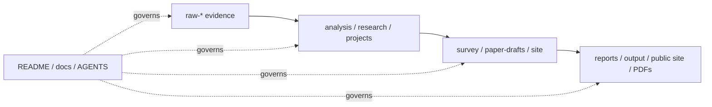

# Awesome Self-Evolving AI Agents / Self Evolve

[中文主入口](README.md) | [English](README-EN.md) | [中文兼容镜像](README-ZH.md)

This repository is a Chinese-first Awesome index, survey workspace, project model-card library, paper pipeline, and SEO site for self-evolving / self-improving AI agents.

## Start Here

| Need | Link | Why |
|---|---|---|
| Main Chinese README | [README.md](README.md) | The primary field map: methods, benchmarks, projects, papers, and links |
| Full survey PDF | [survey/latex/main.pdf](survey/latex/main.pdf) | Chinese survey draft covering theory, methods, systems, evaluation, industry, pain points, and future work |
| Publish-oriented paper draft | [paper-drafts/main.pdf](paper-drafts/main.pdf) | Current paper artifact generated from `paper-drafts/main.tex` |
| GitHub corpus analysis | [analysis/github-project-data-analysis.md](analysis/github-project-data-analysis.md) | 482 raw captures, 482 classified repos, 200 model-card projects, strict/broad evolution subsets, and timeline |
| Project model cards | [projects/INDEX.md](projects/INDEX.md) | Teaching-style project analysis reports |
| Public site | [GitHub Pages](https://shiyao-huang.github.io/awesome-evolution/) | SEO/site surface for project pages, research pages, and graph views |
| Master repository index | [docs/indexes/master-index.md](docs/indexes/master-index.md) | Generated map of raw, processed, work, results, mirrors, and ops layers |

## Field Shape

The useful question is not just whether an agent exists. The useful question is what changes over time, what feedback pressure selects the change, and whether the improvement survives independent evaluation.

| Area | Examples |
|---|---|
| Self-evolution loops | OpenEvolve, AgentEvolver, EvoAgentX, A-Evolve, OpenSpace |
| Harness engineering | OpenClaw, Agentic Harness Engineering, Aden Hive, OpenHarness, CORAL |
| Memory substrate | Mem0, LangMem, Graphiti, Memoria, Hindsight |
| Skills | Anthropic Skills, OpenAI Skills, AgentSkills, SkillRL, Superpowers |
| Evaluation and benchmarks | AgentBench, OSWorld, BrowserGym, Claw-Eval, HaluMem |
| Prompt/program optimization | DSPy, OPRO, EvoPrompt, SCOPE |
| Research agents | AutoResearchClaw, ScienceClaw, AI Scientist-style workflows |

## Method Map

| Method family | What evolves | Typical feedback |
|---|---|---|
| Reward / RL / self-play | policies, reasoning traces, preferences, generated tasks | reward, win/loss, correctness, judge score |
| Prompt / search optimization | prompts, playbooks, context, candidate programs | self-feedback, textual gradients, evaluator score |
| Memory / lifelong learning | episodic memory, semantic memory, skills, user/project state | retrieval success, long-horizon performance, conflict handling |
| Architecture / code self-modification | agent architecture, tools, code, control flow | tests, benchmarks, archive selection |
| Multi-agent reflection / debate | roles, communication edges, critic/review workflows | debate score, peer review, task success |
| Evaluation / safety / governance | evaluators, permissions, rollback, audit trail | regression tests, safety rules, human review |

## Evidence Pipeline

For complete Chinese content, use [README.md](README.md).
