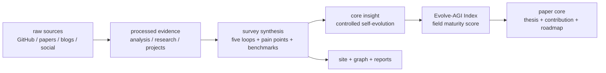
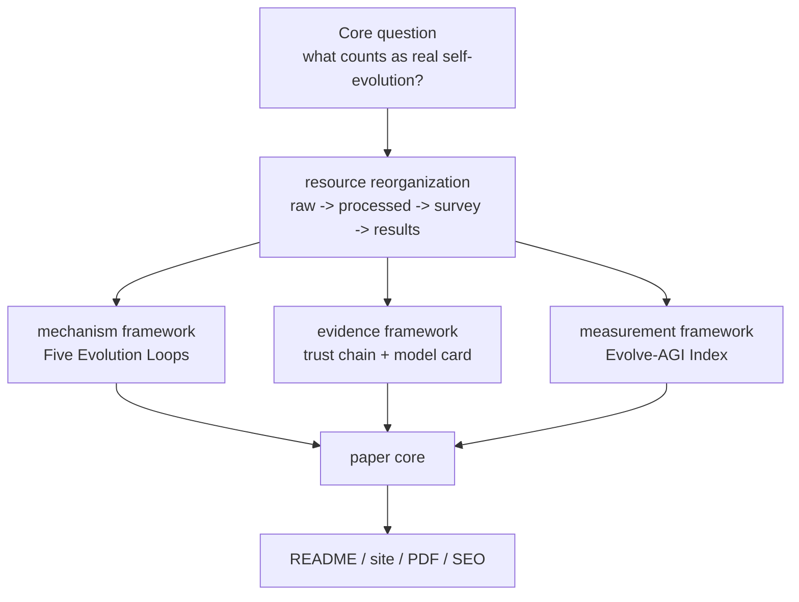

# Awesome Self-Evolving AI Agents

**A survey-first map of self-evolving AI agents: papers, projects, benchmarks, public reports, and the Evolve-AGI Index in one evidence chain.**

[Chinese](README.md) | [English](README-EN.md) | [Website](https://shiyao-huang.github.io/awesome-agent-evolution/) | [Paper PDF](paper-drafts/main.pdf) | [Evolve-AGI Index](analysis/evolve-agi-index.md) | [Project Index](projects/INDEX.md)


## One Sentence

Want to know whether an AI agent is actually improving itself, or just looking impressive in a demo? This survey gives you a traceable answer: what changes, what feedback drives the change, who verifies it, whether it transfers, and how it rolls back.

## Three Sentences

1. We connect papers, open-source projects, benchmarks, blog/social signals, and real user pain points into one evidence chain, so readers can start with the judgment and then inspect the proof.
2. The standard is simple: do not stop at names, stars, or demos; ask whether the system forms an Observe -> Interpret -> Modify -> Verify -> Retain loop.
3. The [Evolve-AGI Index](analysis/evolve-agi-index.md) is now part of the paper core: it is not an AGI capability score, but an evidence index for the maturity of self-evolving agents.

## Five Sentences

1. This is not a standard Awesome List; it is an open survey of how AI agents can reliably improve themselves.
2. A genuine self-evolving system must identify its mutable object, feedback signal, update operator, independent evaluator, retention mechanism, and rollback path.
3. The clearest mechanism skeleton is the Five Evolution Loops: reflection/memory, symbolic components, verification-driven code, architecture search, and curriculum/weights/population.
4. The Evolve-AGI Index puts benchmark performance, loop strength, evidence credibility, transfer verification, implementation access, field momentum, and governance readiness into one auditable metric, so hype does not masquerade as maturity.
5. Use this page to reach the paper, project model cards, public reports, knowledge graph, and website without drowning in hundreds of links.

## What You Can Use It For

| Reader | What you get |
|---|---|
| Researchers | A survey spine from taxonomy, methods, systems, and evaluation to the future roadmap. |
| Builders | A way to judge whether an agent project has verifiable feedback, auditable memory, evaluator harnesses, and rollback paths. |
| Product, investment, and industry readers | A way to separate real capability accumulation from benchmark gaming, demos, and governance gaps. |
| Writers and educators | An evidence-backed topic map across projects, papers, trends, pain points, graphs, and long-tail SEO pages. |



## Core Insight

One sentence: the core insight is to turn Self-Evolving AI Agents from a story about self-improvement into an auditable improvement system.

Three sentences: A system enters this survey's self-evolution scope only when feedback changes its prompt, memory, tool policy, workflow, code, weights, or population and leaves verifiable evidence. All resources behind the survey are now reorganized around one question: what object changes, what signal drives it, and what prevents the change from becoming harmful. The Evolve-AGI Index is the measurement spine for that reorganization, connecting paper findings, the GitHub corpus, benchmarks, and governance requirements into a reproducible data flow.

Five-sentence expansion:

1. Readers used to move between links, stars, paper lists, and site pages on their own; now they see the conclusion first, then the evidence path.
2. The survey is not just a literature roundup; it cross-checks papers, projects, benchmarks, social/blog signals, and user pain points.
3. The key judgment is no longer whether a project name includes "evolution"; it is whether the system forms an Observe -> Interpret -> Modify -> Verify -> Retain loop.
4. The Evolve-AGI Index is no longer just a site module; it becomes a paper contribution that gives the field an interpretable maturity coordinate system.
5. Every core claim exposed to readers should trace back to the paper, project reports, data indexes, or benchmark evidence; unsupported claims are marked `[UNVERIFIED]`.

## Core Findings

| Rank | Survey finding | Meaning for readers | Evidence entry |
|---:|---|---|---|
| 1 | Self-evolution is a controlled systems process, not a demo label. | Read every project by asking what changed, who verified it, and how it rolls back. | [paper abstract](paper-drafts/main.tex), [ch1 intro](paper-drafts/ch1-intro.tex) |
| 2 | Benchmarks are both selection pressure and risk. | Score gains are not capability accumulation unless hidden tests, transfer, cost, and rejected candidates are reported. | [ch5 evaluation](paper-drafts/ch5-evaluation.tex), [survey ch5](survey/ch5-evaluation-cn.md) |
| 3 | Memory, skills, and harnesses are core infrastructure. | Do not only inspect the model layer; auditable memory, installable skills, and evaluators determine long-term usefulness. | [ch7 painpoints](paper-drafts/ch7-painpoints.tex), [agent-swarm evolve](analysis/agent-swarm-evolve.md) |
| 4 | Five evolution loops are more stable than project names. | New systems can be classified by mechanism instead of marketing labels. | [survey methods](survey/ch3-methods-cn.md), [method taxonomy](survey/figures/method-taxonomy-mermaid.md) |
| 5 | The Evolve-AGI Index should be a core paper metric. | It decomposes maturity into benchmark, loop, evidence, transfer, access, momentum, and governance signals. | [Evolve-AGI Index](analysis/evolve-agi-index.md), [trend snapshot](reports/evolve-agi-index-trend.json) |
| 6 | Users care most about the trust boundary. | Product value comes from reliability, transparency, control, and cost, not from autonomy rhetoric. | [survey ch7](survey/ch7-painpoints-cn.md), [site survey](site/src/pages/survey/index.astro) |
| 7 | Failed candidates and negative results are assets. | Without rejected patches, regressions, and lineage, we cannot judge whether a system truly evolves. | [ch8 future](paper-drafts/ch8-future.tex), [survey spark analysis](analysis/survey-resource-spark.md) |

## Evolve-AGI Index In The Paper Core

One sentence: the Evolve-AGI Index is the survey's field-maturity dashboard, not a final AGI capability score.

```text
EAI = Σ(signal_score × signal_weight)
```

| Signal | Weight | Why it belongs in the core |
|---|---:|---|
| Benchmark performance | 18% | Self-evolution must face measurements, but benchmarks cannot decide maturity alone. |
| Core loop strength | 20% | Without mutable object, feedback, selection, and retention, there is no self-evolution. |
| Evidence-chain credibility | 18% | Raw sources, analysis, model cards, and paper appendices must be traceable. |
| Transfer and verification | 14% | Gains on one public test do not prove capability accumulation. |
| Implementation access | 12% | A system must run, transfer, and be inspectable to matter as engineering. |
| Field momentum | 10% | New projects and community motion are trend signals, but cannot override evidence quality. |
| Governance readiness | 8% | Self-modifying systems need safety boundaries, logs, rollback, and timestamp confidence. |

The current snapshot in [reports/evolve-agi-index-trend.json](reports/evolve-agi-index-trend.json) reports a 2026-05-30 index of `72.9`, a benchmark sub-index of `80.1`, `90` strict evolution repos, `195` broad evolution repos, and `193` public reports in the trend snapshot. Use it together with the repository-wide counts in [docs/indexes/master-index.md](docs/indexes/master-index.md): the former powers trend analysis, while the latter governs repository structure.

## Survey Evidence Map

| Layer | Current role | Evidence |
|---|---|---|
| Source evidence | Keeps GitHub, paper, blog, and social material as the starting point for claims. | [raw index](docs/indexes/raw-index.md), `raw-github/`, `raw-papers/`, `raw-social/`, `raw-blogs/` |
| Processed analysis | Turns sources into classifications, mechanisms, model cards, paper reviews, rankings, and the Evolve-AGI Index. | [processed index](docs/indexes/processed-index.md), [GitHub analysis](analysis/github-project-data-analysis.md), [projects index](projects/INDEX.md) |
| Survey paper | Turns mechanisms, systems, evaluation, industry practice, pain points, and futures into paper structure. | [survey CN chapters](survey/ch1-intro-cn.md), [paper drafts](paper-drafts/main.tex), [survey latex](survey/latex/main.tex) |
| Public results | Publishes PDFs, site pages, reports, graphs, trend snapshots, and SEO material. | [results index](docs/indexes/results-index.md), [site](site/src/pages/index.astro), [reports](reports/) |
| Evidence catalog | Lets readers inspect evidence chains, indexes, and public results. | [CONTENT_INDEX.md](CONTENT_INDEX.md), [master index](docs/indexes/master-index.md) |



## Paper Spine

| Chapter | Survey result | Current entry |
|---|---|---|
| Ch1 Introduction | Defines self-evolution and adds the Evolve-AGI Index as an evidence-to-index contribution. | [paper-drafts/ch1-intro.tex](paper-drafts/ch1-intro.tex) |
| Ch2 Taxonomy | Separates continual learning, online learning, self-supervision, AutoML, RL, and genuine self-evolution. | [paper-drafts/ch2-taxonomy.tex](paper-drafts/ch2-taxonomy.tex) |
| Ch3 Methods | Explains how feedback becomes retained change through the Five Evolution Loops. | [paper-drafts/ch3-methods.tex](paper-drafts/ch3-methods.tex) |
| Ch4 Systems | Compares Self-Refine, Reflexion, ADAS, DGM, AlphaEvolve, Absolute Zero, and related systems. | [paper-drafts/ch4-evolutionary.tex](paper-drafts/ch4-evolutionary.tex) |
| Ch5 Evaluation | Puts benchmarks, trajectories, transfer, cost, regression, and Goodhart risk onto one evaluation surface. | [paper-drafts/ch5-evaluation.tex](paper-drafts/ch5-evaluation.tex) |
| Ch6 Frameworks | Discusses runtime, memory, harness, workflow, tool sandbox, and reference architectures. | [paper-drafts/ch6-frameworks.tex](paper-drafts/ch6-frameworks.tex) |
| Ch7 Pain Points | Uses real user pain points to test the research agenda: reliability, cost, observability, permissions, and memory pollution. | [paper-drafts/ch7-painpoints.tex](paper-drafts/ch7-painpoints.tex) |
| Ch8 Future | Extends the Evolve-AGI Index into a field knowledge data model and roadmap. | [paper-drafts/ch8-future.tex](paper-drafts/ch8-future.tex) |

## How To Read This Repository

| You want to know | Read first | Then read |
|---|---|---|
| The one-line field thesis | [Core Insight](#core-insight) | [paper abstract](paper-drafts/main.tex) |
| Which projects truly count as self-evolving | [Core Findings](#core-findings) | [projects/INDEX.md](projects/INDEX.md), [analysis/github-project-data-analysis.md](analysis/github-project-data-analysis.md) |
| How the paper is organized | [Paper Spine](#paper-spine) | [paper-drafts/main.tex](paper-drafts/main.tex), [survey/latex/main.tex](survey/latex/main.tex) |
| How the AGI index enters the core | [Evolve-AGI Index In The Paper Core](#evolve-agi-index-in-the-paper-core) | [analysis/evolve-agi-index.md](analysis/evolve-agi-index.md), [site page](site/src/pages/evolve-agi-index/index.astro) |
| Where the full lists live | [CONTENT_INDEX.md](CONTENT_INDEX.md) | [docs/indexes/master-index.md](docs/indexes/master-index.md) |
| Where the site and SEO material live | [site](site/) | [site survey page](site/src/pages/survey/index.astro), [graph page](site/src/pages/graph/index.astro) |

## Evidence Boundary

- [KNOWN] Repository-wide governance counts come from [docs/indexes/master-index.md](docs/indexes/master-index.md), generated by `node scripts/generate_project_indexes.mjs`.
- [KNOWN] GitHub corpus counts, strict/broad evolution subsets, and time slices come from [analysis/github-project-data-analysis.md](analysis/github-project-data-analysis.md) and the paired JSON.
- [KNOWN] Coverage boundaries, count meanings, and current gaps come from [analysis/resource-library-coverage-audit.md](analysis/resource-library-coverage-audit.md): 631, 224, 426, 119, and 793 describe different layers and should not be merged into one claim.
- [KNOWN] Evolve-AGI Index methodology, weights, and benchmark inputs come from [analysis/evolve-agi-index.md](analysis/evolve-agi-index.md), [site/src/data/evolveAgiIndex.ts](site/src/data/evolveAgiIndex.ts), and [reports/evolve-agi-index-trend.json](reports/evolve-agi-index-trend.json).
- [KNOWN] Survey chapters and the paper draft come from [paper-drafts/main.tex](paper-drafts/main.tex) and [survey/latex/main.tex](survey/latex/main.tex).
- [INFERRED] The "core insight" is a synthesis over those sources: upgrading the Awesome repository into a survey + index + evidence graph for controlled self-evolution, not a simple link site.

## Reader Next Steps

| Goal | Recommended entry |
|---|---|
| Understand the field quickly | Start with the core findings and the Evolve-AGI Index in this README. |
| Read the paper deeply | Open [paper-drafts/main.pdf](paper-drafts/main.pdf) or the [paper page](site/src/pages/paper/index.astro). |
| Inspect project evidence | Use [projects/INDEX.md](projects/INDEX.md) and [public project reports](site/public/reports/projects/INDEX.md). |
| Check data coverage | Start with the [resource library page](https://shiyao-huang.github.io/awesome-agent-evolution/resource-library/), then inspect [analysis/resource-library-coverage-audit.md](analysis/resource-library-coverage-audit.md), [docs/indexes/master-index.md](docs/indexes/master-index.md), and [analysis/github-project-data-analysis.md](analysis/github-project-data-analysis.md). |
| Find topics by question | Open the [Survey/SEO topic map](https://shiyao-huang.github.io/awesome-agent-evolution/topics/) for definitions, five loops, code self-improvement, Agent-Swarm, evaluation governance, and production pain points. |
| Browse the website | Open the [Self Evolve site](https://shiyao-huang.github.io/awesome-agent-evolution/) or the [site source](site/). |

## Citation

```bibtex
@misc{awesomeSelfEvolvingAgents2026,
  title        = {Awesome Self-Evolving AI Agents: Survey, Evidence Graph, and Evolve-AGI Index},
  author       = {aha team},
  year         = {2026},
  howpublished = {\url{https://github.com/shiyao-huang/awesome-agent-evolution}},
  note         = {Open survey repository for self-evolving AI agents, benchmark evidence, project model cards, and field maturity indexing.}
}
```
