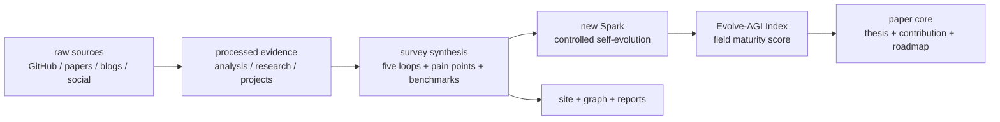
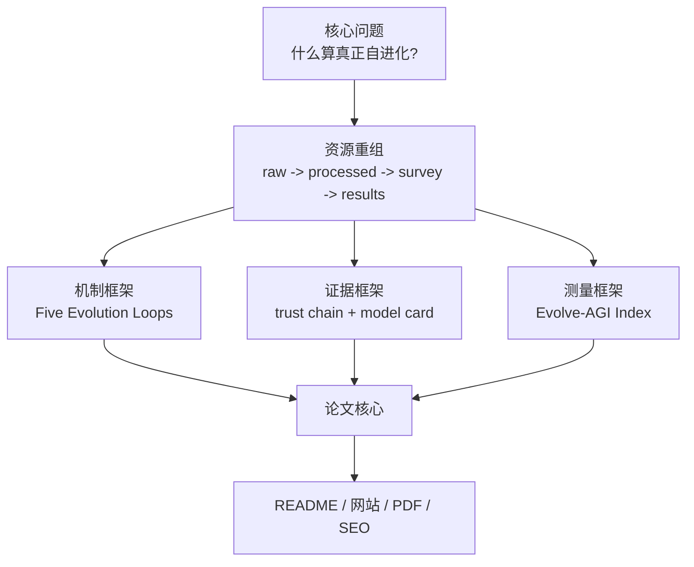

# Awesome Self-Evolving AI Agents / AI Agent 自进化 Survey 成果

**Author / 归属:** aha team

[中文主入口](README.md) | [English](README-EN.md) | [中文兼容镜像](README-ZH.md)


## 一句话

这个仓库现在以 Survey 成果为主入口：用 raw 证据、项目 model card、论文评审、benchmark、用户痛点和 Evolve-AGI Index 解释 AI Agent 自进化是否真的形成了可验证、可复用、可治理的改进闭环。

## 三句话

1. README 不再扮演“全量链接清单”，而是扮演 survey 摘要、核心判断和证据导航；完整列表进入 `docs/indexes/`、`projects/`、`research/`、`analysis/` 和网站。
2. Survey 的新 Spark 是把自进化从“会不会更强”的口号，改写成一个受控系统问题：改了什么、反馈是什么、谁验证、成本多少、能否迁移、如何回滚。
3. 已有的 [Evolve-AGI Index](analysis/evolve-agi-index.md) 纳入论文核心：它不是 AGI 能力分，而是衡量 self-evolving agent 领域成熟度的证据指数。

## 五句话

1. AI Agent 自进化不是一个项目榜单，而是一条证据链：raw 素材进入加工分析，形成 survey 机制框架，再进入论文、网站、图谱和可发布报告。
2. 真正的自进化系统必须同时说明 mutable object、feedback signal、update operator、independent evaluator、retention/lineage 和 rollback。
3. 五类 evolution loops 是当前最清晰的机制骨架：reflection/memory、symbolic components、verification-driven code、architecture design、curriculum/weights/population。
4. Evolve-AGI Index 把 benchmark、闭环强度、证据链、迁移验证、可运行性、领域动量和治理成熟度放进同一个可审计指标，避免把 star 或 demo 热度误读成能力成熟。
5. README 的任务是让读者先获得认知结构，再顺着证据入口进入完整列表、论文、网站和项目深度分析。



## Survey 的新 Spark

一句话：本项目的核心火花是把 Self-Evolving AI Agents 从“自我改进的故事”变成“可审计的改进系统”。

三句话：一个系统只有在反馈中改变自己的 prompt、memory、tool policy、workflow、code、weights 或 population，并且保留可验证证据时，才进入 self-evolution 范围。Survey 背后的全部资源现在按同一个问题重排：哪个对象在变，什么信号驱动它变，谁阻止它变坏。Evolve-AGI Index 是这个重排后的测量脊柱，它把论文发现、GitHub 语料、benchmark 和治理要求接成一条可复跑的数据流。

五句话展开：

1. 过去的 Awesome 入口容易把 raw links、star 排名、paper 列表和网站材料混在一起；新的 README 只发布 survey 已经推敲出的判断。
2. Survey 不是“总结已有论文”，而是把论文、项目、benchmark、社交/博客信号和用户痛点互相校验。
3. 关键判断不再是“项目名字里有没有 evolution”，而是“系统是否形成 Observe -> Interpret -> Modify -> Verify -> Retain 的闭环”。
4. AGI index 相关成果不再只是网站模块，而是论文的核心贡献之一：给这个领域一个可解释的成熟度坐标系。
5. 对外读者看到的每个核心判断都应该能回到论文、项目报告、数据索引或 benchmark 证据；没有证据链的结论标记为 `[UNVERIFIED]`。

## 核心结论

| Rank | Survey 结论 | 对读者的意义 | 证据入口 |
|---:|---|---|---|
| 1 | Self-evolution 是 controlled systems process，不是 demo 标签。 | 读任何项目先问“改了什么、谁验证、怎么回滚”。 | [paper abstract](paper-drafts/main.tex), [ch1 intro](paper-drafts/ch1-intro.tex) |
| 2 | Benchmark 是选择压力，也是风险源。 | 分数提高不等于能力积累；要看隐藏测试、迁移、成本、失败候选。 | [ch5 evaluation](paper-drafts/ch5-evaluation.tex), [survey ch5](survey/ch5-evaluation-cn.md) |
| 3 | Memory、skill、harness 是核心基础设施。 | 不要只看模型层；可审计记忆、可安装技能和 evaluator 才决定长期可用性。 | [ch7 painpoints](paper-drafts/ch7-painpoints.tex), [agent-swarm evolve](analysis/agent-swarm-evolve.md) |
| 4 | 五类 evolution loops 比项目名更稳定。 | 新项目可以按机制归类，而不是被营销词牵着走。 | [survey methods](survey/ch3-methods-cn.md), [method taxonomy](survey/figures/method-taxonomy-mermaid.md) |
| 5 | Evolve-AGI Index 应成为论文核心指标。 | 它把成熟度拆成 benchmark、闭环、证据、迁移、可运行、动量、治理七个信号。 | [Evolve-AGI Index](analysis/evolve-agi-index.md), [trend snapshot](reports/evolve-agi-index-trend.json) |
| 6 | 用户真正关心 trust boundary。 | 产品价值来自可靠、透明、可控、低成本，不来自“更自主”的口号。 | [survey ch7](survey/ch7-painpoints-cn.md), [site survey](site/src/pages/survey/index.astro) |
| 7 | 失败候选和负结果是资产。 | 没有 rejected patches、regressions、lineage，无法判断系统是否真的会进化。 | [ch8 future](paper-drafts/ch8-future.tex), [wiki schema](work/wiki/schema.md) |

## Evolve-AGI Index 进入论文核心

一句话：Evolve-AGI Index 是本 survey 的“领域成熟度仪表盘”，不是 AGI 终局能力评分。

```text
EAI = Σ(signal_score × signal_weight)
```

| Signal | Weight | 为什么进入核心 |
|---|---:|---|
| Benchmark performance | 18% | 自进化必须接受实测；但 benchmark 不能单独决定成熟度。 |
| Core loop strength | 20% | 没有 mutable object、feedback、selection、retention，就没有自进化。 |
| Evidence-chain credibility | 18% | raw、analysis、model card、paper appendix 必须互相能追溯。 |
| Transfer and verification | 14% | 只在一个公开测试上涨分，不能证明能力积累。 |
| Implementation access | 12% | 能运行、能复用、能审计，才有工程价值。 |
| Field momentum | 10% | 新项目和社区动量是趋势信号，但不能覆盖证据质量。 |
| Governance readiness | 8% | 自修改系统必须有安全边界、日志、回滚和时间戳信心。 |

当前快照来自 [reports/evolve-agi-index-trend.json](reports/evolve-agi-index-trend.json)：2026-05-30 的指数为 `72.9`，benchmark 子指数为 `80.1`，对应 `90` 个 strict evolution repos、`195` 个 broad evolution repos 和 `193` 个 trend 快照中的 public reports。这个快照与 [docs/indexes/master-index.md](docs/indexes/master-index.md) 的全仓库计数共同使用；前者服务趋势页，后者服务仓库治理。

## Survey 资源重组

| Layer | 当前角色 | 关键证据 |
|---|---|---|
| Raw sources | 不可变证据层，保留 GitHub、论文、博客、社交素材。 | [raw index](docs/indexes/raw-index.md), `raw-github/`, `raw-papers/`, `raw-social/`, `raw-blogs/` |
| Processed analysis | 把 raw 转成分类、机制、model card、paper review、ranking 和 Evolve-AGI Index。 | [processed index](docs/indexes/processed-index.md), [GitHub analysis](analysis/github-project-data-analysis.md), [projects index](projects/INDEX.md) |
| Survey work | 把机制、系统、评估、工业实践、痛点和未来方向写成论文结构。 | [survey CN chapters](survey/ch1-intro-cn.md), [paper drafts](paper-drafts/main.tex), [survey latex](survey/latex/main.tex) |
| Results | 对外发布 PDF、网站、报告、图谱、趋势快照和 SEO 页面。 | [results index](docs/indexes/results-index.md), [site](site/src/pages/index.astro), [reports](reports/) |
| Evidence catalog | 给读者检查证据链、索引和公开结果的入口。 | [CONTENT_INDEX.md](CONTENT_INDEX.md), [master index](docs/indexes/master-index.md) |



## 论文主线

| 章节 | Survey 成果 | 当前入口 |
|---|---|---|
| Ch1 Introduction | 定义 self-evolution，并把 Evolve-AGI Index 作为 evidence-to-index 贡献纳入核心。 | [paper-drafts/ch1-intro.tex](paper-drafts/ch1-intro.tex) |
| Ch2 Taxonomy | 区分 continual learning、online learning、self-supervision、AutoML、RL 和真正 self-evolution。 | [paper-drafts/ch2-taxonomy.tex](paper-drafts/ch2-taxonomy.tex) |
| Ch3 Methods | 按五类 loops 分析 feedback 如何变成 retained change。 | [paper-drafts/ch3-methods.tex](paper-drafts/ch3-methods.tex) |
| Ch4 Systems | 比较 Self-Refine、Reflexion、ADAS、DGM、AlphaEvolve、Absolute Zero 等代表系统。 | [paper-drafts/ch4-evolutionary.tex](paper-drafts/ch4-evolutionary.tex) |
| Ch5 Evaluation | 把 benchmark、trajectory、transfer、cost、regression 和 Goodhart 风险放在同一评估面。 | [paper-drafts/ch5-evaluation.tex](paper-drafts/ch5-evaluation.tex) |
| Ch6 Frameworks | 讨论 runtime、memory、harness、workflow、tool sandbox 和 reference architecture。 | [paper-drafts/ch6-frameworks.tex](paper-drafts/ch6-frameworks.tex) |
| Ch7 Pain Points | 用真实用户痛点校验研究问题：可靠性、成本、可观测性、权限、记忆污染。 | [paper-drafts/ch7-painpoints.tex](paper-drafts/ch7-painpoints.tex) |
| Ch8 Future | 把 Evolve-AGI Index 扩展成 field knowledge data model 和后续路线图。 | [paper-drafts/ch8-future.tex](paper-drafts/ch8-future.tex) |

## 怎么读这个仓库

| 你想知道 | 先读 | 再读 |
|---|---|---|
| 这个领域一句话是什么 | 本 README 的 [Survey 的新 Spark](#survey-的新-spark) | [paper abstract](paper-drafts/main.tex) |
| 什么项目真的算自进化 | [核心结论](#核心结论) | [projects/INDEX.md](projects/INDEX.md), [analysis/github-project-data-analysis.md](analysis/github-project-data-analysis.md) |
| 论文现在怎么组织 | [论文主线](#论文主线) | [paper-drafts/main.tex](paper-drafts/main.tex), [survey/latex/main.tex](survey/latex/main.tex) |
| AGI index 怎么进入核心 | [Evolve-AGI Index 进入论文核心](#evolve-agi-index-进入论文核心) | [analysis/evolve-agi-index.md](analysis/evolve-agi-index.md), [site page](site/src/pages/evolve-agi-index/index.astro) |
| 全量文件在哪里 | [CONTENT_INDEX.md](CONTENT_INDEX.md) | [docs/indexes/master-index.md](docs/indexes/master-index.md) |
| 网站和 SEO 在哪里 | [site](site/) | [site survey page](site/src/pages/survey/index.astro), [graph page](site/src/pages/graph/index.astro) |

## 证据边界

- [KNOWN] 全仓库治理计数来自 [docs/indexes/master-index.md](docs/indexes/master-index.md)，由 `node scripts/generate_project_indexes.mjs` 生成。
- [KNOWN] GitHub 语料、strict/broad evolution 子集和时间切片来自 [analysis/github-project-data-analysis.md](analysis/github-project-data-analysis.md) 与对应 JSON。
- [KNOWN] Evolve-AGI Index 方法、权重和 benchmark 输入来自 [analysis/evolve-agi-index.md](analysis/evolve-agi-index.md)、[site/src/data/evolveAgiIndex.ts](site/src/data/evolveAgiIndex.ts) 和 [reports/evolve-agi-index-trend.json](reports/evolve-agi-index-trend.json)。
- [KNOWN] Survey 章节和论文主稿来自 [paper-drafts/main.tex](paper-drafts/main.tex) 与 [survey/latex/main.tex](survey/latex/main.tex)。
- [INFERRED] “新 Spark”是对上述证据的综合判断：把 Awesome 仓库升级为受控自进化领域的 survey + index + evidence graph，而不是一个单纯链接站。

## 给读者的下一步

| 目标 | 推荐入口 |
|---|---|
| 快速理解领域 | 先读本 README 的核心结论和 Evolve-AGI Index。 |
| 深入阅读论文 | 打开 [paper-drafts/main.pdf](paper-drafts/main.pdf) 或 [paper page](site/src/pages/paper/index.astro)。 |
| 查项目证据 | 使用 [projects/INDEX.md](projects/INDEX.md) 和 [public project reports](site/public/reports/projects/INDEX.md)。 |
| 查数据范围 | 使用 [docs/indexes/master-index.md](docs/indexes/master-index.md) 和 [analysis/github-project-data-analysis.md](analysis/github-project-data-analysis.md)。 |
| 浏览网站 | 打开 [Self Evolve site](https://shiyao-huang.github.io/awesome-agent-evolution/) 或本仓库的 [site source](site/)。 |

面向 agent、自动化、构建和发布的内部操作规则不写在 README 主体里；请看 [AGENTS.md](AGENTS.md) 和 [CLOUD.md](CLOUD.md)。

## Citation

```bibtex
@misc{awesomeSelfEvolvingAgents2026,
  title        = {Awesome Self-Evolving AI Agents: Survey, Evidence Graph, and Evolve-AGI Index},
  author       = {aha team},
  year         = {2026},
  howpublished = {\url{https://github.com/shiyao-huang/awesome-agent-evolution}},
  note         = {Open survey repository for self-evolving AI agents, benchmark evidence, project model cards, and field maturity indexing.}
}
```
