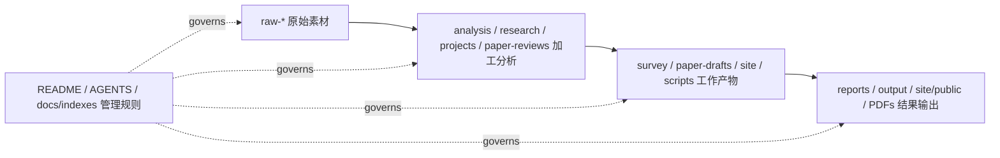

# Awesome Self-Evolving AI Agents / AI Agent 自进化索引与综述

**Author / 归属:** aha team

[中文主入口](README.md) | [English](README-EN.md) | [中文兼容镜像](README-ZH.md)


## 一句话

这个仓库是 AI Agent 自进化 / 自改进方向的中文优先 Awesome 索引、综述入口、项目 model-card 库、论文工程和 SEO 网站素材库。

## 三句话

1. README 是第一入口：最有价值的分类、方法、benchmark、项目、论文、社区信号和链接必须直接放在这里，读者不用先翻目录。
2. `survey/` 与 `paper-drafts/` 保存审稿级展开版；README 直接放主内容、分类、方法、benchmark、项目和证据链接。
3. 全仓库按 `raw -> processed -> work -> results` 管线治理：raw 是证据，加工是解释，work 是论文/网站/脚本，results 是可发布输出。

## 五句话

1. 这个领域的核心问题不是“有没有 agent”，而是“agent 到底改进了什么、凭什么证明更强、能不能复用到真实任务”。
2. 当前证据层包括 490 个 GitHub raw captures、490 个已分类仓库、208 个站点项目、79 个严格 self-evolution 仓库、176 个广义 evolution-related 仓库。
3. 方法主线可压缩为六类：reward/RL/self-play、prompt/search、memory、architecture/code self-modification、multi-agent reflection/debate、evaluation/safety/governance。
4. Benchmark 是本项目的主矛盾之一：SWE-Bench、HumanEval、OSWorld、BrowserGym、AgentBench、LongMemEval、STATE-Bench 等必须被放在同一张比较表里，而不是散在项目页里。
5. 这个 README 的目标是让读者直接获得认知结构；链接只作为证据来源和展开材料，不作为理解前提。

## 核心历史、未来与趋势追踪

一句话：AI Agent 自进化的历史，是从 prompt/reflection 的轻量自我修正，走向 memory/skill/harness 的工程化积累，再走向 code、architecture、evaluator 和 organization 的可审计共同进化。

三句话：早期重点是让 LLM 在反馈中重试、反思、改 prompt 或选择更好候选；中期重点变成 agent runtime、multi-agent workflow、benchmark harness 和可执行代码/算法搜索；现在最核心的未来问题，是把改进变成可验证、可回滚、可迁移、可治理的基础设施。读这个领域不要只看“自进化”名字，而要沿着时间问：系统把什么变成可变对象，选择压力从哪里来，改进证据是否独立。README 后续每次更新都要同步追踪 trend，不只追加链接，还要判断哪个方向正在上升、哪个方向只是短期热度。

### 历史主线

| 阶段 | 时间信号 | 核心变化 | 代表证据 | 对读者的指导 |
|---|---|---|---|---|
| 轻量自改进 | 2022-2023 | 从一次性回答变成 feedback/reflection/prompt search 循环。 | OpenELM、DSPy、Reflexion、Self-Refine、OPRO、FunSearch | 先学“改什么、怎么评估、如何保留经验”，不要被 agent 外壳分散注意力。 |
| Agent runtime 与多 Agent | 2023-2024 | AutoGPT、CAMEL、MetaGPT、AutoGen、LangGraph 把工具、角色、workflow、状态机变成工程底座。 | [release timeline](analysis/github-project-data-analysis.md#analyzed-project-release-timeline), [项目分类总表](#项目分类总表) | 框架本身不等于自进化；只有接入 evaluator、memory 和更新机制才进入核心。 |
| 架构/代码/算法自修改 | 2024-2025 | ADAS、DGM、AlphaEvolve、OpenEvolve、SE-Agent 把 architecture、code、program 和算法候选放进搜索空间。 | [ADAS](research/papers/04-adas.md), [DGM](research/papers/02-darwin-godel-machine.md), [AlphaEvolve](research/papers/08-alphaevolve.md) | 代码和算法是最容易先落地的自进化场景，因为测试、sandbox、回归和 archive 可以提供强证据。 |
| Memory / skill / harness 基础设施化 | 2025-2026 | memory、skill、evaluation、harness 同时变热；当前 raw 分类里 memory 96、evaluation 89、evolution 79、skill 60。 | [GitHub analysis](analysis/github-project-data-analysis.md), [method taxonomy](survey/figures/method-taxonomy-mermaid.md) | 下一波价值在可安装 skill、可审计 memory、可信 harness 和报告规范，而不是更多 demo。 |

### 未来路线图

| 优先级 | 未来方向 | 成熟标志 | 当前证据 |
|---:|---|---|---|
| 1 | 标准化验证器库 | 代码、网页、业务流程、记忆、安全、成本都有可复跑 evaluator。 | [survey ch8](survey/ch8-future-cn.md#86-研究与实践路线图), [Benchmark 判断准则](#benchmark-判断准则) |
| 2 | 自进化报告规范 | 每次改进报告时间切片、验证/测试隔离、失败候选、成本、回滚、安全事件。 | [GitHub 证据层](#git--github-证据层), [必要验证](#必要验证) |
| 3 | 可审计记忆与 skill 资产 | 经验不只是自由文本，而是可版本化、可遗忘、可迁移、可安全扫描的资产。 | [Memory / lifelong learning](#方法分类总表), [Skills / reusable know-how](#项目分类总表) |
| 4 | Archive / lineage 基础设施 | 每个 prompt、skill、workflow、code diff 都有来源、评估、继承关系和回滚点。 | [DGM](research/papers/02-darwin-godel-machine.md), [OpenEvolve](projects/algorithmicsuperintelligence__openevolve.md) |
| 5 | 异质多 Agent 协同 | 生成者、验证者、红队、成本控制、审计者有独立工具和独立错误分布。 | [Multi-agent reflection / debate](#方法分类总表), [survey ch8](survey/ch8-future-cn.md#82-多-agent-协同进化从角色扮演到生态搜索) |
| 6 | 跨域迁移 benchmark | 改进不能只在一个 leaderboard 上成立，必须迁移到新任务、时间切片、环境和模型。 | [survey ch8](survey/ch8-future-cn.md#84-跨域迁移能力从-benchmark-specific-进化到通用适应) |

### 趋势追踪看板

| 追踪项 | 当前基线 | 更新方式 | 趋势怎么解读 |
|---|---:|---|---|
| GitHub 语料漏斗 | 490 raw captures / 490 classified / 208 model-card projects / 79 strict / 176 broad | `node scripts/analyze_github_project_data.mjs` | strict 与 broad 同涨说明核心和基础设施都在扩张；只涨 broad 可能是概念外延变松。 |
| 主题热度 | memory 96, evaluation 89, evolution 79, skill 60 | `research/repo-classification.json` + GitHub analysis | evaluation、memory、skill 同时上升，说明领域从“会不会进化”转向“怎么证明、怎么积累、怎么复用”。 |
| 时间切片 | 2026-05 raw classified repos 330，unknown 107 | `output/raw-github-timestamp-index.md` + classification time slice | 时间切片是采集/活动信号，不等于全部项目创建时间；unknown 要持续补时间戳。 |
| Benchmark 覆盖 | 163 benchmark/evaluation related repos | README benchmark 表 + `analysis/github-project-data-analysis.md` | benchmark 增加要看是否有隐藏测试、失败轨迹、成本和跨域迁移，不能只数 leaderboard。 |
| 论文前沿 | 108 detailed paper references，含 2026 补充前沿 | `research/agent-self-evolution-papers-detailed-ZH.md` | 新论文进入 README 前要抽取改进对象、feedback、update、benchmark、限制。 |
| 产品可用性 | 208 public model-card projects | `projects/INDEX.md` + `site/public/reports/projects/INDEX.md` | 趋势判断要同时看能否运行、文档、真实 workflow、维护活跃度和用户价值，不只看 star。 |

每次追踪这个板块时，先新增 raw 证据，再更新 processed 分类和 README 判断，最后同步 `docs/indexes/` 与网站构建；如果 trend 判断改变，要写明证据变化，而不是只改结论。

## 先看：加工后的完整分类总览

这一段放在最前面，只放加工后的信息：分类、判断、价值排序、可复用结论。raw 链接和完整展开列表在后面作为证据与索取区。

### 0. 阅读优先级

| 优先级 | 先看什么 | 为什么有价值 |
|---:|---|---|
| 1 | 核心历史、未来与趋势追踪 | 先知道这条技术线从哪里来、下一步往哪里去、每次更新要盯哪些趋势。 |
| 2 | 自进化定义、方法族、benchmark 判断准则 | 再判断“什么算自进化、怎么证明、怎么防指标投机”。 |
| 3 | GitHub 语料漏斗、分类轴、严格/广义 evolution 子集 | 先看加工后的结构，不从 490 个 raw capture 里盲找。 |
| 4 | Public model-card 项目分组 | 208 个项目已经按角色、机制、证据和报告入口加工，可直接比较。 |
| 5 | 论文方法图谱 | 108 篇论文按 framework/method/RL/reflection/memory/alignment/benchmark/safety 等类别归纳，不是平铺引用。 |
| 6 | 完整列表索取区 | 需要复制、筛选、二次处理时再取完整项目、repo、paper、benchmark 列表。 |

### 1. 语料漏斗

| 层级 | 当前规模 | 加工后的意义 |
|---|---:|---|
| Raw GitHub captures | 490 | 原始发现层，只保留证据、时间戳和来源，不直接当结论。 |
| Classified repositories | 490 | 每个仓库已归入 category、theme、function tag、time slice。 |
| Public model-card projects | 208 | 进入项目页/报告体系，适合教学、对比和发布。 |
| Public project report files | 233 | 网站可发布结果层，包含历史/兼容报告与站点公开材料。 |
| Strict self-evolution repos | 79 | 核心子集：直接含自改进、进化、搜索、reflection、mutation 或 feedback loop。 |
| Broad evolution-related repos | 176 | 外围支撑层：memory、skill、evaluation、harness、coding-agent、prompt optimization。 |
| Detailed paper references | 108 | 论文方法证据层，按 14 个研究类别和 2026 补充前沿整理。 |
| Benchmark/evaluation related repos | 163 | 评估相关仓库集合，专门用于比较测什么、怎么测、是否可信。 |

### 2. GitHub 完整分类轴

| 分类轴 | 完整分布 | 怎么读 |
|---|---|---|
| Collection category | 框架/framework 138, 评测/evaluation 99, 教程/tutorial 93, 工具/tool 83, 应用/application 47, 论文代码/paper-code 29, 评测/benchmark 1 | 这是“仓库形态”：框架最多，说明生态先在 runtime/harness/tool 层扩张。 |
| Base theme | memory 96, evaluation 89, evolution 79, skill 60, framework 50, education-list 35, research-agent 31, prompt-optimization 26, coding-agent 17, workflow-automation 6, safety 1 | 这是“主题重心”：evaluation、memory、evolution、skill 是最密集的四个支点。 |
| Function tag | benchmark-eval 118, framework-runtime 114, resource-index 101, tool-module 90, application-demo 28, research-artifact 19, agent-evolution-infra 9, memory-substrate 8, memory-runtime 1, research-agent-pipeline 1, skill-orchestration 1 | 这是“功能角色”：benchmark 和 runtime 几乎并列，说明证明能力与运行能力同等关键。 |
| Time slice | 2026-05 330, unknown 107, 2024-Q2 7, 2026-03 7, 2026-04 7, 2025-11 5, 2024-Q3 4, 2025-05 3, 2026-02 3, early 3, 其他 14 | 这是“时间信号”：近期新增集中在 skills、memory、harness、evaluation 和 self-modifying code。 |

### 3. Public model-card 项目分组

| 分组 | 项目数 | 代表仓库 | 加工判断 |
|---|---:|---|---|
| 进化式代码 / AlphaEvolve 类 | 3 | openevolve、science-codeevolve、SE-Agent | 最接近可执行 self-improvement：代码变体、评估器、选择、迭代。 |
| LLM 作为优化器 | 3 | OPRO、OpenELM、FunSearch | 把 LLM 当 search/optimization operator，适合 prompt、program、算法发现。 |
| Agent 架构自动搜索 | 1 | ADAS | 把 agent architecture 本身当搜索空间，是自进化系统设计的核心论文线。 |
| Agent 自进化系统 | 4 | AgentEvolver、AIWaves agents、SCOPE、agentos | 关注经验、上下文、评估和 agent 工作区如何持续更新。 |
| 反思 / 精炼经典范式 | 2 | Reflexion、Self-Refine | 最常被复用的轻量自改进模式，但容易过拟合当前反馈。 |
| 安全、评判与数据/模型自进化 | 2 | DARWIN、LLM-Self-Judge | 评判器、数据和安全策略也会演化，必须防 reward hacking。 |
| 声明式 Prompt 优化 | 1 | DSPy | 把 prompt/program 编译成可优化对象，工程价值高。 |
| 多 Agent 协作框架 | 5 | MetaGPT、CrewAI、AutoGen、CAMEL、AgentVerse | 不是天然自进化；只有加入评价、记忆和改进闭环才进入核心。 |
| 图式 Agent 编排 | 1 | LangGraph | 适合作为可审计 workflow graph 和状态机底座。 |
| AI 软件工程 | 5 | AutoGPT、SWE-Agent、OpenHands、Devika、OpenDevin | 最容易接入真实仓库、测试和回归验证。 |
| AutoML / ML 知识驱动 | 2 | automl-agent、CoML | 与经典自动化搜索/AutoML 有强连接。 |
| 反射式进化搜索 | 2 | ReEvo、LLaMEA | 把 reflection 和 evolutionary search 结合，适合算法/优化任务。 |
| 进化式 Prompt/上下文优化 | 1 | EvoPrompt | 成本低、可回滚，但最容易 benchmark-specific。 |
| 进化式多 Agent 系统 | 4 | EvoAgent、EvoAgentX、EverOS、A-Evolve | 多 agent、memory、workspace 和 benchmark 的交叉区。 |
| LLM 驱动进化计算 | 5 | OpenTreeSearch、LLM4EC、LLM4Opt、LLM_EA、tutorial_gp_llm | 连接 LLM agent 与进化计算、组合优化、遗传编程。 |
| 质量多样性优化 | 1 | pyribs | 提供 archive/diversity 思路，可避免只爬单一分数坡。 |
| 经典进化算法框架 | 3 | DEAP、pycma、Nevergrad | 作为非 LLM 进化/搜索基线，不该被新 agent 术语遮蔽。 |
| AutoML 框架 | 1 | auto-sklearn | 传统自动改进系统的参考系。 |
| 自进化 Agent 综述 | 2 | Self-Evolving-Agents、self-improvement-llm | 用来对照分类是否遗漏研究支线。 |
| LLM Agent 优化 | 1 | LLM-Agent-Optimization | 资源索引型材料，适合补充术语和链接。 |
| 代码模型与评测 | 4 | Awesome-Code-LLM、AgentBench、RL4CO、Awesome-FM4CO | 把代码、agent、组合优化 benchmark 放入同一证据层。 |
| 遗传编程 | 1 | pureples | 提供 GP + LLM 的老方法/新模型交叉样本。 |
| Harness / 技能 / 记忆进化 | 98 | OpenClaw/Hermes/Mem0/LangMem/Graphiti/Skills 系列 | 当前最大工程簇：长期价值在可安装技能、可审计记忆、可运行 harness。 |
| 个人 Agent 产品与真实评测 | 33 | OpenClaw、PinchBench、Claw-Eval、OSWorld、BrowserGym、STATE-Bench | 最能检验“用户愿不愿意用”和“benchmark 是否贴近真实任务”。 |
| Harness 进化与方法索引 | 12 | harness-evolver、OpenHarness、AutoResearchClaw、SkillRL、OpenSpace | 把工具权限、执行环境、评估器和技能学习联成系统工程。 |

### 4. 高价值方向排序

| Rank | 方向 | 为什么排在前面 | 主要风险 |
|---:|---|---|---|
| 1 | Evaluation / benchmark / harness control | 自进化必须有选择压力；没有可信 evaluator，就没有可信改进。 | Goodhart、隐藏测试泄漏、LLM judge 偏差。 |
| 2 | Code/self-modifying agents | 代码有测试、回归和 sandbox，最容易形成闭环证据。 | 候选代码副作用、评估器被改、只修 benchmark。 |
| 3 | Memory / state substrate | 长期 agent 的真正可变对象往往是记忆、经验和用户/项目状态。 | 记忆污染、过期信息、隐私和错误经验继承。 |
| 4 | Skills / reusable know-how | Skills 把经验变成可安装、可测试、可迁移资产。 | 只是 prompt 文件堆叠、缺少验证、安全注入。 |
| 5 | Prompt / program optimization | 黑盒模型下最快落地，成本低、可回滚。 | context rot、prompt overfit、反思错误累积。 |
| 6 | Multi-agent reflection / debate | 能制造异质假设和 review gate，适合研究/软件交付。 | 多 agent 共识幻觉、通信成本、责任不清。 |
| 7 | Open-ended evolution / architecture search | 长期上限高，可能发现非人工设计结构。 | 搜索空间大、评估昂贵、复现难。 |

## 最高价值内容

| 你要解决的问题 | README 直接给出的答案 | 证据来源 |
|---|---|---|
| 完整综述讲了什么 | 自进化 Agent 不是一次性问答能力，而是一个由模型、工具、记忆、环境、评估器和代码组成的系统，能在反馈中改变 prompt、memory、skill、workflow、agent code 或 model policy，并用独立评估证明变化有效。 | [survey/latex/main.pdf](survey/latex/main.pdf), [survey/latex/main.tex](survey/latex/main.tex) |
| 方法到底有哪些 | 六条主线：reward/RL/self-play 提供选择压力；prompt/search 改上下文和候选程序；memory 保留长期经验；architecture/code self-modification 改 agent 结构；multi-agent reflection/debate 用异质角色互相纠错；evaluation/safety/governance 把变化关进可验证边界。 | [survey/ch3-methods-cn.md](survey/ch3-methods-cn.md), [method taxonomy](survey/figures/method-taxonomy-mermaid.md) |
| Benchmark 怎么看 | 不能只看最终分数，要看验证器是否独立、任务是否隔离、是否有隐藏测试、是否跨域迁移、是否报告成本/失败率/回滚率，以及是否防 Goodhart。 | [survey/ch5-evaluation-cn.md](survey/ch5-evaluation-cn.md), [code benchmark note](projects/code-generation-evolution/05-benchmarks.md) |
| GitHub 语料是什么 | 当前是 490 个 raw GitHub captures、490 个分类仓库、208 个站点项目、79 个严格 self-evolution 仓库、176 个广义相关仓库；它们按 category、theme、function、time slice 进入统一语料。 | [analysis/github-project-data-analysis.md](analysis/github-project-data-analysis.md), [repo classification](research/repo-classification.md) |
| 项目如何比较 | 每个项目按“它是什么、改进对象是什么、反馈是什么、能不能运行、有没有 benchmark、是否产品可用、限制是什么”来读，而不是只看 stars。 | [projects/INDEX.md](projects/INDEX.md), [public project reports](site/public/reports/projects/INDEX.md) |
| 论文如何使用 | 论文不是单独列表，而是方法证据：每篇要抽取改进对象、反馈信号、更新机制、benchmark、claim、限制和可复现性。 | [中文论文索引](research/agent-self-evolution-papers-detailed-ZH.md), [英文论文索引](research/agent-self-evolution-papers-detailed.md) |
| 社区/X/博客信号有什么用 | 社区信号用来发现真实痛点、工程争议、热度错觉和 adoption 迹象；它不能替代论文或代码，但能指出哪些 benchmark 与业务价值脱节。 | [中文社交索引](output/social-media-curated-ZH.md), [英文社交索引](output/social-media-curated.md) |
| 作者/来源网络怎么看 | 作者、实验室、博客和榜单来源用于判断传播路径、可信度、重复信号和社区影响，不直接等同技术成熟度。 | [author network](research/author-network.md), [blog/source profiles](research/blog-author-profiles-all.md) |
| 公开网站承担什么 | 网站服务 SEO、博客、项目页和图谱展示；README 承担完整认知入口，网站承担浏览和发布体验。 | [GitHub Pages](https://shiyao-huang.github.io/awesome-agent-evolution/) |
| 仓库怎么维护 | 新增内容先判断 raw/processed/work/results/ops 层级；长期产物必须进入索引；会影响论文或网站的改动要跑对应验证。 | [master index](docs/indexes/master-index.md), [project structure](docs/project-management/project-structure.md) |

## Survey 综述主内容

| 章节 | README 内嵌结论 | 证据文档 |
|---|---|---|
| 第1章 引言 | Agent Evolution 的定义是：系统有可变状态或结构，有反馈信号，有选择/更新机制，并且改进可审计。只做 ReAct、planner-executor 或手工 workflow 不算自演化；只有系统能在反馈中改变自己的 prompt、memory、tool policy、代码、评估器或协作结构，才进入本综述范围。 | [ch1](survey/ch1-intro-cn.md) |
| 第2章 理论基础 | 理论底座有四条线：进化计算提供生成-变异-选择-保留；Godel machine 提供自我指涉和自修改问题意识；元学习/自训练提供从历史任务学习如何学习；RL/在线学习/程序合成提供目标、策略、环境和更新算子的形式化。 | [ch2](survey/ch2-theory-cn.md) |
| 第3章 方法分类 | 方法按“主要选择压力”和“主要可变对象”分层：reward、self-play、prompt、architecture/code、memory、mixed loop。关键不是术语，而是问：改什么、反馈来自哪里、如何保留、如何证明有效。 | [ch3](survey/ch3-methods-cn.md) |
| 第4章 系统分析 | 代表系统可以按产品 runtime、研究原型、benchmark harness、memory substrate、skill system、agent architecture search 和 self-modifying coding agent 来读。真正有价值的系统会留下可复用资产，而不只是一次 demo。 | [ch4](survey/ch4-systems-cn.md) |
| 第5章 评估体系 | 评估既是论文证据，也是进化循环里的选择压力。SWE-Bench、HumanEval、OSWorld、BrowserGym、LongMemEval 等只覆盖不同切面；成熟评估必须同时看迭代增益、迁移、多样性、安全、成本和资产积累。 | [ch5](survey/ch5-evaluation-cn.md) |
| 第6章 工业实践 | 工业落地的关键不是“让 agent 自己乱改”，而是把变化限制在低风险层：prompt、playbook、memory、skill、test harness、tool config；所有候选变化先过 sandbox、CI、审计和回滚。 | [ch6](survey/ch6-industry-cn.md) |
| 第7章 用户痛点 | 社区痛点集中在可靠性、成本、可观测性、benchmark 与真实业务脱节、长期记忆污染、工具权限和治理。Mom Test 信号提醒：高分 benchmark 和高 star 不等于用户愿意采用。 | [ch7](survey/ch7-painpoints-cn.md) |
| 第8章 未来方向 | 未来优先级是验证器库、报告规范、可审计记忆、archive/lineage、异质多 agent 协同、跨域迁移 benchmark。成熟标志不是宣称“自主改进”，而是能回答为什么改、证据是什么、如何回滚、是否迁移。 | [ch8](survey/ch8-future-cn.md) |
| 图表/数据 | 当前图表显示：方法族里 reward/RL/self-play 占比高；跨源验证里 production gap、evaluation gap、memory drift、governance/cost 都是高风险错配；框架雷达只是导航，不是性能排名。 | [figures](survey/figures/README.md), [coverage](survey/figures/data-coverage-dashboard.md), [validation](survey/figures/cross-source-validation-map.md) |

## 读法总原则

| 问题 | 判断标准 |
|---|---|
| 它是不是自进化 | 必须有可变化对象、反馈信号、更新/选择机制、可审计结果；否则只是普通 agent engineering。 |
| 它是不是有用 | 看是否能运行、是否有真实任务、是否有文档、是否能复现、是否解决用户痛点，而不是只看 stars 或论文标题。 |
| 它是不是可信 | 看 validation/test 是否隔离、是否跨任务迁移、是否报告失败候选、是否有成本、是否防 evaluator 被篡改。 |
| 它是不是可发布 | raw、processed、work、results 分层清楚；README 能读懂；项目页能教学；论文/网站能构建。 |

## 方法分类总表

| 方法族 | 进化对象 | 选择压力 / 反馈 | 代表论文或系统 | 证据来源 |
|---|---|---|---|---|
| Reward / RL / self-play | 策略、推理轨迹、偏好、训练数据 | reward、胜负、正确性、judge、执行器 | STaR、Self-Rewarding LM、Meta-Rewarding、RISE、RAGEN、Absolute Zero、SPIRAL | [方法章 3.1-3.2](survey/ch3-methods-cn.md), [RAGEN](research/papers/10-ragen.md), [Absolute Zero](research/papers/07-absolute-zero.md) |
| Prompt / search optimization | prompt、上下文、原则、playbook、候选程序 | 自反馈、文本梯度、LLM-as-optimizer、程序化 evaluator | Self-Refine、Reflexion、DSPy、OPRO、EvoPrompt、SCOPE、ACE | [Self-Refine](research/papers/06-self-refine.md), [Reflexion](research/papers/05-reflexion.md), [DSPy](site/public/reports/projects/10-dspy-declarative-llm-programming.md), [SCOPE](projects/jarvispei__scope.md) |
| Memory / lifelong learning | 情景记忆、语义记忆、技能库、用户/项目状态 | 检索成功率、长期任务表现、冲突处理、经验复用 | Voyager、ExpeL、ReasoningBank、Memory-R1、AriadneMem、Mem0、LangMem、Graphiti | [方法章 3.5](survey/ch3-methods-cn.md), [Mem0](projects/58-mem0-agent-memory.md), [LangMem](projects/70-langmem-agent-memory.md), [Graphiti](projects/71-graphiti-temporal-context-graphs.md) |
| Architecture / code self-modification | agent 架构、工具流、代码库、多 agent 拓扑 | benchmark、单测、隐藏测试、archive selection | ADAS、DGM、Godel Agent、SICA、AlphaEvolve、OpenEvolve、A-Evolve | [ADAS](research/papers/04-adas.md), [DGM](research/papers/02-darwin-godel-machine.md), [OpenEvolve](projects/algorithmicsuperintelligence__openevolve.md), [A-Evolve](projects/115-a-evolve-universal-agent-evolution.md) |
| Multi-agent reflection / debate | 角色、通信边、critic、审查流程、协作协议 | debate score、互评、任务成功、review gate | EvoMAC、Agent Symbolic Learning、MetaGPT、AutoGen、CORAL、MOLT | [Agent Symbolic Learning](research/papers/01-agent-symbolic-learning.md), [MetaGPT](projects/07-metagpt-multi-agent-framework.md), [AutoGen](site/public/reports/projects/11-autogen-multi-agent-conversation.md), [CORAL](projects/89-coral-multi-agent-evolution.md) |
| Evaluation / safety / governance | evaluator、权限、回滚、审计、红线、成本模型 | 回归测试、安全规则、人工审核、跨域迁移 | REVEAL、RAGEN、Claw-Eval、AgentBench、SKILL-INJECT、HaluMem | [评估章](survey/ch5-evaluation-cn.md), [REVEAL](research/papers/12-reveal.md), [Claw-Eval](projects/55-claw-eval-agent-evaluation.md), [HaluMem](projects/177-halumem-agent-memory-hallucination-benchmark.md) |

## 方法族展开

| 方法族 | 它怎么工作 | 什么时候优先用 | 主要失败模式 |
|---|---|---|---|
| Reward / RL / self-play | 把答案、轨迹、行为或偏好映射成 reward，再用 RL、DPO、筛选微调、archive selection 或 self-play 让高 reward 行为继承。STaR 用生成 rationale 和正确性筛选形成早期自举；RAGEN/RISE 把多轮思考和行动变成可训练轨迹；Absolute Zero/SPIRAL 把任务生成也放进系统内部。 | 数学、代码、逻辑、游戏、可程序化环境，尤其是有明确 correctness 或 reward 的任务。 | Reward hacking、judge 偏差放大、任务分布塌缩、只学会迎合 evaluator。必须用隐藏测试、跨域迁移和外部摩擦校准。 |
| Prompt / search optimization | 不改模型权重，改系统提示、few-shot、上下文 playbook、反思文本、候选程序或工具使用规则。Self-Refine 是单样本反馈修订；Reflexion 把失败反思写入 episodic memory；DSPy/OPRO/EvoPrompt/SCOPE 把 prompt/program 当搜索对象。 | API 黑盒模型、低风险快速迭代、需要人工可读和可回滚的场景。 | Context rot、错误反思被长期继承、prompt 过拟合当前 benchmark、上下文越来越长但不更有效。 |
| Memory / lifelong learning | 把轨迹、失败、用户偏好、项目约束、技能代码和世界状态压缩成可检索长期状态。核心不是“存更多”，而是写入前判断可靠性，检索时按任务/时间/置信度过滤，使用后记录是否真的帮助成功。 | 个人助理、企业流程、长期 coding agent、科研 agent、跨 session 项目维护。 | Memory poisoning、过期信息、隐私泄漏、检索相似但功能错误、错误经验被持续强化。 |
| Architecture / code self-modification | 把 agent 控制流、工具调用、planner/critic、代码库、workflow graph 或多 agent 拓扑当作可变对象。ADAS 让 meta agent 写新 agent；DGM/SICA 让 coding agent 改自身代码；AlphaEvolve/FunSearch 用程序化 evaluator 选择算法候选。 | 代码、算法发现、工具流程、可沙箱执行且可测试的系统。 | 搜索空间巨大、评估成本高、benchmark-specific hack、候选代码副作用、评估器被篡改。必须有 sandbox、lineage、回滚和不可修改 gate。 |
| Multi-agent reflection / debate | 通过异质角色制造多个假设、互相审查、互相挑战，或让生成者和验证者共进化。价值不在“角色名字多”，而在不同模型、不同工具、不同检索源和不同评价标准能带来独立错误分布。 | 复杂研究、软件交付、开放式规划、需要 critic/reviewer/red-team 的工作流。 | 共识幻觉、多个 agent 互相肯定错误、通信成本爆炸、责任边界不清。 |
| Evaluation / safety / governance | 把 evaluator、权限、审计、成本、回滚和安全规则当成自进化系统的一等组件。它不直接让 agent 更聪明，但决定什么变化可以继承，什么变化必须丢弃。 | 任何可能长期运行、改 memory、改 prompt、改工具、改代码或接触用户数据的系统。 | 只优化单一分数、忽略成本和安全、没有失败样本、没有人类治理阈值，最终把“自进化”变成指标投机。 |

## Benchmark / 评测对照

| Benchmark 类别 | 代表基准 / 项目 | 测什么 | 自进化里最该问的问题 | 证据来源 |
|---|---|---|---|---|
| 函数级代码 | HumanEval、MBPP、LeetcodeHardGym | 函数正确性、代码生成、自修正 | 分数提升是否来自真实策略，还是 prompt/retry 调参 | [Reflexion](projects/noahshinn__reflexion.md), [survey ch5](survey/ch5-evaluation-cn.md) |
| 仓库级软件工程 | SWE-Bench、SWE-Bench Verified、Polyglot、LiveCodeBench | 真实 issue、补丁、测试、跨语言 | agent 是否能改真实仓库，是否有隐藏测试和回归 | [DGM](research/papers/02-darwin-godel-machine.md), [A-Evolve](projects/115-a-evolve-universal-agent-evolution.md), [OpenHands Benchmarks](projects/114-openhands-benchmarks.md) |
| Agent 通用评测 | AgentBench、GAIA、AppWorld、ALFWorld、WebShop | 多步任务、工具调用、交互环境 | 是否测到了 agentic behavior，而不只是一次回答 | [AgentBench](site/public/reports/projects/38-agentbench.md), [survey ch5](survey/ch5-evaluation-cn.md) |
| Computer-use / Web | OSWorld、WindowsAgentArena、BrowserGym、WebArena、WebVoyager、Mind2Web-Live | GUI、浏览器、OS、网页任务 | agent 是否能跨网站/系统迁移，失败轨迹是否可复现 | [OSWorld](projects/73-osworld-computer-agent-benchmark.md), [WindowsAgentArena](projects/74-windows-agent-arena.md), [BrowserGym](projects/75-browsergym-web-agent-benchmark.md) |
| Memory / long-horizon | LongMemEval、LoCoMo、MSC、STATE-Bench、MemoryAgentBench、AMA-Bench | 长期记忆、状态更新、冲突与遗忘 | 记忆是否真帮助任务，还是污染上下文 | [STATE-Bench](projects/120-state-bench-agent-memory-evaluation.md), [MemoryAgentBench](projects/111-memoryagentbench-incremental-memory-eval.md), [AMA-Bench](projects/60-ama-bench-memory-evaluation.md) |
| Skill / capability reuse | SWE-Skills-Bench、SkillLearnBench、agent-skills-eval、SKILL-INJECT | skill 学习、skill 安全、skill 对性能的帮助 | skill 是可复用能力，还是只是 prompt 文件堆叠 | [SWE-Skills-Bench](projects/69-swe-skills-bench.md), [SkillLearnBench](projects/118-skilllearnbench-agent-skill-generation.md), [agent-skills-eval](projects/154-agent-skills-eval-benchmark.md), [SKILL-INJECT](projects/84-skill-inject-agent-skill-security.md) |
| Harness / evaluation trust | Claw Bench、OpenClaw ClawBench、Claw-Eval、HAL Harness | 真实任务、评测噪声、轨迹审计、Pass^k | evaluator 是否可信、不可篡改、可审计 | [Claw Bench](projects/53-claw-bench-agent-benchmark.md), [OpenClaw ClawBench](projects/54-openclaw-clawbench.md), [Claw-Eval](projects/55-claw-eval-agent-evaluation.md), [HAL Harness](projects/109-hal-harness-agent-leaderboard.md) |
| 算法/科学发现 | AlphaEvolve、FunSearch、CodeContests、EvoCodeBench | 程序搜索、算法发现、可执行 fitness | evaluator 是否完整表达目标，是否有 Goodhart 风险 | [AlphaEvolve](research/papers/08-alphaevolve.md), [FunSearch](projects/04-funsearch-mathematical-discoveries.md), [Code benchmark note](projects/code-generation-evolution/05-benchmarks.md) |

## Benchmark 判断准则

| 判断项 | README 直接结论 |
|---|---|
| 只报最终分数够不够 | 不够。自进化必须报告多轮曲线、失败候选比例、回滚、方差、成本和是否跨 seed 稳定。 |
| 单一 benchmark 提升可信吗 | 弱可信。可信提升要能跨任务、跨时间切片、跨环境或跨模型迁移；否则可能只是适配 benchmark workflow。 |
| LLM-as-a-judge 能不能做 evaluator | 能做搜索阶段 proxy，但不能单独做最终证据；要有校准集、多 judge、一致性检测、人类抽检或程序化验证。 |
| 代码 benchmark 为什么重要 | 单测、静态分析、sandbox 和回归测试给了强反馈，因此代码自进化最容易先落地；但测试覆盖不等于设计质量、安全和可维护性。 |
| Memory benchmark 该怎么读 | 不只看 QA 分数，要看写入、更新、删除、冲突处理、时间过期、隐私和长期任务中是否真减少失败。 |
| Skill benchmark 该怎么读 | 要做 skill/no-skill 对照、held-out 任务、token/cost 对比和安全注入测试；否则 skill 只是包装好的 prompt。 |
| Harness benchmark 该怎么读 | 重点是轨迹可审计、噪声可分解、Pass^k/多次运行稳定、评估器不可被 agent 修改。 |
| 业务价值怎么判断 | Benchmark gain 不等于用户价值；要看真实 workflow 节省时间、降低失败率、减少人工接管，并且成本可接受。 |

## 项目分类总表

| 分类 | 当前信号 | 代表证据 | README 直接比较法 |
|---|---:|---|---|
| Self-evolution loops | 79 strict / 176 broad repos | [OpenEvolve](projects/algorithmicsuperintelligence__openevolve.md), [AgentEvolver](projects/modelscope__agentevolver.md), [EvoAgentX](site/public/reports/projects/22-evoagentx-agent-evolution-framework.md), [A-Evolve](projects/115-a-evolve-universal-agent-evolution.md), [OpenSpace](projects/162-openspace-self-evolving-skills.md) | 看进化对象、evaluator、archive、回滚、成本、是否跨任务迁移 |
| Harness engineering | 138 framework repos | [Agentic Harness Engineering](site/public/reports/projects/43-agentic-harness-engineering.md), [OpenClaw](site/public/reports/projects/48-openclaw.md), [Aden Hive](projects/68-aden-hive.md), [OpenHarness](projects/146-openharness-agent-harness-ohmo.md), [CORAL](projects/89-coral-multi-agent-evolution.md) | 看工具、权限、状态、子 agent、评估器、审计链 |
| Memory substrate | 92 memory-theme repos | [Mem0](projects/58-mem0-agent-memory.md), [LangMem](projects/70-langmem-agent-memory.md), [Graphiti](projects/71-graphiti-temporal-context-graphs.md), [Memoria](projects/110-memoria-git-for-agent-memory.md), [Hindsight](projects/174-hindsight-agent-memory-that-learns.md) | 看写入/检索/合并/删除/冲突/版本化，而不是只看向量库 |
| Skills / reusable know-how | 60 skill-theme repos | [Anthropic Skills](projects/64-anthropic-skills.md), [OpenAI Skills](projects/121-openai-skills-codex-catalog.md), [AgentSkills](projects/157-agentskills-open-standard.md), [SkillRL](projects/148-skillrl-recursive-skill-rl.md), [Superpowers](site/public/reports/projects/49-superpowers.md) | 看格式、安装面、验证、安全、迁移和跨 agent 兼容 |
| Evaluation / benchmarks | 89 evaluation-theme repos | [AgentBench](site/public/reports/projects/38-agentbench.md), [OSWorld](projects/73-osworld-computer-agent-benchmark.md), [BrowserGym](projects/75-browsergym-web-agent-benchmark.md), [Claw-Eval](projects/55-claw-eval-agent-evaluation.md), [HaluMem](projects/177-halumem-agent-memory-hallucination-benchmark.md) | 看是否测真实任务、是否防 Goodhart、是否有隐藏测试和轨迹 |
| Agent frameworks | 138 framework repos | [AutoGPT](projects/08-autogpt-autonomous-agent.md), [MetaGPT](projects/07-metagpt-multi-agent-framework.md), [AutoGen](site/public/reports/projects/11-autogen-multi-agent-conversation.md), [LangGraph](projects/16-langgraph-agent-workflow.md), [OpenHands](projects/19-openhands-dev-agent.md) | 看是否只是 runtime，还是能形成评估驱动的改进闭环 |
| Prompt / program optimization | 26 prompt-optimization repos | [DSPy](site/public/reports/projects/10-dspy-declarative-llm-programming.md), [OPRO](projects/01-opro-llm-as-optimizer.md), [EvoPrompt](site/public/reports/projects/20-evoprompt-prompt-optimization.md), [SCOPE](projects/jarvispei__scope.md), [GEPA-related](research/repo-classification.md) | 看搜索空间、反馈源、可解释更新和过拟合控制 |
| Research agents | 31 research-agent repos | [AutoResearchClaw](projects/116-autoresearchclaw-self-evolving-research-agent.md), [ScienceClaw](projects/90-scienceclaw-research-agent.md), [AI Scientist note](research/papers/13-ai-scientist.md), [Thesis Skills](projects/184-thesis-skills-paper-workflow-skills.md) | 看是否产出可验证实验、引用、代码、负结果和复现材料 |
| Survey / resource indexes | 35 education-list repos | [Self-Evolving-Agents](site/public/reports/projects/32-self-evolving-agents.md), [LLM4EC](site/public/reports/projects/26-llm4ec-llm-evolutionary-computation.md), [LLM4Opt](site/public/reports/projects/27-llm4opt-llm-optimization.md), [Awesome-FM4CO](site/public/reports/projects/40-awesome-fm4co.md), [Awesome Harness Engineering](projects/57-awesome-harness-engineering.md) | 看分类是否帮助认知，还是只是链接列表 |

## 项目判断准则

| 项目形态 | README 内判断 | 典型证据 |
|---|---|---|
| 可用产品 / runtime | 有安装路径、文档、示例、真实用户工作流、持续维护、权限/成本/观测能力。 | OpenHands、OpenClaw、Aden Hive、OpenHarness、LangGraph、AutoGen |
| 研究原型 / paper-code | 重点是方法 claim、实验设置、benchmark 和可复现性；不要求产品完成度，但必须能说明改进机制。 | ADAS、DGM、RAGEN、SICA、AlphaEvolve、EvoAgentX |
| Benchmark / eval harness | 价值在任务质量、评分可靠性、隐藏测试、轨迹审计、噪声控制和与真实需求的相关性。 | AgentBench、OSWorld、BrowserGym、Claw-Eval、STATE-Bench、HaluMem |
| Memory substrate | 价值在长期状态的写入、检索、冲突、版本、隐私和过期机制，而不是“接了向量数据库”。 | Mem0、LangMem、Graphiti、Memoria、Hindsight、MemoryAgentBench |
| Skill system | 价值在可安装、可验证、可复用、可迁移、可审计、安全边界清楚。 | Anthropic Skills、OpenAI Skills、AgentSkills、SkillRL、Superpowers |
| Survey / resource index | 价值在分类、证据、比较和教学；如果只是链接堆叠，对本项目价值较低。 | Self-Evolving-Agents、LLM4EC、LLM4Opt、Awesome-FM4CO |

## 论文方法图谱

| Paper category | Count | 代表思想 | 证据来源 |
|---|---:|---|---|
| Frameworks | 12 | Darwin Godel Machine、Godel Agent、RAGEN、ADAS、AgentEvolver、symbolic agent learning | [paper list ZH](research/agent-self-evolution-papers-detailed-ZH.md), [deep notes](research/papers/) |
| Methods | 22 | RISE、Agent-R、SICA、EvolveR、ACE、self-developing agents、test-time self-improvement | [survey ch3](survey/ch3-methods-cn.md) |
| Self-play and RL | 10 | Self-play environments、RL-based self-improvement、agent training loops | [survey ch3](survey/ch3-methods-cn.md) |
| STaR and reasoning self-improvement | 6 | Self-generated rationales、reasoning bootstrapping、weak supervision loops | [paper list ZH](research/agent-self-evolution-papers-detailed-ZH.md) |
| Self-reflection and Reflexion | 6 | Verbal reinforcement、reflection memory、feedback-driven retry loops | [Reflexion note](research/papers/05-reflexion.md) |
| Code self-correction | 5 | Code repair、bug fixing、SWE-style evaluation and improvement | [survey ch5](survey/ch5-evaluation-cn.md) |
| Self-evolving curriculum | 5 | Automatic task generation、curriculum search、challenge generation | [paper review coverage](analysis/paper-review-coverage.md) |
| Experience learning | 4 | Trajectory、lesson、execution trace 的保存与复用 | [survey ch3](survey/ch3-methods-cn.md) |
| Memory and lifelong learning | 6 | Long-term state、consolidation、retrieval、adaptive behavior | [memory projects](#项目分类总表) |
| Self-rewarding and alignment | 5 | Model-as-judge、reward modeling、constitutional/process feedback | [survey ch3](survey/ch3-methods-cn.md) |
| Multi-agent debate and collaboration | 5 | Debate、coarse-to-fine refinement、collaborative reasoning | [Agent Symbolic Learning](research/papers/01-agent-symbolic-learning.md) |
| Evolutionary strategies | 4 | LLM as evolution strategy、program/prompt/policy search | [AlphaEvolve](research/papers/08-alphaevolve.md) |
| Open-ended evolution and classics | 5 | Voyager、generative agents、novelty search、foundation agents | [survey ch2](survey/ch2-theory-cn.md) |
| Weak-to-strong and theory | 5 | Sharpening、weak-to-strong generalization、approval and safety theory | [survey ch2](survey/ch2-theory-cn.md) |

## Git / GitHub 证据层

| 层级 | Count | 定义 | 证据来源 |
|---|---:|---|---|
| Raw GitHub captures | 490 | `raw-github/*.md` 原始抓取和 timestamp index | [raw timestamp index](output/raw-github-timestamp-index.md), [raw-github/](raw-github/) |
| Classified repositories | 490 | 带 category、theme、function、time slice 的分类行 | [repo classification](research/repo-classification.md), [classification JSON](research/repo-classification.json) |
| Site/paper model-card projects | 204 | 进入站点数据和项目报告的重点项目 | [site/src/data/projects.ts](site/src/data/projects.ts), [projects/INDEX.md](projects/INDEX.md) |
| Public project report files | 233 | 网站 public reports 层的项目报告文件 | [site/public/reports/projects/INDEX.md](site/public/reports/projects/INDEX.md) |
| Strict evolution-theme repos | 79 | `base_theme = evolution` 的严格主题仓库 | [GitHub analysis](analysis/github-project-data-analysis.md) |
| Broad evolution-related repos | 176 | 命中 evolution/self-improvement/reflection/search/improvement-loop 的广义集合 | [GitHub analysis](analysis/github-project-data-analysis.md) |

### Git category / theme 快照

| 维度 | 分类 |
|---|---|
| Raw collection categories | 框架/framework 138, 评测/evaluation 99, 教程/tutorial 93, 工具/tool 83, 应用/application 47, 论文代码/paper-code 29, 评测/benchmark 1 |
| Raw collection themes | memory 96, evaluation 89, evolution 79, skill 60, framework 50, education-list 35, research-agent 31, prompt-optimization 26, coding-agent 17, workflow-automation 6, safety 1 |
| Timeline 证据 | [Analyzed Project Release Timeline](analysis/github-project-data-analysis.md#analyzed-project-release-timeline) |

## 社区 / X / 博客信号

| 来源 | Count / signal | 主要用途 | 证据来源 |
|---|---:|---|---|
| X/Twitter | 13 curated signals | 论文发布、热度、风险批评、实验室信号 | [social index ZH](output/social-media-curated-ZH.md) |
| Reddit | 45 entries | 公众疑问、真实痛点、benchmark 怀疑 | [social index](output/social-media-curated.md), [Mom Test findings](mom-test-findings-reddit.md) |
| Hacker News | 31 entries | 工程社区对 DGM/Godel/agent framework 的反应 | [social index](output/social-media-curated.md) |
| Blog/tutorial | 71 entries | 实践路线、架构解释、工程经验 | [blog/source profiles](research/blog-author-profiles-all.md) |
| Ranking/evaluation platforms | 10 entries | 可见度、leaderboard、产品发现 | [rank platform research](wiki/research/rank-platforms-product-discovery-2026-05-20.md) |

## 跨源综合

| 主题 | Git evidence | Paper evidence | Community evidence | 读法 |
|---|---|---|---|---|
| Self-modifying coding agents | OpenEvolve、DGM repos、SICA-like coding agents | DGM、Godel Agent、AlphaEvolve、SICA | HN 对 recursive self-improvement / self-modifying tools 的讨论 | 看 archive、mutation、benchmark gate、rollback 和沙箱 |
| Agent architecture search | ADAS、AgentEvolver、EvoAgentX、A-Evolve | ADAS、Agent Symbolic Learning、RAGEN、SelfEvolve | X survey threads、AgentEvolver 讨论 | 问清楚进化对象是 prompt、tool graph、policy、workflow、role 还是 architecture |
| Memory as evolvable state | Mem0、LangMem、Graphiti、MemoryAgentBench | Experience learning、Memory-R1、AriadneMem、Voyager | 长期记忆博客、工程教程 | 查检索、合并、冲突、隐私、时间失效和 long-horizon eval |
| Skills as portable capabilities | Anthropic Skills、OpenAI Skills、AgentSkills、SkillRL | Voyager、skill learning、curriculum | skill folder / skill registry 社区教程 | 查 package format、validation、security、install target 和 reuse semantics |
| Evaluation and harness control | AgentBench、OSWorld、BrowserGym、Claw-Eval、OpenClaw | Reflexion、Self-Refine、RAGEN、REVEAL | benchmark hype / Goodhart 争议 | 把 evaluation 当成 self-evolution 的核心控制面 |
| Research automation | AutoResearchClaw、ScienceClaw、AI Scientist-style projects | AI Scientist、AlphaEvolve、scientific discovery | Karpathy autoresearch signal、research-agent blog | 查是否有可验证 artifact、citation、experiment 和 reproducible code |
| Safety and misevolution | SKILL-INJECT、HaluMem、safety-tagged harness reports | Weak-to-strong、reward hacking、self-rewarding | risk posts、public critique | 看 reward hacking、regression、tool misuse、memory poisoning 和无根据自信 |

## 用户核心问题直接答案

| 用户问题 | README 直接答案 | 证据链接 |
|---|---|---|
| 原始收集的 GitHub 项目有哪些 | 当前 raw 层是 490 个 `raw-github/*.md` capture，保留原始来源、时间戳和未加工文本；它回答“我们到底收集过什么”。 | [raw timestamp index](output/raw-github-timestamp-index.md), [GitHub analysis](analysis/github-project-data-analysis.md) |
| 进行分析的项目有哪些 | 490 个仓库已经进入分类分析；其中 208 个进入站点项目数据，233 个 public project report 文件承担可发布 model-card/项目页材料。 | [projects/INDEX.md](projects/INDEX.md), [public reports](site/public/reports/projects/INDEX.md), [site/src/data/projects.ts](site/src/data/projects.ts) |
| 进化相关的有哪些 | 严格 self-evolution 主题是 79 个，广义 evolution-related 是 176 个；严格集看是否有自改进闭环，广义集覆盖 memory、skill、reflection、search、harness、evaluation 等支撑层。 | [corpus funnel](analysis/github-project-data-analysis.md#corpus-funnel), [repo classification](research/repo-classification.md) |
| 按时间顺序发布的有哪些 | timeline 用 created/pushed/release 信号观察方向迁移：早期偏框架和工具，中期 benchmark/memory/harness 增多，近期 skill、self-modifying code、research agent 和 evaluation governance 更密集。 | [release timeline](analysis/github-project-data-analysis.md#analyzed-project-release-timeline) |
| 方法路线有哪些 | 六类主方法已经在 README 展开：reward/RL/self-play、prompt/search optimization、memory/lifelong learning、architecture/code self-modification、multi-agent reflection/debate、evaluation/safety/governance。 | [方法分类总表](#方法分类总表), [survey ch3](survey/ch3-methods-cn.md) |
| benchmark 在哪里 | README 已把函数级代码、仓库级软件工程、agent 通用、computer-use/web、memory、skill、harness、算法/科学发现放进同一张评测对照表，并给出判断准则。 | [Benchmark / 评测对照](#benchmark--评测对照), [survey ch5](survey/ch5-evaluation-cn.md) |
| 哪些内容可发布给读者 | 可发布层包括 GitHub Pages、项目页、research 页、graph 页、paper PDF、survey PDF、public reports 和站点静态构建；README 是认知入口，网站是发布入口。 | [public site](https://shiyao-huang.github.io/awesome-agent-evolution/), [paper PDF](paper-drafts/main.pdf), [survey PDF](survey/latex/main.pdf), [site reports](site/public/reports/) |

## 完整列表索取区

这些列表直接放在 README 里，目的是让读者不用跳转也能复制、搜索、对比。折叠只是为了可读性；内容本身就在本文件中。

<details>
<summary>完整 public model-card 项目列表（208）</summary>

| # | 项目 | 仓库 | 分类/角色 | Stars | 报告 |
|---:|---|---|---|---:|---|
| 1 | openevolve | [algorithmicsuperintelligence/openevolve](https://github.com/algorithmicsuperintelligence/openevolve) | 进化式代码优化 | 6358 | [报告](site/public/reports/projects/algorithmicsuperintelligence__openevolve.md) |
| 2 | agents | [aiwaves-cn/agents](https://github.com/aiwaves-cn/agents) | 数据驱动 Agent 进化 | 5928 | [报告](site/public/reports/projects/aiwaves_cn__agents.md) |
| 3 | reflexion | [noahshinn/reflexion](https://github.com/noahshinn/reflexion) | 反思记忆 | 3158 | [报告](site/public/reports/projects/noahshinn__reflexion.md) |
| 4 | AgentEvolver | [modelscope/AgentEvolver](https://github.com/modelscope/AgentEvolver) | Agent 进化框架 | 1441 | [报告](site/public/reports/projects/modelscope__agentevolver.md) |
| 5 | self-refine | [madaan/self-refine](https://github.com/madaan/self-refine) | 反馈精炼 | 805 | [报告](site/public/reports/projects/madaan__self_refine.md) |
| 6 | SE-Agent | [JARVIS-Xs/SE-Agent](https://github.com/JARVIS-Xs/SE-Agent) | 代码智能体自进化 | 274 | [报告](site/public/reports/projects/jarvis_xs__se_agent.md) |
| 7 | science-codeevolve | [inter-co/science-codeevolve](https://github.com/inter-co/science-codeevolve) | 科学代码进化 | 97 | [报告](site/public/reports/projects/inter_co__science_codeevolve.md) |
| 8 | SCOPE | [JarvisPei/SCOPE](https://github.com/JarvisPei/SCOPE) | 上下文/Prompt 进化 | 77 | [报告](site/public/reports/projects/jarvispei__scope.md) |
| 9 | LLM-Self-Judge | [OPPO-Mente-Lab/LLM-Self-Judge](https://github.com/OPPO-Mente-Lab/LLM-Self-Judge) | 自评判训练 | 43 | [报告](site/public/reports/projects/oppo_mente_lab__llm_self_judge.md) |
| 10 | DARWIN | [ZJU-LLM-Safety/DARWIN](https://github.com/ZJU-LLM-Safety/DARWIN) | 安全策略进化 | 41 | [报告](site/public/reports/projects/zju_llm_safety__darwin.md) |
| 11 | OPRO | [google-deepmind/opro](https://github.com/google-deepmind/opro) | LLM 作为优化器 | 2500 | [报告](site/public/reports/projects/01-opro-llm-as-optimizer.md) |
| 12 | OpenELM | [carperai/openelm](https://github.com/carperai/openelm) | 进化式 Prompt 优化 | 1800 | [报告](site/public/reports/projects/02-openelm-evolution-large-models.md) |
| 13 | ADAS | [shengranhu/adas](https://github.com/ShengranHu/ADAS) | Agent 架构自动搜索 | 1200 | [报告](site/public/reports/projects/03-adas-automated-design-agentic-systems.md) |
| 14 | FunSearch | [google-deepmind/funsearch](https://github.com/google-deepmind/funsearch) | 进化式数学发现 | 1500 | [报告](site/public/reports/projects/04-funsearch-mathematical-discoveries.md) |
| 15 | AutoML-Agent | [DeepAuto-AI/automl-agent](https://github.com/DeepAuto-AI/automl-agent) | 多 Agent AutoML | 500 | [报告](site/public/reports/projects/05-automl-agent-multi-agent.md) |
| 16 | CoML | [microsoft/CoML](https://github.com/microsoft/CoML) | ML 知识库驱动 | 300 | [报告](site/public/reports/projects/06-coml-mlcopilot.md) |
| 17 | MetaGPT | [FoundationAgents/MetaGPT](https://github.com/FoundationAgents/MetaGPT) | 多 Agent 协作框架 | 50000 | [报告](site/public/reports/projects/07-metagpt-multi-agent-framework.md) |
| 18 | AutoGPT | [Significant-Gravitas/AutoGPT](https://github.com/Significant-Gravitas/AutoGPT) | 自主 Agent 平台 | 175000 | [报告](site/public/reports/projects/08-autogpt-autonomous-agent.md) |
| 19 | CrewAI | [crewAIInc/crewAI](https://github.com/crewAIInc/crewAI) | 多 Agent 协作框架 | 30000 | [报告](site/public/reports/projects/09-crewai-multi-agent-framework.md) |
| 20 | DSPy | [stanfordnlp/dspy](https://github.com/stanfordnlp/dspy) | 声明式 Prompt 优化 | 25000 | [报告](site/public/reports/projects/10-dspy-declarative-llm-programming.md) |
| 21 | AutoGen | [microsoft/autogen](https://github.com/microsoft/autogen) | 多 Agent 对话框架 | 50000 | [报告](site/public/reports/projects/11-autogen-multi-agent-conversation.md) |
| 22 | CAMEL-AI | [camel-ai/camel](https://github.com/camel-ai/camel) | 角色扮演 Agent 框架 | 12000 | [报告](site/public/reports/projects/12-camel-ai-communicative-agents.md) |
| 23 | LangGraph | [langchain-ai/langgraph](https://github.com/langchain-ai/langgraph) | 图式 Agent 编排 | 20000 | [报告](site/public/reports/projects/13-langgraph-agent-workflows.md) |
| 24 | SWE-Agent | [princeton-nlp/SWE-agent](https://github.com/princeton-nlp/SWE-agent) | 软件工程 Agent | 15000 | [报告](site/public/reports/projects/14-swe-agent-software-engineering.md) |
| 25 | OpenHands | [All-Hands-AI/OpenHands](https://github.com/All-Hands-AI/OpenHands) | AI 软件开发平台 | 55000 | [报告](site/public/reports/projects/15-openhands-ai-software-dev.md) |
| 26 | Devika | [stitionai/devika](https://github.com/stitionai/devika) | AI 软件工程师 | 22000 | [报告](site/public/reports/projects/16-devika-ai-software-engineer.md) |
| 27 | AgentVerse | [OpenBMB/AgentVerse](https://github.com/OpenBMB/AgentVerse) | 多 Agent 仿真平台 | 5000 | [报告](site/public/reports/projects/17-agentverse-multi-agent-platform.md) |
| 28 | ReEvo | [ai4co/reevo](https://github.com/ai4co/reevo) | 反射式进化搜索 | 500 | [报告](site/public/reports/projects/18-reevo-reflective-evolution.md) |
| 29 | LLaMEA | [xai-liacs/LLaMEA](https://github.com/XAI-liacs/LLaMEA) | LLM 驱动算法自动发现 | 1200 | [报告](site/public/reports/projects/19-llamea-llm-evolutionary-algorithm.md) |
| 30 | EvoPrompt | [beeevita/EvoPrompt](https://github.com/beeevita/EvoPrompt) | 进化式 Prompt 优化 | 300 | [报告](site/public/reports/projects/20-evoprompt-prompt-optimization.md) |
| 31 | EvoAgent | [siyuyuan/evoagent](https://github.com/siyuyuan/evoagent) | 进化式多 Agent 系统 | 200 | [报告](site/public/reports/projects/21-evoagent-evolutionary-multi-agent.md) |
| 32 | EvoAgentX | [EvoAgentX/EvoAgentX](https://github.com/EvoAgentX/EvoAgentX) | 自进化 Agent 生态系统 | 1000 | [报告](site/public/reports/projects/22-evoagentx-agent-evolution-framework.md) |
| 33 | EverOS | [EverMind-AI/EverOS](https://github.com/EverMind-AI/EverOS) | Self-Evolving Agent Memory OS | 5600 | [报告](site/public/reports/projects/79-everos-self-evolving-memory-os.md) |
| 34 | OpenTreeSearch | [Genentech/OpenTreeSearch](https://github.com/Genentech/opentreesearch) | LLM 引导代码进化 | 200 | [报告](site/public/reports/projects/24-opentreesearch-llm-code-evolution.md) |
| 35 | pyribs | [icaros-usc/pyribs](https://github.com/icaros-usc/pyribs) | 质量多样性优化 | 800 | [报告](site/public/reports/projects/25-pyribs-quality-diversity.md) |
| 36 | LLM4EC | [wuxingyu-ai/LLM4EC](https://github.com/wuxingyu-ai/LLM4EC) | LLM+EC 交叉综述 | 200 | [报告](site/public/reports/projects/26-llm4ec-llm-evolutionary-computation.md) |
| 37 | LLM4Opt | [FeiLiu36/LLM4Opt](https://github.com/FeiLiu36/LLM4Opt) | LLM 驱动算法设计综述 | 400 | [报告](site/public/reports/projects/27-llm4opt-llm-optimization.md) |
| 38 | Nevergrad | [facebookresearch/nevergrad](https://github.com/facebookresearch/nevergrad) | 无梯度优化框架 | 4000 | [报告](site/public/reports/projects/28-nevergrad-derivative-free.md) |
| 39 | DEAP | [DEAP/deap](https://github.com/DEAP/deap) | 经典进化算法框架 | 6000 | [报告](site/public/reports/projects/29-deap-evolutionary-framework.md) |
| 40 | pycma | [CMA-ES/pycma](https://github.com/CMA-ES/pycma) | 经典进化策略 | 1000 | [报告](site/public/reports/projects/30-pycma-cma-es.md) |
| 41 | auto-sklearn | [automl/auto-sklearn](https://github.com/automl/auto-sklearn) | AutoML 框架 | 7500 | [报告](site/public/reports/projects/31-autosklearn-automl.md) |
| 42 | Self-Evolving-Agents | [CharlesQ9/Self-Evolving-Agents](https://github.com/CharlesQ9/Self-Evolving-Agents) | 自进化 Agent 综述 | 300 | [报告](site/public/reports/projects/32-self-evolving-agents.md) |
| 43 | self-improvement-llm | [Zesearch/self-improvement-llm](https://github.com/Zesearch/self-improvement-llm) | LLM 自改进综述 | 200 | [报告](site/public/reports/projects/33-self-improvement-llm.md) |
| 44 | LLM-EA-Survey | [xiaofangxd/LLM_EA](https://github.com/xiaofangxd/LLM_EA) | LLM+EA 交叉综述 | 300 | [报告](site/public/reports/projects/34-llm-ea-survey.md) |
| 45 | Tutorial-GP-LLM | [alfa-group/tutorial_gp_llm](https://github.com/alfa-group/tutorial_gp_llm) | GP+LLM 教学 | 50 | [报告](site/public/reports/projects/35-tutorial-gp-llm.md) |
| 46 | LLM-Agent-Optimization | [YoungDubbyDu/LLM-Agent-Optimization](https://github.com/YoungDubbyDu/LLM-Agent-Optimization) | LLM Agent 优化综述 | 500 | [报告](site/public/reports/projects/36-llm-agent-optimization.md) |
| 47 | Awesome-Code-LLM | [CodeFuse-ML/awesome-code-llm](https://github.com/CodeFuse-ML/awesome-code-llm) | 代码 LLM 综述 | 2000 | [报告](site/public/reports/projects/37-awesome-code-llm.md) |
| 48 | AgentBench | [THUDM/AgentBench](https://github.com/THUDM/AgentBench) | Agent 评测基准 | 3000 | [报告](site/public/reports/projects/38-agentbench.md) |
| 49 | RL4CO | [ai4co/rl4co](https://github.com/ai4co/rl4co) | RL 组合优化基准 | 1200 | [报告](site/public/reports/projects/39-rl4co-reinforcement-learning.md) |
| 50 | Awesome-FM4CO | [ai4co/awesome-fm4co](https://github.com/ai4co/awesome-fm4co) | 基础模型+组合优化综述 | 500 | [报告](site/public/reports/projects/40-awesome-fm4co.md) |
| 51 | OpenDevin | [OpenDevin/OpenDevin](https://github.com/OpenDevin/OpenDevin) | AI 软件开发平台 | 50000 | [报告](site/public/reports/projects/41-opendevin-ai-software.md) |
| 52 | GP-LLM-Code-Evolution | [pureples/pureples](https://github.com/pureples/pureples) | GP+LLM 代码进化 | 100 | [报告](site/public/reports/projects/42-gp-llm-code-evolution.md) |
| 53 | Agentic Harness Engineering | [china-qijizhifeng/agentic-Harness-engineering](https://github.com/china-qijizhifeng/agentic-Harness-engineering) | Harness 进化工程 | 391 | [报告](site/public/reports/projects/43-agentic-harness-engineering.md) |
| 54 | Hermes Agent | [NousResearch/hermes-agent](https://github.com/NousResearch/hermes-agent) | 自改进个人 Agent 运行时 | 162000 | [报告](site/public/reports/projects/44-hermes-agent.md) |
| 55 | Hermes Agent Self-Evolution | [NousResearch/hermes-agent-self-evolution](https://github.com/NousResearch/hermes-agent-self-evolution) | 技能与提示进化 | 3400 | [报告](site/public/reports/projects/45-hermes-agent-self-evolution.md) |
| 56 | EvoMap Evolver | [EvoMap/evolver](https://github.com/EvoMap/evolver) | 可审计 Agent 演化引擎 | 7507 | [报告](site/public/reports/projects/46-evomap-evolver.md) |
| 57 | GenericAgent | [lsdefine/GenericAgent](https://github.com/lsdefine/GenericAgent) | Token 高效自进化 Agent | 11900 | [报告](site/public/reports/projects/47-genericagent.md) |
| 58 | OpenClaw | [openclaw/openclaw](https://github.com/openclaw/openclaw) | 个人 Agent 产品运行时 | 374000 | [报告](site/public/reports/projects/48-openclaw.md) |
| 59 | Superpowers | [obra/superpowers](https://github.com/obra/superpowers) | Agentic 技能方法论 | 202000 | [报告](site/public/reports/projects/49-superpowers.md) |
| 60 | agentmemory | [rohitg00/agentmemory](https://github.com/rohitg00/agentmemory) | Agent 持久记忆层 | 16000 | [报告](site/public/reports/projects/50-agentmemory.md) |
| 61 | PinchBench Skill | [pinchbench/skill](https://github.com/pinchbench/skill) | 真实 Agent 任务基准 | 1200 | [报告](site/public/reports/projects/51-pinchbench-skill.md) |
| 62 | OpenHuman | [tinyhumansai/openhuman](https://github.com/tinyhumansai/openhuman) | 个人 Agent 产品与记忆系统 | 25100 | [报告](site/public/reports/projects/52-openhuman.md) |
| 63 | Claw Bench | [claw-bench/claw-bench](https://github.com/claw-bench/claw-bench) | 真实 Agent 任务基准 | 171 | [报告](site/public/reports/projects/53-claw-bench-agent-benchmark.md) |
| 64 | OpenClaw ClawBench | [openclaw/clawbench](https://github.com/openclaw/clawbench) | Agent Harness 评测诊断 | 97 | [报告](site/public/reports/projects/54-openclaw-clawbench.md) |
| 65 | Claw-Eval | [claw-eval/claw-eval](https://github.com/claw-eval/claw-eval) | 可信 Agent 评测 | 606 | [报告](site/public/reports/projects/55-claw-eval-agent-evaluation.md) |
| 66 | Harness Evolver | [raphaelchristi/harness-evolver](https://github.com/raphaelchristi/harness-evolver) | Harness 自进化工具 | 21 | [报告](site/public/reports/projects/56-harness-evolver.md) |
| 67 | Awesome Harness Engineering | [ai-boost/awesome-harness-engineering](https://github.com/ai-boost/awesome-harness-engineering) | Harness Engineering 资源索引 | 1100 | [报告](site/public/reports/projects/57-awesome-harness-engineering.md) |
| 68 | Mem0 | [mem0ai/mem0](https://github.com/mem0ai/mem0) | Agent 通用记忆层 | 56500 | [报告](site/public/reports/projects/58-mem0-agent-memory.md) |
| 69 | TiMem | [TiMEM-AI/timem](https://github.com/TiMEM-AI/timem) | 长程 Agent 时间记忆 | 134 | [报告](site/public/reports/projects/59-timem-temporal-memory.md) |
| 70 | AMA-Bench | [AMA-Bench/AMA-Bench](https://github.com/AMA-Bench/AMA-Bench) | Agent 长程记忆基准 | 40 | [报告](site/public/reports/projects/60-ama-bench-memory-evaluation.md) |
| 71 | Agent Skills Directory | [dmgrok/agent_skills_directory](https://github.com/dmgrok/agent_skills_directory) | Agent 技能发现索引 | 16 | [报告](site/public/reports/projects/61-agent-skills-directory.md) |
| 72 | AceForge | [sudokrang/aceforge](https://github.com/sudokrang/aceforge) | OpenClaw 技能自进化引擎 | 1 | [报告](site/public/reports/projects/62-aceforge-skill-evolution.md) |
| 73 | EvoCUA | [meituan/EvoCUA](https://github.com/meituan/EvoCUA) | Computer Use Agent 进化模型 | 317 | [报告](site/public/reports/projects/63-evocua-computer-use-agent.md) |
| 74 | Anthropic Skills | [anthropics/skills](https://github.com/anthropics/skills) | 官方 Agent Skills 标准样例库 | 140000 | [报告](site/public/reports/projects/64-anthropic-skills.md) |
| 75 | Awesome Claude Skills | [ComposioHQ/awesome-claude-skills](https://github.com/ComposioHQ/awesome-claude-skills) | Agent Skills 社区资源索引 | 61500 | [报告](site/public/reports/projects/65-awesome-claude-skills.md) |
| 76 | Microsoft Agent Skills | [MicrosoftDocs/Agent-Skills](https://github.com/MicrosoftDocs/Agent-Skills) | 企业文档驱动 Agent Skills | 557 | [报告](site/public/reports/projects/66-microsoft-agent-skills.md) |
| 77 | Scientific Agent Skills | [K-Dense-AI/scientific-agent-skills](https://github.com/K-Dense-AI/scientific-agent-skills) | 科研 Agent Skills 工作流库 | 25500 | [报告](site/public/reports/projects/67-scientific-agent-skills.md) |
| 78 | Aden Hive | [aden-hive/hive](https://github.com/aden-hive/hive) | 生产级 Multi-Agent Harness | 10400 | [报告](site/public/reports/projects/68-aden-hive.md) |
| 79 | SWE-Skills-Bench | [GeniusHTX/SWE-Skills-Bench](https://github.com/GeniusHTX/SWE-Skills-Bench) | Agent Skills 效果基准 | 42 | [报告](site/public/reports/projects/69-swe-skills-bench.md) |
| 80 | LangMem | [langchain-ai/langmem](https://github.com/langchain-ai/langmem) | Agent 长期记忆 SDK | 1500 | [报告](site/public/reports/projects/70-langmem-agent-memory.md) |
| 81 | Graphiti | [getzep/graphiti](https://github.com/getzep/graphiti) | Temporal Context Graph Agent Memory | 26500 | [报告](site/public/reports/projects/71-graphiti-temporal-context-graphs.md) |
| 82 | Memobase | [memodb-io/memobase](https://github.com/memodb-io/memobase) | 用户画像长期记忆后端 | 2700 | [报告](site/public/reports/projects/72-memobase-user-profile-memory.md) |
| 83 | OSWorld | [xlang-ai/OSWorld](https://github.com/xlang-ai/OSWorld) | Computer-use Agent OS Benchmark | 2900 | [报告](site/public/reports/projects/73-osworld-computer-agent-benchmark.md) |
| 84 | WindowsAgentArena | [microsoft/WindowsAgentArena](https://github.com/microsoft/WindowsAgentArena) | Windows OS Agent Benchmark | 861 | [报告](site/public/reports/projects/74-windows-agent-arena.md) |
| 85 | BrowserGym | [ServiceNow/BrowserGym](https://github.com/ServiceNow/BrowserGym) | Web Agent Benchmark Gym | 1200 | [报告](site/public/reports/projects/75-browsergym-web-agent-benchmark.md) |
| 86 | agent-memory | [jayzeng/agentmemory](https://github.com/jayzeng/agentmemory) | Coding Agent Memory CLI | 5 | [报告](site/public/reports/projects/76-agentmemory-coding-agent-memory.md) |
| 87 | Agent Memory Benchmark | [vectorize-io/agent-memory-benchmark](https://github.com/vectorize-io/agent-memory-benchmark) | Agent Memory Benchmark | 43 | [报告](site/public/reports/projects/77-agent-memory-benchmark.md) |
| 88 | memU | [NevaMind-AI/memU](https://github.com/NevaMind-AI/memU) | 24/7 Proactive Agent Memory | 13700 | [报告](site/public/reports/projects/78-memu-proactive-agent-memory.md) |
| 89 | OneWave Claude Skills | [OneWave-AI/claude-skills](https://github.com/OneWave-AI/claude-skills) | Production Claude Skills Library | 154 | [报告](site/public/reports/projects/80-onewave-claude-skills.md) |
| 90 | simota Agent Skills | [simota/agent-skills](https://github.com/simota/agent-skills) | Cross-Agent Skills and Nexus Orchestrator | 39 | [报告](site/public/reports/projects/81-simota-agent-skills-nexus.md) |
| 91 | SkVM | [SJTU-IPADS/SkVM](https://github.com/SJTU-IPADS/SkVM) | Skill Virtual Machine | 480 | [报告](site/public/reports/projects/82-skvm-skill-virtual-machine.md) |
| 92 | OpenCrabs | [adolfousier/opencrabs](https://github.com/adolfousier/opencrabs) | Self-Improving Terminal Agent | 755 | [报告](site/public/reports/projects/83-opencrabs-self-improving-agent.md) |
| 93 | SKILL-INJECT | [aisa-group/skill-inject](https://github.com/aisa-group/skill-inject) | Agent Skill Security Benchmark | 73 | [报告](site/public/reports/projects/84-skill-inject-agent-skill-security.md) |
| 94 | Hugging Face Skills | [huggingface/skills](https://github.com/huggingface/skills) | Agent Skills Registry | 10600 | [报告](site/public/reports/projects/85-huggingface-skills.md) |
| 95 | SimpleMem / EvolveMem | [aiming-lab/SimpleMem](https://github.com/aiming-lab/SimpleMem) | Self-Evolving Agent Memory Stack | 3400 | [报告](site/public/reports/projects/86-simplemem-evolvemem-memory-stack.md) |
| 96 | Mem0 Memory Benchmarks | [mem0ai/memory-benchmarks](https://github.com/mem0ai/memory-benchmarks) | Memory Benchmark Suite | 33 | [报告](site/public/reports/projects/87-mem0-memory-benchmarks.md) |
| 97 | MemRL | [MemTensor/MemRL](https://github.com/MemTensor/MemRL) | Runtime Reinforcement Memory | 117 | [报告](site/public/reports/projects/88-memrl-runtime-memory-rl.md) |
| 98 | CORAL | [Human-Agent-Society/CORAL](https://github.com/Human-Agent-Society/CORAL) | Multi-Agent Evolution Infrastructure | 667 | [报告](site/public/reports/projects/89-coral-multi-agent-evolution.md) |
| 99 | ScienceClaw | [beita6969/ScienceClaw](https://github.com/beita6969/ScienceClaw) | Self-Evolving Research Agent | 816 | [报告](site/public/reports/projects/90-scienceclaw-research-agent.md) |
| 100 | memsearch | [zilliztech/memsearch](https://github.com/zilliztech/memsearch) | Agent Memory Search Layer | 1800 | [报告](site/public/reports/projects/91-memsearch-agent-memory.md) |
| 101 | Awesome Agent Skills | [VoltAgent/awesome-agent-skills](https://github.com/VoltAgent/awesome-agent-skills) | Agent Skills Registry | 22900 | [报告](site/public/reports/projects/92-awesome-agent-skills-index.md) |
| 102 | swarmclaw | [swarmclawai/swarmclaw](https://github.com/swarmclawai/swarmclaw) | Self-Hosted Agent Runtime | 518 | [报告](site/public/reports/projects/93-swarmclaw-agent-runtime.md) |
| 103 | MOLT | [OiiOAI/MOLT](https://github.com/OiiOAI/MOLT) | Reflexive Co-Evolution Engine | 0 | [报告](site/public/reports/projects/94-molt-co-evolution-engine.md) |
| 104 | OpenClaw Evolution Framework | [TerryFYL/openclaw-evolution-framework](https://github.com/TerryFYL/openclaw-evolution-framework) | Continuous Learning Harness | 4 | [报告](site/public/reports/projects/95-openclaw-evolution-framework.md) |
| 105 | ClawBio | [ClawBio/ClawBio](https://github.com/ClawBio/ClawBio) | Bioinformatics Agent Skill Library | 867 | [报告](site/public/reports/projects/96-clawbio-bioinformatics-skills.md) |
| 106 | EdgeClaw | [OpenBMB/EdgeClaw](https://github.com/OpenBMB/EdgeClaw) | Edge-Cloud Personal Agent Runtime | 1200 | [报告](site/public/reports/projects/97-edgeclaw-edge-cloud-agent.md) |
| 107 | OpenClaw.NET | [clawdotnet/openclaw.net](https://github.com/clawdotnet/openclaw.net) | .NET Self-Hosted Agent Runtime | 345 | [报告](site/public/reports/projects/98-openclaw-dotnet-runtime.md) |
| 108 | JordanMcCann agentmemory | [JordanMcCann/agentmemory](https://github.com/JordanMcCann/agentmemory) | Agent Memory Benchmark Claim | 23 | [报告](site/public/reports/projects/99-jordanmccann-agentmemory-longmemeval.md) |
| 109 | ClawdMarket | [trillskillz/clawdmarket](https://github.com/trillskillz/clawdmarket) | Agent-to-Agent Marketplace Evolution Loop | 2 | [报告](site/public/reports/projects/100-clawdmarket-agent-marketplace.md) |
| 110 | Agent Teams | [jbrahy/meta-agent-teams](https://github.com/jbrahy/meta-agent-teams) | Self-Improving Agent Team Framework | 2 | [报告](site/public/reports/projects/101-agent-teams-git-backed-evolution.md) |
| 111 | Randroids Dojo Skills | [Randroids-Dojo/skills](https://github.com/Randroids-Dojo/skills) | Agent Skill Loop Library | 33 | [报告](site/public/reports/projects/102-randroids-skills-agent-skill-loop.md) |
| 112 | Memori | [MemoriLabs/Memori](https://github.com/memorilabs/memori) | Agent-Native Memory Infrastructure | 14900 | [报告](site/public/reports/projects/103-memori-agent-native-memory.md) |
| 113 | skills-supply | [803/skills-supply](https://github.com/803/skills-supply) | Cross-Agent Skill Supply Chain | 32 | [报告](site/public/reports/projects/104-skills-supply-cross-agent-skills.md) |
| 114 | AgentOS | [iii-experimental/agentos](https://github.com/iii-experimental/agentos) | Self-Evolving Agent Operating System | 145 | [报告](site/public/reports/projects/105-agentos-self-evolving-agent-os.md) |
| 115 | Qt AI Skills | [TheQtCompanyRnD/agent-skills](https://github.com/TheQtCompanyRnD/agent-skills) | Industrial Agent Skill Pack | 171 | [报告](site/public/reports/projects/106-qt-ai-skills.md) |
| 116 | chriscox Agent Skills | [chriscox/agent-skills](https://github.com/chriscox/agent-skills) | Reusable Coding Agent Skills | 10 | [报告](site/public/reports/projects/107-chriscox-agent-skills.md) |
| 117 | Sediment | [rendro/sediment](https://github.com/rendro/sediment) | Local-First Agent Memory MCP | 32 | [报告](site/public/reports/projects/108-sediment-local-agent-memory.md) |
| 118 | HAL Harness | [princeton-pli/hal-harness](https://github.com/princeton-pli/hal-harness) | Holistic Agent Evaluation Harness | 289 | [报告](site/public/reports/projects/109-hal-harness-agent-leaderboard.md) |
| 119 | Memoria | [matrixorigin/Memoria](https://github.com/matrixorigin/Memoria) | Versioned Agent Memory Infrastructure | 271 | [报告](site/public/reports/projects/110-memoria-git-for-agent-memory.md) |
| 120 | MemoryAgentBench | [HUST-AI-HYZ/MemoryAgentBench](https://github.com/HUST-AI-HYZ/MemoryAgentBench) | Incremental Agent Memory Benchmark | 341 | [报告](site/public/reports/projects/111-memoryagentbench-incremental-memory-eval.md) |
| 121 | Agent Almanac | [pjt222/agent-almanac](https://github.com/pjt222/agent-almanac) | Executable Skill and Agent Almanac | 17 | [报告](site/public/reports/projects/112-agent-almanac-skill-agent-team-index.md) |
| 122 | psenger AI Agent Skills | [psenger/ai-agent-skills](https://github.com/psenger/ai-agent-skills) | Production Agent Skills Pack | 3 | [报告](site/public/reports/projects/113-psenger-ai-agent-skills.md) |
| 123 | OpenHands Benchmarks | [OpenHands/benchmarks](https://github.com/OpenHands/benchmarks) | OpenHands Agent Evaluation Harness | 85 | [报告](site/public/reports/projects/114-openhands-benchmarks.md) |
| 124 | A-Evolve | [a-evo-lab/a-evolve](https://github.com/a-evo-lab/a-evolve) | Universal Self-Improving Agent Infrastructure | 552 | [报告](site/public/reports/projects/115-a-evolve-universal-agent-evolution.md) |
| 125 | AutoResearchClaw | [aiming-lab/AutoResearchClaw](https://github.com/aiming-lab/AutoResearchClaw) | Self-Evolving Research Agent Pipeline | 12600 | [报告](site/public/reports/projects/116-autoresearchclaw-self-evolving-research-agent.md) |
| 126 | MemOS | [memtensor/memos](https://github.com/memtensor/memos) | Self-Evolving Memory OS | 9400 | [报告](site/public/reports/projects/117-memos-self-evolving-memory-os.md) |
| 127 | SkillLearnBench | [cxcscmu/SkillLearnBench](https://github.com/cxcscmu/SkillLearnBench) | Agent Skill Continual-Learning Benchmark | 21 | [报告](site/public/reports/projects/118-skilllearnbench-agent-skill-generation.md) |
| 128 | AgentSkillOS | [ynulihao/AgentSkillOS](https://github.com/ynulihao/AgentSkillOS) | Agent Skill Retrieval and Orchestration OS | 415 | [报告](site/public/reports/projects/119-agentskillos-skill-retrieval-orchestration.md) |
| 129 | STATE-Bench | [microsoft/STATE-Bench](https://github.com/microsoft/STATE-Bench) | Stateful Agent Memory Benchmark | 25 | [报告](site/public/reports/projects/120-state-bench-agent-memory-evaluation.md) |
| 130 | OpenAI Skills | [openai/skills](https://github.com/openai/skills) | Codex Agent Skills Catalog | 20100 | [报告](site/public/reports/projects/121-openai-skills-codex-catalog.md) |
| 131 | EvoSkill | [sentient-agi/EvoSkill](https://github.com/sentient-agi/EvoSkill) | Automated Agent Skill Discovery | 798 | [报告](site/public/reports/projects/122-evoskill-automated-skill-discovery.md) |
| 132 | ICM | [rtk-ai/icm](https://github.com/rtk-ai/icm) | Permanent MCP-Native Agent Memory | 371 | [报告](site/public/reports/projects/123-icm-permanent-agent-memory.md) |
| 133 | Callstack Agent Skills | [callstackincubator/agent-skills](https://github.com/callstackincubator/agent-skills) | React Native Agent Skills Pack | 1400 | [报告](site/public/reports/projects/124-callstack-agent-skills.md) |
| 134 | AI-Driven Development | [CodeAlive-AI/ai-driven-development](https://github.com/CodeAlive-AI/ai-driven-development) | Cross-Agent Development Skills and Hooks | 74 | [报告](site/public/reports/projects/125-ai-driven-development-skills-hooks.md) |
| 135 | jakenuts Agent Skills | [jakenuts/agent-skills](https://github.com/jakenuts/agent-skills) | Agent Skills and Expert-Agent Toolkit | 0 | [报告](site/public/reports/projects/126-jakenuts-agent-skills-toolkit.md) |
| 136 | Agent Skills Kit | [jscraik/Agent-Skills](https://github.com/jscraik/Agent-Skills) | Governed Agent Skills Control Plane | 4 | [报告](site/public/reports/projects/127-agent-skills-kit-control-plane.md) |
| 137 | Deep Agents CLI Codex Skill | [Gitmaxd/deepagents-cli-codex-skill](https://github.com/Gitmaxd/deepagents-cli-codex-skill) | Deep Agents Codex Skill Pack | 1 | [报告](site/public/reports/projects/128-deepagents-cli-codex-skill.md) |
| 138 | Vercel Skills CLI | [vercel-labs/skills](https://github.com/vercel-labs/skills) | Open Agent Skills Installer CLI | 19900 | [报告](site/public/reports/projects/129-vercel-skills-cli.md) |
| 139 | Neo4j Agent Memory | [neo4j-labs/agent-memory](https://github.com/neo4j-labs/agent-memory) | Graph-Native Agent Memory | 262 | [报告](site/public/reports/projects/130-neo4j-agent-memory.md) |
| 140 | MCP Memory Service | [doobidoo/mcp-memory-service](https://github.com/doobidoo/mcp-memory-service) | Shared Agent Memory Service | 1900 | [报告](site/public/reports/projects/131-mcp-memory-service.md) |
| 141 | Microsoft Skills | [microsoft/skills](https://github.com/microsoft/skills) | Microsoft SDK Agent Skills Catalog | 2400 | [报告](site/public/reports/projects/132-microsoft-skills.md) |
| 142 | Tech Leads Club Agent Skills | [tech-leads-club/agent-skills](https://github.com/tech-leads-club/agent-skills) | Secure Agent Skills Registry | 4400 | [报告](site/public/reports/projects/133-tech-leads-agent-skills-registry.md) |
| 143 | jdrhyne Agent Skills | [jdrhyne/agent-skills](https://github.com/jdrhyne/agent-skills) | Portable Agent Skills Pack | 230 | [报告](site/public/reports/projects/134-jdrhyne-agent-skills-pack.md) |
| 144 | OpenSite Skills | [opensite-ai/opensite-skills](https://github.com/opensite-ai/opensite-skills) | Cross-Agent Skills and Memory Sync | 7 | [报告](site/public/reports/projects/135-opensite-skills-memory-sync.md) |
| 145 | fast-agent | [evalstate/fast-agent](https://github.com/evalstate/fast-agent) | Skills/MCP/ACP Agent Runtime | 3800 | [报告](site/public/reports/projects/136-fast-agent-skills-mcp-acp.md) |
| 146 | MCP Local RAG | [shinpr/mcp-local-rag](https://github.com/shinpr/mcp-local-rag) | Local-First RAG and Agent Skills | 275 | [报告](site/public/reports/projects/137-mcp-local-rag-agent-skills.md) |
| 147 | Awesome Omni Skills | [diegosouzapw/awesome-omni-skills](https://github.com/diegosouzapw/awesome-omni-skills) | Omni Skills CLI API MCP A2A Runtime | 42 | [报告](site/public/reports/projects/138-awesome-omni-skills-runtime.md) |
| 148 | LightAgent | [wanxingai/LightAgent](https://github.com/wanxingai/LightAgent) | Memory/MCP Skill Agent Framework | 987 | [报告](site/public/reports/projects/139-lightagent-memory-mcp-skills.md) |
| 149 | Agent Skills Hub | [agent-skills-hub/agent-skills-hub](https://github.com/agent-skills-hub/agent-skills-hub) | Cross-Agent Skills Registry | 40 | [报告](site/public/reports/projects/140-agent-skills-hub-registry.md) |
| 150 | thClaws | [thClaws/thClaws](https://github.com/thClaws/thClaws) | Local Agent Harness Platform | 1000 | [报告](site/public/reports/projects/141-thclaws-agent-harness-platform.md) |
| 151 | Memento-Skills | [Memento-Teams/Memento-Skills](https://github.com/Memento-Teams/Memento-Skills) | Self-Evolving Skill Memory Agent | 1400 | [报告](site/public/reports/projects/142-memento-skills-self-evolving-agent.md) |
| 152 | OpenClaw Medical Skills | [FreedomIntelligence/OpenClaw-Medical-Skills](https://github.com/FreedomIntelligence/OpenClaw-Medical-Skills) | Domain Agent Skills Library | 2500 | [报告](site/public/reports/projects/143-openclaw-medical-skills-library.md) |
| 153 | AgentSys | [agent-sh/agentsys](https://github.com/agent-sh/agentsys) | Agent Orchestration Runtime | 818 | [报告](site/public/reports/projects/144-agentsys-agent-orchestration-runtime.md) |
| 154 | Harness Skills | [harness/harness-skills](https://github.com/harness/harness-skills) | CI/CD Agent Skills System | 20 | [报告](site/public/reports/projects/145-harness-skills-cicd-agent-skills.md) |
| 155 | OpenHarness | [HKUDS/OpenHarness](https://github.com/HKUDS/OpenHarness) | Open Agent Harness Runtime | 13000 | [报告](site/public/reports/projects/146-openharness-agent-harness-ohmo.md) |
| 156 | my-codex | [sehoon787/my-codex](https://github.com/sehoon787/my-codex) | Codex Agent Harness Pack | 16 | [报告](site/public/reports/projects/147-my-codex-agent-harness-pack.md) |
| 157 | SkillRL | [aiming-lab/SkillRL](https://github.com/aiming-lab/SkillRL) | Recursive Skill-Augmented RL | 765 | [报告](site/public/reports/projects/148-skillrl-recursive-skill-rl.md) |
| 158 | HEBBS | [hebbs-ai/hebbs-memory-engine](https://github.com/hebbs-ai/hebbs-memory-engine) | Agent Memory Engine | 28 | [报告](site/public/reports/projects/149-hebbs-memory-engine.md) |
| 159 | MemSkill | [ViktorAxelsen/MemSkill](https://github.com/ViktorAxelsen/MemSkill) | Evolving Memory Skills | 484 | [报告](site/public/reports/projects/150-memskill-evolving-memory-skills.md) |
| 160 | Zylos Core | [zylos-ai/zylos-core](https://github.com/zylos-ai/zylos-core) | Self-Evolving AI Team Platform | 1400 | [报告](site/public/reports/projects/151-zylos-core-self-evolving-ai-teams.md) |
| 161 | QuantaAlpha | [QuantaAlpha/QuantaAlpha](https://github.com/QuantaAlpha/QuantaAlpha) | Evolutionary Repository Agent | 702 | [报告](site/public/reports/projects/152-quantaalpha-evolutionary-repo-agent.md) |
| 162 | Skill Validator | [agent-ecosystem/skill-validator](https://github.com/agent-ecosystem/skill-validator) | Agent Skill Validation Tool | 47 | [报告](site/public/reports/projects/153-agent-ecosystem-skill-validator.md) |
| 163 | agent-skills-eval | [darkrishabh/agent-skills-eval](https://github.com/darkrishabh/agent-skills-eval) | Agent Skills Evaluation Harness | 34 | [报告](site/public/reports/projects/154-agent-skills-eval-benchmark.md) |
| 164 | Baoyu Skills | [JimLiu/baoyu-skills](https://github.com/JimLiu/baoyu-skills) | Agent Skills Pack | 339 | [报告](site/public/reports/projects/155-baoyu-agent-skills-pack.md) |
| 165 | Claude Skills | [alirezarezvani/claude-skills](https://github.com/alirezarezvani/claude-skills) | Claude Skill Pack | 214 | [报告](site/public/reports/projects/156-alirezarezvani-claude-skills-pack.md) |
| 166 | Agent Skills Specification | [agentskills/agentskills](https://github.com/agentskills/agentskills) | Agent Skills Open Standard | 19300 | [报告](site/public/reports/projects/157-agentskills-open-standard.md) |
| 167 | Elastic Agent Skills | [elastic/agent-skills](https://github.com/elastic/agent-skills) | Official Vendor Agent Skills | 485 | [报告](site/public/reports/projects/158-elastic-official-agent-skills.md) |
| 168 | HOL Registry Skills | [hashgraph-online/registry-broker-skills](https://github.com/hashgraph-online/registry-broker-skills) | Agent Registry Skill Bridge | 345 | [报告](site/public/reports/projects/159-hol-registry-broker-skills.md) |
| 169 | Skill Hunter | [CE0Alex/skill-hunter](https://github.com/CE0Alex/skill-hunter) | Agent Skill Discovery Skill | 22 | [报告](site/public/reports/projects/160-skill-hunter-agent-skill-recommender.md) |
| 170 | SkillClaw | [AMAP-ML/SkillClaw](https://github.com/AMAP-ML/SkillClaw) | Collective Skill Evolution | 1500 | [报告](site/public/reports/projects/161-skillclaw-collective-skill-evolution.md) |
| 171 | OpenSpace | [HKUDS/OpenSpace](https://github.com/HKUDS/OpenSpace) | Self-Evolving Skill Runtime | 6300 | [报告](site/public/reports/projects/162-openspace-self-evolving-skills.md) |
| 172 | COG Second Brain | [huytieu/COG-second-brain](https://github.com/huytieu/COG-second-brain) | Self-Evolving Personal Memory System | 486 | [报告](site/public/reports/projects/163-cog-self-evolving-second-brain.md) |
| 173 | Hippo Memory | [kitfunso/hippo-memory](https://github.com/kitfunso/hippo-memory) | Agent Memory System | 675 | [报告](site/public/reports/projects/164-hippo-memory-biological-agent-memory.md) |
| 174 | Awesome OpenClaw Skills | [sundial-org/awesome-openclaw-skills](https://github.com/sundial-org/awesome-openclaw-skills) | OpenClaw Skill Index | 602 | [报告](site/public/reports/projects/165-awesome-openclaw-skills-index.md) |
| 175 | EVOTEST | [yf-he/EvoTest](https://github.com/yf-he/EvoTest) | Evolutionary Test-Time Learning | 19 | [报告](site/public/reports/projects/166-evotest-evolutionary-test-time-learning.md) |
| 176 | agentic-stack | [codejunkie99/agentic-stack](https://github.com/codejunkie99/agentic-stack) | Portable Agent Memory and Skills Layer | 2000 | [报告](site/public/reports/projects/167-agentic-stack-portable-agent-memory-skills.md) |
| 177 | Harness | [revfactory/harness](https://github.com/revfactory/harness) | Team-Architecture Harness Factory | 3500 | [报告](site/public/reports/projects/168-revfactory-harness-team-architecture-factory.md) |
| 178 | oh-my-skills | [akillness/oh-my-skills](https://github.com/akillness/oh-my-skills) | Cross-Agent Skill Collection | 16 | [报告](site/public/reports/projects/169-oh-my-skills-cross-agent-skill-collection.md) |
| 179 | OpenClaw Harness Engineering | [guixiang123124/openclaw-harness](https://github.com/guixiang123124/openclaw-harness) | OpenClaw Harness Engineering | 3 | [报告](site/public/reports/projects/170-openclaw-harness-engineering-factory.md) |
| 180 | Codex CLI 1UP | [regenrek/codex-1up](https://github.com/regenrek/codex-1up) | Codex CLI Upgrade Kit | 430 | [报告](site/public/reports/projects/171-codex-1up-codex-cli-upgrade-kit.md) |
| 181 | dotnet-skills | [managedcode/dotnet-skills](https://github.com/managedcode/dotnet-skills) | .NET Agent Skill Catalog | 403 | [报告](site/public/reports/projects/172-dotnet-skills-agent-skill-catalog.md) |
| 182 | Honcho | [plastic-labs/honcho](https://github.com/plastic-labs/honcho) | Agent Memory Infrastructure | 4200 | [报告](site/public/reports/projects/173-honcho-stateful-agent-memory.md) |
| 183 | Hindsight | [vectorize-io/hindsight](https://github.com/vectorize-io/hindsight) | Learning Agent Memory System | 14400 | [报告](site/public/reports/projects/174-hindsight-agent-memory-that-learns.md) |
| 184 | Agentic Context Engine | [kayba-ai/agentic-context-engine](https://github.com/kayba-ai/agentic-context-engine) | Agent Experience Learning Loop | 2200 | [报告](site/public/reports/projects/175-agentic-context-engine-experience-learning.md) |
| 185 | TrustGraph | [trustgraph-ai/trustgraph](https://github.com/trustgraph-ai/trustgraph) | Context Graph Agent Runtime | 2100 | [报告](site/public/reports/projects/176-trustgraph-context-graph-agent-runtime.md) |
| 186 | HaluMem | [MemTensor/HaluMem](https://github.com/MemTensor/HaluMem) | Agent Memory Hallucination Benchmark | 138 | [报告](site/public/reports/projects/177-halumem-agent-memory-hallucination-benchmark.md) |
| 187 | Planning with Files | [OthmanAdi/planning-with-files](https://github.com/OthmanAdi/planning-with-files) | Persistent Agent Planning Skill | 22000 | [报告](site/public/reports/projects/178-planning-with-files-agent-planning-skill.md) |
| 188 | ECC | [affaan-m/ECC](https://github.com/affaan-m/ECC) | Agent Harness Optimization System | 191000 | [报告](site/public/reports/projects/179-ecc-agent-harness-optimization-system.md) |
| 189 | vibe-codex | [kks0488/vibe-codex](https://github.com/kks0488/vibe-codex) | Codex Skills and Agent Teams Kit | 10 | [报告](site/public/reports/projects/180-vibe-codex-codex-skills-teams.md) |
| 190 | OpenCode Skills | [farmage/opencode-skills](https://github.com/farmage/opencode-skills) | OpenCode Agent Skills and Workflow Commands | 28 | [报告](site/public/reports/projects/181-opencode-skills-workflow-commands.md) |
| 191 | Agent Smith | [cyijun/agent-smith](https://github.com/cyijun/agent-smith) | Directory-Isolated Multi-Agent Protocol | 18 | [报告](site/public/reports/projects/182-agent-smith-directory-isolated-multi-agent.md) |
| 192 | Galyarder Framework | [galyarderlabs/galyarder-framework](https://github.com/galyarderlabs/galyarder-framework) | Agentic Skills Orchestration Framework | 11 | [报告](site/public/reports/projects/183-galyarder-agentic-skills-orchestration.md) |
| 193 | Thesis Skills | [quzhiii/thesis-skills](https://github.com/quzhiii/thesis-skills) | Paper Workflow Agent Skills | 71 | [报告](site/public/reports/projects/184-thesis-skills-paper-workflow-skills.md) |
| 194 | PRB Agent Skills | [PaulRBerg/agent-skills](https://github.com/PaulRBerg/agent-skills) | Personal Codex Agent Skills Pack | 59 | [报告](site/public/reports/projects/185-prb-agent-skills-personal-codex-skill-pack.md) |
| 195 | Awesome Codex Skills | [ComposioHQ/awesome-codex-skills](https://github.com/ComposioHQ/awesome-codex-skills) | Codex Skills Automation Catalog | 11500 | [报告](site/public/reports/projects/186-awesome-codex-skills-automation-catalog.md) |
| 196 | Eigent Agent Skills | [eigent-ai/agent-skills](https://github.com/eigent-ai/agent-skills) | Cowork Agent Skills Collection | 10 | [报告](site/public/reports/projects/187-eigent-agent-skills-cowork-collection.md) |
| 197 | AI Agent Skills | [MoizIbnYousaf/Ai-Agent-Skills](https://github.com/MoizIbnYousaf/Ai-Agent-Skills) | Curated Agent Skills Library and CLI | 1100 | [报告](site/public/reports/projects/188-ai-agent-skills-curated-library-cli.md) |
| 198 | Arc | [howells/arc](https://github.com/howells/arc) | Agent Workflow Plugin | 22 | [报告](site/public/reports/projects/189-arc-agent-workflow-plugin.md) |
| 199 | Gentleman Skills | [Gentleman-Programming/Gentleman-Skills](https://github.com/Gentleman-Programming/Gentleman-Skills) | Community Agent Skills Patterns | 522 | [报告](site/public/reports/projects/190-gentleman-skills-community-agent-patterns.md) |
| 200 | Together AI Skills | [togethercomputer/skills](https://github.com/togethercomputer/skills) | Provider API Agent Skills Pack | 28 | [报告](site/public/reports/projects/191-together-ai-skills-provider-api-pack.md) |
| 201 | EvoMemBench | [DSAIL-Memory/EvoMemBench](https://github.com/DSAIL-Memory/EvoMemBench) | Self-Evolving Agent Memory Benchmark | 0 | [报告](site/public/reports/projects/192-evomembench-self-evolving-memory-benchmark.md) |
| 202 | Signet AI | [Signet-AI/signetai](https://github.com/Signet-AI/signetai) | Agent Context and Memory Substrate | 167 | [报告](site/public/reports/projects/193-signet-agent-context-substrate.md) |
| 203 | MemPalace | [MemPalace/mempalace](https://github.com/MemPalace/mempalace) | Benchmarked Agent Memory System | 52800 | [报告](site/public/reports/projects/194-mempalace-agent-memory-benchmark.md) |
| 204 | RASPUTIN Memory | [jcartu/rasputin-memory](https://github.com/jcartu/rasputin-memory) | Self-Hosted Agent Memory Backend | 33 | [报告](site/public/reports/projects/195-rasputin-memory-openclaw-claude.md) |
| 205 | Agent Replay | [agentreplay/agentreplay](https://github.com/agentreplay/agentreplay) | Local Agent Evals and Memory Observability | 0 | [报告](site/public/reports/projects/196-agentreplay-local-agent-observability-memory.md) |
| 206 | Awesome Agent Memory Papers | [yyyujintang/Awesome-Agent-Memory-Papers](https://github.com/yyyujintang/Awesome-Agent-Memory-Papers) | Agent Memory Paper and Benchmark Index | 0 | [报告](site/public/reports/projects/197-awesome-agent-memory-papers.md) |
| 207 | Memvid | [memvid/memvid](https://github.com/memvid/memvid) | Single-File Agent Memory Layer | 12400 | [报告](site/public/reports/projects/198-memvid-single-file-agent-memory.md) |
| 208 | Awesome Agent Memory | [tfatykhov/awesome-agent-memory](https://github.com/tfatykhov/awesome-agent-memory) | Agent Memory Research Index | 0 | [报告](site/public/reports/projects/199-tfatykhov-awesome-agent-memory.md) |

</details>

<details>
<summary>完整 raw/classified GitHub 仓库列表（490）</summary>

| # | 仓库 | 分类 | 主题 | 功能标签 | Stars | 时间片 |
|---:|---|---|---|---|---:|---|
| 1 | [01-ai/langcrew](https://github.com/01-ai/langcrew) | 框架/framework | framework | framework-runtime | 114 | unknown |
| 2 | [0xsanei/darwinia](https://github.com/0xsanei/darwinia) | 框架/framework | evolution | benchmark-eval | 102 | 2026-05 |
| 3 | [28naem-del/mnemosyne](https://github.com/28naem-del/mnemosyne) | 框架/framework | memory | tool-module | 41 | unknown |
| 4 | [803/skills-supply](https://github.com/803/skills-supply) | 工具/tool | skill | tool-module | 32 | 2026-05 |
| 5 | [a-evo-lab/a-evolve](https://github.com/a-evo-lab/a-evolve) | 论文代码/paper-code | evolution | agent-evolution-infra | 552 | 2026-05 |
| 6 | [aaronowh/ai-scientist-v2](https://github.com/aaronowh/ai-scientist-v2) | 应用/application | research-agent | application-demo | 0 | 2024-Q2 |
| 7 | [abhisakh/ai-scientist-v2](https://github.com/abhisakh/ai-scientist-v2) | 应用/application | research-agent | application-demo | 0 | 2024-Q2 |
| 8 | [adam-s/intercept](https://github.com/adam-s/intercept) | 应用/application | evaluation | framework-runtime | 127 | 2026-05 |
| 9 | [aden-hive/hive](https://github.com/aden-hive/hive) | 框架/framework | evolution | framework-runtime | 10400 | 2026-05 |
| 10 | [adiban17/ppo-ping-pong-agent-](https://github.com/adiban17/ppo-ping-pong-agent-) | 应用/application | evolution | application-demo | 0 | unknown |
| 11 | [adolfousier/opencrabs](https://github.com/adolfousier/opencrabs) | 应用/application | evolution | application-demo | 755 | 2026-05 |
| 12 | [affaan-m/ECC](https://github.com/affaan-m/ECC) | 框架/framework | skill | framework-runtime | 191000 | 2026-05 |
| 13 | [agent-ecosystem/skill-validator](https://github.com/agent-ecosystem/skill-validator) | 工具/tool | skill | benchmark-eval | 47 | 2026-05 |
| 14 | [agent-on-the-fly/memento](https://github.com/agent-on-the-fly/memento) | 工具/tool | memory | tool-module | 2 | unknown |
| 15 | [agent-sh/agentsys](https://github.com/agent-sh/agentsys) | 框架/framework | framework | framework-runtime | 818 | 2026-05 |
| 16 | [agent-skills-hub/agent-skills-hub](https://github.com/agent-skills-hub/agent-skills-hub) | 教程/tutorial | skill | resource-index | 40 | 2026-05 |
| 17 | [agentic-in/elephant-agent](https://github.com/agentic-in/elephant-agent) | 框架/framework | memory | tool-module | 361 | 2026-05 |
| 18 | [agentmemoryworld/awesome-agent-memory](https://github.com/agentmemoryworld/awesome-agent-memory) | 教程/tutorial | memory | resource-index | 148 | unknown |
| 19 | [agentreplay/agentreplay](https://github.com/agentreplay/agentreplay) | 评测/evaluation | memory | benchmark-eval | 0 | 2026-05 |
| 20 | [agentskills/agentskills](https://github.com/agentskills/agentskills) | 教程/tutorial | skill | resource-index | 19300 | 2026-05 |
| 21 | [agenttoolkit/altk-evolve](https://github.com/agenttoolkit/altk-evolve) | 框架/framework | evolution | tool-module | 85 | 2026-05 |
| 22 | [agi-edgerunners/llm-agents-papers](https://github.com/agi-edgerunners/llm-agents-papers) | 教程/tutorial | research-agent | resource-index | 2 | unknown |
| 23 | [ai-boost/awesome-ai-for-science](https://github.com/ai-boost/awesome-ai-for-science) | 教程/tutorial | education-list | resource-index | 1 | unknown |
| 24 | [ai-boost/awesome-harness-engineering](https://github.com/ai-boost/awesome-harness-engineering) | 教程/tutorial | education-list | resource-index | 1100 | 2026-05 |
| 25 | [ai4co/awesome-fm4co](https://github.com/ai4co/awesome-fm4co) | 教程/tutorial | education-list | resource-index | 534 | unknown |
| 26 | [aimagelab/mammoth](https://github.com/aimagelab/mammoth) | 框架/framework | evaluation | framework-runtime | 812 | unknown |
| 27 | [aiming-lab/agent0](https://github.com/aiming-lab/agent0) | 论文代码/paper-code | evolution | application-demo | 1 | 2026-05 |
| 28 | [aiming-lab/atp](https://github.com/aiming-lab/atp) | 应用/application | safety | tool-module | 10 | unknown |
| 29 | [aiming-lab/AutoResearchClaw](https://github.com/aiming-lab/AutoResearchClaw) | 应用/application | evolution | research-agent-pipeline | 12600 | 2026-05 |
| 30 | [aiming-lab/SimpleMem](https://github.com/aiming-lab/SimpleMem) | 框架/framework | memory | framework-runtime | 3400 | 2026-05 |
| 31 | [aiming-lab/SkillRL](https://github.com/aiming-lab/SkillRL) | 论文代码/paper-code | evolution | agent-evolution-infra | 765 | 2026-05 |
| 32 | [aisa-group/skill-inject](https://github.com/aisa-group/skill-inject) | 评测/evaluation | skill | benchmark-eval | 73 | 2026-05 |
| 33 | [aiwaves-cn/agents](https://github.com/aiwaves-cn/agents) | 框架/framework | evolution | framework-runtime | 5 | 2024-Q2 |
| 34 | [akillness/oh-my-skills](https://github.com/akillness/oh-my-skills) | 教程/tutorial | skill | resource-index | 16 | 2026-05 |
| 35 | [alberto-codes/gepa-adk](https://github.com/alberto-codes/gepa-adk) | 工具/tool | prompt-optimization | tool-module | 1 | 2026-03 |
| 36 | [algorithmicsuperintelligence/openevolve](https://github.com/algorithmicsuperintelligence/openevolve) | 应用/application | evolution | application-demo | 6 | unknown |
| 37 | [alirezarezvani/claude-skills](https://github.com/alirezarezvani/claude-skills) | 教程/tutorial | skill | resource-index | 214 | 2026-05 |
| 38 | [allenai/swe-agent](https://github.com/allenai/swe-agent) | 论文代码/paper-code | coding-agent | research-artifact | 0 | unknown |
| 39 | [AMA-Bench/AMA-Bench](https://github.com/AMA-Bench/AMA-Bench) | 评测/evaluation | memory | benchmark-eval | 40 | 2026-05 |
| 40 | [AMAP-ML/SkillClaw](https://github.com/AMAP-ML/SkillClaw) | 论文代码/paper-code | evolution | agent-evolution-infra | 1500 | 2026-05 |
| 41 | [angrysky56/reflective-agent-architecture](https://github.com/angrysky56/reflective-agent-architecture) | 评测/evaluation | evaluation | benchmark-eval | 5 | 2025-12 |
| 42 | [anthropics/anthropic-sdk-python](https://github.com/anthropics/anthropic-sdk-python) | 框架/framework | framework | framework-runtime | 3 | 2026-05 |
| 43 | [anthropics/skills](https://github.com/anthropics/skills) | 教程/tutorial | skill | resource-index | 140000 | 2026-05 |
| 44 | [archishmansengupta/autovoiceevals](https://github.com/archishmansengupta/autovoiceevals) | 评测/evaluation | evaluation | benchmark-eval | 149 | 2026-05 |
| 45 | [argus-framework/argus-ai-debate](https://github.com/argus-framework/argus-ai-debate) | 框架/framework | framework | framework-runtime | 5 | unknown |
| 46 | [arthurmgraf/graphmind](https://github.com/arthurmgraf/graphmind) | 框架/framework | evaluation | framework-runtime | 1 | unknown |
| 47 | [arunagirinathan-k/awesome-ai-agents-2026](https://github.com/arunagirinathan-k/awesome-ai-agents-2026) | 教程/tutorial | education-list | resource-index | 69 | unknown |
| 48 | [arvid-pku/godel/agent](https://github.com/arvid-pku/godel/agent) | 框架/framework | evolution | framework-runtime | 182 | 2026-05 |
| 49 | [ashish-kamboj/agentic-ai-workflows](https://github.com/ashish-kamboj/agentic-ai-workflows) | 框架/framework | workflow-automation | framework-runtime | 0 | unknown |
| 50 | [asirwad/dspy-prompt-auto-optimizer](https://github.com/asirwad/dspy-prompt-auto-optimizer) | 框架/framework | prompt-optimization | framework-runtime | 1 | unknown |
| 51 | [autodrive-ecosystem/mrdt-marl](https://github.com/autodrive-ecosystem/mrdt-marl) | 框架/framework | framework | framework-runtime | 7 | unknown |
| 52 | [autohandai/code-cli](https://github.com/autohandai/code-cli) | 应用/application | evaluation | benchmark-eval | 110 | 2026-05 |
| 53 | [bansky-cl/graphrag-arxiv-daily-paper](https://github.com/bansky-cl/graphrag-arxiv-daily-paper) | 教程/tutorial | memory | resource-index | 22 | 2026-04 |
| 54 | [bazilicum/graphltm](https://github.com/bazilicum/graphltm) | 框架/framework | memory | framework-runtime | 4 | unknown |
| 55 | [beeevita/evoprompt](https://github.com/beeevita/evoprompt) | 评测/evaluation | prompt-optimization | benchmark-eval | 238 | unknown |
| 56 | [beita6969/scienceclaw](https://github.com/beita6969/ScienceClaw) | 应用/application | research-agent | application-demo | 816 | 2026-05 |
| 57 | [bennettschwartz/membrane](https://github.com/bennettschwartz/membrane) | 评测/evaluation | memory | benchmark-eval | 93 | unknown |
| 58 | [bingreeky/memgen](https://github.com/bingreeky/memgen) | 框架/framework | memory | tool-module | 378 | 2026-05 |
| 59 | [bobxwu/learning-from-rewards-llm-papers](https://github.com/bobxwu/learning-from-rewards-llm-papers) | 教程/tutorial | education-list | resource-index | 71 | unknown |
| 60 | [brain-research/guided-evolutionary-strategies](https://github.com/brain-research/guided-evolutionary-strategies) | 教程/tutorial | evolution | resource-index | 273 | unknown |
| 61 | [browser-use/browser-use](https://github.com/browser-use/browser-use) | 框架/framework | workflow-automation | framework-runtime | 94 | 2026-05 |
| 62 | [browser-use/web-ui](https://github.com/browser-use/web-ui) | 框架/framework | workflow-automation | framework-runtime | 16 | unknown |
| 63 | [bruno686/visplay](https://github.com/bruno686/visplay) | 评测/evaluation | evolution | benchmark-eval | 57 | unknown |
| 64 | [budecosystem/claudeevolve](https://github.com/budecosystem/claudeevolve) | 工具/tool | evolution | tool-module | 4 | unknown |
| 65 | [callstackincubator/agent-skills](https://github.com/callstackincubator/agent-skills) | 教程/tutorial | skill | resource-index | 1400 | 2026-05 |
| 66 | [camel-ai/owl](https://github.com/camel-ai/owl) | 框架/framework | framework | framework-runtime | 19 | unknown |
| 67 | [caution724/github-explorer-skill](https://github.com/caution724/github-explorer-skill) | 工具/tool | coding-agent | tool-module | 2 | unknown |
| 68 | [CE0Alex/skill-hunter](https://github.com/CE0Alex/skill-hunter) | 评测/evaluation | skill | benchmark-eval | 22 | 2026-05 |
| 69 | [cellium-project/cellium-agent](https://github.com/cellium-project/cellium-agent) | 框架/framework | memory | framework-runtime | 41 | unknown |
| 70 | [centaurioun/crewai](https://github.com/centaurioun/crewai) | 框架/framework | framework | framework-runtime | 0 | unknown |
| 71 | [channinglua/prax-agent](https://github.com/channinglua/prax-agent) | 框架/framework | evaluation | framework-runtime | 294 | 2026-05 |
| 72 | [charlesq9/self-evolving-agents](https://github.com/charlesq9/self-evolving-agents) | 应用/application | evolution | resource-index | 1 | 2026-05 |
| 73 | [china-qijizhifeng/agentic-Harness-engineering](https://github.com/china-qijizhifeng/agentic-Harness-engineering) | 框架/framework | evolution | framework-runtime | 391 | 2026-05 |
| 74 | [chriscox/agent-skills](https://github.com/chriscox/agent-skills) | 教程/tutorial | skill | resource-index | 10 | 2026-05 |
| 75 | [chrisworsey55/atlas-gic](https://github.com/chrisworsey55/atlas-gic) | 应用/application | prompt-optimization | framework-runtime | 1 | 2026-05 |
| 76 | [chuacheowhuan/gym-continuousdoubleauction](https://github.com/chuacheowhuan/gym-continuousdoubleauction) | 评测/evaluation | coding-agent | benchmark-eval | 153 | unknown |
| 77 | [circlemind-ai/fast-graphrag](https://github.com/circlemind-ai/fast-graphrag) | 评测/evaluation | memory | benchmark-eval | 3 | unknown |
| 78 | [claire-labo/evotune](https://github.com/claire-labo/evotune) | 工具/tool | coding-agent | tool-module | 137 | unknown |
| 79 | [claw-bench/claw-bench](https://github.com/claw-bench/claw-bench) | 评测/evaluation | evaluation | benchmark-eval | 171 | 2026-05 |
| 80 | [claw-eval/claw-eval](https://github.com/claw-eval/claw-eval) | 评测/evaluation | evaluation | benchmark-eval | 606 | 2026-03 |
| 81 | [ClawBio/ClawBio](https://github.com/ClawBio/ClawBio) | 工具/tool | skill | tool-module | 867 | 2026-05 |
| 82 | [clawdotnet/openclaw.net](https://github.com/clawdotnet/openclaw.net) | 框架/framework | framework | framework-runtime | 345 | 2026-05 |
| 83 | [clawland-ai/geneclaw](https://github.com/clawland-ai/geneclaw) | 框架/framework | evolution | framework-runtime | 36 | unknown |
| 84 | [clint-kristopher-morris/llm-guided-evolution](https://github.com/clint-kristopher-morris/llm-guided-evolution) | 教程/tutorial | evolution | resource-index | 19 | 2024-Q3 |
| 85 | [CodeAlive-AI/ai-driven-development](https://github.com/CodeAlive-AI/ai-driven-development) | 教程/tutorial | skill | resource-index | 74 | 2026-05 |
| 86 | [codejunkie99/agentic-stack](https://github.com/codejunkie99/agentic-stack) | 工具/tool | memory | tool-module | 2000 | 2026-05 |
| 87 | [codexstar69/bug-hunter](https://github.com/codexstar69/bug-hunter) | 框架/framework | evaluation | framework-runtime | 380 | 2026-03 |
| 88 | [colab2/midca](https://github.com/colab2/midca) | 工具/tool | coding-agent | tool-module | 27 | unknown |
| 89 | [ComposioHQ/awesome-claude-skills](https://github.com/ComposioHQ/awesome-claude-skills) | 教程/tutorial | skill | resource-index | 61500 | 2026-05 |
| 90 | [ComposioHQ/awesome-codex-skills](https://github.com/ComposioHQ/awesome-codex-skills) | 教程/tutorial | skill | resource-index | 11500 | 2026-05 |
| 91 | [crewaiinc/crewai](https://github.com/crewaiinc/crewai) | 框架/framework | framework | framework-runtime | 51 | unknown |
| 92 | [cxcscmu/SkillLearnBench](https://github.com/cxcscmu/SkillLearnBench) | 评测/evaluation | skill | benchmark-eval | 21 | 2026-05 |
| 93 | [cyijun/agent-smith](https://github.com/cyijun/agent-smith) | 框架/framework | framework | framework-runtime | 18 | 2026-05 |
| 94 | [darkrishabh/agent-skills-eval](https://github.com/darkrishabh/agent-skills-eval) | 评测/benchmark | evaluation | benchmark-eval | 34 | 2026-05 |
| 95 | [davidzwz/awesome-rag-reasoning](https://github.com/davidzwz/awesome-rag-reasoning) | 教程/tutorial | memory | resource-index | 427 | 2025-07 |
| 96 | [deep-polyu/awesome-graphrag](https://github.com/deep-polyu/awesome-graphrag) | 教程/tutorial | memory | resource-index | 2 | 2026-04 |
| 97 | [deepelementlab/clawcode](https://github.com/deepelementlab/clawcode) | 框架/framework | coding-agent | framework-runtime | 199 | 2026-05 |
| 98 | [developzir/gepa-mcp](https://github.com/developzir/gepa-mcp) | 框架/framework | prompt-optimization | framework-runtime | 48 | unknown |
| 99 | [diegosouzapw/awesome-omni-skills](https://github.com/diegosouzapw/awesome-omni-skills) | 工具/tool | skill | tool-module | 42 | 2026-05 |
| 100 | [dmgrok/agent_skills_directory](https://github.com/dmgrok/agent_skills_directory) | 教程/tutorial | skill | resource-index | 16 | 2026-05 |
| 101 | [dongxiangjue/awesome-llm-self-improvement](https://github.com/dongxiangjue/awesome-llm-self-improvement) | 工具/tool | evolution | resource-index | 106 | 2026-05 |
| 102 | [doobidoo/mcp-memory-service](https://github.com/doobidoo/mcp-memory-service) | 工具/tool | memory | tool-module | 1900 | 2026-05 |
| 103 | [DSAIL-Memory/EvoMemBench](https://github.com/DSAIL-Memory/EvoMemBench) | 评测/evaluation | memory | benchmark-eval | 0 | 2026-05 |
| 104 | [dsifry/metaswarm](https://github.com/dsifry/metaswarm) | 框架/framework | framework | framework-runtime | 272 | 2026-05 |
| 105 | [ecnu-icalk/autoskill](https://github.com/ecnu-icalk/autoskill) | 工具/tool | evolution | tool-module | 424 | 2026-05 |
| 106 | [ecnu-icalk/ell-stulife](https://github.com/ecnu-icalk/ell-stulife) | 应用/application | memory | tool-module | 74 | 2026-05 |
| 107 | [egmaminta/gepa-lite](https://github.com/egmaminta/gepa-lite) | 工具/tool | prompt-optimization | tool-module | 55 | unknown |
| 108 | [eigent-ai/agent-skills](https://github.com/eigent-ai/agent-skills) | 工具/tool | skill | tool-module | 10 | 2026-05 |
| 109 | [elastic/agent-skills](https://github.com/elastic/agent-skills) | 工具/tool | skill | tool-module | 485 | 2026-05 |
| 110 | [eliasecchig/gemini-cli-git](https://github.com/eliasecchig/gemini-cli-git) | 框架/framework | memory | tool-module | 56 | 2026-05 |
| 111 | [emartin59/text-game-llm-improver](https://github.com/emartin59/text-game-llm-improver) | 框架/framework | framework | framework-runtime | 3 | unknown |
| 112 | [emson/elfmem](https://github.com/emson/elfmem) | 框架/framework | memory | benchmark-eval | 53 | 2026-05 |
| 113 | [enajx/es](https://github.com/enajx/es) | 评测/evaluation | evolution | benchmark-eval | 7 | unknown |
| 114 | [euphoria16/ui-genie](https://github.com/euphoria16/ui-genie) | 论文代码/paper-code | evolution | research-artifact | 57 | 2026-05 |
| 115 | [evalops/dspy-0to1-guide](https://github.com/evalops/dspy-0to1-guide) | 教程/tutorial | prompt-optimization | resource-index | 215 | unknown |
| 116 | [evalstate/fast-agent](https://github.com/evalstate/fast-agent) | 框架/framework | framework | framework-runtime | 3800 | 2026-05 |
| 117 | [EverMind-AI/EverOS](https://github.com/EverMind-AI/EverOS) | 框架/framework | memory | framework-runtime | 5600 | 2026-05 |
| 118 | [evermind-ai/everos?tab=readme-ov-file](https://github.com/evermind-ai/everos?tab=readme-ov-file) | 评测/evaluation | evaluation | benchmark-eval | 5 | 2025-02 |
| 119 | [evoagentx/awesome-self-evolving-agents](https://github.com/evoagentx/awesome-self-evolving-agents) | 工具/tool | evolution | resource-index | 2 | 2026-05 |
| 120 | [evoagentx/evoagentx](https://github.com/evoagentx/evoagentx) | 框架/framework | evolution | application-demo | 3 | 2026-05 |
| 121 | [evomap/awesome-agent-evolution](https://github.com/evomap/awesome-agent-evolution) | 工具/tool | evolution | resource-index | 123 | 2026-05 |
| 122 | [evomap/evolver](https://github.com/evomap/evolver) | 框架/framework | evolution | tool-module | 7 | 2026-02 |
| 123 | [evotai/evot](https://github.com/evotai/evot) | 框架/framework | evolution | tool-module | 54 | 2026-05 |
| 124 | [exoskeletonzj/mars](https://github.com/exoskeletonzj/mars) | 框架/framework | prompt-optimization | tool-module | 18 | unknown |
| 125 | [facebookresearch/drzero](https://github.com/facebookresearch/drzero) | 应用/application | research-agent | research-artifact | 515 | 2026-05 |
| 126 | [facebookresearch/hyperagents](https://github.com/facebookresearch/hyperagents) | 应用/application | memory | research-artifact | 2 | 2026-05 |
| 127 | [fareedkhan-dev/autonomous-agentic-rag](https://github.com/fareedkhan-dev/autonomous-agentic-rag) | 应用/application | memory | tool-module | 139 | unknown |
| 128 | [farmage/opencode-skills](https://github.com/farmage/opencode-skills) | 工具/tool | skill | tool-module | 28 | 2026-05 |
| 129 | [faveos8758/reflexion-agent-ts](https://github.com/faveos8758/reflexion-agent-ts) | 评测/evaluation | evaluation | framework-runtime | 20 | unknown |
| 130 | [feesuu/cluerag](https://github.com/feesuu/cluerag) | 评测/evaluation | memory | benchmark-eval | 26 | unknown |
| 131 | [feiliu36/eoh](https://github.com/feiliu36/eoh) | 应用/application | evolution | application-demo | 319 | unknown |
| 132 | [feiliu36/llm4opt](https://github.com/feiliu36/llm4opt) | 应用/application | research-agent | application-demo | 367 | unknown |
| 133 | [flowersteam/teachmyagent](https://github.com/flowersteam/teachmyagent) | 框架/framework | evaluation | framework-runtime | 77 | unknown |
| 134 | [FreedomIntelligence/OpenClaw-Medical-Skills](https://github.com/FreedomIntelligence/OpenClaw-Medical-Skills) | 教程/tutorial | skill | resource-index | 2500 | 2026-05 |
| 135 | [fusionbrainlab/gigaevo-core](https://github.com/fusionbrainlab/gigaevo-core) | 工具/tool | evolution | tool-module | 116 | unknown |
| 136 | [galaxy-brain-ai/mcog-core](https://github.com/galaxy-brain-ai/mcog-core) | 应用/application | research-agent | application-demo | 19 | unknown |
| 137 | [galyarderlabs/galyarder-framework](https://github.com/galyarderlabs/galyarder-framework) | 框架/framework | skill | framework-runtime | 11 | 2026-05 |
| 138 | [garrus800-stack/genesis-agent](https://github.com/garrus800-stack/genesis-agent) | 评测/evaluation | evaluation | benchmark-eval | 24 | unknown |
| 139 | [GeniusHTX/SWE-Skills-Bench](https://github.com/GeniusHTX/SWE-Skills-Bench) | 评测/evaluation | evaluation | benchmark-eval | 42 | 2026-05 |
| 140 | [gensi-thuair/flex](https://github.com/gensi-thuair/flex) | 论文代码/paper-code | evaluation | benchmark-eval | 78 | 2026-05 |
| 141 | [Gentleman-Programming/Gentleman-Skills](https://github.com/Gentleman-Programming/Gentleman-Skills) | 教程/tutorial | skill | resource-index | 522 | 2026-05 |
| 142 | [george-salafatinos/tictactoe-self-play](https://github.com/george-salafatinos/tictactoe-self-play) | 工具/tool | coding-agent | tool-module | 0 | unknown |
| 143 | [gepa-ai/gepa](https://github.com/gepa-ai/gepa) | 工具/tool | prompt-optimization | tool-module | 4 | unknown |
| 144 | [gepa-ai/optimize-anything-artifact](https://github.com/gepa-ai/optimize-anything-artifact) | 评测/evaluation | prompt-optimization | benchmark-eval | 0 | unknown |
| 145 | [getzep/graphiti](https://github.com/getzep/graphiti) | 框架/framework | memory | memory-substrate | 26500 | 2026-05 |
| 146 | [ghy0501/awesome-continual-learning-in-generative-models](https://github.com/ghy0501/awesome-continual-learning-in-generative-models) | 教程/tutorial | education-list | resource-index | 151 | unknown |
| 147 | [Gitmaxd/deepagents-cli-codex-skill](https://github.com/Gitmaxd/deepagents-cli-codex-skill) | 教程/tutorial | skill | resource-index | 1 | 2026-05 |
| 148 | [graph-rag/graphrag](https://github.com/graph-rag/graphrag) | 工具/tool | memory | tool-module | 574 | unknown |
| 149 | [greyhaven-ai/autocontext](https://github.com/greyhaven-ai/autocontext) | 框架/framework | memory | benchmark-eval | 1 | 2026-04 |
| 150 | [guixiang123124/openclaw-harness](https://github.com/guixiang123124/openclaw-harness) | 框架/framework | skill | framework-runtime | 3 | 2026-05 |
| 151 | [gumbel-ai/agent-debate](https://github.com/gumbel-ai/agent-debate) | 框架/framework | framework | framework-runtime | 12 | 2026-03 |
| 152 | [gustolychees/contribai](https://github.com/gustolychees/contribai) | 评测/evaluation | evaluation | benchmark-eval | 0 | unknown |
| 153 | [hankbesser/recursive-agents](https://github.com/hankbesser/recursive-agents) | 框架/framework | evolution | framework-runtime | 39 | unknown |
| 154 | [hao-cyber/skill-evolution](https://github.com/hao-cyber/skill-evolution) | 框架/framework | evolution | framework-runtime | 145 | 2026-05 |
| 155 | [haotang1995/worldcoder](https://github.com/haotang1995/worldcoder) | 工具/tool | coding-agent | tool-module | 11 | unknown |
| 156 | [haoxufd/openrlhf](https://github.com/haoxufd/openrlhf) | 框架/framework | framework | framework-runtime | 0 | unknown |
| 157 | [harness/harness-skills](https://github.com/harness/harness-skills) | 教程/tutorial | skill | tool-module | 20 | 2026-05 |
| 158 | [hashgraph-online/registry-broker-skills](https://github.com/hashgraph-online/registry-broker-skills) | 工具/tool | skill | tool-module | 345 | 2026-05 |
| 159 | [hebbs-ai/hebbs-memory-engine](https://github.com/hebbs-ai/hebbs-memory-engine) | 框架/framework | memory | memory-substrate | 28 | 2026-05 |
| 160 | [hkuds/ai-researcher](https://github.com/hkuds/ai-researcher) | 评测/evaluation | research-agent | benchmark-eval | 5 | unknown |
| 161 | [HKUDS/OpenHarness](https://github.com/HKUDS/OpenHarness) | 框架/framework | framework | framework-runtime | 13000 | 2026-05 |
| 162 | [HKUDS/OpenSpace](https://github.com/HKUDS/OpenSpace) | 框架/framework | evolution | framework-runtime | 6300 | 2026-05 |
| 163 | [hkust-knowcomp/awesome-llm-scientific-discovery](https://github.com/hkust-knowcomp/awesome-llm-scientific-discovery) | 教程/tutorial | research-agent | resource-index | 344 | unknown |
| 164 | [howells/arc](https://github.com/howells/arc) | 框架/framework | framework | framework-runtime | 22 | 2026-05 |
| 165 | [huggingface/agents-course](https://github.com/huggingface/agents-course) | 教程/tutorial | education-list | resource-index | 28 | unknown |
| 166 | [huggingface/skills](https://github.com/huggingface/skills) | 教程/tutorial | skill | resource-index | 10600 | 2026-05 |
| 167 | [huggingface/smolagents](https://github.com/huggingface/smolagents) | 评测/evaluation | evaluation | benchmark-eval | 27 | unknown |
| 168 | [human-agent-society/coral](https://github.com/Human-Agent-Society/CORAL) | 框架/framework | evolution | framework-runtime | 667 | 2026-05 |
| 169 | [HUST-AI-HYZ/MemoryAgentBench](https://github.com/HUST-AI-HYZ/MemoryAgentBench) | 评测/evaluation | memory | benchmark-eval | 341 | 2026-05 |
| 170 | [huytieu/COG-second-brain](https://github.com/huytieu/COG-second-brain) | 应用/application | memory | application-demo | 486 | 2026-05 |
| 171 | [hwfengcs/dm-code-agent](https://github.com/hwfengcs/dm-code-agent) | 评测/evaluation | evaluation | benchmark-eval | 135 | 2026-05 |
| 172 | [ibm/awesome-agentic-workflow-optimization](https://github.com/ibm/awesome-agentic-workflow-optimization) | 工具/tool | evolution | resource-index | 51 | unknown |
| 173 | [iii-experimental/agentos](https://github.com/iii-experimental/agentos) | 框架/framework | evolution | framework-runtime | 145 | 2026-05 |
| 174 | [ilearn-lab/evoharness](https://github.com/ilearn-lab/evoharness) | 框架/framework | evaluation | benchmark-eval | 52 | 2026-05 |
| 175 | [ilsilfverskiold/awesome-llm-resources-list](https://github.com/ilsilfverskiold/awesome-llm-resources-list) | 教程/tutorial | education-list | resource-index | 523 | unknown |
| 176 | [imgeorgiev/pwm](https://github.com/imgeorgiev/pwm) | 评测/evaluation | evaluation | benchmark-eval | 68 | unknown |
| 177 | [immanuelxiv/ppo-self-play](https://github.com/immanuelxiv/ppo-self-play) | 应用/application | evolution | application-demo | 20 | unknown |
| 178 | [incidentfox/self-learning-ai-agent](https://github.com/incidentfox/self-learning-ai-agent) | 工具/tool | memory | tool-module | 1 | unknown |
| 179 | [inclusionai/agenticlearning](https://github.com/inclusionai/agenticlearning) | 工具/tool | memory | tool-module | 106 | 2024-Q4 |
| 180 | [inclusionai/aworld](https://github.com/inclusionai/aworld) | 评测/evaluation | evaluation | benchmark-eval | 1 | unknown |
| 181 | [internlm/polar](https://github.com/internlm/polar) | 评测/evaluation | evaluation | benchmark-eval | 163 | unknown |
| 182 | [internscience/internagent](https://github.com/internscience/internagent) | 框架/framework | research-agent | framework-runtime | 1 | unknown |
| 183 | [isenglab/awesomellm4apr](https://github.com/isenglab/awesomellm4apr) | 教程/tutorial | education-list | resource-index | 240 | unknown |
| 184 | [jakenuts/agent-skills](https://github.com/jakenuts/agent-skills) | 工具/tool | skill | tool-module | 0 | 2026-05 |
| 185 | [jarvis-xs/se-agent](https://github.com/jarvis-xs/se-agent) | 评测/evaluation | evaluation | framework-runtime | 274 | 2026-05 |
| 186 | [jayzeng/agentmemory](https://github.com/jayzeng/agentmemory) | 工具/tool | memory | tool-module | 5 | 2026-05 |
| 187 | [jbrahy/meta-agent-teams](https://github.com/jbrahy/meta-agent-teams) | 框架/framework | evolution | framework-runtime | 2 | 2026-05 |
| 188 | [jcartu/rasputin-memory](https://github.com/jcartu/rasputin-memory) | 工具/tool | memory | memory-substrate | 33 | 2026-05 |
| 189 | [jdrhyne/agent-skills](https://github.com/jdrhyne/agent-skills) | 教程/tutorial | skill | resource-index | 230 | 2026-05 |
| 190 | [jennyzzt/awesome-open-ended](https://github.com/jennyzzt/awesome-open-ended) | 教程/tutorial | education-list | resource-index | 438 | unknown |
| 191 | [jennyzzt/dgm](https://github.com/jennyzzt/dgm) | 应用/application | evaluation | benchmark-eval | 2 | 2026-05 |
| 192 | [JimLiu/baoyu-skills](https://github.com/JimLiu/baoyu-skills) | 教程/tutorial | skill | resource-index | 339 | 2026-05 |
| 193 | [JordanMcCann/agentmemory](https://github.com/JordanMcCann/agentmemory) | 评测/evaluation | memory | benchmark-eval | 23 | 2026-05 |
| 194 | [jscraik/Agent-Skills](https://github.com/jscraik/Agent-Skills) | 工具/tool | skill | tool-module | 4 | 2026-05 |
| 195 | [K-Dense-AI/scientific-agent-skills](https://github.com/K-Dense-AI/scientific-agent-skills) | 教程/tutorial | skill | resource-index | 25500 | 2026-05 |
| 196 | [kadubon/audit-closed-ai-scientist](https://github.com/kadubon/audit-closed-ai-scientist) | 评测/evaluation | research-agent | benchmark-eval | 0 | 2026-03 |
| 197 | [kargarisaac/reflexion](https://github.com/kargarisaac/reflexion) | 工具/tool | prompt-optimization | tool-module | 7 | unknown |
| 198 | [kayba-ai/agentic-context-engine](https://github.com/kayba-ai/agentic-context-engine) | 框架/framework | evolution | agent-evolution-infra | 2200 | 2026-05 |
| 199 | [kayba-ai/recursive-improve](https://github.com/kayba-ai/recursive-improve) | 应用/application | evolution | benchmark-eval | 194 | 2026-05 |
| 200 | [keskival/recursive-self-improvement-suite](https://github.com/keskival/recursive-self-improvement-suite) | 应用/application | evolution | tool-module | 46 | unknown |
| 201 | [khykd/reflector](https://github.com/khykd/reflector) | 工具/tool | prompt-optimization | tool-module | 4 | unknown |
| 202 | [kitfunso/hippo-memory](https://github.com/kitfunso/hippo-memory) | 工具/tool | memory | benchmark-eval | 675 | 2026-05 |
| 203 | [kks0488/vibe-codex](https://github.com/kks0488/vibe-codex) | 工具/tool | skill | tool-module | 10 | 2026-05 |
| 204 | [knightnemo/awesome-world-models](https://github.com/knightnemo/awesome-world-models) | 教程/tutorial | education-list | resource-index | 2 | unknown |
| 205 | [knowledgexlab/muse](https://github.com/knowledgexlab/muse) | 应用/application | evaluation | benchmark-eval | 88 | 2026-05 |
| 206 | [kodigitaccount/2026-roadmap-for-advance-ml-ai-generative-ai-agentic-ai](https://github.com/kodigitaccount/2026-roadmap-for-advance-ml-ai-generative-ai-agentic-ai) | 教程/tutorial | education-list | resource-index | 1 | 2025-11 |
| 207 | [krzysztofdudek/researcherskill](https://github.com/krzysztofdudek/researcherskill) | 论文代码/paper-code | research-agent | research-artifact | 223 | 2026-05 |
| 208 | [labicon/curricullm](https://github.com/labicon/curricullm) | 评测/evaluation | evaluation | benchmark-eval | 27 | unknown |
| 209 | [lamm-mit/sciagentsdiscovery](https://github.com/lamm-mit/sciagentsdiscovery) | 应用/application | research-agent | application-demo | 610 | unknown |
| 210 | [langchain-ai/langchain](https://github.com/langchain-ai/langchain) | 框架/framework | framework | framework-runtime | 137 | 2026-05 |
| 211 | [langchain-ai/langgraph](https://github.com/langchain-ai/langgraph) | 框架/framework | framework | framework-runtime | 32 | 2026-05 |
| 212 | [langchain-ai/langmem](https://github.com/langchain-ai/langmem) | 框架/framework | memory | memory-substrate | 1500 | 2026-05 |
| 213 | [langchain-ai/langsmith-sdk](https://github.com/langchain-ai/langsmith-sdk) | 框架/framework | framework | framework-runtime | 894 | 2026-05 |
| 214 | [langchain-ai/open-swe](https://github.com/langchain-ai/open-swe) | 评测/evaluation | coding-agent | benchmark-eval | 9 | unknown |
| 215 | [large-model-rl-lib/openrlhf](https://github.com/large-model-rl-lib/openrlhf) | 框架/framework | framework | framework-runtime | 0 | unknown |
| 216 | [lastmile-ai/mcp-agent](https://github.com/lastmile-ai/mcp-agent) | 框架/framework | memory | framework-runtime | 8 | unknown |
| 217 | [lean-dojo/leanagent](https://github.com/lean-dojo/leanagent) | 框架/framework | evaluation | framework-runtime | 68 | unknown |
| 218 | [legionio/lex-metacognition](https://github.com/legionio/lex-metacognition) | 工具/tool | memory | tool-module | 0 | unknown |
| 219 | [leofan90/awesome-world-models](https://github.com/leofan90/awesome-world-models) | 教程/tutorial | education-list | resource-index | 1 | unknown |
| 220 | [letta-ai/agentic-learning-sdk](https://github.com/letta-ai/agentic-learning-sdk) | 框架/framework | framework | framework-runtime | 45 | unknown |
| 221 | [letta-ai/letta](https://github.com/letta-ai/letta) | 框架/framework | memory | framework-runtime | 22 | 2026-05 |
| 222 | [lfleon9b/sakana-ai-scientist-v2](https://github.com/lfleon9b/sakana-ai-scientist-v2) | 应用/application | research-agent | application-demo | 1 | 2024-Q2 |
| 223 | [lightchen233/awesome-ai4research](https://github.com/lightchen233/awesome-ai4research) | 教程/tutorial | education-list | resource-index | 230 | 2026-05 |
| 224 | [linear95/spag](https://github.com/linear95/spag) | 评测/evaluation | evaluation | benchmark-eval | 144 | 2026-05 |
| 225 | [lingxi-agent/lingxi](https://github.com/lingxi-agent/lingxi) | 教程/tutorial | framework | resource-index | 243 | 2026-05 |
| 226 | [llmprogram/textgrad](https://github.com/llmprogram/textgrad) | 评测/evaluation | coding-agent | benchmark-eval | 0 | 2026-05 |
| 227 | [lmd0311/awesome-world-model](https://github.com/lmd0311/awesome-world-model) | 教程/tutorial | education-list | resource-index | 2 | 2026-05 |
| 228 | [logikon-ai/awesome-deliberative-prompting](https://github.com/logikon-ai/awesome-deliberative-prompting) | 教程/tutorial | prompt-optimization | resource-index | 126 | early |
| 229 | [longman-max/selfthinker](https://github.com/longman-max/selfthinker) | 工具/tool | coding-agent | tool-module | 0 | 2026-05 |
| 230 | [longyunfeigu/learn-hermes-agent](https://github.com/longyunfeigu/learn-hermes-agent) | 框架/framework | memory | resource-index | 113 | 2026-05 |
| 231 | [lsdefine/genericagent](https://github.com/lsdefine/genericagent) | 框架/framework | evolution | tool-module | 11 | 2026-05 |
| 232 | [ltzheng/curriculummarl](https://github.com/ltzheng/curriculummarl) | 论文代码/paper-code | research-agent | research-artifact | 13 | 2026-05 |
| 233 | [luh-ai-devnerds/llm-guided-curriculum-rl](https://github.com/luh-ai-devnerds/llm-guided-curriculum-rl) | 教程/tutorial | research-agent | resource-index | 1 | 2026-05 |
| 234 | [luo-junyu/awesome-agent-papers](https://github.com/luo-junyu/awesome-agent-papers) | 教程/tutorial | education-list | resource-index | 2 | 2026-05 |
| 235 | [lyl1015/jarvisevo](https://github.com/lyl1015/jarvisevo) | 评测/evaluation | evaluation | benchmark-eval | 401 | 2026-05 |
| 236 | [machuangtao/llm-kg4qa](https://github.com/machuangtao/llm-kg4qa) | 论文代码/paper-code | coding-agent | research-artifact | 157 | 2026-05 |
| 237 | [madaan/self-refine](https://github.com/madaan/self-refine) | 工具/tool | prompt-optimization | tool-module | 805 | 2026-05 |
| 238 | [maitrix-org/promptagent](https://github.com/maitrix-org/promptagent) | 论文代码/paper-code | prompt-optimization | research-artifact | 353 | 2024-Q2 |
| 239 | [managedcode/dotnet-skills](https://github.com/managedcode/dotnet-skills) | 工具/tool | skill | tool-module | 403 | 2026-05 |
| 240 | [matebenyovszky/healing-agent](https://github.com/matebenyovszky/healing-agent) | 评测/evaluation | evaluation | benchmark-eval | 23 | 2024-Q1 |
| 241 | [matrixorigin/Memoria](https://github.com/matrixorigin/Memoria) | 工具/tool | memory | tool-module | 271 | 2026-05 |
| 242 | [maxnorm8650/medagentsim](https://github.com/maxnorm8650/medagentsim) | 评测/evaluation | evolution | research-artifact | 163 | 2026-05 |
| 243 | [mb-mal/awesome-ai-agents-frameworks](https://github.com/mb-mal/awesome-ai-agents-frameworks) | 教程/tutorial | framework | resource-index | 52 | unknown |
| 244 | [mbchang/meta-prompt](https://github.com/mbchang/meta-prompt) | 论文代码/paper-code | prompt-optimization | tool-module | 65 | 2026-05 |
| 245 | [mbzuai-oryx/awesome-llm-post-training](https://github.com/mbzuai-oryx/awesome-llm-post-training) | 教程/tutorial | education-list | resource-index | 2 | 2026-05 |
| 246 | [mdalamin5/end-to-end-agentic-ai-automation-lab](https://github.com/mdalamin5/end-to-end-agentic-ai-automation-lab) | 框架/framework | workflow-automation | framework-runtime | 72 | 2026-05 |
| 247 | [meituan/EvoCUA](https://github.com/meituan/EvoCUA) | 论文代码/paper-code | evolution | research-artifact | 317 | 2026-05 |
| 248 | [mem0ai/mem0](https://github.com/mem0ai/mem0) | 工具/tool | memory | tool-module | 56500 | 2026-05 |
| 249 | [mem0ai/memory-benchmarks](https://github.com/mem0ai/memory-benchmarks) | 评测/evaluation | memory | benchmark-eval | 33 | 2026-05 |
| 250 | [Memento-Teams/Memento-Skills](https://github.com/Memento-Teams/Memento-Skills) | 框架/framework | evolution | agent-evolution-infra | 1400 | 2026-05 |
| 251 | [memodb-io/acontext](https://github.com/memodb-io/acontext) | 工具/tool | memory | tool-module | 3 | 2026-05 |
| 252 | [memodb-io/memobase](https://github.com/memodb-io/memobase) | 框架/framework | memory | memory-substrate | 2700 | 2026-05 |
| 253 | [MemoriLabs/Memori](https://github.com/memorilabs/memori) | 工具/tool | memory | tool-module | 14900 | 2026-05 |
| 254 | [memovai/memov](https://github.com/memovai/memov) | 框架/framework | memory | tool-module | 190 | 2026-05 |
| 255 | [MemPalace/mempalace](https://github.com/MemPalace/mempalace) | 工具/tool | memory | memory-substrate | 52800 | 2026-05 |
| 256 | [MemTensor/HaluMem](https://github.com/MemTensor/HaluMem) | 评测/evaluation | memory | benchmark-eval | 138 | 2025-11 |
| 257 | [memtensor/memos](https://github.com/memtensor/memos) | 工具/tool | memory | memory-runtime | 9400 | 2026-05 |
| 258 | [memtensor/memrl](https://github.com/memtensor/memrl) | 论文代码/paper-code | evolution | research-artifact | 117 | 2026-05 |
| 259 | [memvid/memvid](https://github.com/memvid/memvid) | 工具/tool | memory | memory-substrate | 12400 | 2026-05 |
| 260 | [metauto-ai/gptswarm](https://github.com/metauto-ai/gptswarm) | 应用/application | evolution | research-artifact | 998 | 2026-05 |
| 261 | [mettamazza/ernosagent](https://github.com/mettamazza/ernosagent) | 框架/framework | memory | tool-module | 10 | unknown |
| 262 | [mfolsom/rlvr-world](https://github.com/mfolsom/rlvr-world) | 评测/evaluation | evaluation | benchmark-eval | 0 | 2026-05 |
| 263 | [microsoft/skills](https://github.com/microsoft/skills) | 教程/tutorial | skill | resource-index | 2400 | 2026-05 |
| 264 | [microsoft/STATE-Bench](https://github.com/microsoft/STATE-Bench) | 评测/evaluation | memory | benchmark-eval | 25 | 2026-05 |
| 265 | [microsoft/WindowsAgentArena](https://github.com/microsoft/WindowsAgentArena) | 评测/evaluation | evaluation | benchmark-eval | 861 | 2026-05 |
| 266 | [MicrosoftDocs/Agent-Skills](https://github.com/MicrosoftDocs/Agent-Skills) | 教程/tutorial | skill | resource-index | 557 | 2026-05 |
| 267 | [mitchellgordon95/dspy](https://github.com/mitchellgordon95/dspy) | 框架/framework | prompt-optimization | framework-runtime | 0 | 2026-05 |
| 268 | [modelcontextprotocol/servers](https://github.com/modelcontextprotocol/servers) | 框架/framework | memory | framework-runtime | 86 | 2026-05 |
| 269 | [modelscope/agentevolver](https://github.com/modelscope/agentevolver) | 应用/application | evolution | application-demo | 1 | 2026-05 |
| 270 | [modelscope/agentjet](https://github.com/modelscope/agentjet) | 评测/evaluation | evaluation | framework-runtime | 208 | 2026-05 |
| 271 | [MoizIbnYousaf/Ai-Agent-Skills](https://github.com/MoizIbnYousaf/Ai-Agent-Skills) | 工具/tool | skill | tool-module | 1100 | 2026-05 |
| 272 | [mwasifanwar/meta-cognitive-learning-system](https://github.com/mwasifanwar/meta-cognitive-learning-system) | 工具/tool | prompt-optimization | tool-module | 2 | 2026-05 |
| 273 | [mycelium-io/mycelium](https://github.com/mycelium-io/mycelium) | 工具/tool | memory | tool-module | 95 | 2026-05 |
| 274 | [n4m3z/forge-council](https://github.com/n4m3z/forge-council) | 框架/framework | evaluation | framework-runtime | 9 | 2026-05 |
| 275 | [n8n-io/n8n](https://github.com/n8n-io/n8n) | 框架/framework | workflow-automation | framework-runtime | 189 | 2026-05 |
| 276 | [naivoder/mctsr](https://github.com/naivoder/mctsr) | 应用/application | prompt-optimization | tool-module | 22 | unknown |
| 277 | [neo4j-labs/agent-memory](https://github.com/neo4j-labs/agent-memory) | 框架/framework | memory | framework-runtime | 262 | 2026-05 |
| 278 | [neosigmaai/auto-harness](https://github.com/neosigmaai/auto-harness) | 框架/framework | evaluation | benchmark-eval | 507 | 2026-05 |
| 279 | [NevaMind-AI/memU](https://github.com/NevaMind-AI/memU) | 工具/tool | memory | tool-module | 13700 | 2026-05 |
| 280 | [ngoodman/metaprompt](https://github.com/ngoodman/metaprompt) | 评测/evaluation | prompt-optimization | benchmark-eval | 88 | 2026-05 |
| 281 | [nickatomlin/lm-selfplay](https://github.com/nickatomlin/lm-selfplay) | 论文代码/paper-code | prompt-optimization | research-artifact | 9 | 2026-05 |
| 282 | [nikivanstein/llamea](https://github.com/nikivanstein/llamea) | 评测/evaluation | evaluation | benchmark-eval | 105 | 2026-05 |
| 283 | [noahshinn/reflexion](https://github.com/noahshinn/reflexion) | 论文代码/paper-code | memory | benchmark-eval | 3 | 2026-05 |
| 284 | [noahshinn/reflexion-draft](https://github.com/noahshinn/reflexion-draft) | 框架/framework | memory | benchmark-eval | 388 | 2026-05 |
| 285 | [noahshinn024/reflexion-human-eval](https://github.com/noahshinn024/reflexion-human-eval) | 评测/evaluation | memory | benchmark-eval | 3 | 2026-05 |
| 286 | [nousresearch/hermes-agent](https://github.com/NousResearch/hermes-agent) | 框架/framework | framework | framework-runtime | 0 | 2026-05 |
| 287 | [nousresearch/hermes-agent-self-evolution](https://github.com/nousresearch/hermes-agent-self-evolution) | 应用/application | evolution | research-artifact | 3 | 2026-05 |
| 288 | [obra/superpowers](https://github.com/obra/superpowers) | 工具/tool | memory | tool-module | 202000 | 2026-05 |
| 289 | [octobrist/cope](https://github.com/octobrist/cope) | 论文代码/paper-code | evolution | framework-runtime | 11 | unknown |
| 290 | [oiioai/molt](https://github.com/OiiOAI/MOLT) | 框架/framework | evolution | framework-runtime | 0 | 2026-05 |
| 291 | [omdivyatej/self-learning-agents](https://github.com/omdivyatej/self-learning-agents) | 框架/framework | framework | framework-runtime | 63 | 2025-05 |
| 292 | [onevcat/argue](https://github.com/onevcat/argue) | 框架/framework | framework | framework-runtime | 238 | 2026-05 |
| 293 | [OneWave-AI/claude-skills](https://github.com/OneWave-AI/claude-skills) | 教程/tutorial | skill | resource-index | 154 | 2026-05 |
| 294 | [openai/skills](https://github.com/openai/skills) | 教程/tutorial | skill | resource-index | 20100 | 2026-05 |
| 295 | [openautocoder/live-swe-agent](https://github.com/openautocoder/live-swe-agent) | 框架/framework | coding-agent | framework-runtime | 392 | 2025-11 |
| 296 | [OpenBMB/EdgeClaw](https://github.com/OpenBMB/EdgeClaw) | 框架/framework | framework | framework-runtime | 1200 | 2026-05 |
| 297 | [openclaw/clawbench](https://github.com/openclaw/clawbench) | 评测/evaluation | evaluation | benchmark-eval | 97 | 2026-04 |
| 298 | [openclaw/openclaw](https://github.com/openclaw/openclaw) | 框架/framework | framework | framework-runtime | 374000 | 2026-05 |
| 299 | [opendatabox/workspace-bench](https://github.com/opendatabox/workspace-bench) | 评测/evaluation | evaluation | benchmark-eval | 14 | 2025-05 |
| 300 | [opendilab/awesome-exploration-rl](https://github.com/opendilab/awesome-exploration-rl) | 教程/tutorial | education-list | resource-index | 689 | 2026-05 |
| 301 | [opendilab/awesome-model-based-rl](https://github.com/opendilab/awesome-model-based-rl) | 教程/tutorial | education-list | resource-index | 1 | 2026-05 |
| 302 | [opendilab/awesome-rlhf](https://github.com/opendilab/awesome-rlhf) | 教程/tutorial | education-list | resource-index | 4 | 2026-05 |
| 303 | [OpenHands/benchmarks](https://github.com/OpenHands/benchmarks) | 评测/evaluation | evaluation | benchmark-eval | 85 | 2026-05 |
| 304 | [openmemind/memind](https://github.com/openmemind/memind) | 框架/framework | memory | benchmark-eval | 787 | 2026-05 |
| 305 | [openning07/awesome-curriculum-learning](https://github.com/openning07/awesome-curriculum-learning) | 教程/tutorial | education-list | resource-index | 248 | 2026-05 |
| 306 | [opensite-ai/opensite-skills](https://github.com/opensite-ai/opensite-skills) | 工具/tool | memory | tool-module | 7 | 2026-05 |
| 307 | [opentracy/opentracy](https://github.com/opentracy/opentracy) | 评测/evaluation | evaluation | benchmark-eval | 101 | 2026-05 |
| 308 | [os-copilot/os-copilot](https://github.com/os-copilot/os-copilot) | 框架/framework | evaluation | benchmark-eval | 1 | 2024-Q1 |
| 309 | [osu-nlp-group/skillweaver](https://github.com/osu-nlp-group/skillweaver) | 框架/framework | evolution | framework-runtime | 123 | 2024-Q3 |
| 310 | [OthmanAdi/planning-with-files](https://github.com/OthmanAdi/planning-with-files) | 工具/tool | skill | tool-module | 22000 | 2026-05 |
| 311 | [oxen-ai/self-rewarding-language-models](https://github.com/oxen-ai/self-rewarding-language-models) | 评测/evaluation | prompt-optimization | benchmark-eval | 134 | 2026-05 |
| 312 | [paperwave/genenv](https://github.com/paperwave/genenv) | 论文代码/paper-code | research-agent | research-artifact | 0 | 2026-05 |
| 313 | [pathway/alphaxos](https://github.com/pathway/alphaxos) | 评测/evaluation | evaluation | benchmark-eval | 12 | 2026-05 |
| 314 | [PaulRBerg/agent-skills](https://github.com/PaulRBerg/agent-skills) | 工具/tool | skill | tool-module | 59 | 2026-05 |
| 315 | [pgg3/evotoolkit](https://github.com/pgg3/evotoolkit) | 评测/evaluation | evaluation | benchmark-eval | 68 | 2026-03 |
| 316 | [pgg3/l-autoda](https://github.com/pgg3/l-autoda) | 应用/application | evolution | application-demo | 3 | 2026-05 |
| 317 | [pinchbench/skill](https://github.com/pinchbench/skill) | 评测/evaluation | evaluation | benchmark-eval | 1200 | 2026-05 |
| 318 | [pingcap/ossinsight](https://github.com/pingcap/ossinsight) | 工具/tool | research-agent | tool-module | 2 | 2026-05 |
| 319 | [pingcy/ace-langgraph](https://github.com/pingcy/ace-langgraph) | 框架/framework | framework | framework-runtime | 46 | unknown |
| 320 | [pjt222/agent-almanac](https://github.com/pjt222/agent-almanac) | 教程/tutorial | skill | resource-index | 17 | 2026-05 |
| 321 | [plastic-labs/honcho](https://github.com/plastic-labs/honcho) | 框架/framework | memory | framework-runtime | 4200 | 2026-05 |
| 322 | [polarseeker/openseeker](https://github.com/polarseeker/openseeker) | 评测/evaluation | evaluation | benchmark-eval | 711 | 2026-05 |
| 323 | [polya20/textgrad](https://github.com/polya20/textgrad) | 评测/evaluation | evaluation | benchmark-eval | 0 | 2026-05 |
| 324 | [princeton-pli/hal-harness](https://github.com/princeton-pli/hal-harness) | 评测/evaluation | evaluation | benchmark-eval | 289 | 2026-05 |
| 325 | [privkeyio/evolve-mcp](https://github.com/privkeyio/evolve-mcp) | 框架/framework | evolution | framework-runtime | 11 | unknown |
| 326 | [psenger/ai-agent-skills](https://github.com/psenger/ai-agent-skills) | 教程/tutorial | skill | resource-index | 3 | 2026-05 |
| 327 | [punkpeye/awesome-mcp-servers](https://github.com/punkpeye/awesome-mcp-servers) | 教程/tutorial | education-list | resource-index | 87 | 2026-05 |
| 328 | [qianlima-lab/awesome-lifelong-llm-agent](https://github.com/qianlima-lab/awesome-lifelong-llm-agent) | 教程/tutorial | education-list | resource-index | 300 | 2026-05 |
| 329 | [QuantaAlpha/QuantaAlpha](https://github.com/QuantaAlpha/QuantaAlpha) | 论文代码/paper-code | evolution | agent-evolution-infra | 702 | 2026-05 |
| 330 | [quantstellarlab/ai-scientist-v2](https://github.com/quantstellarlab/ai-scientist-v2) | 应用/application | research-agent | application-demo | 0 | 2024-Q2 |
| 331 | [quzhiii/thesis-skills](https://github.com/quzhiii/thesis-skills) | 工具/tool | skill | tool-module | 71 | 2026-05 |
| 332 | [r4stin/kg-research-agent](https://github.com/r4stin/kg-research-agent) | 教程/tutorial | research-agent | resource-index | 3 | 2026-05 |
| 333 | [raghavc/llm-rlhf-tuning-with-ppo-and-dpo](https://github.com/raghavc/llm-rlhf-tuning-with-ppo-and-dpo) | 论文代码/paper-code | memory | research-artifact | 190 | 2026-05 |
| 334 | [Randroids-Dojo/skills](https://github.com/Randroids-Dojo/skills) | 教程/tutorial | skill | resource-index | 33 | 2026-05 |
| 335 | [raphaelchristi/harness-evolver](https://github.com/raphaelchristi/harness-evolver) | 工具/tool | evolution | tool-module | 21 | 2026-05 |
| 336 | [reflexioai/reflexio](https://github.com/reflexioai/reflexio) | 框架/framework | evaluation | benchmark-eval | 220 | 2026-05 |
| 337 | [regenrek/codex-1up](https://github.com/regenrek/codex-1up) | 工具/tool | skill | tool-module | 430 | 2026-05 |
| 338 | [rendro/sediment](https://github.com/rendro/sediment) | 工具/tool | memory | tool-module | 32 | 2026-05 |
| 339 | [researai/awesome-ai-scientist](https://github.com/researai/awesome-ai-scientist) | 教程/tutorial | research-agent | resource-index | 240 | 2026-05 |
| 340 | [revfactory/harness](https://github.com/revfactory/harness) | 框架/framework | skill | framework-runtime | 3500 | 2026-05 |
| 341 | [richchen-maker/openclaw-multi-agent-team](https://github.com/richchen-maker/openclaw-multi-agent-team) | 框架/framework | framework | framework-runtime | 80 | 2026-05 |
| 342 | [rinadelph/agent-mcp](https://github.com/rinadelph/agent-mcp) | 框架/framework | framework | framework-runtime | 1 | 2026-05 |
| 343 | [rishab-agrawal/humanoid-curriculum-rl](https://github.com/rishab-agrawal/humanoid-curriculum-rl) | 工具/tool | coding-agent | tool-module | 1 | 2026-05 |
| 344 | [rlhflow/online-rlhf](https://github.com/rlhflow/online-rlhf) | 评测/evaluation | evaluation | benchmark-eval | 545 | 2026-05 |
| 345 | [rlhflow/self-rewarding-reasoning-llm](https://github.com/rlhflow/self-rewarding-reasoning-llm) | 评测/evaluation | evaluation | benchmark-eval | 232 | 2026-05 |
| 346 | [rllm-org/rllm](https://github.com/rllm-org/rllm) | 评测/evaluation | evaluation | benchmark-eval | 5 | 2026-05 |
| 347 | [rmanluo/gfm-rag](https://github.com/rmanluo/gfm-rag) | 评测/evaluation | memory | benchmark-eval | 259 | 2026-04 |
| 348 | [rohitg00/agentmemory](https://github.com/rohitg00/agentmemory) | 工具/tool | memory | tool-module | 16000 | 2026-05 |
| 349 | [ronit26mehta/argus-ai-debate](https://github.com/ronit26mehta/argus-ai-debate) | 框架/framework | framework | framework-runtime | 3 | unknown |
| 350 | [rtk-ai/icm](https://github.com/rtk-ai/icm) | 工具/tool | memory | tool-module | 371 | 2026-05 |
| 351 | [rucbm/laser](https://github.com/rucbm/laser) | 评测/evaluation | evaluation | benchmark-eval | 36 | 2026-05 |
| 352 | [sakanaai/ai-scientist](https://github.com/sakanaai/ai-scientist) | 评测/evaluation | research-agent | benchmark-eval | 13 | 2026-05 |
| 353 | [sakanaai/ai-scientist-v2](https://github.com/sakanaai/ai-scientist-v2) | 应用/application | research-agent | application-demo | 6 | 2024-Q2 |
| 354 | [sakanaai/shinkaevolve](https://github.com/sakanaai/shinkaevolve) | 工具/tool | evolution | tool-module | 1 | 2026-05 |
| 355 | [sakutepov/ai-scientist-v2](https://github.com/sakutepov/ai-scientist-v2) | 应用/application | research-agent | application-demo | 0 | 2024-Q3 |
| 356 | [salvatorera/ml-news-of-the-week](https://github.com/salvatorera/ml-news-of-the-week) | 教程/tutorial | memory | resource-index | 180 | 2026-05 |
| 357 | [sasleee/tencentdb-agent-memory](https://github.com/sasleee/tencentdb-agent-memory) | 框架/framework | memory | framework-runtime | 0 | 2026-05 |
| 358 | [scienceaix/agentskills](https://github.com/scienceaix/agentskills) | 教程/tutorial | education-list | resource-index | 63 | 2025-11 |
| 359 | [sebastianbrzustowicz/robot-sumo-rl](https://github.com/sebastianbrzustowicz/robot-sumo-rl) | 评测/evaluation | evaluation | benchmark-eval | 18 | 2026-05 |
| 360 | [seetrex-ai/laimark](https://github.com/seetrex-ai/laimark) | 评测/evaluation | evaluation | benchmark-eval | 4 | 2026-04 |
| 361 | [sehoon787/my-codex](https://github.com/sehoon787/my-codex) | 框架/framework | skill | framework-runtime | 16 | 2026-05 |
| 362 | [self-play-language-models/spin-peft](https://github.com/self-play-language-models/spin-peft) | 评测/evaluation | evaluation | benchmark-eval | 4 | 2026-05 |
| 363 | [sentient-agi/EvoSkill](https://github.com/sentient-agi/EvoSkill) | 框架/framework | evolution | agent-evolution-infra | 798 | 2026-05 |
| 364 | [sentrux/sentrux](https://github.com/sentrux/sentrux) | 框架/framework | evaluation | benchmark-eval | 2 | 2026-05 |
| 365 | [senweaver/senagentos](https://github.com/senweaver/senagentos) | 框架/framework | memory | framework-runtime | 10 | unknown |
| 366 | [ServiceNow/BrowserGym](https://github.com/ServiceNow/BrowserGym) | 评测/evaluation | evaluation | benchmark-eval | 1200 | 2026-05 |
| 367 | [sethkarten/continual-harness](https://github.com/sethkarten/continual-harness) | 评测/evaluation | evaluation | benchmark-eval | 106 | 2026-05 |
| 368 | [shadowrootdev/awesome-agent-skills-mcp](https://github.com/shadowrootdev/awesome-agent-skills-mcp) | 教程/tutorial | education-list | resource-index | 23 | 2024-Q4 |
| 369 | [shaoshuai0605/misevolution](https://github.com/shaoshuai0605/misevolution) | 评测/evaluation | evolution | tool-module | 76 | 2026-05 |
| 370 | [shehrum/grf-self-play](https://github.com/shehrum/grf-self-play) | 评测/evaluation | research-agent | benchmark-eval | 4 | 2026-05 |
| 371 | [shichun-liu/agent-memory-paper-list](https://github.com/shichun-liu/agent-memory-paper-list) | 教程/tutorial | memory | resource-index | 2 | 2025-12 |
| 372 | [shingo257/gitnexus](https://github.com/shingo257/gitnexus) | 框架/framework | evaluation | framework-runtime | 0 | 2026-05 |
| 373 | [shinpr/mcp-local-rag](https://github.com/shinpr/mcp-local-rag) | 工具/tool | memory | tool-module | 275 | 2026-05 |
| 374 | [shintaro-sprech/agent-orchestrator-template](https://github.com/shintaro-sprech/agent-orchestrator-template) | 框架/framework | framework | framework-runtime | 120 | 2026-05 |
| 375 | [shiqichen17/spa](https://github.com/shiqichen17/spa) | 工具/tool | memory | tool-module | 35 | 2026-05 |
| 376 | [sibyl-research-team/sibyl-research-system](https://github.com/sibyl-research-team/sibyl-research-system) | 工具/tool | research-agent | tool-module | 245 | 2026-05 |
| 377 | [siddharth-1001/agent-eval-harness](https://github.com/siddharth-1001/agent-eval-harness) | 框架/framework | evaluation | framework-runtime | 20 | 2026-05 |
| 378 | [Signet-AI/signetai](https://github.com/Signet-AI/signetai) | 工具/tool | memory | memory-substrate | 167 | 2026-05 |
| 379 | [significant-gravitas/autogpt](https://github.com/significant-gravitas/autogpt) | 框架/framework | framework | framework-runtime | 184 | 2026-05 |
| 380 | [simota/agent-skills](https://github.com/simota/agent-skills) | 教程/tutorial | skill | resource-index | 39 | 2026-05 |
| 381 | [SJTU-IPADS/SkVM](https://github.com/SJTU-IPADS/SkVM) | 框架/framework | skill | framework-runtime | 480 | 2026-05 |
| 382 | [skills-mcp/skills-mcp](https://github.com/skills-mcp/skills-mcp) | 工具/tool | prompt-optimization | tool-module | 24 | 2026-05 |
| 383 | [smiles724/awesome-llm-rlvr](https://github.com/smiles724/awesome-llm-rlvr) | 教程/tutorial | education-list | resource-index | 107 | unknown |
| 384 | [snowflake-labs/agent-world-model](https://github.com/snowflake-labs/agent-world-model) | 应用/application | education-list | application-demo | 356 | 2026-05 |
| 385 | [sola-st/repairagent](https://github.com/sola-st/repairagent) | 工具/tool | memory | tool-module | 95 | 2026-05 |
| 386 | [spillwavesolutions/agent-brain](https://github.com/spillwavesolutions/agent-brain) | 评测/evaluation | evaluation | benchmark-eval | 101 | 2026-03 |
| 387 | [spiral-rl/spiral](https://github.com/spiral-rl/spiral) | 框架/framework | framework | framework-runtime | 190 | 2026-05 |
| 388 | [square-mind/squaremind](https://github.com/square-mind/squaremind) | 框架/framework | framework | framework-runtime | 0 | 2026-05 |
| 389 | [stanfordnlp/dsp](https://github.com/stanfordnlp/dsp) | 框架/framework | prompt-optimization | framework-runtime | 34 | 2026-05 |
| 390 | [stanfordnlp/dspy](https://github.com/stanfordnlp/dspy) | 框架/framework | prompt-optimization | framework-runtime | 34 | 2026-05 |
| 391 | [star-bob/swe-agent](https://github.com/star-bob/swe-agent) | 论文代码/paper-code | coding-agent | research-artifact | 0 | 2026-05 |
| 392 | [stonks-git/intuitive-ai](https://github.com/stonks-git/intuitive-ai) | 工具/tool | memory | tool-module | 2 | 2026-05 |
| 393 | [studio-intrinsic/turbo-gepa](https://github.com/studio-intrinsic/turbo-gepa) | 评测/evaluation | prompt-optimization | benchmark-eval | 3 | 2026-05 |
| 394 | [sudokrang/aceforge](https://github.com/sudokrang/aceforge) | 工具/tool | evolution | tool-module | 1 | 2026-05 |
| 395 | [sundial-org/awesome-openclaw-skills](https://github.com/sundial-org/awesome-openclaw-skills) | 教程/tutorial | skill | resource-index | 602 | 2026-05 |
| 396 | [sunitj/colloquip](https://github.com/sunitj/colloquip) | 框架/framework | framework | framework-runtime | 1 | 2026-05 |
| 397 | [sunzey/seagent](https://github.com/sunzey/seagent) | 论文代码/paper-code | evaluation | benchmark-eval | 246 | 2026-05 |
| 398 | [swarmclawai/swarmclaw](https://github.com/swarmclawai/swarmclaw) | 框架/framework | framework | framework-runtime | 518 | 2026-05 |
| 399 | [swe-agent/swe-agent](https://github.com/swe-agent/swe-agent) | 论文代码/paper-code | coding-agent | research-artifact | 19 | 2025-05 |
| 400 | [swe-bench/swe-bench](https://github.com/swe-bench/swe-bench) | 评测/evaluation | evaluation | benchmark-eval | 5 | 2026-05 |
| 401 | [synaptent/aragora](https://github.com/synaptent/aragora) | 评测/evaluation | memory | benchmark-eval | 7 | 2026-05 |
| 402 | [taishi-n324/awesome-rl-reasoning](https://github.com/taishi-n324/awesome-rl-reasoning) | 教程/tutorial | education-list | resource-index | 13 | 2025-09 |
| 403 | [tech-leads-club/agent-skills](https://github.com/tech-leads-club/agent-skills) | 工具/tool | skill | tool-module | 4400 | 2026-05 |
| 404 | [teleai-uagi/awesome-agent-memory](https://github.com/teleai-uagi/awesome-agent-memory) | 教程/tutorial | memory | resource-index | 421 | 2026-05 |
| 405 | [tencent/selfevolvingagent](https://github.com/tencent/selfevolvingagent) | 论文代码/paper-code | evolution | application-demo | 100 | 2026-05 |
| 406 | [terryfyl/openclaw-evolution-framework](https://github.com/TerryFYL/openclaw-evolution-framework) | 框架/framework | evolution | framework-runtime | 4 | 2026-02 |
| 407 | [tfatykhov/awesome-agent-memory](https://github.com/tfatykhov/awesome-agent-memory) | 教程/tutorial | memory | resource-index | 0 | 2026-05 |
| 408 | [thClaws/thClaws](https://github.com/thClaws/thClaws) | 框架/framework | framework | framework-runtime | 1000 | 2026-05 |
| 409 | [TheQtCompanyRnD/agent-skills](https://github.com/TheQtCompanyRnD/agent-skills) | 教程/tutorial | skill | resource-index | 171 | 2026-05 |
| 410 | [thesdes/textgrad](https://github.com/thesdes/textgrad) | 评测/evaluation | evaluation | benchmark-eval | 0 | 2026-05 |
| 411 | [thu-nics/mars](https://github.com/thu-nics/mars) | 评测/evaluation | evaluation | benchmark-eval | 48 | 2026-05 |
| 412 | [thudm/webrl](https://github.com/thudm/webrl) | 应用/application | evolution | benchmark-eval | 524 | 2026-05 |
| 413 | [thuml/rlvr-world](https://github.com/thuml/rlvr-world) | 评测/evaluation | evaluation | benchmark-eval | 251 | 2026-05 |
| 414 | [tianyi-stack/madevolve](https://github.com/tianyi-stack/madevolve) | 应用/application | evolution | application-demo | 9 | 2026-05 |
| 415 | [tiger-ai-lab/openresearcher](https://github.com/tiger-ai-lab/openresearcher) | 评测/evaluation | research-agent | benchmark-eval | 756 | 2026-05 |
| 416 | [TiMEM-AI/timem](https://github.com/TiMEM-AI/timem) | 工具/tool | memory | tool-module | 134 | 2026-05 |
| 417 | [tinyhumansai/openhuman](https://github.com/tinyhumansai/openhuman) | 应用/application | memory | application-demo | 25100 | 2026-05 |
| 418 | [tmgthb/autonomous-agents](https://github.com/tmgthb/autonomous-agents) | 教程/tutorial | research-agent | resource-index | 1 | 2026-05 |
| 419 | [togethercomputer/skills](https://github.com/togethercomputer/skills) | 工具/tool | skill | tool-module | 28 | 2026-05 |
| 420 | [trillskillz/clawdmarket](https://github.com/trillskillz/clawdmarket) | 应用/application | evolution | application-demo | 2 | 2026-05 |
| 421 | [trustgraph-ai/trustgraph](https://github.com/trustgraph-ai/trustgraph) | 框架/framework | memory | framework-runtime | 2100 | 2026-05 |
| 422 | [tsinghua-fib-lab/awesome-ai-scientists](https://github.com/tsinghua-fib-lab/awesome-ai-scientists) | 教程/tutorial | research-agent | resource-index | 35 | 2026-05 |
| 423 | [tsinghua-fib-lab/world-model](https://github.com/tsinghua-fib-lab/world-model) | 教程/tutorial | education-list | resource-index | 711 | early |
| 424 | [tsinghuac3i/awesome-memory-for-agents](https://github.com/tsinghuac3i/awesome-memory-for-agents) | 教程/tutorial | memory | resource-index | 506 | 2026-05 |
| 425 | [tsinghuac3i/awesome-rl-for-lrms](https://github.com/tsinghuac3i/awesome-rl-for-lrms) | 教程/tutorial | education-list | resource-index | 2 | 2025-09 |
| 426 | [tsukushiai/self-organized-agent](https://github.com/tsukushiai/self-organized-agent) | 框架/framework | framework | framework-runtime | 18 | 2026-05 |
| 427 | [tylerdotai/meta-harness-evolver](https://github.com/tylerdotai/meta-harness-evolver) | 框架/framework | evaluation | benchmark-eval | 14 | unknown |
| 428 | [tzussman/openevolve](https://github.com/tzussman/openevolve) | 应用/application | evolution | application-demo | 0 | 2026-05 |
| 429 | [uid4oe/insight-swarm](https://github.com/uid4oe/insight-swarm) | 框架/framework | framework | framework-runtime | 0 | 2026-05 |
| 430 | [vectorize-io/agent-memory-benchmark](https://github.com/vectorize-io/agent-memory-benchmark) | 评测/evaluation | memory | benchmark-eval | 43 | 2026-05 |
| 431 | [vectorize-io/hindsight](https://github.com/vectorize-io/hindsight) | 框架/framework | memory | framework-runtime | 14400 | 2026-05 |
| 432 | [ventr1c/memma](https://github.com/ventr1c/memma) | 论文代码/paper-code | memory | tool-module | 17 | unknown |
| 433 | [vercel-labs/ai](https://github.com/vercel-labs/ai) | 框架/framework | framework | framework-runtime | 24 | 2026-05 |
| 434 | [vercel-labs/skills](https://github.com/vercel-labs/skills) | 工具/tool | skill | tool-module | 19900 | 2026-05 |
| 435 | [vercel/ai](https://github.com/vercel/ai) | 框架/framework | framework | framework-runtime | 24 | 2026-05 |
| 436 | [vercel/workflow](https://github.com/vercel/workflow) | 框架/framework | workflow-automation | framework-runtime | 2 | 2026-04 |
| 437 | [vicsanity623/pyob](https://github.com/vicsanity623/pyob) | 评测/evaluation | evaluation | benchmark-eval | 2 | 2026-05 |
| 438 | [ViktorAxelsen/MemSkill](https://github.com/ViktorAxelsen/MemSkill) | 论文代码/paper-code | evolution | agent-evolution-infra | 484 | 2026-05 |
| 439 | [vision-intelligence-and-robots-group/best-incremental-learning](https://github.com/vision-intelligence-and-robots-group/best-incremental-learning) | 工具/tool | coding-agent | tool-module | 607 | unknown |
| 440 | [vivy-yi/awesome-agent-orchestration](https://github.com/vivy-yi/awesome-agent-orchestration) | 教程/tutorial | framework | resource-index | 10 | 2026-05 |
| 441 | [volcengine/openviking](https://github.com/volcengine/openviking) | 工具/tool | memory | resource-index | 24 | 2026-05 |
| 442 | [voltagent/awesome-agent-skills](https://github.com/VoltAgent/awesome-agent-skills) | 教程/tutorial | skill | resource-index | 22900 | 2026-05 |
| 443 | [vsonicv/es-fine-tuning-paper](https://github.com/vsonicv/es-fine-tuning-paper) | 论文代码/paper-code | research-agent | research-artifact | 356 | 2025-10 |
| 444 | [wanxingai/LightAgent](https://github.com/wanxingai/LightAgent) | 框架/framework | framework | framework-runtime | 987 | 2026-05 |
| 445 | [werner-duvaud/muzero-general](https://github.com/werner-duvaud/muzero-general) | 评测/evaluation | evaluation | benchmark-eval | 2 | 2026-05 |
| 446 | [workofart/selfplay-tictactoe](https://github.com/workofart/selfplay-tictactoe) | 评测/evaluation | evaluation | benchmark-eval | 0 | early |
| 447 | [wuxingyu-ai/llm4ec](https://github.com/wuxingyu-ai/llm4ec) | 教程/tutorial | evolution | resource-index | 139 | 2026-05 |
| 448 | [wzdnzd/harvester](https://github.com/wzdnzd/harvester) | 框架/framework | framework | framework-runtime | 546 | 2026-05 |
| 449 | [x1aox1a/word2world](https://github.com/x1aox1a/word2world) | 评测/evaluation | evaluation | benchmark-eval | 62 | 2026-05 |
| 450 | [xai-liacs/llamea](https://github.com/xai-liacs/llamea) | 评测/evaluation | evaluation | benchmark-eval | 105 | 2026-05 |
| 451 | [xanther-ai/xce-benchmarks](https://github.com/xanther-ai/xce-benchmarks) | 评测/evaluation | evaluation | benchmark-eval | 0 | 2026-05 |
| 452 | [xialeiliu/awesome-incremental-learning](https://github.com/xialeiliu/awesome-incremental-learning) | 教程/tutorial | education-list | resource-index | 4 | unknown |
| 453 | [xiaofangxd/llm/ea](https://github.com/xiaofangxd/llm/ea) | 应用/application | evolution | application-demo | 23 | 2026-05 |
| 454 | [xinhuagu/aceclaw](https://github.com/xinhuagu/aceclaw) | 框架/framework | evaluation | framework-runtime | 4 | 2026-05 |
| 455 | [xizaoqu/worldmem](https://github.com/xizaoqu/worldmem) | 评测/evaluation | memory | benchmark-eval | 359 | 2025-11 |
| 456 | [xlang-ai/OSWorld](https://github.com/xlang-ai/OSWorld) | 评测/evaluation | evaluation | benchmark-eval | 2900 | 2026-05 |
| 457 | [xmudeeplit/awesome-self-evolving-agents](https://github.com/xmudeeplit/awesome-self-evolving-agents) | 工具/tool | evolution | resource-index | 181 | 2026-05 |
| 458 | [xuchen-li/llm-arxiv-daily](https://github.com/xuchen-li/llm-arxiv-daily) | 教程/tutorial | evaluation | resource-index | 144 | 2026-05 |
| 459 | [yang1999code/controllable-agent](https://github.com/yang1999code/controllable-agent) | 框架/framework | evaluation | framework-runtime | 105 | 2026-05 |
| 460 | [yennning/awesome-code-as-agent-harness-papers](https://github.com/yennning/awesome-code-as-agent-harness-papers) | 教程/tutorial | education-list | resource-index | 123 | unknown |
| 461 | [yf-he/EvoTest](https://github.com/yf-he/EvoTest) | 论文代码/paper-code | evolution | agent-evolution-infra | 19 | 2026-05 |
| 462 | [yinbo0927/fate](https://github.com/yinbo0927/fate) | 评测/evaluation | evolution | benchmark-eval | 16 | unknown |
| 463 | [yingchengyang/reinforcement-learning-papers](https://github.com/yingchengyang/reinforcement-learning-papers) | 教程/tutorial | research-agent | resource-index | 569 | unknown |
| 464 | [ynulihao/AgentSkillOS](https://github.com/ynulihao/AgentSkillOS) | 工具/tool | skill | skill-orchestration | 415 | 2026-05 |
| 465 | [yologdev/yoyo-evolve](https://github.com/yologdev/yoyo-evolve) | 应用/application | evolution | tool-module | 1 | 2026-05 |
| 466 | [yonkoo11/hermes-dojo](https://github.com/yonkoo11/hermes-dojo) | 应用/application | evolution | tool-module | 72 | 2026-05 |
| 467 | [youngdubbydu/llm-agent-optimization](https://github.com/youngdubbydu/llm-agent-optimization) | 教程/tutorial | education-list | resource-index | 231 | 2026-05 |
| 468 | [yxf203/awesome-efficient-agents](https://github.com/yxf203/awesome-efficient-agents) | 教程/tutorial | memory | resource-index | 250 | 2026-05 |
| 469 | [yyyujintang/Awesome-Agent-Memory-Papers](https://github.com/yyyujintang/Awesome-Agent-Memory-Papers) | 教程/tutorial | memory | resource-index | 0 | 2026-05 |
| 470 | [zaixizhang/stella](https://github.com/zaixizhang/stella) | 应用/application | evaluation | benchmark-eval | 141 | 2026-05 |
| 471 | [zanwenfu/auto-code-rover](https://github.com/zanwenfu/auto-code-rover) | 评测/evaluation | evaluation | benchmark-eval | 0 | 2026-05 |
| 472 | [zazencodes/zazencodes-season-3](https://github.com/zazencodes/zazencodes-season-3) | 框架/framework | framework | framework-runtime | 4 | 2026-05 |
| 473 | [zbinxp/deer-flow](https://github.com/zbinxp/deer-flow) | 评测/evaluation | memory | benchmark-eval | 0 | 2026-02 |
| 474 | [zed-industries/zed](https://github.com/zed-industries/zed) | 评测/evaluation | evaluation | benchmark-eval | 83 | 2026-05 |
| 475 | [zesearch/self-improvement-llm](https://github.com/zesearch/self-improvement-llm) | 应用/application | evolution | application-demo | 13 | 2026-05 |
| 476 | [zhang677/accelopt](https://github.com/zhang677/accelopt) | 论文代码/paper-code | evaluation | benchmark-eval | 43 | unknown |
| 477 | [zhangyiqun018/agent-for-debate](https://github.com/zhangyiqun018/agent-for-debate) | 框架/framework | framework | framework-runtime | 38 | 2026-01 |
| 478 | [zhentingwang/dump](https://github.com/zhentingwang/dump) | 评测/evaluation | evaluation | benchmark-eval | 33 | 2026-05 |
| 479 | [zhihaopeng-cityu/awesome-self-evolving-ai-for-agentic-healthcare](https://github.com/zhihaopeng-cityu/awesome-self-evolving-ai-for-agentic-healthcare) | 工具/tool | evolution | resource-index | 11 | unknown |
| 480 | [zhonghaojiang/awesome-issue-solving](https://github.com/zhonghaojiang/awesome-issue-solving) | 教程/tutorial | evaluation | resource-index | 9 | 2026-01 |
| 481 | [zijian-ni/awesome-ai-agents-2026](https://github.com/zijian-ni/awesome-ai-agents-2026) | 教程/tutorial | education-list | resource-index | 81 | unknown |
| 482 | [zilliztech/memsearch](https://github.com/zilliztech/memsearch) | 工具/tool | memory | tool-module | 1800 | 2026-05 |
| 483 | [zixuanfeng-nyu/textgrad](https://github.com/zixuanfeng-nyu/textgrad) | 评测/evaluation | evaluation | benchmark-eval | 0 | 2026-05 |
| 484 | [zjunlp/knowself](https://github.com/zjunlp/knowself) | 评测/evaluation | evaluation | benchmark-eval | 93 | 2024-Q3 |
| 485 | [zjunlp/worldmind](https://github.com/zjunlp/worldmind) | 评测/evaluation | evaluation | benchmark-eval | 35 | 2026-05 |
| 486 | [zoe-yyx/agentnet](https://github.com/zoe-yyx/agentnet) | 框架/framework | evolution | framework-runtime | 46 | 2025-04 |
| 487 | [zou-group/sirius](https://github.com/zou-group/sirius) | 应用/application | framework | framework-runtime | 101 | 2026-05 |
| 488 | [zou-group/textgrad](https://github.com/zou-group/textgrad) | 评测/evaluation | evaluation | benchmark-eval | 3 | 2026-05 |
| 489 | [zylos-ai/zylos-core](https://github.com/zylos-ai/zylos-core) | 框架/framework | evolution | framework-runtime | 1400 | 2026-05 |
| 490 | [zzz47zzz/awesome-lifelong-learning-methods-for-llm](https://github.com/zzz47zzz/awesome-lifelong-learning-methods-for-llm) | 教程/tutorial | education-list | resource-index | 162 | unknown |

</details>

<details>
<summary>完整论文列表（108）</summary>

| # | 类别 | 论文 | 年份 | Venue |
|---:|---|---|---|---|
| 1 | A. 框架 | [Darwin Gödel Machine: Open-Ended Evolution of Self-Improving Agents](https://arxiv.org/abs/2505.22954) | 2025 | arXiv |
| 2 | A. 框架 | [Gödel Agent: A Self-Referential Agent Framework for Recursively Self-Improvement](https://arxiv.org/abs/2410.04444) | 2024 (ICLR 2025) | ICLR 2025 |
| 3 | A. 框架 | [RAGEN: Understanding Self-Evolution in LLM Agents via Multi-Turn RL](https://arxiv.org/abs/2504.20073) | 2025 | arXiv |
| 4 | A. 框架 | [ADAS: Automated Design of Agentic Systems](https://arxiv.org/abs/2408.08435) | 2024 (ICLR 2025) | ICLR 2025 |
| 5 | A. 框架 | [Symbolic Learning Enables Self-Evolving Agents](https://arxiv.org/abs/2406.18532) | 2024 (NeurIPS 2024) | NeurIPS 2024 |
| 6 | A. 框架 | [EvoMAC: Self-Evolving Multi-Agent Collaboration Networks for Software Development](https://arxiv.org/abs/2410.16946) | 2024 | arXiv |
| 7 | A. 框架 | [AgentEvolver: Towards Efficient Self-Evolving Agent System](https://arxiv.org/abs/2511.10395) | 2025 | arXiv |
| 8 | A. 框架 | [InfiAgent: Self-Evolving Pyramid Agent Framework for Infinite Scenarios](https://arxiv.org/abs/2509.22502) | 2025 | arXiv |
| 9 | A. 框架 | [SEAgent: Self-Evolving Computer Use Agent with Autonomous Learning from Experience](https://arxiv.org/abs/2508.04700) | 2025 | arXiv |
| 10 | A. 框架 | [SE-Agent: Self-Evolution Trajectory Optimization in Multi-Step Reasoning](https://arxiv.org/abs/2508.02085) | 2025 | arXiv |
| 11 | A. 框架 | [ELL Framework: Building Self-Evolving Agents via Experience-Driven Lifelong Learning](https://arxiv.org/abs/2508.19005) | 2025 | arXiv |
| 12 | A. 框架 | [Agent0: Unleashing Self-Evolving Agents from Zero Data](https://arxiv.org/abs/2511.16043) | 2025 | arXiv |
| 13 | B. 方法 | [RISE: Recursive Introspection: Teaching Language Model Agents How to Self-Improve](https://arxiv.org/abs/2407.18219) | 2024 | arXiv |
| 14 | B. 方法 | [Agent-R: Training Language Model Agents to Reflect via Iterative Self-Training](https://arxiv.org/abs/2501.11425) | 2025 | arXiv |
| 15 | B. 方法 | [SICA: A Self-Improving Coding Agent](https://arxiv.org/abs/2504.15228) | 2025 | arXiv |
| 16 | B. 方法 | [EvolveR: Self-Evolving LLM Agents through an Experience-Driven Lifecycle](https://arxiv.org/abs/2510.16079) | 2025 | arXiv |
| 17 | B. 方法 | [ACE: Agentic Context Engineering: Evolving Contexts for Self-Improving Language Models](https://arxiv.org/abs/2510.04618) | 2025 | arXiv |
| 18 | B. 方法 | [Self-Developing: Can LLMs Invent Algorithms to Improve Themselves?](https://arxiv.org/abs/2410.15639) | 2024 | arXiv |
| 19 | B. 方法 | [EVOLVE: Evolving LLMs' Self-Refinement Capability via Synergistic Training-Inference Optimization](https://arxiv.org/abs/2502.05605) | 2025 | arXiv |
| 20 | B. 方法 | [ExIt: Exploratory Iteration - Bootstrapping Task Spaces for Self-Improvement](https://arxiv.org/abs/2509.04575) | 2025 | arXiv |
| 21 | B. 方法 | [Self-Challenging Language Model Agents](https://arxiv.org/abs/2506.01716) | 2025 | arXiv |
| 22 | B. 方法 | [TT-SI: Self-Improving LLM Agents at Test-Time](https://arxiv.org/abs/2510.07841) | 2025 | arXiv |
| 23 | B. 方法 | [WebEvolver: Enhancing Web Agent Self-Improvement with Coevolving World Model](https://arxiv.org/abs/2504.21024) | 2025 | arXiv |
| 24 | B. 方法 | [Agentic Neural Networks: Self-Evolving Multi-Agent Systems via Textual Backpropagation](https://arxiv.org/abs/2506.09046) | 2025 | arXiv |
| 25 | B. 方法 | [Agents of Change: Self-Evolving LLM Agents for Strategic Planning](https://arxiv.org/abs/2506.04651) | 2025 | arXiv |
| 26 | B. 方法 | [Self-Refine: Iterative Refinement with Self-Feedback](https://arxiv.org/abs/2303.17651) | 2023 (NeurIPS 2023) | NeurIPS 2023 |
| 27 | B. 方法 | [LLMRefine: Pinpointing and Refining Large Language Models via Fine-Grained Actionable Feedback](https://arxiv.org/abs/2311.09336) | 2024 | arXiv |
| 28 | B. 方法 | [Agent-Pro: Learning to Evolve via Policy-Level Reflection and Optimization](https://arxiv.org/abs/2402.17574) | 2024 (ACL 2024) | ACL 2024 |
| 29 | B. 方法 | [Self-Correcting Code Small LM (2025)](https://arxiv.org/abs/2505.23060) | 2025 | arXiv |
| 30 | B. 方法 | [ReflectEvo: Small Model Self-Reflection Evolution (2025)](https://arxiv.org/abs/2505.16475) | 2025 | arXiv |
| 31 | B. 方法 | [Deep Self-Evolving Reasoning (2025)](https://arxiv.org/abs/2510.17498) | 2025 | arXiv |
| 32 | B. 方法 | [Evolving Excellence: Automatic Agent Optimization (2025)](https://arxiv.org/abs/2512.09108) | 2025 | arXiv |
| 33 | B. 方法 | [AutoAgent: Fully Automated Zero-Code Agent (2025)](https://arxiv.org/abs/2502.05957) | 2025 | arXiv |
| 34 | B. 方法 | SEW: Self-Evolving Workflow for Code Generation (2025) | 2025 | arXiv |
| 35 | C. 自博弈与强化学习 | [Absolute Zero: Reinforced Self-play Reasoning with Zero Data](https://arxiv.org/abs/2505.03335) | 2025 (NeurIPS 2025) | NeurIPS 2025 |
| 36 | C. 自博弈与强化学习 | SPIRAL: Self-Play on Zero-Sum Games Incentivizes Reasoning (2025) | 2025 | arXiv |
| 37 | C. 自博弈与强化学习 | [Multi-Agent Evolve (MAE): LLM Self-Improve through Co-evolution](https://arxiv.org/abs/2510.23595) | 2025 | arXiv |
| 38 | C. 自博弈与强化学习 | [Agentic Self-Learning (ASL): Towards Agentic Self-Learning LLMs](https://arxiv.org/abs/2510.14253) | 2025 | arXiv |
| 39 | C. 自博弈与强化学习 | Vision-Zero: VLM Multi-Agent Self-Play Self-Evolution (2025) | 2025 | arXiv |
| 40 | C. 自博弈与强化学习 | [RLSR: Self-Rewarding Reinforcement Learning (2025)](https://arxiv.org/abs/2505.08827) | 2025 | arXiv |
| 41 | C. 自博弈与强化学习 | Language Self-Play: Training Without Data (2025) | 2025 | arXiv |
| 42 | C. 自博弈与强化学习 | [Self-Play Fine-Tuning: Converting Weak Models to Strong Models](https://arxiv.org/abs/2401.01335) | 2024 | arXiv |
| 43 | C. 自博弈与强化学习 | Nature-Inspired Population-Based Evolution of LLMs (2025) | 2025 | arXiv |
| 44 | C. 自博弈与强化学习 | ES vs GRPO in LLM Post-Training (2025) | 2025 | arXiv |
| 45 | D. STaR与推理自我改进 | [STaR: Self-Taught Reasoner - Bootstrapping Reasoning With Reasoning](https://arxiv.org/abs/2203.14465) | 2022 (NeurIPS) | NeurIPS |
| 46 | D. STaR与推理自我改进 | [RL-STaR: RL Framework for Self-Taught Reasoning (2024)](https://arxiv.org/abs/2410.23912) | 2024 | arXiv |
| 47 | D. STaR与推理自我改进 | [STaR-SQL: Self-Taught Reasoning for Text-to-SQL (2025)](https://arxiv.org/abs/2502.13550) | 2025 | arXiv |
| 48 | D. STaR与推理自我改进 | [AlphaEvolve: A Coding Agent for Scientific and Algorithmic Discovery](https://arxiv.org/abs/2506.13131) | 2025 | arXiv (Google DeepMind) |
| 49 | D. STaR与推理自我改进 | [ThetaEvolve: Open Problems and Test-Time Learning (2025)](https://arxiv.org/abs/2511.23473) | 2025 | arXiv |
| 50 | D. STaR与推理自我改进 | [FunSearch: Mathematical Discovery via LLM Evolution (2023)](https://www.nature.com/articles/s41586-023-06924-6) | 2023 | Nature |
| 51 | E. 自我反思与Reflexion | [Self-Correct via RL: Training Language Models to Self-Correct via Reinforcement Learning](https://arxiv.org/abs/2409.12917) | 2024 | arXiv |
| 52 | E. 自我反思与Reflexion | [Self-Reflection in LLM Agents (2024)](https://arxiv.org/abs/2405.06682) | 2024 | arXiv |
| 53 | E. 自我反思与Reflexion | [Reflexion: Language Agents with Verbal Reinforcement Learning](https://arxiv.org/abs/2303.11366) | 2023 (NeurIPS) | NeurIPS |
| 54 | E. 自我反思与Reflexion | SaMuLe: Multi-Level Reflection Self-Learning Agent (2024) | 2024 | arXiv |
| 55 | E. 自我反思与Reflexion | MAR: Multi-Agent Reflection for Improved Reasoning (2024) | 2024 | arXiv |
| 56 | E. 自我反思与Reflexion | MetaReflection: Learning Instructions from Past Reflections (2024) | 2024 | arXiv |
| 57 | F. 代码自我纠错 | [InspectCoder: Dynamic Analysis Self-Repair (2025)](https://arxiv.org/abs/2510.18327) | 2025 | arXiv |
| 58 | F. 代码自我纠错 | [Revisit Self-Debugging: Self-Generated Tests for Self-Debugging (2025)](https://arxiv.org/abs/2501.12793) | 2025 | arXiv |
| 59 | F. 代码自我纠错 | [Hierarchical Debugging: Code to Correctness (2024)](https://arxiv.org/abs/2410.01215) | 2024 | arXiv |
| 60 | F. 代码自我纠错 | LeDex: Self-Debugging + Code Explanation (2024) | 2024 | arXiv |
| 61 | F. 代码自我纠错 | [ProgCo: Program-Assisted Self-Correction (2025)](https://arxiv.org/abs/2501.01264) | 2025 | arXiv |
| 62 | G. 自演化课程学习 | [Self-Evolving Curriculum for LLM Reasoning (2025)](https://arxiv.org/abs/2505.14970) | 2025 | arXiv |
| 63 | G. 自演化课程学习 | [EvoCurr: Behavioral Code Generation Self-Evolving Curriculum (2025)](https://arxiv.org/abs/2508.09586) | 2025 | arXiv |
| 64 | G. 自演化课程学习 | TTCS: Test-Time Curriculum Synthesis (2025) | 2025 | arXiv |
| 65 | G. 自演化课程学习 | WebRL: Online Curriculum RL Training for Web Agents (2024) | 2024 | arXiv |
| 66 | G. 自演化课程学习 | [CurricuLLM: LLM Designs Robot Skill Curriculum (2024)](https://arxiv.org/abs/2409.18382) | 2024 | arXiv |
| 67 | H. 经验学习 | [ExpeL: LLM Agents Are Experiential Learners](https://arxiv.org/abs/2308.10144) | 2024 (AAAI 2024) | AAAI 2024 |
| 68 | H. 经验学习 | [ICE: Investigate-Consolidate-Exploit: A General Strategy for Inter-Task Agent Self-Evolution](https://arxiv.org/abs/2401.13996) | 2024 (AAAI 2024) | AAAI 2024 |
| 69 | H. 经验学习 | FLEX: Forward Experience Learning for Continual Evolution (2025) | 2025 | arXiv |
| 70 | H. 经验学习 | [ReasoningBank: Scaling Reasoning Memory for Self-Evolution (2025)](https://arxiv.org/abs/2509.25140) | 2025 | arXiv |
| 71 | I. 记忆与终身学习 | AriadneMem: LLM Agent Lifelong Memory (2025) | 2025 | arXiv |
| 72 | I. 记忆与终身学习 | Memory-R1: RL for Managing and Utilizing Memory (2025) | 2025 | arXiv |
| 73 | I. 记忆与终身学习 | [Lifelong Learning of LLM Agents: A Roadmap (2025)](https://arxiv.org/abs/2501.07278) | 2025 | arXiv |
| 74 | I. 记忆与终身学习 | Memento 2: State Reflection Memory Learning (2025) | 2025 | arXiv |
| 75 | I. 记忆与终身学习 | A-Mem: Agent Memory for LLM Agents (2025) | 2025 | arXiv |
| 76 | I. 记忆与终身学习 | [How Memory Management Impacts LLM Agents (2025)](https://arxiv.org/abs/2505.16067) | 2025 | arXiv |
| 77 | J. 自奖励与对齐 | [Self-Rewarding Language Models](https://arxiv.org/abs/2401.10020) | 2024 | arXiv (Meta / NYU) |
| 78 | J. 自奖励与对齐 | Self-Rewarding PPO (2024) | 2024 | arXiv |
| 79 | J. 自奖励与对齐 | Process-based Self-Rewarding (2024) | 2024 | arXiv |
| 80 | J. 自奖励与对齐 | Meta-Rewarding LM: LLM as Meta-Judge for Self-Improvement (2024) | 2024 | arXiv |
| 81 | J. 自奖励与对齐 | [IterAlign: Iterative Constitutional Alignment (2024)](https://arxiv.org/abs/2403.18341) | 2024 | arXiv |
| 82 | K. 多智能体辩论与协作 | [Improving Factuality and Reasoning in Language Models through Multiagent Debate](https://arxiv.org/abs/2305.14325) | 2023 | arXiv |
| 83 | K. 多智能体辩论与协作 | [Diversity of Thought: Stronger Reasoning through Thinking Diversity (2024)](https://arxiv.org/abs/2410.12853) | 2024 | arXiv |
| 84 | K. 多智能体辩论与协作 | MAgICoRe: Multi-Agent Iterative Coarse-to-Fine Refinement (2024) | 2024 | arXiv |
| 85 | K. 多智能体辩论与协作 | GroupDebate: Efficient Multi-Agent Debate (2024) | 2024 | arXiv |
| 86 | K. 多智能体辩论与协作 | MARS: Multi-Agent Collaboration for Reasoning (2024) | 2024 | arXiv |
| 87 | L. 进化策略与发现 | LLMs As Evolution Strategies (2024) | 2024 | arXiv |
| 88 | L. 进化策略与发现 | Survey: LLMs for Evolutionary Computation (2024) | 2024 | arXiv |
| 89 | L. 进化策略与发现 | Matching Accuracy: ES vs GRPO (2025) | 2025 | arXiv |
| 90 | L. 进化策略与发现 | [Scientific Algorithm Discovery via AlphaEvolve (2025)](https://arxiv.org/abs/2510.06056) | 2025 | arXiv |
| 91 | M. 开放式进化与经典 | [Voyager: An Open-Ended Embodied Agent with Large Language Models](https://arxiv.org/abs/2305.16291) | 2023 (NeurIPS) | NeurIPS |
| 92 | M. 开放式进化与经典 | [Generative Agents: Interactive Simulacra of Human Behavior](https://arxiv.org/abs/2304.03442) | 2023 (UIST) | UIST 2023 |
| 93 | M. 开放式进化与经典 | Safety for Open-Ended Systems (2025) | 2025 | arXiv |
| 94 | M. 开放式进化与经典 | [Dominated Novelty Search (2025)](https://arxiv.org/abs/2502.00593) | 2025 | arXiv |
| 95 | M. 开放式进化与经典 | [Foundation Agents: Brain-Inspired Intelligence to Evolutionary, Collaborative, and Safe Systems (2025)](https://arxiv.org/abs/2504.01990) | 2025 | arXiv |
| 96 | N. 弱到强与理论 | [Weak-to-Strong Generalization: Eliciting Strong Capabilities With Weak Supervision](https://arxiv.org/abs/2312.09390) | 2024 | arXiv (OpenAI) |
| 97 | N. 弱到强与理论 | Debate Helps Weak-to-Strong (2024) | 2024 | arXiv |
| 98 | N. 弱到强与理论 | [Self-Improvement in Language Models: The Sharpening Mechanism](https://arxiv.org/abs/2412.01951) | 2024 | arXiv |
| 99 | N. 弱到强与理论 | Reward Hacking: Mechanisms & Misalignment (2025) | 2025 | arXiv |
| 100 | N. 弱到强与理论 | [MONA: Myopic Optimization Non-myopic Approval (2025)](https://arxiv.org/abs/2508.07407) | 2025 | arXiv |
| 101 | 2026 补充前沿 | [Self-Evolving Software Agents](https://arxiv.org/abs/2604.27264) | 2026 | arXiv |
| 102 | 2026 补充前沿 | [EvoMemBench: Benchmarking Agent Memory from a Self-Evolving Perspective](https://arxiv.org/abs/2605.18421) | 2026 | arXiv |
| 103 | 2026 补充前沿 | [SEA-Eval: A Benchmark for Evaluating Self-Evolving Agents Beyond Episodic Assessment](https://arxiv.org/abs/2604.08988) | 2026 | arXiv |
| 104 | 2026 补充前沿 | [Group-Evolving Agents: Open-Ended Self-Improvement via Experience Sharing](https://arxiv.org/abs/2602.04837) | 2026 | arXiv |
| 105 | 2026 补充前沿 | [EvoSkill: Automated Skill Discovery for Multi-Agent Systems](https://arxiv.org/abs/2603.02766) | 2026 | arXiv |
| 106 | 2026 补充前沿 | [The Devil Behind Moltbook: Anthropic Safety is Always Vanishing in Self-Evolving AI Societies](https://arxiv.org/abs/2602.09877) | 2026 | arXiv |
| 107 | 2026 补充前沿 | [SAGER: Self-Evolving User Policy Skills for Recommendation Agent](https://arxiv.org/abs/2604.14972) | 2026 | arXiv |
| 108 | 2026 补充前沿 | [Bifrost: Steering Strategic Trajectories to Bridge Contextual Gaps for Self-Improving Agents](https://arxiv.org/abs/2602.05810) | 2026 | arXiv |

</details>

<details>
<summary>完整 Benchmark / Evaluation 相关仓库列表（135）</summary>

| # | 仓库 | 分类 | 主题 | 功能标签 | Stars | 时间片 |
|---:|---|---|---|---|---:|---|
| 1 | [0xsanei/darwinia](https://github.com/0xsanei/darwinia) | 框架/framework | evolution | benchmark-eval | 102 | 2026-05 |
| 2 | [adam-s/intercept](https://github.com/adam-s/intercept) | 应用/application | evaluation | framework-runtime | 127 | 2026-05 |
| 3 | [agent-ecosystem/skill-validator](https://github.com/agent-ecosystem/skill-validator) | 工具/tool | skill | benchmark-eval | 47 | 2026-05 |
| 4 | [aimagelab/mammoth](https://github.com/aimagelab/mammoth) | 框架/framework | evaluation | framework-runtime | 812 | unknown |
| 5 | [aisa-group/skill-inject](https://github.com/aisa-group/skill-inject) | 评测/evaluation | skill | benchmark-eval | 73 | 2026-05 |
| 6 | [AMA-Bench/AMA-Bench](https://github.com/AMA-Bench/AMA-Bench) | 评测/evaluation | memory | benchmark-eval | 40 | 2026-05 |
| 7 | [angrysky56/reflective-agent-architecture](https://github.com/angrysky56/reflective-agent-architecture) | 评测/evaluation | evaluation | benchmark-eval | 5 | 2025-12 |
| 8 | [archishmansengupta/autovoiceevals](https://github.com/archishmansengupta/autovoiceevals) | 评测/evaluation | evaluation | benchmark-eval | 149 | 2026-05 |
| 9 | [arthurmgraf/graphmind](https://github.com/arthurmgraf/graphmind) | 框架/framework | evaluation | framework-runtime | 1 | unknown |
| 10 | [autohandai/code-cli](https://github.com/autohandai/code-cli) | 应用/application | evaluation | benchmark-eval | 110 | 2026-05 |
| 11 | [beeevita/evoprompt](https://github.com/beeevita/evoprompt) | 评测/evaluation | prompt-optimization | benchmark-eval | 238 | unknown |
| 12 | [bennettschwartz/membrane](https://github.com/bennettschwartz/membrane) | 评测/evaluation | memory | benchmark-eval | 93 | unknown |
| 13 | [bruno686/visplay](https://github.com/bruno686/visplay) | 评测/evaluation | evolution | benchmark-eval | 57 | unknown |
| 14 | [CE0Alex/skill-hunter](https://github.com/CE0Alex/skill-hunter) | 评测/evaluation | skill | benchmark-eval | 22 | 2026-05 |
| 15 | [channinglua/prax-agent](https://github.com/channinglua/prax-agent) | 框架/framework | evaluation | framework-runtime | 294 | 2026-05 |
| 16 | [chuacheowhuan/gym-continuousdoubleauction](https://github.com/chuacheowhuan/gym-continuousdoubleauction) | 评测/evaluation | coding-agent | benchmark-eval | 153 | unknown |
| 17 | [circlemind-ai/fast-graphrag](https://github.com/circlemind-ai/fast-graphrag) | 评测/evaluation | memory | benchmark-eval | 3 | unknown |
| 18 | [claw-bench/claw-bench](https://github.com/claw-bench/claw-bench) | 评测/evaluation | evaluation | benchmark-eval | 171 | 2026-05 |
| 19 | [claw-eval/claw-eval](https://github.com/claw-eval/claw-eval) | 评测/evaluation | evaluation | benchmark-eval | 606 | 2026-03 |
| 20 | [codexstar69/bug-hunter](https://github.com/codexstar69/bug-hunter) | 框架/framework | evaluation | framework-runtime | 380 | 2026-03 |
| 21 | [cxcscmu/SkillLearnBench](https://github.com/cxcscmu/SkillLearnBench) | 评测/evaluation | skill | benchmark-eval | 21 | 2026-05 |
| 22 | [darkrishabh/agent-skills-eval](https://github.com/darkrishabh/agent-skills-eval) | 评测/benchmark | evaluation | benchmark-eval | 34 | 2026-05 |
| 23 | [emson/elfmem](https://github.com/emson/elfmem) | 框架/framework | memory | benchmark-eval | 53 | 2026-05 |
| 24 | [enajx/es](https://github.com/enajx/es) | 评测/evaluation | evolution | benchmark-eval | 7 | unknown |
| 25 | [evermind-ai/everos?tab=readme-ov-file](https://github.com/evermind-ai/everos?tab=readme-ov-file) | 评测/evaluation | evaluation | benchmark-eval | 5 | 2025-02 |
| 26 | [faveos8758/reflexion-agent-ts](https://github.com/faveos8758/reflexion-agent-ts) | 评测/evaluation | evaluation | framework-runtime | 20 | unknown |
| 27 | [feesuu/cluerag](https://github.com/feesuu/cluerag) | 评测/evaluation | memory | benchmark-eval | 26 | unknown |
| 28 | [flowersteam/teachmyagent](https://github.com/flowersteam/teachmyagent) | 框架/framework | evaluation | framework-runtime | 77 | unknown |
| 29 | [garrus800-stack/genesis-agent](https://github.com/garrus800-stack/genesis-agent) | 评测/evaluation | evaluation | benchmark-eval | 24 | unknown |
| 30 | [GeniusHTX/SWE-Skills-Bench](https://github.com/GeniusHTX/SWE-Skills-Bench) | 评测/evaluation | evaluation | benchmark-eval | 42 | 2026-05 |
| 31 | [gensi-thuair/flex](https://github.com/gensi-thuair/flex) | 论文代码/paper-code | evaluation | benchmark-eval | 78 | 2026-05 |
| 32 | [gepa-ai/optimize-anything-artifact](https://github.com/gepa-ai/optimize-anything-artifact) | 评测/evaluation | prompt-optimization | benchmark-eval | 0 | unknown |
| 33 | [greyhaven-ai/autocontext](https://github.com/greyhaven-ai/autocontext) | 框架/framework | memory | benchmark-eval | 1 | 2026-04 |
| 34 | [gustolychees/contribai](https://github.com/gustolychees/contribai) | 评测/evaluation | evaluation | benchmark-eval | 0 | unknown |
| 35 | [hkuds/ai-researcher](https://github.com/hkuds/ai-researcher) | 评测/evaluation | research-agent | benchmark-eval | 5 | unknown |
| 36 | [huggingface/smolagents](https://github.com/huggingface/smolagents) | 评测/evaluation | evaluation | benchmark-eval | 27 | unknown |
| 37 | [HUST-AI-HYZ/MemoryAgentBench](https://github.com/HUST-AI-HYZ/MemoryAgentBench) | 评测/evaluation | memory | benchmark-eval | 341 | 2026-05 |
| 38 | [hwfengcs/dm-code-agent](https://github.com/hwfengcs/dm-code-agent) | 评测/evaluation | evaluation | benchmark-eval | 135 | 2026-05 |
| 39 | [ilearn-lab/evoharness](https://github.com/ilearn-lab/evoharness) | 框架/framework | evaluation | benchmark-eval | 52 | 2026-05 |
| 40 | [imgeorgiev/pwm](https://github.com/imgeorgiev/pwm) | 评测/evaluation | evaluation | benchmark-eval | 68 | unknown |
| 41 | [inclusionai/aworld](https://github.com/inclusionai/aworld) | 评测/evaluation | evaluation | benchmark-eval | 1 | unknown |
| 42 | [internlm/polar](https://github.com/internlm/polar) | 评测/evaluation | evaluation | benchmark-eval | 163 | unknown |
| 43 | [jarvis-xs/se-agent](https://github.com/jarvis-xs/se-agent) | 评测/evaluation | evaluation | framework-runtime | 274 | 2026-05 |
| 44 | [jennyzzt/dgm](https://github.com/jennyzzt/dgm) | 应用/application | evaluation | benchmark-eval | 2 | 2026-05 |
| 45 | [JordanMcCann/agentmemory](https://github.com/JordanMcCann/agentmemory) | 评测/evaluation | memory | benchmark-eval | 23 | 2026-05 |
| 46 | [kadubon/audit-closed-ai-scientist](https://github.com/kadubon/audit-closed-ai-scientist) | 评测/evaluation | research-agent | benchmark-eval | 0 | 2026-03 |
| 47 | [kayba-ai/recursive-improve](https://github.com/kayba-ai/recursive-improve) | 应用/application | evolution | benchmark-eval | 194 | 2026-05 |
| 48 | [kitfunso/hippo-memory](https://github.com/kitfunso/hippo-memory) | 工具/tool | memory | benchmark-eval | 675 | 2026-05 |
| 49 | [knowledgexlab/muse](https://github.com/knowledgexlab/muse) | 应用/application | evaluation | benchmark-eval | 88 | 2026-05 |
| 50 | [labicon/curricullm](https://github.com/labicon/curricullm) | 评测/evaluation | evaluation | benchmark-eval | 27 | unknown |
| 51 | [langchain-ai/open-swe](https://github.com/langchain-ai/open-swe) | 评测/evaluation | coding-agent | benchmark-eval | 9 | unknown |
| 52 | [lean-dojo/leanagent](https://github.com/lean-dojo/leanagent) | 框架/framework | evaluation | framework-runtime | 68 | unknown |
| 53 | [linear95/spag](https://github.com/linear95/spag) | 评测/evaluation | evaluation | benchmark-eval | 144 | 2026-05 |
| 54 | [llmprogram/textgrad](https://github.com/llmprogram/textgrad) | 评测/evaluation | coding-agent | benchmark-eval | 0 | 2026-05 |
| 55 | [lyl1015/jarvisevo](https://github.com/lyl1015/jarvisevo) | 评测/evaluation | evaluation | benchmark-eval | 401 | 2026-05 |
| 56 | [matebenyovszky/healing-agent](https://github.com/matebenyovszky/healing-agent) | 评测/evaluation | evaluation | benchmark-eval | 23 | 2024-Q1 |
| 57 | [maxnorm8650/medagentsim](https://github.com/maxnorm8650/medagentsim) | 评测/evaluation | evolution | research-artifact | 163 | 2026-05 |
| 58 | [mem0ai/memory-benchmarks](https://github.com/mem0ai/memory-benchmarks) | 评测/evaluation | memory | benchmark-eval | 33 | 2026-05 |
| 59 | [MemTensor/HaluMem](https://github.com/MemTensor/HaluMem) | 评测/evaluation | memory | benchmark-eval | 138 | 2025-11 |
| 60 | [mfolsom/rlvr-world](https://github.com/mfolsom/rlvr-world) | 评测/evaluation | evaluation | benchmark-eval | 0 | 2026-05 |
| 61 | [microsoft/STATE-Bench](https://github.com/microsoft/STATE-Bench) | 评测/evaluation | memory | benchmark-eval | 25 | 2026-05 |
| 62 | [microsoft/WindowsAgentArena](https://github.com/microsoft/WindowsAgentArena) | 评测/evaluation | evaluation | benchmark-eval | 861 | 2026-05 |
| 63 | [modelscope/agentjet](https://github.com/modelscope/agentjet) | 评测/evaluation | evaluation | framework-runtime | 208 | 2026-05 |
| 64 | [n4m3z/forge-council](https://github.com/n4m3z/forge-council) | 框架/framework | evaluation | framework-runtime | 9 | 2026-05 |
| 65 | [neosigmaai/auto-harness](https://github.com/neosigmaai/auto-harness) | 框架/framework | evaluation | benchmark-eval | 507 | 2026-05 |
| 66 | [ngoodman/metaprompt](https://github.com/ngoodman/metaprompt) | 评测/evaluation | prompt-optimization | benchmark-eval | 88 | 2026-05 |
| 67 | [nikivanstein/llamea](https://github.com/nikivanstein/llamea) | 评测/evaluation | evaluation | benchmark-eval | 105 | 2026-05 |
| 68 | [noahshinn/reflexion](https://github.com/noahshinn/reflexion) | 论文代码/paper-code | memory | benchmark-eval | 3 | 2026-05 |
| 69 | [noahshinn/reflexion-draft](https://github.com/noahshinn/reflexion-draft) | 框架/framework | memory | benchmark-eval | 388 | 2026-05 |
| 70 | [noahshinn024/reflexion-human-eval](https://github.com/noahshinn024/reflexion-human-eval) | 评测/evaluation | memory | benchmark-eval | 3 | 2026-05 |
| 71 | [openclaw/clawbench](https://github.com/openclaw/clawbench) | 评测/evaluation | evaluation | benchmark-eval | 97 | 2026-04 |
| 72 | [opendatabox/workspace-bench](https://github.com/opendatabox/workspace-bench) | 评测/evaluation | evaluation | benchmark-eval | 14 | 2025-05 |
| 73 | [OpenHands/benchmarks](https://github.com/OpenHands/benchmarks) | 评测/evaluation | evaluation | benchmark-eval | 85 | 2026-05 |
| 74 | [openmemind/memind](https://github.com/openmemind/memind) | 框架/framework | memory | benchmark-eval | 787 | 2026-05 |
| 75 | [opentracy/opentracy](https://github.com/opentracy/opentracy) | 评测/evaluation | evaluation | benchmark-eval | 101 | 2026-05 |
| 76 | [os-copilot/os-copilot](https://github.com/os-copilot/os-copilot) | 框架/framework | evaluation | benchmark-eval | 1 | 2024-Q1 |
| 77 | [oxen-ai/self-rewarding-language-models](https://github.com/oxen-ai/self-rewarding-language-models) | 评测/evaluation | prompt-optimization | benchmark-eval | 134 | 2026-05 |
| 78 | [pathway/alphaxos](https://github.com/pathway/alphaxos) | 评测/evaluation | evaluation | benchmark-eval | 12 | 2026-05 |
| 79 | [pgg3/evotoolkit](https://github.com/pgg3/evotoolkit) | 评测/evaluation | evaluation | benchmark-eval | 68 | 2026-03 |
| 80 | [pinchbench/skill](https://github.com/pinchbench/skill) | 评测/evaluation | evaluation | benchmark-eval | 1200 | 2026-05 |
| 81 | [polarseeker/openseeker](https://github.com/polarseeker/openseeker) | 评测/evaluation | evaluation | benchmark-eval | 711 | 2026-05 |
| 82 | [polya20/textgrad](https://github.com/polya20/textgrad) | 评测/evaluation | evaluation | benchmark-eval | 0 | 2026-05 |
| 83 | [princeton-pli/hal-harness](https://github.com/princeton-pli/hal-harness) | 评测/evaluation | evaluation | benchmark-eval | 289 | 2026-05 |
| 84 | [reflexioai/reflexio](https://github.com/reflexioai/reflexio) | 框架/framework | evaluation | benchmark-eval | 220 | 2026-05 |
| 85 | [rlhflow/online-rlhf](https://github.com/rlhflow/online-rlhf) | 评测/evaluation | evaluation | benchmark-eval | 545 | 2026-05 |
| 86 | [rlhflow/self-rewarding-reasoning-llm](https://github.com/rlhflow/self-rewarding-reasoning-llm) | 评测/evaluation | evaluation | benchmark-eval | 232 | 2026-05 |
| 87 | [rllm-org/rllm](https://github.com/rllm-org/rllm) | 评测/evaluation | evaluation | benchmark-eval | 5 | 2026-05 |
| 88 | [rmanluo/gfm-rag](https://github.com/rmanluo/gfm-rag) | 评测/evaluation | memory | benchmark-eval | 259 | 2026-04 |
| 89 | [rucbm/laser](https://github.com/rucbm/laser) | 评测/evaluation | evaluation | benchmark-eval | 36 | 2026-05 |
| 90 | [sakanaai/ai-scientist](https://github.com/sakanaai/ai-scientist) | 评测/evaluation | research-agent | benchmark-eval | 13 | 2026-05 |
| 91 | [sebastianbrzustowicz/robot-sumo-rl](https://github.com/sebastianbrzustowicz/robot-sumo-rl) | 评测/evaluation | evaluation | benchmark-eval | 18 | 2026-05 |
| 92 | [seetrex-ai/laimark](https://github.com/seetrex-ai/laimark) | 评测/evaluation | evaluation | benchmark-eval | 4 | 2026-04 |
| 93 | [self-play-language-models/spin-peft](https://github.com/self-play-language-models/spin-peft) | 评测/evaluation | evaluation | benchmark-eval | 4 | 2026-05 |
| 94 | [sentrux/sentrux](https://github.com/sentrux/sentrux) | 框架/framework | evaluation | benchmark-eval | 2 | 2026-05 |
| 95 | [ServiceNow/BrowserGym](https://github.com/ServiceNow/BrowserGym) | 评测/evaluation | evaluation | benchmark-eval | 1200 | 2026-05 |
| 96 | [sethkarten/continual-harness](https://github.com/sethkarten/continual-harness) | 评测/evaluation | evaluation | benchmark-eval | 106 | 2026-05 |
| 97 | [shaoshuai0605/misevolution](https://github.com/shaoshuai0605/misevolution) | 评测/evaluation | evolution | tool-module | 76 | 2026-05 |
| 98 | [shehrum/grf-self-play](https://github.com/shehrum/grf-self-play) | 评测/evaluation | research-agent | benchmark-eval | 4 | 2026-05 |
| 99 | [shingo257/gitnexus](https://github.com/shingo257/gitnexus) | 框架/framework | evaluation | framework-runtime | 0 | 2026-05 |
| 100 | [siddharth-1001/agent-eval-harness](https://github.com/siddharth-1001/agent-eval-harness) | 框架/framework | evaluation | framework-runtime | 20 | 2026-05 |
| 101 | [spillwavesolutions/agent-brain](https://github.com/spillwavesolutions/agent-brain) | 评测/evaluation | evaluation | benchmark-eval | 101 | 2026-03 |
| 102 | [studio-intrinsic/turbo-gepa](https://github.com/studio-intrinsic/turbo-gepa) | 评测/evaluation | prompt-optimization | benchmark-eval | 3 | 2026-05 |
| 103 | [sunzey/seagent](https://github.com/sunzey/seagent) | 论文代码/paper-code | evaluation | benchmark-eval | 246 | 2026-05 |
| 104 | [swe-bench/swe-bench](https://github.com/swe-bench/swe-bench) | 评测/evaluation | evaluation | benchmark-eval | 5 | 2026-05 |
| 105 | [synaptent/aragora](https://github.com/synaptent/aragora) | 评测/evaluation | memory | benchmark-eval | 7 | 2026-05 |
| 106 | [thesdes/textgrad](https://github.com/thesdes/textgrad) | 评测/evaluation | evaluation | benchmark-eval | 0 | 2026-05 |
| 107 | [thu-nics/mars](https://github.com/thu-nics/mars) | 评测/evaluation | evaluation | benchmark-eval | 48 | 2026-05 |
| 108 | [thudm/webrl](https://github.com/thudm/webrl) | 应用/application | evolution | benchmark-eval | 524 | 2026-05 |
| 109 | [thuml/rlvr-world](https://github.com/thuml/rlvr-world) | 评测/evaluation | evaluation | benchmark-eval | 251 | 2026-05 |
| 110 | [tiger-ai-lab/openresearcher](https://github.com/tiger-ai-lab/openresearcher) | 评测/evaluation | research-agent | benchmark-eval | 756 | 2026-05 |
| 111 | [tylerdotai/meta-harness-evolver](https://github.com/tylerdotai/meta-harness-evolver) | 框架/framework | evaluation | benchmark-eval | 14 | unknown |
| 112 | [vectorize-io/agent-memory-benchmark](https://github.com/vectorize-io/agent-memory-benchmark) | 评测/evaluation | memory | benchmark-eval | 43 | 2026-05 |
| 113 | [vicsanity623/pyob](https://github.com/vicsanity623/pyob) | 评测/evaluation | evaluation | benchmark-eval | 2 | 2026-05 |
| 114 | [werner-duvaud/muzero-general](https://github.com/werner-duvaud/muzero-general) | 评测/evaluation | evaluation | benchmark-eval | 2 | 2026-05 |
| 115 | [workofart/selfplay-tictactoe](https://github.com/workofart/selfplay-tictactoe) | 评测/evaluation | evaluation | benchmark-eval | 0 | early |
| 116 | [x1aox1a/word2world](https://github.com/x1aox1a/word2world) | 评测/evaluation | evaluation | benchmark-eval | 62 | 2026-05 |
| 117 | [xai-liacs/llamea](https://github.com/xai-liacs/llamea) | 评测/evaluation | evaluation | benchmark-eval | 105 | 2026-05 |
| 118 | [xanther-ai/xce-benchmarks](https://github.com/xanther-ai/xce-benchmarks) | 评测/evaluation | evaluation | benchmark-eval | 0 | 2026-05 |
| 119 | [xinhuagu/aceclaw](https://github.com/xinhuagu/aceclaw) | 框架/framework | evaluation | framework-runtime | 4 | 2026-05 |
| 120 | [xizaoqu/worldmem](https://github.com/xizaoqu/worldmem) | 评测/evaluation | memory | benchmark-eval | 359 | 2025-11 |
| 121 | [xlang-ai/OSWorld](https://github.com/xlang-ai/OSWorld) | 评测/evaluation | evaluation | benchmark-eval | 2900 | 2026-05 |
| 122 | [xuchen-li/llm-arxiv-daily](https://github.com/xuchen-li/llm-arxiv-daily) | 教程/tutorial | evaluation | resource-index | 144 | 2026-05 |
| 123 | [yang1999code/controllable-agent](https://github.com/yang1999code/controllable-agent) | 框架/framework | evaluation | framework-runtime | 105 | 2026-05 |
| 124 | [yinbo0927/fate](https://github.com/yinbo0927/fate) | 评测/evaluation | evolution | benchmark-eval | 16 | unknown |
| 125 | [zaixizhang/stella](https://github.com/zaixizhang/stella) | 应用/application | evaluation | benchmark-eval | 141 | 2026-05 |
| 126 | [zanwenfu/auto-code-rover](https://github.com/zanwenfu/auto-code-rover) | 评测/evaluation | evaluation | benchmark-eval | 0 | 2026-05 |
| 127 | [zbinxp/deer-flow](https://github.com/zbinxp/deer-flow) | 评测/evaluation | memory | benchmark-eval | 0 | 2026-02 |
| 128 | [zed-industries/zed](https://github.com/zed-industries/zed) | 评测/evaluation | evaluation | benchmark-eval | 83 | 2026-05 |
| 129 | [zhang677/accelopt](https://github.com/zhang677/accelopt) | 论文代码/paper-code | evaluation | benchmark-eval | 43 | unknown |
| 130 | [zhentingwang/dump](https://github.com/zhentingwang/dump) | 评测/evaluation | evaluation | benchmark-eval | 33 | 2026-05 |
| 131 | [zhonghaojiang/awesome-issue-solving](https://github.com/zhonghaojiang/awesome-issue-solving) | 教程/tutorial | evaluation | resource-index | 9 | 2026-01 |
| 132 | [zixuanfeng-nyu/textgrad](https://github.com/zixuanfeng-nyu/textgrad) | 评测/evaluation | evaluation | benchmark-eval | 0 | 2026-05 |
| 133 | [zjunlp/knowself](https://github.com/zjunlp/knowself) | 评测/evaluation | evaluation | benchmark-eval | 93 | 2024-Q3 |
| 134 | [zjunlp/worldmind](https://github.com/zjunlp/worldmind) | 评测/evaluation | evaluation | benchmark-eval | 35 | 2026-05 |
| 135 | [zou-group/textgrad](https://github.com/zou-group/textgrad) | 评测/evaluation | evaluation | benchmark-eval | 3 | 2026-05 |
| 136 | [DSAIL-Memory/EvoMemBench](https://github.com/DSAIL-Memory/EvoMemBench) | 评测/evaluation | memory | benchmark-eval | 0 | 2026-05 |

</details>

## 数据管线与仓库维护



| Layer | Canonical paths | 用途 |
|---|---|---|
| Raw evidence | `raw-github/`, `raw-papers/`, `raw-blogs/`, `raw-social/`, `raw-social-rank/` | 来源 capture、时间戳、原始公开证据 |
| Processed analysis | `analysis/`, `research/`, `projects/`, `paper-reviews/`, `papers/`, `cc-materials/` | 分类、交叉分析、项目 model card、论文 review |
| Work artifacts | `survey/`, `paper-drafts/`, `site/`, `scripts/`, `data-engine/` | 综述、论文草稿、站点源码、生成器、图表、中间工作 |
| Results | `reports/`, `output/`, `site/public/reports/`, `paper-drafts/main.pdf`, `survey/latex/main.pdf`, `site/dist/` | 可发布报告、PDF、静态站点输出、下载资源 |
| Ops | `docs/`, `AGENTS.md`, `CLAUDE.md`, `CLOUD.md`, `CONTENT_INDEX.md` | 规则、索引、发布检查、协作手册 |

## 迭代闭环

每次人工迭代或定时任务结束前，都要把本轮有价值变化落到读者入口和发布面：更新相关 `README.md` / `README-ZH.md` / `README-EN.md`、`CONTENT_INDEX.md`、`docs/indexes/`、`site/src/`、`site/public/reports/`、SEO/站点公开入口和必要图表数据。

提交前先检查 `git status`，只提交本轮相关改动，保护无关用户改动。没有变化可提交时，也要明确说明 clean state；有变化则跑对应验证并主动提交。

## 必要验证

根据改动范围选择命令。README / index 变化至少刷新索引并验证站点构建。

```bash
node scripts/generate_project_indexes.mjs
python3 scripts/enforce_raw_timestamps.py
node scripts/analyze_github_project_data.mjs
(cd paper-drafts && xelatex -interaction=nonstopmode -halt-on-error main.tex)
(cd survey/latex && xelatex -interaction=nonstopmode -halt-on-error main.tex)
(cd site && npm run build)
```

## 公开入口

- GitHub repository: <https://github.com/Shiyao-Huang/awesome-agent-evolution>
- GitHub Pages: <https://shiyao-huang.github.io/awesome-agent-evolution/>
- Project pages: <https://shiyao-huang.github.io/awesome-agent-evolution/projects/>
- Research page: <https://shiyao-huang.github.io/awesome-agent-evolution/research/>
- Graph page: <https://shiyao-huang.github.io/awesome-agent-evolution/graph/>

## 引用与协议

引用、转载、改编或在论文/网站/项目中使用本仓库的原创分析、分类、索引和图表时，请注明当前 repo：

Self Evolve / Awesome Self-Evolving AI Agents, aha team, <https://github.com/Shiyao-Huang/awesome-agent-evolution>

推荐 BibTeX：

```bibtex
@misc{aha_team_awesome_agent_evolution_2026,
  title        = {Awesome Self-Evolving AI Agents: AI Agent Self-Evolution Index and Survey},
  author       = {{aha team}},
  year         = {2026},
  howpublished = {\url{https://github.com/Shiyao-Huang/awesome-agent-evolution}},
  note         = {Self Evolve research pipeline by aha team}
}
```
