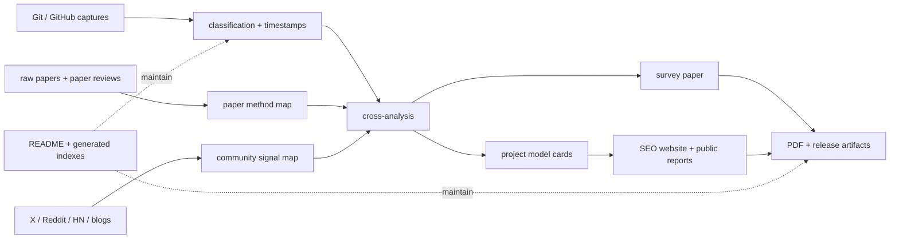

# Awesome Self-Evolving AI Agents / AI Agent 自进化索引与综述

[中文主入口](README.md) | [English](README-EN.md) | [中文兼容镜像](README-ZH.md)

> 说明：中文主入口现在是 [README.md](README.md)。本文件保留 `-ZH` 兼容入口，内容与中文方向一致，但最新聚合总表以根 README 为准。


**一句话：**这个 README 是 AI Agent 自进化方向的领域索引和聚合页，主轴是 **Git/GitHub 项目**、**论文**、**X/社区信号**。

**三句话地图：**Git 告诉我们哪些系统真的被做出来、发布、star、评测和复用。论文告诉我们方法、机制、实验、边界和未解决问题。X/Twitter、Reddit、Hacker News、博客和排行榜告诉我们实时注意力、工程痛点、批评、采用和热度。

这个仓库叫 Awesome list，所以根 README 不能只是项目说明。读者应该先在这里看懂 AI Agent 自进化这个方向，再决定要不要进入源码树、论文草稿或站点源码。

## 核心索引

| 主轴 | 已加工规模 | 从这里开始 | 能读出什么 |
|---|---:|---|---|
| Git / GitHub 项目 | 482 个 raw captures，482 个已分类仓库，200 个 model-card 项目，79 个严格自进化仓库，175 个广义进化相关仓库 | [GitHub Project Data Analysis](analysis/github-project-data-analysis.md)、[repo classification](research/repo-classification.md) | 项目语料、category/theme 计数、时间线、严格/广义自进化子集、证据 join |
| 论文 | 157 个 raw paper 文件，100 篇详细论文引用，25 个已匹配 review，13 篇深度论文笔记，213 页 PDF 草稿 | [详细论文索引](research/agent-self-evolution-papers-detailed.md)、[paper review coverage](analysis/paper-review-coverage.md)、[paper draft PDF](paper-drafts/main.pdf) | 方法图谱：framework、reflection、代码修复、self-play、curriculum、memory、alignment、open-ended evolution、theory |
| X / 社区 / 公共讨论 | 350+ 条 curated entries：X/Twitter 13、Reddit 45、Hacker News 31、博客/教程 71、视频/播客 14、排行榜 10、curated lists 13 | [social media curated index](output/social-media-curated.md)、[中文社交索引](output/social-media-curated-ZH.md) | 实时讨论、论文传播、风险批评、工程教程、社区争议和采用信号 |
| 跨源综合 | 作者网络、博客/source profiles、项目 model cards、公开网站、知识图谱 | [author network](research/author-network.md)、[blog/source profiles](research/blog-author-profiles-all.md)、[public site](https://shiyao-huang.github.io/awesome-Agent-evolution/) | Git 项目、论文、作者、实验室和社区信号之间的关系 |

## 读者路线

| 如果你只有... | 读这里 | 为什么 |
|---|---|---|
| 3 分钟 | 读完本 README 到 [跨源综合](#跨源综合) | 先拿到这个领域的压缩结构 |
| 15 分钟 | [GitHub Project Data Analysis](analysis/github-project-data-analysis.md) + [Social Media Curated](output/social-media-curated.md) | 同时看到项目语料和公共讨论层 |
| 45 分钟 | [详细论文索引](research/agent-self-evolution-papers-detailed.md) + [13 篇深度论文笔记](#深度论文笔记) | 拿到方法和研究主干 |
| 要构建或研究 | [repo classification](research/repo-classification.md) + [project model-card index](site/public/reports/projects/INDEX.md) + [paper PDF](paper-drafts/main.pdf) | 可以比较具体系统、证据和论文结论 |

## 证据快照

| 来源层 | 当前值 | 索引 / 证据 |
|---|---:|---|
| GitHub raw captures | 482 | [raw GitHub timestamp index](output/raw-github-timestamp-index.md)、[raw-github/](raw-github/) |
| 已分类 GitHub 仓库 | 482 | [repo classification](research/repo-classification.md)、[classification JSON](research/repo-classification.json) |
| 已分析 model-card 项目 | 200 | [public project report index](site/public/reports/projects/INDEX.md)、[source project index](projects/INDEX.md) |
| 严格 evolution-theme 仓库 | 79 | [corpus funnel](analysis/github-project-data-analysis.md#corpus-funnel) |
| 广义 evolution-related 仓库 | 175 | [corpus funnel](analysis/github-project-data-analysis.md#corpus-funnel) |
| Raw paper 文件 | 157 | [raw papers timestamp index](output/raw-papers-timestamp-index.md)、[raw-papers/](raw-papers/) |
| 详细自进化论文引用 | 100 | [agent self-evolution paper reference](research/agent-self-evolution-papers-detailed.md) |
| 深度论文笔记 | 13 | [research/papers/](research/papers/) |
| 已匹配 paper review | 25 matched，112 missing | [paper review coverage](analysis/paper-review-coverage.md) |
| Curated 社交/社区条目 | 350+ | [social media curated index](output/social-media-curated.md) |
| 博客/source entities | 157 个唯一作者或来源实体 | [blog/source profile index](research/blog-author-profiles-all.md) |
| 综述论文草稿 | 213 pages | [paper-drafts/main.pdf](paper-drafts/main.pdf)、[paper source](paper-drafts/main.tex) |
| 公开站点构建 | 281 pages | [GitHub Pages site](https://shiyao-huang.github.io/awesome-Agent-evolution/) |

## Git 索引

Git/GitHub 是第一证据层：它告诉我们哪些系统真实存在、如何自我描述、被拿来做什么，以及哪些项目是严格自进化、哪些只是相邻基础设施。

### Git 语料漏斗

| Layer | Count | Definition |
|---|---:|---|
| Raw GitHub captures | 482 | `output/raw-github-timestamp-index.json` 中的记录，每条指向一个 `raw-github/*.md` capture |
| Classified repositories | 482 | `research/repo-classification.json` 中带 category、theme、stack、time slice 的行 |
| Analyzed model-card projects | 200 | `site/src/data/projects.ts` 中拥有公开项目页和报告的仓库 |
| Strict evolution-theme repositories | 79 | 标准化 `base_theme` 为 `evolution` 的仓库 |
| Broad evolution-related repositories | 175 | 命中 evolution、self-improvement、reflection、search 或相邻 improvement-loop 信号的仓库 |

### Git Collection Categories

| Category | Count | 含义 |
|---|---:|---|
| Framework | 138 | Agent runtime、orchestration、harness、tool layer、多 agent framework |
| Evaluation | 97 | Benchmark、test harness、scoring tool、task suite、regression gate |
| Tutorial | 91 | 教学仓库、walkthrough、example implementation、curated resource |
| Tool | 79 | 工具、开发辅助、agent 支撑组件 |
| Application | 47 | 产品型或 workflow-specific agents |
| Paper-code | 29 | 论文配套或围绕论文发布的代码 |
| Benchmark | 1 | 不归入 broader evaluation bucket 的显式 benchmark-only capture |

### Git Collection Themes

| Theme | Count | 怎么读 |
|---|---:|---|
| Evaluation | 89 | 这个领域需要证明，不只是 demo |
| Memory | 88 | 持久状态正在变成核心可进化 substrate |
| Evolution | 79 | 直接的自我改进、搜索、reflection 和 mutation loop |
| Skill | 60 | 可复用 know-how package 和 skill library |
| Framework | 50 | 通用 agent stack 和 runtime abstraction |
| Education-list | 35 | Awesome list、survey、guide repo |
| Research-agent | 31 | 面向研究、科学、文献、实验和论文工作流的 agent |
| Prompt-optimization | 26 | Prompt/program search、LLM-as-optimizer、evolutionary prompting |
| Coding-agent | 17 | 软件 agent、代码修复、SWE workflow、自修改代码 |
| Workflow-automation | 6 | 业务和流程自动化 agent |
| Safety | 1 | 当前 Git 语料中的 safety-first capture |

### 已抽取 Git 方向

| 方向 | 当前信号 | 代表入口 | 为什么重要 |
|---|---:|---|---|
| Self-evolution loops | 79 strict / 175 broad repos | [OpenEvolve](projects/algorithmicsuperintelligence__openevolve.md)、[Reflexion](projects/noahshinn__reflexion.md)、[AgentEvolver](projects/modelscope__agentevolver.md)、[ADAS](projects/03-adas-automated-design-agentic-systems.md)、[EvoAgentX](site/public/reports/projects/22-evoagentx-agent-evolution-framework.md) | 核心系统会在反馈下改 prompt、code、skill、memory、agent architecture 或 search policy |
| Memory / state | 88 memory-theme repos | [Mem0](projects/58-mem0-agent-memory.md)、[LangMem](projects/70-langmem-agent-memory.md)、[Graphiti](projects/71-graphiti-temporal-context-graphs.md)、[MemoryAgentBench](projects/111-memoryagentbench-incremental-memory-eval.md) | Agent 想跨时间进化，必须有持久、可测试、能处理冲突的状态 |
| Skills / reusable know-how | 60 skill-theme repos | [Anthropic Skills](projects/64-anthropic-skills.md)、[OpenAI Skills](projects/121-openai-skills-codex-catalog.md)、[AgentSkills](projects/157-agentskills-open-standard.md)、[SkillRL](projects/148-skillrl-recursive-skill-rl.md) | Skills 把本地流程变成可安装、可测试、可修改、可复用的能力 |
| Evaluation / benchmarks | 89 evaluation-theme repos | [AgentBench](site/public/reports/projects/38-agentbench.md)、[OSWorld](projects/73-osworld-computer-agent-benchmark.md)、[BrowserGym](projects/75-browsergym-web-agent-benchmark.md)、[Claw-Eval](projects/55-claw-eval-agent-evaluation.md) | Evaluation 是真实进步和表面 prompt churn 之间的分界线 |
| Harness engineering | 138 framework repos plus harness reports | [OpenClaw](site/public/reports/projects/48-openclaw.md)、[Aden Hive](projects/68-aden-hive.md)、[SwarmClaw](projects/93-swarmclaw-agent-runtime.md)、[OpenClaw Factory](projects/170-openclaw-harness-engineering-factory.md) | Harness 决定工具、权限、回滚、状态、评估器和多 agent 执行 |
| Agent frameworks | 138 framework repos | [AutoGPT](projects/08-autogpt-autonomous-agent.md)、[MetaGPT](projects/07-metagpt-multi-agent-framework.md)、[AutoGen](site/public/reports/projects/11-autogen-multi-agent-conversation.md)、[LangGraph](projects/16-langgraph-agent-workflow.md)、[OpenHands](projects/19-openhands-dev-agent.md) | Frameworks 展示读者真正能运行、集成、比较、扩展的东西 |
| Prompt/program optimization | 26 prompt-optimization repos | [DSPy](site/public/reports/projects/10-dspy-declarative-llm-programming.md)、[OPRO](projects/01-opro-llm-as-optimizer.md)、[FunSearch](projects/04-funsearch-mathematical-discoveries.md)、[EvoPrompt](site/public/reports/projects/20-evoprompt-prompt-optimization.md)、[SCOPE](projects/jarvispei__scope.md) | 这是经典进化计算和现代 LLM agent improvement 的桥 |
| Research agents | 31 research-agent repos | [AutoResearchClaw](projects/116-autoresearchclaw-self-evolving-research-agent.md)、[ScienceClaw](projects/90-scienceclaw-research-agent.md)、[AI Scientist note](research/papers/13-ai-scientist.md) | Research agents 检验自进化是否能产出可验证实验、引用、代码和 paper-like output |

### Git 阅读文件

| 需求 | 文件 |
|---|---|
| 完整 Git 语料分析 | [analysis/github-project-data-analysis.md](analysis/github-project-data-analysis.md) |
| 已分类 repo 表 | [research/repo-classification.md](research/repo-classification.md) |
| 带时间戳的 raw Git captures | [output/raw-github-timestamp-index.md](output/raw-github-timestamp-index.md) |
| 公开 model-card reports | [site/public/reports/projects/INDEX.md](site/public/reports/projects/INDEX.md) |
| 源 model-card reports | [projects/INDEX.md](projects/INDEX.md) |
| 网站项目元数据 | [site/src/data/projects.ts](site/src/data/projects.ts) |

## 论文索引

论文是第二证据层：它给出 Git 系统和社区热度背后的机制、实验、claim 和 limitation。

### 论文语料

| Paper layer | Count | 主文件 |
|---|---:|---|
| Raw paper files | 157 | [output/raw-papers-timestamp-index.md](output/raw-papers-timestamp-index.md) |
| Detailed paper references | 100 | [research/agent-self-evolution-papers-detailed.md](research/agent-self-evolution-papers-detailed.md) |
| Matched review files | 25 | [analysis/paper-review-coverage.md](analysis/paper-review-coverage.md) |
| Missing review targets | 112 | [analysis/paper-review-coverage.md](analysis/paper-review-coverage.md) |
| Deep paper notes | 13 | [research/papers/](research/papers/) |
| Survey paper draft | 213 pages | [paper-drafts/main.pdf](paper-drafts/main.pdf) |

### 论文方法图谱

| Category | Count | 代表思想 |
|---|---:|---|
| Frameworks | 12 | Darwin Godel Machine、Godel Agent、RAGEN、ADAS、AgentEvolver、symbolic agent learning |
| Methods | 22 | RISE、Agent-R、SICA、EvolveR、ACE、self-developing agents、test-time self-improvement |
| Self-play and RL | 10 | Self-play environments、RL-based self-improvement、agent training loops |
| STaR and reasoning self-improvement | 6 | Self-generated rationales、reasoning bootstrapping、weak supervision loops |
| Self-reflection and Reflexion | 6 | Verbal reinforcement、reflection memory、feedback-driven retry loops |
| Code self-correction | 5 | Code repair、bug fixing、SWE-style evaluation and improvement |
| Self-evolving curriculum | 5 | Automatic task generation、curriculum search、challenge generation |
| Experience learning | 4 | 记录和复用 trajectories、lessons、execution traces |
| Memory and lifelong learning | 6 | Long-term state、consolidation、retrieval、adaptive behavior |
| Self-rewarding and alignment | 5 | Model-as-judge、reward modeling、constitutional/process feedback |
| Multi-agent debate and collaboration | 5 | Debate、coarse-to-fine refinement、collaborative reasoning |
| Evolutionary strategies | 4 | LLMs as evolution strategies、program/prompt/policy search |
| Open-ended evolution and classics | 5 | Voyager、generative agents、novelty search、foundation agents |
| Weak-to-strong and theory | 5 | Sharpening、weak-to-strong generalization、approval and safety theory |

### 深度论文笔记

| 笔记 | 为什么读 |
|---|---|
| [Agent Symbolic Learning](research/papers/01-agent-symbolic-learning.md) | Agent 的 textual backpropagation 和 symbolic update |
| [Darwin Godel Machine](research/papers/02-darwin-godel-machine.md) | 自修改 coding agent 的 open-ended archive |
| [Godel Agent](research/papers/03-godel-agent.md) | 受 Godel machine 启发的 self-referential agent framework |
| [ADAS](research/papers/04-adas.md) | Automated design of agentic systems 和 architecture search |
| [Reflexion](research/papers/05-reflexion.md) | Verbal reinforcement 和 reflection memory |
| [Self-Refine](research/papers/06-self-refine.md) | 不额外训练的 iterative self-feedback/revision |
| [Absolute Zero](research/papers/07-absolute-zero.md) | 无外部数据的 self-play style reasoning |
| [AlphaEvolve](research/papers/08-alphaevolve.md) | 用于算法发现的 evolutionary coding agents |
| [RISE](research/papers/09-rise.md) | Recursive self-improvement 方法 |
| [RAGEN](research/papers/10-ragen.md) | Self-evolving agents 的训练/评估框架 |
| [SelfEvolve](research/papers/11-selfevolve.md) | 多 agent self-evolution framework 和 benchmark claims |
| [REVEAL](research/papers/12-reveal.md) | Agent improvement 的评估和学习循环 |
| [AI Scientist](research/papers/13-ai-scientist.md) | 研究自动化和 paper-producing agent workflow |

### 论文阅读文件

| 需求 | 文件 |
|---|---|
| 完整详细论文列表 | [research/agent-self-evolution-papers-detailed.md](research/agent-self-evolution-papers-detailed.md) |
| 中文详细论文列表 | [research/agent-self-evolution-papers-detailed-ZH.md](research/agent-self-evolution-papers-detailed-ZH.md) |
| Coverage audit | [analysis/paper-review-coverage.md](analysis/paper-review-coverage.md) |
| Paper draft PDF | [paper-drafts/main.pdf](paper-drafts/main.pdf) |
| Paper source | [paper-drafts/main.tex](paper-drafts/main.tex) |
| Research note folder | [research/papers/](research/papers/) |

## X / 社区信号索引

X 和社区来源是第三证据层：它们显示一个方向在变成干净论文或成熟 Git repo 之前，人们注意什么、争论什么、尝试构建什么。

### 社交语料

| Source type | Count | 贡献 |
|---|---:|---|
| X/Twitter | 13 | 快速传播的 claim、论文发布、survey announcement、风险批评、实验室信号 |
| Reddit | 45 | 更长的公众讨论、怀疑、实现问题、AGI/self-improvement framing |
| Hacker News | 31 | 对 DGM、Godel Agent、agent framework、自修改工具、benchmark 的工程反应 |
| Blog/tutorial | 71 | 实践指南、开发者解释、架构 walkthrough |
| Video/podcast | 14 | Talk、demo、interview、tutorial-style explanation |
| Ranking/evaluation platforms | 10 | 可见度、leaderboard、产品/ranking 信号 |
| Curated lists/directories | 13 | 其他索引表面和相邻 Awesome lists |
| Community platforms | 13 | Discord/newsletter/community coordination |
| Industry case studies | 4 | 生产或公司级 agent engineering 例子 |
| Harness engineering resources | 6 | 围绕工具、控制、eval、deployment 的 agent engineering practice |
| Academic references outside paper set | 8 | 社区研究中补充浮现的学术参考 |
| StackExchange Q&A | 6 | 公开概念问题和实践误解 |

### 已抽取 X 信号

| Signal | Date | 为什么有用 |
|---|---:|---|
| @MaryamMiradi: university survey on self-evolving AI agents | 2025-10-13 | Survey-level framing 和 bibliography discovery |
| @rohanpaul_ai: three laws of self-evolving agents | 2025-08-14 | Endure、excel、evolve 的压缩概念框架 |
| @DataScienceDojo: "Your Agent May Misevolve" risk signal | 2025-10-01 | 对 failure modes 和不安全自我改进的批评 |
| @omarsar0: AgentEvolver mechanisms | 2025-11-14 | 把公共讨论连接到具体 evolution framework |
| @BiologyAIDaily: STELLA biomedical self-evolving agent | 2025-07-04 | 生物医学研究中的 domain-specific self-evolution 信号 |
| @pliang279: critique of constrained loops | 2026-04-07 | 对狭窄或虚假 self-evolution 的有用怀疑 |
| @chainyoda: recursive self-improvement as hot theme | 2026-04-28 | 热度信号和 discourse clustering |
| @karpathy: autoresearch project signal | 2026-03-07 | Research automation 和 agentic science 兴趣 |
| @nvidia: agentic AI evolution framing | 2026-05-07 | Industry-level framing 和采用信号 |

### 社区争议主题

| 争议 | 去哪里读 | 应该抽取什么 |
|---|---|---|
| Self-evolution 是真东西还是 hype? | [social media curated index](output/social-media-curated.md) 的 Reddit/HN 部分 | 把 benchmarked improvement 和 recursive-improvement rhetoric 分开 |
| DGM / Godel-style agents 到底不同在哪里? | HN self-evolution/self-improvement entries | Archive、mutation、selection、benchmark gate、自修改风险 |
| Constrained loops 算不算 evolution? | X critique 和 blog/tutorial sections | 固定 eval loop 是否足够算 genuine evolution |
| Harness 应该如何控制 evolving agents? | Harness engineering resources 和 industry case studies | 权限、回滚、评估、trace logging、deployment boundary |
| 实践者最先复制什么? | Blog/tutorial 和 video/podcast sections | 架构、starter repo、evaluation scaffold、memory pattern |

### 社区阅读文件

| 需求 | 文件 |
|---|---|
| 英文 curated 社交/社区索引 | [output/social-media-curated.md](output/social-media-curated.md) |
| 中文 curated 社交/社区索引 | [output/social-media-curated-ZH.md](output/social-media-curated-ZH.md) |
| 作者和实验室网络 | [research/author-network.md](research/author-network.md) |
| Blog/source entity profiles | [research/blog-author-profiles-all.md](research/blog-author-profiles-all.md) |
| AnySearch verification audit | [research/anysearch-verification-audit.md](research/anysearch-verification-audit.md) |
| Hot search batches | [research/hot-search-batch-1.md](research/hot-search-batch-1.md) |

## 跨源综合

有用的索引不是三张孤立列表，而是把 Git 系统、论文方法和公共信号放进同一张研究地图。

| 主题 | Git evidence | Paper evidence | X/community evidence | 实用读法 |
|---|---|---|---|---|
| Self-modifying coding agents | OpenEvolve、DGM-related repos、coding-agent projects | Darwin Godel Machine、Godel Agent、AlphaEvolve | HN 里关于 DGM、Godel Agent、recursive self-improvement、自修改工具的讨论 | 看 archive design、mutation operators、benchmark gates、rollback、安全边界 |
| Agent architecture search | ADAS、AgentEvolver、EvoAgentX、agent architecture search reports | ADAS、Agent Symbolic Learning、RAGEN、SelfEvolve | X survey threads 和 AgentEvolver discussions | 问清楚到底在进化什么：prompt、tool graph、policy、workflow、role 还是 architecture |
| Memory as evolvable state | Mem0、LangMem、Graphiti、MemoryAgentBench | Experience learning、lifelong learning、Voyager-style skill/memory loops | 关于 long-term memory 和 state 的博客与工程教程 | 查 retrieval、consolidation、contradiction handling、privacy、long-horizon evaluation |
| Skills as portable capabilities | Anthropic Skills、OpenAI Skills、AgentSkills、SkillRL | Skill learning、Voyager、curriculum and experience learning | 关于 skill folders 和 agent reuse 的教程与社区例子 | 查 package format、validation、install target、security、reuse semantics |
| Evaluation and harness control | AgentBench、OSWorld、BrowserGym、Claw-Eval、OpenClaw | Reflexion、Self-Refine、RAGEN、REVEAL | 关于 eval loop、demo、regression 的 HN/blog 争论 | 把 evaluation 当成 self-evolution 的核心控制面 |
| Research automation | AutoResearchClaw、ScienceClaw、AI Scientist-style reports | AI Scientist、AlphaEvolve、scientific algorithm discovery | Karpathy autoresearch signal、AI research agents 博客 | 查系统是否产出可验证 artifact、citation、experiment、reproducible code |
| Safety and misevolution | Safety-tagged captures、harness reports、evaluation gates | Weak-to-strong、reward hacking、MONA、alignment/self-rewarding papers | X risk posts 和 public critique threads | 问循环如何防止 reward hacking、regression、tool misuse 和无根据自信 |

## 这个索引回答的问题

1. 哪些 GitHub 项目只是 raw 发现，哪些已经分类，哪些已经有 model-card 分析？
2. 哪些仓库直接属于 self-evolution，哪些只是相邻基础设施，比如 memory、skills、evaluation、harness？
3. 哪些论文定义了主要方法，哪些论文 claim 有代码或项目证据支撑？
4. 哪些 X/community 信号只是 hype，哪些指向具体论文、repo、benchmark 或工程风险？
5. 这个领域如何沿着 Git release、paper wave 和公共讨论一起演化？

## 仓库维护索引

这一节故意放在最后。它服务于维护索引，而不是定义公开阅读顺序。

| 维护需求 | 入口 |
|---|---|
| 全仓库内容地图 | [CONTENT_INDEX.md](CONTENT_INDEX.md) |
| 生成 master index | [docs/indexes/master-index.md](docs/indexes/master-index.md) |
| Raw layer index | [docs/indexes/raw-index.md](docs/indexes/raw-index.md) |
| Processed layer index | [docs/indexes/processed-index.md](docs/indexes/processed-index.md) |
| Work layer index | [docs/indexes/work-index.md](docs/indexes/work-index.md) |
| Results layer index | [docs/indexes/results-index.md](docs/indexes/results-index.md) |
| Data-flow index | [docs/indexes/data-flow-index.md](docs/indexes/data-flow-index.md) |
| Root document map | [docs/indexes/root-document-map.md](docs/indexes/root-document-map.md) |
| 项目结构规则 | [docs/project-management/project-structure.md](docs/project-management/project-structure.md) |
| 用户直接输入参考 | [docs/project-management/user-direct-inputs.md](docs/project-management/user-direct-inputs.md) |
| 发布准备 | [docs/publishing-readiness-check.md](docs/publishing-readiness-check.md) |
| Agent manual | [AGENTS.md](AGENTS.md) |
| Claude manual | [CLAUDE.md](CLAUDE.md) |
| Cloud/deployment manual | [CLOUD.md](CLOUD.md) |

## 证据管线



## 目录层

| Layer | Canonical paths | 用途 |
|---|---|---|
| Raw evidence | `raw-github/`, `raw-papers/`, `raw-blogs/`, `raw-social/`, `raw-social-rank/` | 来源 capture、时间戳、原始公开证据 |
| Processed analysis | `analysis/`, `research/`, `projects/`, `paper-reviews/`, `papers/`, `cc-materials/` | 分类、交叉分析、项目 model card、论文 review |
| Work artifacts | `paper-drafts/`, `paper/`, `latex/`, `site/`, `survey/`, `scripts/`, `data-engine/` | 论文草稿、站点源码、生成器、图表、中间工作 |
| Results | `reports/`, `output/`, `site/public/reports/`, `paper-drafts/main.pdf`, `site/dist/` | 可发布报告、PDF、静态站点输出、下载资源 |
| Mirrors | `repos/`, `projects/repos/`, `*__/` | 外部仓库 clone 和只读验证镜像 |
| Ops | `docs/`, `AGENTS.md`, `CLAUDE.md`, `CLOUD.md`, `CONTENT_INDEX.md` | 规则、索引、发布检查、协作手册 |

## 迭代闭环

每次人工迭代或定时任务结束前，更新受影响的 README、索引、网站源码、公开报告和 SEO/发布入口；提交前检查 `git status`，只提交本轮相关改动，保护无关用户改动。

## 必要验证

根据改动层选择命令。README / index 改动至少要刷新生成索引并验证站点构建。

```bash
node scripts/generate_project_indexes.mjs
python3 scripts/enforce_raw_timestamps.py
node scripts/analyze_github_project_data.mjs
(cd paper-drafts && xelatex -interaction=nonstopmode -halt-on-error main.tex)
(cd site && npm run build)
```

## 公开站点

- GitHub 仓库：<https://github.com/Shiyao-Huang/awesome-Agent-evolution>
- GitHub Pages：<https://shiyao-huang.github.io/awesome-Agent-evolution/>
- Public project pages：<https://shiyao-huang.github.io/awesome-Agent-evolution/projects/>
- Research page：<https://shiyao-huang.github.io/awesome-Agent-evolution/research/>
- Graph page：<https://shiyao-huang.github.io/awesome-Agent-evolution/graph/>
