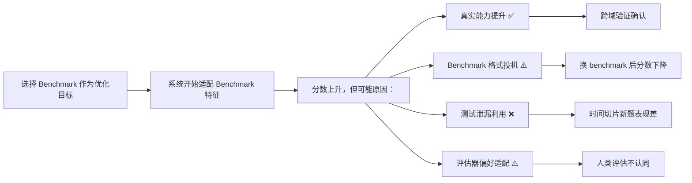

# Benchmark 跨项目对比分析

> **一句话**：将 Agent Evolution 领域的核心 benchmark 放在同一张表里，分析它们对自进化能力的覆盖度，识别陷阱和投机空间，并推荐 benchmark 组合方案。

> **证据层级**：本文件基于 `survey/ch5-evaluation-cn.md` 的评估体系分析、136 个 benchmark/evaluation 仓库的分类数据、11 篇论文 review 的实验部分和 97 个用户痛点中关于评估的条目。标注 [KNOWN] 为有直接证据，[INFERRED] 为推断。

---

## 1. Benchmark 比较总表

### 1.1 软件工程与代码基准

| Benchmark | 测什么 | 怎么测 | 隐藏测试 | 失败轨迹 | 成本报告 | 覆盖自进化维度 | 已知局限 |
|---|---|---|---|---|---|---|---|
| **SWE-Bench** | 真实 GitHub issue 定位+修复 | 单元测试执行 | SWE-Bench Verified 有人工验证子集；部分测试集公开 | [KNOWN] 部分论文提供 | 极少报告 | 算子 U 的代码变异能力 | 污染严重(P062)；刷榜不等于真实能力(P022) |
| **SWE-Bench Verified** | SWE-Bench 的人工验证子集 (500 issues) | 同上，但经人工确认测试相关性 | 是 | 否 | 否 | 同上但更可靠 | 子集仍可能被间接污染 |
| **HumanEval** | 函数级 Python 代码生成 | 单元测试 pass@1/k | 否（完全公开） | 否 | 否 | 输出改进深度 | 任务粒度小，不反映真实工程(P058) |
| **MBPP** | 入门级 Python 编程 | 单元测试 | 否 | 否 | 否 | 基础编码能力 | 过于简单，上限低 |
| **LiveCodeBench** | 竞赛级代码生成 | 测试+时间切片 | 部分新题作为 holdout | 否 | 否 | 抗污染测试 | 仍局限于单函数 |
| **Polyglot** | 多语言代码生成 | 单元测试（多语言） | 否 | 否 | 否 | 跨语言迁移 | 语言覆盖有限 |
| **LeetCodeHardGym** | 困难算法题 | 测试+复杂度检查 | 否 | 否 | 否 | 算法搜索能力 | 题库有限，易过拟合 |
| **DS-1000** | 数据科学代码 | 测试 | 否 | 否 | 否 | 数据科学能力 | 覆盖窄 |
| **rSDE-Bench** | 需求驱动软件开发 | 需求级评估+测试 | 否 | [KNOWN] EvoMAC 提供 | 否 | 端到端软件工程 | 新基准，社区验证少 |

### 1.2 推理与知识基准

| Benchmark | 测什么 | 怎么测 | 隐藏测试 | 失败轨迹 | 成本报告 | 覆盖自进化维度 | 已知局限 |
|---|---|---|---|---|---|---|---|
| **GSM8K** | 小学数学推理 | 答案匹配 | 否 | 否 | 否 | 推理链 bootstrapping(STaR) | 易通过格式化提示投机 |
| **MATH** | 竞赛数学 | 答案匹配 | 否 | 否 | 否 | 高级推理 | 训练污染风险高 |
| **ARC** (AI2 Reasoning) | 科学推理 | 选择题匹配 | 否 | 否 | 否 | 基础推理 | 选择题可猜测 |
| **MMLU** | 多领域知识 | 选择题匹配 | 否 | 否 | 否 | 知识广度 | 已严重污染 |
| **GPQA** | 研究生级专业问答 | 专家标注答案 | 是（部分） | 否 | 否 | 深度推理 | 领域窄 |
| **DROP** | 离散推理 | 答案匹配 | 否 | 否 | 否 | 组合推理 | — |
| **AlpacaEval** | 指令遵循 | LLM-as-judge (自动) | 否 | 否 | 否 | 偏好对齐 | 长度偏好严重(survey/ch5 §5.3.2) |
| **MT-Bench** | 多轮对话质量 | LLM-as-judge | 否 | 否 | 否 | 对话能力 | judge bias |
| **Arena-Hard** | 编码+推理 | LLM-as-judge + 测试 | 部分 | 否 | 否 | 综合能力 | — |

### 1.3 环境交互与 Agent 基准

| Benchmark | 测什么 | 怎么测 | 隐藏测试 | 失败轨迹 | 成本报告 | 覆盖自进化维度 | 已知局限 |
|---|---|---|---|---|---|---|---|
| **OSWorld** | 桌面环境操作 | 虚拟机执行+截图比对 | 部分 | 否 | 否 | 环境适应+工具使用 | 搭建成本极高；虚拟机不稳定 |
| **WebArena** | 网页交互任务 | DOM状态匹配+URL匹配 | 部分 | 否 | 否 | Web agent 多步决策 | 动态网页难以复现 |
| **VisualWebArena** | 视觉网页交互 | 同上 | 部分 | 否 | 否 | 多模态 agent | — |
| **BrowserGym** | 浏览器任务 Gym | Gym 接口+reward | 否 | 否 | 否 | Web agent 统一评测 | 整合多 benchmark 但各自有限 |
| **WebVoyager** | 网页导航 | 人工/自动评分 | 否 | 部分 | 否 | 长程 web 探索 | 评分不完整 |
| **Mind2Web-Live** | 实时网页任务 | 执行验证 | 是（部分） | 否 | 否 | 真实 web 能力 | 实时环境难控制 |
| **AppWorld** | 应用内操作 | API 执行验证 | 否 | 部分 | 否 | 多工具多状态决策 | 环境搭建复杂 |
| **ALFWorld** | 文本+视觉 household | Alfred 执行验证 | 否 | 否 | 否 | 任务规划+工具使用 | 游戏环境，领域窄 |
| **WebShop** | 购物任务 | 奖励函数 | 否 | 否 | 否 | 目标导向 web 交互 | 任务简单 |
| **MiniWoB++** | 小型网页任务 | 奖励函数 | 否 | 否 | 否 | 网页元素操作 | 过于碎片化 |
| **GAIA** (web) | 通用 AI 助手 | 多步验证 | 部分 | 否 | 否 | 综合智能体能力 | 评分标准复杂 |
| **Minecraft/Voyager** | 开放世界探索 | 物品发现+科技树 | 否 | 否 | 否 | 技能库+自动课程 | 领域极窄(Minecraft only) |
| **AgentBench** | 多域 agent | 8 个子域综合 | 部分 | 否 | 否 | 跨域能力 | 各子域深度有限 |

### 1.4 记忆与长期学习基准

| Benchmark | 测什么 | 怎么测 | 隐藏测试 | 失败轨迹 | 成本报告 | 覆盖自进化维度 | 已知局限 |
|---|---|---|---|---|---|---|---|
| **LongMemEval** | 长期记忆准确检索 | 问题+答案匹配 | 部分 | 否 | 否 | 记忆检索质量 | 主要测对话记忆，不覆盖工具记忆 |
| **MemoryAgentBench** | 增量记忆（检索+学习+冲突） | 多轮交互+记忆注入+repeated queries | 否 | 否 | 否 | 记忆生命周期管理 | ICLR 2026，社区验证少 |
| **LoCoMo** | 长上下文对话 | 问题匹配 | 否 | 否 | 否 | 长程理解 | — |
| **EvoMemBench** | 自进化记忆 benchmark | 记忆演化前后对比 | 否 | 否 | 否 | 记忆进化能力 | 新基准 |
| **MSC** (Multi-Session Chat) | 多会话记忆 | 对话一致性检查 | 否 | 否 | 否 | 跨会话记忆 | — |

### 1.5 安全与对抗基准

| Benchmark | 测什么 | 怎么测 | 隐藏测试 | 失败轨迹 | 成本报告 | 覆盖自进化维度 | 已知局限 |
|---|---|---|---|---|---|---|---|
| **claw-eval** | Agent 评估安全 | 多维评分 | 部分 | 否 | 否 | 安全+评估 | 新基准 |
| **skill-inject** | 技能注入攻击 | 容器化 agent 执行+LLM judge | 否 | 是 | 否 | 安全抗性 | — |
| **hal-harness** | 全方位 agent 评估 | 加密排行榜 | 是（加密） | 否 | 是 | 评估完整性 | 新基准 |

---

## 2. 自进化能力覆盖度分析

### 2.1 六类自进化机制的 Benchmark 覆盖

| 自进化维度 | 核心问题 | 有直接覆盖的 benchmark | 覆盖度 | 关键缺口 |
|---|---|---|---:|---|
| **奖励/RL 训练** | 策略是否真正改进？ | SWE-Bench, LiveCodeBench, MATH, ALFWorld | 60% | 缺乏多轮轨迹级基准；cost 效率几乎不测 |
| **自博弈/自课程** | 自生成数据是否有效？ | Absolute Zero 用 HumanEval+/LiveCodeBench | 25% | 缺乏验证自博弈生成的任务质量的基准 |
| **提示词进化** | 反思/记忆是否改善策略？ | ALFWorld, HotpotQA, WebShop, HumanEval | 40% | 缺乏测"反思质量"的基准，只测下游效果 |
| **架构搜索** | 发现的架构是否跨域有效？ | ARC, GFootball(ADAS); SWE-Bench(DGM) | 30% | 缺乏跨域迁移的标准测试协议 |
| **记忆进化** | 经验是否正确积累和复用？ | LongMemEval, MemoryAgentBench, LoCoMo | 45% | 缺乏工具型记忆基准(代码记忆、项目记忆) |
| **混合方法** | 多模块协同是否可靠？ | 无专门基准 | 10% | **最大缺口**：归因分析、模块交互基准不存在 |

### 2.2 五层收敛条件的 Benchmark 覆盖

| 收敛层次 | 定义 | 有覆盖的 benchmark | 覆盖度 |
|---|---|---|---:|
| **L1 局部改进** | V(当前任务) 单调上升 | 几乎所有 benchmark | 95% |
| **L2 稳健改进** | 独立测试集上升 | SWE-Bench Verified, LiveCodeBench, GPQA | 40% |
| **L3 迁移改进** | 新任务分布上升 | ADAS 跨域测试; Polyglot; ARC→GFootball | 15% |
| **L4 开放式改进** | archive 持续产生 stepping stones | 无标准化基准 | 5% |
| **L5 安全改进** | 能力增长不伴随约束违反 | claw-eval, skill-inject, hal-harness | 10% |

---

## 3. Benchmark 陷阱与指标投机

### 3.1 已确认的投机模式

来源：`raw-social/mom-test/mom-test-findings-ZH.md` 和 `survey/ch7-painpoints-cn.md`

| 投机模式 | 影响 benchmark | Mom Test 证据 | 典型手法 |
|---|---|---|---|
| **Leaderboard 过拟合** | SWE-Bench, HumanEval, MATH | P022, P062 | 专门为公开题集调参，不过泛化 |
| **测试泄漏** | GSM8K, MATH, MMLU | P062 | 基础模型训练时已接触 |
| **自评循环** | AlpacaEval, MT-Bench | P010, P054 | 模型既生成又评价，自洽但失真 |
| **格式投机** | AlpacaEval | survey/ch5 §5.3.2 | 输出更长=分数更高 |
| **补丁脆弱性** | SWE-Bench | survey/ch3 §3.4 | 通过测试但不可维护 |
| **环境 hack** | WebArena, MiniWoB | P014, P072 | 利用环境实现漏洞而非真正解决 |
| **同义反复测试** | 任何有自生成测试的场景 | P069 | agent 为自己代码写测试 |
| **成本隐匿** | 所有方法 | P016, P070, P084 | 不报告 token/API/时间消耗 |

### 3.2 Goodhart 链路图



### 3.3 反投机机制清单

| 机制 | 对抗的投机类型 | 实施成本 | 推荐优先级 |
|---|---|---|---|
| 隐藏测试集 | Leaderboard 过拟合、测试泄漏 | 中 | P0 |
| 时间切片评估 | 训练数据污染 | 低 | P0 |
| 多基准交叉验证 | 单一 benchmark 适配 | 低 | P0 |
| 人类抽检校准 | LLM judge bias | 中 | P1 |
| 成本报告强制 | 成本隐匿 | 低 | P1 |
| 失败轨迹公开 | 幸存者偏差 | 中 | P2 |
| 多 seed 复现 | 随机性掩盖 | 低 | P2 |
| 跨域迁移测试 | 局部过拟合 | 高 | P1 |
| 红队/对抗测试 | 安全投机 | 高 | P2 |
| 归因消融 | 归因失败 | 高 | P2 |

---

## 4. 推荐 Benchmark 组合方案

### 4.1 按研究目标的推荐组合

| 研究目标 | 推荐 Benchmark 组合 | 覆盖层 | 成本估算 |
|---|---|---|---|
| **代码自修改验证** | SWE-Bench Verified + LiveCodeBench + Polyglot | L1+L2+跨域 | 高 |
| **推理链 bootstrapping** | MATH + GSM8K + GPQA | L1+L2 | 低 |
| **Web agent 自进化** | WebArena + AppWorld + BrowserGym | L1+L2 | 高 |
| **记忆型自进化** | LongMemEval + MemoryAgentBench + LoCoMo | L1+L2 | 中 |
| **架构搜索验证** | ARC + SWE-Bench + GFootball + 跨域测试 | L1+L2+L3 | 极高 |
| **安全回归** | claw-eval + skill-inject + hal-harness | L5 | 中 |
| **全栈自进化** | SWE-Bench Verified + WebArena + LongMemEval + LiveCodeBench + claw-eval | L1-L5 | 极高 |

### 4.2 最小可信验证集

对于资源有限的研究者，推荐最小可信 benchmark 组合：

```
必需（证明 L1+L2）:
  1. SWE-Bench Verified（代码能力，有隐藏子集）
  2. LiveCodeBench（抗污染代码测试，时间切片）
  3. 1 个环境交互基准（WebArena 或 AppWorld）

推荐（证明 L3）:
  4. Polyglot（跨语言迁移）
  5. 1 个非训练域基准（证明不是 benchmark-specific hack）

可选（证明 L5）:
  6. claw-eval 或 hal-harness（安全回归）
```

### 4.3 Benchmark 选择决策树

```
问题：你的自进化方法主要变什么？
├── 变代码 → SWE-Bench Verified + LiveCodeBench + Polyglot
├── 变 prompt → HotpotQA + ALFWorld + ACE 对应基准
├── 变记忆 → LongMemEval + MemoryAgentBench
├── 变架构 → ARC + SWE-Bench + 跨域测试
├── 变策略/权重 → MATH + GSM8K + 环境 reward 基准
└── 变多模块 → 全栈组合（见上表）+ 消融设计
```

---

## 5. 跨项目评估策略对比

### 5.1 评估可信度分层

| 可信度等级 | 特征 | 代表 benchmark | 论文使用率 |
|---|---|---|---|
| **Tier 1: 强验证** | 程序化测试 + 隐藏集 + 可复现 | SWE-Bench Verified, LiveCodeBench, GPQA | ~25% |
| **Tier 2: 中验证** | 程序化测试但无隐藏集 | HumanEval, MBPP, MATH, GSM8K | ~55% |
| **Tier 3: 弱验证** | LLM-as-judge 或自动评分 | AlpacaEval, MT-Bench, Arena-Hard | ~40% |
| **Tier 4: 环境验证** | 环境 reward 但随机性大 | WebArena, OSWorld, Minecraft | ~20% |
| **Tier 5: 自评验证** | 模型自评或无外部验证 | 部分 AI Scientist 类工作 | ~10% |

### 5.2 各项目评估策略总览

| 项目/论文 | 主基准 | 辅助基准 | 评估可信度 | 报告消融 | 报告成本 | 报告失败案例 |
|---|---|---|---|---|---|---|
| **DGM** | SWE-Bench, Polyglot | — | Tier 1 | 部分 | 否 | 否 |
| **ADAS** | ARC, GFootball | 跨域迁移 | Tier 2 | 是 | 否 | 否 |
| **AlphaEvolve** | 程序化 evaluator | — | Tier 1 | 是 | 部分 | 部分 |
| **Reflexion** | HumanEval, ALFWorld | MBPP, WebShop | Tier 2 | 部分 | 否 | 否 |
| **RAGEN** | 自定义多轮环境 | — | Tier 4 | 是 | 否 | 部分(Echo Trap) |
| **Absolute Zero** | HumanEval+, LiveCodeBench | MATH, GSM8K | Tier 1-2 | 是 | 否 | 部分(mode collapse) |
| **SelfEvolve** | DS-1000, HumanEval | TransCoder | Tier 2 | 部分 | 否 | 否 |
| **ReVeal** | LiveCodeBench | — | Tier 1 | 是 | 否 | 部分 |
| **AI Scientist** | LLM peer review | — | Tier 3 | 否 | 否 | 否 |
| **Voyager** | Minecraft metrics | 技能迁移 | Tier 4 | 部分 | 否 | 否 |

---

## 6. 关键发现与建议

### 6.1 核心发现

1. **[KNOWN]** Benchmark 覆盖高度倾斜：代码基准最密集，但记忆/归因/安全基准严重不足
2. **[KNOWN]** 几乎无 benchmark 测试 L3（迁移改进）以上的收敛条件
3. **[KNOWN]** 成本报告和失败案例报告在实践中几乎不存在
4. **[KNOWN]** 自评验证（Tier 5）在某些工作中被当作充分证据，但这是最不可靠的验证方式
5. **[INFERRED]** 混合方法（占最有前景方向）缺乏任何专门 benchmark

### 6.2 对研究者建议

1. **至少使用 Tier 1-2 基准**：SWE-Bench Verified + LiveCodeBench 应成为代码自修改论文的标配
2. **强制报告成本**：token 数、API 调用数、wall-clock time、每单位提升成本
3. **报告完整消融**：冻结各组件的性能变化，而不仅是最终分数
4. **跨域迁移测试**：至少在 2 个不同领域的基准上验证
5. **时间切片隔离**：搜索/进化用 validation tasks，最终报告用 test tasks，两者严格分离

### 6.3 对 benchmark 设计者建议

1. **增加隐藏测试集**：减少 leaderboard 过拟合空间
2. **标准化失败轨迹格式**：让社区能分析"为什么失败"
3. **内置成本度量**：token 数、API 调用、环境交互步数
4. **设计归因基准**：能区分"方法贡献"vs"模型贡献"vs"prompt 贡献"
5. **跨域迁移协议**：明确如何在多个 benchmark 间进行标准化对比

---

## 引用来源

- survey/ch5-evaluation-cn.md — 评估体系详细分析
- survey/ch7-painpoints-cn.md — 97 个用户痛点中的评估相关条目
- analysis/github-project-data-analysis.md — 136 个 benchmark/evaluation 仓库分类
- projects/73-osworld-computer-agent-benchmark.md — OSWorld model card
- projects/75-browsergym-web-agent-benchmark.md — BrowserGym model card
- projects/111-memoryagentbench-incremental-memory-eval.md — MemoryAgentBench model card
- research/papers/ — 11 篇论文 review 的实验部分
- raw-social/mom-test/mom-test-findings-ZH.md — P008, P022, P031, P054, P062, P067, P069, P075, P082, P088
