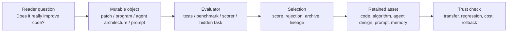

# Code Evolution Benchmark Matrix / 代码自我改进 Benchmark 矩阵

## 一句话

[KNOWN] 代码自我改进不能只看“会写代码”，要区分它是在修补 agent 自身、发现算法、搜索 agent 架构、优化 prompt/program，还是把失败转成下一轮测试和记忆。 — Source: `survey/ch5-evaluation-cn.md`, `research/papers/02-darwin-godel-machine.md`, `research/papers/08-alphaevolve.md`

## 三句话

1. [KNOWN] SWE-Bench、HumanEval、MBPP、LiveCodeBench、Polyglot 和 rSDE-Bench 主要验证软件工程与代码生成；矩阵乘法、Borg scheduling、FlashAttention、circle packing 等任务主要验证可程序化 evaluator 驱动的算法发现。 — Source: `survey/ch5-evaluation-cn.md`, `paper-drafts/appendix.tex`
2. [KNOWN] DGM 和 SICA 的强证据来自“agent 自身代码或工具链被修改后，能在真实 coding benchmark 上提升”；AlphaEvolve、FunSearch、OpenEvolve 和 Science-CodeEvolve 的强证据来自“候选程序可执行、可评分、可放入 archive/selection”。 — Source: `research/papers/02-darwin-godel-machine.md`, `research/papers/08-alphaevolve.md`, `projects/algorithmicsuperintelligence__openevolve.md`, `projects/inter_co__science_codeevolve.md`
3. [INFERRED] 公开页面应该把这些证据按读者问题分层，而不是暴露 agent 内部 workflow：读者要知道哪个 benchmark 支撑哪个声明，维护者的启动检查和验证命令留在 `docs/ops/`。

## 五句话

1. [KNOWN] Rank 3 topic cluster 已在 Survey SEO Topic Map 中定义为“代码自我改进与算法发现”。 — Source: `analysis/survey-seo-topic-map.md`, `site/src/data/topicMap.ts`
2. [KNOWN] Survey 第 2 章把 OPRO、EvoPrompting、ADAS、AlphaEvolve 放入搜索谱系，并指出代码搜索的结构新颖性高但评估质量取决于测试。 — Source: `survey/ch2-theory-cn.md`
3. [KNOWN] Survey 第 5 章明确区分软件工程 benchmark、轻量代码生成 benchmark、环境交互 benchmark 和自动评估驱动的科学/算法发现 benchmark。 — Source: `survey/ch5-evaluation-cn.md`
4. [KNOWN] DGM 报告 SWE-bench Verified 20.0% -> 50.0% 与 Polyglot 14.2% -> 30.7%；AlphaEvolve 报告矩阵乘法、Borg 调度、FlashAttention 和 attention kernel 改进。 — Source: `research/papers/02-darwin-godel-machine.md`, `research/papers/08-alphaevolve.md`, `paper-drafts/appendix.tex`
5. [INFERRED] 因此公开资产的核心不是再做一个排行榜，而是给读者一个 benchmark matrix：从“可变对象 -> 评估器 -> 保留机制 -> 可信风险”判断一个 code-evolution claim 的证据强度。

## Evidence Flow

## Benchmark Matrix

| Mode | Mutable Object | Representative Systems | Best Evidence | Reader Question | Main Risk |
|---|---|---|---|---|---|
| Self-modifying coding agent | Agent code, tool policy, patch loop, review logic | DGM, SICA, A-Evolve | SWE-Bench / SWE-Bench Verified, Polyglot, real repository tests | Did the agent improve its own software-engineering ability, or only solve one task? | Benchmark-specific patching, unsafe self-modification, hidden regressions |
| Algorithm/program discovery | Candidate programs, kernels, heuristics, optimization code | AlphaEvolve, FunSearch, OpenEvolve, Science-CodeEvolve, OpenTreeSearch | Matrix multiplication, Borg scheduling, FlashAttention, attention kernels, circle packing, scientific code tasks | Is there an executable evaluator that can reject wrong but elegant programs? | Optimizing a narrow metric while hurting maintainability or generality |
| Agent architecture search | Python-coded agent design, tool topology, reasoning/control flow | ADAS, Agent Symbolic Learning, A-Evolve | ARC, GFootball, cross-task transfer, cross-model transfer, task benchmark history | Did search find a reusable architecture, or a benchmark-specific prompt trick? | Expensive evaluation, weak transfer, unsafe generated agents |
| Prompt/program optimizer | Prompt, symbolic module, program graph, examples, optimizer state | OPRO, DSPy, GEPA, EvoPrompting | Task validation sets, HumanEval-style code tests, QA/reasoning benchmarks | Is the optimized artifact a reusable program, or a validation-set artifact? | Prompt overfitting, judge bias, unstable gains |
| Reflection and repair loop | Reflection memory, tests, generated critiques, retry strategy | Reflexion, SelfEvolve, ReVeal, EvoMAC | HumanEval, MBPP, LiveCodeBench, generated-unit-test audits | Does the system convert failure into better next attempts? | False-positive tests, memory pollution, context growth without capability |

## Evidence Ladder

| Level | What It Proves | Acceptable Evidence | Weak Evidence |
|---:|---|---|---|
| 1 | The system can generate code | HumanEval, MBPP, unit tests | Demo-only examples or cherry-picked snippets |
| 2 | The system can repair realistic software tasks | SWE-Bench, SWE-Bench Verified, repository regression tests | Single issue solved without held-out validation |
| 3 | The system can discover algorithms under executable constraints | Programmatic evaluator, performance scorer, reproducible task definition | LLM-as-judge only, no runnable scorer |
| 4 | The system retains improvement across generations | Archive, lineage, best-so-far curve, rejected candidates | Final score only |
| 5 | The improvement generalizes | Hidden tests, cross-benchmark transfer, cross-model transfer, cost/regression report | One public benchmark with no failure analysis |

## Public vs Internal Boundary

| Surface | Keep Public | Keep Internal |
|---|---|---|
| Topic page | Reader question, benchmark matrix, representative systems, risks, source links | Agent startup checks, build commands, handoff notes, maintenance runbooks |
| README | Where to begin and how to inspect evidence | Validation command list and session workflow |
| Wiki / docs/ops | Trust chain summary and durable notes | Full operation protocol, index refresh rules, self-mirror mechanics |

## Trust Chain

- [KNOWN] The public topic map currently exposes Rank 3 as code self-improvement and algorithm discovery. Source: `site/src/data/topicMap.ts`
- [KNOWN] DGM, ADAS, AlphaEvolve, OpenEvolve, Science-CodeEvolve, A-Evolve and SICA already have processed project or paper evidence in this repository. Source: `research/papers/02-darwin-godel-machine.md`, `research/papers/04-adas.md`, `research/papers/08-alphaevolve.md`, `projects/algorithmicsuperintelligence__openevolve.md`, `projects/inter_co__science_codeevolve.md`, `projects/115-a-evolve-universal-agent-evolution.md`, `projects/224-sica-self-improving-coding-agent.md`
- [INFERRED] This matrix should become the public Rank 3 evergreen page and link back to benchmark, projects, rankings and the topic map.
