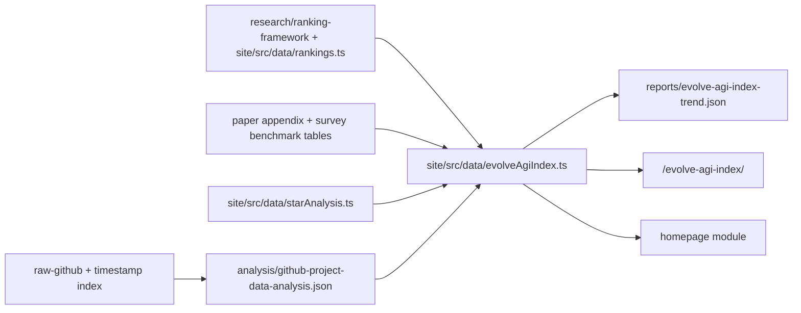

# Evolve-AGI Index / 自进化系数

<!-- @sm:node evolve-agi-index
Scope: processed index methodology + site homepage module + benchmark trend tracking.
Inputs: analysis/github-project-data-analysis.json, site/src/data/rankings.ts, site/src/data/starAnalysis.ts, paper-drafts/appendix.tex, site/src/data/survey.ts.
Outputs: site/src/data/evolveAgiIndex.ts, site/src/pages/evolve-agi-index/index.astro, homepage section.
Verification: node scripts/generate_project_indexes.mjs; (cd site && npm run build).
-->

## 一句话

Evolve-AGI Index 不是 AGI 能力分，而是用 AGI Index 风格衡量 AI Agent 自进化领域是否已经形成 benchmark 可见、可验证、可复用、可治理的改进闭环。

## 三句话

1. 指数只奖励能说明“改了什么、反馈是什么、如何验证、如何保留、如何回滚”的系统。
2. 首页展示的自进化系数由七个信号组成：Benchmark 表现、核心闭环强度、证据链可信度、迁移与验证、可运行与可复用、领域动量、治理成熟度。
3. 公式刻意让 benchmark 分数参与计算，同时降低纯 Star 热度的权重，避免把传播速度误当成自进化成熟度。

## 五句话

1. 本模块把已有系统 Rank、当前价值排名、benchmark 表、GitHub 语料分析和 Star 质量分析压成一个可解释指数。
2. 指数输入来自 `analysis/github-project-data-analysis.json`、`site/src/data/rankings.ts`、`site/src/data/starAnalysis.ts`、`paper-drafts/appendix.tex`、`site/src/data/survey.ts` 和 `research/ranking-framework/radar-profiles.json`，不是手写宣传数字。
3. 权重最高的是 benchmark 表现、核心闭环强度和证据链可信度，因为没有实测分数、反馈、验证和 lineage 的“自进化”只是普通 agent engineering。
4. 迁移、可复用和治理分数通常低于能力分，这反映当前领域的主要矛盾：强 demo 多，稳定工程闭环少。
5. 首页只展示压缩版；完整页面 `/evolve-agi-index/` 展开维度、趋势折线图、benchmark 证据、Top 系统和近期价值信号。

## Formula

```text
EAI = Σ(signal_score × signal_weight)
```

| Signal | Weight | Meaning | Source |
|---|---:|---|---|
| Benchmark 表现 | 18% | HumanEval、SWE-bench、LiveCodeBench、WebArena、AppWorld、AI4S/materials、算法/基础设施 benchmark 的实测表现。 | `paper-drafts/appendix.tex`, `site/src/data/survey.ts`, `research/ranking-framework/radar-profiles.json`, `https://www.deepprinciple.com/papers/mpa.pdf` |
| 核心闭环强度 | 20% | Top 系统是否包含可变对象、反馈、选择和保留机制。 | `site/src/data/rankings.ts`, `research/ranking-framework/README.md` |
| 证据链可信度 | 18% | D2 证据强度 + 项目报告覆盖率。 | `analysis/github-project-data-analysis.json`, `projects/INDEX.md` |
| 迁移与验证 | 14% | D3/D4/U3：跨域迁移、安全验证、学术严谨性。 | `site/src/data/rankings.ts`, `paper-drafts/ch5-evaluation.tex` |
| 可运行与可复用 | 12% | U1/U4/D5：可用性、实用价值、成本效率。 | `site/src/data/rankings.ts` |
| 领域动量 | 10% | 当前价值排名 + Star 活跃度。 | `site/src/data/analysis.json`, `site/src/data/starAnalysis.ts` |
| 治理成熟度 | 8% | D4 安全性 + raw 时间戳置信度。 | `site/src/data/rankings.ts`, `output/raw-github-timestamp-index.md` |

## Benchmark Signal

Benchmark 表现不是旁路展示项，而是总指数 18% 的正式参与项。

| System | Benchmark | Before | After | Gain | Index input | Source |
|---|---|---:|---:|---:|---:|---|
| Reflexion | HumanEval pass@1 | 80.0% | 91.0% | +11.0pp | 91 | `paper-drafts/appendix.tex`, `site/src/data/survey.ts` |
| Reflexion | ALFWorld success | 77% | 97% | +20pp | 97 | `site/src/data/survey.ts`, `research/ranking-framework/radar-profiles.json` |
| SelfEvolve | HumanEval pass@1 | 74.39% | 85.98% | +11.59pp | 86 | `paper-drafts/appendix.tex` |
| DGM | SWE-bench Verified | 20.0% | 50.0% | +30.0pp | 86 | `paper-drafts/appendix.tex`, `research/ranking-framework/radar-profiles.json` |
| SICA | SWE-bench Verified | 17.0% | 53.0% | +36.0pp | 88 | `paper-drafts/appendix.tex` |
| DGM | Polyglot Coding | 14.2% | 30.7% | +16.5pp | 72 | `site/src/data/survey.ts`, `paper-drafts/appendix.tex` |
| SAGE | LiveCodeBench | backbone | +8.9% | +8.9% | 71 | `paper-drafts/appendix.tex` |
| WebRL | WebArena-Lite | 4.8% | 42.4% | +37.6pp | 82 | `paper-drafts/appendix.tex` |
| AgentEvolver | AppWorld | 1.8% | 23.2% | +21.4pp | 67 | `paper-drafts/appendix.tex` |
| AlphaEvolve | Algorithm / infra discovery | prior best | 48 multiplications; Borg +0.7%; FlashAttention +23% | new record / infra gains | 89 | `paper-drafts/appendix.tex`, `research/ranking-framework/radar-profiles.json` |
| MPA / MIRA | Experimental materials properties | direct fine-tuning baseline | 35/40 SOTA; average MAE -15%; up to -55% | AI-for-science model improvement | 84 | `https://www.deepprinciple.com/papers/mpa.pdf`, `https://mp.weixin.qq.com/s/Do3sauQ8oSoRluaCptYe-g` |

The benchmark signal is calculated in `site/src/data/evolveAgiIndex.ts` as:

```text
Benchmark Performance = 0.64 × benchmarkEvidenceScore + 0.36 × benchmarkProfileStrength
```

`benchmarkEvidenceScore` comes from the normalized benchmark evidence rows above. `benchmarkProfileStrength` comes from D1 capability / benchmark dimensions in `research/ranking-framework/radar-profiles.json` and `site/src/data/rankings.ts`.

## Trend Tracking

The `/evolve-agi-index/` page now tracks two lines:

1. `Evolve-AGI Index`: the full weighted index.
2. `Benchmark Performance`: the benchmark sub-index that now participates in the total score.

| Date | Index | Benchmark | Strict / broad repos | Public reports | Source | Note |
|---|---:|---:|---:|---:|---|---|
| 2026-05-26 | 67.4 | 72.2 | 82 / 186 | 90 | `work/research/archived-analysis/github-project-data-analysis.json` | Backfilled with current formula over archived corpus counts. |
| 2026-05-29 | 71.3 | 76.4 | 90 / 195 | 187 | `site/src/data/analysis.json` | Previous site snapshot before benchmark became a weighted signal. |
| 2026-05-30 | 72.9 | 80.1 | 90 / 195 | 193 | `reports/evolve-agi-index-trend.json` | First benchmark-weighted snapshot before the public site data snapshot was synced. |
| 2026-06-01 | 72.9 | 80.1 | 93 / 200 | 239 | `analysis/github-project-data-analysis.json`, `site/src/data/analysis.json` | Public site data snapshot synced to the latest GitHub analysis corpus. |
| 2026-06-02 | 72.9 | 80.1 | 93 / 200 | 239 | `https://www.deepprinciple.com/papers/mpa.pdf`, `https://mp.weixin.qq.com/s/Do3sauQ8oSoRluaCptYe-g` | Added MPA / MIRA as AI-for-science recursive-training benchmark evidence; corpus counts unchanged. |

Backfilled points are marked as comparable historical snapshots, not as independent historical APIs. The current result-layer snapshot is `reports/evolve-agi-index-trend.json`; future iterations should append real snapshots there so the trend line becomes fully append-only.

## Data Flow



## Trust Chain

- [KNOWN] GitHub 语料规模、严格 evolution 子集、广义 evolution-related 子集来自 `analysis/github-project-data-analysis.json`。
- [KNOWN] Benchmark 表现来自 `paper-drafts/appendix.tex`、`site/src/data/survey.ts` 和 `research/ranking-framework/radar-profiles.json`。
- [KNOWN] MPA / MIRA 材料性质预测证据来自 Deep Principle 技术报告；机器之心微信文章作为中文传播与发现来源。该条增强 AI-for-science benchmark signal，但不等同于通用自治 AGI 证据。
- [KNOWN] 系统 Rank 的 9 维评分来自 `site/src/data/rankings.ts`，评估维度说明来自 `research/ranking-framework/README.md`。
- [KNOWN] Star 活跃、贡献者多样性、fork 质量等传播信号来自 `site/src/data/starAnalysis.ts`。
- [KNOWN] 时间戳缺失比例来自 `output/raw-github-timestamp-index.md` 和 GitHub analysis JSON。
- [KNOWN] 当前趋势快照落在 `reports/evolve-agi-index-trend.json`。

## Limits

- 当前指数是领域成熟度指数，不是单一模型或单一产品的 AGI 能力评估。
- Benchmark input score 是跨 benchmark 家族的归一化分，不等同于原始 pass@1 或 success rate；页面保留 raw before/after/gain 以便审计。
- MPA / MIRA 属于材料科学域的 AI-for-science / recursive-training 证据；它证明领域模型训练与评估闭环的进展，不证明通用智能体已经具备开放域自我改造能力。
- Star 活跃度只作为动量信号，不直接证明技术质量。
- `site/src/data/analysis.json` 已在 2026-06-01 同步到根部 GitHub analysis：646 classified repos、93 strict evolution repos、200 broad evolution repos、239 analyzed public-report records。
- 后续应把每个 signal 的历史值追加写入 `reports/evolve-agi-index-trend.json`，形成 append-only 趋势快照，而不是替换历史 points。
