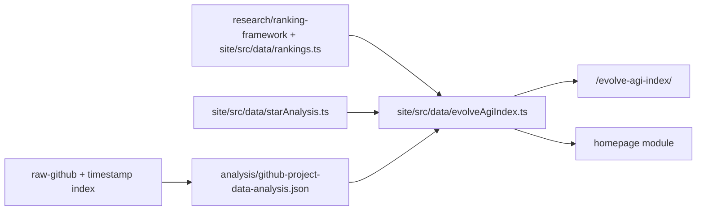

# Evolve-AGI Index / 自进化系数

<!-- @sm:node evolve-agi-index
Scope: processed index methodology + site homepage module.
Inputs: analysis/github-project-data-analysis.json, site/src/data/rankings.ts, site/src/data/starAnalysis.ts.
Outputs: site/src/data/evolveAgiIndex.ts, site/src/pages/evolve-agi-index/index.astro, homepage section.
Verification: node scripts/generate_project_indexes.mjs; (cd site && npm run build).
-->

## 一句话

Evolve-AGI Index 不是 AGI 能力分，而是用 AGI Index 风格衡量 AI Agent 自进化领域是否已经形成可验证、可复用、可治理的改进闭环。

## 三句话

1. 指数只奖励能说明“改了什么、反馈是什么、如何验证、如何保留、如何回滚”的系统。
2. 首页展示的自进化系数由六个信号组成：核心闭环强度、证据链可信度、迁移与验证、可运行与可复用、领域动量、治理成熟度。
3. 公式刻意降低纯 Star 热度的权重，避免把传播速度误当成自进化成熟度。

## 五句话

1. 本模块把已有系统 Rank、当前价值排名、GitHub 语料分析和 Star 质量分析压成一个可解释指数。
2. 指数输入来自 `analysis/github-project-data-analysis.json`、`site/src/data/rankings.ts` 和 `site/src/data/starAnalysis.ts`，不是手写宣传数字。
3. 权重最高的是核心闭环强度和证据链可信度，因为没有反馈、验证和 lineage 的“自进化”只是普通 agent engineering。
4. 迁移、可复用和治理分数通常低于能力分，这反映当前领域的主要矛盾：强 demo 多，稳定工程闭环少。
5. 首页只展示压缩版；完整页面 `/evolve-agi-index/` 展开维度、Top 系统和近期价值信号。

## Formula

```text
EAI = Σ(signal_score × signal_weight)
```

| Signal | Weight | Meaning | Source |
|---|---:|---|---|
| 核心闭环强度 | 24% | Top 系统是否包含可变对象、反馈、选择和保留机制。 | `site/src/data/rankings.ts`, `research/ranking-framework/README.md` |
| 证据链可信度 | 22% | D2 证据强度 + 项目报告覆盖率。 | `analysis/github-project-data-analysis.json`, `projects/INDEX.md` |
| 迁移与验证 | 16% | D3/D4/U3：跨域迁移、安全验证、学术严谨性。 | `site/src/data/rankings.ts`, `paper-drafts/ch5-evaluation.tex` |
| 可运行与可复用 | 14% | U1/U4/D5：可用性、实用价值、成本效率。 | `site/src/data/rankings.ts` |
| 领域动量 | 14% | 当前价值排名 + Star 活跃度。 | `site/src/data/analysis.json`, `site/src/data/starAnalysis.ts` |
| 治理成熟度 | 10% | D4 安全性 + raw 时间戳置信度。 | `site/src/data/rankings.ts`, `output/raw-github-timestamp-index.md` |

## Data Flow



## Trust Chain

- [KNOWN] GitHub 语料规模、严格 evolution 子集、广义 evolution-related 子集来自 `analysis/github-project-data-analysis.json`。
- [KNOWN] 系统 Rank 的 9 维评分来自 `site/src/data/rankings.ts`，评估维度说明来自 `research/ranking-framework/README.md`。
- [KNOWN] Star 活跃、贡献者多样性、fork 质量等传播信号来自 `site/src/data/starAnalysis.ts`。
- [KNOWN] 时间戳缺失比例来自 `output/raw-github-timestamp-index.md` 和 GitHub analysis JSON。

## Limits

- 当前指数是领域成熟度指数，不是单一模型或单一产品的 AGI 能力评估。
- Star 活跃度只作为动量信号，不直接证明技术质量。
- 如果 `site/src/data/analysis.json` 没有同步根部 GitHub analysis，首页指数会落后；本轮需要同步该站点快照。
- 后续应把每个 signal 的历史值写入结果层，形成趋势曲线，而不是只展示当前快照。
