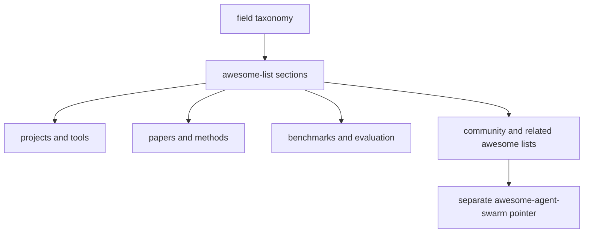

# evomap/awesome-agent-evolution Dual-Chain Deep Dive

> Date: 2026-06-02. Layer: `processed/analysis`. Source queue: `analysis/value-evidence-repair-queue.json`. Evidence quality: public GitHub page only; shell GitHub API remained unreachable.

## One Sentence

`EvoMap/awesome-agent-evolution` is not a runnable self-evolving system but a valuable external taxonomy mirror: it packages the same field into a curated awesome-list structure that we can learn from, compare against, and deliberately diverge from where our evidence standards are higher.

## Three Sentences

[KNOWN] The public GitHub page on 2026-06-02 shows `EvoMap/awesome-agent-evolution` at 130 stars, 17 forks, 57 commits, no releases, and a JavaScript/Shell footprint with `data/` and `scripts/` folders. Source: `raw-github/evomap_awesome-agent-evolution.md`.

[KNOWN] The README organizes the field into self-evolution, memory, prompt optimization, A2A/MCP protocols, development platforms, coding/software engineering, safety, embodied AI, papers, benchmarks, and community knowledge, and explicitly points readers to a separate Awesome Agent Swarm list. Source: `raw-github/evomap_awesome-agent-evolution.md`.

[INFERRED] Its correct frontier role is `resource-index / taxonomy comparator`: it matters less as a direct implementation target and more as a signal for how the wider ecosystem currently packages and markets the self-evolving agent space.

## Evidence Chain

| Link | Status | Evidence |
|---|---|---|
| Raw capture | [KNOWN] | `raw-github/evomap_awesome-agent-evolution.md` refreshed on 2026-06-02 with current stars/forks/commits, topics, and taxonomy signals. |
| Queue row | [KNOWN] | `analysis/value-evidence-repair-queue.json` lane `deep-read-needed`, `value_score: 80.57`, `repair_score: 133.57`. |
| Project card | [KNOWN] | `projects/394-evomap-awesome-agent-evolution.md` and `site/public/reports/projects/394-evomap-awesome-agent-evolution.md`. |
| Site data | [KNOWN] | `site/src/data/projects.ts` and `site/src/data/curatedFrontier.ts` are updated in this iteration. |
| API blocker | [KNOWN] | Shell GitHub API access remained blocked; freshness is web-observed. |

## Mirror Chain

```json
{
  "node": "project.evomap.awesome-agent-evolution",
  "feature": "value-evidence-repair.deep-read",
  "intent": "Use an external awesome list as a mirror for our own curation logic rather than treating it as a runtime implementation.",
  "rank_decision": "promote-to-taxonomy-comparator",
  "rank_confidence": "medium",
  "main_tension": "Broad, readable field packaging vs shallow evidence density compared with our model-card-first pipeline.",
  "why_now": "The user explicitly wants README, website, graph, benchmark, memory, and Agent-Swarm surfaces to move together; this repo is a live external comparator for that packaging problem.",
  "next_action": "Keep as an external awesome-list anchor and compare its taxonomy with our README/site topic map, especially around memory, benchmark, and swarm boundaries."
}
```

## Working Principle



## Trust Chain

- [KNOWN] Public GitHub page metadata and README taxonomy were re-read on 2026-06-02.
- [KNOWN] Shell GitHub API remained unreachable; all freshness claims are web-observed.
- [INFERRED] The taxonomy-comparator decision comes from the repo structure, category layout, and relationship to our own public packaging goals.
- [UNVERIFIED] No local execution of EvoMap `data/` or `scripts/` was performed in this pass.
