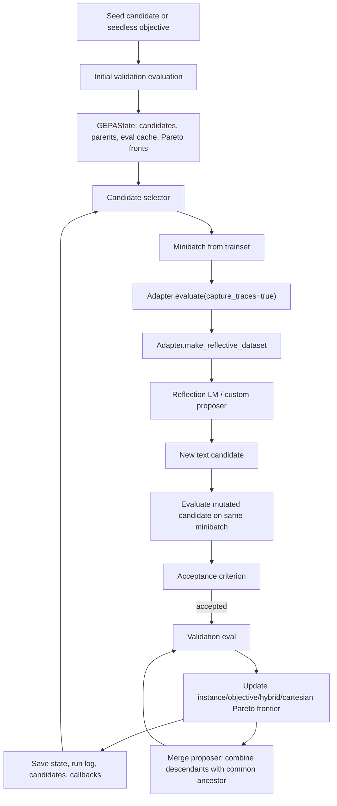

# gepa-ai/gepa Dual-Chain Deep Dive

> Date: 2026-06-02. Layer: `processed/analysis`. Source queue: `analysis/value-evidence-repair-queue.json`. Local source mirror: `projects/repos/gepa-ai__gepa` from GitHub tarball `main` at commit `5ea1aa1`; direct `git clone` timed out twice on `github.com:443`.

## One Sentence

`gepa-ai/gepa` is a current high-value frontier anchor for prompt/program/skill evolution: it turns full execution traces and evaluator diagnostics into reflective mutations, keeps a Pareto frontier of specialized candidates, and has strong 2026 code, issue, PR, release, adapter, and adoption evidence, but it should be described as a text-artifact optimizer rather than a complete autonomous self-evolving agent by itself.

## Three Sentences

[KNOWN] Live GitHub metadata shows `gepa-ai/gepa` was created `2025-08-05T09:26:27Z`, pushed `2026-05-30T23:56:17Z`, updated `2026-06-01T15:52:34Z`, has MIT license, latest release `v0.1.1` published `2026-03-16T10:15:05Z`, 4,890 stars, 411 forks, 90 open issues, and 20 watchers/subscribers. Sources: `gh repo view gepa-ai/gepa --json ...`; `gh api repos/gepa-ai/gepa`; `gh api repos/gepa-ai/gepa/releases`.

[KNOWN] The raw capture is stale or incomplete for current ranking: `raw-github/gepa-ai_gepa.md` has `content_timestamp: unknown`, `collected_at: 2026-05-20T17:44:59Z`, star text around 4.5k, while `research/repo-classification.csv` still records 4 stars and Markdown stack. Sources: `raw-github/gepa-ai_gepa.md`; `research/repo-classification.csv`; live GitHub API.

[INFERRED] GEPA should be promoted from generic `deep-read-needed` to `frontier-prompt-program-optimizer`: it directly fills the "modify + verify + retain" segment of the self-evolution pipeline for prompts, text components, agent skills, code snippets, MCP/tool descriptions, LangChain/LangGraph rollouts, and any text artifact with measurable feedback, while independent reproduction should be handled through `gepa-ai/optimize-anything-artifact`.

## Five Sentences

[KNOWN] The README defines GEPA as a Genetic-Pareto framework that optimizes textual parameters using LLM reflection over full traces such as error messages, profiling data, reasoning logs, and evaluator feedback, rather than reducing rollouts to a scalar reward. Source: `raw-github/gepa-ai_gepa.md`.

[KNOWN] The local source mirror has 509 files, 185 Python files, 43 `test*.py` files, package version `0.1.1`, `src/gepa`, `tests`, docs, adapters, examples, and `gskill`. Sources: `projects/repos/gepa-ai__gepa`; `projects/repos/gepa-ai__gepa/pyproject.toml`.

[KNOWN] The core loop is explicit in code: `GEPAEngine.run()` initializes state from seed validation, selects candidates, runs reflective mutation or merge proposals, evaluates accepted candidates on validation, updates Pareto fronts, logs callbacks, and saves `gepa_state.bin`, `run_log.json`, and `candidates.json`. Sources: `projects/repos/gepa-ai__gepa/src/gepa/core/engine.py`; `projects/repos/gepa-ai__gepa/src/gepa/core/state.py`.

[KNOWN] `ReflectiveMutationProposer` evaluates a selected candidate with trace capture, builds a per-component reflective dataset through the adapter, asks a reflection LM or custom proposer for new text, evaluates the mutated candidate, and passes accepted proposals back to the engine. Source: `projects/repos/gepa-ai__gepa/src/gepa/proposer/reflective_mutation/reflective_mutation.py`.

[INFERRED] Its strongest value is transferability: the same evaluation-reflection-Pareto abstraction covers prompt optimization, code/text artifact search, repository-specific coding skills, MCP tool descriptions, LangChain agents, RAG, TerminalBench, and DSPy programs; the main risk is not missing implementation, but overclaiming public benchmark numbers before independent artifact reproduction.

## Evidence Chain

| Link | Status | Evidence |
|---|---|---|
| Raw capture | [KNOWN] | `raw-github/gepa-ai_gepa.md`; `content_timestamp: unknown`, `collected_at: 2026-05-20T17:44:59Z`, raw page reports 4.5k stars and 791 commits. |
| Generated classification | [KNOWN] | `research/repo-classification.csv` row still says 4 stars, Markdown stack, unknown time slice, and only generic tool-module evidence. |
| Live metadata | [KNOWN] | Created `2025-08-05T09:26:27Z`; pushed `2026-05-30T23:56:17Z`; updated `2026-06-01T15:52:34Z`; MIT; 4,890 stars; 411 forks; 90 open issues. |
| Releases/tags | [KNOWN] | Releases include `v0.1.1` on `2026-03-16`, `v0.1.0` on `2026-02-19`, and many late-2025 to 2026 tags. |
| Source mirror | [KNOWN] | `git clone` timed out twice; GitHub tarball API succeeded and was extracted to `projects/repos/gepa-ai__gepa`, root commit folder `gepa-ai-gepa-5ea1aa1`. |
| Scale | [KNOWN] | Local mirror: 509 files, 185 Python files, 43 `test*.py` files; language API reports Python, Jupyter Notebook, and small HTML portions. |
| Issues / PRs | [KNOWN] | Open/recent issue topics include reflection LM vs task LM, vLLM/HF loading, re-eval budgets, reflection LM pool, iteration scheduling, semantic dedup, structured candidates, and persistent optimizer state. |
| Resource graph | [KNOWN] | README links website, quick start, paper, blog, Discord, Slack, PyPI, DSPy, MLflow, Opik, Pydantic, OpenAI Cookbook, HuggingFace Cookbook, Google ADK. |

## Mirror Chain

```json
{
  "node": "project.gepa-ai.gepa",
  "feature": "value-evidence-repair.deep-read",
  "intent": "Decide whether the top repair-queue project is a current frontier self-evolution substrate or just a stale prompt-optimization README.",
  "rank_decision": "promote-to-frontier-prompt-program-optimizer",
  "rank_confidence": "high",
  "why_now": "The raw row is stale, but live metadata and code show a highly active 2026 project with recent PRs, issue design threads, adapters, and 4.9k stars.",
  "main_tension": "Strong optimizer implementation and adoption signal vs risk of treating benchmark claims as verified without running the artifact.",
  "value_gap": ["modify", "verify", "retain", "generalize"],
  "missing_gates": ["independent-reproduction", "artifact-cross-check", "full-history-local-clone"],
  "next_action": "Use gepa-ai/optimize-anything-artifact as the paired reproducibility target; compare GEPA against OpenEvolve/AlphaEvolve/ShinkaEvolve and agent-skill systems."
}
```

## Architecture Map



## Code Findings

| Gate | Decision | Evidence | Interpretation |
|---|---|---|---|
| Observe | Strong pass | `GEPAAdapter.evaluate(..., capture_traces=True)` and `EvaluationBatch` carry outputs, scores, trajectories, objective scores, and metric-call counts. | Observation is richer than scalar reward and is explicitly designed for trace-based reflection. |
| Interpret | Strong pass | `make_reflective_dataset` converts trajectories and feedback into JSON-serializable records; `EvaluatorWrapper` captures `oa.log()`, stdout/stderr, errors, and structured `side_info`. | The evaluator can expose why a candidate failed, not just whether it failed. |
| Modify | Strong pass | `ReflectiveMutationProposer` proposes new component text; `optimize_anything` accepts string, dict, or seedless candidates; adapters expose text components for prompts, skills, tools, and agents. | The mutable object is a text artifact: prompt, skill, code, config, tool description, or agent architecture. |
| Verify | Strong pass | Engine evaluates before/after minibatches, accepted candidates on validation, supports objective and instance Pareto frontiers, and tests cover state, callbacks, cache, adapters, LangChain, MCP, and result handling. | Verification is central, although this pass did not run GEPA's test suite. |
| Retain | Strong pass | `GEPAState` stores candidates, parent links, per-example scores, objective scores, full traces, caches, adapter state, and saves `gepa_state.bin`, `run_log.json`, and `candidates.json`. | Retention is strong enough for resume, audit, and candidate lineage. |
| Rollback/audit | Medium-high | Parent links, candidate tree visualization, callbacks, cost/log tables, state saving, and issue discussions on agent-readable state export are present. | Auditability is strong; automatic rollback is outside GEPA's core contract and belongs to caller/evaluator systems. |

## Issue and Resource Signals

| Signal | Evidence | Interpretation |
|---|---|---|
| Current user pain | Issues on `task_lm` vs `reflection_lm`, slow black-box examples, unnecessary re-evals, cached-eval budget accounting, and persistent `opt_state`. | Users are operating the optimizer deeply enough to hit architecture-level questions, not only install problems. |
| Roadmap depth | Issues/PRs mention unified reflection LM pool, pluggable `IterationStrategy`, semantic deduplication, OnlineEvaluationPolicy, PlaybookProposer, StructuredCandidate, multi-model optimization, and agent-readable state export. | The queue is rich design signal for a still-moving optimizer architecture. |
| Ecosystem integration | Merged PRs in May 2026 add LangChain adapter, docs/use-case cards, RLM/AppWorld, Instacart MAGIC multi-agent optimization, Attack Selection, Hermes + GEPA, and multiple external use cases. | The project is becoming a shared optimization substrate rather than a single-paper repo. |
| Product resources | Website, docs, blog, PyPI, tutorials, Cookbook links, Discord/Slack, adapters, and `gskill` are all visible. | Resource surface is unusually complete for this corpus. |
| Reproducibility caveat | The paired artifact repo is separate (`gepa-ai/optimize-anything-artifact`), and local `git clone` failed here; current pass used tarball + API + raw source. | Treat claims as high-priority, not already independently reproduced. |

## Comparison Decision

| Comparator | Difference |
|---|---|
| `kargarisaac/reflexion` | Reflexion is a small prompt-memory retry baseline with low continuity; GEPA is an actively maintained optimizer library with adapters, tests, releases, issues, and a general trace-to-mutation loop. |
| `synaptent/aragora` | Aragora is a governance/control-plane substrate for AI-assisted execution; GEPA is a reusable optimizer that can be embedded into such systems to evolve prompts, tools, skills, and policies. |
| `modelscope/AgentEvolver` | AgentEvolver is closer to task/environment-driven coding-agent policy evolution; GEPA is the lower-level optimizer for textual artifacts and can power skill/prompt/program mutation. |
| `OpenEvolve/AlphaEvolve/ShinkaEvolve` | Those frameworks emphasize program/code search with evolutionary infrastructure; GEPA's distinctive move is ASI plus Pareto-efficient reflective mutation over arbitrary text artifacts and generalization datasets. |
| Value-LSH role | Should become a high-value anchor bucket for `prompt-program-optimizer`, `trace-reflection`, `pareto-selection`, `agent-skill-learning`, and `text-artifact-evolution`. |

## Value Screening Decision

| Dimension | Decision | Rationale |
|---|---|---|
| Time weight | Very high | Pushed 2026-05-30, updated 2026-06-01, recent issues/PRs through 2026-05-30, active May 2026 docs/use-case merges. |
| Continuity | High | Release history from late 2025 through 2026, recent adapters and issue design threads, active ecosystem integrations. |
| Self-evolution fit | High for text artifacts | Directly implements evaluate-reflect-mutate-verify-retain loops for mutable text artifacts; not a standalone autonomous agent runtime. |
| Implementation evidence | Very high | Source mirror, core engine/state/proposer/adapters, tests, docs, examples, package metadata, and gskill pipeline inspected. |
| Issue/resource signal | Very high | Current issue/PR surface is rich and technically specific; docs/blog/resource network is large. |
| Transfer value | Very high | Useful as the optimizer layer for skills, prompts, tools, RAG, LangChain, MCP, coding agents, and architecture search. |
| Adoption signal | High | Live 4,890 stars and 411 forks; many external integration/resource references in README and PR stream. |
| Reproduction confidence | Medium | Static code and metadata are strong; this pass did not run tests or reproduce claimed benchmark improvements. |

## Queue Update Recommendation

`gepa-ai/gepa` should move out of `deep-read-needed` and into `frontier-prompt-program-optimizer / artifact-reproduction-needed`. Its paired next audit should be `gepa-ai/optimize-anything-artifact`, because that repo can test whether the strongest GEPA claims are independently reproducible rather than only README/blog claims.

## Trust Chain

- [KNOWN] Raw source, generated classification row, live GitHub metadata, release/tag list, issue/PR list, commit list, root contents, language API, and tarball mirror were inspected on 2026-06-02.
- [KNOWN] Code findings come from static inspection of `projects/repos/gepa-ai__gepa`, which was extracted from GitHub tarball `main` after direct `git clone` timed out.
- [KNOWN] The local source mirror corresponds to GitHub tarball folder `gepa-ai-gepa-5ea1aa1` and latest commit list showed `5ea1aa1` on `2026-05-30T23:56:17Z`.
- [INFERRED] The architecture/gate decision is based on source structure, docs, issues, PRs, and raw project claims, not on a full optimizer run.
- [UNVERIFIED] PyPI downloads, hosted docs build, benchmark reproduction, and full test suite results were not verified in this pass.
