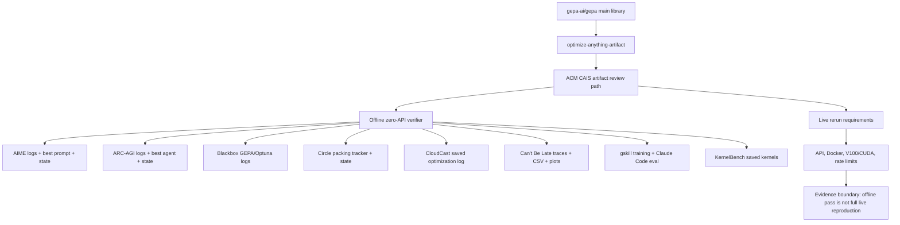

# gepa-ai/optimize-anything-artifact Dual-Chain Deep Dive

> Date: 2026-06-02. Layer: `processed/analysis`. Source queue: `analysis/value-evidence-repair-queue.json`. Source access: live GitHub metadata, GitHub tree/raw contents API, releases, issues, PRs, raw capture, and artifact verifier docs. Local clone boundary: full `git clone` timed out on GitHub 443 and shallow clone failed with HTTP2 framing; this pass therefore treats code inspection as GitHub API source review, not a completed local source mirror.

## One Sentence

`gepa-ai/optimize-anything-artifact` is a high-value 2026 reproducibility anchor for GEPA's optimize_anything claims: it has very low community signal, but unusually strong offline evidence density through domain-level runnable entrypoints, saved `GEPAState` checkpoints, verifier checks, logs, plots, and explicit re-execution boundaries.

## Three Sentences

[KNOWN] Live GitHub metadata on 2026-06-02 shows `gepa-ai/optimize-anything-artifact` was created `2026-05-19T04:58:54Z`, last pushed `2026-05-22T04:18:55Z`, last updated `2026-05-22T04:18:59Z`, has MIT license, latest release `v1.4` published `2026-05-19T05:25:35Z`, 1 star, 0 forks, 0 issues, and 0 PRs. Sources: `gh repo view gepa-ai/optimize-anything-artifact`; `gh issue list`; `gh pr list`; `gh api repos/gepa-ai/optimize-anything-artifact/releases`.

[KNOWN] The raw capture already states that this repository is the ACM CAIS 2026 reproducibility artifact for GEPA and that every evaluation domain under `acm_cais_artifact_evaluation/domains/` has a runnable `main.py`, per-domain README, and saved `GEPAState` checkpoint where applicable. Source: `raw-github/gepa-ai_optimize-anything-artifact.md`.

[INFERRED] The project should not be judged by stars as if it were the main library; its value is as a paired evidence object for `gepa-ai/gepa`, turning paper/blog claims into auditable offline artifacts and clearly documented live-rerun costs.

## Five Sentences

[KNOWN] The artifact's top-level review path supports offline review without API credits and live reruns for selected domains, with `REEXECUTION_REQUIREMENTS.md` documenting provider keys, cost ranges, rate-limit assumptions, Docker, and V100/CUDA needs. Source: GitHub raw contents for `acm_cais_artifact_evaluation/README.md` and `REEXECUTION_REQUIREMENTS.md`.

[KNOWN] GitHub tree inspection found 1,460 files under `acm_cais_artifact_evaluation/`, 17 README files, 8 `main.py` entrypoints, many saved logs, and saved `gepa_state.bin` checkpoints for AIME, ARC-AGI, blackbox, circle packing, gskill, and KernelBench. Source: `gh api 'repos/gepa-ai/optimize-anything-artifact/git/trees/main?recursive=1'`.

[KNOWN] The no-API verifier checks nine offline evidence groups and its saved `verification_v1.4.log` reports `Summary: 9/9 checks passed`, covering AIME, ARC-AGI, Circle Packing, CloudCast, Can't Be Late, gskill training, gskill Claude Code eval, Blackbox, and KernelBench saved results. Sources: `verify_offline_artifacts.py`; `offline_verification_logs/verification_v1.4.log`.

[KNOWN] The artifact's own offline evidence notes mark AIME, ARC-AGI, Blackbox, Circle Packing, CloudCast, and gskill as strongest offline-supported domains, while Can't Be Late, CloudCast checkpoint completeness, gskill full rerun, and KernelBench GPU reproduction remain bounded or partially live-rerun dependent. Source: `acm_cais_artifact_evaluation/OFFLINE_ARTIFACTS.md`.

[INFERRED] This repo fills the "evidence/reproducibility" gap rather than the "optimizer implementation" gap: it should be clustered with benchmark artifacts, verifier-backed claims, and paired-library evidence chains, not with standalone self-evolving agent runtimes.

## Evidence Chain

| Link | Status | Evidence |
|---|---|---|
| Raw capture | [KNOWN] | `raw-github/gepa-ai_optimize-anything-artifact.md`; `content_timestamp: unknown`, `collected_at: 2026-05-20T17:44:59Z`, source GitHub. |
| Live metadata | [KNOWN] | Created `2026-05-19T04:58:54Z`; pushed `2026-05-22T04:18:55Z`; latest release `v1.4`; MIT; 1 star; 0 forks; primary language HTML; 71,857 KB disk usage. |
| Releases | [KNOWN] | `v1.0` through `v1.4` were published on `2026-05-19`; v1.1 added offline review artifacts; v1.3 added no-API verifier and saved output; v1.4 aligned final license/verifier transcript. |
| Issues / PRs | [KNOWN] | `gh issue list` and `gh pr list` returned empty arrays on 2026-06-02. |
| Source tree | [KNOWN] | GitHub tree API returned 1,460 artifact files, including domain READMEs, entrypoint scripts, saved logs, state checkpoints, docs, examples, tests, and full `src/gepa` library. |
| Verifier | [KNOWN] | `verify_offline_artifacts.py` uses only Python standard library and checks concrete log lines, JSON values, file existence, file sizes, result counts, and performance summaries. |
| Saved verifier output | [KNOWN] | `verification_v1.4.log` reports 9/9 PASS. |
| Local clone | [UNVERIFIED] | Full clone timed out and shallow clone failed; this pass did not obtain a durable local source mirror. |

## Mirror Chain

```json
{
  "node": "project.gepa-ai.optimize-anything-artifact",
  "feature": "value-evidence-repair.deep-read",
  "intent": "Decide whether a low-star artifact repo is disposable or a high-value evidence anchor for GEPA and text-artifact evolution.",
  "rank_decision": "promote-to-reproducibility-anchor",
  "rank_confidence": "medium-high",
  "why_now": "The repo is fresh May 2026 work and directly resolves the reproduction-confidence gap left by the main GEPA library deep dive.",
  "main_tension": "Very strong offline artifact evidence vs very weak community and issue signal.",
  "value_gap": ["verify", "retain", "reproduce", "benchmark-boundary"],
  "missing_gates": ["local-source-mirror", "full-live-rerun", "independent-third-party-reproduction", "community-continuity"],
  "paired_project": "gepa-ai/gepa",
  "next_action": "Retry durable clone/tarball under stable network, run the no-API verifier locally if the artifact can be mirrored, then compare verified domains against the main GEPA claims."
}
```

## Artifact Map



## Domain Evidence Matrix

| Domain | Paper section | Offline evidence | Verifier status | Boundary |
|---|---|---|---|---|
| AIME prompt optimization | §5.4 | `run.log`, `best_prompt.txt`, plot, generated outputs, `gepa_state.bin`; logged 46.67% to 60.00%. | PASS | Fresh evaluation is nondeterministic because solver calls use temperature 1.0. |
| ARC-AGI architecture | §5.3 | `run.log`, `test_run.log`, `best_agent.py`, candidate/result JSON, plots, `gepa_state.bin`; logged 32.5% to 89.5%. | PASS | Full rerun is expensive and provider-dependent. |
| Circle packing | §5.6 | `state_tracker_logs.json`, solver snapshots, `gepa_state.bin`; best score checked at `2.635983362593`. | PASS | Strong offline trajectory, but fresh optimization still needs model calls. |
| CloudCast | §5.2 | Saved late-stage optimization log; score improved and raw cost decreased from 209.172 to 128.804. | PASS | No full `gepa_state.bin` bundle in this subfolder. |
| Can't Be Late | §5.2 | Real traces archive, summary CSV, trajectory plot; mean cost ordering checked. | PASS | No comparably rich GEPA checkpoint/log bundle. |
| gskill training | §5.1 | Saved training summaries for Bleve and Jinja plus `gepa_state.bin`; 0.19->0.85 and 0.38->0.59. | PASS | Full rerun needs Docker and model access. |
| gskill Claude Code eval | §5.1 | Eight saved Claude Code eval summaries and JSONL results. | PASS | Post-hoc eval evidence, not a fresh independent run here. |
| Blackbox math | Appendix B | Ten hardest problems with GEPA and Optuna seed logs, JSON, JSONL budget checks. | PASS | Long-running if reproduced live. |
| KernelBench | §5.5 | 31 saved kernels; 26/31 speedup >= 1.0; max speedup 30.35. | PASS | Performance reproduction depends on V100-class GPU and CUDA environment. |

## Code and Verification Findings

| Gate | Decision | Evidence | Interpretation |
|---|---|---|---|
| Currentness | Strong pass | Created and released 2026-05-19; pushed 2026-05-22. | Fresh enough to outrank stale 2025/unknown rows despite tiny stars. |
| Continuity | Medium | Release series v1.0-v1.4 converged within the artifact-review window; follow-up commit on 2026-05-22 documented rerun requirements and offline coverage. | Continuity is artifact-hardening rather than long community evolution. |
| Implementation evidence | Strong pass | Tree includes full GEPA library, tests, docs, examples, and `acm_cais_artifact_evaluation` domain code. | Not a README-only repo. |
| Verifier/evidence | Very strong pass | No-API verifier checks nine evidence groups and saved log reports 9/9 PASS. | Strongest value facet for this repo. |
| Issue/resource signal | Mixed | Issues and PRs are empty; releases and docs are explicit. | Low community interaction, but high reviewer-facing resource clarity. |
| Reproduction | Medium-high offline; low live | Offline artifact evidence is inspectable; live reruns require API/Docker/GPU/cost. | Good evidence anchor, not a fully independently rerun benchmark in this pass. |
| Clone/source mirror | Fail in this pass | Full clone timed out; shallow clone failed with HTTP2 framing. | Needs future retry before declaring local-code mirror complete. |

## Comparison Decision

| Comparator | Difference |
|---|---|
| `gepa-ai/gepa` | Main library implements the optimizer; this artifact verifies claims and exposes runnable evidence domains. They should be paired, not ranked as substitutes. |
| Generic benchmark repos | This artifact is stronger because it carries verifier code, saved logs, checkpoints, and explicit live-rerun cost boundaries. |
| Low-star GitHub repos | The star count is misleading: low adoption signal does not imply low value because the repo is a paper artifact and paired with a higher-adoption library. |
| Value-LSH role | It should sit in a bucket for `reproducibility-artifact`, `offline-verifier`, `benchmark-evidence`, `paired-library-evidence`, and `current-2026-frontier-support`. |

## Value Screening Decision

| Dimension | Decision | Rationale |
|---|---|---|
| Time weight | Very high | Created/released in May 2026 and pushed after release. |
| Continuity | Medium | Multiple artifact releases and later documentation update; no issue/PR activity. |
| Self-evolution fit | Medium as direct system, high as evidence support | It is not the optimizer itself, but validates GEPA's self-evolution-adjacent text-artifact optimization loop. |
| Implementation evidence | High | GitHub tree includes code, docs, tests, examples, domain scripts, logs, checkpoints. |
| Verifier signal | Very high | Standard-library verifier checks concrete saved evidence and reports 9/9 PASS. |
| Issue/resource signal | Low issues, high resources | Empty issues/PRs; strong README/OFFLINE/REEXECUTION/release documentation. |
| Transfer value | High | Useful for survey claims, benchmark-evidence discussion, and separating hype from reproducible claims. |
| Adoption signal | Low | 1 star, 0 forks, no community issue/PR surface. |
| Reproduction confidence | Medium-high offline | Static and saved verifier evidence are strong; no local full verifier run or live rerun was performed. |

## Queue Update Recommendation

`gepa-ai/optimize-anything-artifact` should move out of generic `deep-read-needed` into `paired-reproducibility-anchor / local-mirror-needed`. Its remaining tasks are concrete: retry durable source mirror, run `uv run python acm_cais_artifact_evaluation/verify_offline_artifacts.py` locally if the artifact can be mirrored, and compare the verified offline claims against the main `gepa-ai/gepa` deep dive.

## Trust Chain

- [KNOWN] Raw source, live GitHub metadata, releases, language API, issues, PRs, GitHub tree, artifact README, offline artifacts guide, re-execution requirements, verifier source, and saved verifier output were inspected on 2026-06-02.
- [KNOWN] GitHub issues and PRs returned empty arrays on 2026-06-02.
- [KNOWN] The repo's latest release was `v1.4` on 2026-05-19, and latest push was 2026-05-22.
- [INFERRED] The artifact should be promoted because it repairs the reproduction-confidence gap for `gepa-ai/gepa`, not because it has community adoption.
- [UNVERIFIED] Local clone, local no-API verifier execution, full live reruns, and third-party reproduction were not completed in this pass.
