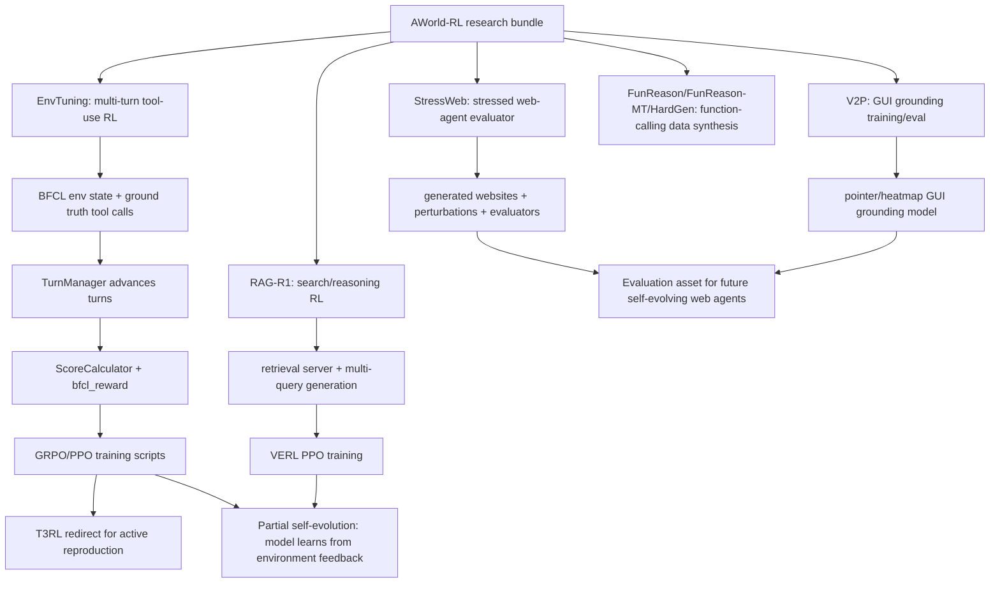

# inclusionAI/AWorld-RL Dual-Chain Deep Dive

> Date: 2026-06-02. Layer: `processed/analysis`. Source queue id: `github:inclusionai/agenticlearning`. Canonical GitHub repository: `inclusionAI/AWorld-RL`. Local clone status: two clone attempts failed because GitHub connections reset or could not reach port 443, so this pass uses local raw capture plus GitHub API metadata, tree, issue/PR, commit, and key-file content evidence.

## One Sentence

`inclusionai/agenticlearning` should be repaired to canonical `inclusionAI/AWorld-RL` and ranked as a current agentic-RL training/evaluation bundle, not a full self-evolving runtime: it has strong 2026 evidence for environment-feedback training, tool-use data synthesis, search/reasoning RL, GUI grounding, and StressWeb evaluation, but the self-evolution loop is mostly offline model/dataset/environment tuning rather than an agent that persistently modifies itself during deployment.

## Three Sentences

[KNOWN] Live GitHub metadata on 2026-06-02 shows the raw queue URL now resolves to `inclusionAI/AWorld-RL`, created `2025-07-01T07:52:11Z`, pushed `2026-04-16T03:28:08Z`, updated `2026-05-19T09:35:41Z`, with 106 stars, 10 forks, MIT license, Python primary language, no releases/tags, and about 136 MB of repository disk usage.

[KNOWN] The repository is a multi-project research bundle: `EnvTuning`, `RAG-R1`, `StressWeb`, `V2P`, `FunReason`, and `FunReason-MT`; GitHub tree evidence shows Python training/evaluation code, BFCL data, PPO/VERL scripts, retrieval agents, web-stress evaluators, GUI grounding trainers, and a `.gitmodules` entry for `EnvTuning/verl`.

[INFERRED] It belongs in the value graph as `frontier-agentic-rl-training-bundle / environment-feedback-tool-use-evaluation`, with high time and issue-resource value, medium implementation confidence due to failed clone and redirection to T3RL, and partial self-evolution fit because the change object is mainly model weights, data, reward/environment design, and benchmark assets rather than persistent online agent state.

## Five Sentences

[KNOWN] The local raw capture is stale/misaligned for time and identity: frontmatter says `repo: inclusionai/agenticlearning`, `content_timestamp: 2024-11-20`, and `time_slice: 2024-Q4`, while the raw body and live GitHub metadata show the canonical repo is `inclusionAI/AWorld-RL`, created in 2025 and updated through 2026. Source: `raw-github/inclusionai_agenticlearning.md`; GitHub API.

[KNOWN] The root README positions AWorld-RL as a collection of agentic reinforcement learning algorithms and lists 2025-2026 projects: FunReason/FunReason-MT/HardGen for tool-use data synthesis, Environment Tuning for multi-turn tool-use training through environmental interaction, RAG-R1 for search/reasoning RL with multi-query parallelism, V2P for GUI grounding, and StressWeb for web-interaction stress evaluation.

[KNOWN] `EnvTuning/README.md` explicitly redirects new users to `IcyFish332/T3RL`, calling AWorld-RL's EnvTuning code the original research code and T3RL the actively maintained reimplementation with open data preprocessing, standalone async evaluation, and checkpoints.

[KNOWN] Issue evidence is unusually useful: open/closed issues discuss testing scripts, data processing, released-data reproducibility, RL config, reward/turn definitions, BFCL tool exposure risk, `bfcl_eval` dependency errors, and GPU memory fixes.

[INFERRED] The right treatment is to repair metadata, keep it as a high-value evidence/source bundle for agentic RL and evaluation, and avoid calling it a turnkey self-evolving system until a downstream project such as T3RL or a specific module demonstrates the full six-gate self-evolution loop with persistent retention and audit.

## Evidence Chain

| Link | Status | Evidence |
|---|---|---|
| Raw capture | [KNOWN] | `raw-github/inclusionai_agenticlearning.md` exists, but frontmatter is stale: `content_timestamp: 2024-11-20`, `time_slice: 2024-Q4`; raw body already names `AWorld-RL` and includes 2025-2026 project news. |
| Queue row | [KNOWN] | `analysis/value-evidence-repair-queue.json` ranks `github:inclusionai/agenticlearning` first with `value_score: 71.02`, `repair_score: 135.02`, lane `deep-read-needed`, and gaps for report, frontier queue, issue/resource, self-evolution, implementation, and evidence chain. |
| Generated classification | [KNOWN] | `research/repo-classification.csv` classifies it as `工具/tool`, function `tool-module`, base theme `memory`, Markdown stack, `2024-Q4`; this should be revised because live metadata and API tree show a Python-heavy 2025-2026 research code bundle. |
| Live metadata | [KNOWN] | `inclusionAI/AWorld-RL`: created `2025-07-01`, pushed `2026-04-16`, updated `2026-05-19`, 106 stars, 10 forks, MIT, primary language Python, 2 open issues, no releases/tags. |
| Code tree | [KNOWN] | GitHub recursive tree includes `EnvTuning/env_tuning`, `EnvTuning/bfcl_env`, `RAG-R1/rag_r1`, `RAG-R1/verl`, `StressWeb/evaluator`, `StressWeb/website_simulatior`, `V2P/src/V2P`, `V2P/train.py`, and data/eval assets. |
| Clone attempts | [KNOWN] | `git clone --depth=1` failed with RPC/early EOF; `git clone --filter=blob:none --sparse` failed with GitHub 443 connection timeout. No local clone directory remained. |
| Submodule signal | [KNOWN] | `.gitmodules` declares `EnvTuning/verl` from `https://github.com/ZechuanWang/verl.git`, explaining some dependency/reproducibility complexity. |
| PR signal | [KNOWN] | Public PR list has three merged PRs: V2P code in Aug 2025 and EnvTuning changes in Oct 2025; no current open PRs. |
| Issue signal | [KNOWN] | Issues #13 and #16 are open; closed issues #2, #5-#17 include training scripts, data processing, benchmark leakage, reward/turn definitions, dependency errors, and memory/performance fixes. |
| Commit signal | [KNOWN] | Recent commits include README update on 2026-04-16, T3RL redirect docs on 2026-04-15, ACL2026 note on 2026-04-14, StressWeb benchmark on 2026-03-16, and EnvTuning fixes in Jan-Feb 2026. |

## Mirror Chain

```json
{
  "node": "project.inclusionai.aworld-rl",
  "source_queue_id": "github:inclusionai/agenticlearning",
  "feature": "value-evidence-repair.deep-read",
  "intent": "Decide whether the top repair target is a genuine self-evolving agent system, a current agentic-RL training bundle, or stale high-score noise.",
  "rank_decision": "promote-to-agentic-rl-training-and-eval-bundle; do-not-label-as-full-self-evolving-runtime",
  "rank_confidence": "medium",
  "why_now": "Raw metadata is stale and canonical identity changed; live repo and issues show 2026 activity and rich tool-use/RL/evaluation evidence.",
  "main_tension": "Strong environment-feedback and evaluation assets, but no verified local clone/run and the best-maintained EnvTuning path redirects to T3RL.",
  "value_gap": ["environment-feedback-training", "tool-use-data-synthesis", "multi-query-search-rl", "gui-grounding", "web-stress-evaluation", "issue-backed-reproducibility-friction"],
  "missing_gates": ["persistent-online-agent-retention", "self-modification-audit", "local-clone-verification", "end-to-end-reproduction", "canonical-metadata-repair"],
  "next_action": "Create separate follow-up for T3RL and compare EnvTuning against Continual Harness, GEPA, RAG-R1, and StressWeb as different value facets rather than one monolithic score."
}
```

## Architecture Map



## Code and Implementation Findings

| Gate | Decision | Evidence | Interpretation |
|---|---|---|---|
| Mutable artifact | Partial pass | EnvTuning and RAG-R1 train model behavior; V2P trains pointer/GUI grounding; StressWeb generates/evaluates web environments. | The mutable object is mostly model weights, data, reward signals, and evaluation environments, not persistent deployed agent state. |
| Feedback | Strong pass for training | `EnvTuning` describes environment interaction, actionable environment augmentation, and fine-grained progress rewards; code exposes `TurnManager`, `ScoreCalculator`, and `bfcl_reward.compute_score()`. | Strong evidence for environment-feedback learning. |
| Candidate generation | Medium | FunReason-MT/HardGen claims tool-query/data synthesis and iterative failure feedback; StressWeb contains website/query/evaluator generation agents in the API tree. | Candidate/data/environment generation exists, but not as an online self-modifying deployed agent loop. |
| Verification | Medium-high as evaluator bundle | BFCL data, official eval discussion, StressWeb evaluators, RAG-R1 evaluation scripts, V2P ScreenSpot/OSWorld eval scripts, W&B links, and issue discussions. | Good evaluation assets, but local run was not verified. |
| Retention | Low for self-evolution | No evidence of persistent memory/skill/subagent/artifact retention inside a deployed agent runtime; trained checkpoints and datasets live externally on Hugging Face/ModelScope. | Retention is research-output retention, not autonomous agent memory retention. |
| Audit / rollback | Low-medium | Issues expose data leakage concerns and reproduction questions; T3RL redirect improves reproducibility path. | Safety/audit is community-driven and paper/eval-driven rather than built into a self-evolution loop. |
| Implementation runnable | Medium | API tree and key-file content prove code exists; regular and sparse clone both failed; EnvTuning says original code is no longer the recommended path. | Score as code-evidence present but local-run unverified. |
| Currentness | High | Live repo created 2025, pushed Apr 2026, updated May 2026; issues and commits continue through 2026. | Raw timestamp should not cap it as a 2024-Q4 item. |

## Issue and Resource Signals

| Signal | Evidence | Interpretation |
|---|---|---|
| Active reproduction friction | Issue #16 asks for EnvTuning testing scripts; maintainer says original code is no longer actively maintained and points to T3RL with a complete evaluation pipeline and checkpoints. | T3RL should be a follow-up source; AWorld-RL remains valuable but not the best run target for EnvTuning. |
| Data openness boundary | Issues #9, #13, #15, #17 discuss whether data is complete, split, or paper-dependent; #17 raises benchmark tool exposure risk. | Strong evidence that data/reproducibility claims need caution. |
| Reward/turn clarity | Issues #11, #12, #14 discuss step/turn definitions, reward assignment, format rewards, and multi-turn/hallucination behavior. | These are high-quality signals for evaluating agentic RL training, not noise. |
| Dependency friction | Issue #10 reports `bfcl_eval` dependency errors; maintainer responded with fixes. | Reproducibility is non-trivial. |
| Performance/resource fix | Issue #5 reports repeated computation increasing GPU memory in V2P; collaborator says fix was applied. | Shows real users touched code paths beyond README reading. |
| PR continuity | Three merged PRs for V2P and EnvTuning, no open PRs. | Development is mostly maintainer-driven; public collaboration is issue-heavy rather than PR-heavy. |
| External resources | Root/raw README links arXiv papers, Hugging Face collections/datasets/checkpoints, W&B curves, ModelScope data, T3RL, AWorld framework, and StressWeb HF dataset. | Strong resource-router value. |

## Value Screening Decision

| Dimension | Decision | Rationale |
|---|---|---|
| Time weight | High | Canonical repo is 2025-created with 2026 pushes, issues, paper acceptances, and T3RL redirect; raw 2024-Q4 timestamp is stale. |
| Continuity | Medium-high | Multiple projects span Aug 2025-Apr 2026; however, EnvTuning itself is redirected to T3RL and no releases/tags exist. |
| Self-evolution fit | Partial | It has environment feedback, reward shaping, data synthesis, and training loops, but lacks persistent online self-modification gates. |
| Implementation evidence | Medium | API tree and key files verify real Python code; local clone and run were not verified due GitHub connection failures. |
| Issue/resource signal | High | Issues directly expose reproduction, data, reward, benchmark leakage, dependency, and performance questions. |
| Transfer value | High | Teaches how to evaluate agentic RL loops, tool-use datasets, environment tuning, and web-stress benchmarks. |
| Adoption signal | Medium | 106 stars and 10 forks are modest, but the repo is specialized and linked to multiple accepted/active papers. |
| Ranking change | Promote as a source/method bundle, not as a full self-evolving runtime | It should move out of generic `deep-read-needed`, but downstream queue should add T3RL and possibly split modules by value facet. |

## Comparison Decision

| Comparator | Difference |
|---|---|
| `sethkarten/continual-harness` | Continual Harness mutates prompt/subagents/skills/memory during episodes; AWorld-RL mostly trains or evaluates model behavior offline. |
| `gepa-ai/gepa` | GEPA optimizes prompt/program artifacts with validation; AWorld-RL provides RL/data/eval pipelines and benchmark environments. |
| `langchain-ai/open-swe` | Open SWE is a production coding-agent control plane; AWorld-RL is a research bundle for training/evaluating agentic abilities. |
| `EvoAgentX/Awesome-Self-Evolving-Agents` | EvoAgentX list is a taxonomy/source-router; AWorld-RL is an implementation/resource bundle with multiple runnable-ish modules. |
| `T3RL` | T3RL is the preferred active reproduction path for EnvTuning; it should be ingested separately rather than hidden under AWorld-RL. |

## Queue Update Recommendation

Move `github:inclusionai/agenticlearning` out of the generic `deep-read-needed` lane by attaching this analysis report, but keep these follow-up tasks:

1. Metadata repair: canonical repo should be `inclusionAI/AWorld-RL`, not only `inclusionai/agenticlearning`; current timestamp should reflect 2025-2026 activity.
2. Clone/run retry: retry with stable network or use an archive download to inspect local code; current clone attempts failed.
3. Split follow-up: create candidate rows for `IcyFish332/T3RL`, `RAG-R1`, `StressWeb`, and `V2P` when the pipeline supports module-level records.
4. Self-evolution gate: do not mark full six-gate self-evolution until persistent retention/audit and online artifact modification are verified.
5. Resource audit: verify Hugging Face, W&B, and ModelScope assets before quoting reproducibility claims as independently confirmed.

## Trust Chain

- [KNOWN] Local raw source, generated classification, repair queue, live GitHub metadata, root contents, recursive tree, issue list, PR list, commit list, `.gitmodules`, EnvTuning README/code, RAG-R1 README/code/script, StressWeb README/code, and V2P README/code were inspected on 2026-06-02.
- [KNOWN] Clone attempts were made and failed: regular clone failed with RPC early EOF, blobless sparse clone failed with GitHub 443 connection timeout; no local clone directory remained.
- [KNOWN] Code structure claims are from GitHub API tree/content, not a local filesystem mirror.
- [INFERRED] The value label is based on evidence triangulation across raw README, API tree, issues, code excerpts, and maintainer responses.
- [UNVERIFIED] Local execution, dependency installation, paper score reproduction, Hugging Face/ModelScope artifact integrity, W&B curves, T3RL code quality, and exact dataset completeness were not verified in this pass.
