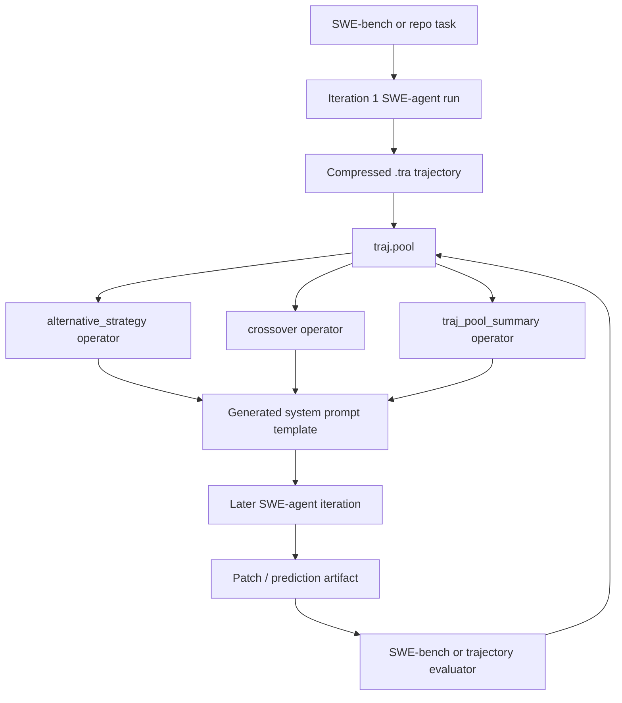

# JARVIS-Xs/SE-Agent Dual-Chain Deep Dive

> Date: 2026-06-01. Layer: `processed/analysis`. Frontier source: `analysis/frontier-value-queue.json`.

## One Sentence

SE-Agent is a high-value trajectory-evolution baseline for code agents, but its current-value lane should be below fresher 2026 systems because the repo has weak release/reproduction continuity signals after September 2025.

## Three Sentences

[KNOWN] The frontier queue ranks `JARVIS-Xs/SE-Agent` fourth overall and second among code-ready local clones, with frontier score `60.50`, raw time slice `2026-05`, local mirror `repos/jarvis_xs__se_agent`, and a caveat that remote issue scanning was missing. Source: `analysis/frontier-value-queue.json`.

[KNOWN] The local clone implements a trajectory-level self-evolution loop: multi-iteration SWE-agent runs create trajectories, operators process prior trajectories before later iterations, and `alternative_strategy`, `crossover`, and `traj_pool_summary` generate new strategy/system-prompt guidance from failed or multiple previous attempts. Sources: `repos/jarvis_xs__se_agent/SE/se_run.py`, `repos/jarvis_xs__se_agent/SE/operators/base.py`, `repos/jarvis_xs__se_agent/SE/operators/alternative_strategy.py`, `repos/jarvis_xs__se_agent/SE/operators/crossover.py`, `repos/jarvis_xs__se_agent/SE/operators/traj_pool_summary.py`.

[INFERRED] Its corpus role is a mechanism baseline rather than a top frontier project: it directly teaches Revision/Recombination/Refinement for code-agent trajectories, but current GitHub metadata shows no latest release, no open PRs, and open issues questioning 80% reproduction and partial release status.

## Five Sentences

[KNOWN] SE-Agent describes itself as a self-evolution framework for LLM code agents that exchanges information across reasoning paths through Revision, Recombination, and Refinement. Sources: `raw-github/jarvis-xs_se-agent.md`, `repos/jarvis_xs__se_agent/README.md`.

[KNOWN] The repository was captured on `2026-05-20T17:45:19Z`, reports `created_at=2025-07-11T11:57:16Z`, `pushedAt=2025-09-23T01:32:14Z`, and local clone head `c188ce1` from `2025-09-22T22:31:31+08:00`. Sources: `raw-github/jarvis-xs_se-agent.md`, `analysis/frontier-value-queue.json`, local `git -C repos/jarvis_xs__se_agent log -1`, `gh repo view JARVIS-Xs/SE-Agent`.

[KNOWN] Current repository metadata from GitHub CLI shows `273` stars, `29` forks, no `latestRelease`, and current open issues `#15`, `#12`, and `#3`; `gh pr list` returned no open PRs. Source: `gh repo view JARVIS-Xs/SE-Agent`, `gh issue list -R JARVIS-Xs/SE-Agent --limit 20`, `gh pr list -R JARVIS-Xs/SE-Agent --limit 20`.

[INFERRED] SE-Agent fills the "trajectory search and cross-path knowledge transfer" gap that AgentEvolver does not center: instead of policy training, it mutates the agent's future run context by generating prompt/config guidance from previous trajectories.

[INFERRED] The key research value is to preserve it as a teachable code-agent evolution archetype, while marking reproduction, release completeness, and current maintenance continuity as weak evidence.

## Evidence Chain

| Link | Status | Evidence |
|---|---|---|
| Raw capture | [KNOWN] | `raw-github/jarvis-xs_se-agent.md`; captured `2026-05-20T17:45:19Z`; raw time slice `2026-05`. |
| Metadata | [KNOWN] | `projects/jarvis_xs__se_agent.md`; `stars=274`, `forks=29`, `last_pushed=2025-09-23T01:32:14Z`, license `MIT`, language `Python`. |
| Current GitHub metadata | [KNOWN] | `gh repo view` reports `273` stars, `29` forks, no latest release, created `2025-07-11`, pushed `2025-09-23`. |
| Local mirror | [KNOWN] | `repos/jarvis_xs__se_agent`; head `c188ce1`; branch `main`; `SE`, `sweagent`, `tools`, `trajectories`, tests, configs, and static result images present. |
| Prior report | [KNOWN] | `projects/jarvis_xs__se_agent.md`; `site/public/reports/projects/jarvis_xs__se_agent.md`; `projects/agent-architecture-search/09-se-agent.md`. |
| Current GitHub continuity | [KNOWN] | `gh issue list` shows three open issues: reproduction of reported 80%, release status/partial release, and possible dynamic knowledge-base optimization; `gh pr list` returns no open PRs. |
| Code architecture | [KNOWN] | `SE/se_run.py`, `SE/core/swe_iterator.py`, `SE/operators/base.py`, `SE/operators/alternative_strategy.py`, `SE/operators/crossover.py`, `SE/operators/traj_pool_summary.py`, `SE/evaluation_function.py`. |
| Paper/ecosystem resource | [KNOWN] | README links arXiv `2508.02085`, SWE-bench, RepoMaster, GitTaskBench, and the QuantaAlpha team site. |

## Mirror Chain

```json
{
  "node": "project.jarvis.xs.se.agent",
  "feature": "frontier-project-deep-dive",
  "intent": "Decide whether SE-Agent fills a current self-evolution pipeline gap and how it compares with AgentEvolver.",
  "rank_decision": "promote-as-trajectory-evolution-baseline",
  "rank_confidence": "medium",
  "why_now": "The code is locally available and the raw capture is current, but the upstream push/release cadence is weaker than AgentEvolver.",
  "main_tension": "Strong trajectory-level mechanism vs weak current continuity and unresolved reproduction/release questions.",
  "value_gap": ["observe", "interpret", "modify", "verify", "retain"],
  "next_action": "Use the same gate table on OpenEvolve or SE-Agent's ecosystem siblings RepoMaster/GitTaskBench before promoting it as a current frontier anchor."
}
```

## Architecture Map



## Code Findings

| Gate | Decision | Evidence | Interpretation |
|---|---|---|---|
| Observe | Pass | SWE-agent runs and `.tra` files capture prior reasoning/action trajectories; `TrajPoolManager` stores iteration summaries. | The system observes its own prior runs, not just the original task. |
| Interpret | Pass | `TrajPoolManager.summarize_trajectory`, `TrajPoolSummaryOperator`, and `evaluation_function.py` summarize/filter/select trajectories. | It has explicit interpretation of failure modes, edited files, tools, assumptions, and trajectory quality. |
| Modify | Pass | `TemplateOperator` writes per-instance system prompt YAML into later iteration directories; operators generate alternative/crossover/risk-aware strategy content. | The mutable artifact is the next iteration's prompt/config guidance and trajectory pool, not model weights. |
| Verify | Partial pass | README claims SWE-bench Verified 80%; `evaluation_function.py` can filter/select trajectories and SWE-agent has SWE-bench evaluation hooks. | Verification path exists, but current issue `#15` directly questions reproducibility of the headline 80% result. |
| Retain | Pass | `traj.pool` persists cross-iteration summaries and operator inputs; `.tra` compressed trajectories preserve history. | This is a clean retention design for agent-run memory across iterations. |
| Rollback/audit | Partial pass | `se_run.py` supports resume and clean restart; trajectory directories and logs are timestamped. | Good experiment-level recovery, but not a full benchmark reproduction/audit package. |

## Current Issue And Resource Signals

[KNOWN] `gh issue list` shows issue `#15` titled "Unable to Reproduce the Reported 80.0% Performance - Any Updates?" opened `2025-11-30`, making benchmark reproduction a live caveat. Source: `gh issue list -R JARVIS-Xs/SE-Agent --limit 20`.

[KNOWN] Issue `#12` asks to clarify release status and says the repository is a partial release so far; it was opened `2026-05-01`, which is a strong release-completeness caveat even though the repo itself has not been pushed since `2025-09-23`. Source: `gh issue list -R JARVIS-Xs/SE-Agent --limit 20`.

[KNOWN] Issue `#3` proposes a dynamic LLM knowledge-base/expert optimization direction, which is useful as a forward-looking continuity idea but not proof of implemented continuity. Source: `gh issue list -R JARVIS-Xs/SE-Agent --limit 20`.

[KNOWN] `gh pr list` returned no open PRs and `gh repo view` returned `latestRelease=null`. Source: `gh pr list -R JARVIS-Xs/SE-Agent --limit 20`, `gh repo view JARVIS-Xs/SE-Agent`.

## Value Screening Decision

| Dimension | Score | Rationale |
|---|---:|---|
| Time weight | Medium-low | Raw capture is 2026-05, but upstream pushed date is 2025-09 and no release exists. |
| Continuity | Medium | NeurIPS 2025 acceptance and ecosystem links matter, but current repo continuity is mostly issues, not commits/PRs/releases. |
| Self-evolution fit | High | It cleanly implements trajectory-pool retention plus operators that mutate later-run strategy prompts. |
| Implementation evidence | High | Local clone includes code, tests, configs, operators, SWE-agent base, trajectory utilities, and demo data. |
| Reproducibility | Medium-low | Quick demo exists, but headline benchmark reproduction and release status are open issues. |
| Transfer value | High | The operator/traj.pool pattern is reusable as a design lens for code-agent self-evolution. |

## Comparison Notes

SE-Agent and AgentEvolver should not be put in the same final lane. AgentEvolver is an environment-to-policy training stack with active operational issues; SE-Agent is a trajectory-to-prompt/config evolution stack with weaker current release continuity.

SE-Agent is closer to OpenEvolve and other search/trajectory systems than to policy-training systems. Its strongest contribution is making failed trajectories reusable as structured operator input, especially through alternative strategy, crossover, and risk-aware summary operators.

For the survey, SE-Agent should teach "trajectory-level evolution for code agents" and "why reproduction/release status must affect current-value ranking" at the same time.

## Risks To Preserve For Future Agents

- Do not treat the 80% SWE-bench Verified claim as independently reproduced; issue `#15` makes that a live caveat.
- Do not call it a full release without resolving issue `#12` or checking whether data/scripts/results needed for reproduction are present.
- Do not over-rank it merely because raw capture is 2026-05; pushed date, no releases, and no PRs make time-weighted rank weaker.
- Do not confuse trajectory evolution with policy self-training; the mutable object here is prompt/config/trajectory guidance.
- Do not ignore `.env.example`/API-key dependency when evaluating reproducibility.

## Next Research Actions

1. Compare SE-Agent against OpenEvolve to separate code-program evolution from trajectory-prompt evolution.
2. Inspect RepoMaster and GitTaskBench as ecosystem continuity evidence before deciding whether the team-level direction remains frontier-current.
3. Add a `reproduction_dispute` or `release_completeness` caveat field to the frontier queue after 3-5 deep dives.
4. Use SE-Agent's operator/traj.pool pattern as a template for annotating code-agent runs in the dual-chain knowledge base.
