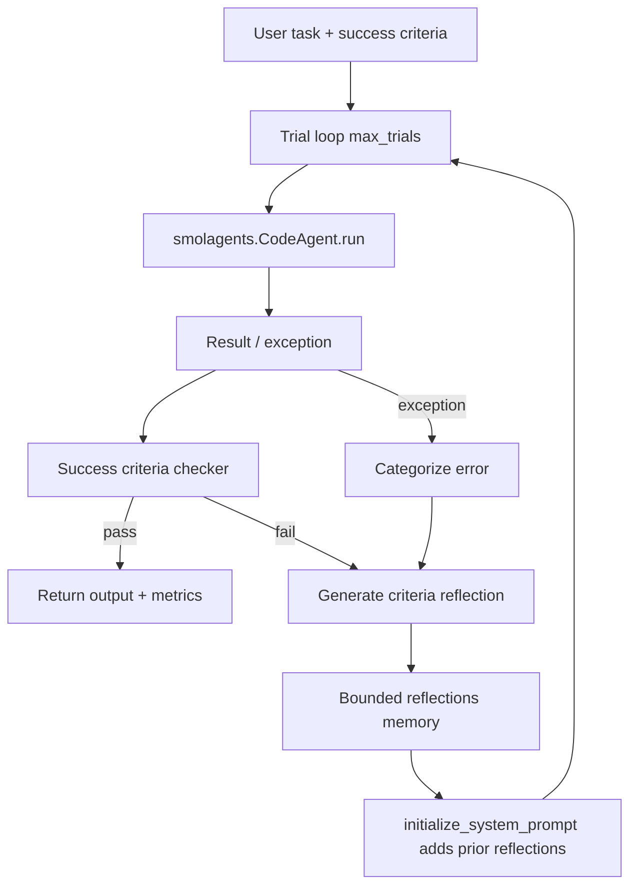

# kargarisaac/reflexion Dual-Chain Deep Dive

> Date: 2026-06-01. Layer: `processed/analysis`. Source queue: `analysis/value-evidence-repair-queue.json`.

## One Sentence

`kargarisaac/reflexion` is useful as a compact 2025 Reflexion teaching adapter over `smolagents.CodeAgent`, but it should be downgraded from current-frontier priority because the repo has no issues, no PRs, no release, no license, only 8 commits, and no code activity after 2025-03-16.

## Three Sentences

[KNOWN] The raw capture describes a Python implementation of Reflexion based on `smolagents`, with files `README.md`, `example.py`, `pyproject.toml`, and `reflexion.py`; GitHub API metadata shows the repo was created `2025-03-16T06:03:34Z`, pushed `2025-03-16T08:22:59Z`, and last updated `2026-05-28T12:09:12Z`. Sources: `raw-github/kargarisaac_reflexion.md`; `gh repo view kargarisaac/reflexion --json ...`.

[KNOWN] GitHub issue/PR scans returned empty arrays, and the repository has no tags, no release, no license, 8 stars, 0 forks, 1 watcher, primary language Python, and 8 commits. Sources: `gh issue list -R kargarisaac/reflexion --state all`; `gh pr list -R kargarisaac/reflexion --state all`; `gh api repos/kargarisaac/reflexion/commits`; `gh api repos/kargarisaac/reflexion/tags`.

[INFERRED] The project fills a narrow value gap: it packages Reflexion as a small `CodeAgent` subclass with trial retries, verbal reflections, success-criteria checks, and metrics, but it does not add a new frontier self-evolution architecture beyond the original Reflexion paper and canonical `noahshinn/reflexion` implementation.

## Five Sentences

[KNOWN] `reflexion.py` defines `ReflexionAgent(CodeAgent)` with `max_trials`, bounded `max_reflections`, a reflection prompt template, success criteria, trial metrics, retry loop, error categorization, and system-prompt injection of previous reflections. Source: `gh api repos/kargarisaac/reflexion/contents/reflexion.py -H 'Accept: application/vnd.github.raw'`.

[KNOWN] `example.py` demonstrates `LiteLLMModel` with Gemini, `DuckDuckGoSearchTool`, optional forced failure, and strict success criteria, so the runnable path is a demo harness rather than a benchmark suite. Source: `gh api repos/kargarisaac/reflexion/contents/example.py -H 'Accept: application/vnd.github.raw'`.

[KNOWN] `pyproject.toml` declares Python `^3.11` and `smolagents[litellm] ^1.11.0`; no tests, package metadata depth, license, release, or CI evidence was found in the inspected root file list. Sources: `gh api repos/kargarisaac/reflexion/contents/pyproject.toml`; `gh api repos/kargarisaac/reflexion/contents`.

[KNOWN] A direct `git clone https://github.com/kargarisaac/reflexion.git projects/repos/kargarisaac__reflexion` failed on 2026-06-01 with `Failed to connect to github.com port 443 after 75019 ms`, so this packet uses GitHub API source inspection instead of a local mirror. Source: command output in current run.

[INFERRED] For the corpus, this is not a "bad" item; it is a low-continuity, high-pedagogical baseline useful for comparing reflection-memory wrappers against richer 2026 systems that include external verifiers, issue activity, benchmarks, retention stores, rollback/audit, and maintained releases.

## Evidence Chain

| Link | Status | Evidence |
|---|---|---|
| Raw capture | [KNOWN] | `raw-github/kargarisaac_reflexion.md`; collected `2026-05-20T17:44:59Z`; `content_timestamp=unknown`. |
| GitHub metadata | [KNOWN] | Created `2025-03-16T06:03:34Z`; pushed `2025-03-16T08:22:59Z`; updated `2026-05-28T12:09:12Z`; 8 stars; 0 forks; 1 watcher; no license; primary language Python. |
| File tree | [KNOWN] | `.gitignore`, `README.md`, `example.py`, `images/`, `poetry.lock`, `pyproject.toml`, `reflexion.py`. |
| Source inspection | [KNOWN] | `reflexion.py` and `example.py` fetched through GitHub API raw content because clone failed. |
| Issues / PRs | [KNOWN] | `gh issue list` and `gh pr list` returned `[]`; no visible issue-resource signal. |
| Tags / release | [KNOWN] | `gh api repos/kargarisaac/reflexion/tags` returned `[]`; `latestRelease=null`. |
| Local mirror | [UNVERIFIED] | Clone failed due network connection timeout; no local `projects/repos/kargarisaac__reflexion` evidence is available. |
| Canonical baseline | [KNOWN] | `projects/noahshinn__reflexion.md`, `research/papers/05-reflexion.md`, `paper-reviews/03-2303-11366-review.md`. |

## Mirror Chain

```json
{
  "node": "project.kargarisaac.reflexion",
  "feature": "value-evidence-repair.deep-read",
  "intent": "Decide whether a high-scoring repair-queue Reflexion implementation is a current frontier project or a baseline teaching artifact.",
  "rank_decision": "demote-to-baseline-teaching-adapter",
  "rank_confidence": "medium",
  "why_now": "The value-LSH repair queue ranked it first because it had good topical fit but missing reports, issue scan, and loop verification.",
  "main_tension": "Compact runnable Reflexion wrapper vs no recent code continuity, no issue/resource ecosystem, no license, and no benchmark evidence.",
  "value_gap": ["feedback", "retain"],
  "missing_gates": ["continuity", "issue-resource", "external-verifier", "rollback", "benchmark"],
  "next_action": "Keep as a comparison anchor for reflection-memory wrappers; do not prioritize over 2026 projects with active maintenance and broader self-evolution loops."
}
```

## Architecture Map



## Code Findings

| Gate | Decision | Evidence | Interpretation |
|---|---|---|---|
| Observe | Partial pass | `run()` captures trial result or exception and optional success-criteria failure. | The observation layer is wrapper-level execution feedback, not environment trajectories or benchmark logs. |
| Interpret | Partial pass | `_categorize_error`, `_generate_reflection`, and `_generate_criteria_reflection` convert failures into textual lessons. | Interpretation exists, but depends on model-generated reflection quality. |
| Modify | Narrow pass | `initialize_system_prompt()` appends previous reflections to the next trial context. | The mutable artifact is prompt/context memory only, not code, tools, weights, or policy. |
| Verify | Weak | `_check_success_criteria()` asks the same model interface for yes/no criteria evaluation; example uses hand-written response constraints. | Useful demo verifier, but not an external benchmark or robust judge. |
| Retain | Partial pass | `self.reflections` keeps bounded memory across trials. | Retention is in-process and bounded; no persistent memory store. |
| Rollback/audit | Weak | Metrics track trial status and error type. | There is trial accounting, but no replay log, regression suite, or rollback protocol. |

## Comparison Decision

| Comparator | Difference |
|---|---|
| Original Reflexion paper | Original paper defines actor/evaluator/self-reflection loop and reports benchmark gains; this repo repackages the pattern for `smolagents`. |
| `noahshinn/reflexion` | Canonical repo has broader task suites, benchmark scripts, local mirror, MIT license, and established project report in this corpus. |
| AgentEvolver-style frontier systems | AgentEvolver modifies policy/training state with environment rollouts and experience management; this repo only mutates prompt context. |
| Value-LSH role | Good as a baseline anchor and teaching example; weak as current frontier due time/continuity and evidence gaps. |

## Value Screening Decision

| Dimension | Decision | Rationale |
|---|---|---|
| Time weight | Low current priority | Created and last pushed on 2025-03-16; GitHub updated in 2026 but no code continuity evidence. |
| Continuity | Low | No issues, PRs, releases, tags, license, forks, or active maintenance surface found. |
| Self-evolution fit | Medium-low | Captures reflection-memory retry loop, but only prompt-context mutation. |
| Implementation evidence | Medium | Source is inspectable through GitHub API; clone failed; project is small and demo-oriented. |
| Issue/resource signal | Low | Empty issue and PR lists. |
| Transfer value | Medium | Useful for teaching Reflexion wrapper mechanics and as a negative/low-continuity comparison anchor. |

## Queue Update Recommendation

`kargarisaac/reflexion` should move from `deep-read-needed` to `baseline-anchor / low-continuity` after this packet. It should remain in the knowledge base as a comparison object, but future deep-read effort should prioritize higher-continuity projects such as `gepa-ai/gepa`, `langchain-ai/open-swe`, or other queue items with stronger 2026 activity and richer issue/resource surfaces.

## Trust Chain

- [KNOWN] Raw capture and local corpus links are cited by file path.
- [KNOWN] Current GitHub metadata, issue/PR emptiness, root file tree, commits, tags, and source files were inspected through `gh` commands on 2026-06-01.
- [INFERRED] Architecture/gate decisions are based on static inspection of fetched source content and comparison with the canonical Reflexion corpus entries.
- [UNVERIFIED] Runtime behavior was not executed because the clone failed and the demo requires external model/search credentials.
