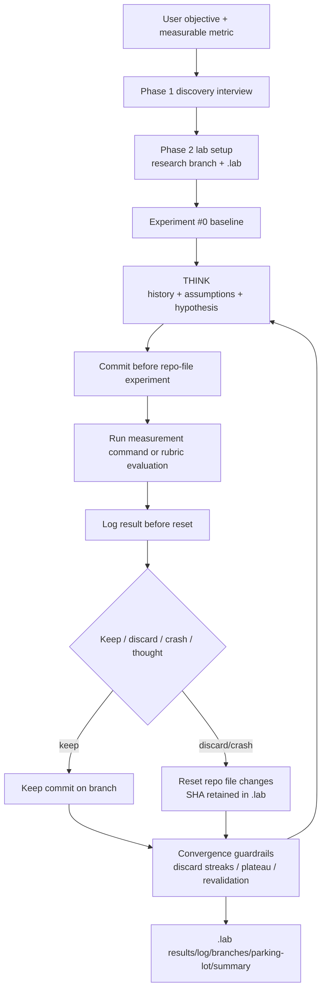

# krzysztofdudek/ResearcherSkill Dual-Chain Deep Dive

> Date: 2026-06-02. Layer: `processed/analysis`. Source queue: `analysis/value-evidence-repair-queue.json`. Local source mirror: `projects/repos/krzysztofdudek__researcherskill`, shallow clone from GitHub `main` at commit `3a70df8`.

## One Sentence

`krzysztofdudek/ResearcherSkill` is a high-value skill-mediated experimentation harness: it makes an AI coding agent run measured hypothesis loops with `.lab/` lineage, git checkpoints, keeps/discards, convergence guardrails, and metric revision, but it should be classified as a reusable self-improvement protocol rather than a standalone self-evolving runtime.

## Three Sentences

[KNOWN] Live GitHub metadata on 2026-06-02 shows `krzysztofdudek/ResearcherSkill` was created `2026-03-22T16:41:35Z`, pushed `2026-05-31T07:09:13Z`, updated `2026-06-02T03:40:51Z`, with 230 stars, 26 forks, 0 open issues, MIT license, 12 tags, latest release `v1.7.0`, and topics including `ai-agent`, `autoresearch`, `claude-code`, `codex`, `experimentation`, `optimization`, `prompt-engineering`, and `research-automation`.

[KNOWN] The local mirror contains a single canonical skill file at `skills/researcher/SKILL.md`, Claude Code plugin manifests, a README/GUIDE, changelog, and archived validation labs; the core loop interviews for a measurable objective, creates a `research/<slug>` branch and `.lab/` directory, records a baseline, then repeats THINK -> TEST -> REFLECT with commit-before-run and reset-on-discard discipline.

[INFERRED] It belongs in the value graph as `frontier-skill-mediated-experiment-harness / controlled-self-improvement-protocol`: strong mechanism and teaching value, active 2026 continuity, medium implementation evidence, and a trust boundary around destructive git operations, external measurement quality, and whether downstream agents actually obey its guardrails.

## Five Sentences

[KNOWN] The raw capture has `content_timestamp: 2026-05-03`, `time_slice: 2026-05`, `collected_at: 2026-05-20T17:44:59Z`, and described the project as "One file. Your AI coding agent becomes a scientist." Source: `raw-github/krzysztofdudek_researcherskill.md`.

[KNOWN] The repair queue ranked it first with `value_score: 75.8`, `repair_score: 134.8`, lane `deep-read-needed`, and gaps for missing deep report, missing frontier queue evidence, unclear issue/resource signal, unclear self-evolution fit, and incomplete evidence chain. Source: `analysis/value-evidence-repair-queue.json`.

[KNOWN] The mutable object is intentionally domain-general: the agent can change files in user-approved scope, prompts, configs, documents, scripts, or code, while `.lab/` retains experiment config, results, logs, branches, parking lot, summaries, and scratch workspace.

[KNOWN] The archived validation evidence is mixed but useful: Lab 1 reports qualitative self-improvement of the skill from `6.25` to `9.23`, while Lab 2 reports 22 of 33 discipline checkpoints passed and identifies guardrail enforcement, explicit THINK blocks, and commit-before-run compliance as failure modes.

[INFERRED] The strongest public claim is not that ResearcherSkill independently evolves an agent; it is that the repo packages the minimum operational skeleton for agent-driven controlled experimentation, including evidence retention and rollback, which makes it an important comparison anchor for self-evolution systems.

## Evidence Chain

| Link | Status | Evidence |
|---|---|---|
| Raw capture | [KNOWN] | `raw-github/krzysztofdudek_researcherskill.md`; captured `2026-05-20`, content timestamp `2026-05-03`, raw stars `223`, raw forks `25`. |
| Queue row | [KNOWN] | `analysis/value-evidence-repair-queue.json` ranks `github:krzysztofdudek/researcherskill` first with lane `deep-read-needed`, `value_score: 75.8`, `repair_score: 134.8`, and `star_growth_rank: 282`. |
| Star-growth row | [KNOWN] | `analysis/github-star-growth-ranking.json` currently has `coverage_status: not_fetched`, `current_total_stars: 223`, and `fetch_priority_rank: 282`, so live star timing is not coverage-qualified yet. |
| Live metadata | [KNOWN] | GitHub API on 2026-06-02: created `2026-03-22`, pushed `2026-05-31`, updated `2026-06-02`, 230 stars, 26 forks, 0 open issues, MIT, default branch `main`, discussions enabled. |
| Release/continuity | [KNOWN] | Releases/tags include `v1.0.0` through `v1.7.0`; latest release `v1.7.0` published `2026-05-26`, adding `.lab/archives/<slug>/` archival behavior. |
| Issues/PRs | [KNOWN] | No standalone issues were found; two closed pull requests exist, including merged PR #2 adding token hygiene and closed PR #1 for an invalid git hash fix. |
| Local mirror | [KNOWN] | `projects/repos/krzysztofdudek__researcherskill` exists, is a shallow clone, and local HEAD is `3a70df8` from `2026-05-31`. |
| Static source scan | [KNOWN] | Inspected `README.md`, `GUIDE.md`, `CHANGELOG.md`, `skills/researcher/SKILL.md`, `.claude-plugin/*`, and archived lab reports/results. |
| Validation artifacts | [KNOWN] | `archive/lab1-skill-discipline-validation/results.tsv` records self-improvement from `6.25` to `9.23`; `archive/lab2-skill-discipline-validation/report.md` reports 22/33 checkpoints passed. |

## Mirror Chain

```json
{
  "node": "project.krzysztofdudek.researcherskill",
  "feature": "value-evidence-repair.deep-read",
  "intent": "Decide whether a one-file agent skill meaningfully advances controlled self-improvement, or only repackages prompt instructions as a workflow.",
  "rank_decision": "promote-to-frontier-skill-mediated-experiment-harness; cap-as-non-standalone-runtime",
  "rank_confidence": "medium-high",
  "why_now": "The project is 2026-created, active through late May, and directly matches the user's LSH facets around measured comparison, retained experiment memory, and agent self-observation.",
  "main_tension": "It has excellent protocol design for experimentation, but all real improvement depends on external agents, user-provided metrics, and potentially destructive git actions in the target repo.",
  "value_gap": ["experiment-lineage", "metric-driven-agent-loop", "discard-retain-discipline", "branching-search", "qualitative-rubric-protocol", "session-resume-memory"],
  "missing_gates": ["coverage-qualified-star-history", "independent-reproduction-on-real-repos", "guardrail-compliance-under-stress", "sandboxed-reset-policy", "non-destructive-mode-for-protected-repos"],
  "next_action": "Remove from generic deep-read backlog, keep star-history fetch in backlog, and compare with autoresearch, GEPA, Meta-Harness Evolver, Continual Harness, and agent-skill libraries."
}
```

## Architecture Map



## Code and Implementation Findings

| Gate | Decision | Evidence | Interpretation |
|---|---|---|---|
| Mutable artifact | Strong | Phase 1 asks for scope; repo-file experiments can modify code, configs, prompts, documents, or other measurable artifacts. | The skill generalizes beyond ML and makes the change object explicit through scope and branch state. |
| Feedback signal | Strong if metric is real | Primary metric can be command output or qualitative rubric; qualitative mode requires three independent evaluator subagents and median aggregation. | It forces measurement into the loop, but quality depends on the user's metric/rubric and evaluator discipline. |
| Candidate generation | Medium | The main agent invents hypotheses, can fork branches, invert assumptions, run thought experiments, and use subagents for evaluation/analysis. | Search is structured but not algorithmically automated; the skill is a governance protocol around an agent, not an optimizer binary. |
| Verification | Medium | Every real experiment must run measure commands and log raw values; every 10th experiment requires re-validation. | Strong verification language exists, yet Lab 2 shows agents sometimes skip guardrail discipline. |
| Retention | Strong | `.lab/config.md`, `results.tsv`, `log.md`, `branches.md`, `parking-lot.md`, `workspace/`, and later `summary.md` retain experiment history independent of git resets. | This is the project's best self-evolution contribution: failure history is preserved even when code is reverted. |
| Selection | Strong conceptually | Keep/discard/keep*/interesting/crash status rules map metric deltas to retained code state. | Selection is explicit, but depends on clean metric extraction and honest logging. |
| Rollback | Strong but risky | Failed repo-file experiments use `git reset --hard HEAD~1` after logging. | This is useful inside an experiment branch, but unsafe for repositories with protected dirty worktrees or stricter no-reset policies. |
| Continuity | Medium-high | Seven releases after v1.0.0, latest `v1.7.0` on 2026-05-26, and pushes through 2026-05-31. | The project is active enough for 2026 frontier attention. |
| Issue/resource signal | Medium-low | Discussions enabled, 0 open issues, two closed PRs, one merged external PR for token hygiene. | Community demand is visible mostly through stars/forks and one merged PR, not a large issue ecosystem. |
| Evidence quality | Medium | Lab 1 and Lab 2 provide internal validation artifacts; no independent benchmark or coverage-qualified star history yet. | Good teaching evidence, not enough to claim broad empirical success. |

## Value Screening Decision

| Dimension | Decision | Rationale |
|---|---|---|
| Time weight | High | Created March 2026, pushed May 2026, updated June 2026. |
| Continuity | Medium-high | Versioned releases and recent commits show maintenance; issue ecosystem is small. |
| Self-evolution fit | Medium-high | The protocol supports measured self-improvement loops and was reportedly improved using itself, but it is not autonomous without a host agent and user metric. |
| Implementation evidence | Medium | Local clone and canonical skill file exist; no executable test suite for this repo was run because the artifact is a skill/protocol. |
| Issue/resource signal | Medium-low | Two PRs, no standalone issues, discussions enabled, no visible issue clusters. |
| Benchmark confidence | Medium | Archived validation labs are concrete, but Lab 2 exposes compliance failures and synthetic-test limits. |
| Transfer value | High | Directly useful for our LSH taxonomy because it turns "compare, measure, retain, reset" into a reusable agent workflow. |
| Adoption signal | Medium but not coverage-qualified | Live stars/forks are respectable for a new skill, but star-history fetch remains `not_fetched`. |
| Ranking change | Promote as controlled-experiment protocol, cap as runtime | It should leave generic deep-read backlog while retaining star-history and independent reproduction gaps. |

## Comparison Decision

| Comparator | Difference |
|---|---|
| `karpathy/autoresearch` | ResearcherSkill generalizes autoresearch from ML training loops to any measurable code/config/prompt/document task. |
| `gepa-ai/gepa` | GEPA is a formal prompt/program optimizer with artifact validation; ResearcherSkill is a human-confirmed agent workflow for arbitrary experiment series. |
| `tylerdotai/meta-harness-evolver` | Meta-Harness Evolver mutates an OpenClaw/Hoss harness; ResearcherSkill governs experimental search over a target repo or artifact. |
| `sethkarten/continual-harness` | Continual Harness is a runnable game-agent harness-evolution benchmark; ResearcherSkill is a portable skill that makes an existing agent run experiments. |
| `Olshansk/agent-skills` | Agent-skills style repositories package reusable capabilities; ResearcherSkill is one such capability with a stronger measured-retention loop. |
| Value-LSH role | Anchor for `skill-mediated-experimentation`, `.lab-memory`, `metric-driven-selection`, `discard-history-retention`, and `destructive-git-risk`. |

## Queue Update Recommendation

Move `github:krzysztofdudek/researcherskill` out of generic `deep-read-needed` by attaching this report and the local source mirror, then reclassify it as `frontier-skill-mediated-experiment-harness / controlled-self-improvement-protocol`.

Follow-up repair tasks:

1. Fetch full stargazer history so 2026 new-star momentum is coverage-qualified rather than `not_fetched`.
2. Add a non-destructive/protected-worktree mode for repos where reset is forbidden or user changes are present.
3. Independently reproduce one quantitative and one qualitative experiment outside the author's archived labs.
4. Compare guardrail compliance under Sonnet/Opus/Codex-style agents, since Lab 2 shows discipline failures.
5. Track whether discussions or issues begin to show real user adoption and failure reports.
6. Link this skill to our broader `agent-swarm evolve` and Self Mirror taxonomy as an experiment-governance primitive, not as a full autonomous runtime.

## Trust Chain

- [KNOWN] Raw source, repair queue row, live GitHub metadata, releases/tags, issues/PRs, commits, local clone, README, GUIDE, changelog, canonical skill file, and archived lab artifacts were inspected on 2026-06-02.
- [KNOWN] Static source findings come from `projects/repos/krzysztofdudek__researcherskill`, local HEAD `3a70df8`.
- [KNOWN] Live network evidence came from GitHub API for repository metadata, releases, tags, commits, issues, and pull requests.
- [INFERRED] The frontier/protocol decision is based on mechanism alignment plus source and validation artifacts; it is not based on running the skill end-to-end in a fresh target repository.
- [UNVERIFIED] Star-growth timing, Discord/discussion adoption quality, and independent reproduction on a non-author codebase remain unverified in this pass.
