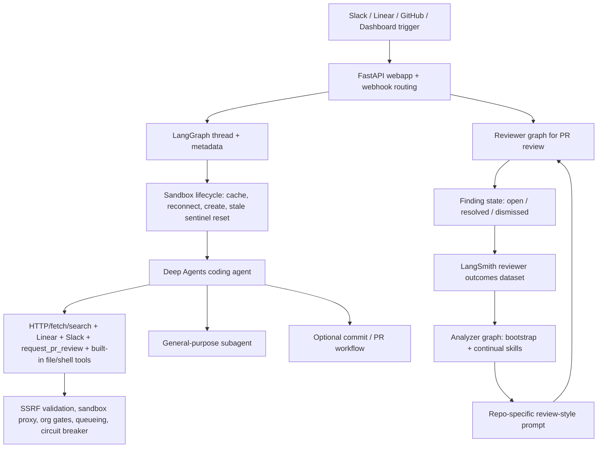

# langchain-ai/open-swe Dual-Chain Deep Dive

> Date: 2026-06-02. Layer: `processed/analysis`. Source queue: `analysis/value-evidence-repair-queue.json`. Local source mirror: `projects/repos/langchain-ai__open-swe` cloned from GitHub `main` at commit `7a9785c`.

## One Sentence

`langchain-ai/open-swe` is a current high-value internal coding-agent control-plane: it combines LangGraph/Deep Agents, isolated sandboxes, Slack/Linear/GitHub invocation, auto PR/reviewer workflows, and a new reviewer-outcomes learning loop, but its self-evolution claim should be bounded to operational feedback and repo-specific review-style refinement rather than full autonomous code self-improvement.

## Three Sentences

[KNOWN] Live GitHub metadata shows `langchain-ai/open-swe` was created `2025-05-21T21:44:24Z`, pushed `2026-06-01T22:47:56Z`, updated `2026-06-01T22:47:58Z`, has MIT license, 9,902 stars, 1,121 forks, 52 watchers/subscribers, no public releases, no tags, and Python as primary language. Sources: `gh repo view langchain-ai/open-swe --json ...`; `gh api repos/langchain-ai/open-swe/releases`; `gh api repos/langchain-ai/open-swe/tags`.

[KNOWN] The raw capture is useful but stale for ranking: `raw-github/langchain-ai_open-swe.md` has `content_timestamp: unknown`, `collected_at: 2026-05-20T17:44:59Z`, raw page text around 9.8k stars and 740 commits, while `research/repo-classification.csv` misclassifies it as a `benchmark-eval` Markdown project. Sources: `raw-github/langchain-ai_open-swe.md`; `research/repo-classification.csv`; live GitHub API.

[INFERRED] Open SWE should be promoted from generic `deep-read-needed` to `frontier-internal-coding-agent-control-plane / reviewer-outcomes-learning`: it fills the run, observe, coordinate, review, retain, and human-feedback parts of the self-evolution pipeline, while remaining gaps include local Docker isolation, external MCP tool integration, warm sandbox latency, deterministic benchmark gates, and stronger regression gating for continual reviewer prompt updates.

## Five Sentences

[KNOWN] The README describes Open SWE as an open-source framework for building an organization's internal coding agent, built on LangGraph and Deep Agents, with cloud sandbox providers, Slack/Linear/GitHub entrypoints, subagent orchestration, and automatic pull-request creation. Source: `raw-github/langchain-ai_open-swe.md`.

[KNOWN] The local source mirror has 317 tracked files, 154 Python files, 56 test files, and graph entries for `agent`, `reviewer`, and `analyzer`, with a FastAPI app for webhooks/dashboard routes. Sources: `projects/repos/langchain-ai__open-swe`; `projects/repos/langchain-ai__open-swe/langgraph.json`.

[KNOWN] `agent/server.py` assembles a Deep Agents coding agent with `http_request`, `fetch_url`, `web_search`, Linear, Slack, PR-review tools, a general-purpose subagent, sandbox backend factory, model/profile overrides, fallback middleware, message-queue checks, Slack status, tool error handling, and sandbox circuit breaking. Source: `projects/repos/langchain-ai__open-swe/agent/server.py`.

[KNOWN] The reviewer/analyzer pair adds a more explicit learning loop: reviewer findings can become true/false-positive examples in a LangSmith dataset, and the analyzer reads those outcomes to refine per-repo review-style prompts through bootstrap and continual-learning skills. Sources: `projects/repos/langchain-ai__open-swe/agent/reviewer.py`; `projects/repos/langchain-ai__open-swe/agent/analyzer.py`; `projects/repos/langchain-ai__open-swe/agent/utils/reviewer_outcomes.py`; PR `#1365`.

[INFERRED] Its strongest value to this corpus is as a 2026 production-style control-plane baseline for coding agents, not as a pure optimizer like GEPA or OpenEvolve: it shows what has to exist around an evolving coding agent before evolution is useful in practice: invocation, identity, sandboxing, queueing, review, audit, feedback capture, dashboard control, and safety gates.

## Evidence Chain

| Link | Status | Evidence |
|---|---|---|
| Raw capture | [KNOWN] | `raw-github/langchain-ai_open-swe.md`; `content_timestamp: unknown`, `collected_at: 2026-05-20T17:44:59Z`, raw page reports 9.8k stars, 1.1k forks, and 740 commits. |
| Generated classification | [KNOWN] | `research/repo-classification.csv` row says category `评测/evaluation`, base `coding-agent`, function `benchmark-eval`, Markdown stack, unknown time slice. |
| Live metadata | [KNOWN] | Created `2025-05-21T21:44:24Z`; pushed and updated `2026-06-01`; MIT; 9,902 stars; 1,121 forks; 52 watchers; primary language Python; homepage is the LangChain Open SWE blog page. |
| Releases/tags | [KNOWN] | GitHub release and tag APIs returned empty arrays on 2026-06-02; this is an active source repo without public version releases. |
| Source mirror | [KNOWN] | `git clone --depth=1 https://github.com/langchain-ai/open-swe.git projects/repos/langchain-ai__open-swe` succeeded; local HEAD `7a9785c`. |
| Scale | [KNOWN] | Local mirror: 317 files, 154 Python files, 56 test files; GitHub language API reports Python, TypeScript, CSS, Dockerfile, Makefile, and JavaScript. |
| Root resources | [KNOWN] | Root contains `AGENTS.md`, `CLAUDE.md`, `CUSTOMIZATION.md`, `INSTALLATION.md`, `REVIEWER_DESIGN.md`, `agent`, `evals`, `tests`, `ui`, `langgraph.json`, `Dockerfile`, `pyproject.toml`, and `uv.lock`. |
| Recent PRs | [KNOWN] | Multiple merged PRs on 2026-06-01 cover dashboard email mapping, GitHub/Slack user mapping, reviewer context, org-member auth, all-thread UI, and reviewer outcomes plus continual-learning split. |
| Issue/resource signal | [KNOWN] | Open and closed issues surface local Docker sandbox, MCP/warm sandbox support, Daytona stability, stale sandbox sentinels, configurable models, and an SSRF DNS-rebinding security fix. |

## Mirror Chain

```json
{
  "node": "project.langchain-ai.open-swe",
  "feature": "value-evidence-repair.deep-read",
  "intent": "Decide whether the repair-queue project is merely a popular coding-agent repo or a useful 2026 self-evolution infrastructure anchor.",
  "rank_decision": "promote-to-frontier-internal-coding-agent-control-plane",
  "rank_confidence": "high",
  "why_now": "The repo was active on 2026-06-01 with many merged PRs, strong adoption, and new reviewer-outcomes continual-learning infrastructure.",
  "main_tension": "Production-grade agent control-plane evidence vs bounded self-evolution: the core coding agent does not yet autonomously evolve code through deterministic benchmark gates.",
  "value_gap": ["operate", "observe", "coordinate", "review", "retain", "human-feedback"],
  "missing_gates": ["local-docker-sandbox", "external-mcp-tools", "warm-sandbox-pool", "deterministic-ci-benchmark", "continual-prompt-regression-gate"],
  "next_action": "Compare Open SWE with GEPA, OpenEvolve, AgentEvolver, Devin-like internal agent systems, and reviewer-specific learning systems as the control-plane layer around artifact optimizers."
}
```

## Architecture Map



## Code Findings

| Gate | Decision | Evidence | Interpretation |
|---|---|---|---|
| Observe | Strong pass | Webhook routes gather Slack/Linear/GitHub context; reviewer builds PR metadata, base/head SHA, comments, diff/line sets, and thread metadata. | The system is context-rich and event-driven, not a stateless CLI wrapper. |
| Operate / modify | Strong pass | `get_agent()` creates a Deep Agents coding agent with sandbox backend, built-in shell/file tools, communication tools, subagent, and optional always-create-PR profile behavior. | It can act on repositories through isolated execution and PR workflows, subject to profile and trigger policy. |
| Verify | Medium | Reviewer graph validates PR findings against diff lines and publication flow; tests cover security, sandbox recovery, reviewer outcomes, analyzer cron, auth, middleware, and UI-adjacent flows. | Verification exists around review/control-plane behavior, but there is no single public benchmark gate proving end-to-end autonomous improvement quality. |
| Retain | Medium-high | Thread metadata stores sandbox ids, reviewer PR state, last reviewed SHA, current run id, encrypted token metadata, and finding state; outcomes dataset stores resolved/dismissed/reaction labels. | Retention is operationally meaningful and directly feeds analyzer prompt refinement. |
| Learn / adapt | Medium-high | PR `#1365` adds outcomes dataset, `read_finding_outcomes`, bootstrap vs continual analyzer skills, and nightly per-repo continual cron registration. | The strongest self-evolution-like loop is reviewer-style learning from production feedback, not general code policy evolution. |
| Safety / rollback | Medium-high | Sandbox provider abstraction, GitHub proxy token handling, org/repo gates, DNS-pinned HTTP request safety, message queueing, and sandbox circuit breaker are present. | Safety surface is mature for an internal agent, while issue history shows these controls are still evolving. |

## Issue and Resource Signals

| Signal | Evidence | Interpretation |
|---|---|---|
| Current user pain | Issue `#1233` requests Docker as first-class `SANDBOX_TYPE` because `local` lacks isolation and cloud providers need keys/infrastructure. | Local/offline isolation is still a major usability and reproducibility gap. |
| Tool ecosystem gap | Issue `#1157` requests external MCP servers, persistent MCP sessions, configurable model, warm Modal sandbox pool, and GitHub token fallback. | Tool extensibility and startup latency are live frontier gaps for production coding agents. |
| Security signal | Issue `#1186` documents a DNS rebinding bypass against `http_request.py`; current code pins resolved addresses per redirect hop through urllib3 connection monkey-patching. | The project has a real agent-security attack surface and has incorporated concrete mitigations. |
| Continuity signal | PR `#1365` merged 2026-06-01 adds outcome labels, analyzer skills, nightly continual-learning cron, and tests. | The project is actively adding feedback-to-improvement infrastructure, not just maintaining integrations. |
| Roadmap depth | Open PR `#1314` proposes a PR-scoped babysitter graph, cron polling, GitHub comment commands, active-agent dashboard UI, and cancel endpoint. | Future direction points toward persistent supervising agents and richer control surfaces. |
| Product resources | `INSTALLATION.md`, `CUSTOMIZATION.md`, `REVIEWER_DESIGN.md`, dashboard/UI, root `AGENTS.md`/`CLAUDE.md`, and LangChain blog homepage. | Resource surface is strong enough for teams to fork, customize, and operate, not merely evaluate. |

## Comparison Decision

| Comparator | Difference |
|---|---|
| `gepa-ai/gepa` | GEPA is the optimizer for mutable text/program artifacts; Open SWE is the operational coding-agent control-plane where such optimizers could be embedded. |
| `gepa-ai/optimize-anything-artifact` | The artifact repo is a reproducibility package with offline verifier logs; Open SWE is a live application stack with auth, webhooks, sandboxes, UI, and production feedback. |
| `modelscope/AgentEvolver` | AgentEvolver emphasizes policy/trajectory evolution in environments; Open SWE emphasizes deployed coding-agent orchestration, review, and organizational workflow. |
| `jarvis-xs/se-agent` | SE-Agent is a smaller trajectory-evolution/replay baseline; Open SWE is broader and more productionized, with stronger current adoption and integration surface. |
| `synaptent/aragora` | Aragora is governance/organization control-plane for agent work; Open SWE is a concrete internal coding-agent implementation with PR review and sandbox execution. |
| Value-LSH role | Should become an anchor bucket for `internal-coding-agent`, `control-plane`, `reviewer-outcomes-learning`, `sandboxed-agent`, and `human-feedback-retention`. |

## Value Screening Decision

| Dimension | Decision | Rationale |
|---|---|---|
| Time weight | Very high | Pushed/updated 2026-06-01; many merged PRs on 2026-06-01; current issue/PR stream remains active. |
| Continuity | High | Created 2025-05-21, maintained through June 2026, with code, tests, docs, dashboard, reviewer, analyzer, and active issue surface. |
| Self-evolution fit | Medium-high | Strong reviewer feedback and prompt-refinement loop; bounded because general coding improvement still depends on user triggers, PR review, and external validation. |
| Implementation evidence | Very high | Local clone, graph definitions, agent/reviewer/analyzer source, tests, docs, dashboard, tools, and sandbox providers inspected. |
| Issue/resource signal | Very high | Open issues and PRs reveal concrete frontier gaps in local isolation, MCP, warm sandboxes, reviewer babysitting, and sandbox reliability. |
| Transfer value | Very high | Useful as the reference control-plane around future self-evolving code agents, reviewer learners, and artifact optimizers. |
| Adoption signal | Very high | Live 9,902 stars and 1,121 forks, but cumulative stars are treated as adoption prior, not the ranking core. |
| Reproduction confidence | Medium-high | Static implementation evidence is strong; this pass did not run the full 486-test suite or operate the agent against a real PR. |

## Queue Update Recommendation

`langchain-ai/open-swe` should move out of `deep-read-needed` and into `frontier-internal-coding-agent-control-plane / reviewer-outcomes-learning`. Its next audit should focus on whether the reviewer outcomes loop measurably improves review quality over time, and whether Docker/MCP/warm-sandbox gaps are resolved in later 2026 commits.

## Trust Chain

- [KNOWN] Raw source, generated classification row, live GitHub metadata, release/tag APIs, issue/PR details, commit list, root contents, language API, and local clone were inspected on 2026-06-02.
- [KNOWN] Code findings come from static inspection of `projects/repos/langchain-ai__open-swe`, local HEAD `7a9785c`.
- [KNOWN] Issue and PR interpretations are based on GitHub issue/PR API responses for `#1233`, `#1186`, `#1157`, `#1365`, and `#1314`.
- [INFERRED] The frontier/control-plane decision is based on source structure, docs, issues, PRs, and raw project claims, not on a live Open SWE deployment.
- [UNVERIFIED] Full test-suite result, hosted dashboard behavior, LangSmith outcome dataset contents, production reviewer quality improvement, and live agent PR completion were not verified in this pass.
