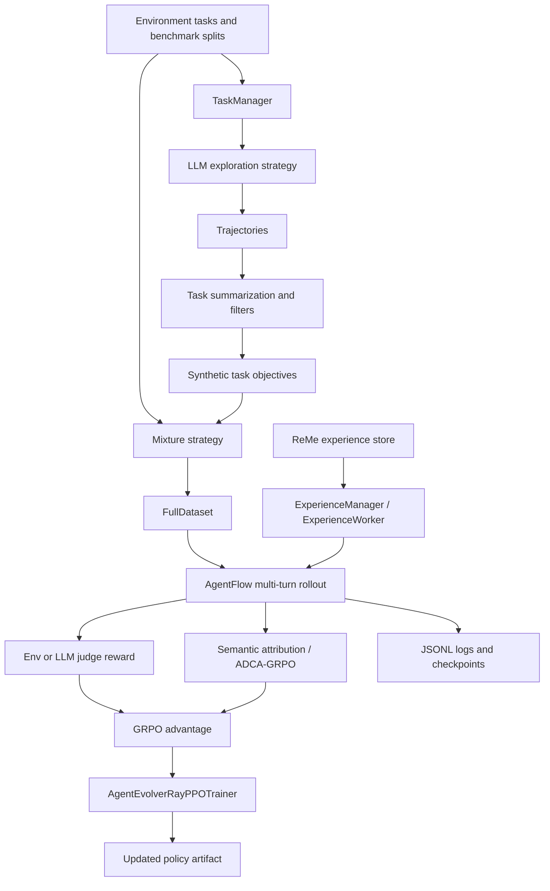

# modelscope/AgentEvolver Dual-Chain Deep Dive

> Date: 2026-06-01. Layer: `processed/analysis`. Frontier source: `analysis/frontier-value-queue.json`.

## One Sentence

AgentEvolver should be promoted as the first frontier deep-dive archetype because it implements an environment-to-policy self-evolution loop, but its reuse value depends on validating training identity stability, ReMe startup, AppWorld data availability, memory cost, and rollback/secret hygiene before treating it as a transferable recipe.

## Three Sentences

[KNOWN] The frontier queue ranks `modelscope/AgentEvolver` first with score `76.93`, lane `frontier-code-ready`, raw time slice `2026-05`, local clone `repos/modelscope__agentevolver`, and a mirror value gap covering observe, interpret, modify, and verify. Source: `analysis/frontier-value-queue.json`.

[KNOWN] The local clone exposes a real closed-loop architecture: `TaskManager` generates and filters synthetic tasks, `AgentFlow` executes multi-turn environment rollouts, `ExperienceManager` retrieves and summarizes ReMe experience, and `AgentEvolverRayPPOTrainer` connects rewards, GRPO advantage computation, and optional ADCA-GRPO semantic attribution into policy training. Sources: `repos/modelscope__agentevolver/agentevolver/module/task_manager/task_manager.py`, `repos/modelscope__agentevolver/agentevolver/module/agent_flow/agent_flow.py`, `repos/modelscope__agentevolver/agentevolver/module/exp_manager/exp_manager.py`, `repos/modelscope__agentevolver/agentevolver/module/trainer/ae_ray_trainer.py`.

[INFERRED] Its research value is high for the survey because it is not just a prompt reflection pattern; it is a service-oriented agent training stack with task synthesis, experience retention, semantic credit assignment, benchmark claims, docs, tests, issue templates, and active issue/PR signals, while still showing exactly the engineering gaps future self-evolution systems must close.

## Five Sentences

[KNOWN] AgentEvolver describes itself as an end-to-end self-evolving training framework with three mechanisms: self-questioning, self-navigating, and self-attributing. Source: `raw-github/modelscope_agentevolver.md`.

[KNOWN] The repository was captured from GitHub on `2026-05-20T17:45:19Z`, reports `created_at=2025-11-13T08:09:51Z`, `last_pushed=2026-04-01T08:47:19Z`, and the local clone head is `a5a8db8` from `2026-03-28T12:58:20+08:00`. Sources: `raw-github/modelscope_agentevolver.md`, `analysis/frontier-value-queue.json`, local `git -C repos/modelscope__agentevolver log -1`.

[KNOWN] Current public GitHub pages show a non-trivial maintenance surface: the repo page shows roughly `1.4k` stars, `167` forks, and `858` commits; the issues page shows `50 Open`, and the pull requests page shows `4 Open`. Sources: <https://github.com/modelscope/AgentEvolver>, <https://github.com/modelscope/AgentEvolver/issues>, <https://github.com/modelscope/AgentEvolver/pulls>.

[INFERRED] The best use of AgentEvolver in this corpus is not "copy the stack", but "teach the full loop": task discovery, rollout, feedback, experience retention, semantic attribution, and policy update as separately auditable modules.

[INFERRED] Its weakest frontier gates are operational portability and audit safety: open issues reference ReMe startup, AppWorld data, GRPO UUID grouping, and memory pressure, while local code scan found checkpoints/logs but no obvious full policy rollback protocol.

## Evidence Chain

| Link | Status | Evidence |
|---|---|---|
| Raw capture | [KNOWN] | `raw-github/modelscope_agentevolver.md`; captured `2026-05-20T17:45:19Z`; raw time slice `2026-05`. |
| Metadata | [KNOWN] | `projects/modelscope__agentevolver.md`; `stars=1441`, `forks=167`, `last_pushed=2026-04-01T08:47:19Z`, license `Apache-2.0`, language `Python`. |
| Local mirror | [KNOWN] | `repos/modelscope__agentevolver`; head `a5a8db8`; branch `main`; docs/tests/examples/config/games/research folders present. |
| Prior report | [KNOWN] | `projects/modelscope__agentevolver.md`; `site/public/reports/projects/modelscope__agentevolver.md`; `projects/agent-architecture-search/10-agentevolver.md`. |
| Current GitHub continuity | [KNOWN] | Issues page: `50 Open`; PR page: `4 Open`; recent open items include ReMe startup, AppWorld data, GRPO data UUID alignment, and memory pressure. |
| Code architecture | [KNOWN] | `TaskManager`, `AgentFlow`, `ExperienceManager`, `AgentEvolverRayPPOTrainer`, `semantic_attribution`, `adca_grpo_pipeline`. |
| Paper/docs resource | [KNOWN] | README links docs, arXiv technical report `2511.10395`, CuES preprint, SeeUPO branch, Game Arena, and DeepWiki. |

## Mirror Chain

```json
{
  "node": "project.modelscope.agentevolver",
  "feature": "frontier-project-deep-dive",
  "intent": "Decide whether AgentEvolver fills a current self-evolution pipeline gap and what should be learned from it.",
  "rank_decision": "promote-as-frontier-archetype",
  "rank_confidence": "medium-high",
  "why_now": "Late-2025 project with 2026 activity and a local clone, so time and implementation evidence both clear the queue threshold.",
  "main_tension": "Complete environment-to-policy evolution loop vs heavy runtime, external services, API dependence, and weak rollback evidence.",
  "value_gap": ["observe", "interpret", "modify", "verify", "retain"],
  "next_action": "Use it as the reference deep-dive template, then test the same gates on JARVIS-Xs/SE-Agent and the clone-needed DARWIN/metaharness family."
}
```

## Architecture Map



## Code Findings

| Gate | Decision | Evidence | Interpretation |
|---|---|---|---|
| Observe | Pass | `TaskManager.load_tasks_from_environment` loads train/val/dev tasks from env service; `AgentFlow.execute` steps through LLM/environment interaction. | The system observes benchmark environments through service APIs, not static prompts only. |
| Interpret | Pass | `LlmRandomSamplingExploreStrategy.summarize` turns trajectories into task objectives; `LlmFilter` and semantic attribution evaluate trajectory quality. | It has explicit interpretation layers: task abstraction, filtering, reward/judge, and step labels. |
| Modify | Pass | `AgentEvolverRayPPOTrainer` computes GRPO advantages and calls actor rollout workers; `apply_adca_grpo` can overwrite advantages with semantic step signals. | The mutable artifact is the policy/training state, not just a prompt file. |
| Verify | Pass with risk | Rewards come from environment evaluation or reward calculators; README reports AppWorld and BFCL-v3 metrics. | Verification exists, but issue signals imply data/identity/runtime alignment must be checked before trusting reproduction. |
| Retain | Partial pass | `ExperienceManager` calls ReMe summarizer/context generator and inserts retrieved experience into rollout context. | Experience retention is a real module, but it depends on an external ReMe service and startup reliability. |
| Rollback/audit | Weak | Task generation checkpoints, trajectory logs, validation dumps, and config files exist; no obvious full policy rollback protocol was found in the sampled code. | Good enough for research logging; not enough to call it operationally safe without extra experiment registry/rollback review. |

## Current Issue And Resource Signals

[KNOWN] Open issue `#45` asks why ReMe service is not started even when `--with-reme` is used; this directly touches the self-navigating retention lane. Source: <https://github.com/modelscope/AgentEvolver/issues>.

[KNOWN] Open issue `#41` reports memory pressure on 8 GPU nodes, which matters because this stack is compute-heavy and not a lightweight agent-loop baseline. Source: <https://github.com/modelscope/AgentEvolver/issues>.

[KNOWN] Open issue `#36` claims GRPO grouping may be broken by random data UUIDs, and open PR `#37` is titled "fix: align data uuid with task id for grpo grouping"; this aligns with the local trainer scan where rollout batches receive UIDs during training. Sources: <https://github.com/modelscope/AgentEvolver/issues>, <https://github.com/modelscope/AgentEvolver/pulls>, `repos/modelscope__agentevolver/agentevolver/module/trainer/ae_ray_trainer.py`.

[KNOWN] Open issue `#31` reports `EnvWorkerWithPrompt` is not defined; local code scan found that symbol in the deduplication exploration strategy, while the configured `random` strategy is the implemented path. Sources: <https://github.com/modelscope/AgentEvolver/issues>, `repos/modelscope__agentevolver/agentevolver/module/task_manager/strategies/deduplication/__init__.py`, `repos/modelscope__agentevolver/agentevolver/module/task_manager/task_manager.py`.

[KNOWN] Open PR `#44` says AppWorld raw data is missing from the repository, which matters because AppWorld is one of the README's benchmark claims and default quick-start examples. Source: <https://github.com/modelscope/AgentEvolver/pulls>.

[KNOWN] The README also points to SeeUPO, CuES, Game Arena, docs, and DeepWiki resources, so continuity is not limited to a single initial release. Source: `raw-github/modelscope_agentevolver.md`, <https://github.com/modelscope/AgentEvolver>.

## Value Screening Decision

| Dimension | Score | Rationale |
|---|---:|---|
| Time weight | High | Created late 2025, raw capture is 2026-05, pushed 2026-04, with current open issues/PRs visible on 2026-06-01. |
| Continuity | High | README news spans technical report, CuES, Game Arena, and SeeUPO; issues/PRs show ongoing friction rather than dormant abandonment. |
| Self-evolution fit | Very high | Covers task generation, environment rollout, experience retrieval, semantic credit assignment, and policy update. |
| Implementation evidence | Very high | Local clone has code, configs, docs, tests, examples, issue templates, and research submodules. |
| Reproducibility | Medium | Needs conda/CUDA/Ray/veRL/vLLM/DashScope/ReMe/AppWorld; open issues show setup risk. |
| Transfer value | High | Architecture is modular enough to teach, compare, and mine for gaps even if full reproduction is expensive. |

## Comparison Notes

AgentEvolver is stronger than reflection-only loops because it updates a trainable policy through RL rather than only rewriting thoughts or prompts.

It is more directly aligned with the user's "history work to future guidance" goal than a pure benchmark because it exposes the missing engineering contracts: task identity, experience service lifecycle, data availability, reward grounding, and rollback.

It should sit beside `OpenEvolve` and `SE-Agent` as a frontier code-ready archetype, but with a different mutable object: AgentEvolver optimizes agent policy/experience behavior, while code-evolution systems mutate programs or search candidates.

## Risks To Preserve For Future Agents

- Do not copy runtime setup blindly. Treat `install.sh`, Ray, veRL, vLLM, DashScope, ReMe, and AppWorld as a full reproduction project.
- Do not quote or propagate key-like runtime values found in code; secret hygiene should be checked before reuse.
- Do not treat benchmark tables as independently verified until data availability and issue-linked setup blockers are resolved.
- Do not call the deduplication strategy production-ready until `EnvWorkerWithPrompt` import/definition status is resolved.
- Do not mark rollback/audit as complete without a policy checkpoint recovery path and experiment registry review.

## Next Research Actions

1. Create a lightweight reproducibility checklist for AgentEvolver without running the full GPU stack.
2. Trace issue `#36` and PR `#37` against local `uid`/task-id grouping to decide if local clone is pre-fix or post-fix.
3. Inspect SeeUPO and CuES branches/resources separately, because they may be the more current 2026 continuity lane.
4. Compare against `JARVIS-Xs/SE-Agent` using the same gate table to test whether the deep-dive template generalizes.
5. Add an "operational reproducibility" column to the frontier queue after 3-5 project samples.
