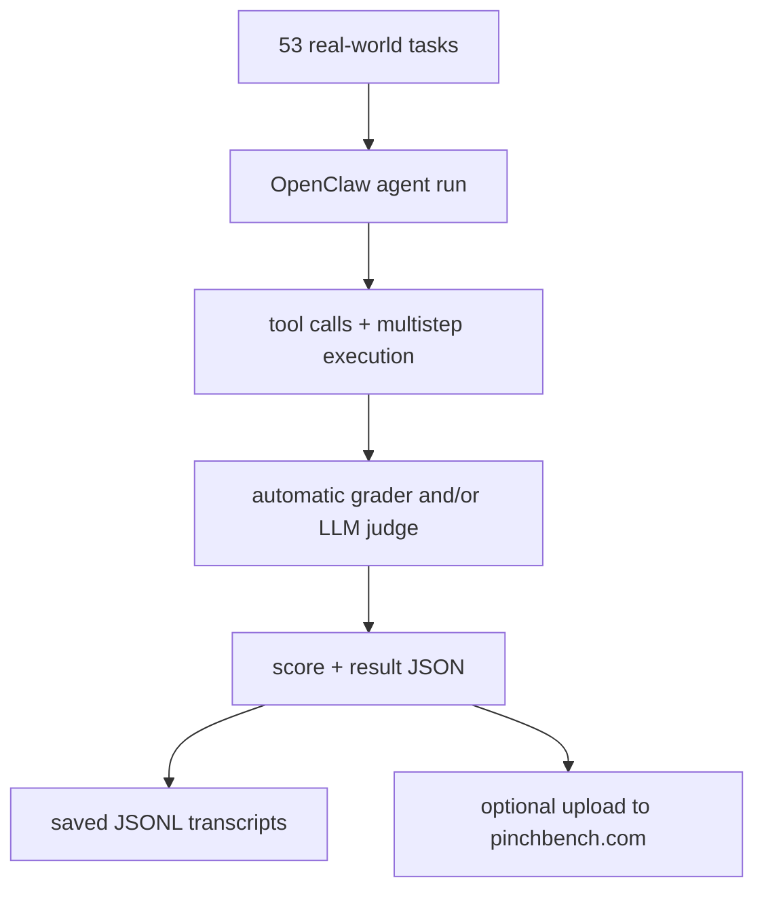

# pinchbench/skill Dual-Chain Deep Dive

> Date: 2026-06-13. Layer: `processed/analysis`. Source queue: `analysis/value-evidence-repair-queue.json`. Evidence quality: authenticated GitHub API metadata + raw capture; local benchmark execution not performed.

## One Sentence

`pinchbench/skill` is a high-value benchmark harness for OpenClaw-style agents: it does not make agents self-evolve by itself, but it supplies the real-task evaluator, transcript retention, and leaderboard path that a self-improvement loop needs to avoid judging itself in the dark.

## Three Sentences

[KNOWN] The authenticated GitHub API snapshot on 2026-06-13 shows `pinchbench/skill` at 1,229 stars, 138 forks, 18 open issues, 383 commits, MIT license metadata, and Python as the primary language. Source: `raw-github/pinchbench_skill.md`.

[KNOWN] The raw capture still makes the benchmark scope explicit: 53 real-world tasks across productivity, research, writing, coding, analysis, email, memory, and skill discovery, with automatic grading, LLM judging, and saved transcript archives. Source: `raw-github/pinchbench_skill.md`.

[INFERRED] The correct frontier role remains `benchmark-harness / OpenClaw ecosystem evaluator`: PinchBench is not itself a self-evolving runtime, but it is the evaluation substrate that lets a runtime, skill pack, or harness mutation claim measurable progress on realistic tasks.

## Evidence Chain

| Link | Status | Evidence |
|---|---|---|
| Raw capture | [KNOWN] | `raw-github/pinchbench_skill.md` refreshed on 2026-06-13 with authenticated GitHub API stars/forks/issues/PRs/commits plus README task scope. |
| Queue row | [KNOWN] | `analysis/value-evidence-repair-queue.json` keeps the repo in the evidence-repair corpus, but the freshness blocker is cleared for this row. |
| Public model card | [KNOWN] | `projects/51-pinchbench-skill.md` and `site/public/reports/projects/51-pinchbench-skill.md`. |
| Site project data | [KNOWN] | `site/src/data/projects.ts` receives updated benchmark metadata in this iteration. |
| API access | [KNOWN] | `gh api graphql` succeeded in this workspace on 2026-06-13; the old API-blocked interpretation is no longer correct for this row. |

## Mirror Chain

```json
{
  "node": "project.pinchbench.skill",
  "feature": "value-evidence-repair.deep-read",
  "intent": "Decide whether PinchBench is just an OpenClaw leaderboard accessory or a broader evaluation primitive for self-improving agents.",
  "rank_decision": "promote-to-benchmark-harness-anchor",
  "rank_confidence": "medium",
  "main_tension": "Strong benchmark/task realism vs narrow dependence on the OpenClaw execution stack.",
  "why_now": "The user keeps prioritizing skill, benchmark, and harness evidence over star totals; PinchBench is where those three threads meet.",
  "next_action": "Keep it in frontier comparison as the real-task evaluator for runtime and skill-loop projects, but do not score it as a self-evolving runtime."
}
```

## Working Principle



## Trust Chain

- [KNOWN] Authenticated GitHub API metadata and README-surface signals were re-read on 2026-06-13.
- [KNOWN] Freshness is API-backed in this pass; the earlier API-blocked note is now historical context only.
- [INFERRED] The benchmark-anchor decision comes from task scope, judging design, and transcript retention.
- [UNVERIFIED] No official leaderboard run, upload path, or local OpenClaw benchmark execution was reproduced in this pass.
