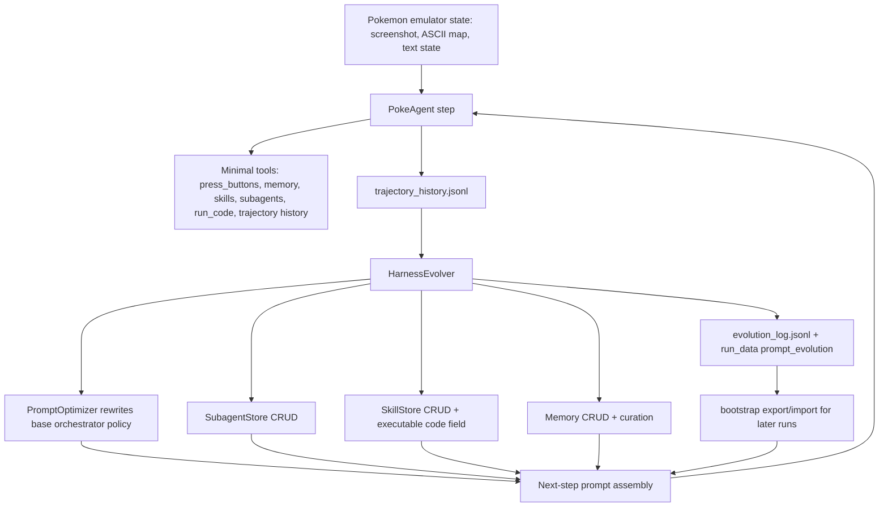

# sethkarten/continual-harness Dual-Chain Deep Dive

> Date: 2026-06-02. Layer: `processed/analysis`. Source queue: `analysis/value-evidence-repair-queue.json`. Local source mirror: `projects/repos/sethkarten__continual-harness` cloned from GitHub `main` at commit `bbab97a`.

## One Sentence

`sethkarten/continual-harness` is a current high-value reset-free self-evolution benchmark and harness: it turns long-horizon gameplay trajectories into online edits of prompt, subagents, skills, and memory, but its implementation should be scored as "frontier with caveats" because the evolver's add-path currently has persistence/reporting defects and the benchmark depends on model capability, emulator setup, ROM/API access, and unpublished live-run reproduction.

## Three Sentences

[KNOWN] Live GitHub metadata shows `sethkarten/continual-harness` was created `2025-07-08T00:55:50Z`, pushed `2026-05-13T04:08:35Z`, updated `2026-06-02T01:42:18Z`, has MIT license, 198 stars, 76 forks, Python as primary language, homepage `https://sethkarten.ai/continual-harness/`, and latest release `v5.0.0` published `2026-05-13T03:57:52Z`. Sources: GitHub API; `raw-github/sethkarten_continual-harness.md`; local clone.

[KNOWN] The raw capture is fresh and useful but under-evidenced for implementation ranking: `raw-github/sethkarten_continual-harness.md` has `content_timestamp: 2026-05-21`, `collected_at: 2026-05-20T17:45:19Z`, raw page text around 106 stars, 36 forks, 953 commits, and the README claim that Continual Harness automates agentic-harness refinement through online in-context learning.

[INFERRED] It should be promoted from generic `deep-read-needed` to `frontier-reset-free-harness-evolution / game-agent-self-improvement-benchmark`: it directly targets the six self-evolution gates, but the strongest rating is for mechanism value and benchmark design rather than fully verified turnkey reproducibility.

## Five Sentences

[KNOWN] The README/release describe Continual Harness as the reference implementation for arXiv `2605.09998`, "Online Adaptation for Self-Improving Foundation Agents", with a minimalist environment interface and a refiner that edits the agent's prompt `p`, subagents `G`, skills `K`, and memory `M` in place during an episode. Sources: `raw-github/sethkarten_continual-harness.md`; release `v5.0.0`; arXiv abstract page.

[KNOWN] The local source mirror has 3,979 files, 147 Python files, and 91 test files, with `agents/PokeAgent.py`, `agents/utils/harness_evolver.py`, persistent stores under `utils/stores/`, scaffold-specific prompts, CLI-agent backends, MCP/game server code, and bootstrap/export tests. Source: `projects/repos/sethkarten__continual-harness`.

[KNOWN] `agents/utils/harness_evolver.py` composes `PromptOptimizer` and runs independent passes over recent trajectories to rewrite the base prompt, create/update/retire subagents, create/update skills, curate memory, and append `evolution_log.jsonl`; `agents/PokeAgent.py` automatically triggers this pass after trajectory logging or exposes an on-demand `evolve_harness` tool for the `continualharness` scaffold.

[KNOWN] The scaffold is intentionally constrained: `agents/tools/registry.py` gives `continualharness` primitive controls plus `process_memory`, `process_skill`, `run_skill`, `run_code`, `process_subagent`, `execute_custom_subagent`, `process_trajectory_history`, `replan_objectives`, and `evolve_harness`, while excluding expert tools such as walkthrough/wiki/navigate-to pathfinding.

[INFERRED] Its transfer value is unusually high because it operationalizes self-evolution as mutable harness state rather than a single prompt or benchmark score, but the exact benchmark claims and model-dependent gains should stay bounded until an independent run reproduces the paper/release results.

## Evidence Chain

| Link | Status | Evidence |
|---|---|---|
| Raw capture | [KNOWN] | `raw-github/sethkarten_continual-harness.md`; `content_timestamp: 2026-05-21`, `time_slice: 2026-05`, raw page reports 106 stars, 36 forks, and 953 commits. |
| Generated classification | [KNOWN] | `research/repo-classification.csv` row says category `评测/evaluation`, function `benchmark-eval`, Python, 2026-05, evidence `kept prior human/analysis category + README verified`. |
| Value matrix | [KNOWN] | `analysis/value-lsh-index.json` scored the project `76.75 / 61.54` before deep-read, with `implementation_runnable=0`, `teaching_model_card=0`, `evidence_chain_complete=0`, and `issue_resource_signal=0`. |
| Live metadata | [KNOWN] | Created `2025-07-08`; pushed `2026-05-13`; updated `2026-06-02`; MIT; 198 stars; 76 forks; primary language Python; topics include `continual`, `harness`, `pokeagent`, `geminiplayspokemon`, `neurips`, and `pokemon`. |
| Releases/tags | [KNOWN] | Release `v5.0.0` on `2026-05-13` introduces Continual Harness; release `v4.0.0` on `2026-03-22` introduced PokéAgent speedrunning benchmark and CLI-agent support; earlier releases span 2025-08 to 2025-10. |
| Source mirror | [KNOWN] | `git clone --depth=1 https://github.com/sethkarten/continual-harness.git projects/repos/sethkarten__continual-harness` succeeded; local HEAD `bbab97a`. |
| Scale | [KNOWN] | Local mirror: 3,979 files, 147 Python files, 91 test files; GitHub language API reports Python, C++, Pascal, HTML, Shell, Dockerfile, and BitBake. |
| Root resources | [KNOWN] | Root contains `README.md`, `pyproject.toml`, `run.py`, `run_cli.py`, `agents`, `server`, `pokemon_env`, `pokemon_red_env`, `docs`, `tests`, `utils`, `System-Design`, diagrams, and lock files. |
| Issue signal | [KNOWN] | Public issue list has low current volume and no open issues; closed issues mostly cover emulator install/version, image-token mismatch, frozen emulator, API latency, hardcoded Vertex AI project id, and UI/video recording friction. |
| PR signal | [KNOWN] | Merged PRs in 2026 include Continual Harness release, terminology refactor, minimal CLI movement interface, prompt optimizer changes, metric tracking, concurrent execution/cache isolation, and subagent/skill/runtime evolution work. |

## Mirror Chain

```json
{
  "node": "project.sethkarten.continual-harness",
  "feature": "value-evidence-repair.deep-read",
  "intent": "Decide whether this is just another Pokemon agent benchmark or a current mechanism anchor for self-evolving agent harnesses.",
  "rank_decision": "promote-to-frontier-reset-free-harness-evolution",
  "rank_confidence": "medium-high",
  "why_now": "The v5.0.0 release and arXiv paper landed in May 2026, and live stars grew from the raw-capture 106 to 198 by 2026-06-02.",
  "main_tension": "It has one of the clearest mutable-harness self-evolution designs in the corpus, but static code inspection found persistence/reporting bugs in the evolver add path and reproduction depends on emulator, ROM, API, and model-capability conditions.",
  "value_gap": ["mutable-harness-state", "online-trajectory-feedback", "skill-and-subagent-retention", "bootstrap-transfer", "minimal-tool-interface"],
  "missing_gates": ["independent-run-reproduction", "formal-regression-gate-for-evolved-artifacts", "evolver-add-path-persistence-fix", "model-independent-performance-proof", "open-issue-continuity-signal"],
  "next_action": "Compare against GEPA, AgentEvolver, SE-Agent, OpenEvolve, and tylerdotai/meta-harness-evolver as a harness-level optimizer rather than a production coding-agent control plane."
}
```

## Architecture Map



## Code Findings

| Gate | Decision | Evidence | Interpretation |
|---|---|---|---|
| Mutable artifact | Strong pass | `HarnessEvolver` edits prompt, subagents, skills, and memory; `SkillEntry` has optional executable `code`; `SubagentEntry` stores instructions/directive/tools; `MemoryEntry` stores path/content/importance. | The mutable object is the whole agent harness, not just a prompt string. |
| Feedback | Strong pass | `PokeAgent` logs per-step trajectories with state, reasoning, tool calls, and response; `PromptOptimizer._format_trajectories_for_analysis()` surfaces stuck loops, tool calls, and state. | The optimizer reads behavior traces, not only scalar rewards. |
| Candidate generation | Strong pass | Prompt, subagent, skill, and memory passes call a text VLM and parse JSON recommendations; `evolve_harness` can be automatic or on-demand. | Candidate generation is explicit and inspectable. |
| Verification | Medium | Tests cover scaffold prompt/tool selection, stores, bootstrap, process-store endpoints, subagent executor, map skill benchmark helpers, CLI backends, server validation, and termination endpoints. | Many components are tested, but the full online improvement claim still needs an end-to-end reproduced run. |
| Retention | Medium-high | Stores persist to `memory.json`, `skills.json`, `subagents.json`; optimized prompts save under `prompt_evolution/meta_prompts`; bootstrap exports stores and latest evolved prompt. | Long-term artifacts are designed to survive across runs. |
| Rollback / safety | Medium | Bootstrap/frozen/updating modes and backup manager exist; evolver passes catch exceptions independently; prompt sanitization removes run-specific bootstrap content. | There is resilience, but not a formal selection/rollback gate for harmful evolved artifacts. |
| Implementation caveat | Important defect | `HarnessEvolver._evolve_subagents()`, `_evolve_skills()`, and `_evolve_memory()` call `store.add()` then use `entry.id`, but `BaseStore.add()` returns the entry id string; `_evolve_skills()` also omits `code=spec.get("code")` for new skills. | New evolved entries may persist but be reported as failed, and newly evolved executable skills are likely saved as non-executable descriptions unless updated later. |
| Logging caveat | Minor defect | `_save_evolution_log()` attempts `len(self._get_*_store()._entries)` even though `BaseStore` uses `entries`; exception is swallowed. | The log still appends, but store-count telemetry may be missing. |

## Issue and Resource Signals

| Signal | Evidence | Interpretation |
|---|---|---|
| Fresh release | `v5.0.0` release on 2026-05-13 includes Continual Harness, bootstrap variants, minimalist/hand-engineered baselines, and external CLI-agent harnesses. | Strong time signal for 2026 frontier ranking. |
| Model-capability caveat | Release/README state gains are capability-dependent: Pareto-dominant on Gemini 3 Pro, high variance on Flash, below minimalist baseline on Flash-Lite. | Value is mechanism-rich but not model-agnostic. |
| Minimal interface | PR `#48` removed pathfinding shortcut from CLI movement and forced `press_buttons` for movement. | This strengthens benchmark integrity by avoiding hidden expert tools. |
| Evolution implementation continuity | 2026 commits mention skill code evolution, REPL/run-code tool, evolution summary injection, and scaffold-aware story planning. | The repository has been actively turning the benchmark into a self-evolving harness, not just renaming docs. |
| Adoption friction | Closed issues focus on mGBA installation/version, emulator freezing, Qwen image-token mismatch, API latency, and hardcoded Vertex project id. | Usability risk is concrete and mostly environment/runtime related. |
| Public community signal | No currently open public issues and only low issue count. | Positive for stability, weak for roadmap discovery; closed issues are useful but not a rich current frontier backlog. |
| Test resources | 91 test files plus scaffold/tool, bootstrap, process-store, CLI-backend, map-skill, and server tests. | Better implementation evidence than a README-only project. |

## Comparison Decision

| Comparator | Difference |
|---|---|
| `gepa-ai/gepa` | GEPA is a general optimizer with Pareto validation for prompt/program artifacts; Continual Harness is an embodied, reset-free harness that mutates prompt, subagents, skills, and memory online during a single long-horizon episode. |
| `gepa-ai/optimize-anything-artifact` | The artifact repo is offline reproducibility evidence for GEPA; Continual Harness is an active environment-and-agent system whose reproduction requires emulator/model/runtime setup. |
| `modelscope/AgentEvolver` | AgentEvolver is a broader trajectory/policy evolution baseline; Continual Harness gives a more concrete mutable-harness state model and game benchmark, but with model-capability and implementation caveats. |
| `jarvis-xs/se-agent` | SE-Agent provides a compact trajectory-evolution baseline; Continual Harness is larger, fresher, and more explicit about skill/subagent/memory/prompt evolution. |
| `langchain-ai/open-swe` | Open SWE is a production internal coding-agent control-plane; Continual Harness is a benchmark/mechanism anchor for online harness self-evolution. |
| Value-LSH role | Anchor for `reset-free-harness-evolution`, `online-adaptation`, `skill-memory-subagent-evolution`, `minimal-tool-benchmark`, and `bootstrap-transfer`. |

## Value Screening Decision

| Dimension | Decision | Rationale |
|---|---|---|
| Time weight | Very high | May 2026 arXiv/release; GitHub updated on 2026-06-02; stars rose from raw 106 to live 198. |
| Continuity | Medium-high | Releases span 2025-08 through 2026-05; pushed in May 2026; no open issues, so current roadmap continuity is less visible than Open SWE/GEPA. |
| Self-evolution fit | Very high | Directly targets prompt, subagent, skill, and memory mutation from online trajectories. |
| Implementation evidence | High | Local clone, core evolver, stores, scaffold registry, prompt optimizer, bootstrap, tests, and prompt contracts inspected. |
| Issue/resource signal | Medium | Closed issues expose concrete runtime friction; lack of open issue backlog reduces roadmap evidence. |
| Transfer value | Very high | Teaches how to frame harness state as the evolving object and how to compare minimal vs bootstrapped vs updating harnesses. |
| Adoption signal | Medium | 198 stars/76 forks are not huge, but current growth from raw capture is strong for a new 2026 release. |
| Reproduction confidence | Medium | Static evidence is strong; this pass did not run the emulator/agent, validate paper scores, or resolve ROM/API/mGBA dependencies. |

## Queue Update Recommendation

`sethkarten/continual-harness` should move out of `deep-read-needed` and into `frontier-reset-free-harness-evolution / game-agent-self-improvement-benchmark`. The next audit should focus on fixing or confirming the evolver add-path defects, reproducing a small run with a supported model/backend, and comparing its evolved artifacts against GEPA-style artifact optimizer logs.

## Trust Chain

- [KNOWN] Raw source, generated classification row, value-matrix row, live GitHub metadata, release/tag history, issue/PR details, commit stream, root contents, language API, arXiv abstract page, and local clone were inspected on 2026-06-02.
- [KNOWN] Code findings come from static inspection of `projects/repos/sethkarten__continual-harness`, local HEAD `bbab97a`.
- [KNOWN] Issue and PR interpretations are based on GitHub API responses for public issues/PRs through 2026-06-02.
- [INFERRED] The frontier/reset-free-harness decision is based on source structure, docs, issues, PRs, raw claims, and arXiv/release claims, not on a live independent run.
- [UNVERIFIED] Full benchmark reproduction, paper score tables, hosted homepage behavior, emulator execution, ROM availability, API-model behavior, and model-specific performance deltas were not verified in this pass.
