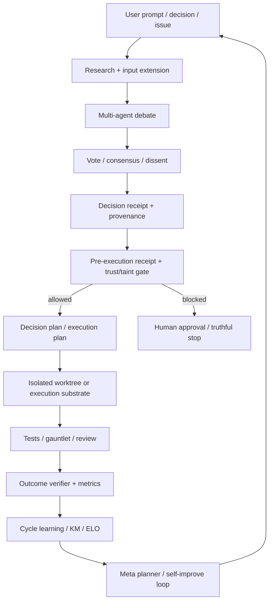

# synaptent/aragora Dual-Chain Deep Dive

> Date: 2026-06-02. Layer: `processed/analysis`. Source queue: `analysis/value-evidence-repair-queue.json`. Local mirror: `projects/repos/synaptent__aragora`.

## One Sentence

`synaptent/aragora` is a high-continuity 2026 control-plane project for governed AI-assisted execution, with strong code/release/issue evidence and real self-improvement plumbing, but its frontier value is governance-substrate value rather than pure model self-evolution, and its issue/PR surface shows meaningful operational-drift risk.

## Three Sentences

[KNOWN] GitHub metadata shows the repo was created `2026-01-01T05:08:26Z`, pushed `2026-06-01T17:02:47Z`, updated `2026-06-01T16:39:07Z`, has MIT license, latest release `v2.9.0` published `2026-04-25T09:17:12Z`, 7 stars, 3 forks, and Python as primary language. Sources: `gh repo view synaptent/aragora --json ...`; `gh api repos/synaptent/aragora/releases`.

[KNOWN] A direct clone succeeded to `projects/repos/synaptent__aragora`; the local mirror has 15,242 tracked files, 10,702 Python files, 5,257 `test*.py` files, 39 tags, and 481 commits since 2026-05-01. Sources: local `git` / `find` commands in current run.

[INFERRED] Aragora should be promoted out of generic repair backlog into a `frontier-governance-control-plane` lane: it directly implements multi-agent debate, receipts, pre-execution gates, outcome verification, and a self-improvement pipeline, but the open issue/PR queues and stage-gate drift issues mean the public claim should emphasize "governed execution substrate" and not overstate finished autonomous self-evolution.

## Five Sentences

[KNOWN] The README frames Aragora as an auditable execution control plane with multi-model review, decision receipts, provenance, truthful gates, sandboxed effectors, and a staged path from Tool to Organization Substrate. Source: `projects/repos/synaptent__aragora/README.md`.

[KNOWN] The standalone `aragora-debate` package exposes a minimal `Debate` API that requires at least two agents, supports consensus methods, and returns a `DebateResult` with a decision receipt. Sources: `projects/repos/synaptent__aragora/aragora-debate/src/aragora_debate/debate.py`; `projects/repos/synaptent__aragora/aragora-debate/src/aragora_debate/types.py`.

[KNOWN] Receipt and gate code creates signed/content-hashed decision receipts, persists pre-execution receipts, and blocks execution when trust/taint conditions are not satisfied. Sources: `projects/repos/synaptent__aragora/aragora-debate/src/aragora_debate/receipt.py`; `projects/repos/synaptent__aragora/aragora/pipeline/receipt_gate.py`.

[KNOWN] The self-improvement path is explicit: `SelfImprovePipeline` plans, decomposes, risk-scores, captures baseline metrics, executes in worktrees, runs gauntlet validation, compares outcomes, persists learning, and publishes pipeline graph evidence. Source: `projects/repos/synaptent__aragora/aragora/nomic/self_improve.py`.

[INFERRED] The strongest value is not star adoption yet; it is the rare combination of 2026 activity, live release discipline, multi-agent governance abstractions, receipt/gate machinery, and issue-driven dogfooding, while the main risk is that the codebase is very large and the governance queue itself is visibly under pressure.

## Evidence Chain

| Link | Status | Evidence |
|---|---|---|
| Raw capture | [KNOWN] | `raw-github/synaptent_aragora.md`; raw frontmatter `content_timestamp: 2026-05-21`, but gBrain section later reports unknown timestamp, so live GitHub metadata supersedes the raw timestamp for recency. |
| GitHub metadata | [KNOWN] | Created `2026-01-01T05:08:26Z`; pushed `2026-06-01T17:02:47Z`; updated `2026-06-01T16:39:07Z`; latest release `v2.9.0`; MIT; 7 stars; 3 forks; Python primary. |
| Local mirror | [KNOWN] | `git clone https://github.com/synaptent/aragora.git projects/repos/synaptent__aragora` succeeded; current HEAD `17b101286422de1e9e5b16b513d71f7190f76d9d`. |
| Scale | [KNOWN] | 15,242 tracked files; 10,702 Python files; 5,257 `test*.py` files; 140,255 KB repo size from REST metadata. |
| Recent continuity | [KNOWN] | 481 local commits since 2026-05-01; latest local commit date `2026-06-01 11:32:53 -0500`. |
| Releases/tags | [KNOWN] | 39 local tags; release API shows `v2.9.0` and earlier 2026 releases. |
| Issues / PRs | [KNOWN] | `gh issue list` and `gh pr list` returned active June 2026 items; REST `open_issues_count` was 1070, which includes issues plus PRs in GitHub's REST field. |
| Local validation | [KNOWN] | `python3 -m pytest aragora-debate/tests/test_debate.py -q` under the host Python passed 13 sync tests and failed 18 async tests because `pytest-asyncio` was unavailable; this is an environment validation gap, not proof that the project runtime is broken. |

## Mirror Chain

```json
{
  "node": "project.synaptent.aragora",
  "feature": "value-evidence-repair.deep-read",
  "intent": "Decide whether the top repair-queue project is a current frontier self-evolution system or a governance-control-plane substrate.",
  "rank_decision": "promote-to-frontier-governance-control-plane",
  "rank_confidence": "medium-high",
  "why_now": "It ranked first in repair queue due high value score plus missing processed report; live evidence shows unusually high 2026 continuity.",
  "main_tension": "Strong governance/self-improvement machinery vs low external star adoption and noisy open issue/PR queue.",
  "value_gap": ["observe", "verify", "retain", "audit"],
  "missing_gates": ["external-adoption", "small-install verification", "queue-health"],
  "next_action": "Treat as a high-value governance substrate to compare against AgentEvolver-style code/policy evolution, and separately audit whether the huge issue queue reflects healthy dogfooding or unstable process debt."
}
```

## Architecture Map



## Code Findings

| Gate | Decision | Evidence | Interpretation |
|---|---|---|---|
| Observe | Strong pass | Debate messages, votes, receipts, run ledgers, issue/PR queues, and `OutcomeVerifier.record_decision()` capture decisions and later verification signals. | Rich observation layer for AI-assisted execution and governance. |
| Interpret | Strong pass | `EvidencePoweredTrickster`, voting/consensus code, risk scoring, quality gates, and issue labels such as `stage-gate-drift` interpret weak evidence and process drift. | The system is explicitly built to challenge hollow consensus and classify process risk. |
| Modify | Medium pass | `SelfImprovePipeline` decomposes goals, uses worktrees, runs agents, and can produce changed files; execution is gated. | It can modify code/process artifacts, but autonomy is intentionally bounded by approval and safety gates. |
| Verify | Strong pass | Receipts, `PlanReceiptGate`, gauntlet validation, tests, issue-linked fixes, and verification commands all appear in code and PR history. | Verification is the core product value. |
| Retain | Strong pass | Outcome verifier, cycle learning store, KM/ELO/calibration references, and receipt persistence retain decision outcomes. | Retention feeds future team selection and self-improvement targeting. |
| Rollback/audit | Medium-high | Decision receipts, provenance, PR review, auto-revert-on-regression flag, and stage-gate issues exist; code comment says auto-revert is logged rather than performed. | Audit trail is strong; automatic rollback should be stated carefully. |

## Comparison Decision

| Comparator | Difference |
|---|---|
| `kargarisaac/reflexion` | Reflexion is a small prompt-memory retry wrapper; Aragora is a large governance/execution control plane with releases, active issues/PRs, local mirror, receipts, and self-improvement pipeline code. |
| `modelscope/AgentEvolver` | AgentEvolver is closer to environment-to-policy training/self-improvement; Aragora is closer to proof-carrying governance for AI-assisted work and code execution. |
| `JARVIS-Xs/SE-Agent` | SE-Agent is a trajectory-evolution research baseline; Aragora is productized infrastructure with CLI, API, Docker, release, and operational governance surfaces. |
| Value-LSH role | Should move from `deep-read-needed` into a high-value governance/control-plane anchor, but needs a separate queue-health and adoption audit. |

## Value Screening Decision

| Dimension | Decision | Rationale |
|---|---|---|
| Time weight | Very high | Created in 2026 and actively pushed on 2026-06-01 with 481 commits since 2026-05-01. |
| Continuity | Very high but noisy | Release/tag cadence and issue/PR activity are strong; open queue and stage-gate-drift issues indicate governance pressure. |
| Self-evolution fit | High for governance substrate | Includes self-improve pipeline, outcome feedback, receipts, gates, and memory/calibration loops; not a pure model-weight or policy optimizer. |
| Implementation evidence | Very high | Direct local clone, large codebase, tests, package metadata, docs, Docker, API, CLI, SDK, and releases. |
| Issue/resource signal | High | Live issues/PRs are rich and current; signal must be interpreted because many are internal automation/governance artifacts. |
| Transfer value | High | Useful as a control-plane archetype for future systems that need receipts, gated execution, provenance, and feedback-driven repair. |
| Adoption signal | Low-medium | Only 7 stars and 3 forks despite active work; likely under-publicized or founder/internal-heavy. |

## Queue Update Recommendation

`synaptent/aragora` should move from `deep-read-needed` to `frontier-governance-control-plane / queue-health-audit-needed`. It is one of the more valuable current projects in this corpus for "how to govern self-improving AI-assisted work", but future public copy should avoid treating its massive activity as proven external adoption until the issue queue, release consumption, PyPI/downloads, and independent user signal are audited.

## Trust Chain

- [KNOWN] Raw source, local mirror path, current GitHub metadata, releases, tags, issues, PRs, languages, and commit continuity were inspected on 2026-06-02.
- [KNOWN] Code findings come from static inspection of cloned source files under `projects/repos/synaptent__aragora`.
- [KNOWN] A small local test attempt was made; async tests failed due missing `pytest-asyncio` in the host Python environment.
- [INFERRED] The architecture/gate decision is based on code paths and README claims, not on full product runtime execution.
- [UNVERIFIED] PyPI/download adoption, hosted app behavior, and full docker/runtime QA were not verified in this pass.
