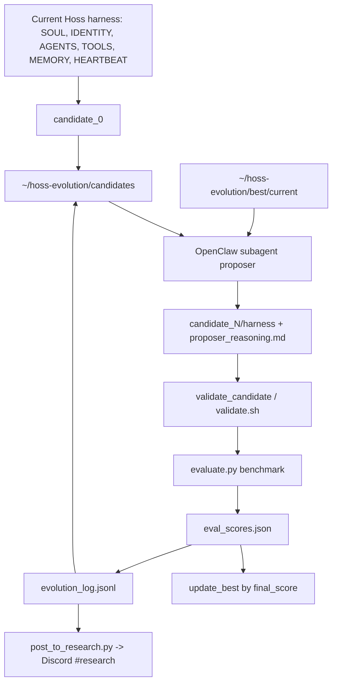

# tylerdotai/meta-harness-evolver Dual-Chain Deep Dive

> Date: 2026-06-02. Layer: `processed/analysis`. Source queue: `analysis/value-evidence-repair-queue.json`. Local source mirror: `projects/repos/tylerdotai__meta-harness-evolver`, cloned from GitHub `main` at commit `12f3b1d`.

## One Sentence

`tylerdotai/meta-harness-evolver` is a fresh and highly aligned harness-evolution prototype for OpenClaw/Hoss: it makes the agent harness itself the mutable object, but its public evidence is thin and the evaluator is currently heuristic/static, so it should be ranked as a frontier concept/prototype rather than a verified self-evolving runtime.

## Three Sentences

[KNOWN] Live GitHub metadata on 2026-06-02 shows `tylerdotai/meta-harness-evolver` was created `2026-03-31T03:50:29Z`, pushed `2026-03-31T03:58:52Z`, updated `2026-04-06T19:25:01Z`, with 14 stars, 2 forks, 0 watchers, 0 issues, 0 pull requests, MIT license, no releases/tags/topics/templates, Python primary language, and a 27 KB repository.

[KNOWN] The local mirror contains `README.md`, `SKILL.md`, three reference docs, and four scripts; `scripts/run_evolution.py` implements the outer loop over `~/hoss-evolution`, spawning an OpenClaw subagent proposer, validating a candidate harness, evaluating it, updating best-by-score, logging JSONL, and posting a Discord report.

[INFERRED] It belongs in the value graph as `frontier-harness-evolution-prototype / self-mirror-config-optimizer`: excellent mechanism fit and teaching value, weak continuity/community signal, and medium-low verification confidence because the benchmark is not yet an actual Hoss task runner and its weights currently sum to `1.28` instead of `1.0`.

## Five Sentences

[KNOWN] The raw capture has `content_timestamp: unknown`, `time_slice: unknown`, and `collected_at: 2026-05-20T17:44:59Z`, so live metadata is required before any time-weighted ranking. Source: `raw-github/tylerdotai_meta-harness-evolver.md`.

[KNOWN] The repair queue ranks it first with `value_score: 80.89`, `repair_score: 134.89`, lane `deep-read-needed`, and gaps for missing deep report, missing frontier queue evidence, unclear issue/resources, and incomplete evidence chain. Source: `analysis/value-evidence-repair-queue.json`.

[KNOWN] The implementation defines the evolving harness as `SOUL.md`, `IDENTITY.md`, `AGENTS.md`, `TOOLS.md`, `MEMORY.md`, and `HEARTBEAT.md`, matching the user's Self Mirror idea that identity, tools, memory, coordination rules, and heartbeat checks are the change object.

[KNOWN] The code is real but small: Python AST parsing passed for `run_evolution.py`, `evaluate.py`, and `post_to_research.py`; `bash -n scripts/validate.sh` passed; static scenario inspection found 20 scenarios, but the weights add to `1.28`, and `run_scenario()` explicitly says production would actually run Hoss while current scoring is heuristic.

[INFERRED] The right public claim is not "this works as a mature optimizer" but "this is a compact teaching specimen for harness-level self-evolution, showing exactly which evidence gates must be added before a self-improving agent can be trusted."

## Evidence Chain

| Link | Status | Evidence |
|---|---|---|
| Raw capture | [KNOWN] | `raw-github/tylerdotai_meta-harness-evolver.md`; unknown timestamp/time slice; raw README describes Meta-Harness outer-loop optimization for Hoss/OpenClaw. |
| Queue row | [KNOWN] | `analysis/value-evidence-repair-queue.json` ranks `github:tylerdotai/meta-harness-evolver` first with `value_score: 80.89`, `repair_score: 134.89`, lane `deep-read-needed`, and `star_growth_rank: 519`. |
| Live metadata | [KNOWN] | Created `2026-03-31`; pushed `2026-03-31`; updated `2026-04-06`; 14 stars; 2 forks; 0 watchers; 0 issues; 0 PRs; MIT; primary language Python; no releases/tags/topics/templates. |
| Commit signal | [KNOWN] | Two public commits: initial commit at `05f6b7b` and `12f3b1d` adding `validate.sh` and syncing from installed skill; both unsigned. |
| Local mirror | [KNOWN] | `projects/repos/tylerdotai__meta-harness-evolver` exists; local HEAD `12f3b1d`; root contains README, SKILL, references, and scripts. |
| Static verification | [KNOWN] | Python AST parse passed for the three Python scripts; `bash -n scripts/validate.sh` passed; no end-to-end script was run because it writes under `~/hoss-evolution`, mutates `~/.openclaw/workspace`, and posts to Discord. |
| Issue/resource signal | [KNOWN] | GitHub issues and PRs are empty; root references include harness spec, benchmark design, and evolution logic, but no release, issue, or community roadmap signal exists. |

## Mirror Chain

```json
{
  "node": "project.tylerdotai.meta-harness-evolver",
  "feature": "value-evidence-repair.deep-read",
  "intent": "Decide whether a fresh OpenClaw skill fills a missing harness-level self-evolution layer or only repeats Meta-Harness claims in README form.",
  "rank_decision": "promote-to-frontier-harness-evolution-prototype; do-not-label-as-verified-runtime",
  "rank_confidence": "medium-low",
  "why_now": "The project is a 2026 repository and directly matches the user's demand to analyze mutable harness/config/self-mirror loops, but public continuity stopped after two March 2026 commits.",
  "main_tension": "Mechanism alignment is high, while empirical and community evidence are weak.",
  "value_gap": ["self-mirror-config-as-mutable-object", "filesystem-history-for-proposer", "candidate-harness-archive", "reasoning-trace-log", "benchmark-design-doc"],
  "missing_gates": ["real-hoss-scenario-runner", "normalized-benchmark-weights", "implemented-pareto-frontier", "release-or-issue-continuity", "safe-side-effect-isolation", "independent-run-reproduction"],
  "next_action": "Use it as a harness-evolution teaching specimen and compare it with Continual Harness, GEPA, AgentEvolver, SE-Agent, and Open SWE; do not let it outrank better-verified projects on implementation confidence."
}
```

## Architecture Map



## Code and Implementation Findings

| Gate | Decision | Evidence | Interpretation |
|---|---|---|---|
| Mutable artifact | Strong conceptual pass | `SKILL.md` and `harness-spec.md` define `SOUL.md`, `IDENTITY.md`, `AGENTS.md`, `TOOLS.md`, `MEMORY.md`, and `HEARTBEAT.md` as the harness. | It maps directly to self-mirror style operation manuals, identity, memory, tools, and checks. |
| Feedback | Medium | Proposer task tells the subagent to read all prior candidates, current best, scores, and reasoning traces under `~/hoss-evolution`. | The loop exposes richer context than a scalar score, but no live traces were present or run in this pass. |
| Candidate generation | Medium-high | `run_proposer()` spawns `openclaw.sessions.sessions_spawn(... runtime="subagent", mode="run")` with a prompt requiring one targeted edit to one harness file. | Candidate generation is explicit, but depends on OpenClaw runtime and is not independently tested here. |
| Verification | Low-medium | `validate_candidate()` only requires `SOUL.md`, `IDENTITY.md`, `AGENTS.md`, and `TOOLS.md`; `validate.sh` also greps one forbidden git rule and warns on small `SOUL.md`. | Validation is lightweight and does not enforce `MEMORY.md` or `HEARTBEAT.md`, despite both being in the harness spec. |
| Benchmark | Low-medium | `evaluate.py` has 20 scenarios but `run_scenario()` currently scores from static `SOUL.md`/`TOOLS.md` heuristics; weights sum to `1.28`. | It is a benchmark scaffold, not a trustworthy measurement system yet. |
| Retention | Medium | Candidates, best harness, scores, proposer reasoning, and JSONL logs persist under `~/hoss-evolution`. | Artifact retention is designed, but only local home-directory persistence is shown. |
| Selection | Low-medium | `update_best()` chooses higher `final_score`; `references/evolution-logic.md` describes Pareto frontier, but no Pareto implementation exists in code. | Docs and implementation diverge on the key performance-vs-complexity selection claim. |
| Safety / side effects | Medium risk | Evaluation copies candidate files into `~/.openclaw/workspace`; reporter invokes `openclaw message` to Discord. | Useful operational integration, but unsafe to run without a fixture/sandbox. |
| Documentation consistency | Medium | `SKILL.md` references `scripts/propose_harness.py`, but that file is absent; proposer prompt is embedded in `run_evolution.py`. | Small repo-sync gap that future maintainers would trip over. |

## Value Screening Decision

| Dimension | Decision | Rationale |
|---|---|---|
| Time weight | High | 2026-created and directly aligned with current self-evolution/harness concerns, though last push was still March 2026. |
| Continuity | Low | Only two commits, no releases, no issues, no PRs, no topics, and no visible public roadmap. |
| Self-evolution fit | High conceptually | Mutable object is the full harness around the agent; proposer reads history and candidate artifacts. |
| Implementation evidence | Medium | Local clone and code inspection prove a real scaffold, but no end-to-end run and evaluator is heuristic. |
| Issue/resource signal | Low | No public issue/PR signal; internal reference docs are useful but not community evidence. |
| Benchmark confidence | Low | Scenario count is present, but current scorer is static and weights are not normalized. |
| Transfer value | High | Excellent for our dual-chain taxonomy because it makes self-mirror files into the evolvable artifact. |
| Adoption signal | Low | 14 stars and 2 forks are not meaningful adoption; star history should be treated only as weak discovery prior. |
| Ranking change | Promote as concept/prototype, cap as verified system | It should leave generic deep-read backlog, but it should not outrank projects with stronger runtime and issue/release evidence. |

## Comparison Decision

| Comparator | Difference |
|---|---|
| `sethkarten/continual-harness` | Continual Harness is a larger, tested, released environment benchmark mutating prompt/subagents/skills/memory during gameplay; Meta-Harness Evolver is a compact OpenClaw skill prototype for mutating agent config files. |
| `gepa-ai/gepa` | GEPA is a more formal artifact optimizer with validation and Pareto-style selection; Meta-Harness Evolver is harness-specific and currently lacks implemented Pareto selection. |
| `modelscope/AgentEvolver` | AgentEvolver trains/evolves agent behavior through environment/task signals; Meta-Harness Evolver targets the operational wrapper around a fixed agent. |
| `jarvis-xs/se-agent` | SE-Agent is a compact trajectory-to-prompt/config code-agent baseline; Meta-Harness Evolver is a local OpenClaw/Hoss operational skill with home-directory artifact retention. |
| `langchain-ai/open-swe` | Open SWE is a production coding-agent control-plane; Meta-Harness Evolver is a tiny outer-loop optimizer that could sit inside such a control-plane if its verifier became real. |
| Value-LSH role | Anchor for `harness-as-self-mirror`, `config-evolution`, `proposer-from-full-history`, `benchmark-scaffold`, and `side-effect-risk`. |

## Queue Update Recommendation

Move `github:tylerdotai/meta-harness-evolver` out of generic `deep-read-needed` by attaching this report and the local source mirror, then reclassify it as `frontier-harness-evolution-prototype / verifier-repair-needed`.

Follow-up repair tasks:

1. Normalize `evaluate.py` scenario weights to `1.0` or document why score scaling should exceed 100.
2. Replace heuristic scenario scoring with a fixture-safe Hoss/OpenClaw runner, or clearly label it as a static harness-quality scorer.
3. Implement the Pareto frontier described in `references/evolution-logic.md`, including complexity as diff size from candidate 0.
4. Add `MEMORY.md` and `HEARTBEAT.md` to validation if they remain part of the harness spec.
5. Isolate evaluation from live `~/.openclaw/workspace` and guard Discord posting behind an explicit dry-run flag.
6. Either add `scripts/propose_harness.py` or update docs to say proposer logic is embedded in `scripts/run_evolution.py`.

## Trust Chain

- [KNOWN] Raw source, repair queue row, live GitHub metadata, issues/PRs, commits, tags, local clone, root files, scripts, and reference docs were inspected on 2026-06-02.
- [KNOWN] Static code findings come from `projects/repos/tylerdotai__meta-harness-evolver`, local HEAD `12f3b1d`.
- [KNOWN] Verification performed here was non-side-effecting: AST parse, shell syntax check, scenario/weight static extraction, and local file inspection.
- [INFERRED] The frontier/prototype decision is based on mechanism alignment plus static source evidence; it is not based on a live OpenClaw/Hoss run.
- [UNVERIFIED] Cron behavior, OpenClaw subagent spawning, candidate generation quality, real benchmark scoring, Discord posting, and any claimed performance gain were not verified in this pass.
