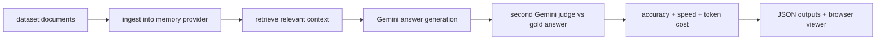

# vectorize-io/agent-memory-benchmark Dual-Chain Deep Dive

> Date: 2026-06-02. Layer: `processed/analysis`. Source queue: `analysis/value-evidence-repair-queue.json`. Evidence quality: public GitHub page only; shell GitHub API remained unreachable.

## One Sentence

`vectorize-io/agent-memory-benchmark` is a useful memory-evaluation harness because it attacks the exact failure mode our corpus keeps surfacing: once long contexts get huge, naive dumping can look competitive unless the benchmark measures agentic retrieval, cost, and speed together.

## Three Sentences

[KNOWN] The public GitHub page on 2026-06-02 shows `vectorize-io/agent-memory-benchmark` at 46 stars, 17 forks, 6 open issues, 4 pull requests, 29 commits, and a Python/Vue codebase. Source: `raw-github/vectorize-io_agent-memory-benchmark.md`.

[KNOWN] The README argues existing memory benchmarks such as LoCoMo and LongMemEval no longer separate memory architectures well once million-token context windows make brute-force context stuffing viable, so AMB adds agentic-task memory datasets and tracks accuracy, speed, and token cost together. Source: `raw-github/vectorize-io_agent-memory-benchmark.md`.

[INFERRED] The right classification is `memory benchmark / agentic retrieval evaluator`: AMB is not a self-evolving runtime, but it is a strong measurement primitive for memory layers that claim to improve agent continuity over time.

## Evidence Chain

| Link | Status | Evidence |
|---|---|---|
| Raw capture | [KNOWN] | `raw-github/vectorize-io_agent-memory-benchmark.md` refreshed on 2026-06-02 with current stars/forks/issues/PRs and updated README signals. |
| Queue row | [KNOWN] | `analysis/value-evidence-repair-queue.json` lane `deep-read-needed`, `value_score: 75.48`, `repair_score: 134.48`. |
| Project card | [KNOWN] | `projects/77-agent-memory-benchmark.md` and `site/public/reports/projects/77-agent-memory-benchmark.md`. |
| Site data | [KNOWN] | `site/src/data/projects.ts` receives a project row in this iteration. |
| API blocker | [KNOWN] | Shell `curl`/`gh` could not reach `api.github.com`; freshness is web-observed. |

## Mirror Chain

```json
{
  "node": "project.vectorize-io.agent-memory-benchmark",
  "feature": "value-evidence-repair.deep-read",
  "intent": "Judge whether AMB is merely another leaderboard or a meaningful benchmark for agent memory quality under real operating constraints.",
  "rank_decision": "promote-to-memory-benchmark-anchor",
  "rank_confidence": "medium",
  "main_tension": "Strong benchmark problem framing with explicit reproducibility vs limited ecosystem breadth and no verified rerun in this pass.",
  "why_now": "Memory remains one of the user's highest-value facets; AMB gives a cleaner benchmark story than generic memory marketing pages.",
  "next_action": "Keep it as a benchmark comparator for ReMe, Hindsight, Mem0, continuity-benchmarks, and future self-evolving memory layers."
}
```

## Working Principle



## Trust Chain

- [KNOWN] Public GitHub page metadata and README signals were re-read on 2026-06-02.
- [KNOWN] Shell GitHub API remained unreachable; all freshness claims are web-observed.
- [INFERRED] The memory-benchmark-anchor decision comes from AMB's problem framing and evaluation loop.
- [UNVERIFIED] No AMB run, dataset integrity check, Gemini judge behavior, or browser viewer flow was reproduced in this pass.
