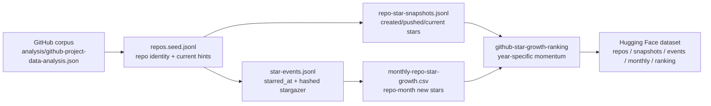

# GitHub Star Growth Database Plan

> Created: 2026-06-01. Processed plan for replacing total-star ranking with year-specific star-growth evidence and a Hugging Face-ready dataset.

## One Sentence

Total GitHub stars are historical accumulation, so the project now needs a star-history database that ranks repositories by 2026 new stars, recent velocity, coverage completeness, and evidence quality instead of raw star totals.

## Direct User Input Alignment

| User requirement | Operational requirement |
|---|---|
| `Star没有意义，因为他只是一个历史累计的过程。` | Treat total stars only as an adoption prior, never as the main ranking signal. |
| `Star新的新增Star的增长，这样其实最重要的是需要看的是2026年的这个项目是不是在当前阶段的时候。` | Build a year-specific `new_stars_2026` / current-stage momentum ranking. |
| `未来需要制作的是关于这些所有的GitHub project的历史数据挖掘。` | Mine per-repository stargazer history across the whole GitHub corpus, not only top projects. |
| `非常重要，要形成一个数据库。` | Store raw-ish events, repo snapshots, monthly aggregates, fetch logs, and ranking outputs as a repeatable database. |
| `这个data可以放到HF上。` | Shape outputs as JSONL/CSV tables that can become a Hugging Face dataset. |

## Current Implementation

| Component | Path | Role |
|---|---|---|
| Builder script | `scripts/build_github_star_history_db.mjs` | Seeds repos from `analysis/github-project-data-analysis.json`, optionally fetches GitHub stargazer events, and rebuilds aggregate ranking files. |
| Work database | `data-engine/github-star-history/` | Dataset-shaped local database: seeds, stargazer events, repo snapshots, fetch runs, monthly growth CSV, manifest. |
| Ranking JSON | `analysis/github-star-growth-ranking.json` | Machine-readable year-specific growth ranking with coverage status. |
| Ranking Markdown | `analysis/github-star-growth-ranking.md` | Human-readable growth ranking and interpretation caveats. |
| Dataset README | `data-engine/github-star-history/README.md` | Table schema, commands, Hugging Face plan, privacy boundary. |

The generated ranking deliberately separates `coverage_qualified_ranking` from `fetch_priority_backlog`. The former is the only table allowed for 2026 growth claims; the latter uses historical total stars only to decide where to spend the next GitHub API budget.

## Data Model



## Ranking Rule V1

```text
growth_quality_score =
  70% * normalized_log(new_stars_in_year)
+ 20% * normalized_log(new_stars_recent_90d)
+ 10% * coverage_score
```

Coverage score prevents fake precision:

| Coverage status | Meaning | Public-use rule |
|---|---|---|
| `complete_or_near_complete` | Event rows cover ~98%+ of current total stars. | Can be used for definitive 2026 new-star ranking. |
| `partial` | Page budget/rate limit stopped before full history. | Use only as pipeline evidence, not final rank. |
| `not_fetched` | Repo is seeded but has no event history yet. | Do not infer zero demand. |

## Initial Smoke Test

A bounded smoke test fetched `ZJU-LLM-Safety/DARWIN` through the GitHub stargazers API and rebuilt the all-repo aggregate. Current coverage after the smoke test:

| Metric | Value |
|---|---:|
| Seed repositories | 697 |
| Deduped star events | 45 |
| Repos with star events | 1 |
| Complete or near-complete repos | 1 |
| Not fetched repos | 696 |
| Coverage-qualified ranking rows | 1 |
| Fetch backlog rows | 696 |

This is intentionally not a final field ranking. It proves the database shape, `starred_at` extraction, privacy boundary, monthly aggregate, and ranking rebuild path.

## Full-Run Plan

1. Start with frontier lanes from `analysis/frontier-value-queue.md`, not alphabetic order.
2. Fetch all strict evolution repos first, then broad evolution repos, then historical baselines.
3. Use `GITHUB_TOKEN` and a high `--max-pages-per-repo`; split large incumbents into separate runs.
4. Publish only rows whose `coverage_status = complete_or_near_complete`.
5. Export JSONL/CSV to Hugging Face after adding a dataset card and license/source boundary.
6. Feed `new_stars_2026`, recent 90-day velocity, and continuity back into Evolve-AGI Index and frontier queue scores.

## Privacy Boundary

The local event database stores `starred_at`, repo id, month/year, stargazer type, and a per-repo SHA-256 hash prefix. It does not store public GitHub login names or numeric user ids, because the ranking only needs deduplicated growth counts.

## Source Boundary

- GitHub stargazer event timestamps require the REST `List stargazers` endpoint with `Accept: application/vnd.github.star+json`.
- The builder records partial/complete coverage explicitly; absent event rows are never interpreted as absent demand.
- The smoke-test data is a live public GitHub API snapshot and should be refreshed before publication.
