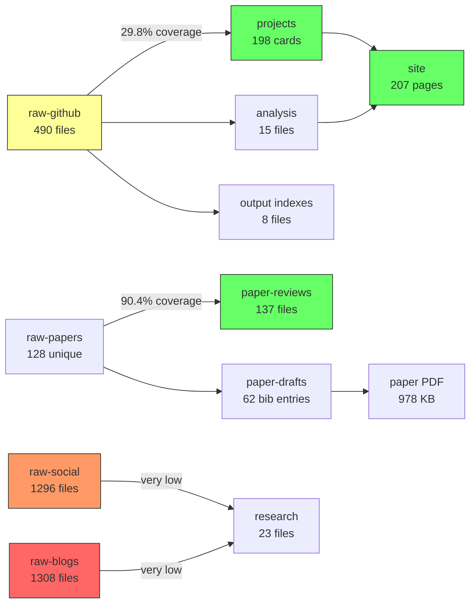

# Pipeline Audit Report

**Date**: 2026-05-25
**Auditor**: Researcher (Scout: Repo Explorer)
**Scope**: Four-layer data pipeline (raw → processed → work → results)

---

## Executive Summary

The awesome-evolution repository maintains a four-layer data pipeline covering **2,761 raw source files** across 5 raw directories, feeding into **198 project model cards**, a **22-file paper draft** (8 chapters, 62 references), and a **207-page static site**. The pipeline is functional but has significant breakpoints and quality issues that limit its value for academic publishing and systematic analysis.

**Top-line metrics**:

| Layer | Files | Status |
|-------|------:|--------|
| raw-github | 490 | 100% frontmatter, 22.2% missing timestamps |
| raw-papers | 199 (128 unique) | 70 duplicate pairs, 12 missing arXiv IDs |
| raw-social | 1,296 | 57% timestamps unknown, 37% snippet-only |
| raw-blogs | 1,308 | **97.7% fake timestamps** (collection date) |
| raw-social-rank | 468 | Strict subset of raw-social |
| analysis (processed) | 15 | READY |
| projects (work) | 220 | 29.8% raw-to-project coverage |
| paper-drafts (work) | 22 | READY, PDF built today |
| site (results) | 12 | READY, 207 pages |
| reports (results) | 1 | **CRITICAL GAP** |

---

## 1. Raw Layer Audit

### 1.1 raw-github/ (490 files)

**Frontmatter**: 100% coverage. 7 core fields present in every file: `repo`, `url`, `content_timestamp`, `time_slice`, `timestamp_source`, `collected_at`, `source`.

**Timestamp quality**:

| Status | Count | Pct |
|--------|------:|-----|
| Has date | 381 | 77.8% |
| `unknown` | 109 | 22.2% |

**Capture waves**:

| Date | Files | Pct | Description |
|------|------:|-----|-------------|
| 2026-05-20 | 346 | 70.6% | Initial bulk scrape |
| 2026-05-24 | 99 | 20.2% | Second wave (web fallback) |
| 2026-05-25 | 39 | 8.0% | Latest additions |

**Source distribution**: 89% via GitHub API (`source: github`), 11% via browser (`source: github_web`).

**Issues**:
- 2 binary files contain null bytes: `huggingface_smolagents.md`, `huggingface_agents-course.md`
- 3 multi-segment repo names break `org_repo.md` convention
- No classification tags in frontmatter — categorization relies on content keywords only

### 1.2 raw-papers/ (199 files, 128 unique papers)

**Duplicate problem**: 70 papers exist in both dash format (`2303-11366.md`, raw HTML ~8KB) and dot format (`2303.11366.md`, cleaned summary ~3KB). These are not duplicates to delete — they represent different processing stages — but they inflate counts.

**Frontmatter inconsistency**:
- Older format: `arXiv`, `title` (with `#` prefix), string dates
- Newer format (2506+): `repo`, `url`, `source`, ISO timestamps

**Coverage**: 128 unique papers spanning 2019–2026, concentrated in 2024–2025 (147/199).

**Gap**: 12 papers in `placeholder-no-arxiv.md` still lack arXiv IDs.

### 1.3 raw-social/ (1,296 files: 650 .md + 645 .json)

**Structure**: 612 numbered pairs (0001–0612, sequential, no gaps). 33 auxiliary batch files. 5 orphan .md aggregate files.

**Timestamp quality**: 42% resolved, **57% unknown**. Limits temporal analysis.

**Extraction**: 62% `ok`, 37% `fallback_snippet`. X/Twitter entries particularly affected (login-wall), yielding only 100–200 char snippets.

**Platform mix**: Hacker News (28%), X/Twitter (25%), GitHub (8%), arXiv (6%), Chinese platforms (Zhihu, Juejin, CSDN ~5%).

### 1.4 raw-blogs/ (1,308 files: 655 .md + 653 .json)

**Critical quality issue**: **97.7% of `content_timestamp` values are `2026-05-20`** (the collection date), NOT actual publication dates. The `timestamp_source` claims extraction from metadata, but values are unreliable. Only 15 entries have meaningful differentiated timestamps.

**Structure**: 650 numbered pairs (0001–0652). 2 orphan .md entries (0651, 0652) lack .json.

**Extraction**: 76% `ok`, 23% `fallback_snippet`.

### 1.5 raw-social-rank/ (468 files: 234 .md + 234 .json)

**Subset relationship**: All 228 numbered entries are a strict subset of raw-social (228/612 = 37%). This is the original seed dataset with `search_rank` metadata preserved. The remaining 384 social entries came from batch expansions.

**Quality**: Higher than raw-social overall — 50% timestamps resolved, 90% extraction `ok`.

---

## 2. Processed Layer Audit (analysis/)

**Status**: READY. 15 files, ~2.2 MB total.

**Key files**:
- `github-project-data-analysis.json` (1.7 MB): Master analysis data
- `repo-techstack-cross-analysis.csv` (124 KB): Tech stack cross-reference
- `framework-painpoint-crosswalk.md` (24 KB): Framework-to-painpoint mapping
- `self-evolution-coverage-gap-2026-05-25.md` (10 KB): Today's gap analysis

**Data lineage verified**: `github-project-data-analysis.md` correctly traces: 490 raw captures → 490 classified repos → 204 model-card projects → 79 strict evolution → 176 broad evolution. Cross-references to `output/raw-github-timestamp-index.json` and `research/repo-classification.json` are intact.

---

## 3. Work Layer Audit

### 3.1 projects/ (220 files, 198 model cards)

**Naming**: 182 use numbered prefix convention (`01-opro-...`), 16 do not. 2 non-.md auxiliary files.

**Raw-to-project coverage**:

| Metric | Value |
|--------|------:|
| raw-github repos with project card | **146 / 490 (29.8%)** |
| Project cards referencing raw-github | 143 / 193 (74.1%) |
| Project cards with GitHub URL | 191 / 193 (98.9%) |
| Project cards with no raw traceability | **77 / 220 (35.0%)** |

**This is the primary breakpoint**: 344 raw-github repos (70.2%) have no corresponding project model card. These represent unprocessed raw captures.

**Model-card quality** (sampled):
- Early cards (01–04): Chinese-language, detailed tables, pre-formal-schema
- Mid-range (~50+): Follow model-card template (Role, Working Principle, Evidence Path, Teaching Use, Limits)
- Latest entries: YAML frontmatter + structured Chinese summary

### 3.2 paper-drafts/ (22 files)

**Status**: READY. Complete 8-chapter survey paper.

**Title**: "Self-Evolving AI Agents: A Survey of Feedback-Driven Generation, Evaluation, Memory, and Self-Modification"

| Component | Status |
|-----------|--------|
| Chapters 1–7 | Substantial (311–729 lines each) |
| Ch8 Future | Lighter (177 lines) — expansion needed |
| main.pdf | Built 2026-05-25, 978 KB |
| Bibliography | 62 entries compiled |
| References | `references.bib` (13 KB) + `references-aliases.bib` (8 KB) |

### 3.3 survey/ (13 items)

**Status**: PARTIAL. Parallel Chinese-language survey, separate from paper-drafts.

| Component | Status |
|-----------|--------|
| Markdown chapters (cn) | 8 files, ~1322 lines |
| LaTeX build | `main.tex` + 9 chapter files |
| main.pdf | 592 KB, built 2026-05-25 |
| Figures | 10 items (dashboards, matrices, timelines) |
| Bibliography | **NOT compiled** — no `.bbl` file |

**Risk**: Content drift between `survey/` and `paper-drafts/` without synchronization mechanism. Both cover identical 8-chapter structure with different naming conventions.

### 3.4 Scripts (7 scripts)

| Script | Purpose |
|--------|---------|
| `generate_project_indexes.mjs` | Index generation |
| `analyze_github_project_data.mjs` | GitHub data analysis |
| `enforce_raw_timestamps.py` | Timestamp enforcement |
| `generate_blog_author_profiles.py` | Blog author profiling |
| `generate_repo_classification.py` | Repo classification |
| `generate_survey_figures.py` | Survey figure generation |
| `generate_visual_assets.mjs` | Visual asset generation |

---

## 4. Results Layer Audit

### 4.1 site/ — READY

Astro-based static site. Built 2026-05-25. 207 project pages, blog index, research section, sitemap, RSS feed. Full build pipeline functional.

### 4.2 output/ — PARTIAL

8 files: timestamp indexes (current) + curated reports. Functions as staging area but lacks polished deliverables beyond indexes.

### 4.3 reports/ — CRITICAL GAP

**1 file only** (`star-analysis-report.md`, 7.7 KB). With 220 project cards and substantial analysis, this directory should contain:
- Aggregate project reports
- Cross-validation reports (currently at repo root: `cross-validation-report.md`)
- Published analysis summaries

Most report-like content lives scattered across `analysis/`, `output/`, and root-level files.

### 4.4 latex/ — Additional pipeline entry

Contains `main.tex` + `chapters/` + `figures/`. Appears to be a third LaTeX build path (in addition to `paper-drafts/` and `survey/latex/`). Potential for confusion.

---

## 5. Data Flow Breakpoint Summary



### Critical Breakpoints (prioritized)

| # | Breakpoint | Severity | Count | Impact |
|---|-----------|----------|------:|--------|
| 1 | raw-blogs timestamps are fake | **CRITICAL** | 635/650 | Temporal analysis impossible for blogs |
| 2 | reports/ nearly empty | **CRITICAL** | 1 file | No publishable aggregated reports |
| 3 | raw-github → projects gap | **HIGH** | 344/490 repos | 70.2% of raw captures unprocessed |
| 4 | raw-social timestamps unknown | **HIGH** | 354/612 | Temporal analysis limited |
| 5 | survey/ bibliography uncompiled | **MEDIUM** | 0 bbl | Chinese survey not deliverable |
| 6 | raw-papers duplicate formats | **MEDIUM** | 70 pairs | Inflated counts, schema inconsistency |
| 7 | 2 binary raw-github files | **LOW** | 2 files | Tool compatibility issues |
| 8 | 3 LaTeX build paths | **LOW** | 3 dirs | Build confusion |

### Flow Coverage Matrix

| Raw Source | → Processed | → Work | → Results | Overall |
|-----------|:-----------:|:------:|:---------:|:-------:|
| raw-github (490) | analysis (15): **OK** | projects (146): **29.8%** | site (207): **OK** | 60% |
| raw-papers (128) | paper-reviews (113): **90.4%** | paper-drafts (62 refs): **OK** | PDF: **OK** | 95% |
| raw-social (612) | research (1 ref): **LOW** | — | — | 5% |
| raw-blogs (650) | research: **NONE** | — | — | 0% |

---

## 6. Recommendations

### Immediate (Builder can fix)

1. **Fix raw-blogs timestamps**: Run `enforce_raw_timestamps.py` or build a blog-specific timestamp resolver using URL metadata.
2. **Populate reports/**: Move `cross-validation-report.md` from root, generate aggregate reports from analysis data.
3. **Compile survey bibliography**: Run bibtex on `survey/latex/main.tex`.
4. **Clean binary files**: Remove null bytes from 2 raw-github files.

### Short-term (Research/Builder collaboration)

5. **Bridge raw-github → projects gap**: Prioritize the 344 unprocessed repos. Use `generate_repo_classification.py` to batch-process. Focus on the 186 repos mentioning evolution/self-evolution keywords first.
6. **Harmonize raw-papers schema**: Migrate all entries to the newer frontmatter format. Canonicalize on dot notation.
7. **Consolidate LaTeX paths**: Decide on one canonical build path; document the others as auxiliary.

### Medium-term (Architecture)

8. **Add classification tags to raw-github frontmatter**: Currently categorization is keyword-only. Structured tags enable programmatic downstream processing.
9. **Build raw-social → research pipeline**: Currently almost no social/blog data reaches the analysis layer. Create extraction scripts.
10. **Synchronize survey/ and paper-drafts/**: Establish explicit content mapping to prevent drift.

---

## 7. Verification Commands

```bash
# Verify pipeline integrity
node scripts/generate_project_indexes.mjs
python3 scripts/enforce_raw_timestamps.py
node scripts/analyze_github_project_data.mjs

# Verify builds
(cd paper-drafts && xelatex -interaction=nonstopmode -halt-on-error main.tex)
(cd site && npm run build)

# Count breakpoints
echo "Raw-github without project card:" && comm -23 /tmp/raw_gh_clean.txt /tmp/proj_github_repos.txt | wc -l
```

---

## 8. Known vs Inferred vs Unverified

**Known (evidence-backed)**:
- All file counts, sizes, and timestamps verified by direct filesystem inspection
- Frontmatter coverage verified by sampling + pattern matching
- Cross-reference counts verified by comm comparison
- Build status verified by file existence and timestamps

**Inferred (from patterns)**:
- raw-social-rank is the seed dataset (inferred from numbering and metadata structure)
- Survey/paper-drafts content drift risk (inferred from parallel structure)
- Binary file source (inferred: GitHub scrape artifacts)

**Unverified (needs further investigation)**:
- Actual content quality of all 490 raw-github captures (only sampled)
- Whether the 344 unprocessed raw-github repos contain valuable self-evolution content
- Whether raw-blogs timestamp resolution is feasible from available metadata
- latex/ directory relationship to other build paths
