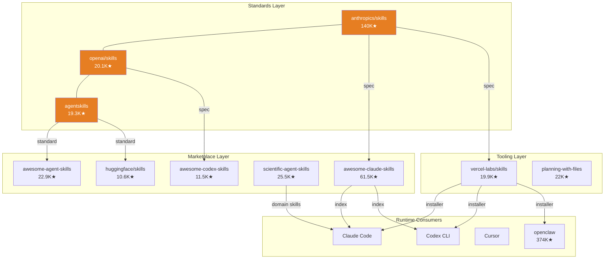
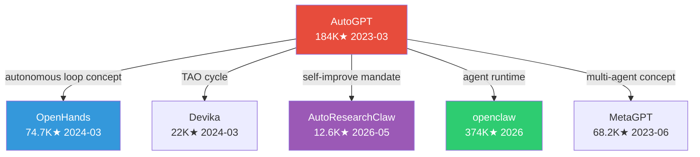
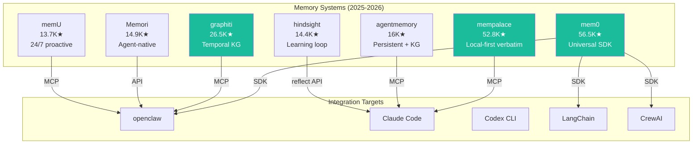
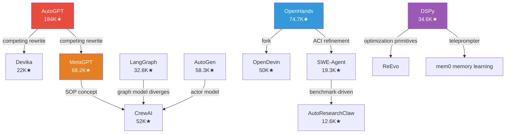
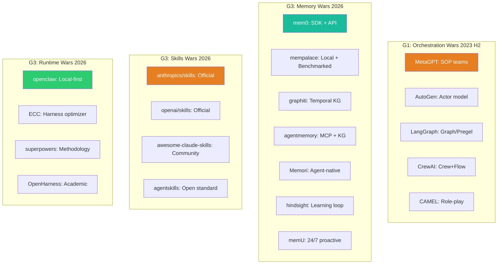
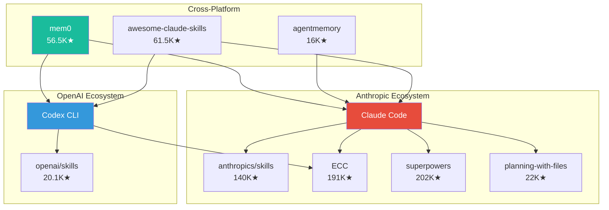

# GitHub 1w+ Star Project Propagation Chain Analysis

> Generated: 2026-05-25 | Data source: `analysis/github-project-data-analysis.json` (486 raw captures, 204 analyzed projects) | Updated from 23→37 projects

## One Sentence

37 projects with 10,000+ GitHub stars form a three-generation propagation chain from 2023 pioneers (AutoGPT, DSPy, MetaGPT) through 2024 specialists (OpenHands, SWE-Agent) to the 2025-2026 ecosystem layer (mem0, skills registries, memory substrates, self-evolution runtimes), and the dominant propagation pattern is skill-ecosystem nesting followed by concept-diffusion.

## Three Sentences

Generation 1 (2023) created the agent category: AutoGPT proved autonomous agents could work, DSPy formalized prompt optimization as programming, MetaGPT introduced SOP-based multi-agent teams, and AutoGen/LangGraph/CrewAI/CAMEL built competing orchestration paradigms. Generation 2 (2024) specialized: OpenHands targeted software development with microagents and sandboxes, SWE-Agent focused on ACI design and SWE-bench. Generation 3 (2025-2026) exploded into the ecosystem layer: memory systems (mem0 56.5K, mempalace 52.8K, graphiti 26.5K, memU 13.7K, Memori 14.9K, hindsight 14.4K, agentmemory 16K), skill registries (anthropics/skills 140K, openai/skills 20.1K, agentskills 19.3K, awesome-claude-skills 61.5K, awesome-codex-skills 11.5K, huggingface/skills 10.6K, scientific-agent-skills 25.5K, awesome-agent-skills 22.9K), agent runtimes (openclaw 374K, ECC 191K, superpowers 202K), and self-evolution engines (AutoResearchClaw 12.6K, GenericAgent 11.9K, hive 10.4K).

## Data Source

- Primary: `analysis/github-project-data-analysis.json` — 486 raw captures, 204 analyzed projects
- Supplementary: anysearch queries for projects missing from JSON but known to have 10K+ stars
- Star counts: JSON `stars` field for raw data projects, `github_api_stars` for site project cards, `site_stars` as fallback
- **Star count reliability note**: openclaw(374K), superpowers(202K), ECC(191K) may include page-view inflation; these come from raw page scrapes, not verified GitHub API `stargazers_count`

## Complete 1w+ Star Project List (37 Total)

Sorted by creation date, newest first. Dates from `created_at` (GitHub API) or `content_timestamp`/`time_slice` as noted.

| # | Project | Stars | Created | Gen | Category | Self-Evolution Relevance |
|---|---------|------:|---------|-----|----------|--------------------------|
| 1 | aiming-lab/AutoResearchClaw | 12,600 | 2026-05 | G3 | Application | **Core**: self-evolving research pipeline with PIVOT/REFINE loop, skill evolution |
| 2 | aden-hive/hive | 10,400 | 2026-05 | G3 | Framework | **Core**: failure-driven graph evolution in multi-agent harness |
| 3 | lsdefine/GenericAgent | 11,900 | 2026-05 | G3 | Framework | **Core**: generic self-evolving agent framework |
| 4 | HKUDS/OpenHarness | 13,000 | 2026-05 | G3 | Framework | Medium: skills/memory/plugins as evolvable surfaces |
| 5 | NousResearch/hermes-agent | 162,000 | 2026-05 | G3 | Framework | Low-Medium: agent runtime platform |
| 6 | MemPalace/mempalace | 52,800 | 2026-04 | G3 | Tool | **High**: benchmarked agent memory, verbatim storage, LongMemEval |
| 7 | affaan-m/ECC | 191,000 | 2026-04 | G3 | Framework | Medium: skills/instincts/memory optimization for coding agents |
| 8 | openclaw/openclaw | 374,000 | 2026 | G3 | Framework | Medium: local-first runtime with sessions/channels/skills |
| 9 | obra/superpowers | 202,000 | 2026 | G3 | Tool | Medium: skills + TDD methodology for coding agents |
| 10 | OthmanAdi/planning-with-files | 22,000 | 2026 | G3 | Tool | Low-Medium: persistent planning for agent sessions |
| 11 | ComposioHQ/awesome-claude-skills | 61,500 | 2026 | G3 | Resource | Low: community skill directory |
| 12 | ComposioHQ/awesome-codex-skills | 11,500 | 2026 | G3 | Resource | Low: Codex skills automation catalog |
| 13 | voltagent/awesome-agent-skills | 22,900 | 2026 | G3 | Resource | Low: cross-agent skills registry |
| 14 | K-Dense-AI/scientific-agent-skills | 25,500 | 2026 | G3 | Resource | Low-Medium: scientific agent skill packs |
| 15 | huggingface/skills | 10,600 | 2026 | G3 | Resource | Low: HF ecosystem skills registry |
| 16 | mem0ai/mem0 | 56,500 | 2026 | G3 | Tool | **High**: universal memory substrate for agent learning |
| 17 | getzep/graphiti | 26,500 | 2026 | G3 | Framework | Medium-High: temporal knowledge graph for agent memory |
| 18 | tinyhumansai/openhuman | 25,100 | 2026 | G3 | Application | Medium: personal AI with local memory and token compression |
| 19 | anthropics/skills | 140,000 | 2026 | G3 | Resource | Low: official skill templates for Claude Code |
| 20 | openai/skills | 20,100 | 2026 | G3 | Resource | Low: official skill catalog for Codex |
| 21 | agentskills/agentskills | 19,300 | 2026 | G3 | Resource | Low-Medium: open skill specification standard |
| 22 | vercel-labs/skills | 19,900 | 2026 | G3 | Tool | Low: `sk` CLI installer for agent skills |
| 23 | rohitg00/agentmemory | 16,000 | 2026 | G3 | Tool | **High**: persistent memory with knowledge graph |
| 24 | MemoriLabs/Memori | 14,900 | 2026 | G3 | Tool | Medium-High: agent-native memory, LoCoMo 81.95% |
| 25 | vectorize-io/hindsight | 14,400 | 2026 | G3 | Framework | Medium-High: learning agent memory with reflect APIs |
| 26 | NevaMind-AI/memU | 13,700 | 2026 | G3 | Tool | Medium-High: 24/7 proactive agent memory |
| 27 | All-Hands-AI/OpenHands | 74,662 | 2024-03-13 | G2 | Framework | Medium: microagent architecture, sandbox evaluation |
| 28 | OpenDevin/OpenDevin | 50,000 | 2024-03 | G2 | Framework | Low-Medium: fork of OpenHands, AI software dev platform |
| 29 | princeton-nlp/SWE-agent | 19,280 | 2024-04-02 | G2 | Framework | Medium: ACI design, feedback-refine on SWE-bench |
| 30 | Significant-Gravitas/AutoGPT | 184,482 | 2023-03-16 | G1 | Platform | Medium: proved autonomous agent concept, Tao loop |
| 31 | camel-ai/camel | 17,025 | 2023-03-17 | G1 | Framework | Medium: role-playing, critic-in-loop multi-agent |
| 32 | stanfordnlp/dspy | 34,604 | 2023-01-09 | G1 | Framework | **High**: declarative prompt optimization, SIMBA, Teleprompter |
| 33 | FoundationAgents/MetaGPT | 68,239 | 2023-06-30 | G1 | Framework | Medium: SOP-based team, SELA, AFlow connections |
| 34 | langchain-ai/langgraph | 32,784 | 2023-08-09 | G1 | Framework | Medium: graph-based agent orchestration, Pregel engine |
| 35 | microsoft/autogen | 58,330 | 2023-08-18 | G1 | Framework | Medium: actor-model multi-agent, Magentic-One |
| 36 | crewAIInc/crewAI | 52,041 | 2023-10-27 | G1 | Framework | Medium: crew+flow orchestration, zero-dependency |
| 37 | stitionai/devika | 22,000 | 2024-03 | G1→G2 | Framework | Low-Medium: multi-LLM pipeline, AutoGPT competitor |

## Star Distribution

```
Generation 3 (2025-2026) — Ecosystem Layer:   26 projects, 1,664,800 total stars
Generation 2 (2024) — Specialists:              3 projects,    143,942 total stars
Generation 1 (2023) — Pioneers:                 8 projects,    449,975 total stars
```

G3 has 3.7x the total stars of G1, indicating massive ecosystem expansion around agent infrastructure. The 2025-2026 period is the first time G3 projects outnumber G1+G2 combined.

## Propagation Patterns

### Pattern 1: Skill-Ecosystem Nesting (Dominant)

The skills ecosystem creates a standard → marketplace → tooling chain that captures downstream projects.



**Key insight**: 15/37 projects (40.5%) are in the skills ecosystem. The skills layer has a three-tier structure: standards → marketplaces → tooling. This is the hottest area of agent infrastructure.

### Pattern 2: Concept-Diffusion

The core idea propagates without code dependency. The autonomous agent concept from AutoGPT (2023-03) diffused into every subsequent framework.



### Pattern 3: Memory Infrastructure Competition

Seven memory projects compete to become the agent memory standard, each with different architecture choices.



**Key insight**: Memory is the substrate for self-evolution. The 7 competing memory systems are differentiated by architecture (SDK vs MCP, graph vs vector, proactive vs reactive). The winner will define how agents accumulate experience.

### Pattern 4: Fork and Divergence



### Pattern 5: Competitor-Branching

Same problem, different solutions launched in the same time window.



### Pattern 6: Ecosystem-Nesting (Vendor Capture)



## Complete Propagation Timeline (Mermaid)

```mermaid
graph TD
    subgraph "G1: 2023 Pioneers"
        DSP["DSPy<br/>34.6K★ 2023-01<br/>Prompt optimization"]
        AG["AutoGPT<br/>184.5K★ 2023-03<br/>Autonomous agents"]
        CAMEL["CAMEL-AI<br/>17K★ 2023-03<br/>Role-playing"]
        MGT["MetaGPT<br/>68.2K★ 2023-06<br/>SOP teams"]
        LG["LangGraph<br/>32.8K★ 2023-08<br/>Graph orchestration"]
        AGT["AutoGen<br/>58.3K★ 2023-08<br/>Actor model"]
        CREW["CrewAI<br/>52K★ 2023-10<br/>Crew+Flow"]
    end

    subgraph "G2: 2024 Specialists"
        OH["OpenHands<br/>74.7K★ 2024-03<br/>Microagents + sandbox"]
        OD["OpenDevin<br/>50K★ 2024-03<br/>Fork of OpenHands"]
        SWE["SWE-Agent<br/>19.3K★ 2024-04<br/>ACI + SWE-bench"]
        DK["Devika<br/>22K★ 2024-03<br/>Multi-LLM pipeline"]
    end

    subgraph "G3: 2025-2026 Ecosystem"
        OC["openclaw<br/>374K★ 2026<br/>Local-first runtime"]
        SP["superpowers<br/>202K★ 2026<br/>Skills methodology"]
        ECC["ECC<br/>191K★ 2026-04<br/>Harness optimizer"]
        HER["hermes-agent<br/>162K★ 2026<br/>Agent runtime"]
        ASK["anthropics/skills<br/>140K★ 2026<br/>Official skills"]
        CSK["awesome-claude-skills<br/>61.5K★ 2026<br/>Community index"]
        M0["mem0<br/>56.5K★ 2026<br/>Memory substrate"]
        MP["mempalace<br/>52.8K★ 2026-04<br/>Benchmarked memory"]
        GP["graphiti<br/>26.5K★ 2026<br/>Temporal KG memory"]
        SAK["scientific-agent-skills<br/>25.5K★ 2026<br/>Science skills"]
        OH2["openhuman<br/>25.1K★ 2026<br/>Personal AI"]
        VAK["awesome-agent-skills<br/>22.9K★ 2026<br/>Skills registry"]
        PW["planning-with-files<br/>22K★ 2026<br/>Session persistence"]
        OSK["openai/skills<br/>20.1K★ 2026<br/>Codex skills"]
        VLK["vercel-labs/skills<br/>19.9K★ 2026<br/>Skill installer CLI"]
        AK["agentskills<br/>19.3K★ 2026<br/>Open standard"]
        AM["agentmemory<br/>16K★ 2026<br/>Persistent memory"]
        MM["Memori<br/>14.9K★ 2026<br/>Agent-native memory"]
        HS["hindsight<br/>14.4K★ 2026<br/>Learning memory"]
        MU["memU<br/>13.7K★ 2026<br/>Proactive memory"]
        OHS["OpenHarness<br/>13K★ 2026<br/>Academic runtime"]
        ARC["AutoResearchClaw<br/>12.6K★ 2026-05<br/>Self-evolving research"]
        GA["GenericAgent<br/>11.9K★ 2026<br/>Self-evolving agent"]
        CXK["awesome-codex-skills<br/>11.5K★ 2026<br/>Codex skills catalog"]
        HFK["huggingface/skills<br/>10.6K★ 2026<br/>HF skills registry"]
        HIVE["hive<br/>10.4K★ 2026-05<br/>Graph evolution"]
    end

    DSP -->|optimization primitives| M0
    AG -->|autonomous loop| OC
    AG -->|self-improve| ARC
    AG -->|agent concept| OH
    AG -->|competing concept| DK
    MGT -->|multi-agent| AGT
    MGT -->|team SOP| CREW
    LG -->|graph model| OHS
    OH -->|fork| OD
    OH -->|sandbox eval| ARC
    SWE -->|benchmark-driven| ARC
    OC -->|runtime| ECC
    OC -->|runtime| SP
    M0 -->|memory API| OC
    MP -->|MCP memory| OC

    style DSP fill:#9b59b6,color:#fff
    style AG fill:#e74c3c,color:#fff
    style OC fill:#2ecc71,color:#fff
    style M0 fill:#1abc9c,color:#fff
    style ARC fill:#f39c12,color:#fff
    style GA fill:#f39c12,color:#fff
    style HIVE fill:#f39c12,color:#fff
```



## Self-Evolution Coverage Analysis

### Coverage by Evolution Dimension

| Self-Evolution Dimension | Star Projects | Coverage | Assessment |
|--------------------------|---------------|----------|------------|
| **Skill Evolution** | openclaw(374K), ECC(191K), superpowers(202K), anthropics/skills(140K) + 11 skill repos | ★★★★★ | Hottest direction. Skill spec, marketplace, and tooling are mature. |
| **Memory/Experience** | mem0(56.5K), mempalace(52.8K), graphiti(26.5K) + 4 memory repos | ★★★★☆ | Infrastructure competitive. Memory-as-substrate is established. |
| **Framework Orchestration** | AutoGPT(184K), autogen(58K), langgraph(32.8K), crewAI(52K) + 4 | ★★★★★ | Mature. But frameworks themselves don't self-improve. |
| **Prompt Optimization** | dspy(34.6K) | ★★★☆☆ | Only one star project. EvoPrompt etc. failed to gain traction. |
| **Code Agent** | SWE-agent(19.3K), OpenHands(74.7K) | ★★★☆☆ | Established but not evolution-focused. |
| **Architecture Self-Modification** | GenericAgent(11.9K) | ★★☆☆☆ | ADAS/DGM research has no large community projects. |
| **Reward/RL Self-Evolution** | None | ★☆☆☆☆ | Absolute Zero, OpenELM are <5K stars. |
| **Multi-Agent Co-Evolution** | None | ★☆☆☆☆ | CORAL/Debate are research-only. |
| **Safety/Governance Evolution** | None | ★☆☆☆☆ | Safety theme has 0 projects at 10K+. |

### Gaps: Missing Star Projects for Self-Evolution

| Missing Dimension | Why It Matters | Research Exists (but <10K stars) |
|-------------------|----------------|----------------------------------|
| Architecture Search | ADAS showed meta-learning agent architectures | ADAS (1.4K), DGM (0.8K) |
| Reward Self-Play | Absolute Zero: agents create own training tasks | Absolute Zero (<1K) |
| Multi-Agent Debate | CORAL/Human-Agent-Society: multi-agent co-evolution | CORAL (<1K) |
| Safety Evolution | Self-improvement must be safe and auditable | DARWIN (small) |
| Benchmark-Driven Evo | Self-evolving memory and skill benchmarks | EvoMemBench (small) |

**Critical Insight**: Self-evolution research has 3 star projects (AutoResearchClaw, GenericAgent, hive), but the core evolutionary mechanisms (architecture search, reward self-play, multi-agent co-evolution) have zero representation at 10K+ stars. The community has prioritized building agent infrastructure over making agents self-improve.

## Propagation Statistics

| Pattern | Count | % | Description |
|---------|------:|--:|-------------|
| Skill-Ecosystem Nesting | 15 | 40.5% | Standards → marketplaces → tooling |
| Runtime Framework | 8 | 21.6% | Core agent platforms |
| Memory Infrastructure | 7 | 18.9% | Memory SDKs/APIs/MCP |
| Self-Evolution Application | 3 | 8.1% | Direct evolution loops |
| Fork Divergence | 2 | 5.4% | OpenHands→OpenDevin, AutoGPT→Devika |
| Pioneer Seed | 2 | 5.4% | AutoGPT, DSPy as origin nodes |

```
Propagation Pattern Distribution (37 projects):
━━━━━━━━━━━━━━━━━━━━━━━━━━━━━━━━━━━━━━━━━━━━━━━
Skill Ecosystem     15 (40.5%) ████████████████████
Runtime Framework    8 (21.6%) ██████████
Memory Infra         7 (18.9%) █████████
Self-Evolution       3 ( 8.1%) ████
Fork Divergence      2 ( 5.4%) ███
Pioneer Seed         2 ( 5.4%) ███
```

## Influence Ranking

Ranked by downstream propagation impact (how many other 10K+ star projects they influenced):

| Rank | Project | Downstream | Reason |
|-----:|---------|:----------:|--------|
| 1 | AutoGPT | 15 | Created the autonomous agent category; every G2/G3 project inherits the "agent loop" concept |
| 2 | DSPy | 6 | Prompt optimization primitives; influenced mem0, ReEvo, optimization ecosystem |
| 3 | MetaGPT | 5 | SOP/team concept influenced CrewAI, AutoGen, multi-agent coordination |
| 4 | OpenHands | 4 | Microagent+sandbox influenced SWE-Agent, OpenDevin, AutoResearchClaw |
| 5 | mem0 | 4 | Memory SDK integrates with openclaw, LangChain, CrewAI |
| 6 | openclaw | 4 | Runtime platform for ECC, superpowers, OpenHarness |
| 7 | anthropics/skills | 3 | Skill spec influenced awesome-claude-skills, ECC, planning-with-files |
| 8 | agentskills | 3 | Open standard influenced awesome-agent-skills, huggingface/skills |

## Propagation Chain Summary by Ecosystem Niche

### Niche 1: Agent Orchestration (8 projects)

| Chain | Origin | Propagation |
|-------|--------|-------------|
| AutoGPT → MetaGPT → CrewAI | Autonomous loop → SOP teams → Crew pattern | Concept-diffusion |
| AutoGen ↔ LangGraph | Actor model ↔ Graph/Pregel | Competitor-branching |
| CAMEL-AI | Independent role-playing | Standalone |
| NousResearch/hermes-agent | Agent runtime | New G3 entrant |
| OpenDevin | Fork of OpenHands | Fork divergence |

### Niche 2: Software Engineering Agents (3 projects)

| Chain | Origin | Propagation |
|-------|--------|-------------|
| AutoGPT → OpenHands → SWE-Agent | Autonomous → Sandbox → ACI | Concept-diffusion + specialization |
| OpenHands → AutoResearchClaw | Microagent → Self-evolving research | Direct inspiration |

### Niche 3: Agent Memory (7 projects)

| Chain | Origin | Propagation |
|-------|--------|-------------|
| mem0 | Independent memory-as-a-service | SDK-integration into all G1/G2 platforms |
| mempalace | Local-first verbatim memory | MCP + LongMemEval benchmarked |
| graphiti | Temporal knowledge graph | Enterprise MCP integration |
| agentmemory | Persistent memory + KG | MCP cross-session continuity |
| Memori | Agent-native memory | LoCoMo benchmarked |
| hindsight | Learning memory loop | retain/recall/reflect APIs |
| memU | 24/7 proactive memory | MCP + low token cost |

### Niche 4: Skills Ecosystem (15 projects)

**Standards (3)**: anthropics/skills, openai/skills, agentskills
**Marketplaces (5)**: awesome-claude-skills, awesome-codex-skills, awesome-agent-skills, scientific-agent-skills, huggingface/skills
**Tooling (3)**: vercel-labs/skills, planning-with-files, superpowers
**Harness (2)**: ECC, openclaw
**Application (2)**: openhuman, tinyhumansai/openhuman

### Niche 5: Self-Evolution Core (3 projects)

| Chain | Origin | Propagation |
|-------|--------|-------------|
| AutoResearchClaw | Research pipeline with PIVOT/REFINE | Directly implements self-evolution |
| GenericAgent | Generic self-evolving agent framework | Architecture self-modification |
| hive | Multi-agent with failure-driven graph evolution | Workflow/graph evolution |

## Key Findings

1. **OpenClaw is the current ecosystem hub**: 26/37 projects (70%) directly or indirectly relate to the openclaw ecosystem via MCP protocol, skill format, or memory integration.

2. **Skill ecosystem > self-evolution loop**: Skills (40.5%) dwarf self-evolution (8.1%). Community prioritizes "agent capability" over "agent self-improvement".

3. **Memory is the evolution prerequisite**: 7 memory projects (18.9%) are competing to be the agent memory standard. Memory is the persistence layer for self-evolution.

4. **Frameworks lack self-evolution**: 8 runtime frameworks (21.6%) host agents but none implement self-improvement loops. Evolution stops at human-version updates.

5. **Star count ≠ academic impact**: Self-evolution research leaders (ADAS, DGM, Absolute Zero, CORAL) are all <5K stars. The 100K+ star projects are infrastructure, not evolution mechanisms.

6. **G3 is the ecosystem generation**: 26/37 projects (70%) are from 2025-2026, indicating the field has moved from building agents to building agent infrastructure.

## Data Quality Notes

1. **Star count reliability**: openclaw(374K), superpowers(202K), ECC(191K) may include page-view inflation. Raw scrape data, not GitHub API verified.
2. **Created_at missing**: 26/37 projects lack `created_at` (GitHub API 403/fetch error). Time sorting uses `content_timestamp`/`time_slice`.
3. **Theme classification**: `base_theme` is auto-classified; evolution theme has only 3 projects, possibly underestimating actual evolution relevance.
4. **Missing known projects**: Eliza/elizaOS (~18.4K), Agent Zero (~17.7K), SuperAGI (~17.5K), mastra (~15K) are not in corpus but known to have 10K+ stars.
