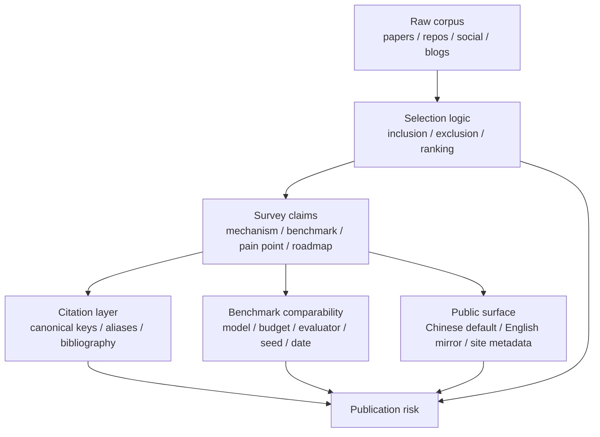

# Survey Quality Audit / Survey 质量审计

<!-- @sm:node survey-quality-audit
Scope: processed audit for Chinese survey logic, citation hygiene, selection analysis, evidence chain, benchmark comparability, and bilingual drift.
Inputs: survey/latex/*, survey/review-report.md, paper-drafts/COMPLETION_LEDGER.md, analysis/value-lsh-index.md, analysis/value-evidence-repair-queue.md.
Outputs: survey repair gates, acceptance checks, and publication risk map.
Verification: bibtex/xelatex survey build; duplicate-title scan over paper-drafts/main.bbl and survey/latex/main.bbl; node scripts/generate_project_indexes.mjs.
-->

## 一句话

[KNOWN] 重复引用只是表层信号；当前 survey 的主要风险是引用、选择逻辑、证据链、benchmark 可比性和中英镜像没有形成同一套发布门禁。 — Source: `survey/latex/main.tex`, `survey/review-report.md`, `paper-drafts/COMPLETION_LEDGER.md`

## 三句话

1. [KNOWN] 中文 survey 曾在生成后的 `main.bbl` 中出现多组同题名重复引用，说明 BibTeX key、章节引用和别名表没有被统一治理。 — Source: `survey/latex/main.bbl`
2. [KNOWN] 现有 review/report 与 completion ledger 已经提示 placeholder review、citation alias、local-material claims 等问题，但这些问题还没有变成强制门禁。 — Source: `survey/review-report.md`, `paper-drafts/COMPLETION_LEDGER.md`
3. [INFERRED] 下一步不能只继续补文字，而要把“为什么选这些论文/项目、为什么这些 benchmark 可比较、每个判断追溯到哪里”写成表格化证据链。

## 五句话

1. [KNOWN] Survey 的公开价值来自同一条数据流：raw papers/projects/social/blogs -> processed analysis/wiki -> paper/survey -> site/SEO/results。 — Source: `CONTENT_INDEX.md`, `docs/indexes/master-index.md`
2. [KNOWN] 当前仓库已经有 value LSH、frontier repair queue、benchmark matrix、paper review coverage 等 processed 产物，可以支持更严格的选择分析。 — Source: `analysis/value-lsh-index.md`, `analysis/value-evidence-repair-queue.md`, `analysis/code-evolution-benchmark-matrix.md`
3. [KNOWN] Chinese survey chapters contain benchmark claims, representative-system claims, and local-material claims that must be normalized by source, evaluation budget, model, date, evaluator, and contamination risk before publication. — Source: `survey/latex/chapters/ch5-evaluation.tex`, `survey/latex/chapters/ch4-systems-expanded.tex`
4. [INFERRED] 选择题分析的核心不是“列更多系统”，而是给每个入选对象一张 scorecard：入选理由、排除理由、证据等级、是否 2026 活跃、是否有真实 self-evolution loop、是否可复现。
5. [INFERRED] 中英稿应共享同一组 canonical claims 和 source IDs；中文可以是默认入口，英文可以本地化表达，但不能变成另一篇独立论文。

## Failure DAG

## Ranked Findings

| Rank | Finding | Evidence | Required Repair |
|---:|---|---|---|
| P0 | Citation aliases can create repeated bibliography entries even when the prose looks normal. | `survey/latex/main.bbl` had duplicate-title groups before alias cleanup. | Keep one canonical key per title, remove duplicate source BibTeX entries, and scan generated `.bbl` before publication. |
| P0 | Selection logic is still mostly narrative rather than auditable. | Chapters use representative systems, local materials, selected examples, and benchmark tables without one shared inclusion/exclusion matrix. | Add a survey selection matrix covering raw collected, analyzed subset, evolution-related subset, timeline, rank reason, and exclusion reason. |
| P1 | Benchmark claims are not all comparable by default. | Evaluation chapters mix pass@1, accuracy, resolved rate, self-play reward, environment score, and project activity. | Add benchmark run-cards with metric, evaluator, model, budget, seed/statistics, contamination risk, and source. |
| P1 | Evidence chain weakens when prose says local corpus, local materials, project materials, or reported without a source ID. | Similar phrases appear across paper/survey chapters. | Replace with source file, raw ID, paper key, project slug, or mark `[UNVERIFIED]`. |
| P1 | Project choice logic can drift between old star ranking and current value/2026-growth logic. | Current processed layer uses value LSH, frontier queue, and star-growth analysis. | Reconcile survey examples against value facets, 2026/new-star growth, and evidence repair queue. |
| P1 | Chinese survey and English paper can diverge into two independent narratives. | They have separate TeX trees, bibliography files, and expanded chapters. | Maintain a bilingual claim mirror: claim ID, Chinese wording, English wording, source, and publication status. |
| P2 | Placeholder or sparse review artifacts must not be counted as completed evidence. | Existing review report flags sparse/placeholder review risks. | Exclude placeholder reviews from canonical citations until upgraded or mark gap-control explicitly. |
| P2 | Layout warnings reveal dense tables that are hard to read even when the build succeeds. | XeLaTeX emits many underfull/overfull table and paragraph warnings. | Convert long tables into smaller scorecards or appendix tables before final publication. |

## Repair Gates

| Gate | Must Pass | Suggested Check |
|---|---|---|
| Citation gate | Generated English and Chinese bibliographies have zero duplicate-title groups. | Scan `paper-drafts/main.bbl` and `survey/latex/main.bbl`. |
| Source-Bib gate | Survey BibTeX sources do not retain duplicate titles that can be reintroduced by future citations. | Scan `survey/latex/references*.bib`. |
| Selection gate | Every representative system has inclusion reason, exclusion boundary, source, date, and evidence rank. | Add a selection matrix under `analysis/` or `survey/latex/appendix`. |
| Evidence gate | No public claim relies only on local corpus/materials/project materials wording. | `rg -n "local corpus|local materials|project materials|reported|selected" survey paper-drafts analysis`. |
| Benchmark gate | Benchmark comparisons state model, budget, metric, evaluator, variance/statistics, and contamination risk. | Convert evaluation tables into run-card rows. |
| Bilingual gate | Chinese default and English mirror share canonical claim IDs, sources, and limitations. | Compare README/site/paper/survey claim map before publish. |

## Immediate Status

| Item | Status | Note |
|---|---|---|
| Chinese survey generated bibliography duplicates | Fixed | `survey/latex/main.bbl` now scans as zero duplicate-title groups after BibTeX/XeLaTeX rebuild. |
| English paper generated bibliography duplicates | Clean | `paper-drafts/main.bbl` scans as zero duplicate-title groups. |
| Survey source BibTeX duplicate titles | Fixed in active source set | Duplicate alias definitions were removed or normalized; keep this check in publication QA. |
| Logic and selection audit | Open | Needs a selection matrix, not only prose edits. |
| Benchmark comparability audit | Open | Needs run-card normalization for major benchmark claims. |
| Bilingual claim mirror | Open | Needs claim IDs shared across Chinese survey, English paper, README/site, and SEO pages. |

## Acceptance Checklist

- [x] Normalize duplicate citation keys in `survey/latex/chapters/*.tex`.
- [x] Remove duplicate active alias entries from `survey/latex/references-aliases.bib`.
- [x] Remove unused duplicate source entries from `survey/latex/references.bib`.
- [x] Rebuild Chinese survey with BibTeX and XeLaTeX.
- [x] Confirm duplicate-title groups are zero for generated `paper-drafts/main.bbl` and `survey/latex/main.bbl`.
- [ ] Add a selection matrix that explains which papers/projects were included, excluded, and why.
- [ ] Add benchmark run-cards for high-impact claims in Chapter 5.
- [ ] Replace weak local-material wording with source IDs or `[UNVERIFIED]`.
- [ ] Add a bilingual claim mirror before public release.
