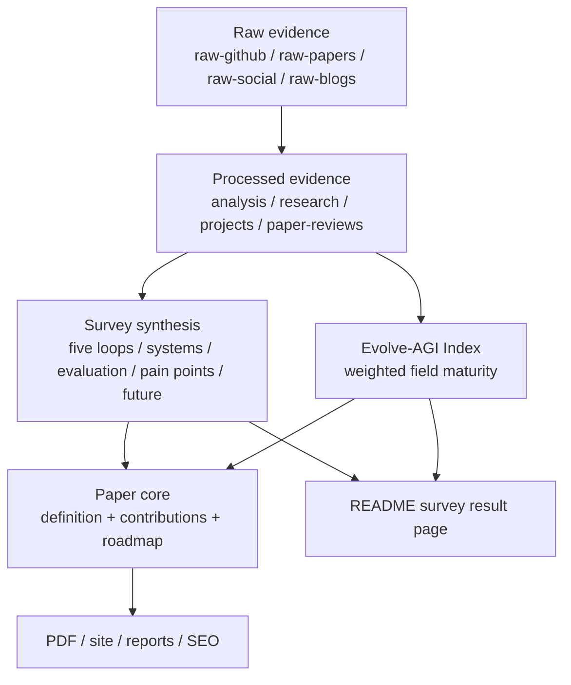

# Survey Resource Spark / Survey 资源重组与核心火花

<!-- @sm:node survey-resource-spark
Scope: processed synthesis for README-as-survey, paper core, and Evolve-AGI Index integration.
Inputs: raw/material indexes, analysis/evolve-agi-index.md, paper-drafts/*, survey/latex/*, work/wiki/*.
Outputs: README.md, README-ZH.md, README-EN.md, paper-drafts/ch1-intro.tex, paper-drafts/ch8-future.tex, work/wiki/synthesis/survey-spark-evolve-agi-core.md.
Verification: node scripts/generate_project_indexes.mjs; node scripts/generate-wiki-index.mjs; (cd site && npm run build); (cd paper-drafts && xelatex -interaction=nonstopmode -halt-on-error main.tex).
-->

## 一句话

[KNOWN] README 应从 Awesome 全量清单转为 Survey 成果入口，Survey 的新 Spark 是把 self-evolution 定义为可审计、可验证、可回滚的 controlled improvement system，并把 Evolve-AGI Index 纳入论文核心。 — Source: `README.md`, `analysis/evolve-agi-index.md`, `paper-drafts/ch1-intro.tex`

## 三句话

1. [KNOWN] 本仓库已有 raw、processed、work、results 四层索引，因此 README 不必继续承载全量表格，而应承载最高价值的 survey 判断。 — Source: `docs/indexes/master-index.md`, `CONTENT_INDEX.md`
2. [KNOWN] Evolve-AGI Index 已经有权重、benchmark 输入、趋势快照和网站页面，应从结果模块提升为论文贡献和路线图中的测量脊柱。 — Source: `analysis/evolve-agi-index.md`, `reports/evolve-agi-index-trend.json`, `site/src/data/evolveAgiIndex.ts`
3. [INFERRED] Survey 背后的“Spark”不是再收集更多链接，而是把所有资源重新压到同一组问题上：改了什么、反馈是什么、谁验证、如何保留、能否迁移、如何回滚。

## 五句话

1. [KNOWN] 当前 master index 显示仓库已有 raw GitHub captures、classified repositories、project/model-card reports、paper reviews、public reports 和 PDF 输出。 — Source: `docs/indexes/master-index.md`
2. [KNOWN] 论文主稿已经把 self-evolution 定义为 feedback-driven modification over prompts, memory, tools, code, workflows, curricula, and weights。 — Source: `paper-drafts/main.tex`, `paper-drafts/ch1-intro.tex`
3. [KNOWN] Evolve-AGI Index 使用 benchmark performance、loop strength、evidence chain、transfer verification、implementation access、field momentum 和 governance readiness 七个信号。 — Source: `analysis/evolve-agi-index.md`
4. [INFERRED] 因此 README 的最佳形态是 survey result page：先给压缩判断，再给资源 DAG、论文主线、AGI index、证据边界和验证命令。
5. [INFERRED] 后续新增资源应优先影响 processed/wiki/paper，然后由 README 和网站展示，不再把 README 变回不可维护的长清单。

## Resource DAG

## New Spark

| Layer | Spark question | Why it matters | Evidence |
|---|---|---|---|
| Mechanism | What changes inside the system? | Prevents treating static orchestration as self-evolution. | `paper-drafts/ch1-intro.tex` |
| Feedback | What signal drives change? | Weak feedback creates weak or harmful evolution. | `paper-drafts/ch5-evaluation.tex` |
| Verification | Who approves the change? | Independent evaluation is the boundary between progress and Goodhart. | `analysis/evolve-agi-index.md` |
| Retention | How does the change persist? | Memory, archive, lineage, and rollback distinguish accumulation from drift. | `paper-drafts/ch8-future.tex` |
| Governance | What must remain stable? | User intent, safety policy, privacy, cost, and auditability are product trust boundaries. | `paper-drafts/ch7-painpoints.tex` |

## Evolve-AGI Index As Core

[KNOWN] The current formula is `EAI = sum(signal_score * signal_weight)` with weights 18/20/18/14/12/10/8 across benchmark, loop, evidence, transfer, access, momentum, and governance. — Source: `analysis/evolve-agi-index.md`

[KNOWN] The 2026-06-01 trend snapshot reports score `72.9`, benchmark score `80.1`, strict repos `93`, broad repos `200`, and analyzed public-report records `239` in the trend input. — Source: `reports/evolve-agi-index-trend.json`

[INFERRED] In the paper, the index should be framed as a field maturity instrument: it operationalizes the survey thesis that self-evolution must be measured as a controlled system process rather than a single leaderboard result.

## README Implication

The README should preserve four things and drop one old habit:

| Preserve | Meaning |
|---|---|
| Layered compression | 一句话、三句话、五句话 first. |
| Visual DAG | Show raw -> processed -> survey -> index -> paper/site before long prose. |
| Evidence boundary | Mark [KNOWN] and [INFERRED] claims and link to source files. |
| Verification path | Tell agents which scripts/builds refresh indexes, paper, and site. |
| Drop | Do not duplicate the full generated GitHub/paper/project tables in README. |

## Next Checks

- [x] Keep Evolve-AGI Index snapshots append-only through the 2026-06-01 corpus-sync point.
- [ ] Add AGI-index language to paper abstract or contribution section when the index becomes stable enough for publication.
- [ ] Consider a compact EAI table in the appendix if reviewers ask for metric reproducibility.
- [ ] Keep README-ZH and README-EN aligned after survey spine changes.
