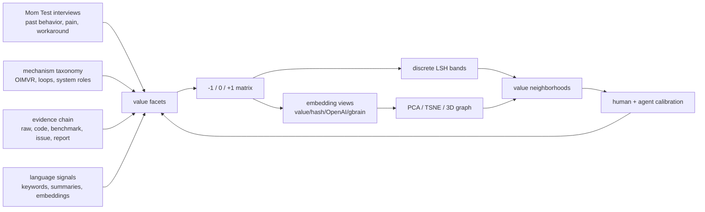
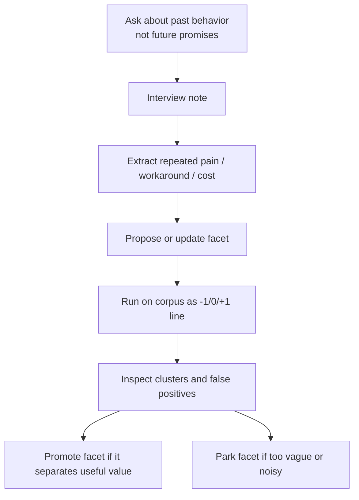

# Value LSH Classification System

> Created: 2026-06-01. This is the durable design note for the new value-facet classification system behind `analysis/value-lsh-index.md`.

## One Sentence

Value LSH is a new classification system: it turns user-value facets into discrete separating lines, hashes those lines for fast comparison, and keeps embedding/TSNE/gbrain-style semantic graphs as parallel views rather than replacements for evidence.

## Three Sentences

The old bottleneck was not collection volume; it was that projects, papers, social posts, and blogs were not being compared across the same value dimensions. The new system starts with `-1/0/+1` facet judgements because discrete LSH can quickly traverse the whole corpus and reveal neighborhoods before expensive deep reading. Embeddings, OpenAI vectors, gbrain graph memory, PCA/TSNE, and 3D graph views are second opinions: they show semantic shape, while the facet matrix keeps every value decision auditable.

## Five Sentences

1. The classification unit is no longer just "repo category" or "paper topic"; it is a value facet such as usability, verifier strength, retained improvement, rollback, current momentum, or user demand.
2. Each facet has a granularity level: coarse axes explain the map, mid-level facets become LSH dimensions, and fine probes point to evidence in raw or processed files.
3. Mom Test interviews are a first-class source of facets because they reveal what users actually cared about in past behavior, not what agents guessed was important.
4. Language/taxonomy/embedding signals can propose new facets, but a facet only becomes durable when it has a definition, evidence source, and failure mode.
5. The system iterates: every run updates the matrix, hashes, clusters, 3D projection, changed-item manifest, and next review queue.

## Why This Is A New Classification System

Classic classification asks, "Which bucket does this item belong to?" Value LSH asks, "Across many value lines, which side does this item fall on, and what else shares that local pattern?"

## Facet Sources

| Source | What it contributes | Example facet |
|---|---|---|
| Mom Test interviews | Demand-side value from observed past behavior | `user_need_fit`, `product_usability`, `cost_or_reliability_pain` |
| Mechanism taxonomy | Self-evolution structure | `self_evolution_loop_fit`, `mutable_artifact_clear`, `retention_or_memory` |
| Evidence chain | Auditability and trust | `evidence_chain_complete`, `verifier_or_benchmark`, `implementation_runnable` |
| GitHub/star growth | Current momentum without over-trusting total stars | `timestamp_freshness`, `continuity_active`, `star_growth_current` |
| Language signals | Cheap recall for weakly structured materials | keyword-triggered provisional facets |
| Embeddings/gbrain | Semantic neighborhoods and cross-source graph memory | embedding cluster labels and graph-neighbor proposals |
| Negative evidence | Things that look valuable but are not yet proven | `hype_without_evidence`, `stale_or_unknown_metadata` |

## Granularity Rule

| Level | Role | Example |
|---|---|---|
| L0 axis | Reader-facing map | "Can it run?", "Does it improve itself?", "Is there proof?" |
| L1 facet | LSH dimension | `implementation_runnable`, `verifier_or_benchmark` |
| L2 probe | Evidence detector | local tests/evals, benchmark words, issue/resource signal |
| L3 citation | Trust chain | raw file path, model card, GitHub metadata, interview note |

Coarse axes are for explanation. L1 facets are for hashing. L2 probes can be noisy and iterative. L3 citations are what prevent the classifier from becoming vibe-ranking.

## Embedding And Graph Modes

The current implementation keeps embedding modes separate from LSH:

| Mode | Script support | Purpose |
|---|---|---|
| `value` embedding | implemented | Uses the discrete value vector itself as an embedding; fastest and fully auditable. |
| `hash` embedding | implemented | Uses deterministic lexical hashing from source text; useful without API keys. |
| `openai` embedding | implemented as optional provider | Uses an OpenAI-compatible embeddings endpoint when `OPENAI_API_KEY` is set; base URL is configurable with `OPENAI_BASE_URL` or `--openai-base-url`. |
| `gbrain` embedding | implemented as optional provider | Reads `provider_base_urls["openai:embedding"]` from `~/.gbrain/config.json`, defaults to `text-embedding-3-large`, and still requires the key through environment variables. |
| `gbrain` graph adapter | planned interface | Store nodes/edges/facets in a graph memory layer and feed back discovered neighborhoods. |
| PCA projection | implemented | Full-corpus 3D graph export. |
| TSNE projection | implemented | Better nonlinear neighborhood display for samples or high-value subsets; full all-corpus TSNE should be run carefully because naive TSNE is O(n²). |

## Current Implementation

| Layer | Path | Meaning |
|---|---|---|
| Work script | `scripts/build_value_lsh_index.mjs` | Builds facet matrix, LSH signatures, buckets, clusters, and incremental manifest. |
| Work script | `scripts/build_value_embedding_projection.mjs` | Builds value/hash/OpenAI embeddings, PCA/TSNE 3D points, and embedding clusters. |
| Work data | `data-engine/value-lsh-index/` | Matrix, signatures, buckets, clusters, projection, cache, manifest. |
| Processed output | `analysis/value-lsh-index.md/json` | Human-readable summary and machine-readable top candidates/clusters. |
| 3D graph data | `analysis/value-lsh-graph-3d.json` | Nodes with x/y/z, value class, embedding cluster, and source refs. |

## Incremental Rule

Each material receives a fingerprint from the tag version, local source hash, frontier score, and star-growth signal. When a new run happens, unchanged rows remain cheap; added or changed rows drive the next review queue. If the facet taxonomy changes, the tag version changes and the system intentionally recomputes the matrix.

## Mom Test Facet Loop

The important point is that user interviews do not merely produce quotes. They produce separating lines. If multiple users keep paying time or money for a workaround, that behavior becomes a stronger value facet than an agent-invented category.

## Trust Chain

- [KNOWN] The first generated all-source run scanned GitHub, raw papers, raw social/X, ranked social, and raw blogs without editing raw files. Source: `analysis/value-lsh-index.json`.
- [KNOWN] The implementation writes a changed-item manifest to `data-engine/value-lsh-index/manifest.json`.
- [KNOWN] The 3D graph export currently supports full-corpus PCA and optional TSNE through `scripts/build_value_embedding_projection.mjs`.
- [KNOWN] The embedding projection script supports offline value/hash embeddings plus OpenAI-compatible `openai` and `gbrain` providers without storing API keys. Source: `scripts/build_value_embedding_projection.mjs`.
- [INFERRED] OpenAI embeddings and gbrain-style graph memory should be treated as semantic-neighborhood proposal systems, not as final value judges.
- [UNVERIFIED] Mom Test interview notes are not yet stored as structured facet inputs in this repository; the next iteration should add `work/interviews/` or an equivalent private/local evidence path.
