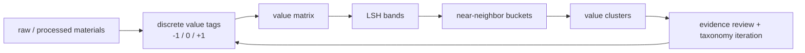

# Value LSH Index

> Generated: 2026-06-01T16:54:33.809Z. Discrete value-tag LSH index for GitHub projects, papers, social/X captures, and blogs.

## One Sentence

Value LSH turns comparison into a fast discrete scan: each material gets a `-1/0/+1` value vector, the vector is split into local hash bands, and similar value neighborhoods become clusters for deeper evidence review.

## Three Sentences

This run scanned 2206 materials across GitHub, papers, social/X, and blogs, then generated 168 non-empty LSH buckets and 3 clusters. It does not pretend the hash is the final truth: the hash only finds near-neighbors, while the value score and evidence refs keep the ranking auditable. Incremental state is tracked in `data-engine/value-lsh-index/manifest.json`: 0 added, 0 changed, 0 removed, 2206 unchanged versus the previous run.

## Why Discrete LSH

LSH works well here because the first useful comparison is not a delicate continuous score; it is a set of separating lines. For each value line, the material is placed on `+1` evidence-present, `0` unknown/neutral, or `-1` counter-signal/risk. Repeating many such lines creates a sparse signature, and shared local bands quickly answer "what else looks like this?" before humans or agents spend expensive deep-reading time.

## Input Deduplication

`raw-social-rank` is treated as a ranked seed subset, not a second corpus. Matching files are folded into the canonical `raw-social` row with `evidence_refs.rank_seed = true` and `alternate_source_paths`; support files such as `README.md`, `raw-social-rank-index.md`, and `batch_*.md` are excluded from the material count.

## Run Summary

| metric | value |
| --- | --- |
| materials | 2206 |
| value tags | 26 |
| LSH buckets | 168 |
| clusters | 3 |
| candidate pairs scanned | 63849 |
| accepted pairs | 54331 |
| broad buckets skipped | 27 |
| tag version | 19810f296115 |

## Type Counts

| type | count |
| --- | ---: |
| github | 704 |
| blog | 655 |
| social | 650 |
| paper | 197 |

## Value Class Counts

| class | count |
| --- | ---: |
| needs-review | 1055 |
| high-value-candidate | 855 |
| low-signal-or-risk | 296 |

## Class Boundary

- `high-value-candidate`: value score >= 68 and no more than one negative contribution line.
- `needs-review`: mixed or incomplete evidence that should stay in the comparison pool.
- `low-signal-or-risk`: value score <= 58 or at least three negative contribution lines; this means current-priority evidence is weak or risky, not that the material is permanently useless.

## Top High-Value Candidates

| rank | material | type | score | confidence | class | source |
| ---: | --- | --- | ---: | --- | --- | --- |
| 1 | [AgentEvolver](https://github.com/modelscope/AgentEvolver) | github | 88.54 | 84.62 | high-value-candidate | raw-github/modelscope_agentevolver.md |
| 2 | [CUGA Agent](https://github.com/cuga-project/cuga-agent) | github | 87.58 | 80.77 | high-value-candidate | raw-github/cuga-project_cuga-agent.md |
| 3 | 0166 cloud tencent com AI 100 | social | 87.26 | 84.62 | high-value-candidate | raw-social/0166-cloud-tencent-com-AI-100.md |
| 4 | 0171 36kr com 7 GPU 36 | social | 87.26 | 84.62 | high-value-candidate | raw-social/0171-36kr-com-7-GPU-36.md |
| 5 | [Yunjue Agent](https://github.com/YunjueTech/Yunjue-Agent) | github | 87.26 | 80.77 | high-value-candidate | raw-github/yunjuetech_yunjue-agent.md |
| 6 | [EvoAgentX](https://github.com/EvoAgentX/EvoAgentX) | github | 86.94 | 80.77 | high-value-candidate | raw-github/evoagentx_evoagentx.md |
| 7 | [LLaMEA](https://github.com/XAI-liacs/LLaMEA) | github | 86.94 | 80.77 | high-value-candidate | raw-github/xai-liacs_llamea.md |
| 8 | 0176 36kr com Anthropic Meta 36 | social | 86.31 | 80.77 | high-value-candidate | raw-social/0176-36kr-com-Anthropic-Meta-36.md |
| 9 | 0178 36kr com Skills Skill Agent 36 | social | 86.31 | 80.77 | high-value-candidate | raw-social/0178-36kr-com-Skills-Skill-Agent-36.md |
| 10 | [Tiermem](https://github.com/FreedomIntelligence/Tiermem) | github | 86.31 | 76.92 | high-value-candidate | raw-github/freedomintelligence_tiermem.md |
| 11 | [AI Agent Benchmark](https://github.com/murataslan1/ai-agent-benchmark) | github | 86.31 | 76.92 | high-value-candidate | raw-github/murataslan1_ai-agent-benchmark.md |
| 12 | Reflexion: Language Agents with Verbal Reinforcement Learning | paper | 86.31 | 76.92 | high-value-candidate | raw-papers/2303-11366.md |
| 13 | Raw Papers Classification Index | paper | 85.99 | 84.62 | high-value-candidate | raw-papers/classification-index.md |
| 14 | 0113 CSDN 12 | social | 85.67 | 80.77 | high-value-candidate | raw-social/0113-CSDN-12.md |
| 15 | [hermes2anti](https://github.com/swapedoc/hermes2anti) | github | 85.67 | 76.92 | high-value-candidate | raw-github/swapedoc_hermes2anti.md |
| 16 | [AI Research SKILLs](https://github.com/Orchestra-Research/AI-research-SKILLs) | github | 85.35 | 76.92 | high-value-candidate | raw-github/orchestra-research_ai-research-skills.md |
| 17 | Agentic Context Engineering: Evolving Contexts for Self-Improving Language Models | paper | 85.35 | 73.08 | high-value-candidate | raw-papers/2510-04618.md |
| 18 | [openevolve](https://github.com/algorithmicsuperintelligence/openevolve) | github | 85.03 | 76.92 | high-value-candidate | raw-github/algorithmicsuperintelligence_openevolve.md |
| 19 | 0086 Zhihu Agent Agent | social | 84.71 | 76.92 | high-value-candidate | raw-social/0086-Zhihu-Agent-Agent.md |
| 20 | 0136 segmentfault com Agentic AI SegmentFault | social | 84.71 | 76.92 | high-value-candidate | raw-social/0136-segmentfault-com-Agentic-AI-SegmentFault.md |

## Risk / Contradiction Queue

| rank | material | type | score | negative tags | confidence | class | source |
| ---: | --- | --- | ---: | --- | --- | --- | --- |
| 1 | [smol-developer](https://github.com/smol-ai/developer) | github | 54.46 | 4 | 46.15 | low-signal-or-risk |  |
| 2 | [agentgpt](https://github.com/reworkd/AgentGPT) | github | 58.6 | 4 | 53.85 | low-signal-or-risk |  |
| 3 | [webarena](https://github.com/web-arena-x/webarena) | github | 58.6 | 4 | 53.85 | low-signal-or-risk |  |
| 4 | [CoML](https://github.com/microsoft/CoML) | github | 58.92 | 4 | 53.85 | low-signal-or-risk |  |
| 5 | [OpenELM](https://github.com/carperai/openelm) | github | 59.24 | 4 | 53.85 | low-signal-or-risk |  |
| 6 | [openagents](https://github.com/xlang-ai/OpenAgents) | github | 59.24 | 4 | 53.85 | low-signal-or-risk |  |
| 7 | [FunSearch](https://github.com/google-deepmind/funsearch) | github | 59.55 | 4 | 53.85 | low-signal-or-risk |  |
| 8 | [OPRO](https://github.com/google-deepmind/opro) | github | 59.55 | 4 | 53.85 | low-signal-or-risk |  |
| 9 | [bisheng](https://github.com/dataelement/bisheng) | github | 59.87 | 4 | 53.85 | low-signal-or-risk |  |
| 10 | [AgentBench](https://github.com/THUDM/AgentBench) | github | 61.78 | 4 | 61.54 | low-signal-or-risk |  |
| 11 | [ADAS](https://github.com/ShengranHu/ADAS) | github | 61.78 | 4 | 57.69 | low-signal-or-risk |  |
| 12 | [flowise](https://github.com/FlowiseAI/Flowise) | github | 62.74 | 4 | 61.54 | low-signal-or-risk |  |
| 13 | [ag2](https://github.com/ag2ai/ag2) | github | 64.33 | 4 | 65.38 | low-signal-or-risk |  |
| 14 | [litellm](https://github.com/BerriAI/litellm) | github | 64.33 | 4 | 65.38 | low-signal-or-risk |  |
| 15 | [chainlit](https://github.com/Chainlit/chainlit) | github | 64.33 | 4 | 65.38 | low-signal-or-risk |  |
| 16 | [ollama](https://github.com/ollama/ollama) | github | 64.33 | 4 | 65.38 | low-signal-or-risk |  |
| 17 | [cheshire-cat](https://github.com/cheshire-cat-ai/core) | github | 64.97 | 4 | 65.38 | low-signal-or-risk |  |
| 18 | [open-webui](https://github.com/open-webui/open-webui) | github | 64.97 | 4 | 65.38 | low-signal-or-risk |  |
| 19 | [AutoGen](https://github.com/microsoft/autogen) | github | 65.29 | 4 | 69.23 | low-signal-or-risk |  |
| 20 | [e2b](https://github.com/e2b-dev/e2b) | github | 65.29 | 4 | 65.38 | low-signal-or-risk |  |

## Largest Value Clusters

| cluster | size | score avg | types | top tags | representatives |
| --- | ---: | ---: | --- | --- | --- |
| vlsh-0001 | 1524 | 71.52 | github:647, paper:197, social:415, blog:265 | +local_code_or_artifact, +timestamp_freshness, +current_frontier_signal, +mutable_artifact_clear, +community_momentum, +product_usability, +open_source_reuse, +implementation_runnable | AgentEvolver; CUGA Agent; Yunjue Agent |
| vlsh-0002 | 3 | 63.27 | social:3 | +current_frontier_signal, +implementation_runnable, +local_code_or_artifact, +product_usability, -evidence_chain_complete, +timestamp_freshness, +open_source_reuse, +hype_without_evidence | 0194 Linux do agent LINUX DO; 0251 Hacker News DeepSeek and Tsinghua Developing Self Improving AI Models; 0334 Hacker News Crewai Raises 18M But Are AI Agents Ready for Prime Time |
| vlsh-0003 | 2 | 64.33 | blog:2 | +current_frontier_signal, +self_evolution_loop_fit, +implementation_runnable, +local_code_or_artifact, +product_usability, -evidence_chain_complete, +timestamp_freshness, +community_momentum | 0190 36Kr 7 GPU 36; 0425 Tencent Cloud Dev |

## Largest LSH Buckets

| bucket | size | band | features | chars |
| --- | ---: | --- | --- | --- |
| v0:b4:421658a47e32aadc | 904 | 4 | user_need_fit, compare_anchor_baseline | +0 |
| v0:b1:ffab79b53e3e2b24 | 724 | 1 | rollback_or_safety, implementation_runnable, local_code_or_artifact, product_usability, teaching_model_card, evidence_chain_complete | 0+++0- |
| v0:b2:753aee4409944ae1 | 665 | 2 | timestamp_freshness, continuity_active, community_momentum, star_growth_current, paper_quality_signal, benchmark_result | +0+000 |
| v0:b3:d4db65dcbacb56a1 | 350 | 3 | method_novelty, open_source_reuse, issue_resource_signal, hype_without_evidence, stale_or_unknown_metadata, useful_for_survey_seo | 0+000+ |
| v0:b0:00f7c10f6056128a | 346 | 0 | current_frontier_signal, self_evolution_loop_fit, mutable_artifact_clear, feedback_signal_clear, verifier_or_benchmark, retention_or_memory | +00000 |
| v0:b3:a4bfae29739268c9 | 341 | 3 | method_novelty, open_source_reuse, issue_resource_signal, hype_without_evidence, stale_or_unknown_metadata, useful_for_survey_seo | 0++00+ |
| v0:b0:b5ac1c4242079445 | 311 | 0 | current_frontier_signal, self_evolution_loop_fit, mutable_artifact_clear, feedback_signal_clear, verifier_or_benchmark, retention_or_memory | ++0000 |
| v0:b2:cd2d4041a8bcb5b8 | 295 | 2 | timestamp_freshness, continuity_active, community_momentum, star_growth_current, paper_quality_signal, benchmark_result | +00000 |
| v0:b2:b0cfcf471baa9a30 | 265 | 2 | timestamp_freshness, continuity_active, community_momentum, star_growth_current, paper_quality_signal, benchmark_result | +++-00 |
| v0:b1:037bd87daa04a195 | 219 | 1 | rollback_or_safety, implementation_runnable, local_code_or_artifact, product_usability, teaching_model_card, evidence_chain_complete | 0+++00 |
| v0:b3:0ea31210b6d09644 | 218 | 3 | method_novelty, open_source_reuse, issue_resource_signal, hype_without_evidence, stale_or_unknown_metadata, useful_for_survey_seo | 00000+ |
| v0:b1:0af6e4c9f59f7de0 | 198 | 1 | rollback_or_safety, implementation_runnable, local_code_or_artifact, product_usability, teaching_model_card, evidence_chain_complete | 00+00- |
| v0:b0:8088ac357b58efec | 194 | 0 | current_frontier_signal, self_evolution_loop_fit, mutable_artifact_clear, feedback_signal_clear, verifier_or_benchmark, retention_or_memory | +0+000 |
| v0:b3:f0cf96aa4cdb6fc0 | 190 | 3 | method_novelty, open_source_reuse, issue_resource_signal, hype_without_evidence, stale_or_unknown_metadata, useful_for_survey_seo | 000+00 |
| v0:b0:14cf7a29abb6e554 | 184 | 0 | current_frontier_signal, self_evolution_loop_fit, mutable_artifact_clear, feedback_signal_clear, verifier_or_benchmark, retention_or_memory | ++++++ |

## Value Lines

| tag | weight | line |
| --- | --- | --- |
| current_frontier_signal | 8 | 是否是当前阶段值得优先比较的 frontier 信号 |
| self_evolution_loop_fit | 10 | 是否真的靠 Observe/Interpret/Modify/Verify/Retain 闭环产生改进 |
| mutable_artifact_clear | 6 | 项目是否说明自己改变 prompt/memory/skill/workflow/code/weights/population/evaluator |
| feedback_signal_clear | 6 | 是否有清楚反馈信号，而不是只讲愿景 |
| verifier_or_benchmark | 8 | 是否有测试、benchmark、grader、verifier 或可复跑评估 |
| retention_or_memory | 7 | 是否有保留机制，例如 memory、archive、checkpoint、skill library |
| rollback_or_safety | 5 | 是否有回滚、安全边界、regression guard 或 policy |
| implementation_runnable | 8 | 是否看起来能跑：代码、安装、示例、测试、API、包结构明确 |
| local_code_or_artifact | 5 | 仓库里是否已有本地代码镜像或可发布报告 |
| product_usability | 5 | 是否给读者/工程师直接可用的产品或工作流价值 |
| teaching_model_card | 4 | 是否已有 model-card/教学型报告入口 |
| evidence_chain_complete | 8 | raw、processed/report、metadata、timestamp 是否能串起来 |
| timestamp_freshness | 7 | 时间信号是否已知且较新 |
| continuity_active | 7 | 是否有持续更新、release、issue、roadmap 或后续方向 |
| community_momentum | 5 | 是否有 stars/forks/discussion/resource 这类社区动量 |
| star_growth_current | 6 | 是否已有 2026 new-star 覆盖，而不是只看累计 star |
| paper_quality_signal | 5 | 论文或材料是否有 arXiv/benchmark/citation style 的研究证据 |
| benchmark_result | 6 | 是否给出 benchmark 结果、分数、提升、leaderboard 或对比 |
| method_novelty | 5 | 是否有新方法、新算子、新架构、新范式，而非普通应用壳 |
| open_source_reuse | 5 | 是否有 license、docs、examples、SDK，使其他人可以复用 |
| issue_resource_signal | 4 | 是否有 issue/resource/PR/release 方向信号 |
| hype_without_evidence | -8 | 是否有热度/口号，但缺少实现、验证或证据链 |
| stale_or_unknown_metadata | -6 | 关键 metadata 是否未知或陈旧 |
| useful_for_survey_seo | 4 | 是否适合转成 survey、topic、SEO 或 public report 的读者入口 |
| user_need_fit | 6 | 是否解决真实用户需要：可靠性、成本、可观测性、记忆、权限、自动化 |
| compare_anchor_baseline | 3 | 是否适合作为历史 baseline 或机制对照物 |

## Incremental Rule

Each material stores a fingerprint made from its local source hash, current tag version, frontier score, and star-growth signal. A scheduled or manual run can rebuild the whole matrix cheaply while still reporting added/changed/removed rows; downstream deep review only needs to inspect changed signatures and clusters whose membership changed.

## Trust Chain

- [KNOWN] GitHub project metadata comes from `analysis/github-project-data-analysis.json` and is joined with `analysis/frontier-value-queue.json`, `analysis/github-star-growth-ranking.json`, and `output/raw-github-timestamp-index.json` when present.
- [KNOWN] Paper/social/blog rows are read from immutable `raw-*` markdown files; the script does not edit raw files.
- [INFERRED] Value tags are heuristic separating lines for triage, not final scientific judgements.
- [INFERRED] LSH buckets are approximate near-neighbor recall surfaces; clusters require evidence review before reader-facing claims.
- [UNVERIFIED] Remote issue/PR/release signals are only included when they are already present in local processed inputs; live network refresh remains a later enrichment step.
