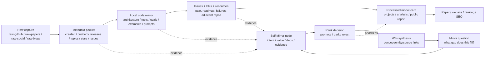

# Value Screening and Dual-Chain Knowledge Base

> Generated: 2026-06-01. This is a processed research protocol for turning the existing raw corpus into a time-weighted, implementation-grounded, self-mirror annotated knowledge base.

## One Sentence

The next phase should not read every item equally: build a dual-chain knowledge base where the evidence chain tracks raw metadata, cloned code, issues, papers, benchmarks, and reports, while the mirror chain records why each item matters, what gap it fills, how fresh it is, and whether it should be promoted, parked, or rejected.

## Three Sentences

The corpus already has enough volume; the bottleneck is value selection under time pressure. The first ranking gate should be recency and continuity, because a 2023-2024 historical framework may remain a baseline but should not dominate a 2026 frontier map unless it still has active releases, issues, benchmark use, or downstream influence. After the time gate, each high-signal GitHub project needs a complete metadata packet, a local code/architecture scan, issue/resource review, and a Self Mirror style annotation that connects raw evidence to the project model card and wiki concepts.

## Five Sentences

1. The current data flow is already structured as `raw -> processed -> work -> results`, but the next research step needs a stronger selection layer between raw captures and model-card reports.
2. The selection layer should use time as the largest weight, then continuity, then self-evolution gap fit, then implementation evidence, then issue/resource/benchmark signals.
3. The dual-chain model separates "what is true and where it came from" from "why this matters and what question it answers", so future agents can audit both evidence and judgement.
4. GitHub projects should be treated as living systems: metadata, code, docs, tests, issues, releases, related papers, community resources, and downstream forks all count as evidence.
5. The immediate output should be a ranked investigation queue, not a final eternal ranking: late-2025 and 2026 projects get first-pass attention, while older projects move into the historical-baseline lane unless they show current continuity.

## Direct User Input Alignment

| User requirement | Operational meaning |
|---|---|
| "时间会是一个非常大的权重" | Time/newness must be a first-order scoring signal, not a footnote. |
| "延续性，这些工作它所围绕的方向" | Track whether a project belongs to a continuing direction, not just a one-off repo. |
| "GitHub项目需要完整的meta数据" | Each promoted GitHub project needs API metadata, raw capture, local mirror evidence, and report links. |
| "把它的代码克隆下来，去看看具体它的实现方案" | High-priority repos need local code scans: architecture, evals, tests, examples, prompts, workflows, and mutable artifacts. |
| "尤其去看它的issue，去看它的其他的方向的资源" | Issues, PRs, releases, discussions, docs, papers, and adjacent repos become explicit evidence fields. |
| "找到缺口，找到真正有用的这些工作" | Ranking should optimize for missing links in the self-evolution pipeline, not popularity alone. |

## Current Corpus Snapshot

Source: `analysis/github-project-data-analysis.json`, generated `2026-06-01T07:26:26.411Z`.

| Metric | Count |
|---|---:|
| Raw GitHub captures | 646 |
| Classified repositories | 646 |
| Analyzed public model-card projects | 239 |
| Strict evolution-theme repositories | 93 |
| Broad evolution-related repositories | 200 |
| Analyzed projects with verified GitHub `created_at` | 25 |
| Analyzed projects with local git mirror evidence | 76 |
| Analyzed projects with public reports | 239 |
| Raw repositories with unknown time slice | 108 |

Current ranking already uses `current_value = 0.50*time + 0.20*mechanism + 0.15*evidence + 0.10*adoption + 0.05*usefulness`. That is the right direction, but the next layer should add continuity and code/issue evidence rather than letting metadata alone decide final research value.

## The Dual-Chain Model



### Chain A: Evidence Chain

| Step | Required fields | Evidence source |
|---|---|---|
| Raw identity | repo, URL, raw file, collection time, source page | `raw-github/`, `output/raw-github-timestamp-index.json` |
| GitHub metadata | created, pushed, updated, stars, forks, open issues, topics, license, default branch, latest release | GitHub API/cache or marked `[UNVERIFIED]` |
| Local mirror | local path, HEAD, branch, first/last commit, commit count, language stack | `repos/<owner>__<repo>/`, `git -C` |
| Architecture scan | core modules, mutable artifact, feedback signal, evaluator, retention path, rollback/safety path | code, docs, tests, examples |
| Discourse scan | issue clusters, PR direction, maintainer response, known failures, roadmap, community resources | GitHub issues/PRs/discussions/releases/docs |
| Processed output | model card, public report, wiki page, ranking row, paper/site link | `projects/`, `site/public/reports/projects/`, `work/wiki/` |

### Chain B: Mirror Chain

| Step | Required question | Self Mirror record |
|---|---|---|
| Intent | Why is this project relevant to self-evolution now? | `intent.one_sentence`, beneficiary, failure if absent |
| Value | What gap in the evolution pipeline does it fill? | mutable object, feedback, modifier, verifier, retention |
| Dependency | What upstream work or baseline does it continue? | related papers/repos/concepts |
| Rank | Why does it outrank older or hotter alternatives? | time, continuity, mechanism fit, evidence confidence |
| Next action | What must be read or cloned next? | issue scan, code path, benchmark rerun, report update |

## Value Screening Formula V1

The existing ranking can remain the public current-value ranking. For research triage, use a stricter frontier-investigation score:

```text
frontier_value =
  0.40 * recency
+ 0.20 * continuity
+ 0.15 * self_evolution_gap_fit
+ 0.10 * implementation_evidence
+ 0.10 * discourse_and_resource_signal
+ 0.05 * benchmark_or_product_usefulness
```

| Signal | Meaning | Practical rule |
|---|---|---|
| Recency | Creation and activity freshness | 2026 and late-2025 get first-pass attention; 2023-2024 move to baseline unless still active. |
| Continuity | Whether the work extends a live direction | Look for follow-up repos, related papers, releases, roadmap, issue traffic, forks, downstream adoption. |
| Gap fit | Whether it fills Observe -> Interpret -> Modify -> Verify -> Retain | Prefer projects that add a missing verifier, mutation operator, retained skill/memory/code path, or benchmark pressure. |
| Implementation evidence | Whether code actually exposes the claimed loop | Prefer eval scripts, tests, examples, architecture docs, prompt/skill/code mutation artifacts, reproducible configs. |
| Discourse/resource signal | Whether issues/resources reveal real demand or failure | Read issue clusters, PRs, discussions, release notes, related resource indexes, and external docs. |
| Benchmark/product usefulness | Whether it helps readers choose or build | Prefer runnable systems, published benchmark deltas, production adoption, clear product workflow, or reusable harness. |

## Generated Frontier Queue

This protocol now has a repeatable implementation:

- Script: `scripts/generate_frontier_value_queue.mjs`
- Markdown output: `analysis/frontier-value-queue.md`
- JSON output: `analysis/frontier-value-queue.json`
- Wiki synthesis: `work/wiki/synthesis/frontier-value-queue.md`

The first generated run scores 239 analyzed projects and splits them into 5 `frontier-code-ready`, 14 `frontier-clone-needed`, 100 `metadata-refresh`, 60 `watch-current-raw`, 17 `historical-baseline`, and 43 `park-for-later` entries.

## Immediate Frontier Queue

Source: `analysis/github-project-data-analysis.json` and `analysis/github-project-data-analysis.md`.

| Priority | Project | Why first | Current caveat |
|---:|---|---|---|
| 1 | `modelscope/AgentEvolver` | Highest current-value score; late-2025 creation; strong mechanism and evidence score. | Needs deeper code/issue continuity scan before treating it as field leader. |
| 2 | `ZJU-LLM-Safety/DARWIN` | 2026-04 project with high time score; connects safety and evolution. | Verify implementation depth and whether "DARWIN" is a retained self-evolution loop or safety adaptation signal. |
| 3 | `OPPO-Mente-Lab/LLM-Self-Judge` | 2026-03 evaluator/self-judging direction; useful for verifier bottleneck. | Needs issue/resource scan and benchmark trust review. |
| 4 | `microsoft/agent-lightning` | 2026-05 strict evolution raw signal with high adoption; RL-agent training direction. | `created_at` is unknown in current cache; refresh GitHub metadata and inspect code before ranking high. |
| 5 | `NousResearch/hermes-agent-self-evolution` | User-mentioned, high mechanism score, direct self-evolution model pipeline signal. | `created_at` unknown in current cache; must clone/scan trajectory, reward, and checkpoint evidence. |
| 6 | `EvoMap/evolver` | User-mentioned memory/self-evolution direction; high mechanism score. | Need metadata refresh and code-level confirmation of retained memory evolution. |
| 7 | `longmans/self-evolve` | OpenClaw/playground style can test workflow + benchmark + retention loops. | Likely useful as harness evidence, but needs issue/release/resource scan. |
| 8 | `stanford-iris-lab/meta-harness` | Harness evolution is a missing infrastructure link for agent self-improvement. | `created_at` unknown; rank depends on code and benchmark artifacts. |

Older but important systems such as `stanfordnlp/dspy`, `noahshinn/reflexion`, `madaan/self-refine`, `google-deepmind/funsearch`, `google-deepmind/opro`, `shengranhu/adas`, and `algorithmicsuperintelligence/openevolve` should remain in the historical/mechanism baseline lane. They are not discarded; they become comparison anchors for judging whether new work really adds something.

## Project Annotation Packet

Each promoted project should eventually get this packet in `projects/` or the public report:

```yaml
self_mirror:
  node: project.<owner>.<repo>
  feature: frontier-value-screening
  evidence_chain:
    raw_capture: raw-github/<file>.md
    metadata: analysis/github-project-data-analysis.json
    local_mirror: repos/<owner>__<repo>
    issue_scan: work/research/issues/<owner>__<repo>.md
    public_report: site/public/reports/projects/<file>.md
  mirror_chain:
    intent: "Explain what gap this project fills in self-evolving agents."
    value_gap: "Observe | Interpret | Modify | Verify | Retain | Rollback"
    continuity: "baseline / fork / follow-up / active direction"
    rank_decision: promote | park | reject
    next_action: "clone/code scan/issue scan/benchmark verification"
```

The annotation should stay compact. If a project is rejected, the rejection is still valuable because it teaches what not to include in the frontier narrative.

## Batch Workflow

| Batch | Size | Action | Output |
|---|---:|---|---|
| Metadata refresh | 50-100 repos | Fill GitHub API fields and mark failures explicitly. | Updated analysis JSON/report. |
| Time gate | all repos | Split into frontier, baseline, stale, unknown-time. | Ranked queue. |
| Clone/code scan | 8-12 repos | Inspect architecture, evals, tests, examples, prompts, mutation/retention paths. | Code-level notes and project packet. |
| Issue/resource scan | same 8-12 | Read issue clusters, release notes, PR direction, related resources. | Continuity and demand notes. |
| Model-card update | 5-8 promoted repos | Update `projects/`, public reports, wiki pages. | Reader-facing evidence. |
| Synthesis | every batch | Compare mechanisms and identify missing links. | `analysis/` and `work/wiki/synthesis/`. |

## Core Questions For Every Project

1. What exactly changes: prompt, memory, skill, workflow, code, weights, population, evaluator, or harness?
2. What feedback decides the change: benchmark, tests, environment reward, human review, issue signal, usage trace, or self-judge?
3. Who verifies the change, and can the project prevent regression or reward hacking?
4. Is the improvement retained across sessions, versions, agents, or deployments?
5. What does this work continue: Reflexion/Self-Refine, DSPy/OPRO, ADAS/DGM/AlphaEvolve, OpenClaw/harness, memory substrate, or a new direction?
6. What is missing from the broader evolution pipeline if this project did not exist?
7. Is the project alive in 2026, or is it mainly a historical reference?

## Main Tension

The dangerous shortcut is to let stars, names, or "self-evolution" labels decide value. The useful shortcut is to ask whether a current project fills a missing part of the controlled self-evolution loop and has enough implementation/discourse evidence to teach future builders.

## Next Implementation Nodes

| Node | Goal | Suggested path |
|---|---|---|
| `metadata-enrichment` | Add fuller GitHub metadata fields for strict/broad evolution repos. | Extend `scripts/analyze_github_project_data.mjs` or add a focused metadata refresh script. |
| `frontier-queue` | Produce frontier/baseline/stale/unknown-time queues. | Done for analyzed projects: `analysis/frontier-value-queue.md` and `analysis/frontier-value-queue.json`. |
| `code-scan-template` | Standardize cloned repo inspection. | Add template under `docs/project-management/` or `work/wiki/schema.md` appendix. |
| `issue-scan-template` | Standardize issue/PR/resource reading. | Store batch notes under `work/research/issues/` or `analysis/`. |
| `project-packet-sync` | Keep project report, wiki, site/public report aligned. | Update model-card generation path after the first manual batch proves the schema. |

## Trust Chain

- [KNOWN] Corpus counts and current-value ranking come from `analysis/github-project-data-analysis.json` and `analysis/github-project-data-analysis.md`.
- [KNOWN] Existing wiki rules require raw sources to remain immutable and wiki pages to carry frontmatter, rank, tags, sources, and trust-chain claims. Source: `work/wiki/schema.md`.
- [KNOWN] Existing Self Mirror guidance uses intent, value, rank, evidence, Mermaid/Mirror Graph nodes, and searchable anchors. Source: `/Users/copizzah/Desktop/work/agent-cli/self-mirror-guideline/SKILL.md`.
- [INFERRED] The dual-chain split is a design synthesis: it maps the existing raw/processed/work/results pipeline to an evidence chain and maps Self Mirror intent/rank/evidence records to a judgement chain.
- [UNVERIFIED] Issue activity and release continuity for the immediate frontier queue have not yet been refreshed in this document; they are the next evidence fields to collect.
