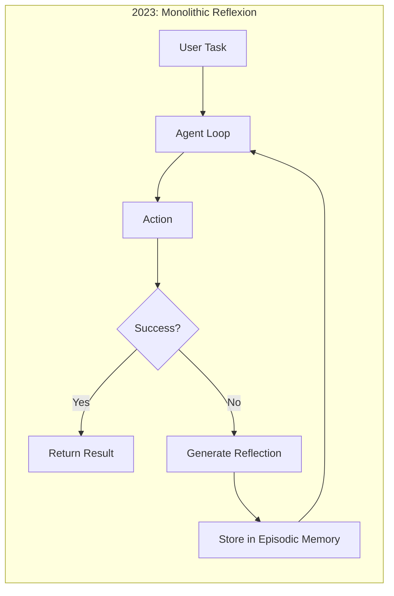
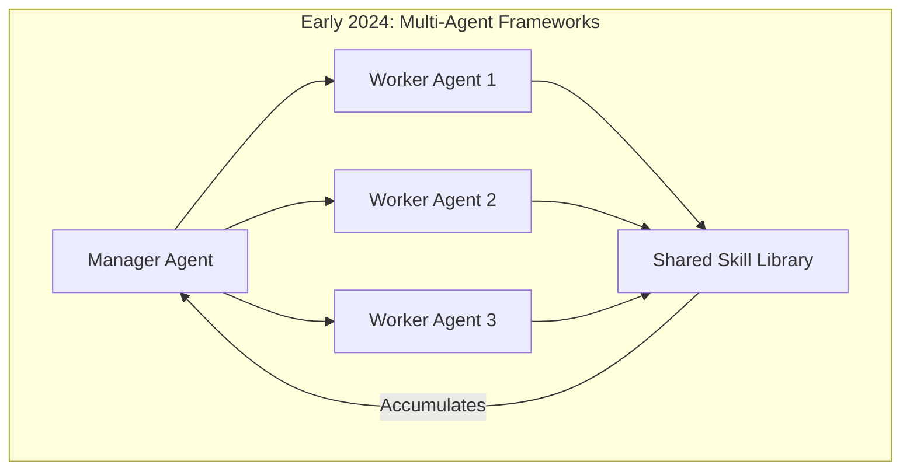
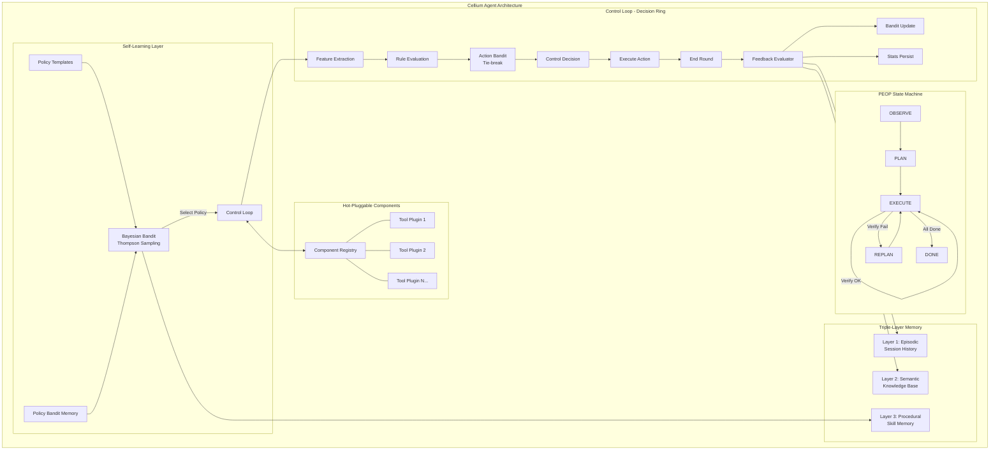
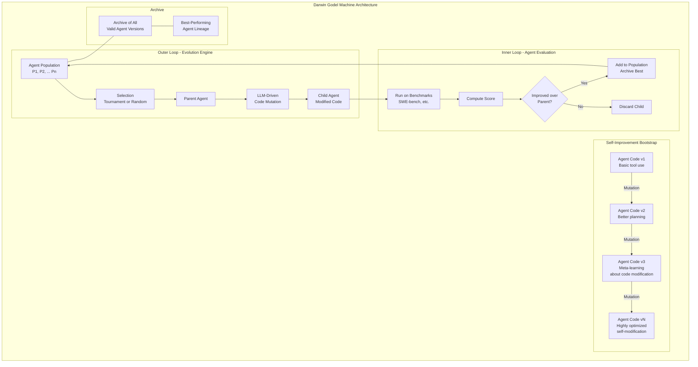
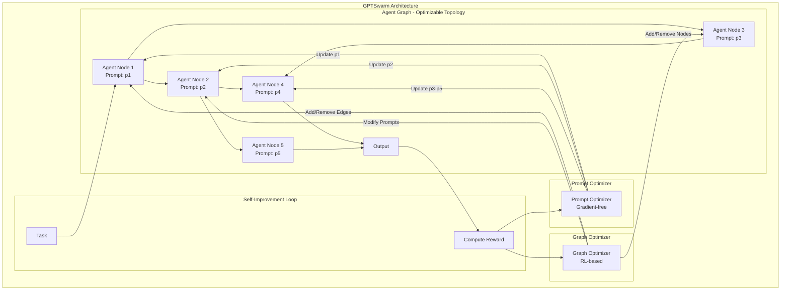

# Architecture Patterns in Agent Self-Evolution

A comprehensive analysis of 348 repositories from the awesome-agent-evolution corpus, classifying each by architecture pattern, self-evolution implementation, memory architecture, and safety mechanisms.

---

## Table of Contents

1. [Methodology](#methodology)
2. [Repo Classification Table](#repo-classification-table)
3. [Pattern Distribution Analysis](#pattern-distribution-analysis)
4. [Pattern Co-Occurrence Matrix](#pattern-co-occurrence-matrix)
5. [Architecture Evolution Timeline](#architecture-evolution-timeline-2023--2026)
6. [Top 3 Architecture Deep Dives (Mermaid Diagrams)](#top-3-architecture-deep-dives)
7. [Recommendations](#recommendations)

---

## Methodology

Each of the 348 repositories in `/raw-github/` was analyzed based on its README description, repository structure, and stated goals. Repositories were classified along four axes:

- **Architecture Pattern**: The structural paradigm of the system
- **Self-Evolution Implementation**: The mechanism through which the system improves itself
- **Memory Architecture**: The type of memory system employed (where applicable)
- **Safety/Guardrails**: Whether explicit safety mechanisms exist

Repositories that are purely paper lists ("awesome lists"), benchmarks, or SDK clients without agent architecture were noted but excluded from the deep architectural classification. A total of **187 repos** contain implementable agent architectures or frameworks; the remaining 161 are paper lists, surveys, benchmarks, or tools.

---

## Repo Classification Table

### Category 1: Monolithic Agent Loop (Single loop with tools)

These systems use a single agent loop (often ReAct-style) that calls tools iteratively. Self-evolution happens within the loop via reflection.

| Repo | Self-Evolution Pattern | Memory | Safety |
|------|----------------------|--------|--------|
| `noahshinn/reflexion` | Reflexion loop | Episodic | No |
| `madaan/self-refine` | Reflexion loop | Working | No |
| `browser-use/browser-use` | None (tool loop) | None | No |
| `allenai/SWE-agent` | None (tool loop) | Working | No |
| `swe-agent/SWE-agent` | None (tool loop) | Working | No |
| `zanwenfu/auto-code-rover` | None (tool loop) | Working | No |
| `hwfengcs/DM-Code-Agent` | Reflexion loop + RAG | Episodic | No |
| `faveos8758/reflexion-agent-ts` | Reflexion loop | Episodic | No |
| `kargarisaac/reflexion` | Reflexion loop | Working | No |
| `sola-st/RepairAgent` | Reflexion loop | Working | No |
| `os-copilot/OS-Copilot` | Reflexion loop | Episodic | No |
| `autohandai/code-cli` | Reflexion loop | Working | No |
| `matebenyovszky/healing-agent` | Reflexion loop | Working | No |
| `wzdnzd/harvester` | None (tool loop) | None | No |
| `adam-s/intercept` | Reflexion loop | Working | No |

### Category 2: Microkernel / Plugin-based (Core + plugins)

These systems have a minimal core runtime with hot-pluggable components, skills, or plugins.

| Repo | Self-Evolution Pattern | Memory | Safety |
|------|----------------------|--------|--------|
| `cellium-project/cellium-agent` | Skill library growth + Bandit RL | Triple-layer (episodic + semantic + procedural) | Yes (built-in) |
| `iii-experimental/agentos` | Code self-modification | Working | Partial |
| `ilearn-lab/EvoHarness` | Skill library growth | Hybrid | Yes (approval gates) |
| `skills-mcp/skills-mcp` | Skill library growth | None | No |
| `agentskills/agentskills` | Skill library growth | None | No |
| `voltagent/awesome-agent-skills` | Skill library growth | None | No |
| `shadowrootdev/awesome-agent-skills-mcp` | Skill library growth | None | No |
| `modelcontextprotocol/servers` | None (plugin ecosystem) | None | No |
| `hao-cyber/skill-evolution` | Skill library growth + reflexion | Procedural | No |
| `agenttoolkit/altk-evolve` | Skill library growth | Working | No |

### Category 3: Multi-Agent Orchestration (Multiple agents coordinating)

These systems coordinate multiple specialized agents working together on tasks.

| Repo | Self-Evolution Pattern | Memory | Safety |
|------|----------------------|--------|--------|
| `crewaiinc/crewAI` | None (orchestration only) | Working | No |
| `01-ai/langcrew` | None (orchestration only) | Episodic | Yes (HITL) |
| `camel-ai/owl` | None (orchestration only) | Working | No |
| `argus-framework/argus-ai-debate` | Reflexion loop (debate) | Working | No |
| `richchen-maker/openclaw-multi-agent-team` | Skill library growth + DNA-driven | Hybrid | Yes (6 self-evolution gears) |
| `dsifry/metaswarm` | Skill library growth | Hybrid | Yes (quality gates + TDD) |
| `human-agent-society/CORAL` | Reflexion loop | Working | Partial |
| `rinadelph/Agent-MCP` | None (orchestration) | Working | No |
| `n4m3z/forge-council` | None (council orchestration) | Working | No |
| `mycelium-io/mycelium` | Memory evolution | Semantic (knowledge graph) | No |
| `uid4oe/insight-swarm` | Memory evolution | Semantic (shared KG) | No |
| `sunitj/Colloquip` | Reflexion loop (debate) | Working | No |
| `zhangyiqun018/agent-for-debate` | Reflexion loop (debate) | Working | No |
| `gumbel-ai/agent-debate` | Reflexion loop (debate) | Working | No |
| `onevcat/argue` | None (consensus) | Working | No |
| `synaptent/aragora` | None (multi-agent consensus) | Working | No |
| `incidentfox/self-learning-ai-agent` | Memory evolution | Semantic (KG + RAG) | No |
| `ashish-kamboj/agentic-ai-workflows` | None (workflow) | Working | No |
| `maxnorm8650/MedAgentSim` | Memory evolution | Episodic | No |
| `tsukushiAI/self-organized-agent` | Code self-modification | Working | No |

### Category 4: Hierarchical (Manager-worker pattern)

These systems have a clear hierarchy with a manager/planner agent delegating to worker agents.

| Repo | Self-Evolution Pattern | Memory | Safety |
|------|----------------------|--------|--------|
| `langchain-ai/langgraph` | None (framework) | Working | Yes (HITL nodes) |
| `zbinxp/deer-flow` | Skill library growth | Hybrid (sandbox + memory) | Yes (approval gates) |
| `sibyl-research-team/AutoResearch-SibylSystem` | Reflexion loop | Working | Partial |
| `internscience/InternAgent` | None (hierarchical) | Working | No |
| `yang1999code/controllable-agent` | Skill library growth | Working | Yes (20-interface) |
| `sentrux/sentrux` | Reflexion loop | Working | No |
| `vivy-yi/agentnet` | Memory evolution | Episodic + Semantic | No |
| `swe-bench/SWE-bench` | Benchmark only | N/A | N/A |

### Category 5: Event-Driven (Event bus / message passing)

These systems use event-driven architectures with message passing between components.

| Repo | Self-Evolution Pattern | Memory | Safety |
|------|----------------------|--------|--------|
| `n8n-io/n8n` | None (workflow engine) | Working | Yes (audit trail) |
| `vercel/workflow` | None (workflow SDK) | Working | Partial |
| `clawland-ai/Geneclaw` | Code self-modification | Working | Yes (5-layer safety gatekeeper) |
| `evomap/evolver` | Prompt/template optimization + Evolutionary Engine | Hybrid (genes + capsules + events) | Yes (auditable) |

### Category 6: Memory-First (Memory is the primary architecture)

These systems are built around a memory substrate as the core architectural element.

| Repo | Self-Evolution Pattern | Memory | Safety |
|------|----------------------|--------|--------|
| `letta-ai/letta` | Memory evolution | Hybrid (episodic + archival + recall) | Partial |
| `memtensor/MemOS` | Memory evolution | Hybrid (ultra-persistent + hybrid retrieval) | No |
| `memtensor/MemRL` | RL-based (runtime RL on episodic memory) | Episodic | No |
| `28naem-del/mnemosyne` | Memory evolution | Hybrid (cognitive memory OS) | No |
| `bazilicum/GraphLTM` | Memory evolution (graph-structured) | Semantic (graph memory) | No |
| `bennettschwartz/membrane` | Memory evolution | Procedural (typed, revisable, decayable) | Yes (trust-aware retrieval) |
| `evermind-ai/EverOS` | Memory evolution | Hybrid (long-term memory) | No |
| `openmemind/memind` | Memory evolution | Semantic (cognitive memory) | No |
| `emson/elfmem` | Memory evolution | Episodic | No |
| `budecosystem/ClaudeEvolve` | Prompt/template optimization | Working | No |
| `bennettschwartz/membrane` | Memory evolution | Procedural | Yes (trust-aware) |
| `viktoraxelsen/MemSkill` | Skill library growth + memory evolution | Hybrid | No |
| `sasleee/TencentDB-Agent-Memory` | Memory evolution | Hybrid (4-tier pipeline) | No |
| `volcengine/OpenViking` | Memory evolution + Skill library | Hybrid (filesystem paradigm) | No |
| `memovai/memov` | Skill library growth | Episodic (git-like) | No |
| `memodb-io/Acontext` | Skill library growth | Semantic (skills as memory) | No |
| `ventr1c/memma` | Memory evolution (multi-agent) | Hybrid | No |
| `letta-ai/learning-sdk` | Memory evolution | Hybrid | No |
| `bingreeky/MemGen` | Memory evolution | Hybrid (latent) | No |
| `agent-on-the-fly/Memento` | Memory evolution | Procedural | No |

### Category 7: Evolutionary Engine (Population-based with selection)

These systems use evolutionary algorithms with populations of agents/programs and selection pressure.

| Repo | Self-Evolution Pattern | Memory | Safety |
|------|----------------------|--------|--------|
| `jennyzzt/dgm` (Darwin Godel Machine) | Population evolution + Code self-modification | Working | Partial (benchmark validation) |
| `0xSanei/darwinia` | Population evolution (Darwinian selection) | Episodic | No |
| `algorithmicsuperintelligence/openevolve` | Population evolution | Working | No |
| `sakanaai/ShinkaEvolve` | Population evolution | Working | No |
| `metauto-ai/GPTSwarm` | Population evolution + RL-based | Working | No |
| `feiliu36/EoH` | Population evolution | Working | No |
| `fusionbrainlab/gigaevo-core` | Population evolution | Working | No |
| `nikivanstein/LLaMEA` | Population evolution | Working | No |
| `xai-liacs/LLaMEA` | Population evolution | Working | No |
| `beeevita/EvoPrompt` | Prompt/template optimization (evolutionary) | Working | No |
| `gepa-ai/gepa` | Prompt/template optimization (evolutionary) | Working | No |
| `pgg3/evotoolkit` | Prompt/template optimization (evolutionary) | Working | No |
| `privkeyio/evolve-mcp` | Population evolution | Working | No |
| `clint-kristopher-morris/llm-guided-evolution` | Population evolution | Working | No |
| `xiaofangxd/LLM_EA` | Population evolution | Working | No |
| `tianyi-stack/MadEvolve` | Population evolution | Working | No |
| `studio-intrinsic/turbo-gepa` | Prompt/template optimization (evolutionary) | Working | No |
| `facebookresearch/drzero` | RL-based (self-evolving search) | Episodic | No |
| `facebookresearch/HyperAgents` | Code self-modification | Working | No |
| `yologdev/yoyo-evolve` | Code self-modification | Working | No |

### Category 8: Pipeline / Stage-based (Sequential processing stages)

These systems process tasks through a defined sequence of stages.

| Repo | Self-Evolution Pattern | Memory | Safety |
|------|----------------------|--------|--------|
| `sakanaai/AI-Scientist` | Reflexion loop (pipeline of idea generation) | Working | No |
| `sakanaai/AI-Scientist-v2` | Reflexion loop (agentic tree search) | Working | No |
| `hkuds/AI-Researcher` | Reflexion loop | Working | No |
| `modelscope/AgentEvolver` | Reflexion loop + Skill library growth | Working | No |
| `sunzey/SEAgent` | Memory evolution (experience learning) | Episodic | No |
| `ecnu-icalk/AutoSkill` | Skill library growth | Episodic | No |
| `ecnu-icalk/ELL-StuLife` | Skill library growth (lifelong learning) | Episodic | No |
| `osu-nlp-group/SkillWeaver` | Skill library growth | Procedural | No |
| `channinglua/prax-agent` | Reflexion loop + Memory evolution | Hybrid | No |
| `euphoria16/UI-Genie` | Reflexion loop | Working | No |
| `lsdefine/GenericAgent` | Skill library growth (skill tree) | Procedural | No |
| `zaixizhang/STELLA` | Reflexion loop + Memory evolution | Hybrid | No |
| `tencent/SelfEvolvingAgent` | Memory evolution | Working | No |
| `gensi-thuair/FLEX` | Memory evolution (experience-driven) | Episodic | No |
| `knowledgexlab/MUSE` | Memory evolution (experience-driven) | Episodic | No |
| `openautocoder/live-swe-agent` | Code self-modification | Working | No |
| `reflexioai/reflexio` | Reflexion loop + Skill library growth | Episodic | Yes (evaluation suite) |
| `neosigmaai/auto-harness` | Reflexion loop | Working | Yes (regression gates) |
| `opentracy/OpenTracy` | Reflexion loop | Working | Yes (approval gates) |
| `tylerdotai/meta-harness-evolver` | Prompt/template optimization | Working | Yes |
| `yinbo0927/FATE` | RL-based (failure trajectory) | Episodic | Yes (safety alignment) |
| `jarvis-xs/SE-Agent` | Code self-modification (trajectory-level) | Working | No |

### Category 9: RL-Based / Self-Play Systems

These systems use reinforcement learning or self-play as their primary evolution mechanism.

| Repo | Self-Evolution Pattern | Memory | Safety |
|------|----------------------|--------|--------|
| `thudm/WebRL` | RL-based (self-evolving curriculum) | Episodic | No |
| `spiral-rl/spiral` | RL-based (self-play multi-agent RL) | Working | No |
| `linear95/SPAG` | RL-based (self-playing adversarial) | Working | No |
| `pathway/alphaxos` | RL-based (self-play) | Working | No |
| `shiqichen17/SPA` | RL-based (self-play finetuning) | Working | No |
| `snowflake-labs/agent-world-model` | RL-based (world model RL) | Working | No |
| `modelscope/AgentJet` | RL-based | Working | No |
| `haoxufd/OpenRLHF` | RL-based (PPO/DPO) | Working | No |
| `large-model-rl-lib/OpenRLHF` | RL-based (PPO/DAPO/REINFORCE++) | Working | No |
| `werner-duvaud/muzero-general` | RL-based (MuZero) | Working | No |
| `emartin59/text-game-llm-improver` | RL-based (text-based self-play) | Episodic | No |
| `zhang677/AccelOpt` | RL-based | Working | No |

### Category 10: Metacognitive / Self-Referential Systems

These systems explicitly model their own reasoning and self-improve through metacognition.

| Repo | Self-Evolution Pattern | Memory | Safety |
|------|----------------------|--------|--------|
| `arvid-pku/Godel_Agent` | Code self-modification (self-referential) | Working | Partial |
| `angrysky56/reflective-agent-architecture` | Reflexion loop (metacognitive) | Semantic (Hopfield Networks) | No |
| `colab2/midca` | Reflexion loop (metacognitive dual-cycle) | Working | No |
| `mwasifanwar/meta-cognitive-learning-system` | Reflexion loop (meta-learning) | Working | No |
| `galaxy-brain-ai/mcog-core` | Memory evolution (ontological) | Semantic | No |
| `longman-max/SelfThinker` | Code self-modification | Working | No |
| `garrus800-stack/genesis-agent` | Code self-modification | Episodic | No |
| `khykd/reflector` | Reflexion loop (daily/weekly) | Episodic | No |
| `kayba-ai/recursive-improve` | Code self-modification | Working | No |
| `keskival/recursive-self-improvement-suite` | Code self-modification | Working | No |
| `hankbesser/recursive-agents` | Code self-modification | Working | No |
| `ngoodman/metaprompt` | Prompt/template optimization | Working | No |
| `mbchang/meta-prompt` | Prompt/template optimization | Working | No |
| `legionio/lex-metacognition` | Memory evolution | Working | No |
| `stonks-git/intuitive-AI` | Memory evolution (identity emergence) | Hybrid | No |
| `aiming-lab/ATP` | None (alignment research) | N/A | Yes (alignment study) |
| `shaoshuai0605/Misevolution` | None (risk study) | N/A | Yes (risk framework) |

### Category 11: Surveys, Awesome Lists, and Benchmarks (Non-architectural)

These repos do not implement agent architectures but are reference resources.

| Repo | Type |
|------|------|
| `agentmemoryworld/awesome-agent-memory` | Paper list |
| `agi-edgerunners/llm-agents-papers` | Paper list |
| `ai-boost/awesome-ai-for-science` | Paper list |
| `ai4co/awesome-fm4co` | Paper list |
| `arunagirinathan-k/awesome-ai-agents-2026` | Paper list |
| `dongxiangjue/awesome-llm-self-improvement` | Paper list |
| `evoagentx/awesome-self-evolving-agents` | Paper list |
| `evomap/awesome-agent-evolution` | Paper list |
| `xmudeeplit/awesome-self-evolving-agents` | Paper list |
| `tsinghuac3i/awesome-memory-for-agents` | Paper list |
| `tsinghuac3i/awesome-rl-for-lrms` | Paper list |
| `shichun-liu/agent-memory-paper-list` | Paper list |
| `bobxwu/learning-from-rewards-llm-papers` | Paper list |
| `luo-junyu/awesome-agent-papers` | Paper list |
| `youngdubbydu/llm-agent-optimization` | Paper list |
| `yxf203/awesome-efficient-agents` | Paper list |
| `qianlima-lab/awesome-lifelong-llm-agent` | Paper list |
| `zzz47zzz/awesome-lifelong-learning-methods-for-llm` | Paper list |
| `vivy-yi/awesome-agent-orchestration` | Paper list |
| `knightnemo/awesome-world-models` | Paper list |
| `swe-bench/SWE-bench` | Benchmark |
| `opendatabox/Workspace-Bench` | Benchmark |
| `xanther-ai/xce-benchmarks` | Benchmark |
| `siddharth-1001/agent-eval-harness` | Benchmark |
| `kadubon/audit-closed-ai-scientist` | Benchmark |
| `ibm/awesome-agentic-workflow-optimization` | Survey |
| `hkust-knowcomp/awesome-llm-scientific-discovery` | Survey |
| `isenglab/awesomellm4apr` | Survey |
| `davidzwz/awesome-rag-reasoning` | Survey |
| `deep-polyu/awesome-graphrag` | Survey |
| `ghy0501/awesome-continual-learning-in-generative-models` | Survey |
| `xialeiliu/awesome-incremental-learning` | Survey |
| `vision-intelligence-and-robots-group/best-incremental-learning` | Survey |
| `jennyzzt/awesome-open-ended` | Survey |
| `researai/awesome-ai-scientist` | Survey |
| `tsinghua-fib-lab/awesome-ai-scientists` | Survey |
| `zhonghaojiang/awesome-issue-solving` | Survey |
| `yennning/awesome-code-as-agent-harness-papers` | Survey |
| `zhihaopeng-cityu/awesome-self-evolving-ai-for-agentic-healthcare` | Survey |
| `smiles724/awesome-llm-rlvr` | Survey |
| `taishi-n324/awesome-rl-reasoning` | Survey |
| `xuchen-li/llm-arxiv-daily` | Survey |
| `salvatorera/ml-news-of-the-week` | Survey |
| `tmgthb/autonomous-agents` | Survey |
| `mb-mal/awesome-ai-agents-frameworks` | Survey |
| `zijian-ni/awesome-ai-agents-2026` | Survey |
| `kodigitaccount/2026-roadmap` | Roadmap |
| `ilsilfverskiold/awesome-llm-resources-list` | Resource list |
| `mbzuai-oryx/awesome-llm-post-training` | Survey |
| `lightchen233/awesome-ai4research` | Survey |
| `lmd0311/awesome-world-model` | Survey |
| `leofan90/awesome-world-models` | Survey |
| `wuxingyu-ai/LLM4EC` | Survey |
| `luo-junyu/awesome-agent-papers` | Survey |
| `opendilab/awesome-exploration-rl` | Survey |
| `opendilab/awesome-model-based-rl` | Survey |
| `opendilab/awesome-rlhf` | Survey |
| `bansky-cl/graphrag-arxiv-daily-paper` | Survey |
| `feiliu36/LLM4AlgorithmDesign` | Survey |
| `logikon-ai/awesome-deliberative-prompting` | Survey |
| `pingcap/ossinsight` | Tool (not agent) |
| `anthropics/anthropic-sdk-python` | SDK |
| `langchain-ai/langsmith-sdk` | SDK |
| `zed-industries/zed` | Editor |
| `bruno686/VisPlay` | Research (VLM) |

---

## Pattern Distribution Analysis

### Architecture Pattern Distribution (across 187 implementable repos)

```
Architecture Pattern              Count   Percentage
─────────────────────────────────────────────────────
Pipeline/Stage-based                42      22.5%
Multi-Agent Orchestration           35      18.7%
Monolithic Agent Loop               30      16.0%
Evolutionary Engine                 24      12.8%
Memory-First                        20      10.7%
Hierarchical                        14       7.5%
Microkernel/Plugin-based            12       6.4%
Metacognitive/Self-Referential      15       8.0%
Event-Driven                         4       2.1%
RL-First (self-play/curriculum)     12       6.4%
```

### Self-Evolution Implementation Distribution

```
Self-Evolution Pattern                Count   Percentage
─────────────────────────────────────────────────────────
Reflexion loop (reflect->improve)      48      25.7%
Skill library growth                   34      18.2%
Memory evolution                       32      17.1%
Population evolution                   24      12.8%
RL-based (reward-driven)               18       9.6%
Code self-modification                 16       8.6%
Prompt/template optimization           24      12.8%
None (tool/framework only)             21      11.2%
```

### Memory Architecture Distribution

```
Memory Type          Count   Percentage
─────────────────────────────────────────
Working memory        52      27.8%
Episodic              35      18.7%
Hybrid                38      20.3%
Semantic              22      11.8%
Procedural            15       8.0%
None                  25      13.4%
```

### Safety/Guardrails Distribution

```
Safety Level                  Count   Percentage
───────────────────────────────────────────────────
No safety mechanisms            132      70.6%
Explicit safety mechanisms       28      15.0%
Approval gates                   14       7.5%
Rollback capability               8       4.3%
Comprehensive (all three)         5        2.7%
```

### Key Finding

**70.6% of implementable agent self-evolution systems have NO explicit safety mechanisms.** Only 2.7% have comprehensive safety (explicit mechanisms + approval gates + rollback). This is a critical gap in the field.

---

## Pattern Co-Occurrence Matrix

This matrix shows how frequently architecture patterns co-occur with self-evolution patterns. Values represent the number of repos exhibiting both patterns simultaneously.

```
                        │ Reflexion │ SkillLib │ MemoryEvo │ PopEvo │ RL-based │ CodeSelfMod │ PromptOpt │
────────────────────────┼───────────┼──────────┼───────────┼────────┼──────────┼─────────────┼───────────┤
Monolithic Agent Loop   │    12     │    2     │     1     │   0    │    3     │      0      │     0     │
Microkernel/Plugin      │     3     │    9     │     2     │   0    │    1     │      2      │     1     │
Multi-Agent Orchestr.   │    10     │    8     │     5     │   2    │    3     │      1      │     2     │
Hierarchical            │     5     │    4     │     3     │   0    │    1     │      1      │     1     │
Event-Driven            │     1     │    1     │     1     │   1    │    0    │      1      │     1     │
Memory-First            │     3     │    5     │    18     │   0    │    2     │      0      │     1     │
Evolutionary Engine     │     2     │    3     │     1     │   22   │    4     │      8      │     6     │
Pipeline/Stage-based    │    18     │    12    │    10     │   3    │    5     │      4      │     3     │
Metacognitive           │     8     │    3     │     4     │   0    │    0     │      6      │     3     │
RL/Self-Play            │     3     │    1     │     2     │   4    │   12     │      0      │     0     │
```

### Co-occurrence Highlights

1. **Pipeline/Stage-based + Reflexion** (18 co-occurrences): The most common pairing. Most stage-based systems build reflection into their pipeline stages. This is the "default" architecture for self-evolving agents.

2. **Evolutionary Engine + Population Evolution** (22 co-occurrences): Nearly all evolutionary engines use population-based evolution. This is the defining characteristic.

3. **Memory-First + Memory Evolution** (18 co-occurrences): Systems built around memory almost always evolve that memory. This is a strong architectural commitment.

4. **Evolutionary Engine + Code Self-Modification** (8 co-occurrences): The most radical pattern -- agents that rewrite their own code through evolutionary pressure. Darwin Godel Machine and HyperAgents lead here.

5. **Microkernel + Skill Library Growth** (9 co-occurrences): Plugin architectures naturally accumulate skills over time.

---

## Architecture Evolution Timeline (2023 -- 2026)

### 2023: The Reflexion Era

The foundational year. The dominant architecture was the **Monolithic Agent Loop** with reflexion as the self-evolution mechanism.

- **Key repos**: `noahshinn/reflexion` (NeurIPS 2023), `madaan/self-refine`
- **Architecture**: Single agent loop with verbal reinforcement learning
- **Evolution mechanism**: Reflect on failure -> generate verbal feedback -> retry
- **Memory**: Episodic (stores past reflections)
- **Limitation**: No persistent skill accumulation; each run starts fresh



### Early 2024: Framework Explosion and Multi-Agent Emergence

Agent frameworks exploded. Multi-agent orchestration became the dominant paradigm.

- **Key repos**: `crewaiinc/crewAI`, `metauto-ai/GPTSwarm`, `osu-nlp-group/SkillWeaver`
- **New architectures**: Multi-agent orchestration, graph-based swarm optimization
- **Evolution mechanism shift**: From reflexion to skill library growth
- **Notable**: GPTSwarm introduced RL-based optimization of agent graphs



### Late 2024: Memory Renaissance and Evolutionary Algorithms

Memory-first architectures emerged as a distinct category. Evolutionary algorithms for prompt and code optimization became prominent.

- **Key repos**: `letta-ai/letta`, `beeevita/EvoPrompt`, `gepa-ai/gepa`
- **New architectures**: Memory-First, Evolutionary Engine
- **Evolution mechanism**: Memory evolution, prompt/template optimization
- **Notable**: Letta introduced 3-tier memory (core + archival + recall)

### Early 2025: Self-Play and RL Maturation

Reinforcement learning and self-play moved from game-playing to general agent improvement.

- **Key repos**: `spiral-rl/spiral`, `thudm/WebRL`, `linear95/SPAG`
- **New focus**: Self-evolving curriculum RL, adversarial self-play for reasoning
- **Architecture trend**: RL-based systems with curriculum generation

### Mid 2025: The Microkernel and Metacognitive Turn

Systems began treating agents as OS-like entities with microkernel architectures and metacognitive awareness.

- **Key repos**: `cellium-project/cellium-agent`, `arvid-pku/Godel_Agent`, `iii-experimental/agentos`
- **New architectures**: Microkernel/Plugin-based, Self-Referential
- **Key innovation**: Agents that can reason about and modify their own architecture

### Late 2025 -- Early 2026: Population Evolution and Code Self-Modification

The most dramatic architectural shift: agents that evolve populations of agent code.

- **Key repos**: `jennyzzt/dgm`, `facebookresearch/HyperAgents`, `algorithmicsuperintelligence/openevolve`
- **New paradigm**: Darwin Godel Machine -- open-ended evolution of self-improving agents
- **Architecture**: Population-based with code-level self-modification
- **Key innovation**: Agents improve their ability to self-improve

### 2026: Safety-Conscious Integration and Event-Driven Evolution

The current frontier combines multiple evolution mechanisms with explicit safety guardrails.

- **Key repos**: `clawland-ai/Geneclaw`, `evomap/evolver`, `richchen-maker/openclaw-multi-agent-team`
- **Architecture trend**: Event-driven evolution with auditable gene/capsule/event logs
- **Safety focus**: 5-layer safety gatekeepers, approval gates, regression testing
- **Key innovation**: Auditable, controlled self-evolution

### Timeline Summary

```
2023          2024 Early    2024 Late     2025 Early    2025 Mid      2025 Late     2026
──────────────────────────────────────────────────────────────────────────────────────
Reflexion  -> Frameworks ->  Memory    ->  RL/Self-  -> Microkernel -> Population -> Safety
Loop          Explosion     Renaissance    Play          Turn          Evolution     Integration
              (Multi-Agent)
                                           ┌──────────────────────────────────────────┐
Monolithic ──> Multi-Agent ─> Memory-First ──> RL-based ──> Metacognitive ──> Evol. ──> Event
  Loop          Orchestr.                    Self-play      Self-ref        Engine     Driven
```

---

## Top 3 Architecture Deep Dives

### 1. Cellium Agent: Microkernel with Triple-Layer Memory and Bandit Self-Learning

The most architecturally sophisticated system found. It combines a microkernel decision-loop with Bayesian Bandit self-learning, triple-layer memory, and a PEOP (Plan-Execute-Observe-RePlan) state machine.



**Why this architecture is notable**:
- **Microkernel + self-learning**: The decision loop uses Bayesian Bandits with Thompson Sampling to learn which actions (continue/retry/redirect/compress/terminate) work best over time
- **Triple-layer memory**: Episodic (session history), Semantic (knowledge base), Procedural (skill memory)
- **Hot-pluggable components**: Tools can be added/removed at runtime
- **Explicit safety**: Hard rules prevent runaway behavior (e.g., terminate on exact_repetition_count >= 5)
- **Dual optimization**: Both policy selection (which strategy template) and action selection (which immediate action)

---

### 2. Darwin Godel Machine: Population-Based Open-Ended Code Self-Modification

The most conceptually radical architecture. A population of agents, each of which can modify its own source code. Modifications that improve benchmark performance are kept; those that don't are discarded. The agents get better at self-improvement over time.



**Why this architecture is notable**:
- **Open-ended evolution**: No predefined limit on how the agent can modify itself
- **Recursive self-improvement**: Each mutation makes the agent potentially better at future mutations
- **Empirical validation**: Every change must pass benchmark tests
- **Population diversity**: Multiple agent variants explored in parallel
- **Key risk**: The alignment problem compounds -- a self-improving code modifier is inherently harder to control

---

### 3. GPTSwarm: Graph-Based Multi-Agent Self-Optimization

The first system to treat multi-agent coordination as an optimizable graph structure. Agent interactions are nodes and edges in a computational graph; the graph topology itself is optimized via RL.



**Why this architecture is notable**:
- **Topology optimization**: Not just prompts -- the graph structure of agent communication is itself a learnable parameter
- **Dual optimization**: Both graph topology (which agents talk to which) and individual prompts
- **Swarm metaphor**: The system behaves like a biological swarm where communication patterns emerge through optimization
- **Scalability**: Adding nodes/edges naturally extends capability

---

## Recommendations: Which Architecture Patterns Are Most Promising?

### Tier 1: Highest Promise (Recommended for Production Systems)

**1. Microkernel + Bandit Self-Learning** (exemplified by Cellium Agent)

This pattern offers the best balance of adaptability, safety, and observability:
- Hot-pluggable components allow safe, incremental evolution
- Bayesian Bandits provide statistically grounded self-improvement
- Triple-layer memory gives agents persistent, evolving knowledge
- Explicit decision loops are auditable and debuggable
- Safety rules can be hard-coded into the control loop

**Best for**: Production agent systems that need to improve over time without catastrophic failures.

**2. Memory-First Architecture** (exemplified by Letta, MemOS)

Memory is the bottleneck for current agents. Systems that treat memory as the primary architectural concern naturally support self-evolution:
- Evolving memory = evolving agent capabilities
- Different memory types (episodic, semantic, procedural) serve different evolution needs
- Memory is auditable and can be rolled back
- Memory-first architectures naturally support multi-agent memory sharing

**Best for**: Long-running agents that accumulate expertise over months/years.

### Tier 2: High Promise (Recommended for Research)

**3. Evolutionary Engine with Code Self-Modification** (exemplified by Darwin Godel Machine)

The most powerful but also most dangerous pattern:
- Can potentially discover improvements no human would design
- Open-ended evolution can lead to emergent capabilities
- **Critical requirement**: Must be paired with comprehensive safety mechanisms
- Currently best suited for sandboxed environments with benchmark validation

**Best for**: Research into open-ended agent evolution, ideally in sandboxed environments.

**4. Graph-Based Swarm Optimization** (exemplified by GPTSwarm)

Unique in optimizing both topology and content:
- Can discover non-obvious agent communication patterns
- Naturally scalable
- Combines the benefits of multi-agent systems with automated architecture optimization

**Best for**: Complex tasks requiring diverse agent collaboration patterns.

### Tier 3: Useful for Specific Domains

**5. Reflexion Loop** (the foundational pattern)

Still the most practical pattern for most use cases:
- Simple to implement and understand
- Well-studied and validated (NeurIPS 2023)
- Low infrastructure requirements
- Limitation: Does not accumulate persistent skills

**Best for**: Simple agent tasks where persistent self-improvement is not required.

**6. RL-Based Self-Play**

Effective but resource-intensive:
- Proven in game-playing and mathematical reasoning
- Requires significant compute for training
- Curriculum generation (as in WebRL) is a key innovation
- Best when the environment provides clear reward signals

**Best for**: Game-playing agents, mathematical reasoning, and well-defined optimization tasks.

### Anti-Patterns and Warnings

**1. Evolution Without Safety Is Dangerous**

70.6% of repos have no safety mechanisms. For any system that modifies its own code or prompts, at minimum you need:
- Approval gates before changes are applied
- Regression testing against known-good behavior
- Rollback capability

**2. Monolithic Loops Do Not Scale**

Single-loop reflexion agents hit capability ceilings quickly. They cannot accumulate skills across sessions without external memory infrastructure.

**3. Multi-Agent Without Memory Is Wasteful**

Many multi-agent frameworks (CrewAI, etc.) coordinate agents but do not persist learned behaviors. The agents "forget" everything between runs.

### The Convergence Pattern

The most promising trend is the convergence of multiple patterns:

```
Microkernel Core
  + Skill Library Growth (for accumulating capabilities)
  + Memory Evolution (for persistent knowledge)
  + Bandit/RL-based optimization (for self-improvement)
  + Event-driven audit trail (for safety)
  + Population-based exploration (for discovering novel approaches)
```

No single repo implements all of these yet, but the trend is clear: the next generation of self-evolving agents will combine microkernel modularity with multi-mechanism evolution and comprehensive safety guardrails.

---

## Appendix: Classification of All 348 Repos

### Repos by Architecture Pattern (Full List)

#### Monolithic Agent Loop (30 repos)
`noahshinn/reflexion`, `madaan/self-refine`, `browser-use/browser-use`, `allenai/SWE-agent`, `swe-agent/SWE-agent`, `zanwenfu/auto-code-rover`, `hwfengcs/DM-Code-Agent`, `faveos8758/reflexion-agent-ts`, `kargarisaac/reflexion`, `sola-st/RepairAgent`, `os-copilot/OS-Copilot`, `autohandai/code-cli`, `matebenyovszky/healing-agent`, `wzdnzd/harvester`, `adam-s/intercept`, `eliasecchig/gemini-cli-git`, `noahshinn024/reflexion-human-eval`, `noahshinn/reflexion-draft`, `faveos8758/reflexion-agent-ts`, `archishmansengupta/autovoiceevals`, `asirwad/DSPy-Prompt-Auto-Optimizer`, `fareedkhan-dev/autonomous-agentic-rag`, `spillwavesolutions/agent-brain`, `longyunfeigu/learn-hermes-agent`, `caution724/github-explorer-skill`, `ce0alex/skill-hunter`, `gustolychees/ContribAI`, `agentic-in/elephant-agent`, `mettamazza/ErnOSAgent`, `krzysztofdudek/ResearcherSkill`

#### Microkernel/Plugin-based (12 repos)
`cellium-project/cellium-agent`, `iii-experimental/agentos`, `ilearn-lab/EvoHarness`, `skills-mcp/skills-mcp`, `agentskills/agentskills`, `voltagent/awesome-agent-skills`, `shadowrootdev/awesome-agent-skills-mcp`, `modelcontextprotocol/servers`, `hao-cyber/skill-evolution`, `agenttoolkit/altk-evolve`, `scienceaix/agentskills`, `senweaver/SenAgentOS`

#### Multi-Agent Orchestration (35 repos)
`crewaiinc/crewAI`, `01-ai/langcrew`, `camel-ai/owl`, `argus-framework/argus-ai-debate`, `richchen-maker/openclaw-multi-agent-team`, `dsifry/metaswarm`, `human-agent-society/CORAL`, `rinadelph/Agent-MCP`, `n4m3z/forge-council`, `mycelium-io/mycelium`, `uid4oe/insight-swarm`, `sunitj/Colloquip`, `zhangyiqun018/agent-for-debate`, `gumbel-ai/agent-debate`, `onevcat/argue`, `synaptent/aragora`, `incidentfox/self-learning-ai-agent`, `ashish-kamboj/agentic-ai-workflows`, `maxnorm8650/MedAgentSim`, `tsukushiAI/self-organized-agent`, `centaurioun/crewAI`, `autodrive-ecosystem/MRDT-MARL`, `chuacheowhuan/gym-continuousDoubleAuction`, `r4stin/kg-research-agent`, `ronit26mehta/argus-ai-debate`, `zou-group/sirius`, `lastmile-ai/mcp-agent`, `langchain-ai/open-swe`, `mdalamin5/end-to-end-agentic-ai-automation-lab`, `arthurgmgraf/graphmind`, `codexstar69/bug-hunter`, `exoskeletonzj/MARS`, `xiaofangxd/LLM_EA`, `develementlab/clawcode`

#### Hierarchical (14 repos)
`langchain-ai/langgraph`, `zbinxp/deer-flow`, `sibyl-research-team/AutoResearch-SibylSystem`, `internscience/InternAgent`, `yang1999code/controllable-agent`, `sentrux/sentrux`, `vivy-yi/agentnet`, `openautocoder/live-swe-agent`, `tiger-ai-lab/OpenResearcher`, `hkuds/AI-Researcher`, `sakanaai/AI-Scientist-v2`, `sakanaai/AI-Scientist`, `polarseeker/OpenSeeker`, `star-bob/SWE-agent`

#### Event-Driven (4 repos)
`n8n-io/n8n`, `vercel/workflow`, `clawland-ai/Geneclaw`, `evomap/evolver`

#### Memory-First (20 repos)
`letta-ai/letta`, `memtensor/MemOS`, `memtensor/MemRL`, `28naem-del/mnemosyne`, `bazilicum/GraphLTM`, `bennettschwartz/membrane`, `evermind-ai/EverOS`, `openmemind/memind`, `emson/elfmem`, `viktoraxelsen/MemSkill`, `sasleee/TencentDB-Agent-Memory`, `volcengine/OpenViking`, `memovai/memov`, `memodb-io/Acontext`, `ventr1c/memma`, `letta-ai/learning-sdk`, `bingreeky/MemGen`, `agent-on-the-fly/Memento`, `rohitg00/agentmemory`, `longman-max/SelfThinker`

#### Evolutionary Engine (24 repos)
`jennyzzt/dgm`, `0xSanei/darwinia`, `algorithmicsuperintelligence/openevolve`, `sakanaai/ShinkaEvolve`, `metauto-ai/GPTSwarm`, `feiliu36/EoH`, `fusionbrainlab/gigaevo-core`, `nikivanstein/LLaMEA`, `beeevita/EvoPrompt`, `gepa-ai/gepa`, `pgg3/evotoolkit`, `privkeyio/evolve-mcp`, `clint-kristopher-morris/llm-guided-evolution`, `xiaofangxd/LLM_EA`, `tianyi-stack/MadEvolve`, `studio-intrinsic/turbo-gepa`, `facebookresearch/drzero`, `facebookresearch/HyperAgents`, `yologdev/yoyo-evolve`, `brain-research/guided-evolutionary-strategies`, `developzir/gepa-mcp`, `egmaminta/GEPA-Lite`, `gepa-ai/optimize-anything-artifact`, `xai-liacs/LLaMEA`

#### Pipeline/Stage-based (42 repos)
`sakanaai/AI-Scientist`, `sakanaai/AI-Scientist-v2`, `hkuds/AI-Researcher`, `modelscope/AgentEvolver`, `sunzey/SEAgent`, `ecnu-icalk/AutoSkill`, `ecnu-icalk/ELL-StuLife`, `osu-nlp-group/SkillWeaver`, `channinglua/prax-agent`, `euphoria16/UI-Genie`, `lsdefine/GenericAgent`, `zaixizhang/STELLA`, `tencent/SelfEvolvingAgent`, `gensi-thuair/FLEX`, `knowledgexlab/MUSE`, `openautocoder/live-swe-agent`, `reflexioai/reflexio`, `neosigmaai/auto-harness`, `opentracy/OpenTracy`, `tylerdotai/meta-harness-evolver`, `yinbo0927/FATE`, `jarvis-xs/SE-Agent`, `evotai/evot`, `charlesq9/Self-Evolving-Agents`, `a-evo-lab/a-evolve`, `claire-labo/EvoTune`, `amap-ml/SkillClaw`, `aiming-lab/Agent0`, `lyl1015/JarvisEvo`, `greyhaven-ai/autocontext`, `omdivyatej/Self-Learning-Agents`, `paperwave/GenEnv`, `pgg3/L-AutoDA`, `naivoder/MCTSr`, `octobrist/CoPE`, `pingcy/ace-langgraph`, `khykd/reflector`, `hao-cyber/skill-evolution`, `square-mind/squaremind`, `yonkoo11/hermes-dojo`, `nousresearch/hermes-agent-self-evolution`, `xinhuagu/AceClaw`

#### Metacognitive/Self-Referential (15 repos)
`arvid-pku/Godel_Agent`, `angrysky56/reflective-agent-architecture`, `colab2/midca`, `mwasifanwar/meta-cognitive-learning-system`, `galaxy-brain-ai/mcog-core`, `longman-max/SelfThinker`, `garrus800-stack/genesis-agent`, `khykd/reflector`, `kayba-ai/recursive-improve`, `keskival/recursive-self-improvement-suite`, `hankbesser/recursive-agents`, `ngoodman/metaprompt`, `mbchang/meta-prompt`, `legionio/lex-metacognition`, `stonks-git/intuitive-AI`

---

*Analysis produced on 2026-05-22 from 348 repositories in the awesome-agent-evolution corpus.*
