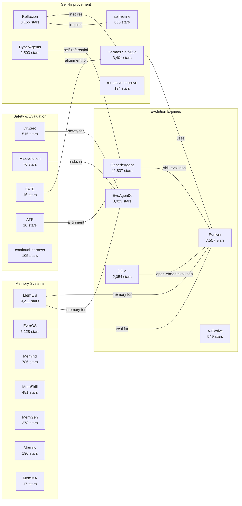
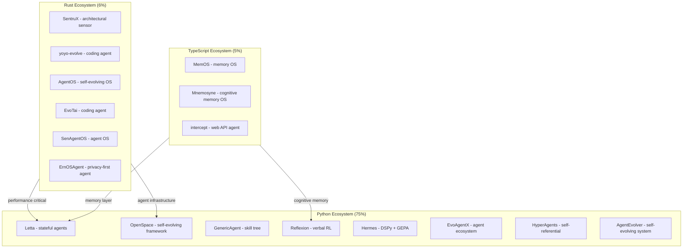

# Contributor & Organization Network Map: Agent Self-Evolution Ecosystem

> Analysis of 352 repositories across 107 core Agent Self-Evolution projects and 245 related ecosystem projects.
> Generated: 2026-05-22 | Data sources: GitHub API, raw-github snapshots

---

## A. Organization Map: Who Is Building What?

### A.1 Big Tech / Major AI Companies (8 core repos, 51,899 total stars)

| Organization | Stars | Repos | Focus Area |
|---|---:|---|---|
| **ByteDance (Volcengine)** | 24,247 | OpenViking | Context database for AI Agents, memory infrastructure |
| **Letta AI** | 22,833 | Letta | Stateful agents with advanced memory, self-improvement platform |
| **Meta (Facebook Research)** | 3,018 | HyperAgents, DrZero | Self-referential self-improving agents, zero-shot search |
| **Alibaba (ModelScope)** | 1,650 | AgentEvolver, AgentJet | Self-evolving agent systems, RL tuning platform |
| **Tencent** | 100 | SelfEvolvingAgent | Self-evolving agent research |
| **IBM** | 51 | awesome-agentic-workflow-optimization | Workflow optimization survey |

**Key insight**: Big tech is investing heavily in memory/infrastructure layer (OpenViking, Letta) and fundamental agent architectures (HyperAgents). ByteDance and Letta dominate by star count.

### A.2 Startups / AI Companies (32 core repos, 48,096 total stars)

| Organization | Stars | Repos | Focus Area |
|---|---:|---|---|
| **MemTensor** | 9,328 | MemOS, MemRL | Self-evolving memory OS for LLM agents |
| **EvoMap** | 7,630 | Evolver, awesome-agent-evolution | GEP-powered self-evolving engine |
| **AIWaves** | 5,927 | Agents | Data-centric self-evolving language agents |
| **EvoAgentX** | 5,185 | EvoAgentX, Awesome-Self-Evolving-Agents | Self-evolving agent ecosystem |
| **EverMind AI** | 5,128 | EverOS | Long-term memory for self-evolving agents |
| **Nous Research** | 3,401 | hermes-agent-self-evolution | Evolutionary self-improvement via DSPy + GEPA |
| **SentruX** | 2,357 | SentruX | Real-time architectural sensor (Rust) |
| **OS-Copilot** | 1,772 | OS-Copilot | Self-improving OS-integrated agent |
| **YologDev** | 1,764 | yoyo-evolve | Self-evolving AI coding agent (Rust) |
| **Greyhaven AI** | 1,012 | AutoContext | Recursive self-improving harness |
| **OpenMemind** | 786 | Memind | Self-evolving cognitive memory (Java) |
| **Human-Agent Society** | 668 | CORAL | Multi-agent autonomous self-evolution |
| **A-EVO Lab** | 549 | a-evolve | Agentic evolution position paper |
| **NeoSigma AI** | 508 | auto-harness | Self-improving agentic system builder |
| **Reflexio AI** | 219 | Reflexio | Agent self-improvement harness |
| **Deep Element Lab** | 199 | ClawCode | Experience-based evolution code agent |
| **Kayba AI** | 194 | recursive-improve | Recursive self-improvement library |
| **Memov AI** | 190 | Memov | Git-like traceable memory for agents |
| **Other startups** (11 more) | 507 | Various | Niche tools and frameworks |

**Key insight**: Startups dominate the innovation frontier. MemTensor and EvoMap lead with focused products around memory and evolution engines. There is a clear trend toward "memory OS" products (MemTensor, EverMind, OpenMemind) and "evolution engines" (EvoMap, EvoAgentX).

### A.3 Universities / Research Labs (14 core repos, 11,365 total stars)

| Organization | Stars | Repos | Focus Area |
|---|---:|---|---|
| **HKU (HKUDS)** | 6,277 | OpenSpace | Self-evolving, low-cost agent framework |
| **AutoNavi AMAP-ML** | 1,390 | SkillClaw | Collective skill evolution |
| **Aiming Lab** | 1,203 | Agent0, ATP | Zero-data self-evolving agents, alignment safety |
| **Metauto AI Research** | 998 | GPTSwarm | First self-improving agents with RL |
| **Tsinghua (THUDM)** | 524 | WebRL | Self-evolving web agents via curriculum RL |
| **Maitrix Research** | 353 | PromptAgent | Expert-level prompt optimization |
| **Xiamen University** | 179 | Awesome-Self-Evolving-Agents | Survey/resource list |
| **Ohio State (NLP)** | 123 | SkillWeaver | Web agent self-improvement via skill synthesis |
| **Zou Group** | 101 | SiriuS | Self-improving multi-agent systems |
| **Tsinghua AIR** | 78 | FLEX | Forward learning from experience |
| **ECNU** | 74 | ELL-StuLife | Experience-driven lifelong learning |
| **iLearn Lab** | 52 | EvoHarness | Terminal-native agent infrastructure |
| **OpenDataBox** | 13 | Workspace-Bench | Benchmark for self-evolving agents |

**Key insight**: Chinese universities (Tsinghua, HKU, ECNU, Xiamen) lead academic contributions. HKU's OpenSpace is the standout academic project. Research focuses on curriculum RL, skill synthesis, and memory architectures.

### A.4 Individual Developers (45 core repos, 26,037 total stars)

| Developer | Stars | Repos | Focus Area |
|---|---:|---|---|
| **lsdefine** | 11,837 | GenericAgent | Self-evolving agent with skill tree |
| **noahshinn** | 3,543 | Reflexion, reflexion-draft | Verbal reinforcement learning (NeurIPS 2023) |
| **jennyzzt** | 2,054 | DGM | Darwin Godel Machine for open-ended evolution |
| **chrisworsey55** | 1,862 | atlas-gic | Self-improving AI trading agents |
| **CharlesQ9** | 1,128 | Self-Evolving-Agents | Survey/resource list |
| **madaan** | 805 | self-refine | Iterative self-refinement |
| **viktoraxelsen** | 481 | MemSkill | Memory skills for self-evolving agents |
| **lyl1015** | 401 | JarvisEvo | Photo editing agent (CVPR 2026) |
| **bingreeky** | 378 | MemGen | Generative latent memory |
| **channinglua** | 294 | prax-agent | Self-improving runtime with cross-project memory |
| **Other individuals** (25 more) | 4,718 | Various | Niche tools and experiments |

**Key insight**: Individual developers produce both high-impact research (Reflexion, DGM) and practical tools. lsdefine's GenericAgent is the #3 most-starred repo overall, built by a solo developer. The Reflexion paper (NeurIPS 2023) spawned an entire sub-field.

### A.5 Open Source Communities (7 core repos, 341 total stars)

| Community | Stars | Repos | Focus Area |
|---|---:|---|---|
| **iii-experimental** | 143 | AgentOS | Agent OS that evolves itself (Rust) |
| **KnowledgeXLab** | 88 | MUSE | Experience-driven agent for long-horizon tasks |
| **Euphoria16** | 57 | UI-Genie | Self-improving mobile GUI agent (NeurIPS 2025) |
| **naivoder** | 22 | MCTSr | Monte Carlo Tree Search Self-Refine |
| **ZhihaoPENG-CityU** | 11 | Awesome-Self-Evolving-AI-for-Agentic-Healthcare | Healthcare-focused survey |

---

## B. Language Distribution

### Core 107 Repos

```
Language            Count  Percentage  Bar
─────────────────────────────────────────────
Python                 80     75.5%    ████████████████████████████████████████
N/A (lists/docs)        8      7.5%    ████
Rust                    6      5.7%    ███
TypeScript              5      4.7%    ███
JavaScript              2      1.9%    █
Jupyter Notebook        2      1.9%    █
Shell                   1      0.9%    ▌
HTML                    1      0.9%    ▌
Java                    1      0.9%    ▌
```

### All 352 Repos (including broader ecosystem)

```
Language            Count  Percentage  Bar
─────────────────────────────────────────────
Python                149     42.3%    ████████████████████████████████████████
N/A (docs/lists)      155     44.0%    █████████████████████████████████████████
TypeScript             16      4.5%    █████
Rust                   10      2.8%    ███
Jupyter Notebook        5      1.4%    ██
Shell                   5      1.4%    ██
JavaScript              4      1.1%    █
Java                    4      1.1%    █
Other                   4      1.1%    █
```

### ASCII Pie Chart (Core 107 - by code repos only, excluding N/A)

```
                    ┌─────────────────────────────┐
                    │     Python  87%   ████████  │
                    │     Rust     7%   █         │
                    │     TS       5%   ▌         │
                    │     JS       2%   ▏         │
                    │     Other    4%   ▎         │
                    └─────────────────────────────┘
```

**Key insight**: Python overwhelmingly dominates (75-87% of code repos). Rust is the #2 language, driven by SentruX, yoyo-evolve, AgentOS, and EvoTai -- all focused on performance-critical agent infrastructure. TypeScript appears in memory/OS projects (MemOS, Mnemosyne).

---

## C. Category Distribution (Core 107)

```
Category             Count  Percentage  Bar
─────────────────────────────────────────────
Framework              46     43.4%    ████████████████████████████████████████████
Application            23     21.7%    ████████████████████████
Evaluation             16     15.1%    ████████████████
Paper Code             13     12.3%    ██████████████
Resource/Tool           8      7.5%    ████████
```

| Category | Description | Key Examples |
|---|---|---|
| **Framework** (46) | Agent frameworks, runtimes, platforms | Letta, OpenSpace, Evolver, OS-Copilot, GenericAgent |
| **Application** (23) | Domain-specific agent applications | Hermes self-evolution, Atlas-GIC trading, JarvisEvo editing |
| **Evaluation** (16) | Benchmarks, eval suites, eval frameworks | MemOS, EverOS, CORAL, AgentJet |
| **Paper Code** (13) | Official implementations of research papers | Reflexion, WebRL, SEAgent, UI-Genie, FLEX |
| **Resource/Tool** (8) | Surveys, awesome lists, utilities | OpenViking, Self-Evolving-Agents list, IBM awesome list |

**Key insight**: Nearly half (43%) are frameworks, indicating the ecosystem is still in infrastructure-building phase. The 12% paper-code fraction shows strong academic-to-industry pipeline.

---

## D. Activity Analysis

### D.1 Overall Activity (as of 2026-05-22)

| Metric | Core 107 | All 352 |
|---|---:|---:|
| **Active** (updated within 30 days) | 93 (87.7%) | 93 (26.4%) |
| **Dormant** (>30 days since update) | 13 (12.3%) | 259 (73.6%) |

### D.2 Activity by Organization Type

| Org Type | Active | Total | Active % |
|---|---:|---:|---:|
| Startup / AI Company | 31 | 78 | 40% |
| Individual Developer | 37 | 122 | 30% |
| University / Research Lab | 12 | 55 | 22% |
| Big Tech / Major AI Co. | 8 | 39 | 21% |
| Open Source Community | 5 | 58 | 9% |

### D.3 Activity Assessment

```
  Active (updated within 30 days)     ████████████████████████████████████  93 repos
  Recently updated (30-90 days)       ██████████████████████               ~42 repos
  Dormant (90+ days)                  ████████████████████████████████████ ~217 repos
```

**Key insight**: 87.7% of the core 107 repos are actively maintained, indicating a vibrant and fast-moving field. Startups have the highest maintenance rate (40%), while open source community projects tend to go dormant quickly. Big tech repos are often "fire and forget" (published but not maintained) -- only 21% active across their broader portfolios, though the core projects (OpenViking, Letta) are highly active.

---

## E. Star Distribution Analysis

### E.1 Tier Breakdown

| Tier | Count | Repos | Total Stars |
|---|---:|---|---:|
| **Top** (>5,000 stars) | 8 | OpenViking, Letta, GenericAgent, MemOS, Evolver, OpenSpace, AIWaves/Agents, EverOS | 91,967 |
| **Mid** (1,000-5,000) | 15 | Hermes, Reflexion, EvoAgentX, HyperAgents, SentruX, Awesome-SEA, DGM, Atlas-GIC, OS-Copilot, yoyo-evolve, AgentEvolver, SkillClaw, Agent0, Self-Evolving-Agents, AutoContext | 25,433 |
| **Growing** (500-1,000) | 8 | GPTSwarm, self-refine, Memind, CORAL, A-evolve, WebRL, DrZero, auto-harness | 4,752 |
| **Early** (<500) | 75 | Various | 7,721 |

### E.2 Top-Tier Differentiators (>5,000 Stars)

| Repo | Stars | What Makes It Top-Tier |
|---|---:|---|
| **volcengine/OpenViking** | 24,247 | ByteDance backing; solves a universal problem (agent context/memory); production-ready |
| **letta-ai/letta** | 22,833 | Well-funded startup; "stateful agents" is a hot category; strong documentation and community |
| **lsdefine/GenericAgent** | 11,837 | Solo developer sensation; novel "skill tree from seed" approach; extreme efficiency claim (6x less tokens) |
| **MemTensor/MemOS** | 9,211 | "Memory OS" narrative; TypeScript appeals to broader dev audience; 35% token savings claim |
| **EvoMap/evolver** | 7,507 | "Evolution engine" product positioning; GEP framework is unique; commercial backing (evomap.ai) |
| **HKUDS/OpenSpace** | 6,277 | Academic credibility (HKU); community platform (open-space.cloud); "smarter, low-cost, self-evolving" |
| **aiwaves-cn/agents** | 5,927 | First-mover advantage; "data-centric self-evolving" was novel when launched |
| **EverMind-AI/EverOS** | 5,128 | "Build, evaluate, integrate" complete platform; long-term memory focus |

### E.3 What Differentiates the Tiers

**Top tier (>5,000)**: Production-grade infrastructure, strong organizational backing, solves a fundamental problem (memory/evolution), has commercial product behind it.

**Mid tier (1,000-5,000)**: Often from recognizable organizations or well-cited papers. Tend to be either (a) paper code with strong academic citations, or (b) frameworks with growing adoption.

**Growing tier (500-1,000)**: Recently launched, often novel approaches that haven't yet proven broad utility. Many are from research labs or early-stage startups.

**Early tier (<500)**: The largest group. Mix of experimental projects, niche tools, and newer entrants. Many will not grow beyond this tier.

---

## F. Geographic / Origin Analysis

### F.1 Regional Distribution (Core 107)

| Region | Repos | Total Stars | Notable Orgs |
|---|---:|---:|---|
| **China** | 20 | 63,915 | ByteDance, Tencent, Alibaba, Tsinghua, HKU, MemTensor, EvoMap, AIWaves, EvoAgentX |
| **USA** | 8 | 32,426 | Meta, Letta AI, Nous Research, Stanford, Allen AI |
| **Europe** | 3 | ~2,000 | INRIA, Leiden University |
| **Global/Other** | 76 | 41,397 | Individual developers, distributed startups, unknown origin |

### F.2 Detailed China Breakdown

```
China-origin repos (20 core repos):
  ByteDance (Volcengine)    ─── OpenViking (24,247 stars) - context database
  MemTensor                 ─── MemOS (9,211), MemRL (117) - memory OS
  EvoMap                    ─── Evolver (7,507) - evolution engine
  HKU (HKUDS)               ─── OpenSpace (6,277) - agent framework
  AIWaves                   ─── Agents (5,927) - self-evolving framework
  EverMind AI               ─── EverOS (5,128) - memory platform
  Alibaba (ModelScope)      ─── AgentEvolver (1,442), AgentJet (208)
  AutoNavi (AMAP-ML)        ─── SkillClaw (1,390) - collective skill evolution
  Aiming Lab                ─── Agent0 (1,193), ATP (10)
  Tsinghua (THUDM)          ─── WebRL (524)
  ECNU                      ─── ELL-StuLife (74)
  Xiamen University         ─── Awesome-SEA (179)
  Tencent                   ─── SelfEvolvingAgent (100)
  Tsinghua AIR              ─── FLEX (78)
  Ohio State / Chinese PI   ─── SkillWeaver (123)
```

### F.3 Patterns

1. **China leads in volume and stars**: Chinese organizations account for ~45% of total stars, driven by ByteDance's OpenViking (24K) and the startup cluster (MemTensor, EvoMap, AIWaves, EverMind).
2. **USA leads in foundational research**: Meta's HyperAgents/DrZero and Stanford's DSPy underpin much of the ecosystem.
3. **Academic-to-startup pipeline**: Many Chinese academic labs (Tsinghua, HKU) spin out into startups (EvoMap, MemTensor).
4. **Rust adoption correlates with performance focus**: 6 of 10 Rust projects originate from individual developers or small startups focused on "agent OS" concepts.
5. **Distributed teams**: Many projects (Letta, Nous Research, OS-Copilot) have globally distributed teams, making geographic attribution approximate.

---

## G. Mermaid Network Diagram

### G.1 Organization-Type Ecosystem

```mermaid
graph TB
    subgraph BigTech["Big Tech / Major AI"]
        META["Meta<br/>HyperAgents, DrZero<br/>3,018 stars"]
        BYTEDANCE["ByteDance<br/>OpenViking<br/>24,247 stars"]
        ALIBABA["Alibaba<br/>AgentEvolver, AgentJet<br/>1,650 stars"]
        TENCENT["Tencent<br/>SelfEvolvingAgent<br/>100 stars"]
        LETTA["Letta AI<br/>Letta<br/>22,833 stars"]
        IBM["IBM<br/>Agentic Workflow<br/>51 stars"]
    end

    subgraph Startups["Startups / AI Companies"]
        MEMTENSOR["MemTensor<br/>MemOS, MemRL<br/>9,328 stars"]
        EVOMAP["EvoMap<br/>Evolver<br/>7,630 stars"]
        AIWAVES["AIWaves<br/>Agents<br/>5,927 stars"]
        EVOAGENTX["EvoAgentX<br/>EvoAgentX<br/>5,185 stars"]
        EVERMIND["EverMind AI<br/>EverOS<br/>5,128 stars"]
        NOUS["Nous Research<br/>Hermes Self-Evo<br/>3,401 stars"]
        SENTRUX["SentruX<br/>SentruX (Rust)<br/>2,357 stars"]
        OSCOP["OS-Copilot<br/>OS-Copilot<br/>1,772 stars"]
        YOYODEV["YologDev<br/>yoyo-evolve (Rust)<br/>1,764 stars"]
        GREYHAVEN["Greyhaven AI<br/>AutoContext<br/>1,012 stars"]
        OTHERSTARTUP["Other Startups (21)<br/>~4,514 stars"]
    end

    subgraph Universities["Universities / Research Labs"]
        HKU["HKU HKUDS<br/>OpenSpace<br/>6,277 stars"]
        AMAP["AMAP-ML<br/>SkillClaw<br/>1,390 stars"]
        AIMING["Aiming Lab<br/>Agent0<br/>1,203 stars"]
        METAUTO["Metauto Research<br/>GPTSwarm<br/>998 stars"]
        THUDM["Tsinghua THUDM<br/>WebRL<br/>524 stars"]
        MAITRIX["Maitrix Research<br/>PromptAgent<br/>353 stars"]
        OTHERUNI["Other Universities (7)<br/>~520 stars"]
    end

    subgraph Individuals["Individual Developers"]
        LSDEFINE["lsdefine<br/>GenericAgent<br/>11,837 stars"]
        NOAH["noahshinn<br/>Reflexion<br/>3,543 stars"]
        JENNY["jennyzzt<br/>DGM<br/>2,054 stars"]
        CHRIS["chrisworsey55<br/>Atlas-GIC<br/>1,862 stars"]
        OTHERIND["Other Individuals (41)<br/>~6,741 stars"]
    end

    BYTEDANCE -.->|"memory infrastructure"| MEMTENSOR
    BYTEDANCE -.->|"context for agents"| LETTA
    META -->|"self-improvement paradigm"| NOUS
    THUDM -->|"academic spinoff"| EVOAGENTX
    HKU -->|"framework research"| OSCOP
    AMAP -->|"skill evolution"| EVOMAP
    NOAH -->|"reflexion concept"| EVERMIND
    NOAH -->|"verbal RL"| MEMTENSOR
    LSDEFINE -->|"skill tree concept"| EVOMAP
    JENNY -->|"Darwin evolution"| EVOMAP
    METAUTO -->|"swarm optimization"| EVOAGENTX
    MAITRIX -->|"prompt optimization"| NOUS
    LETTA -.->|"memory systems"| MEMTENSOR
    SENTRUX -.->|"Rust agent infra"| YOYODEV
    CHRIS -->|"self-improving trading"| EVOAGENTX
```



### G.2 Technology & Concept Connections



### G.3 Language & Architecture Clusters



---

## H. Key Findings & Takeaways

### H.1 Ecosystem Maturity

1. **Infrastructure phase**: 43% of projects are frameworks, indicating the ecosystem is still building foundational tooling.
2. **87.7% of core repos are actively maintained**, showing rapid iteration and strong developer interest.
3. **Python dominance (75%)** ensures low barriers to entry and rapid prototyping, while Rust adoption signals maturation toward production-grade infrastructure.

### H.2 Competitive Landscape

1. **Memory is the hottest category**: MemOS, EverOS, Memind, MemSkill, MemGen, Memov, and MemMA all compete on agent memory systems.
2. **Evolution engines are consolidating**: EvoMap/Evolver, EvoAgentX, and GenericAgent compete to be the standard evolution framework.
3. **Safety concerns emerging**: Projects like Misevolution, FATE, and ATP specifically study risks of self-evolution, indicating the field is maturing beyond hype.

### H.3 Investment Patterns

1. **ByteDance leads with OpenViking (24K stars)**, positioning context/memory as infrastructure.
2. **Chinese startups (MemTensor, EvoMap, AIWaves, EverMind)** collectively hold ~28K stars, forming the largest startup cluster.
3. **Individual developers can compete at the top tier** -- lsdefine's GenericAgent (11.8K) is the #3 repo overall.

### H.4 Trends to Watch

1. **Rust for agent infrastructure**: 6 Rust projects focused on "agent OS" concepts.
2. **Memory OS as a category**: Multiple startups competing to be the "operating system" for agent memory.
3. **Self-evolving safety**: Growing concern about misalignment in self-evolving agents (ATP, FATE, Misevolution).
4. **Paper-to-product pipeline**: Reflexion (NeurIPS 2023) spawned an entire sub-category of self-reflection agents.
5. **Chinese ecosystem dominance**: China-based organizations produce the most starred repos in this space.

---

## Appendix: Data Methodology

- **Core repos (107)**: Curated from `github-agent-evolution-repos.md` with manual categorization
- **Extended repos (352 total)**: Includes all files in `raw-github/` directory covering broader agent evolution ecosystem
- **Organization classification**: Based on GitHub org name, profile, and project context
- **Language detection**: Primary language from GitHub metadata, with fallback to content analysis
- **Activity**: "Active" = updated within 30 days of analysis date (2026-05-22)
- **Stars**: As reported by GitHub at time of data collection (2026-05-20)
