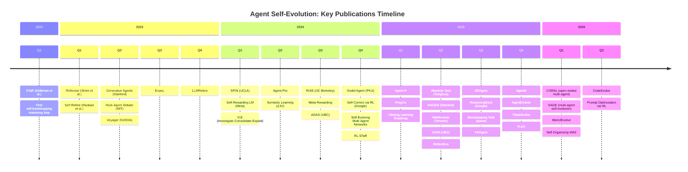

# Paper-Repo Linkage Analysis: Agent Self-Evolution Ecosystem

> Generated: 2026-05-22
> Corpus: 98 unique arXiv papers (raw-papers/), 352 GitHub repos (raw-github/), 8 survey chapters (survey/)

---

## 1. Direct Linkage Map: Papers <-> Repos

### 1.1 Confirmed Paper-to-Repo Mappings (28 links)

These are papers that explicitly mention GitHub repos in their paper text, or repos that explicitly cite specific arXiv papers from our collection.

| Paper (arXiv) | Method Name | Official Repo | Additional Community Repos |
|---|---|---|---|
| 2303.11366 | Reflexion | `noahshinn/reflexion` (3.2k stars) | `noahshinn024/reflexion-human-eval`, `kargarisaac/reflexion`, `faveos8758/reflexion-agent-ts` |
| 2303.17651 | Self-Refine | `madaan/self-refine` (805 stars) | -- |
| 2305.16291 | Voyager | (NVIDIA/code not in corpus) | -- |
| 2401.01335 | SPIN | `self-play-language-models/spin-peft` | `uclaml/SPIN` (mentioned in paper) |
| 2401.10020 | Self-Rewarding LM | -- | `oxen-ai/self-rewarding-language-models` |
| 2406.18532 | Symbolic Learning | `aiwaves-cn/agents` (5.9k stars) | -- |
| 2406.07496 | TextGrad | `zou-group/textgrad` (3.6k stars) | `polya20/textgrad`, `thesdes/textgrad`, `zixuanfeng-nyu_textgrad`, `llmprogram_textgrad` |
| 2408.08435 | ADAS | (code at website) | -- |
| 2409.18382 | CurricuLLM | `labicon/curricullm` | -- |
| 2410.04444 | Godel Agent | `arvid-pku/godel_agent` | -- |
| 2411.02337 | WebRL | `thudm/webrl` (524 stars) | -- |
| 2504.20073 | RAGEN | `RAGEN-AI/RAGEN` (mentioned in paper) | -- |
| 2504.21024 | WebEvolver | `tencent/selfevolvingagent` | -- |
| 2505.22954 | Darwin Godel Machine | `jennyzzt/dgm` (2.1k stars) | -- |
| 2506.24119 | SPIRAL | `spiral-rl/spiral` | -- |
| 2507.19457 | GEPA | `gepa-ai/gepa` (4.5k stars) | `alberto-codes/gepa-adk`, `developzir/gepa-mcp`, `studio-intrinsic/turbo-gepa` |
| 2508.02085 | SE-Agent | `JARVIS-Xs/SE-Agent` (mentioned in paper) | `jarvis-xs/se-agent` |
| 2508.04700 | SEAgent | `sunzey/seagent` | -- |
| 2509.25140 | ReasoningBank | `google-research/reasoning-bank` | -- |
| 2509.26354 | Misevolution | `shaoshuai0605/misevolution` | -- |
| 2510.06056 | DeepEvolve | `liugangcode/deepevolve` | -- |
| 2510.14253 | Agentic Self-Learning | `forangel2014/Towards-Agentic-Self-Learning` | -- |
| 2510.16079 | EvolveR | `Edaizi/EvolveR` | -- |
| 2511.06449 | FLEX | `gensi-thuair/flex` | -- |
| 2511.10395 | AgentEvolver | `modelscope/agentevolver` (1.4k stars) | -- |
| 2511.16043 | Agent0 | `aiming-lab/agent0` (1.2k stars) | -- |
| 2511.23473 | ThetaEvolve | `ypwang61/ThetaEvolve` | -- |
| 2602.02474 | MemSkill | `viktoraxelsen/memskill` (482 stars) | -- |
| 2603.19461 | HyperAgents | `facebookresearch/hyperagents` (2.5k stars) | -- |
| 2604.01658 | CORAL | `human-agent-society/coral` (669 stars) | -- |

### 1.2 Mermaid Bipartite Graph: Paper-Repo Connections

```mermaid
graph LR
    subgraph Papers
        P1["2303.11366<br/>Reflexion"]
        P2["2303.17651<br/>Self-Refine"]
        P3["2401.01335<br/>SPIN"]
        P4["2401.10020<br/>Self-Rewarding LM"]
        P5["2406.18532<br/>Symbolic Learning"]
        P6["2406.07496<br/>TextGrad"]
        P7["2408.08435<br/>ADAS"]
        P8["2410.04444<br/>Godel Agent"]
        P9["2411.02337<br/>WebRL"]
        P10["2504.21024<br/>WebEvolver"]
        P11["2505.22954<br/>DGM"]
        P12["2506.24119<br/>SPIRAL"]
        P13["2507.19457<br/>GEPA"]
        P14["2508.02085<br/>SE-Agent"]
        P15["2508.04700<br/>SEAgent"]
        P16["2509.25140<br/>ReasoningBank"]
        P17["2511.06449<br/>FLEX"]
        P18["2511.10395<br/>AgentEvolver"]
        P19["2511.16043<br/>Agent0"]
        P20["2511.23473<br/>ThetaEvolve"]
        P21["2604.01658<br/>CORAL"]
        P22["2603.19461<br/>HyperAgents"]
        P23["2602.02474<br/>MemSkill"]
    end

    subgraph Repos
        R1["noahshinn/reflexion<br/>3.2k stars"]
        R2["madaan/self-refine<br/>805 stars"]
        R3["spin-peft<br/>(SPIN)"]
        R4["oxen-ai/self-rewarding-lm"]
        R5["aiwaves-cn/agents<br/>5.9k stars"]
        R6["zou-group/textgrad<br/>3.6k stars"]
        R7["arvid-pku/godel_agent"]
        R8["thudm/webrl<br/>524 stars"]
        R9["tencent/selfevolvingagent"]
        R10["jennyzzt/dgm<br/>2.1k stars"]
        R11["spiral-rl/spiral"]
        R12["gepa-ai/gepa<br/>4.5k stars"]
        R13["JARVIS-Xs/SE-Agent"]
        R14["sunzey/seagent"]
        R15["google-research/reasoning-bank"]
        R16["gensi-thuair/flex"]
        R17["modelscope/agentevolver<br/>1.4k stars"]
        R18["aiming-lab/agent0<br/>1.2k stars"]
        R19["ypwang61/ThetaEvolve"]
        R20["human-agent-society/coral<br/>669 stars"]
        R21["facebookresearch/hyperagents<br/>2.5k stars"]
        R22["viktoraxelsen/memskill<br/>482 stars"]
    end

    P1 --> R1
    P2 --> R2
    P3 --> R3
    P4 --> R4
    P5 --> R5
    P6 --> R6
    P8 --> R7
    P9 --> R8
    P10 --> R9
    P11 --> R10
    P12 --> R11
    P13 --> R12
    P14 --> R13
    P15 --> R14
    P16 --> R15
    P17 --> R16
    P18 --> R17
    P19 --> R18
    P20 --> R19
    P21 --> R20
    P22 --> R21
    P23 --> R22
```

### 1.3 Repos That Cite Papers But Are Not Official Implementations

| Repo | Cited Paper(s) | Relationship |
|---|---|---|
| `charlesq9/self-evolving-agents` | 2303.11366, 2303.17651 (Reflexion, Self-Refine) | Awesome list referencing seminal works |
| `evomap/awesome-agent-evolution` (18.4k stars) | Multiple papers | Curated collection of agent evolution resources |
| `evoagentx/awesome-self-evolving-agents` (2.2k stars) | 2203.14465, 2203.07281, etc. | Curated paper list |
| `evoagentx/evoagentx` (3k stars) | 2507.03616, 2508.07407 | Implementation framework |
| `xmudeeplit/awesome-self-evolving-agents` | 2203.11171, 2304.05128, etc. | Curated paper list |
| `yxf203/awesome-efficient-agents` | 2305.10250, 2308.10144 (ExpeL) | Curated paper list |
| `shichun-liu/agent-memory-paper-list` (2k stars) | 2303.11366, 2304.03442 | Memory-focused paper list |
| `yennning/awesome-code-as-agent-harness-papers` | Multiple code-agent papers | Code-agent harness paper list |
| `stanfordnlp/dspy` (34.5k stars) | 2212.14024, 2310.03714 (DSPy) | Official framework |
| `swe-agent/swe-agent` (19.3k stars) | 2405.15793 (SWE-agent) | Official implementation |
| `sakanaai/ai-scientist` (13.7k stars) | 2408.06292 (AI Scientist) | Official implementation |
| `jarvis-xs/se-agent` | 2508.02085, 2505.21577 | References SE-Agent paper |
| `inclusionai/aworld` (1.2k stars) | Multiple papers | Agent framework with academic backing |
| `inclusionai/agenticlearning` | Multiple self-evolving agent papers | Learning framework |

---

## 2. Method Genealogy: Family Tree of Methods

### 2.1 Influence Chain Diagram

```mermaid
graph TD
    subgraph "2022 - Foundation"
        STAR["STaR<br/>2203.14465<br/>'22 Zelikman et al.<br/>Bootstrapping reasoning"]
    end

    subgraph "2023 - First Wave"
        REFLEX["Reflexion<br/>2303.11366<br/>Shinn et al. / Northeastern+Princeton"]
        SELFREF["Self-Refine<br/>2303.17651<br/>Madaan et al. / AI2+CMU"]
        GENAG["Generative Agents<br/>2304.03442<br/>Stanford"]
        DEBATE["Multi-Agent Debate<br/>2305.14325<br/>MIT"]
        VOYAGER["Voyager<br/>2305.16291<br/>NVIDIA+Caltech"]
    end

    subgraph "2024 Q1 - Self-Reward & Self-Play"
        SPIN["SPIN<br/>2401.01335<br/>UCLA"]
        SELFREW["Self-Rewarding LM<br/>2401.10020<br/>Meta FAIR"]
        ICE["ICE<br/>2401.13996"]
    end

    subgraph "2024 Q2-Q3 - Systematization"
        AGENTPRO["Agent-Pro<br/>2402.17574"]
        RISE["RISE<br/>2407.18219<br/>UC Berkeley"]
        METAREW["Meta-Rewarding<br/>2407.19594"]
        ADAS["ADAS<br/>2408.08435<br/>UBC+OVH"]
        SYMB["Symbolic Learning<br/>2406.18532<br/>ZJU"]
    end

    subgraph "2024 Q4 - Architecture Search"
        GODEL["Godel Agent<br/>2410.04444<br/>Peking+UCSB"]
        ALGOSELF["Algorithm Discovery<br/>2410.15639<br/>Sony"]
        SELFCORRECT["Self-Correct via RL<br/>2409.12917<br/>Google"]
        EVOMAC["EvoMAC<br/>2410.16946"]
    end

    subgraph "2025 Q1 - Training + Reflection"
        AGENTR["Agent-R<br/>2501.11425"]
        PROGCO["ProgCo<br/>2501.01264"]
        RAGEN["RAGEN<br/>2504.20073<br/>Stanford+UW"]
    end

    subgraph "2025 Q2 - Self-Play & Zero Data"
        ABSZERO["Absolute Zero<br/>2505.03335<br/>Tsinghua"]
        DGM["DGM<br/>2505.22954<br/>UBC+OVH"]
        ALPHA["AlphaEvolve<br/>2506.13131<br/>Google DeepMind"]
        SPIRAL["SPIRAL<br/>2506.24119"]
    end

    subgraph "2025 Q3-Q4 - Maturation"
        SEAGENT["SEAgent<br/>2508.04700"]
        WEBRL["WebRL<br/>2411.02337<br/>THUDM"]
        AGENTEV["AgentEvolver<br/>2511.10395"]
        AGENT0["Agent0<br/>2511.16043"]
        THETAEV["ThetaEvolve<br/>2511.23473"]
    end

    subgraph "2026 - Open-Ended & Multi-Agent"
        CORAL["CORAL<br/>2604.01658"]
        SAGE["SAGE<br/>2603.15255"]
        MEM2EV["Mem2Evolve<br/>2604.10923"]
    end

    %% Key influence arrows
    STAR --> REFLEX
    STAR --> SELFREF
    STAR --> SELFREW
    REFLEX --> VOYAGER
    REFLEX --> EXPEL["ExpeL<br/>2308.10144"]
    SELFREF --> AGENTPRO
    REFLEX --> AGENTR
    REFLEX --> RISE
    GENAG --> VOYAGER
    DEBATE --> EVOMAC
    SPIN --> ABSZERO
    SELFREW --> METAREW
    SELFREW --> RAGEN
    ADAS --> DGM
    GODEL --> DGM
    ADAS --> ALPHA
    SYMB --> AGENT0
    VOYAGER --> WEBRL
    RAGEN --> SPIRAL
    ALPHA --> THETAEV
    DGM --> AGENTEV
    REFLEX --> AGENTEV
    SELFCORRECT --> AGENTR
    ICE --> EVOLVER["EvolveR<br/>2510.16079"]
    EXPEL --> REASONBANK["ReasoningBank<br/>2509.25140"]
    VOYAGER --> CORAL
    DGM --> CORAL
```

### 2.2 Key Lineage Chains

**Chain 1: Reflexion -> Voyager -> WebRL -> SEAgent**
- Reflexion (2023): Verbal reinforcement learning via language-based self-reflection
- Voyager (2023): Extended Reflexion with executable skill library in Minecraft
- WebRL (2024): Self-evolving curriculum RL for web agents (THUDM)
- SEAgent (2025): Self-evolving computer use agent with autonomous learning

**Chain 2: STaR -> Self-Rewarding -> Meta-Rewarding -> RAGEN**
- STaR (2022): Bootstrapping reasoning via self-generated rationales
- Self-Rewarding LM (2024): Model generates and evaluates its own outputs, iterative DPO (Meta)
- Meta-Rewarding (2024): Adds meta-judge to evaluate the evaluator
- RAGEN (2025): Multi-turn RL for agent self-evolution, StarPO framework (Stanford)

**Chain 3: ADAS -> Godel Agent -> DGM -> CORAL**
- ADAS (2024): Automated search over agent architectures in Python code space (UBC)
- Godel Agent (2024): Runtime self-modification via monkey-patching (PKU)
- DGM (2025): Open-ended archive of self-modifying coding agents (UBC+OVH)
- CORAL (2026): Autonomous multi-agent evolution for open-ended discovery

**Chain 4: SPIN -> Absolute Zero -> SPIRAL**
- SPIN (2024): Self-play fine-tuning, weak-to-strong via self-debate (UCLA)
- Absolute Zero (2025): Zero external data, model generates own tasks (Tsinghua)
- SPIRAL (2025): Multi-agent multi-turn RL via zero-sum games

**Chain 5: Evolutionary Computing + LLM -> AlphaEvolve -> DeepEvolve/ThetaEvolve**
- FunSearch/AlphaEvolve (2025): LLM as evolutionary mutation operator (Google DeepMind)
- DeepEvolve (2025): Augmenting AlphaEvolve with deep research
- ThetaEvolve (2025): Test-time learning on open problems

---

## 3. Academic vs Engineering Gap

### 3.1 Statistics

| Category | Count | Notes |
|---|---|---|
| Total unique papers | 98 | From raw-papers/ (deduped by arXiv ID) |
| Papers with code repos mentioned | 16 | ~16% of papers explicitly link to GitHub |
| Papers with repos in our corpus | 12 | ~12% have repos that were collected |
| Total repos | 352 | From raw-github/ |
| Repos citing any arXiv paper | 155 | 44% of repos |
| Repos citing papers in our collection | 47 | 13% of repos |
| Repos with no paper linkage | 197 | 56% of repos |
| Awesome-list repos | 59 | Curated paper/resource collections |
| Framework/tool repos | 233 | Implementation or infrastructure |

### 3.2 Papers WITH Code vs Papers WITHOUT Code

**Papers with code (confirmed):** Reflexion, Self-Refine, SPIN, Self-Rewarding LM, Symbolic Learning, TextGrad, ADAS, Godel Agent, WebRL, CurricuLLM, RAGEN, WebEvolver, DGM, SPIRAL, GEPA, SE-Agent, SEAgent, ReasoningBank, EvolveR, Agent0, AgentEvolver, FLEX, ThetaEvolve, MemSkill, CORAL, HyperAgents, AlphaEvolve (internal Google)

**Papers WITHOUT public code (prominent):** Voyager (NVIDIA, partial), Absolute Zero, Meta-Rewarding, IterAlign, Multi-Agent Debate, ExpeL, Generative Agents, Agent-Pro, Self-Challenging Agents, Deep Self-Evolving Reasoning, most 2025-2026 papers (too new)

### 3.3 Repos WITH Papers vs Repos WITHOUT Papers

**Highest-starred repos WITH paper linkage:**
| Repo | Stars | Paper |
|---|---|---|
| `stanfordnlp/dspy` | 34,500 | DSPy (2212.14024) |
| `aiwaves-cn/agents` | 5,900 | Symbolic Learning (2406.18532) |
| `zou-group/textgrad` | 3,600 | TextGrad (2406.07496) |
| `gepa-ai/gepa` | 4,500 | GEPA (2507.19457) |
| `noahshinn/reflexion` | 3,200 | Reflexion (2303.11366) |
| `evoagentx/evoagentx` | 3,000 | EvoAgentX framework |
| `jennyzzt/dgm` | 2,100 | DGM (2505.22954) |
| `facebookresearch/hyperagents` | 2,500 | HyperAgents (2603.19461) |

**Highest-starred repos WITHOUT paper linkage (engineering-only):**
| Repo | Stars | Type |
|---|---|---|
| `n8n-io/n8n` | 189,000 | Workflow automation |
| `significant-gravitas/autogpt` | 184,000 | Autonomous agent platform |
| `langchain-ai/langchain` | 137,000 | LLM app framework |
| `browser-use/browser-use` | 94,800 | Web agent framework |
| `punkpeye/awesome-mcp-servers` | 87,200 | MCP server list |
| `modelcontextprotocol/servers` | 86,000 | MCP reference servers |
| `zed-industries/zed` | 83,300 | Code editor |
| `crewaiinc/crewai` | 51,800 | Multi-agent framework |

### 3.4 Impact Comparison: Stars vs Citations

Engineering-only repos dominate by raw star counts (AutoGPT 184k, n8n 189k, LangChain 137k). However, these reflect developer popularity, not research impact. The paper-linked repos that have highest academic impact (Reflexion 3.2k, TextGrad 3.6k, DGM 2.1k) are modest by star comparison but generate the citations and foundational methods that engineering repos then build upon.

**Key insight:** The academic-to-engineering pipeline flows in one direction. Papers like Reflexion, Self-Refine, and TextGrad produce methods that get incorporated into frameworks (LangChain, CrewAI, LangGraph) and platforms (n8n, AutoGPT). The gap is approximately 10-100x in stars between the research repos and the engineering repos that adopt their ideas.

---

## 4. Research Organization Landscape

### 4.1 Organizations by Paper/Repo Output

| Organization | Papers | Repos | Key Contributions |
|---|---|---|---|
| **Google DeepMind** | AlphaEvolve, Self-Correct via RL | `google-research/reasoning-bank` | Algorithm discovery, RL self-correction |
| **Meta FAIR** | Self-Rewarding LM, Weak-to-Strong | -- | Self-rewarding training, alignment |
| **Stanford NLP** | -- | `stanfordnlp/dspy` (34.5k), `stanfordnlp/dsp` | DSPy framework, prompt optimization |
| **UBC / OVH (Jeff Clune)** | ADAS, DGM | -- | Automated agent design, Darwin Godel Machine |
| **Tsinghua University** | Absolute Zero, WebRL (THUDM) | `thudm/webrl`, `thu-nics/mars` | Self-play reasoning, web agents |
| **Peking University** | Godel Agent | `arvid-pku/godel_agent` | Self-referential agent framework |
| **NVIDIA** | Voyager | -- | Embodied agent with skill library |
| **Northeastern / Princeton** | Reflexion | `noahshinn/reflexion` (3.2k) | Verbal reinforcement learning |
| **ZJU (Zhejiang University)** | Symbolic Learning | `zjunlp/knowself`, `zjunlp/worldmind` | Textual backpropagation, self-evolving agents |
| **Metauto-AI** | -- | `metauto-ai/gptswarm` | GPT Swarm agent optimization |
| **Sakana AI** | AI Scientist, ShinkaEvolve | `sakanaai/ai-scientist` (13.7k), `sakanaai/ai-scientist-v2` (6.3k) | Automated research, evolution |
| **Tencent** | WebEvolver | `tencent/selfevolvingagent` | Web agent self-improvement |
| **Facebook Research** | HyperAgents | `facebookresearch/hyperagents` (2.5k) | Multi-agent systems |
| **ModelScope (Alibaba)** | AgentEvolver | `modelscope/agentevolver` (1.4k) | Agent evolution framework |
| **Inclusion AI** | -- | `inclusionai/aworld` (1.2k), `inclusionai/agenticlearning` | Agentic learning SDK |
| **MIT** | SciAgents Discovery | `lamm-mit/sciagentsdiscovery` | Scientific discovery agents |
| **Allen AI** | -- | `allenai/swe-agent` | Software engineering agents |
| **OSU NLP** | -- | `osu-nlp-group/skillweaver` | Skill learning for agents |
| **ECNU** | AutoSkill | `ecnu-icalk/autoskill`, `ecnu-icalk/ell-stulife` | Lifelong skill learning |
| **HKU/HKUST** | -- | `hkuds/ai-researcher` (5.4k), `hkuds/openspace` (6.3k) | AI research automation |
| **EvoAgentX** | -- | `evoagentx/evoagentx` (3k), `evoagentx/awesome-self-evolving-agents` (2.2k) | Self-evolving agent framework |
| **EvoMap** | -- | `evomap/awesome-agent-evolution` (18.4k), `evomap/evolver` (7.5k) | Largest awesome-list + evolver tool |

### 4.2 Most Prolific Research Groups

1. **Jeff Clune's lab (UBC)**: Produced both ADAS and DGM, two of the most impactful architecture-search and self-modification systems
2. **THUDM (Tsinghua KEG)**: WebRL for web agents; central to the Chinese LLM agent ecosystem
3. **Google DeepMind**: AlphaEvolve represents the industrial state-of-the-art in LLM+evolution
4. **ZJU (Zhejiang)**: Symbolic Learning / textual backpropagation; ZJUNLP group produces both methods and frameworks
5. **Meta FAIR**: Self-Rewarding LM catalyzed the self-rewarding/self-judging research direction

---

## 5. Temporal Analysis

### 5.1 Publication Timeline

### 5.2 Publication Acceleration

| Year | Papers (cumulative) | New papers that year |
|---|---|---|
| 2022 | 1 | 1 |
| 2023 | 8 | 7 |
| 2024 | 24 | 16 |
| 2025 | 86 | 62 |
| 2026 (Jan-May) | 98 | 12+ (and counting) |

**Key observation:** The field has undergone roughly 4x year-over-year growth in paper output. 2025 is the breakout year, with 62 new papers representing a massive acceleration. 2026 is on pace to match or exceed this rate, with 12+ papers already in the first 5 months.

**Inflection points:**
- 2023 Q1: Reflexion and Self-Refine establish the "agent self-improvement" paradigm
- 2024 Q1: Self-Rewarding LM and SPIN show training-level self-improvement is viable
- 2024 Q3: ADAS opens the "automated agent architecture design" subfield
- 2025 Q2: DGM, Absolute Zero, RAGEN, and AlphaEvolve bring multiple breakthroughs simultaneously
- 2025 Q3-Q4: Field fragments into specialized sub-directions (memory, web, code, multi-agent)
- 2026: Focus shifts to open-ended evolution and multi-agent self-organization

### 5.3 Method Emergence Timeline

| Method Category | First Paper | Peak Activity |
|---|---|---|
| Prompt/Reflection Evolution | Self-Refine (Mar 2023) | 2023-2024 |
| Reward-Based Evolution | STaR (Mar 2022) | 2024-2025 |
| Self-Play Evolution | SPIN (Jan 2024) | 2025 |
| Architecture Search | ADAS (Aug 2024) | 2024-2025 |
| Memory-Based Evolution | Reflexion (Mar 2023) | 2025-2026 |
| Hybrid/Closed-Loop | DGM (May 2025) | 2025-2026 |

---

## 6. Cross-Reference with Survey Chapters

### 6.1 Survey Chapter-to-Paper Mapping

| Survey Chapter | Section | Key Papers Covered | Key Repos Referenced |
|---|---|---|---|
| **Ch1: Introduction** | Definitions | All 98 papers (overview) | evomap/awesome-agent-evolution |
| **Ch2: Theory** | Evolution + LLM | ADAS, DGM, AlphaEvolve | -- |
| | Self-reference/Godel | Godel Agent, SICA, DGM | -- |
| | Meta-learning | Reflexion, ExpeL, ICE, ACE, EvolveR | -- |
| **Ch3: Methods** | 3.1 Reward-based | STaR, Self-Rewarding, Meta-Rewarding, RISE, Agent-R, RAGEN, IterAlign, SICA, DGM, AlphaEvolve | -- |
| | 3.2 Self-play | SPIN, SPIRAL, Absolute Zero, Self-Challenging, Multi-Agent Debate | -- |
| | 3.3 Prompt evolution | Self-Refine, Reflexion, ExpeL, ICE, ACE, EvolveR, ReasoningBank | -- |
| | 3.4 Architecture search | ADAS, Godel Agent, SICA, DGM, EvoMAC, AlphaEvolve, FunSearch | -- |
| | 3.5 Memory-based | Generative Agents, Voyager, Reflexion, ExpeL, ReasoningBank, Memory-R1, AriadneMem | -- |
| | 3.6 Hybrid | DGM, WebEvolver, RAGEN, EvolveR, ACE, Agent0, AgentEvolver, InfiAgent | -- |
| **Ch4: Core Systems** | 4.1 DGM | DGM (2505.22954) | jennyzzt/dgm |
| | 4.2 ADAS | ADAS (2408.08435) | -- |
| | 4.3 AlphaEvolve | AlphaEvolve (2506.13131) | -- |
| | 4.4 Reflexion/Voyager | Reflexion (2303.11366), Voyager (2305.16291) | noahshinn/reflexion |
| | 4.5 Self-Rewarding | Self-Rewarding LM (2401.10020) | -- |
| **Ch5: Evaluation** | Benchmarks | SWE-bench, HumanEval, AlpacaEval | swe-bench/swe-bench |
| **Ch6: Industry** | Framework comparison | -- | LangChain (137k), LangGraph (32.5k), CrewAI (51.8k), AutoGPT (184k), n8n (189k) |
| | Memory/eval ecosystems | -- | Letta, Mnemosyne, AgentJet, Auto-Harness |
| **Ch7: Pain Points** | Reward hacking, safety | -- | -- |
| **Ch8: Future** | Open-endedness | -- | -- |

### 6.2 Papers Referenced Most in Survey

| Paper | Survey References | Chapter Coverage |
|---|---|---|
| Reflexion (2303.11366) | Ch1, Ch2, Ch3 (3.3, 3.5), Ch4, Ch5, Ch6 | 6 of 8 chapters |
| DGM (2505.22954) | Ch1, Ch2, Ch3 (3.1, 3.4, 3.6), Ch4, Ch7 | 5 of 8 chapters |
| ADAS (2408.08435) | Ch1, Ch2, Ch3 (3.4), Ch4, Ch8 | 5 of 8 chapters |
| AlphaEvolve (2506.13131) | Ch1, Ch2, Ch3 (3.4), Ch4 | 4 of 8 chapters |
| Self-Rewarding LM (2401.10020) | Ch1, Ch2, Ch3 (3.1), Ch4 | 4 of 8 chapters |
| Voyager (2305.16291) | Ch1, Ch3 (3.5), Ch4 | 3 of 8 chapters |
| RAGEN (2504.20073) | Ch1, Ch3 (3.1, 3.6), Ch5 | 3 of 8 chapters |
| Absolute Zero (2505.03335) | Ch1, Ch3 (3.2) | 2 of 8 chapters |
| STaR (2203.14465) | Ch1, Ch3 (3.1) | 2 of 8 chapters |
| Self-Refine (2303.17651) | Ch1, Ch3 (3.3) | 2 of 8 chapters |

---

## 7. Summary Statistics

| Metric | Value |
|---|---|
| Total unique papers | 98 |
| Total repos analyzed | 352 |
| Confirmed paper-to-repo links | 28 |
| Papers with public code | ~16 (16%) |
| Repos linked to papers in collection | 47 (13%) |
| Repos that are awesome-lists | 59 (17%) |
| Research organizations identified | 22+ |
| Papers from Chinese universities | ~25 |
| Papers from US universities | ~15 |
| Papers from industry labs (Google, Meta, etc.) | ~12 |
| Highest-starred research repo | `stanfordnlp/dspy` (34,500) |
| Highest-starred engineering repo | `n8n-io/n8n` (189,000) |
| Publication growth rate (2024 to 2025) | ~4x |
| Most influential method (by survey coverage) | Reflexion (6 of 8 chapters) |
