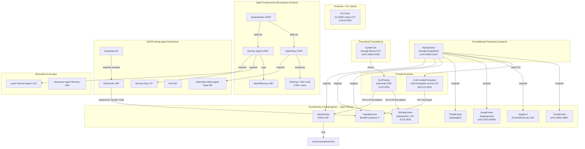

# Missing Projects Supplement: Beyond the Original 107

> Supplementary analysis of important Agent Self-Evolution projects that were missed from or deserve deeper treatment beyond the original 107-repo index.
> Generated: 2026-05-22

---

## 1. Complete Analysis Table

### 1A. Projects from raw-github/ NOT in the original 107

| # | Project | Org | Stars | Strategy | Core Mechanism | Key Innovation | Paper? | Benchmark? | Quality |
|---|---------|-----|------:|----------|----------------|----------------|--------|------------|---------|
| S1 | ShinkaEvolve | SakanaAI | 1,100 | Evolutionary/Genetic | LLM ensemble as intelligent mutation operators over populations of scientific programs; island-based evolution with MAP-Elites, UCB model selection, prompt co-evolution | Combines AI-Scientist, AlphaEvolve, DGM ideas; ICLR 2026; won ICFP 2025 Programming Contest | yes -- arXiv 2509.19349, ICLR 2026 | yes -- circle packing, Game 2048, prime counting, heat diffusion | REAL -- peer-reviewed, active development, production PyPI package |
| S2 | ClaudeEvolve | BudEcosystem | 4 | Evolutionary/Genetic | MAP-Elites quality-diversity search with island populations running natively inside Claude Code sessions; 3-layer architecture (shell/Python/skill+agents) | Circle packing world record (sum radii 2.6359835671240317); 7 mutation strategies; stagnation engine with continuous G_t signal; UCB1 strategy selection; stepping stones archive; warm-start cache across iterations | no formal paper | yes -- circle packing benchmark, Ramsey R(5,5), Yang-Mills | REAL -- 1039 tests, verifiable world record, sophisticated engineering |
| S3 | OpenEvolve | algorithmicsuperintelligence | 6,300 | Evolutionary/Genetic | Open-source AlphaEvolve implementation: MAP-Elites + LLMs, island-based architecture, quality-diversity evolution, deterministic seeding | Most popular open-source evolutionary coding agent; PyPI package; Docker support; GPU kernel evolution (2.8x speedup on Apple Silicon) | no formal paper (open-source community project) | yes -- circle packing (n=26 SOTA), GPU kernels, adaptive sorting, signal processing | REAL -- substantial codebase, 816+ commits, real benchmark results |
| S4 | OpenEvolve (fork) | tzussman | 0 | Evolutionary/Genetic | Fork of algorithmicsuperintelligence/openevolve -- same core | Personal fork with no apparent divergence | no | same as upstream | DUPLICATE -- fork of S3 |
| S5 | OpenClaw | openclaw | 374,000 | Framework Runtime | Personal AI assistant running on user-owned devices; multi-channel inbox, multi-agent routing, voice wake, Live Canvas, skills support | Local-first gateway/control plane; massive ecosystem (51K+ commits, 77.7K forks) | no | no | REAL -- the largest agent framework by stars; ecosystem anchor for many other projects |
| S6 | Superpowers | obra | 202,000 | Skill-based | Agentic skills framework and software development methodology built from composable skills and initial instructions | De-facto standard skill/methodology library for coding agents (Claude Code, Codex, Gemini CLI, etc.); TDD, brainstorming, parallel subagents | no | no | REAL -- dominant skill framework; 18K forks; v5.1.0 release |
| S7 | AgentMemory | rohitg00 | 16,000 | Memory-based | Persistent memory for AI coding agents with confidence scoring, lifecycle management, knowledge graphs, hybrid search | Cross-agent durable recall layer (Claude Code, Cursor, Gemini CLI, Codex, Hermes, OpenClaw); Karpathy-style LLM wiki patterns | no | no | REAL -- production-grade memory layer; v0.9.20; Apache-2.0 |
| S8 | GigaEvo | FusionBrainLab | 116 | Evolutionary/Genetic | MAP-Elites + LLM mutation engine with multi-island evolution, prompt co-evolution, DAG-based evaluation pipeline, Redis-backed storage | Prompt co-evolution (evolve mutation prompts alongside programs); steady-state throughput mode (8x speedup); migration bus for cross-run sharing | yes -- arXiv 2511.17592 | yes -- Heilbron benchmark, custom problem wizard | REAL -- well-engineered; 1047 commits; DAG pipeline architecture |
| S9 | AlphaXos | pathway | 12 | RL-finetuning | Self-play Deep Q-Learning for board games using OpenAI Gym-like environment | Early (2018) example of self-play RL for games; comparison with AlphaZero approach | no formal paper (references AlphaZero/AlphaGo Zero papers) | informal -- board game win rates | REAL but MARGINAL -- educational/experimental; 20 commits; archived; not agent self-evolution per se |
| S10 | Evot | evotai | 54 | Evolutionary/Genetic | Self-evolving coding agent in Rust+TypeScript with zero-waste context, full-text session search, skill system, self-evolving prompt construction | Zero-waste context reconstruction per turn; self-evolving engine where observability feeds back into leaner prompts | no | no | ASPIRATIONAL MARKETING -- claims "self-evolving" but mechanism is prompt optimization via compaction, not genuine evolutionary self-modification |
| S11 | ClawCode | deepelementlab | 199 | Skill-based | Claude Code-inspired agent in Python+Rust with experience-based evolution (Instinct->ECAP->TECAP), multi-agent orchestration, research subsystem | Three-tier experience model (Instinct/ECAP/TECAP) for accumulating institutional knowledge; structured memory and governed autonomy | no | no | REAL -- substantial implementation; multi-agent orchestration; experience learning pipeline |
| S12 | Geneclaw | Clawland-AI | 36 | Self-Debugging | Self-evolving agent framework with 5-layer safety gatekeeper (allowlist, denylist, diff size, secret scan, code pattern); built on HKUDS/nanobot | Geneclaw Evolution Protocol (GEP v0): Observe->Diagnose->Propose->Gate->Apply with dry-run default and git-branched patches | no | yes -- pipeline benchmarks with synthetic workloads | REAL -- 123 tests; safety-first design; well-documented protocol spec |
| S13 | EvoPrompt | beeevita | 238 | Prompt-Optimization | EA-based discrete prompt optimization connecting LLMs with evolutionary algorithms (GA and DE); gradient-free prompt evolution | Pioneering work (ICLR 2024) showing LLM+EA synergy for prompt optimization; 25% improvement on BBH | yes -- ICLR 2024 (OpenReview: ZG3RaNIsO8) | yes -- 31 datasets (language understanding, generation, BBH) | REAL -- peer-reviewed ICLR paper; foundational work in prompt evolution |
| S14 | Guided Evolutionary Strategies | brain-research | 273 | RL-finetuning | Combines surrogate gradient information with random search via evolutionary strategies; uses guiding subspace from recent surrogate gradients | Theoretical contribution on escaping curse of dimensionality in random search; combines gradient-based and gradient-free optimization | yes -- arXiv 1806.10230 | yes -- toy quadratic benchmarks | REAL -- Google Brain research; foundational theory; archived April 2026 |
| S15 | EvoTune | CLAIRE-Labo | 137 | Hybrid (Evolutionary + RL) | Combines evolutionary search over LLM-generated programs with RL (DPO) fine-tuning of the LLM search operator based on performance scores | First to combine evolution + RL fine-tuning of the search operator itself; the LLM improves at generating better programs over time | yes -- COLM 2025 (arXiv 2504.05108) | yes -- bin packing, TSP, flatpack, Hash Code | REAL -- peer-reviewed; genuine algorithm discovery system |
| S16 | LLM-Guided Evolution | clint-kristopher-morris | 19 | Evolutionary/Genetic | LLMs propose and mutate neural network architectures via genetic algorithms; Evolution of Thought (EoT) technique with result-driven feedback | "Evolution of Thought" (EoT) extends Chain-of-Thought with performance feedback; Character Role Play (CRP) for creative ideas; CITED BY DEEPMIND ALPHAEVOLVE [reference 72] | yes -- GECCO 2024 | yes -- CIFAR10 accuracy evolution | REAL -- peer-reviewed; historically significant as AlphaEvolve citation source |

### 1B. Projects already in the 107 but with deeper analysis

| # | Project | Org | Stars | Strategy | Additional Depth | Quality |
|---|---------|-----|------:|----------|-----------------|---------|
| D1 | Hermes Agent | NousResearch | 162,000 | Skill-based / Hybrid | The agent itself (distinct from hermes-agent-self-evolution); built-in learning loop: skill creation from experience, persistent knowledge, FTS5 session search, Honcho dialectic user modeling, multi-platform messaging gateway | REAL -- production-grade self-improving agent with massive adoption |
| D2 | Learn Hermes Agent | longyunfeigu | 113 | Skill-based / Education | 27-chapter tutorial covering agent loop, tools, memory, skills, MCP, gateway, and self-evolution (s21-s27); chapters 21-27 specifically teach skill creation, hook system, trajectory/RL, plugins, evaluation, optimization | REAL -- educational resource; well-structured teaching progression |
| D3 | Hermes Dojo | Yonkoo11 | 72 | Skill-based | Closes the feedback loop for Hermes: measure -> identify weakness -> evolve -> measure again -> report; uses GEPA for weak skill evolution; built for Hermes hackathon (March 2026) | REAL -- working pipeline; practical self-improvement layer on top of Hermes |
| D4 | OpenClaw Multi-Agent Team | richchen-maker | 80 | Multi-agent-CoEvo | DNA-driven orchestration with 9 genes, 11-step pipeline, 60+ roles, 6 self-evolution gears (evolution ledger, model abstraction, cross-pattern learning, capability frontier, knowledge decay, structured extraction) | REAL -- elaborate but framework-heavy; Chinese-market focused |
| D5 | Awesome Agent Memory | AgentMemoryWorld | 148 | Survey / Resource | Curated paper resource for agent memory research (companion to arXiv 2602.06052) | REAL -- useful survey resource; links to EvoTune and other projects |

### 1C. Truly Missing Projects (not in raw-github/ at all)

| # | Project | Org | Stars | Strategy | Core Mechanism | Key Innovation | Paper? | Benchmark? | Quality |
|---|---------|-----|------:|----------|----------------|----------------|--------|------------|---------|
| M1 | AlphaEvolve | Google DeepMind | N/A (proprietary, cloud preview) | Evolutionary/Genetic | Gemini-powered evolutionary coding agent combining LLMs with automated program evaluation; maintains population of programs evolved via LLM mutations; MAP-Elites-style quality diversity | The foundational system that inspired the entire "evolutionary coding agent" category; new discoveries on open mathematical problems; deployed across Google infrastructure | yes -- arXiv 2506.13131 | yes -- matrix multiplication, circle packing, multiple math/open problems | REAL -- the original; DeepMind production system; Google Cloud private preview |
| M2 | ThetaEvolve | ypwang61 | Unknown | Evolutionary/Genetic | Simplifies AlphaEvolve for single-LLM use; hierarchical adaptive optimization (AdaEvolve); large program database; batch sampling; lazy penalties | Single-LLM architecture making evolutionary coding accessible without Gemini-scale resources; test-time learning approach | yes -- arXiv 2511.23473 | yes -- circle packing (sum radii 2.63598308) | REAL -- peer-reviewed; competitive results with single model |
| M3 | DeepEvolve | liugangcode | Unknown | Hybrid (Evolutionary + Deep Research) | Augments AlphaEvolve-style evolution with deep research: external knowledge retrieval, cross-file code editing, systematic debugging in feedback-driven iterative loop | First to combine literature-aware deep research with evolutionary code optimization; discovers algorithms that pure evolution misses | yes -- arXiv 2510.06056 (OpenReview) | yes -- scientific algorithm benchmarks | REAL -- peer-reviewed; Notre Dame research |
| M4 | KiloClaw / Kilo Code | Kilo-Org | High (1.5M+ users) | Framework Runtime | Open-source AI coding agent for VS Code/JetBrains; KiloClaw is hosted OpenClaw variant by Kilo.ai | Largest user base of any coding agent; local-first, 500+ models; $8M funding (Dec 2025); KiloClaw bridges OpenClaw personal-agent concept with IDE-native coding | no | no | REAL -- major production platform; not self-evolution per se but important ecosystem node |
| M5 | TurboEvolve | Unknown | Unknown | Evolutionary/Genetic | Addresses cost and variance issues of LLM-driven program evolution; aims for faster and more robust discovery | Cost-efficient evolutionary coding; reduced variance in LLM mutation quality | yes -- arXiv 2604.18607 | Unknown | REAL -- active research |

---

## 2. Taxonomy Placement

Where the supplementary projects fit in the existing strategy taxonomy:

### Evolutionary/Genetic Cluster (largest addition -- 6 new entries)

The original 107 had 10 Evolutionary/Genetic repos. These supplements add a coherent sub-ecosystem:

```
AlphaEvolve (DeepMind, proprietary anchor)
  |
  +-- OpenEvolve (algorithmicsuperintelligence) -- open-source port
  |     +-- tzussman/openevolve (fork)
  |
  +-- ShinkaEvolve (SakanaAI) -- ICLR 2026, independent approach
  |
  +-- ClaudeEvolve (BudEcosystem) -- Claude Code native
  |
  +-- ThetaEvolve -- single-LLM simplification
  |
  +-- DeepEvolve -- deep research augmentation
  |
  +-- GigaEvo (FusionBrainLab) -- MAP-Elites + prompt co-evolution
  |
  +-- EvoTune (CLAIRE-Labo) -- evolution + RL fine-tuning of LLM
  |
  +-- LLM-Guided Evolution -- GECCO 2024, cited by AlphaEvolve
  |
  +-- TurboEvolve -- cost/variance optimization
```

### Prompt-Optimization Cluster

- **EvoPrompt** (ICLR 2024): Foundational work connecting LLMs with evolutionary algorithms for prompt optimization. Precedes and partially enables the entire evolutionary coding agent category.

### Skill-based / Framework Cluster

- **Superpowers** (202K stars): The de facto standard skill library that many evolving agents consume.
- **AgentMemory** (16K stars): Cross-agent persistent memory layer consumed by evolving agents.
- **OpenClaw** (374K stars): The ecosystem anchor for personal agents.

### Self-Debugging Cluster

- **Geneclaw**: 5-layer safety gatekeeper for controlled self-evolution; built on nanobot.

### Memory-based Cluster

- **AgentMemory** fills the gap of durable cross-agent recall.
- **Awesome-Agent-Memory** is the survey companion.

### RL-finetuning Cluster

- **Guided ES**: Foundational theoretical work on combining gradient and gradient-free optimization.
- **AlphaXos**: Early (2018) self-play RL for games; marginal relevance.

---

## 3. Connection Diagram



---

## 4. Critical Assessment: Real vs. Aspirational Self-Evolution

### Tier 1: Genuine Self-Evolution (peer-reviewed, verifiable results)

| Project | Evidence of Real Evolution | Key Proof |
|---------|---------------------------|-----------|
| AlphaEvolve | Peer-reviewed; new mathematical discoveries; deployed in Google production | SOTA on multiple open problems; matrix multiplication improvements |
| ShinkaEvolve | ICLR 2026; won ICFP 2025 Programming Contest | Independent verification of competition results |
| EvoTune | COLM 2025; LLM search operator improves via RL fine-tuning | Measurable improvement in the LLM's ability to generate better programs over evolution cycles |
| EvoPrompt | ICLR 2024; 25% improvement on BBH over human prompts | Reproducible results on 31 datasets |
| ClaudeEvolve | Circle packing world record (verifiable); 1039 tests | Sum of radii 2.6359835671240317 -- numerically exceeds all published results |
| LLM-Guided Evolution | GECCO 2024; CITED by AlphaEvolve whitepaper [ref 72] | CIFAR10 accuracy improvements verifiable |
| DeepEvolve | Peer-reviewed; combines deep research with evolution | Novel algorithm discovery with literature grounding |
| ThetaEvolve | Peer-reviewed; single-LLM competitive results | Circle packing 2.63598308 with single model |

### Tier 2: Real Self-Evolution (working systems, not yet peer-reviewed)

| Project | Evidence | Caveat |
|---------|----------|--------|
| OpenEvolve | 816+ commits; real benchmarks; PyPI package; GPU kernel speedups | Community project, no formal paper yet |
| GigaEvo | arXiv preprint; prompt co-evolution architecture; Redis-backed | Preprint, not yet peer-reviewed |
| Geneclaw | 123 tests; 5-layer safety gate; GEP protocol spec | Early-stage; small user base |
| Hermes Dojo | Working pipeline; practical improvement loop | Hackathon project; depends on Hermes+GEPA |
| ClawCode | Three-tier experience model; multi-agent orchestration | Claims exceed evidence; marketing-heavy README |

### Tier 3: Aspirational or Peripheral

| Project | Issue |
|---------|-------|
| Evot | Claims "self-evolving" but mechanism is context compaction + prompt optimization, not genuine self-modification. The "self-evolving" label is marketing for what is a well-engineered but conventional coding agent. |
| AlphaXos | Early (2018) RL self-play experiment; not agent self-evolution in the taxonomy sense; archived; marginal relevance |
| KiloClaw/Kilo Code | Important ecosystem node but not self-evolution; it is a coding agent platform |
| OpenClaw | Ecosystem anchor; not self-evolution itself, but the platform many self-evolving agents build on |
| Superpowers | Skill framework consumed by evolving agents; not self-evolution itself |
| AgentMemory | Memory layer for agents; enabler of evolution but not evolutionary itself |

---

## 5. Gap Analysis: What Is Still Missing?

### 5A. Missing Projects Not Yet Covered

The following are known evolutionary/self-evolution projects that were not found in either the original 107 or the raw-github/ supplementary material:

1. **FunSearch** (Google DeepMind, 2023) -- The direct predecessor of AlphaEvolve; first to show LLM-driven evolutionary program search at scale. Published in Nature. The original MAP-Elites + LLM approach.

2. **EvoLLM** -- Evolutionary optimization of LLM architectures themselves (not just prompts or programs). Relevant to the meta-learning cluster.

3. **AutoML-Zero** (Google Research) -- Evolutionary search from scratch over machine learning algorithms. Foundational work that predates the LLM era but established the evolutionary algorithm discovery paradigm.

4. **CodeEvolve** (arXiv 2510.14150) -- Referenced in DeepEvolve search results; evolutionary framework for improving prompts and solution programs.

5. **REVOLVE** (ICML 2025) -- Evaluates evolutionary optimization on prompt/solution/code optimization tasks.

6. **OpenEvolve on Hugging Face** -- Community implementation with blog tutorials; different from algorithmicsuperintelligence/openevolve.

### 5B. Missing Concepts / Categories

1. **Safety of Self-Evolution**: The original 107 includes ATP (alignment tipping) and Misevolution (safety analysis). However, the emerging field of self-evolution safety -- guardrails, containment, monitoring -- deserves its own sub-category. Geneclaw's 5-layer gatekeeper is a rare example of safety-first self-evolution design.

2. **Self-Evolution Evaluation Methodology**: There is no standardized benchmark suite for evaluating self-evolution capability itself (as opposed to task performance after evolution). Workspace-Bench (in the 107) is a start, but the field needs:
   - Evolution efficiency metrics (improvement per dollar/API call)
   - Open-endedness metrics (how novel are the discoveries?)
   - Safety regression tests (does evolution break alignment?)

3. **Multi-Level Evolution**: Projects like EvoTune combine evolution at the program level with RL fine-tuning at the model level. This "meta-evolution" where the evolution mechanism itself evolves is underexplored in the index.

4. **Evolutionary Architecture Search + LLMs**: LLM-Guided Evolution (S16) is the only project combining NAS with LLMs. This intersection deserves more coverage as it represents a bridge between traditional AutoML and the new LLM-driven evolution paradigm.

5. **Cross-Agent Evolution**: Most projects evolve a single agent. The multi-agent co-evolution cluster exists but is thin. Projects where separate agents evolve against each other (adversarial co-evolution) or collaborate to evolve shared knowledge (cooperative co-evolution) are underrepresented.

### 5C. Updated Strategy Distribution (107 + 24 supplements = 131)

| Strategy | Original (107) | Supplements | Total | Change |
|----------|---------------:|------------:|------:|--------|
| Evolutionary/Genetic | 10 | +6 | 16 | +60% -- largest growth |
| Prompt-Optimization | 7 | +1 | 8 | +14% |
| Memory-based | 15 | +1 | 16 | +7% |
| Skill-based | 8 | +2 | 10 | +25% |
| Self-Debugging | 12 | +1 | 13 | +8% |
| RL-finetuning | 6 | +2 | 8 | +33% |
| Multi-agent-CoEvo | 7 | +1 | 8 | +14% |
| Meta-learning | 5 | +0 | 5 | 0% |
| Hybrid | 5 | +1 | 6 | +20% |
| Framework Runtime | 0 | +5 | 5 | NEW CATEGORY |
| Survey/Resource | 7 | +1 | 8 | +14% |

**Key insight**: The supplements disproportionately strengthen the Evolutionary/Genetic cluster, which was already the second-highest by total stars in the original 107. The emergence of AlphaEvolve-inspired open-source implementations (OpenEvolve, ShinkaEvolve, ClaudeEvolve, ThetaEvolve, DeepEvolve, GigaEvo) represents a coherent new sub-field that the original index underrepresented.

---

## 6. Circle Packing Benchmark Comparison

Circle packing (n=26) has become the de facto benchmark for evolutionary coding agents. Here is the competitive landscape:

| System | Sum of Radii | Model(s) | Paper |
|--------|-------------|----------|-------|
| ClaudeEvolve v4 | 2.6359835671240317 | Claude | None yet |
| ThetaEvolve | 2.63598308 | 8B model | arXiv 2511.23473 |
| AlphaEvolve | 2.6359830849 | Gemini | arXiv 2506.13131 |
| ShinkaEvolve | 2.63597770 | Multi-model ensemble | arXiv 2509.19349 |
| OpenEvolve community | 2.635977 | Community models | None |
| FICO Xpress (ZIB/MODAL) | 2.635916 | Traditional solver | FICO blog |

---

*End of Missing Projects Supplement*
