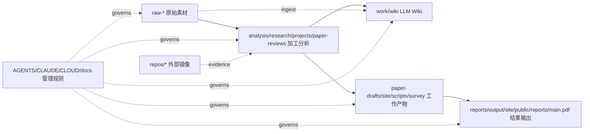

# Self Evolve Master Index

> Generated: 2026-06-03. Regenerate with `node scripts/generate_project_indexes.mjs`.

## One Sentence

Self Evolve 的项目结构按 `raw -> processed -> work -> results` 管线治理，镜像仓库和协作规则单独索引，避免素材、分析、草稿和发布结果互相污染。

## Key Metrics

| Metric | Value |
|---|---:|
| Raw GitHub captures | 677 |
| Classified GitHub repositories | 677 |
| Analyzed project/model-card reports | 273 |
| Strict evolution-related repositories | 97 |
| Broad evolution-related repositories | 203 |
| Raw paper files on disk | 201 |
| Paper review files | 171 |
| Public project report files | 478 |
| Current paper PDF | present |

## Category Coverage

| Category | Present Paths | Files | Directories | Skipped | Size | Rule |
|---|---:|---:|---:|---:|---:|---|
| [Raw / 原始素材](./raw-index.md) | 9/9 | 3986 | 9 | 0 | 40 MB | 只保存采集原貌和最小元数据；除时间戳补齐、去重索引外，不在这里写分析结论。 |
| [Processed / 加工分析](./processed-index.md) | 6/8 | 46334 | 6025 | 1 | 3.3 GB | 清洗、分类、交叉分析、深度项目卡、论文评审都归这里；内容必须能追溯到 raw 或外部 canonical source。 |
| [Work / 工作产物](./work-index.md) | 10/10 | 2518 | 522 | 0 | 98 MB | 论文草稿、站点源码、脚本、调查图表、工程中间件归这里；可以迭代，但要有构建或验证入口。 |
| [Results / 结果输出](./results-index.md) | 6/6 | 1516 | 442 | 0 | 43 MB | 可交付、可发布、可下载、可部署的输出归这里；生成物要说明来源和刷新命令。 |
| [Mirrors / 外部仓库镜像](./mirrors-index.md) | 2/4 | 228366 | 47475 | 193 | 19 GB | 外部仓库克隆、只读镜像和临时验证仓库归这里；不要把本项目治理文件混入镜像内部。 |
| [Ops / 管理与协作](./ops-index.md) | 9/9 | 94 | 16 | 0 | 1.3 MB | 项目管理、Agent 手册、云部署、索引、发布规范归这里；任何新长期规则都要能从根 README 找到。 |

## Project Map

## Index Files

- [Raw / 原始素材](./raw-index.md)
- [Processed / 加工分析](./processed-index.md)
- [Work / 工作产物](./work-index.md)
- [Results / 结果输出](./results-index.md)
- [Mirrors / 外部仓库镜像](./mirrors-index.md)
- [Ops / 管理与协作](./ops-index.md)
- [Data Flow Index](./data-flow-index.md)
- [Root Document Map](./root-document-map.md)
- [Noncanonical Cleanup Index](./noncanonical-index.md)
