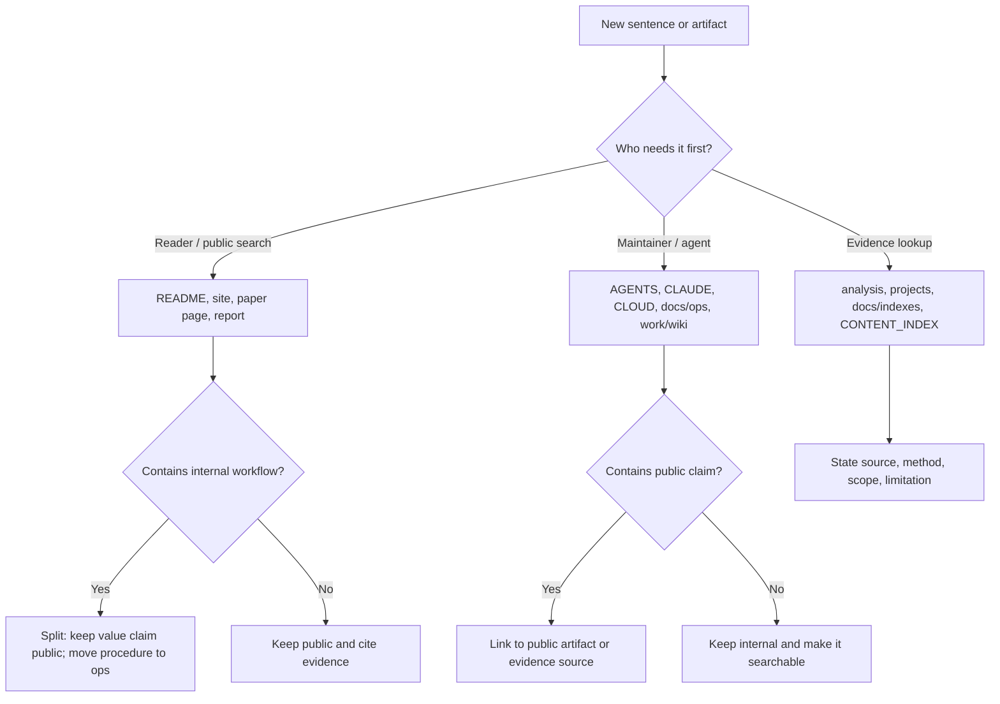

# Audience Boundary And Internal Workflow

## 一句话

README、网站、论文页和 SEO 页面只服务外部读者；agent 启动检查、内部 workflow、handoff、构建命令和自我镜像规则只放在 ops/agent/wiki 层。

## 三句话

1. 外部读者需要知道这个项目是什么、为什么重要、核心结论是什么、证据在哪里、下一步读什么。
2. Agent 需要知道如何启动、怎么查 wiki、怎么刷新索引、怎么验证、怎么提交和怎样保护用户改动。
3. 两者可以互相链接证据，但不能互相污染：用户页面不写 agent 操作手册，内部手册不替代公开解释。

## Five-Line Rule

1. 面向用户：`README*.md`、`site/src/pages/**`、`site/src/content/**`、论文站点页、公开报告页。
2. 面向证据：`analysis/`、`projects/`、`paper-reviews/`、`docs/indexes/`、`CONTENT_INDEX.md`。
3. 面向 agent：`AGENTS.md`、`CLAUDE.md`、`CLOUD.md`、`docs/ops/`、`work/wiki/schema.md`、`work/wiki/log.md`。
4. 面向构建：`scripts/`、`site/`、`paper-drafts/`、`survey/latex/` 的命令和验证门禁。
5. 当一句话同时包含读者价值和 agent 操作时，拆成两句：读者价值留在公开页，操作细节移到 ops。

## Boundary Matrix

| Surface | Audience | Put Here | Do Not Put Here |
|---|---|---|---|
| README / README-ZH / README-EN | 外部读者、研究者、工程师 | 项目定位、核心结论、证据入口、论文/网站/报告导读 | agent 启动检查、内部构建命令、handoff、wiki ingest 流程、自我系统说明 |
| Website / SEO pages | 搜索读者、行业读者、研究读者 | 问题解释、topic map、benchmark、项目/论文入口、FAQ | `Workflow A/B`、`CLAUDE.md Iron Rules`、私有操作规则、未解释的内部文件名 |
| Paper and survey pages | 论文读者 | 方法、数据口径、证据链、限制、可复现来源 | agent 协作流程、任务分派历史、未发表的内部 handoff |
| CONTENT_INDEX / docs/indexes | 仓库浏览者、agent、维护者 | 公开索引、文件角色、计数口径、证据边界 | 长篇操作手册和会话过程复盘 |
| analysis / projects / reports | 研究读者、agent | 结论、来源、方法、局限、model-card 教学价值 | 无来源判断、私有用户记忆、team 二手目标 |
| AGENTS / CLAUDE / CLOUD / docs/ops | agent、维护者 | 启动检查、验证命令、提交规则、风格锁、workflow、风险处理 | 面向消费者的主叙事替代品 |
| work/wiki | agent 知识层 | schema、source/entity/concept/synthesis、log、search index | 当作公开 landing page 或未验证事实源 |

## Decision Flow

## Public Copy Checklist

- The first screen answers a reader question, not an agent task.
- Counts are named by scope: raw captures, analyzed records, public reports, site records, survey papers.
- Evidence links point to public pages or repository evidence, not to internal workflow instructions.
- Internal labels such as `Workflow A`, `Workflow B`, "Iron Rules", "handoff", or "agent startup check" are rewritten as reader-facing concepts.
- Build commands are omitted unless the page is explicitly a developer/maintenance page.

## Internal Workflow Checklist

- Start from direct user input and current worktree state.
- Check wiki/index/log before duplicate research.
- Put raw, processed, work, results, ops artifacts in their owner paths.
- Refresh affected indexes after long-lived file changes.
- Validate the affected surface: raw timestamps, GitHub analysis, paper builds, survey builds, site build, SEO audit, or visual checks as appropriate.
- Commit and push when the user asked for persistence or GitHub sync.

## Maintenance Rule

When a public file needs to mention a rule that lives in AGENTS/CLAUDE/CLOUD, rewrite it as a public boundary and link to evidence instead. The detailed operational rule stays in this file or the agent manuals.
