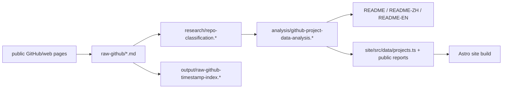

# Hourly Public Metadata Update - 2026-05-26 05:44 +0800

## One Sentence

This run added five web-observed public GitHub captures and promoted them through classification, project model cards, README/i18n lists, generated indexes, and site data.

## Three Sentences

The new raw captures are YunjueTech/Yunjue-Agent, RangeKing/self-evolving-agent, gofenix/nex-agent, swapedoc/hermes2anti, and vilmire/adhdev. The main learning is that the current frontier is splitting into in-situ tool evolution, skill-governed promotion, runtime fault tolerance, compact memory/skill loops, and coding-agent control planes. Shell DNS could not resolve `api.github.com`, so all five new metadata records are explicitly web-observed and downstream GitHub API fields preserve `github_api_fetch_error` instead of fabricated freshness.

## Data Flow

## Added Repositories

| Repo | Role | Evidence quality |
|---|---|---|
| YunjueTech/Yunjue-Agent | Zero-start in-situ self-evolving agent system with tool evolution and public benchmark traces | Web-observed GitHub page; API DNS blocked |
| RangeKing/self-evolving-agent | OpenClaw self-evolving skill with curriculum/eval/promotion workspace | Web-observed GitHub page; API DNS blocked |
| gofenix/nex-agent | Elixir/OTP self-evolving runtime with memory, skills, subagents, and code upgrade manager | Web-observed GitHub page; API DNS blocked |
| swapedoc/hermes2anti | Hermes-inspired memory and skill self-improvement toolkit | Web-observed GitHub page; API DNS blocked |
| vilmire/adhdev | Self-hosted control plane for long-running coding-agent sessions | Web-observed GitHub page; API DNS blocked |

## Counts After Propagation

- raw-github captures: 515
- classified repositories: 515
- site-data projects: 105
- strict evolution-theme repositories: 82
- broad evolution-related repositories: 185
- public project report files: 257

## Blockers

- `curl https://api.github.com/repos/...` failed with DNS resolution error: `Could not resolve host: api.github.com`.
- `npx gitnexus status` was available but initially stale against the current commit; refresh is deferred until after the iteration commit so the graph indexes the committed state.
- `scripts/generate_repo_classification.py` is a legacy 364-row generator and is not the current 515-row classification truth source.
