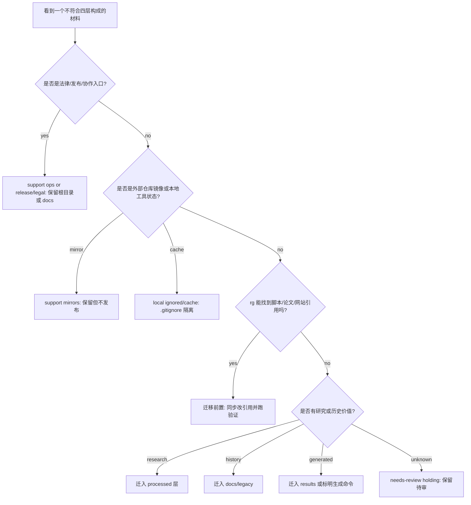

# Noncanonical Cleanup Policy

## L1

不符合 `raw / processed / work / results` 四层构成的材料，不直接删除，先归入 support、compatibility、mirrors、local ignored、release/legal 或 needs-review。

## L2

这些材料很多不是研究素材，但仍然有用：法律文件保证开源发布，Agent/Claude/Cloud 文件保证协作，外部镜像提供证据，本地缓存保证工具运行，历史文件保留证据但不再堆在根目录。清理的目标不是“少文件”，而是“少误解”：任何人一眼能知道它为什么存在、能不能发布、能不能移动、能不能删除。

## Classification

| Class | Examples | Keep Where | Action |
|---|---|---|---|
| support ops | `README.md`, `AGENTS.md`, `CLAUDE.md`, `CLOUD.md`, `CONTENT_INDEX.md`, `docs/` | root or `docs/` | 保留；长规则进入 `docs/project-management/` |
| support release/legal | `LICENSE-*`, `NOTICE`, `CONTRIBUTING.md`, `CODE_OF_CONDUCT.md`, `SECURITY.md` | root | 保留；开源发布需要 |
| support mirrors | `repos/`, `*__/`, `projects/repos/` | mirror paths | 不删除；不发布；只作为证据来源 |
| local ignored/cache | `.aha/`, `.claude/`, `.genome/`, `.gitnexus/`, `.tmp/`, `.astro/`, `node_modules/`, `.DS_Store` | local only | 由 `.gitignore` 隔离；不作为素材 |
| migrated raw evidence | `raw-social/mom-test/mom-test-findings*.md`, `raw-github/INDEX.md`, `raw-social/legacy/social-media-raw-data*.md` | `raw-*` | 不删；raw 保持原貌，只补时间戳和索引 |
| migrated processed/report evidence | `analysis/social-media-resources*.md`, `analysis/github-agent-evolution-repos*.md`, `reports/cross-validation-report.md` | `analysis/` or `reports/` | 不删；分析归 processed，结果归 reports |
| migrated paper work | `paper-drafts/PAPER_OUTLINE.md` | `paper-drafts/` | 不删；论文工作稿归 paper |
| misplaced root evidence | `mom-test-findings*.md`, `social-media-raw-data*.md`, `raw-github-index.md`, `awesome-social-media-resources*.md`, `github-agent-evolution-repos*.md`, `PAPER_OUTLINE.md`, `cross-validation-report.md` | temporary root only | 先查引用，再迁入对应 canonical layer |
| needs-review holding | 未知来源、无明显归属的文件 | temporary root or `docs/legacy/holding/` | 先查引用和内容，再归层 |

## Cleanup Rules

1. 默认动作是“标注归类”，不是删除。
2. 先用 `rg` 查引用；被脚本、论文、网站、public reports 引用的文件要同步改引用后再移动。
3. 能再生成的缓存不要纳入索引产物，靠 `.gitignore` 隔离。
4. 有历史价值但不再参与构建的文档迁入 `docs/legacy/`。
5. 有研究价值的分析迁入 `analysis/`、`research/`、`projects/`、`paper-reviews/`。
6. 有发布价值的结果迁入 `reports/` 或 `site/public/reports/`。
7. 外部镜像只读管理，除非用户明确要求，不在镜像内部做本项目治理。

## Decision Tree



## Command

刷新当前非标准材料索引：

```bash
node scripts/generate_project_indexes.mjs
```

查看结果：

```bash
open docs/indexes/noncanonical-index.md
```
