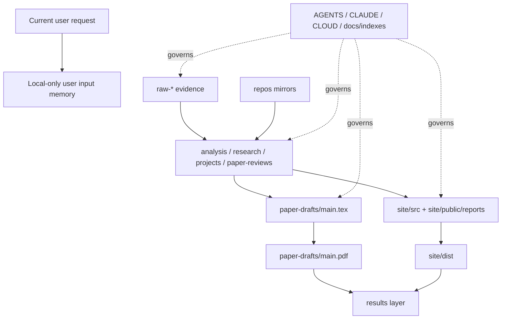

# Project Structure

## L1

项目按 `raw -> processed -> work -> results` 四层治理，外部镜像和协作规则独立管理。

## L2

Raw 是证据，不能混入分析。Processed 是解释，要能追溯 raw 或 canonical source。Work 是可构建的论文、网站、脚本和图表。Results 是对外可发布的 PDF、报告、站点静态资源和索引。

## L3

当前没有强行移动 `raw-*`、`paper-drafts/`、`site/` 等目录，因为脚本、论文和网站已有稳定引用。新规则先通过索引和入口文件收束，后续如果做物理迁移，需要先改脚本、改引用、跑构建、再移路径。根目录只保留入口、法律文件和兼容文件；新的管理材料进入 `docs/`。所有新增长期产物都必须能在 [../indexes/master-index.md](../indexes/master-index.md) 找到。

## Canonical Ownership

| Layer | Owner Paths | Required Metadata |
|---|---|---|
| Raw | `raw-github/`, `raw-papers/`, `raw-blogs/`, `raw-social/`, `raw-social-rank/` | source URL, collected timestamp, raw title/id |
| Processed | `analysis/`, `research/`, `projects/`, `paper-reviews/`, `papers/`, `cc-materials/` | source path, method, scope, limitations |
| Work | `paper-drafts/`, `paper/`, `latex/`, `site/`, `survey/`, `scripts/`, `data-engine/` | build command, input paths, output paths |
| Results | `reports/`, `output/`, `site/public/reports/`, `paper-drafts/main.pdf`, `site/dist/` | generated date, source work, verification command |
| Mirrors | `repos/`, `projects/repos/`, `*__/` | upstream URL, readonly expectation |
| Ops | `docs/`, `AGENTS.md`, `CLAUDE.md`, `CLOUD.md` | rule owner, refresh command, scope |
| Noncanonical support | release/legal, local cache, compatibility root files | class, cleanup action, migration condition |

## Mermaid Map

## Placement Rules

1. 新采集的原始网页、仓库、论文、社交内容进入对应 `raw-*`。
2. 新增分类、统计、交叉分析进入 `analysis/` 或 `research/`。
3. 单项目深度分析进入 `projects/`，并同步到 `site/public/reports/projects/` 供网站引用。
4. 论文工作进入 `paper-drafts/`；可复用章节或旧版材料可放 `paper/`、`latex/`，但主构建以 `paper-drafts/main.tex` 为准。
5. SEO/博客/项目页面进入 `site/src/`，下载报告进入 `site/public/reports/`。
6. 结果输出进入 `reports/`、`output/` 或明确的 public 路径；不要把生成结果当作唯一事实源。
7. 管理规则进入 `docs/project-management/` 或根手册文件。
8. 不符合四层构成的材料先按 [noncanonical-cleanup-policy.md](noncanonical-cleanup-policy.md) 归类，不直接删除。

## Migration Guard

物理迁移必须满足四个条件：

1. `rg` 检查旧路径引用。
2. 修改脚本和站点/论文链接。
3. 运行索引、数据分析、论文、站点构建验证。
4. 在 `docs/indexes/root-document-map.md` 或迁移说明中记录兼容策略。
