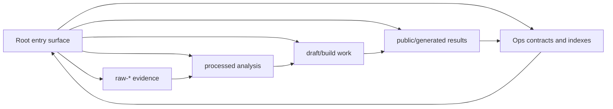

# Workspace Taxonomy

## L1

Root is an entry surface, not a storage layer. Raw goes to `raw-*`, analysis goes to `analysis/` or `research/`, paper work goes to `paper-drafts/`, public results go to `reports/`, `output/`, or `site/public/`.

## L2

The workspace is organized for agents and humans scanning the project from the file browser. The root should keep only primary entry points, collaboration contracts, release/legal files, and canonical top-level directories. Historical root files are not deleted; they are moved into the layer that matches their role and references are updated before validation.

## Canonical Layers

| Layer | Purpose | Canonical Paths | Examples Migrated 2026-05-26 |
|---|---|---|---|
| raw | Source evidence and minimal metadata | `raw-github/`, `raw-papers/`, `raw-blogs/`, `raw-social/`, `raw-social-rank/` | `raw-social/mom-test/`, `raw-social/legacy/social-media-raw-data*.md`, `raw-github/INDEX.md` |
| processed | Cleaned analysis, classifications, model-card material | `analysis/`, `research/`, `projects/`, `paper-reviews/` | `analysis/social-media-resources*.md`, `analysis/github-agent-evolution-repos*.md` |
| work | Drafts, source code, generation scripts, build surfaces | `paper-drafts/`, `survey/`, `site/`, `scripts/`, `work/` | `paper-drafts/PAPER_OUTLINE.md` |
| results | Generated or publishable outputs | `reports/`, `output/`, `site/public/reports/`, `paper-drafts/main.pdf` | `reports/cross-validation-report.md`, `output/raw-data-timestamp-validation-report.json` |
| ops | Collaboration, governance, indexes, release files | `README*.md`, `CONTENT_INDEX.md`, `AGENTS.md`, `CLAUDE.md`, `CLOUD.md`, `docs/` | `docs/project-management/raw-data-timestamp-standard.md`, `docs/legacy/DELIVERY_SUMMARY.md` |

## Object Graph

## Move Rule

Before moving a file, run `rg -n "old/path/or/file" -g '!*node_modules*' -g '!site/dist/**'`. If a script, paper, site page, or public report references it, update the reference in the same change and run the affected validation command.
