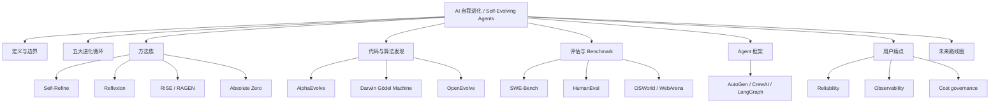

# Self Evolve SEO Blog Series Keyword Map

> Updated: 2026-05-26. Source layer: `paper-drafts/ch1-intro.tex` through `paper-drafts/ch8-future.tex`; site layer: `site/src/content/blog/`.

## One Sentence

The blog strategy converts the English survey paper into people-first, evidence-backed Chinese SEO articles that answer real search intents around self-evolving agents, not shallow keyword pages.

## Editorial Standard

Reference style: Karpathy-like technical clarity.

- Start with the simplest mental model before naming papers.
- Prefer diagrams, tables, code-shaped pseudocode, and checklists over abstract prose.
- Give the reader a decision rule: what to build, what to avoid, and how to verify.
- Link every article back to the evidence chain: paper chapter, research page, project page, benchmark page, or graph.
- Avoid thin summaries. Each post must add synthesis, examples, and operational implications.

## Google-Aligned SEO Guardrails

| Guardrail | Operational Rule |
|---|---|
| Helpful, people-first content | Each post answers a concrete reader problem before optimizing for keywords. |
| Unique analysis | The post must transform a paper chapter into a mental model, checklist, or design rule. |
| Search term coverage | Use both expert terms and beginner terms: `self-evolving agents`, `AI 自我进化`, `Agent 自进化`, `代码自我改进`. |
| Crawlability | Every post is linked from `/blog/`, `/search/`, RSS, and sitemap after build. |
| Structured data | Blog posts emit `BlogPosting` JSON-LD with title, dates, image, tags, author, publisher. |
| Canonical URLs | Every generated page canonicalizes to `https://agent-evolution.com/...`. |

## Chapter-to-Blog Map

| Paper Source | Blog Slug | Primary Intent | Primary Keywords | Internal Links |
|---|---|---|---|---|
| `paper-drafts/ch1-intro.tex` | `self-evolving-ai-introduction-static-to-evolving-agents` | What is self-evolving AI? | AI 自我进化, Self-Evolving Agents, recursive self-improvement | `/paper/`, `/graph/`, `/research/selfevolve/` |
| `paper-drafts/ch2-taxonomy.tex` | `five-evolution-loops-for-ai-agents` | How to classify self-evolution loops? | Five Evolution Loops, Agent 设计, 反馈闭环 | `/graph/`, `/survey/mechanisms/` |
| `paper-drafts/ch3-methods.tex` | `self-improvement-methods-for-llm-agents` | Which self-improvement method should I use? | Self-Refine, Reflexion, RISE, Absolute Zero | `/research/reflexion/`, `/research/self-refine/`, `/research/rise/` |
| `paper-drafts/ch4-evolutionary.tex` | `evolutionary-code-and-algorithm-discovery` | Why are AlphaEvolve and DGM important? | AlphaEvolve, DGM, OpenEvolve, 代码自我改进 | `/research/alphaevolve/`, `/research/darwin-godel-machine/`, `/projects/algorithmicsuperintelligence-openevolve/` |
| `paper-drafts/ch5-evaluation.tex` | `evaluation-benchmarks-for-self-evolving-agents` | How should self-evolving agents be evaluated? | Agent 评估, SWE-Bench, HumanEval, Benchmark | `/benchmark/`, `/star-analysis/` |
| `paper-drafts/ch6-frameworks.tex` | `agent-frameworks-evolution-layer` | Are Agent frameworks self-evolving? | AutoGPT, AutoGen, CrewAI, LangGraph, DSPy | `/projects/`, `/rank/` |
| `paper-drafts/ch7-painpoints.tex` | `user-painpoints-production-self-evolving-agents` | What do users actually need from agents? | Agent 痛点, 可观测性, 生产部署, Mom Test | `/reviews/`, `/reports/` |
| `paper-drafts/ch8-future.tex` | `future-roadmap-for-self-evolving-ai-agents` | What is the future roadmap? | AI 自我进化未来, Agent 安全, 记忆系统, 评估器 | `/survey/`, `/graph/` |

## Topic Cluster Graph

## External Setup Checklist

| Platform | Action | Status |
|---|---|---|
| GitHub Pages | Custom domain set to `agent-evolution.com` | Done |
| Hostinger DNS | A records for apex + `www` CNAME to GitHub Pages | User action pending/propagation pending |
| Google Search Console | Add Domain property for `agent-evolution.com`; add DNS TXT verification in Hostinger | Pending token |
| Google Search Console | Submit `https://agent-evolution.com/sitemap-index.xml` | Pending DNS + HTTPS |
| Bing Webmaster Tools | Add site or import from Search Console; add DNS TXT if needed | Pending token |
| Rich Results Test | Test one blog post and one project model-card page | Pending deployment |
| URL Inspection | Request indexing for `/`, `/blog/`, `/search/`, top 8 blog posts | Pending Search Console ownership |

## Next Content Queue

1. Turn benchmark tables into one dedicated `SWE-Bench vs HumanEval vs OSWorld` article.
2. Turn `paper-drafts/github-project-data-analysis-en.tex` into a GitHub data story article.
3. Write project-specific deep dives for AlphaEvolve, DGM, OpenEvolve, Reflexion, Self-Refine.
4. Add bilingual excerpts for high-intent English queries after Chinese pages stabilize.
