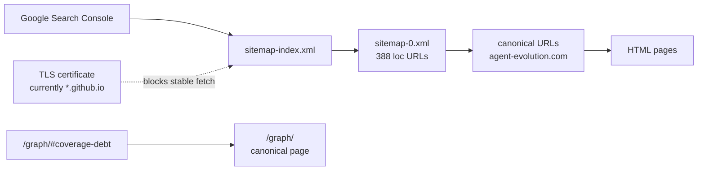

# Google Indexing Triage — 2026-06-01

## One Sentence

`agent-evolution.com` 必须继续作为公开 canonical 域名；当前 GSC 的 sitemap、HTTPS、redirect 和 canonical 问题，主因是 GitHub Pages 自定义域名证书尚未正确服务，而不是 sitemap 生成为空。

## 2026-06-06 Redirect Update

Search Console 新增 “网页会自动重定向 / Page with redirect” 时，先看 [../../reports/google-redirect-indexability.md](../../reports/google-redirect-indexability.md)。本次分诊显示当前 build 的 sitemap/canonical hygiene 通过：`985` 条 sitemap URL 没有 `http`、`www`、fragment、query 或缺尾斜杠，抽样 canonical URL 在 relaxed HTTPS 下返回 `200`，未发现 sitemap URL 自身重定向。当前仍要修的是 GitHub Pages 外部发布状态：`https_enforced=false`，证书 SAN 不覆盖 `agent-evolution.com`，旧 GitHub Pages URL 和 `www/http` 入口会继续把 Google 带到非最终入口。

## Three Sentences

线上 `https://agent-evolution.com/sitemap-index.xml` 能返回 sitemap index，`sitemap-0.xml` 当前有 `388` 个 `<loc>` 地址。证书检查显示 `agent-evolution.com:443` 当前返回的是 `*.github.io` 证书，SAN 不包含 `agent-evolution.com`，所以普通 HTTPS 抓取会失败并触发 GSC 的 HTTPS / sitemap 读取异常。`agent-evolution.com/graph/#coverage-debt` 应按 `/graph/` 处理：页面 canonical 是 `https://agent-evolution.com/graph/`，锚点存在，但 fragment 不应进入 canonical 或 sitemap。

## Five-Sentence Diagnosis

1. `site/astro.config.mjs`、`site/src/data/site.ts`、`robots.txt` 和 sitemap 必须统一输出 `https://agent-evolution.com`。
2. `site/public/CNAME` 必须保留 `agent-evolution.com`，否则 GitHub Pages 会回到 repository Pages URL，造成 public URL 漂移。
3. 当前 sitemap 不是“没有 URL”：本地/线上读取到 `sitemap-index.xml -> sitemap-0.xml`，其中 `sitemap-0.xml` 有 `388` 个 URL。
4. 当前真正阻断 Google 稳定抓取的是 TLS：`curl https://agent-evolution.com/sitemap-index.xml` 会证书校验失败，`openssl s_client -servername agent-evolution.com` 显示证书 CN/SAN 仍是 GitHub 默认域。
5. Google canonical 文档要求 sitemap、redirect、`rel=canonical` 不要互相冲突，并且不要把 `#fragment` 作为 canonical；因此 `agent-evolution.com/graph/#coverage-debt` 应提交和检查 `https://agent-evolution.com/graph/`。

## Current Evidence

| Check | Result | Meaning |
|---|---|---|
| `curl -k https://agent-evolution.com/sitemap-index.xml` | returns sitemap index | Sitemap endpoint exists. |
| `curl -k https://agent-evolution.com/sitemap-0.xml` | `388` `<loc>` entries | Sitemap has URLs. |
| `curl https://agent-evolution.com/sitemap-index.xml` | certificate verification fails | Google may fail HTTPS sitemap fetch until cert is fixed. |
| `openssl s_client -servername agent-evolution.com` | certificate subject `CN=*.github.io`; SAN lacks `agent-evolution.com` | GitHub Pages custom-domain certificate is not serving yet. |
| `curl -k https://agent-evolution.com/graph/` | canonical `https://agent-evolution.com/graph/`; contains `coverage-debt` | Fragment URL should collapse to `/graph/`. |

## Live Retest — 2026-06-01 18:30 +0800

| Check | Result | Meaning |
|---|---|---|
| `gh api repos/Shiyao-Huang/awesome-agent-evolution/pages` | `cname=agent-evolution.com`, `build_type=workflow`, `https_enforced=false`, `https_certificate=null` | GitHub Pages knows the custom domain, but no certificate is attached yet. |
| `gh api repos/Shiyao-Huang/awesome-agent-evolution/pages/health` | apex and `www` are valid, DNS resolves, both are served by Pages, `responds_to_https=false`, `https_error=peer_failed_verification`, `is_https_eligible=true` | DNS is pointed correctly; the remaining blocker is certificate provisioning / HTTPS enforcement. |
| `dig agent-evolution.com A` | GitHub Pages IPs `185.199.108.153` through `185.199.111.153` | Apex DNS is correct for GitHub Pages. |
| `dig www.agent-evolution.com CNAME` | `shiyao-huang.github.io.` | `www` points to the GitHub Pages user domain and redirects to apex. |
| `curl -fsS https://agent-evolution.com/` | fails with `SSL: no alternative certificate subject name matches target host name` | Strict HTTPS clients, including Googlebot, can still fail the canonical domain. |
| `curl -k https://agent-evolution.com/sitemap-0.xml` | `388` `<loc>` entries | Sitemap generation remains healthy; do not debug this as an empty sitemap issue. |
| `curl https://shiyao-huang.github.io/awesome-agent-evolution/` | 301 to `http://agent-evolution.com/` | The GitHub Pages URL should not be submitted as canonical; it funnels back to the custom domain. |

## All-Pages Retest — 2026-06-01 19:13 +0800

| Check | Result | Meaning |
|---|---|---|
| `(cd site && npm run build)` | builds `388` static pages | All generated pages are buildable. Existing TypeScript hints remain non-blocking; there are `0 errors`. |
| `(cd site && npm run seo:audit)` | `SEO audit passed: 388 HTML pages checked.` | All local HTML pages have useful title, meta description, canonical URL, JSON-LD, no conflicting GitHub Pages canonical, and required generated assets. |
| `site/dist/sitemap-0.xml` | `388` `<loc>` entries | The sitemap covers the generated HTML page set. |
| `gh api -X PUT .../pages -f cname=agent-evolution.com -f build_type=workflow` | accepted | Re-saved the Pages custom domain via API to nudge certificate provisioning. |
| `gh api -X PUT .../pages ... -F https_enforced=true` | rejected: `The certificate does not exist yet` | HTTPS cannot be enforced until GitHub creates the certificate. |
| Pages API after re-save | `https_certificate=null`, `https_enforced=false` | Still waiting on GitHub Pages certificate provisioning. |

Conclusion: the "all pages" indexing blocker is not per-page SEO metadata. It is a domain-wide HTTPS certificate blocker; until the certificate exists, every canonical `https://agent-evolution.com/...` URL can fail strict fetch.

## Crawl Signal Map

## Code Guardrail

The site build keeps `agent-evolution.com` as the default public URL while still allowing an explicit `PUBLIC_SITE_URL` override for emergency previews. The GitHub Pages workflow passes `PUBLIC_SITE_URL=https://agent-evolution.com` and `GITHUB_PAGES_CUSTOM_DOMAIN=agent-evolution.com`, and the SEO audit checks that CNAME, canonical URLs, robots, and sitemap URLs agree.

## External Fix Checklist

| Step | Owner Surface | Expected Result |
|---|---|---|
| Confirm GitHub Pages custom domain is exactly `agent-evolution.com` | GitHub repo Settings -> Pages | Pages domain matches CNAME. |
| Wait for / re-request GitHub Pages certificate | GitHub repo Settings -> Pages | Certificate covers `agent-evolution.com`; `gh api .../pages` shows a non-null `https_certificate`. |
| Enable Enforce HTTPS | GitHub repo Settings -> Pages | `https_enforced=true`; `http://agent-evolution.com/*` redirects to `https://agent-evolution.com/*`. |
| Run all-pages audit | Local site build | `(cd site && npm run build && npm run seo:audit)` passes and sitemap has 388 URLs. |
| Submit sitemap | Google Search Console domain property | Submit `https://agent-evolution.com/sitemap-index.xml`. |
| Inspect canonical page, not fragment | Google URL Inspection | Use `https://agent-evolution.com/graph/`, not `https://agent-evolution.com/graph/#coverage-debt`. |
| Request validation | Google Search Console indexing reports | Re-run validation after HTTPS passes live test. |

## References

- Google Search Central: canonicalization uses signals such as HTTPS, redirects, sitemap inclusion, and `rel=canonical`: <https://developers.google.com/search/docs/crawling-indexing/canonicalization>
- Google Search Central: do not specify URL fragments as canonicals; sitemap URLs are canonical hints: <https://developers.google.com/search/docs/crawling-indexing/consolidate-duplicate-urls>
- GitHub Docs: custom-domain HTTPS can take time after configuration, and removing/re-adding the custom domain may trigger HTTPS provisioning after DNS changes: <https://docs.github.com/en/pages/configuring-a-custom-domain-for-your-github-pages-site/troubleshooting-custom-domains-and-github-pages>
