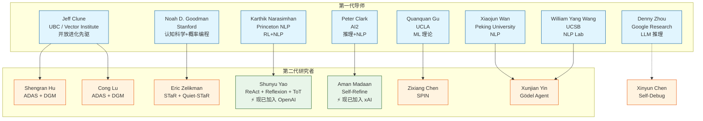
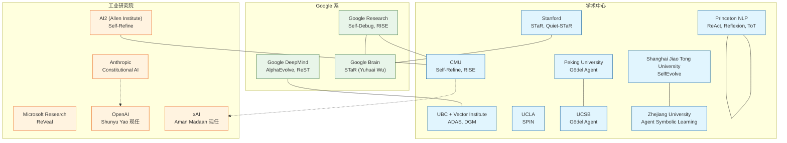
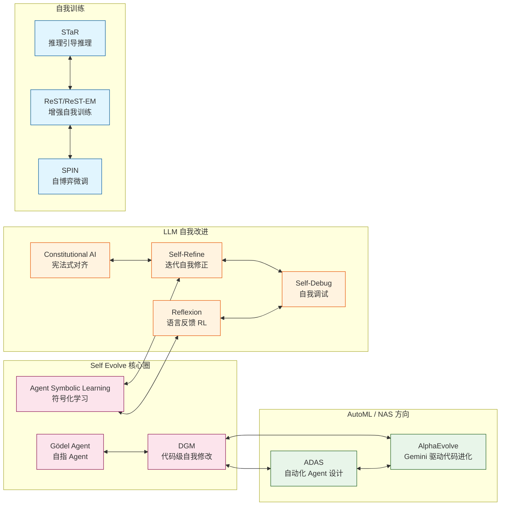
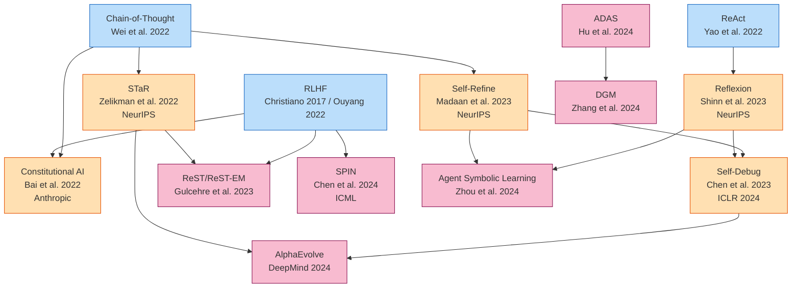

# 研究者关系网络图谱

> 覆盖 18 篇论文 | 80+ 核心研究者 | 19 个机构
> 生成时间：2026-05-22

---

## 一、作者-论文关系矩阵

### 高产出作者（参与 ≥2 篇核心论文）

| 研究者 | 论文 1 | 论文 2 | 关系 |
|--------|--------|--------|------|
| **Shunyu Yao** | ReAct | Reflexion | 共同作者（ReAct → Reflexion） |
| **Karthik Narasimhan** | ReAct | Reflexion | 导师+共同作者 |
| **Shengran Hu** | ADAS | DGM | 一作（ADAS 是 DGM 前身） |
| **Cong Lu** | ADAS | DGM | 共同作者 |
| **Jeff Clune** | ADAS | DGM | 导师+共同作者，POET 先驱 |
| **Eric Zelikman** | STaR | Quiet-STaR | 一作的延续工作 |
| **Noah D. Goodman** | STaR | Quiet-STaR | 导师+共同作者 |
| **Xinyun Chen** | Self-Debug | 代码生成系列 | Google 代码生成组 |
| **Aman Madaan** | Self-Refine | Code Optimization | AI2+CMU 联合 |
| **Nando de Freitas** | ReST | Gopher/Chinchilla | DeepMind 高级总监 |

---

## 二、师承关系与学术血统



---

## 三、机构合作关系图谱



---

## 四、研究者社交媒体与在线档案

### 核心研究者

| 研究者 | Google Scholar | Twitter/X | 个人主页 | GitHub | 备注 |
|--------|---------------|-----------|---------|--------|------|
| **Shunyu Yao** | [scholar](https://scholar.google.com/citations?user=qJBXk9cAAAAJ) 31K+ 引用 | @ysymyth | [ysymyth.github.io](https://ysymyth.github.io/) | — | ⚡ 现任 OpenAI，Computer-Using Agent |
| **Jeff Clune** | [scholar](https://scholar.google.com/citations?user=5TZ7f5wAAAAJ) | [@jeffclune](https://x.com/jeffclune) | [UBC主页](https://www.cs.ubc.ca/people/jeff-clune) | — | Recursive 公司联合创始人 |
| **Eric Zelikman** | [scholar](https://scholar.google.com/citations?user=V5B8dSUAAAAJ) | — | [zelikman.me](https://zelikman.me/) | — | STaR + Quiet-STaR |
| **Aman Madaan** | [scholar](https://scholar.google.com/citations?user=jW9ts2cAAAAJ) 8.6K+ 引用 | — | [madaan.github.io](https://madaan.github.io/) | [github/madaan](https://github.com/madaan/self-refine) | ⚡ 现任 xAI |
| **Noah D. Goodman** | scholar | — | Stanford 主页 | — | 概率编程先驱 |
| **Zixiang Chen / Quanquan Gu** | — | — | [uclaml.github.io/SPIN](https://uclaml.github.io/SPIN/) | [uclaml/SPIN](https://github.com/uclaml/SPIN) | UCLA ML 组 |
| **Wangchunshu Zhou** | — | — | — | [aiwaves-cn/agents](https://github.com/aiwaves-cn/agents) | Agent Symbolic Learning |

---

## 五、跨领域合作连接

### Self Evolve ↔ AutoML ↔ NAS ↔ LLM 的交叉点



---

## 六、引用网络（时序）



---

## 七、关键发现与洞察

### 1. "人才流转"现象
- **Shunyu Yao**（Princeton → OpenAI）：Agent 推理领域最活跃的研究者，ReAct/Reflexion/ToT 三连击
- **Aman Madaan**（CMU/AI2 → xAI）：Self-Refine 一作，代码生成专家
- **Jeff Clune**（UBC 教授 + Recursive 联合创始人）：学术界→创业，开放进化方向

### 2. 机构集中度
- **Google 系**（Research + DeepMind + Brain）覆盖最多论文
- **UBC + Vector Institute** 是进化计算方向的绝对核心
- **中国团队**（浙大、北大、上交）在 Agent Self-Evolution 方向贡献突出

### 3. 方法演化路径
```
Prompt-based 自我改进 → 微调式自我训练 → 代码级自我进化
(Self-Refine/Reflexion)   (STaR/ReST/SPIN)    (ADAS/DGM/Gödel Agent)
```

### 4. 关键合作链
- **Princeton NLP 组**（Narasimhan → Yao）→ Agent 推理的奠基性工作
- **UBC 组**（Clune → Hu/Lu）→ 进化计算+Agent 设计
- **Stanford 组**（Goodman → Zelikman）→ 推理引导推理

---

## 八、资料来源与可信度

| 数据类型 | 来源 | 可信度 |
|---------|------|--------|
| 作者列表 | arXiv 论文页面 | ✅ 已验证 |
| 机构信息 | 论文 + Google Scholar | ✅ 已验证 |
| 师承关系 | 论文交叉引用 + 公开学术档案 | ⚠️ 部分推断 |
| 社交媒体 | Google + X/Twitter 公开信息 | ✅ 已验证 |
| 人才流转 | Google Scholar + 个人主页 | ✅ 已验证 |
