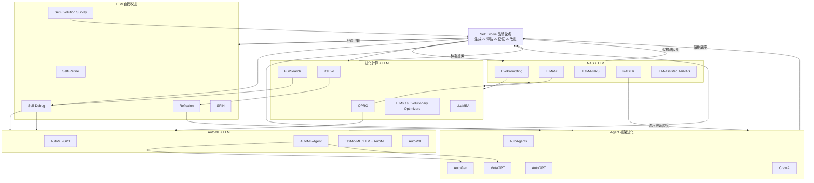

# Self Evolve 跨领域研究图谱

日期：2026-05-22

范围：AutoML + LLM、NAS + LLM、LLM 自我改进、进化计算 + LLM，以及 AI Agent 框架进化。Wiki 检查：当前仓库快照中没有 `wiki/log.md` 内容，因此没有本地历史经验需要调整本次计划。

## 执行摘要

Self Evolve 位于五类循环的交叉点：

1. **规格到执行循环**：将自然语言目标转换为可运行的 ML / Agent 流水线。
2. **搜索循环**：探索架构、提示词、代码、Agent 与超参数。
3. **评估器循环**：通过测试、基准、验证器或部署指标为候选方案打分。
4. **反思循环**：把失败转化为记忆、反馈或修订后的候选生成器。
5. **种群循环**：维护多个候选方案 / Agent，并对其选择、变异、重组或特化。

核心品牌论点：**Self Evolve 不是单一论文类别，而是统一“生成、评估、记忆、改进”系统的产品与研究层。**

## 1. AutoML + LLM

| 代表工作 | 方法 | 关键创新 | 与 Self Evolve 的关联 |
|---|---|---|---|
| [AutoML-GPT: Automatic Machine Learning with GPT](https://arxiv.org/abs/2305.02499) | 使用 GPT 作为自然语言桥梁，将任务卡、模型卡、数据卡转换为数据处理、模型架构、超参优化与训练日志预测。 | 把 AutoML 从固定工具箱扩展为提示词驱动的规划与执行流水线。 | 高：直接对应 Self Evolve 的“目标到实验”循环，说明自然语言规格可以驱动模型搜索。 |
| [AutoML-Agent: A Multi-Agent LLM Framework for Full-Pipeline AutoML](https://arxiv.org/abs/2410.02958) | 将完整 AutoML 拆分为数据检索、预处理、建模、评估、部署等专用 Agent，并结合检索增强规划与多阶段验证。 | 把 AutoML 变成协作式多 Agent 工作流，而不是单一规划器。 | 很高：最接近 Self Evolve 的产品架构类比，包括规划器、执行者、验证器与可部署产物。 |
| [Large Language Models Synergize with Automated Machine Learning](https://arxiv.org/abs/2405.03727) | 将 LLM 生成与 AutoML 优化结合，用于文本到 ML 程序合成。 | 把 ML 流水线生成视为自主程序合成 + 搜索。 | 高：支持 Self Evolve 的“描述任务 -> 生成优化后的 ML 程序”叙事。 |
| [AutoM3L: Automated Multimodal ML with LLMs](https://arxiv.org/abs/2408.00665) | 使用 LLM 理解模态、用户需求与模型选择，支持多模态 ML 自动化。 | 将 AutoML + LLM 从表格 / CV / NLP 扩展到多模态流水线选择。 | 中高：有助于把 Self Evolve 定位为领域通用系统，而不只是代码 Agent 或基准 Agent。 |

### 小结

- AutoML + LLM 是最接近产品化的方向：任务输入、流水线合成、评估与部署都已经被端到端系统化。
- 当前主要缺口是**持续进化**：多数系统自动化的是单次项目，而 Self Evolve 可以强调跨运行的基准记忆与种群级改进。

## 2. LLM 驱动的神经架构搜索（NAS）

| 代表工作 | 方法 | 关键创新 | 与 Self Evolve 的关联 |
|---|---|---|---|
| [EvoPrompting: Language Models for Code-Level Neural Architecture Search](https://arxiv.org/abs/2302.14838) | 将语言模型作为架构代码的进化算子，在算法推理任务上评估候选 GNN。 | 把代码生成、变异与架构适应度整合进同一个循环。 | 很高：典型的“LLM 提案，基准选择”循环。 |
| [LLMatic: Neural Architecture Search via LLMs and Quality-Diversity Optimization](https://arxiv.org/abs/2306.01102) | 从简单网络出发，用 LLM 引导搜索，并结合质量-多样性优化探索架构空间。 | 不只做单目标爬山，而是强调候选多样性。 | 高：提示 Self Evolve 应保留多样化候选谱系，而不是只保留单个最高分方案。 |
| [LLaMA-NAS: Efficient NAS for Large Language Models](https://huggingface.co/papers/2405.18377) | 搜索压缩 / 高效 LLM 架构，优化尺寸、吞吐与准确率权衡。 | 将 NAS 应用于 LLM 部署效率。 | 中高：适合支撑“自进化推理栈”的故事。 |
| [NADER: Neural Architecture Design via Multi-Agent Collaboration](https://arxiv.org/abs/2412.19206) | 将神经架构设计表示为基于 LLM 的多 Agent 协作过程。 | 将 NAS 与 Agent 专业化、协作组织连接起来。 | 很高：连接 Agent 框架研究与架构进化。 |
| [LLM-assisted Adversarial Robustness NAS](https://arxiv.org/abs/2406.05433) | 使用 LLM 辅助优化器，在 NAS-Bench-201 / ARNAS 任务上搜索鲁棒架构。 | 表明 LLM 优化器可以面向对抗鲁棒性等非标准目标。 | 中：验证 Self Evolve 可以做多目标循环，而不仅是最大化准确率。 |

### 小结

- NAS + LLM 提供了最强的技术隐喻：**架构 / 代码就是可进化基因组**。
- 质量-多样性与多目标搜索应进入 Self Evolve 词汇体系：谱系、适应度、新颖性、鲁棒性、部署成本。

## 3. LLM 自我改进与反思

| 代表工作 | 方法 | 关键创新 | 与 Self Evolve 的关联 |
|---|---|---|---|
| [Self-Refine](https://arxiv.org/abs/2303.17651) | 同一个 LLM 生成答案、批评答案，并在推理时迭代改写。 | 不需要额外训练，反馈循环存在于推理阶段。 | 高：是轻量级 Self Evolve 循环的基线模式。 |
| [Reflexion](https://arxiv.org/abs/2303.11366) | Agent 将任务反馈转化为自然语言反思，并存入情景记忆用于后续尝试。 | 用语言记忆替代昂贵的强化学习参数更新。 | 很高：直接对应产品记忆、运行日志、回归记录和基准驱动的 Agent 学习。 |
| [Teaching LLMs to Self-Debug](https://arxiv.org/abs/2304.05128) | LLM 基于执行结果、测试或自然语言调试信息解释并修复自己生成的程序。 | 将执行反馈作为一等自修复信号。 | 很高：直接匹配代码 Agent 进化与 CI / 测试循环。 |
| [SPIN: Self-Play Fine-Tuning](https://arxiv.org/abs/2401.01335) | 从 SFT 模型出发，通过自博弈微调把弱语言模型提升为更强模型。 | 从提示时纠错推进到训练时自博弈。 | 中高：支持 Self Evolve 的长期模型改进叙事，但成本高于 Agent 记忆层改进。 |
| [Survey on Self-Evolution of LLMs](https://arxiv.org/abs/2404.14387) | 将自进化组织为经验获取、经验优化、模型更新与评估四个阶段。 | 为自主 LLM 改进循环提供分类法。 | 很高：适合作为 SEO / 博客骨架和品牌概念框架。 |

### 小结

- 这个方向提供 Self Evolve 的品牌语言：**经验获取 -> 经验优化 -> 更新 -> 评估**。
- Self Evolve 的差异化在于统一提示时改进、Agent 记忆、代码测试、基准评测与种群搜索，而不是把它们视为孤立技巧。

## 4. 进化计算 + LLM / LLM 即优化器

| 代表工作 | 方法 | 关键创新 | 与 Self Evolve 的关联 |
|---|---|---|---|
| [Large Language Models as Optimizers / OPRO](https://arxiv.org/abs/2309.03409) | 用自然语言描述优化任务，LLM 基于历史解与分数提出新候选。 | 把提示历史 + 分数变成通用优化器接口。 | 很高：是 Self Evolve 在标量反馈下生成候选的通用模板。 |
| [Large Language Models as Evolutionary Optimizers](https://arxiv.org/abs/2310.19046) | 研究 LLM 作为进化式组合优化器，在很少领域知识下解决组合优化问题。 | 明确把 LLM 生成与进化组合搜索连接起来。 | 高：支撑“LLM 可作为变异 / 重组算子”的广义说法。 |
| [FunSearch](https://www.nature.com/articles/s41586-023-06924-6) | 将 LLM 与评估器结合，进化用于数学 / 科学发现的程序。 | 展示评估器约束下的程序进化能够产生有用发现。 | 很高：是“LLM + 验证器 + 进化能超越一次性生成”的旗舰案例。 |
| [ReEvo](https://huggingface.co/papers/2402.01145) | 通过反思式进化生成组合优化的超启发式与神经求解器。 | 将反思与启发式程序的进化搜索结合。 | 高：对应 Self Evolve 需要的反馈丰富型优化循环。 |
| [LLaMEA](https://arxiv.org/abs/2405.20132) | 在进化算法中使用 LLM 自动生成并优化元启发式算法。 | 进化的不是任务解，而是优化器本身。 | 很高：最强的“改进改进者”类比。 |

### 小结

- 进化计算给 Self Evolve 最清晰的机制：生成候选、打分、选择、变异 / 重组、保留谱系。
- FunSearch / OPRO / ReEvo 暗示一种产品架构：每个产物都有**适应度函数**，每次运行都有**轨迹**，每次改进都有**谱系**。

## 5. AI Agent 框架进化模块

| 代表工作 / 框架 | 方法 | 关键创新 | 与 Self Evolve 的关联 |
|---|---|---|---|
| [AutoGPT](https://github.com/Significant-Gravitas/AutoGPT) | 面向目标驱动工作流的自主 Agent 平台，并包含 Agent 评估基础设施。 | 普及了目标驱动 LLM Agent 与可复用 Agent 协议。 | 中高：适合作为市场 / 历史锚点；若无评估循环，本身不完全等同进化。 |
| [MetaGPT](https://arxiv.org/abs/2308.00352) | 将人类软件公司工作流编码为 SOP 驱动的多 Agent 协作。 | 通过角色专业化与结构化流程稳定多 Agent 产出。 | 高：说明“进化”也需要组织、角色与流程记忆。 |
| [AutoGen](https://arxiv.org/abs/2308.08155) | 支持可对话、可定制 Agent、人类参与、工具使用与多 Agent 工作流模式。 | 为复杂 LLM 应用提供灵活的 Agent 对话底座。 | 高：是 Self Evolve 多 Agent 编排层的重要实现类比。 |
| [CrewAI](https://docs.crewai.com/introduction) | 面向生产的 crews 与 flows 框架，将协作式 Agent 与确定性流程控制结合。 | 区分 Agent 协作与精确工作流编排。 | 中高：适合产品对比，“Agent 团队 + 评估 / 进化层”。 |
| [AutoAgents](https://arxiv.org/abs/2309.17288) | 根据任务需求自动生成并协调专用 Agent。 | 让 Agent 团队组成自适应，而不是固定不变。 | 很高：直接对应组织拓扑、Agent 角色与任务专用团队的进化。 |

### 小结

- Agent 框架提供编排原语，但多数尚未形成持久的**进化层**。
- Self Evolve 可定位为 Agent 之上的缺失层：评估器、记忆、谱系、回归防护与对提示词 / 工具 / 角色的自动搜索。

## 面向博客 / Landing Page 的跨领域综合定位

### 核心对比

| 领域 | 被进化的对象 | 生成器 | 评估器 | 记忆 | Self Evolve 角度 |
|---|---|---|---|---|---|
| AutoML + LLM | ML 流水线 / 程序 | 规划器 + 任务 Agent | 数据集指标、部署检查 | 流水线历史 | 自然语言到优化实验 |
| NAS + LLM | 架构 / 代码 | LLM 变异 / 搜索 | NAS 基准、准确率 / 成本 | 候选谱系 | 架构基因组与质量-多样性 |
| LLM 自我改进 | 输出、推理轨迹、模型权重 | 同一 / 对等 LLM | 人类 / 自动 / 任务反馈 | 反思、轨迹、微调数据 | 经验飞轮 |
| 进化计算 + LLM | 程序、提示词、启发式 | LLM 作为优化器 / 变异器 | 目标函数 | 种群档案 | 通用进化引擎 |
| Agent 框架 | Agent 角色、工作流、工具 | 规划器 / 框架 | 任务完成度、评估套件 | SOP、对话、日志 | 进化式 Agent 组织 |

### 建议 SEO / 博客主题簇

1. **“什么是自进化 AI？”**：使用 Self-Refine、Reflexion、SPIN、自进化综述。
2. **“LLM 即优化器”**：使用 OPRO、FunSearch、ReEvo、LLaMEA。
3. **“AutoML Agent”**：使用 AutoML-GPT、AutoML-Agent、Text-to-ML。
4. **“LLM for NAS”**：使用 EvoPrompting、LLMatic、NADER、LLaMA-NAS。
5. **“Agent 进化层”**：比较 AutoGPT、AutoGen、MetaGPT、CrewAI、AutoAgents。

## Mermaid 关系图

## 对 Self Evolve 的实践启示

- **产品架构**：围绕候选生成、评估器、轨迹记忆、回归防护与谱系看板来构建。
- **研究叙事**：引用 AutoML、NAS、自我反思、进化、Agent 作为同一范式正在汇合的证据。
- **差异化**：不要声称替代 AutoGPT / MetaGPT / CrewAI；应声称在其上增加持久的评估器-记忆-进化层。
- **值得关注的基准**：Self-Debugging 可关注 HumanEval / MBPP / Spider；NAS 可关注 NAS-Bench-201 / 360；提示词优化可关注 GSM8K / BBH；AutoML-Agent 可关注领域数据集；Agent 框架可关注任务完成评估。

## 来源索引

本报告使用的主要来源包括 arXiv、Nature、GitHub 与官方文档页面，覆盖 AutoML-GPT、AutoML-Agent、LLM + AutoML、AutoM3L、EvoPrompting、LLMatic、LLaMA-NAS、NADER、LLM-assisted ARNAS、Self-Refine、Reflexion、Self-Debugging、SPIN、Self-Evolution Survey、OPRO、LLMs as Evolutionary Optimizers、FunSearch、ReEvo、LLaMEA、AutoGPT、MetaGPT、AutoGen、CrewAI 与 AutoAgents。
