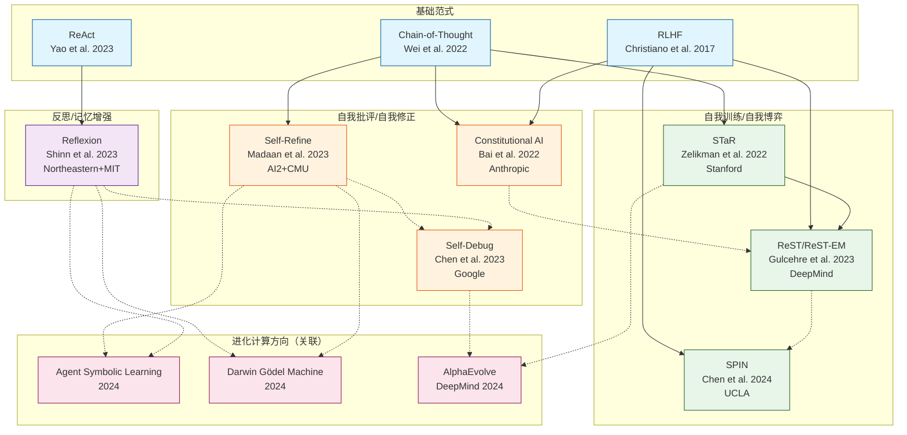
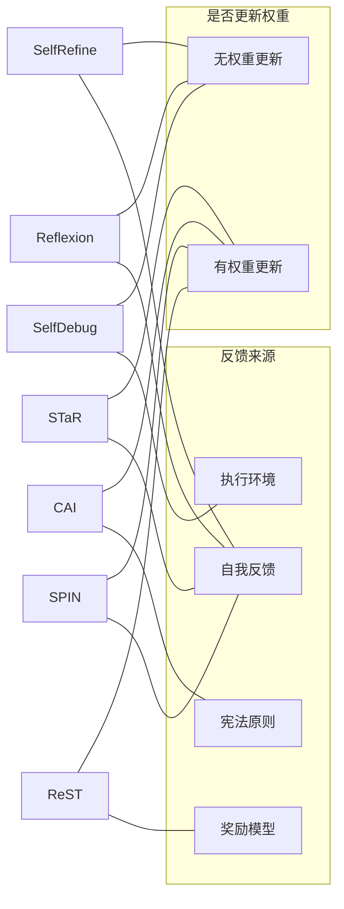

# LLM 自我改进方向：作者关系网络与跨论文图谱

> 覆盖论文：Self-Refine, Self-Debug, Reflexion, Constitutional AI, SPIN, STaR, ReST
> 附加关联：AlphaEvolve, DGM, Gödel Agent, ADAS, Agent Symbolic Learning

---

## 一、核心作者网络

### 1. 学术血统与师承关系

```
Noah Goodman (Stanford 认知科学)
  └── Eric Zelikman (STaR, Quiet-STaR)
      Stanford → 后续在自我推理领域持续输出

Karthik Narasimhan (Princeton NLP)
  └── Shunyu Yao (ReAct, Tree of Thoughts, Reflexion)
      Princeton NLP 组 → Agent 推理领域的核心人物

Quanquan Gu (UCLA ML)
  └── Zixiang Chen, Yihe Deng (SPIN)
      UCLA 机器学习理论组 → 博弈论视角的 LLM 对齐

Peter Clark (AI2 推理组)
  └── Aman Madaan (Self-Refine)
      AI2 + CMU 联合培养 → 迭代优化范式
```

### 2. 机构聚集度

| 机构 | 涉及论文 | 核心人物 |
|------|---------|---------|
| **Google Research / DeepMind** | Self-Debug, ReST, AlphaEvolve | Xinyun Chen, Denny Zhou, Caglar Gulcehre |
| **Stanford** | STaR, Quiet-STaR | Eric Zelikman, Noah Goodman |
| **Princeton NLP** | Reflexion, ReAct, ToT | Shunyu Yao, Karthik Narasimhan |
| **AI2 + CMU** | Self-Refine | Aman Madaan, Peter Clark |
| **UCLA** | SPIN | Zixiang Chen, Quanquan Gu |
| **Anthropic** | Constitutional AI | Yuntao Bai, Dario Amodei |
| **Northeastern + MIT** | Reflexion | Noah Shinn, Ashwin Gopinath |

### 3. 跨论文合作连线

| 人物 | 论文 A | 论文 B | 关系 |
|------|--------|--------|------|
| Shunyu Yao | ReAct | Reflexion | 共同作者（ReAct 为 Reflexion 前身） |
| Aman Madaan | Self-Refine | 后续 Code Optimization | 同一研究线 |
| Xinyun Chen | Self-Debug | 代码生成系列 | Google 代码生成组 |
| Eric Zelikman | STaR | Quiet-STaR | 一作的延续工作 |
| Dario Amodei | Constitutional AI | — | Anthropic CEO |

---

## 二、论文引用关系网络

### 引用链条

```
Chain-of-Thought (Wei et al., 2022)
  ├── STaR (Zelikman et al., 2022) ← "用 CoT 推理引导自我训练"
  ├── Self-Refine (Madaan et al., 2023) ← "用 CoT 做自我批评"
  └── Constitutional AI (Bai et al., 2022) ← "用 CoT 做 AI 评估"

ReAct (Yao et al., 2023)
  └── Reflexion (Shinn et al., 2023) ← "给 ReAct 加反思记忆"

RLHF (Christiano et al., 2017; Ouyang et al., 2022)
  ├── Constitutional AI (RLAIF 替代 RLHF)
  ├── ReST (用奖励模型替代人类标注)
  └── SPIN (用自博弈替代偏好数据)

STaR + ReST → "Generate-Filter-Finetune" 范式
  ├── ReST-EM (更明确的 EM 框架)
  └── Beyond Human Data (Singh et al., 2023)

Self-Refine + Reflexion → "迭代自我改进" 范式
  ├── Self-Debug (特定于代码，加执行反馈)
  └── Agent Symbolic Learning (将 verbal feedback 形式化)
```

---

## 三、Mermaid 关系图谱

### 总图：LLM 自我改进方法族



### 方法分类矩阵



---

## 四、时间线演化

```
2022.03  STaR           ← 推理引导推理的先驱
2022.05  Chain-of-Thought ← 基础范式确立
2022.12  Constitutional AI ← AI 反馈替代人类反馈
2023.03  Reflexion      ← 语言反馈 = verbal RL
2023.03  Self-Refine    ← 单模型迭代自我改进
2023.04  Self-Debug     ← 橡皮鸭调试
2023.08  ReST           ← EM 风格自我训练
2024.01  SPIN           ← 自博弈微调
2024.05  AlphaEvolve    ← 进化 + LLM（DeepMind）
2024.05  DGM            ← Darwin + Gödel 进化 Agent
```

---

## 五、与 Self Evolve 项目的核心关联总结

| 关键洞察 | 来源论文 | 对 Self Evolve 的启示 |
|---------|---------|---------------------|
| 无训练自我改进可行 | Self-Refine, Reflexion | Agent 可纯靠 prompt 迭代改进 |
| 执行反馈是强信号 | Self-Debug | 代码进化必须有执行验证闭环 |
| 自博弈可替代标注 | SPIN | Agent 间对抗可作为进化压力 |
| 推理引导推理 | STaR | Agent 的推理链可作为进化素材 |
| AI 可监督 AI | Constitutional AI | 宪法原则可作为安全边界 |
| 批量过滤+微调 | ReST | 进化后的优秀个体可回注训练数据 |
