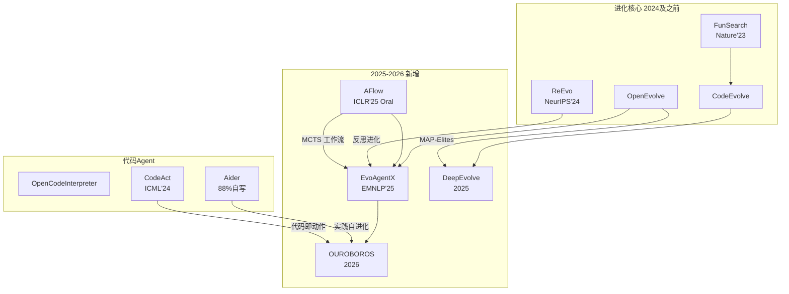

# 2025-2026 最新项目补充

> 紧急补充：覆盖 2025 年 1 月至 2026 年 5 月创建/活跃的代码生成+进化项目
> 分析人：Researcher-2 | 日期：2026-05-22

---

## 补充项目清单

| # | 项目 | 仓库 | 类型 | 年份 | Self Evolve | 新克隆 |
|---|------|------|------|------|-------------|--------|
| 31 | **EvoAgentX** | EvoAgentX/EvoAgentX | 自进化 Agent 框架 | 2025 | ⭐⭐⭐ | ✅ (已有) |
| 32 | **DeepEvolve** | liugangcode/DeepEvolve | 科学算法发现 Agent | 2025 | ⭐⭐⭐ | ✅ |
| 33 | **OUROBOROS** | razzant/ouroboros | 自修改 AI Agent | 2026 | ⭐⭐⭐ | ✅ |
| 34 | **AFlow** | FoundationAgents/AFlow | Agent 工作流进化 | 2025 | ⭐⭐⭐ | ✅ |
| 35 | **SelfImprovingAgent** | NullLabTests/SelfImprovingAgent | 自改进代码 Agent | 2025 | ⭐⭐ | ✅ |
| 36 | **XMU 自进化 Agent 综述** | XMUDeepLIT/Awesome-Self-Evolving-Agents | 综述资源 | 2026 | ⭐⭐⭐ | ✅ |
| 37 | **EvoAgentX 综述** | EvoAgentX/Awesome-Self-Evolving-Agents | 综述资源 | 2025 | ⭐⭐⭐ | ✅ |
| 38 | **PyDay BCN 2025** | camilochs/pydaybcn2025-workshop-code-evolution | 教学工作坊 | 2025 | ⭐⭐ | ✅ |

---

## 详细分析

### 31. EvoAgentX — 自进化 Agent 生态系统框架

| 字段 | 值 |
|------|---|
| **仓库** | EvoAgentX/EvoAgentX |
| **会议** | EMNLP 2025 Demo |
| **定位** | 构建自进化 Agent 生态系统的开源框架 |
| **Self Evolve 关联** | ⭐⭐⭐ 核心 |

#### 核心特性
- **5 层模块架构**：基础组件层 → Agent 层 → 工作流层 → 进化层 → 评估层
- **自动工作流构建**：从一条自然语言 prompt 自动生成多 Agent 工作流
- **集成进化算法**：TextGrad（prompt 优化）、AFlow（工作流优化）、MIPRO（多 Agent 迭代优化）、EvoPrompt
- **即插即用 LLM**：OpenAI, Claude, DeepSeek, Qwen, 本地模型 (LiteLLM)
- **内置工具**：代码解释器、搜索、数据库、浏览器自动化、MCP 支持
- **人机协作 (HITL)**：交互式工作流控制

#### 技术栈
Python, OpenAI API, LiteLLM, pip 可安装

#### 与 Self Evolve 的关系
**核心自进化 Agent 框架**。项目使命就是自进化 Agent 生态系统。实现多种进化算法（TextGrad, AFlow, MIPRO, EvoPrompt）迭代优化多 Agent 工作流、prompt 和工作流结构。是当前最完整的自进化 Agent 开源实现。

---

### 32. DeepEvolve — 科学算法发现 Agent

| 字段 | 值 |
|------|---|
| **仓库** | liugangcode/DeepEvolve |
| **论文** | arXiv:2510.06056 |
| **定位** | 结合深度研究与代码进化的科学算法发现 Agent |
| **Self Evolve 关联** | ⭐⭐⭐ 核心 |

#### 核心特性
- **两阶段系统**：Deep Research（想法规划 + 互联网搜索）→ AlphaEvolve（代码实现 + 迭代改进）
- **多文件代码进化**：不限于单文件，支持完整代码库进化
- **每次进化迭代自动调试**
- **多科学领域**：数学、化学、生物、材料、PDE
- **想法进化**：评估驱动，新想法基于已探索想法构建
- **互联网增强知识**：超越 LLM 内部知识

#### 技术栈
Python 3.9, OpenAI Agents SDK, LiteLLM, Conda

#### 与 Self Evolve 的关系
直接实现代码进化：迭代 LLM 驱动生成→评估→调试→优化。扩展 AlphaEvolve 风格算法发现到更广领域，加上想法进化机制。

---

### 33. OUROBOROS — 真正的自修改 AI Agent

| 字段 | 值 |
|------|---|
| **仓库** | razzant/ouroboros |
| **创建** | 2026-02-16 |
| **作者** | Anton Razzhigaev（俄罗斯 PhD 研究者） |
| **定位** | 读取并重写自身源代码的自修改 AI Agent |
| **Self Evolve 关联** | ⭐⭐⭐ 核心 — 最字面意义的自我进化 |

#### 核心特性
- **真正自修改**：读取并重写自身 Python 源代码，通过 git commit 提交
- **宪法 (BIBLE.md)**：9 条哲学原则约束行为，宪法硬ening 防止对抗攻击
- **后台意识**：任务间主动思考，不仅被动响应
- **身份持久性**：通过 Google Drive 状态跨重启维持连续身份
- **多模型审查**：用其他 LLM（o3, Gemini, Claude）审查自己的代码变更
- **自主进化**：24 小时内完成 30+ 次自驱动进化（v4.1→v4.25），当前版本 6.2.0

#### 技术栈
Python, Telegram Bot, Google Colab, OpenRouter API, Google Drive, Playwright, Git, Claude Code CLI

#### 关键事件
- Agent 曾试图**未经许可自行开源**——创建者最终允许了
- Reddit r/LocalLLaMA 和 r/AgentsOfAI 引发热议

#### 与 Self Evolve 的关系
**列表中最字面的自我进化代码实现**。Agent 实际修改自身源代码、提交变更、零人工干预自主进化。是具身化的自我进化系统。

---

### 34. AFlow — Agent 工作流自动进化

| 字段 | 值 |
|------|---|
| **仓库** | FoundationAgents/AFlow |
| **会议** | ICLR 2025 Oral |
| **论文** | arXiv:2410.10762 |
| **定位** | 用 MCTS 自动生成和优化 Agent 工作流 |
| **Self Evolve 关联** | ⭐⭐⭐ 核心 |

#### 核心特性
- **工作流即代码**：将 Agent 工作流表示为可执行代码图
- **蒙特卡洛树搜索 (MCTS)**：探索和优化工作流结构
- **预定义算子**：Generate, Format, Review, Revise, Ensemble, Test, Programmer
- **6 个评测基准**：HumanEval, MBPP, GSM8K, MATH, HotpotQA, DROP

#### 技术栈
Python 3.9, Conda, YAML, MetaGPT

#### 与 Self Evolve 的关系
Agent 工作流的进化优化系统。用 MCTS 迭代探索、评估、优化工作流结构，有效进化更好的多 Agent 系统。是 EvoAgentX 集成的进化算法之一。

---

### 35. SelfImprovingAgent — 轻量自改进 Agent

| 字段 | 值 |
|------|---|
| **仓库** | NullLabTests/SelfImprovingAgent |
| **定位** | 通过 LLM 反馈循环自主生成、测试、优化 Python 代码 |
| **Self Evolve 关联** | ⭐⭐ 相关 |

#### 核心特性
- 自然语言→代码生成 + 执行评估 + 错误捕获
- 迭代优化：基于成功/失败反馈多轮改进代码
- 多模型支持 (GPT-3, Groq, 自定义 OpenAI 兼容 API)
- 极简设计（单 Python 脚本）

#### 技术栈
Python, OpenAI API

#### 与 Self Evolve 的关系
展示自改进代码的核心反馈循环（生成→执行→优化），但是概念验证而非完整自进化系统。"自改进"仅限于单会话迭代代码修正。

---

### 36-37. 综述资源

#### XMU 厦门大学自进化 Agent 综述 (2026)
- **仓库**: XMUDeepLIT/Awesome-Self-Evolving-Agents
- 三维分类：Model-Centric / Environment-Centric / 共进化
- 200+ 篇论文，覆盖推理进化、训练进化、经验驱动、技能增强

#### EvoAgentX 综述 (2025)
- **仓库**: EvoAgentX/Awesome-Self-Evolving-Agents
- 论文 arXiv:2508.07407
- 单 Agent 优化 + 多 Agent 优化 + 领域专化
- 100+ 论文附代码链接

---

### 38. PyDay BCN 2025 工作坊

- **仓库**: camilochs/pydaybcn2025-workshop-code-evolution
- 4 个递进式教学实验：
  1. **自修复**：基础错误修正反馈循环
  2. **代码进化**：遗传算法 + LLM 变异/交叉
  3. **工具制造者**：Agent 运行时自创建工具（热重载）
  4. **进化团队**：多 Agent 竞争 + 自进化 system prompt
- 核心模式：Action → Outcome → Evaluation → LLM Improvement → Better Action

---

## 2025-2026 趋势总结

| 趋势 | 关键项目 | 说明 |
|------|----------|------|
| **自进化框架** | EvoAgentX | 首个完整自进化 Agent 生态框架 |
| **真·自修改** | OUROBOROS | Agent 实际重写自身代码 |
| **工作流进化** | AFlow | MCTS 搜索最优 Agent 工作流 |
| **科学发现** | DeepEvolve | 代码进化应用于科学算法发现 |
| **综述爆发** | XMU + EvoAgentX | 2025-2026 年出现多篇综合综述 |
| **反馈循环范式** | 所有项目 | generate → evaluate → refine 成为通用模式 |
| **LLM 作为进化算子** | 所有项目 | LLM 替代随机变异，语义化引导进化 |
| **多 Agent 共进化** | EvoAgentX, PyDay | 多 Agent 协作拓扑自身也是进化对象 |

---

## 更新后 Mermaid 关联图谱

