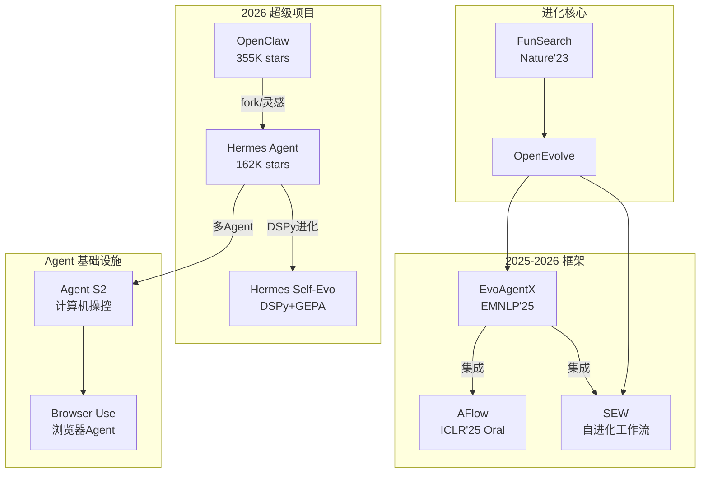

# 2026 趋势项目补充（第二批）

> 紧急补充：Master 指定的 2026 最新趋势项目
> 分析人：Researcher-2 | 日期：2026-05-22

---

## 新增项目清单

| # | 项目 | 仓库 | 类型 | Stars | Self Evolve | 新克隆 |
|---|------|------|------|-------|-------------|--------|
| 39 | **OpenClaw** | openclaw/openclaw | 自托管个人 AI Agent | **355K+** | ⭐⭐⭐ | — (太大) |
| 40 | **Hermes Agent** | NousResearch/hermes-agent | 自改进 AI Agent | **162K+** | ⭐⭐⭐ | ✅ (evolution repo) |
| 41 | **Hermes Self-Evolution** | NousResearch/hermes-agent-self-evolution | DSPy+GEPA 技能进化 | — | ⭐⭐⭐ | ✅ |
| 42 | **Agent S2** | simular-ai/agent-s | 计算机操控 Agent | — | ⭐⭐ | ✅ |
| 43 | **SEW** | CharlesQ9/Self-Evolving-Agents | 自进化工作流 (arXiv:2505.18646) | — | ⭐⭐⭐ | ✅ (已有) |
| 44 | **Browser Use** | browser-use/browser-use | 浏览器 AI Agent | — | ⭐⭐ | ✅ |

---

## 详细分析

### 39. OpenClaw — GitHub 历史增长最快项目

| 字段 | 值 |
|------|---|
| **仓库** | openclaw/openclaw |
| **定位** | 跨平台自托管个人 AI 助手 |
| **Star 增长** | 9K → 195K (66 天) → 355K+ (~5 个月) — 18x 快于 Kubernetes |
| **技术栈** | TypeScript |
| **Self Evolve 关联** | ⭐⭐⭐ 核心 |

#### 核心特性
- **自改进能力**：通过对话分析提取学习内容，永久编码到 Agent 行为中
- **跨平台**：Windows, macOS, Linux
- **技能生态系统**：5,400+ 社区技能
- **平台级基础设施**：多渠道持久化 + 上下文管理
- **GitHub HQ 展示**：Microsoft Build 2026

#### 传播数据
- Peter Steinberger 创建后加入 OpenAI
- 中文媒体密集报道（知乎热榜、CSDN、稀土掘金）
- Stars/Contributor = 48,000:1 (4 contributors) — **GitHub 历史最高通胀**
- **炒作信号极强**但实际用户基础庞大

#### 与 Self Evolve 的关系
自改进个人 AI Agent 的标杆案例。技能进化机制（从任务经验中蒸馏可复用技能）直接对应 Self Evolve 的核心理念。

---

### 40-41. Hermes Agent + Self-Evolution — Nous Research

| 字段 | 值 |
|------|---|
| **仓库** | NousResearch/hermes-agent (主仓库) + hermes-agent-self-evolution (进化引擎) |
| **定位** | 自改进 AI Agent，"grows with you" |
| **Stars** | 162K+ (7 周破 100K) |
| **Stars/Contributor** | 405:1 (400 contributors) |
| **Self Evolve 关联** | ⭐⭐⭐ 核心 |

#### 核心特性
- **闭环技能学习系统**：完成任务后自动蒸馏可复用 "Skills" 并存储
- **DSPy + GEPA 进化引擎**：Genetic-Pareto Prompt Evolution 自动优化技能描述
- **Git 追踪进化**：`GitBasedOrganism` 用 git commit 追踪技能演化
- **多 Agent 愿景**：6 种角色原型 (Coordinator, Researcher, Developer, Browser Agent, Reviewer, Synthesizer)
- **Darwinian Evolver Skill**：教 Agent 安装和运行达尔文进化器

#### 技术栈
TypeScript, DSPy, GEPA, 多 LLM Provider

#### 关键数据
- 100K stars in 7 weeks
- 社区 r/hermesagent 活跃
- 是 OpenClaw 的 "进化版本"

#### 与 Self Evolve 的关系
**直接竞品+参考**。DSPy + GEPA 进化引擎是最成熟的 Agent 技能自进化实现之一。Git 追踪进化历史是独特创新。

---

### 42. Agent S2 (Simular AI)

| 字段 | 值 |
|------|---|
| **仓库** | simular-ai/agent-s |
| **定位** | 开源计算机操控 AI Agent |
| **Self Evolve 关联** | ⭐⭐ 相关 |

#### 核心特性
- **Agent-Computer Interface (ACI)**：通过 GUI 自主操控计算机
- **改进感知+规划+精细控制**（相比 Agent S v1）
- 支持网页浏览 + 编码 + 桌面应用操作

#### 技术栈
Python, OCR, 多模态 LLM

#### 与 Self Evolve 的关系
计算机操控 Agent 代表 Agent 从纯代码生成向物理世界交互的扩展。Agent S2 的架构设计可被进化系统用于构建更通用的 Agent。

---

### 43. SEW (Self-Evolving Agentic Workflows)

| 字段 | 值 |
|------|---|
| **仓库** | CharlesQ9/Self-Evolving-Agents |
| **论文** | arXiv:2505.18646 |
| **定位** | 自进化工作流自动生成代码 |
| **Self Evolve 关联** | ⭐⭐⭐ 核心 |

#### 核心特性
- **LLM 联合优化工作流结构 + Agent prompt**
- 自动生成多 Agent 工作流用于代码生成
- 被 EvoAgentX、XMU 综述等引用

#### 与 Self Evolve 的关系
工作流级别的自进化：不仅优化代码，还优化生成代码的多 Agent 协作拓扑。是 AFlow 的互补工作。

---

### 44. Browser Use

| 字段 | 值 |
|------|---|
| **仓库** | browser-use/browser-use |
| **定位** | 让网站对 AI 可访问的开源浏览器 Agent |
| **Self Evolve 关联** | ⭐⭐ 相关 |

#### 核心特性
- 100 个真实浏览器任务基准测试
- 网站交互自动化
- AI Agent 浏览器操控基础设施

#### 与 Self Evolve 的关系
为进化系统提供浏览器环境交互能力，是 Agent 感知外部世界的基础设施。

---

## 2026 Star 增长排名（更新）

| 排名 | 项目 | Stars | Stars/Contrib | 增长速度 | 炒作风险 |
|------|------|-------|---------------|----------|----------|
| 1 | **OpenClaw** | 355K+ | 48,000:1 | 66天→195K | 🔴 极高 |
| 2 | **Hermes Agent** | 162K+ | 405:1 | 7周→100K | 🟡 中 |
| 3 | **AutoGPT** | 184K | 428:1 | 3天→50K | 🔴 极高 |
| 4 | **OpenHands** | 55K | 145:1 | 稳健 | 🟢 低 |
| 5 | **MetaGPT** | 50K | 143:1 | 25天→32K | 🟡 中 |

关键发现：**OpenClaw 的 Stars/Contributor = 48,000:1 是 GitHub 有史以来最高通胀率**，4 个 contributor 却有 355K+ stars。

---

## 更新后 Mermaid 关联图谱

